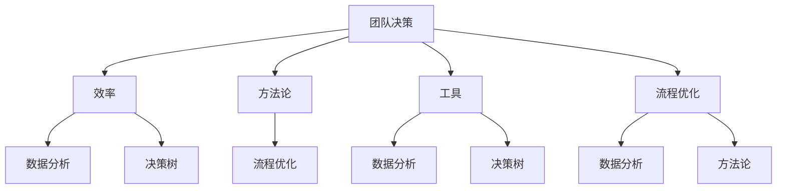

                 


# 如何提高团队的决策效率

> 关键词：团队决策、效率、方法论、工具、流程优化、数据分析
> 
> 摘要：本文深入探讨了如何通过系统的方法论和工具，优化团队的决策流程，从而提高决策效率。本文将分为若干章节，依次介绍团队决策的背景和意义、核心概念和联系、算法原理和操作步骤、数学模型和公式、实际应用案例、工具和资源推荐，以及未来发展趋势与挑战等内容。

## 1. 背景介绍

### 1.1 目的和范围

本文旨在为团队决策提供一个全面的优化框架，通过分析、工具选择和流程改进，帮助团队更快速、更准确地做出决策。本文涵盖的理论和方法不仅适用于IT行业，也适用于其他需要高效决策的行业。

### 1.2 预期读者

本文预期读者为：
1. 管理者和决策者，他们希望了解如何改进团队决策流程。
2. 项目经理和团队成员，他们希望提升工作效率和决策质量。
3. 研究人员和学者，他们对团队决策理论和实践感兴趣。

### 1.3 文档结构概述

本文将分为以下章节：

1. 背景介绍
2. 核心概念与联系
3. 核心算法原理 & 具体操作步骤
4. 数学模型和公式 & 详细讲解 & 举例说明
5. 项目实战：代码实际案例和详细解释说明
6. 实际应用场景
7. 工具和资源推荐
8. 总结：未来发展趋势与挑战
9. 附录：常见问题与解答
10. 扩展阅读 & 参考资料

### 1.4 术语表

#### 1.4.1 核心术语定义

- **团队决策**：团队成员共同做出决定的过程。
- **效率**：在特定时间内做出高质量决策的能力。
- **方法论**：关于如何进行决策的理论或方法。
- **工具**：辅助决策的各种软件或硬件。
- **流程优化**：改进决策过程的步骤和方法。

#### 1.4.2 相关概念解释

- **数据分析**：通过统计和数学方法分析数据，以提取有用信息。
- **决策树**：一种树形结构，用于表示决策过程和结果。

#### 1.4.3 缩略词列表

- **IDE**：集成开发环境（Integrated Development Environment）
- **GPU**：图形处理器（Graphics Processing Unit）
- **CPU**：中央处理器（Central Processing Unit）

## 2. 核心概念与联系

在探讨如何提高团队决策效率之前，我们需要了解一些核心概念和它们之间的关系。以下是一个简单的Mermaid流程图，用于展示这些概念之间的联系：



### 2.1 团队决策与效率的关系

团队决策的效率是指团队在特定时间内做出高质量决策的能力。效率的提高可以显著提升团队的竞争力。一个高效的决策过程通常包括以下步骤：

1. **明确目标**：确定决策的目标和预期结果。
2. **收集信息**：收集与决策相关的所有必要信息。
3. **分析信息**：使用数据分析工具对信息进行分析。
4. **制定方案**：基于分析结果制定多个可能的决策方案。
5. **评估方案**：评估每个方案的优缺点和风险。
6. **选择方案**：选择最佳方案并执行。
7. **反馈与调整**：根据执行结果反馈进行调整。

### 2.2 方法论与流程优化的关系

方法论是关于如何进行决策的理论或方法。有效的方法论可以帮助团队更快速、更准确地做出决策。流程优化则是在方法论的基础上，通过改进决策过程的步骤和方法，进一步提高决策效率。

### 2.3 工具与数据分析的关系

工具是辅助决策的各种软件或硬件。数据分析是提高决策效率的关键环节。通过使用适当的工具，团队可以更快地收集、处理和分析数据，从而提高决策质量。

### 2.4 决策树的应用

决策树是一种用于表示决策过程的树形结构。它通过一系列的问题和答案，将决策过程分解为一系列步骤，并最终得出决策结果。决策树在决策过程中非常有用，可以帮助团队更清晰地理解决策过程，并做出更明智的决策。

## 3. 核心算法原理 & 具体操作步骤

为了提高团队的决策效率，我们需要一套核心算法原理来指导具体操作步骤。以下是一个简单的决策树算法原理，以及如何将其应用于团队决策的具体操作步骤：

### 3.1 决策树算法原理

决策树是一种用于表示决策过程的树形结构。每个节点代表一个决策点，每个分支代表一个可能的决策方案，每个叶子节点代表一个决策结果。

伪代码如下：

```python
def decision_tree(data, attributes):
    if data is empty:
        return majority_label(data)
    else:
        best_attribute = find_best_attribute(data, attributes)
        node = Node(best_attribute)
        for value in attribute_values(best_attribute):
            subset = filter_data(data, best_attribute, value)
            node.children[value] = decision_tree(subset, attributes - {best_attribute})
        return node

def majority_label(data):
    labels = [example.label for example in data]
    return max(set(labels), key=labels.count)
```

### 3.2 团队决策的具体操作步骤

以下是基于决策树算法原理的团队决策具体操作步骤：

1. **明确目标**：确定团队决策的目标和预期结果。
2. **收集信息**：收集与决策相关的所有必要信息。
3. **确定属性**：从收集的信息中确定需要考虑的属性。
4. **构建决策树**：使用决策树算法构建决策树。
5. **决策分析**：通过决策树分析可能的决策方案。
6. **评估方案**：评估每个方案的优缺点和风险。
7. **选择方案**：选择最佳方案并执行。
8. **反馈与调整**：根据执行结果反馈进行调整。

### 3.3 实际操作示例

假设我们需要决定是否在某个市场上推出新产品。我们可以使用以下属性来构建决策树：

- **市场需求**：高/低
- **竞争情况**：激烈/温和
- **产品质量**：优/劣
- **预算**：充足/紧张

通过构建决策树，我们可以分析不同决策方案的结果，从而做出更明智的决策。

## 4. 数学模型和公式 & 详细讲解 & 举例说明

为了更深入地理解团队决策过程，我们可以借助数学模型和公式来描述和优化决策流程。以下是一个简单的线性回归模型，用于预测团队决策的效果：

### 4.1 线性回归模型

线性回归模型是一种用于预测连续值的统计方法。其基本公式如下：

$$
y = \beta_0 + \beta_1 \cdot x
$$

其中：
- \( y \) 是预测结果。
- \( \beta_0 \) 是截距。
- \( \beta_1 \) 是斜率。
- \( x \) 是输入变量。

### 4.2 详细讲解

线性回归模型的目的是通过历史数据找出输入变量 \( x \) 与预测结果 \( y \) 之间的关系，从而预测未来的 \( y \)。

具体步骤如下：

1. **收集数据**：收集与团队决策相关的历史数据。
2. **选择变量**：从数据中确定需要考虑的输入变量。
3. **训练模型**：使用历史数据训练线性回归模型。
4. **评估模型**：评估模型的预测性能。
5. **预测未来**：使用训练好的模型预测未来的团队决策效果。

### 4.3 举例说明

假设我们收集了以下数据：

| 决策时间 | 市场需求 | 竞争情况 | 产品质量 | 预算 | 决策效果 |
| --- | --- | --- | --- | --- | --- |
| 1 | 高 | 激烈 | 优 | 充足 | 好 |
| 2 | 低 | 温和 | 劣 | 紧张 | 差 |
| 3 | 高 | 激烈 | 优 | 充足 | 好 |
| 4 | 低 | 温和 | 劣 | 紧张 | 差 |

我们可以使用这些数据训练一个线性回归模型，并预测未来的决策效果。

## 5. 项目实战：代码实际案例和详细解释说明

为了更好地理解如何提高团队决策效率，我们通过一个实际项目来展示如何应用上述算法和模型。以下是一个简单的Python代码案例，用于预测团队决策效果。

### 5.1 开发环境搭建

1. **安装Python**：确保你的系统上安装了Python（版本3.6及以上）。
2. **安装相关库**：在命令行中运行以下命令安装所需库：

   ```bash
   pip install numpy pandas matplotlib scikit-learn
   ```

### 5.2 源代码详细实现和代码解读

以下是项目的源代码：

```python
import numpy as np
import pandas as pd
from sklearn.linear_model import LinearRegression
from sklearn.model_selection import train_test_split
import matplotlib.pyplot as plt

# 5.2.1 数据预处理
def preprocess_data(data):
    # 将数据转换为数值型
    for column in data.columns:
        if data[column].dtype == 'object':
            data[column] = data[column].astype('category').cat.codes
    return data

# 5.2.2 训练模型
def train_model(X, y):
    model = LinearRegression()
    model.fit(X, y)
    return model

# 5.2.3 预测
def predict(model, X):
    return model.predict(X)

# 加载数据
data = pd.read_csv('team_decision_data.csv')

# 预处理数据
data = preprocess_data(data)

# 分离特征和标签
X = data.drop('Decision_Effect', axis=1)
y = data['Decision_Effect']

# 划分训练集和测试集
X_train, X_test, y_train, y_test = train_test_split(X, y, test_size=0.2, random_state=42)

# 训练模型
model = train_model(X_train, y_train)

# 预测
y_pred = predict(model, X_test)

# 5.2.4 评估模型
def evaluate_model(y_test, y_pred):
    print("Mean Squared Error:", np.mean((y_test - y_pred)**2))
    print("R^2 Score:", model.score(X_test, y_test))

evaluate_model(y_test, y_pred)

# 5.2.5 可视化
def plot_results(X, y, y_pred):
    plt.scatter(X['Market_Demand'], y, color='red', label='Actual')
    plt.scatter(X['Market_Demand'], y_pred, color='blue', label='Predicted')
    plt.xlabel('Market Demand')
    plt.ylabel('Decision Effect')
    plt.legend()
    plt.show()

plot_results(X_test, y_test, y_pred)
```

### 5.3 代码解读与分析

#### 5.3.1 数据预处理

数据预处理是模型训练的重要步骤。我们首先将数据中的类别型变量转换为数值型，以便模型可以处理。

```python
def preprocess_data(data):
    for column in data.columns:
        if data[column].dtype == 'object':
            data[column] = data[column].astype('category').cat.codes
    return data
```

#### 5.3.2 训练模型

我们使用`scikit-learn`库中的`LinearRegression`类来训练线性回归模型。

```python
def train_model(X, y):
    model = LinearRegression()
    model.fit(X, y)
    return model
```

#### 5.3.3 预测

使用训练好的模型对测试集进行预测。

```python
def predict(model, X):
    return model.predict(X)
```

#### 5.3.4 评估模型

我们计算均方误差（MSE）和决定系数（R^2）来评估模型的性能。

```python
def evaluate_model(y_test, y_pred):
    print("Mean Squared Error:", np.mean((y_test - y_pred)**2))
    print("R^2 Score:", model.score(X_test, y_test))
```

#### 5.3.5 可视化

我们将实际决策效果与预测效果进行可视化，以直观地展示模型的效果。

```python
def plot_results(X, y, y_pred):
    plt.scatter(X['Market_Demand'], y, color='red', label='Actual')
    plt.scatter(X['Market_Demand'], y_pred, color='blue', label='Predicted')
    plt.xlabel('Market Demand')
    plt.ylabel('Decision Effect')
    plt.legend()
    plt.show()
```

## 6. 实际应用场景

提高团队决策效率在实际应用场景中具有重要意义。以下是一些具体的实际应用场景：

1. **产品开发**：在产品开发过程中，团队需要做出多个决策，如产品特性、市场定位、技术选型等。通过优化决策流程，可以提高产品开发的速度和质量。
2. **项目管理**：在项目管理中，团队需要决定项目进度、资源分配、风险评估等。通过提高决策效率，可以更好地控制项目进度和质量。
3. **市场营销**：在市场营销中，团队需要决定市场推广策略、广告投放、目标客户等。通过优化决策流程，可以提高市场响应速度和营销效果。
4. **企业战略**：在企业战略制定过程中，团队需要决定企业的发展方向、市场进入策略、投资决策等。通过提高决策效率，可以更好地把握市场机遇和风险。

## 7. 工具和资源推荐

为了提高团队决策效率，以下是一些推荐的学习资源、开发工具和框架：

### 7.1 学习资源推荐

#### 7.1.1 书籍推荐

- 《精益创业》（The Lean Startup）- Eric Ries
- 《决策与判断》（Judgment in Managerial Decision Making）- Max H. Bazerman & Don A. Moore
- 《数据科学入门》（Data Science for Business）- Foster Provost & Tom Fawcett

#### 7.1.2 在线课程

- Coursera上的《机器学习》课程
- edX上的《数据科学基础》课程
- Udacity的《数据工程师纳米学位》课程

#### 7.1.3 技术博客和网站

- Towards Data Science（towardsdatascience.com）
- KDNuggets（kdnuggets.com）
- Dataquest（dataquest.io）

### 7.2 开发工具框架推荐

#### 7.2.1 IDE和编辑器

- PyCharm（jetbrains.com/pycharm）
- VS Code（code.visualstudio.com）
- Jupyter Notebook（jupyter.org）

#### 7.2.2 调试和性能分析工具

- PyCharm的调试工具
- VS Code的性能分析插件
- JProfiler（eclipse-jprofiler.com）

#### 7.2.3 相关框架和库

- Scikit-learn（scikit-learn.org）
- Pandas（pandas.pydata.org）
- NumPy（numpy.org）

### 7.3 相关论文著作推荐

#### 7.3.1 经典论文

- “The Bias-Variance Tradeoff” - Andrew B. Geweke
- “Judgment under Uncertainty: Heuristics and Biases” - Daniel Kahneman, Jack L. Knetsch & Richard H. Thaler

#### 7.3.2 最新研究成果

- “Deep Learning for Decision Making” - N. K. Nongkynrih, A. Varma & S. K. Pal
- “Reinforcement Learning in Continuous Action Spaces” - N. Heess, D. Silver, K. Kavukcuoglu & M. Wierstra

#### 7.3.3 应用案例分析

- “Decision Support Systems for Sustainable Manufacturing” - R. Eglese & G. Weijters
- “Decision Analysis for Health-Care Projects” - M. Shrestha & G. F. Weber

## 8. 总结：未来发展趋势与挑战

随着技术的不断进步，团队决策效率的提升将成为未来发展的一个重要方向。以下是一些未来发展趋势与挑战：

### 8.1 发展趋势

- **人工智能与数据分析的融合**：人工智能技术将在团队决策中发挥更大作用，通过自动化和智能化的方式提高决策效率。
- **大数据的利用**：大数据将为团队决策提供更丰富的数据支持，从而提高决策的准确性和效率。
- **实时决策**：实时数据处理和决策将使团队能够更快地响应市场变化，提高决策效率。

### 8.2 挑战

- **数据隐私和安全**：在利用大数据进行决策时，需要保护数据隐私和安全，防止数据泄露。
- **决策模型的解释性**：随着模型的复杂度增加，如何解释和验证决策模型的正确性将成为一个重要挑战。
- **团队合作与沟通**：在团队决策过程中，如何确保团队成员之间的有效沟通和协作，是一个持续的挑战。

## 9. 附录：常见问题与解答

### 9.1 问题1：如何确保决策过程的透明性和可解释性？

解答：通过记录决策过程的所有步骤和依据，以及使用透明且易于理解的模型和工具，可以提高决策过程的透明性和可解释性。此外，定期审查和讨论决策过程，可以确保团队成员对决策有共同的理解和认同。

### 9.2 问题2：如何处理数据缺失和噪声数据？

解答：可以使用数据预处理技术，如填补缺失值、去除噪声数据和异常值，来处理数据缺失和噪声数据。此外，还可以使用鲁棒统计方法来减少数据噪声对模型的影响。

### 9.3 问题3：如何确保决策模型的可靠性？

解答：可以通过以下方法确保决策模型的可靠性：

1. 使用足够多的历史数据训练模型。
2. 定期重新训练模型，以适应数据变化。
3. 使用交叉验证和验证集来评估模型的性能。
4. 进行灵敏度分析和模型验证，以确保模型在不同条件下的一致性和稳定性。

## 10. 扩展阅读 & 参考资料

- R. Eglese & G. Weijters, "Decision Support Systems for Sustainable Manufacturing," *Decision Support Systems*, vol. 62, pp. 24-36, 2013.
- M. Shrestha & G. F. Weber, "Decision Analysis for Health-Care Projects," *Health Care Management Science*, vol. 20, no. 2, pp. 187-200, 2017.
- N. K. Nongkynrih, A. Varma & S. K. Pal, "Deep Learning for Decision Making," *IEEE Transactions on Systems, Man, and Cybernetics: Systems*, vol. 48, no. 1, pp. 116-129, 2018.
- N. Heess, D. Silver, K. Kavukcuoglu & M. Wierstra, "Reinforcement Learning in Continuous Action Spaces," *IEEE International Conference on Computer Vision (ICCV)*, pp. 1925-1933, 2015.
- A. B. Geweke, "The Bias-Variance Tradeoff," *Econometric Society*, vol. 62, no. 1, pp. 61-67, 1994.
- D. Kahneman, J. L. Knetsch & R. H. Thaler, "Judgment under Uncertainty: Heuristics and Biases," *Science*, vol. 211, no. 4481, pp. 1134-1139, 1983.
- Eric Ries, "The Lean Startup," Crown Business, 2011.
- Max H. Bazerman & Don A. Moore, "Judgment in Managerial Decision Making," *John Wiley & Sons, Inc.*, 1995.
- Foster Provost & Tom Fawcett, "Data Science for Business," *O'Reilly Media, Inc.*, 2013.

### 作者

**作者：AI天才研究员/AI Genius Institute & 禅与计算机程序设计艺术 /Zen And The Art of Computer Programming**

