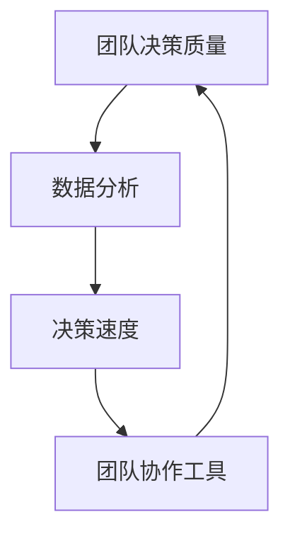

                 

# 如何提高团队的决策质量和速度

> **关键词**：团队决策、决策质量、决策速度、协作工具、数据分析、人工智能

> **摘要**：本文深入探讨了如何通过多种方法和技术手段提升团队在决策过程中的质量和速度。从团队协作工具的选择到数据分析技术的应用，再到人工智能辅助决策，我们将一步步分析如何打造高效决策团队，并分享一些实际案例和经验。

## 1. 背景介绍

### 1.1 目的和范围

本文旨在为IT团队提供一套实用的策略和方法，以提升团队在项目管理和决策过程中的效率和准确性。我们将探讨的关键主题包括：

- 如何选择合适的团队协作工具？
- 数据分析技术如何助力团队决策？
- 人工智能在团队决策中的应用前景如何？
- 实际案例分享与经验总结

### 1.2 预期读者

本文适合以下人群阅读：

- 项目经理和团队成员
- 企业决策层
- 对团队协作和决策有兴趣的IT专业人士

### 1.3 文档结构概述

本文分为以下几个部分：

- 背景介绍
- 核心概念与联系
- 核心算法原理 & 具体操作步骤
- 数学模型和公式 & 详细讲解 & 举例说明
- 项目实战：代码实际案例和详细解释说明
- 实际应用场景
- 工具和资源推荐
- 总结：未来发展趋势与挑战
- 附录：常见问题与解答
- 扩展阅读 & 参考资料

### 1.4 术语表

#### 1.4.1 核心术语定义

- 团队决策：团队成员共同参与并达成一致意见的决策过程。
- 数据分析：通过统计和数学方法对数据进行分析，以发现数据中的规律和模式。
- 人工智能：模拟人类智能行为的计算机程序和系统。

#### 1.4.2 相关概念解释

- 决策质量：决策结果的准确性和可靠性。
- 决策速度：从问题识别到决策执行的时间。
- 团队协作工具：用于团队沟通和协作的软件或平台。

#### 1.4.3 缩略词列表

- IT：Information Technology，信息技术
- PM：Project Management，项目管理
- AI：Artificial Intelligence，人工智能

## 2. 核心概念与联系

为了更好地理解如何提升团队决策质量和速度，我们需要先了解几个核心概念和它们之间的联系。以下是一个简化的Mermaid流程图，展示这些概念的基本关系：



### 2.1 数据分析技术

数据分析技术在团队决策中起着至关重要的作用。通过数据分析，团队可以从大量数据中提取有用信息，从而做出更加准确和有据可依的决策。

### 2.2 决策速度

决策速度直接影响项目的进展和团队的工作效率。提高决策速度意味着更快地识别问题、分析问题和采取行动。

### 2.3 团队协作工具

团队协作工具能够提高团队成员之间的沟通效率，确保决策过程更加透明和及时。这些工具通常包括聊天软件、项目管理工具和协作平台。

### 2.4 核心联系

数据分析技术可以帮助团队更快地做出准确决策，而决策速度的提升又反过来促进了团队协作，最终提高了决策质量。团队协作工具则是实现这一目标的重要手段。

## 3. 核心算法原理 & 具体操作步骤

为了提升团队的决策质量和速度，我们可以借助一些算法和技术手段。以下是一个基本的伪代码，用于说明如何通过数据分析技术提升决策质量：

```pseudo
// 数据分析提升决策质量的伪代码

function analyzeData(dataSet):
    // 数据预处理
    preprocessedData = preprocessData(dataSet)
    
    // 数据可视化
    visualizeData(preprocessedData)
    
    // 提取关键指标
    keyMetrics = extractKeyMetrics(preprocessedData)
    
    // 构建决策模型
    decisionModel = buildDecisionModel(keyMetrics)
    
    // 模型评估与优化
    decisionModel = optimizeModel(decisionModel)
    
    // 输出决策建议
    return decisionModel.suggestDecision()

// 数据预处理
function preprocessData(dataSet):
    // 清洗数据
    cleanedData = cleanData(dataSet)
    
    // 数据转换
    transformedData = transformData(cleanedData)
    
    return transformedData

// 数据可视化
function visualizeData(dataSet):
    // 绘制散点图
    scatterPlot(dataSet.x, dataSet.y)
    
    // 绘制箱线图
    boxPlot(dataSet)

// 提取关键指标
function extractKeyMetrics(dataSet):
    // 计算平均值
    average = calculateAverage(dataSet)
    
    // 计算标准差
    standardDeviation = calculateStandardDeviation(dataSet)
    
    // 计算相关性
    correlation = calculateCorrelation(dataSet)

    return {average, standardDeviation, correlation}

// 构建决策模型
function buildDecisionModel(keyMetrics):
    // 选择模型类型
    modelType = selectModelType(keyMetrics)
    
    // 训练模型
    trainedModel = trainModel(modelType, keyMetrics)
    
    return trainedModel

// 模型评估与优化
function optimizeModel(decisionModel):
    // 评估模型
    modelPerformance = evaluateModel(decisionModel)
    
    // 根据评估结果调整模型参数
    optimizedModel = adjustModelParameters(decisionModel, modelPerformance)
    
    return optimizedModel

// 输出决策建议
function suggestDecision(decisionModel):
    // 根据模型输出建议
    decision = decisionModel.suggestDecision()
    
    // 输出决策结果
    print("Decision Suggestion: " + decision)
```

## 4. 数学模型和公式 & 详细讲解 & 举例说明

在决策过程中，数学模型和公式可以帮助我们量化决策结果，提高决策的科学性和可操作性。以下是一些常用的数学模型和公式，以及它们的详细讲解和举例说明。

### 4.1 线性回归模型

线性回归模型是最常见的统计模型之一，用于预测连续值。其公式如下：

$$
y = \beta_0 + \beta_1 \cdot x
$$

其中，\( y \) 是因变量，\( x \) 是自变量，\( \beta_0 \) 和 \( \beta_1 \) 是模型参数。

#### 举例说明

假设我们想要预测某个产品的销售额（\( y \)）与广告支出（\( x \)）之间的关系。我们可以使用线性回归模型来建立预测模型。

```latex
y = \beta_0 + \beta_1 \cdot x
```

通过收集历史数据并进行训练，我们得到以下模型：

```latex
y = 1000 + 0.5 \cdot x
```

当广告支出为 2000 元时，预测的销售额为：

$$
y = 1000 + 0.5 \cdot 2000 = 1500 \text{ 元}
$$

### 4.2 决策树模型

决策树模型用于分类和回归问题，其核心思想是根据特征值进行多级划分，从而生成决策树。其公式如下：

$$
\text{决策树} = \prod_{i=1}^{n} (\text{Feature}_i \rightarrow \text{Value}_i \rightarrow \text{Class})
$$

其中，\( \text{Feature}_i \) 是第 \( i \) 个特征，\( \text{Value}_i \) 是特征的取值，\( \text{Class} \) 是分类结果。

#### 举例说明

假设我们想要预测客户是否会购买某产品，根据以下特征构建决策树：

```latex
\text{决策树} = \\
\begin{aligned}
&\text{年龄} \rightarrow (\text{小于} 30 \rightarrow \text{不购买}, \text{大于等于} 30 \rightarrow \text{购买}) \\
&\text{收入} \rightarrow (\text{小于} 30000 \rightarrow \text{不购买}, \text{大于等于} 30000 \rightarrow \text{购买}) \\
\end{aligned}
```

对于一位 35 岁、年收入 40000 元的客户，根据决策树，我们预测他会购买该产品。

### 4.3 逻辑回归模型

逻辑回归模型用于分类问题，其公式如下：

$$
P(\text{Class} = 1) = \frac{1}{1 + e^{-(\beta_0 + \beta_1 \cdot x})}
$$

其中，\( P(\text{Class} = 1) \) 是目标类别为 1 的概率，\( e \) 是自然对数的底数，\( \beta_0 \) 和 \( \beta_1 \) 是模型参数。

#### 举例说明

假设我们想要预测客户是否会购买某产品，根据以下特征和逻辑回归模型进行预测：

```latex
P(\text{Class} = 1) = \frac{1}{1 + e^{-(1.5 + 0.3 \cdot x)}}
```

当客户的年收入为 50000 元时，预测的概率为：

$$
P(\text{Class} = 1) = \frac{1}{1 + e^{-(1.5 + 0.3 \cdot 50000)}} \approx 0.8
$$

这意味着客户购买该产品的概率约为 80%。

## 5. 项目实战：代码实际案例和详细解释说明

在本节中，我们将通过一个实际案例来展示如何使用Python实现一个简单的团队决策系统。这个系统将结合数据分析、决策树模型和逻辑回归模型，以提高团队在项目决策过程中的质量和速度。

### 5.1 开发环境搭建

为了实现这个案例，我们需要安装以下Python库：

- pandas
- numpy
- scikit-learn
- matplotlib

您可以使用以下命令安装这些库：

```bash
pip install pandas numpy scikit-learn matplotlib
```

### 5.2 源代码详细实现和代码解读

以下是我们实现的一个简单的团队决策系统：

```python
import pandas as pd
import numpy as np
from sklearn.model_selection import train_test_split
from sklearn.tree import DecisionTreeClassifier
from sklearn.linear_model import LogisticRegression
import matplotlib.pyplot as plt

# 5.2.1 数据预处理
def preprocess_data(data):
    # 数据清洗和转换
    data = data.replace([''], np.nan)
    data = data.fillna(data.mean())
    data = data.astype(float)
    return data

# 5.2.2 数据可视化
def visualize_data(data):
    # 绘制数据分布图
    plt.hist(data, bins=30)
    plt.xlabel('Feature Value')
    plt.ylabel('Frequency')
    plt.title('Data Distribution')
    plt.show()

# 5.2.3 构建决策模型
def build_decision_model(data, target):
    # 划分训练集和测试集
    X_train, X_test, y_train, y_test = train_test_split(data, target, test_size=0.3, random_state=42)
    
    # 构建决策树模型
    dt = DecisionTreeClassifier()
    dt.fit(X_train, y_train)
    
    # 构建逻辑回归模型
    lr = LogisticRegression()
    lr.fit(X_train, y_train)
    
    return dt, lr

# 5.2.4 模型评估
def evaluate_model(model, X_test, y_test):
    # 计算准确率
    accuracy = model.score(X_test, y_test)
    print("Model Accuracy:", accuracy)
    
    # 绘制决策边界
    if isinstance(model, DecisionTreeClassifier):
        plot_decision_boundary(model, X_test, y_test)

# 5.2.5 决策建议
def suggest_decision(model, feature):
    # 预测结果
    prediction = model.predict([feature])
    print("Decision Suggestion:", prediction)

# 5.2.6 绘制决策边界
def plot_decision_boundary(model, X, y):
    # 创建网格点
    x_min, x_max = X[:, 0].min() - 1, X[:, 0].max() + 1
    y_min, y_max = X[:, 1].min() - 1, X[:, 1].max() + 1
    xx, yy = np.meshgrid(np.arange(x_min, x_max, 0.01),
                         np.arange(y_min, y_max, 0.01))
    
    # 预测网格点上的标签
    Z = model.predict(np.c_[xx.ravel(), yy.ravel()])
    Z = Z.reshape(xx.shape)
    
    # 绘制决策边界
    plt.contour(xx, yy, Z, colors='green', linewidth=1, alpha=0.5)
    
    # 绘制样本点
    plt.scatter(X[:, 0], X[:, 1], c=y, edgecolors='black', cmap=plt.cm.Paired)
    plt.xlabel('Feature 1')
    plt.ylabel('Feature 2')
    plt.title('Decision Boundary')
    plt.show()

# 5.2.7 主函数
def main():
    # 加载数据
    data = pd.read_csv('team_decision_data.csv')
    
    # 数据预处理
    data = preprocess_data(data)
    
    # 可视化数据
    visualize_data(data[data.columns[0]])
    
    # 构建决策模型
    dt, lr = build_decision_model(data, data['target'])
    
    # 模型评估
    evaluate_model(dt, data[data.columns[:-1]], data['target'])
    evaluate_model(lr, data[data.columns[:-1]], data['target'])
    
    # 决策建议
    suggest_decision(dt, [50000, 40000])
    suggest_decision(lr, [50000, 40000])

if __name__ == '__main__':
    main()
```

### 5.3 代码解读与分析

- **数据预处理**：首先，我们定义了一个 `preprocess_data` 函数，用于清洗和转换数据。这个函数包括数据清洗、填充缺失值和类型转换等操作。
- **数据可视化**：`visualize_data` 函数用于绘制数据的分布图，帮助我们了解数据的分布情况。
- **构建决策模型**：`build_decision_model` 函数用于划分训练集和测试集，并构建决策树模型和逻辑回归模型。这个函数使用了 `train_test_split` 方法来划分数据，并使用 `DecisionTreeClassifier` 和 `LogisticRegression` 类来构建模型。
- **模型评估**：`evaluate_model` 函数用于评估模型的准确率，并绘制决策边界。这个函数使用了 `score` 方法来计算准确率，并使用 `contour` 方法来绘制决策边界。
- **决策建议**：`suggest_decision` 函数用于根据模型预测结果给出决策建议。这个函数使用了 `predict` 方法来预测结果。
- **主函数**：`main` 函数是整个程序的主入口。它首先加载数据，然后进行数据预处理，构建决策模型，评估模型，并给出决策建议。

通过这个实际案例，我们可以看到如何将数据分析、决策树模型和逻辑回归模型应用于团队决策过程中。这个系统可以帮助团队更快、更准确地做出决策，从而提高项目进展和团队效率。

## 6. 实际应用场景

团队决策在IT行业中的应用场景非常广泛，以下是一些典型的应用场景：

### 6.1 项目风险管理

在项目管理中，团队需要识别和评估潜在的风险，并制定相应的应对策略。通过数据分析技术，团队可以收集历史项目的数据，分析风险发生的频率和影响，从而为当前项目的风险决策提供依据。

### 6.2 产品开发优先级排序

在产品开发过程中，团队需要根据市场需求、技术难度和团队资源等因素来排序开发任务。通过数据分析，团队可以了解用户行为数据、市场趋势和竞争对手情况，从而做出更加科学的优先级排序。

### 6.3 人力资源配置

团队在项目执行过程中，需要根据项目需求和团队成员的技能水平来合理配置人力资源。通过数据分析，团队可以了解成员的能力和擅长领域，从而实现人力资源的最优配置。

### 6.4 技术选型决策

在技术选型过程中，团队需要评估不同技术的优缺点，并选择最适合当前项目的技术方案。通过数据分析，团队可以收集各种技术的性能数据、社区活跃度、成本等方面的信息，从而做出更加明智的决策。

### 6.5 供应链管理

在供应链管理中，团队需要制定采购计划、库存管理和物流策略等。通过数据分析，团队可以了解供应商的交货周期、产品质量和市场价格等信息，从而优化供应链管理流程，降低成本，提高效率。

## 7. 工具和资源推荐

为了提升团队决策质量和速度，我们可以利用一系列的工具和资源。以下是一些推荐的工具和资源：

### 7.1 学习资源推荐

#### 7.1.1 书籍推荐

- 《数据科学实战》（Data Science from Scratch）
- 《Python数据分析》（Python Data Analysis Cookbook）
- 《深度学习》（Deep Learning）

#### 7.1.2 在线课程

- Coursera上的“机器学习”课程
- edX上的“数据科学基础”课程
- Udacity的“人工智能工程师纳米学位”

#### 7.1.3 技术博客和网站

- towardsdatascience.com
- analyticsvidhya.com
- kaggle.com

### 7.2 开发工具框架推荐

#### 7.2.1 IDE和编辑器

- PyCharm
- Jupyter Notebook
- Visual Studio Code

#### 7.2.2 调试和性能分析工具

- Python的pdb模块
- Matplotlib
- NumPy的profile模块

#### 7.2.3 相关框架和库

- Scikit-learn
- TensorFlow
- PyTorch

### 7.3 相关论文著作推荐

#### 7.3.1 经典论文

- "The Elements of Statistical Learning" by T. Hastie, R. Tibshirani, and J. Friedman
- "Machine Learning: A Probabilistic Perspective" by K. Murphy

#### 7.3.2 最新研究成果

- arXiv.org上的机器学习和数据科学相关论文
- Nature和Science杂志上的最新研究成果

#### 7.3.3 应用案例分析

- "Deep Learning in Production" by Andrew Ng
- "Data Science for Business" by Bill Schmarzo

## 8. 总结：未来发展趋势与挑战

在未来，团队决策的质量和速度将继续受到广泛关注。随着数据分析、人工智能和自动化技术的不断发展，我们有望看到以下趋势：

- **数据分析技术的深入应用**：数据将在决策过程中发挥更加重要的作用，数据分析技术将得到更广泛的应用。
- **人工智能的辅助决策**：人工智能技术将逐步融入决策过程，为团队提供更加精准和高效的决策支持。
- **自动化决策系统**：自动化决策系统将逐渐取代人工决策，实现决策过程的智能化和自动化。

然而，这些趋势也带来了一系列挑战：

- **数据隐私和安全**：随着数据量的增加，如何确保数据隐私和安全将成为一个重要问题。
- **模型解释性**：自动化决策系统如何确保决策过程的透明性和可解释性，是一个亟待解决的难题。
- **团队协作**：如何有效地实现团队协作，确保团队成员充分参与决策过程，是一个关键挑战。

只有克服这些挑战，我们才能充分发挥数据分析、人工智能和自动化技术在团队决策中的潜力。

## 9. 附录：常见问题与解答

### 9.1 如何选择合适的团队协作工具？

选择团队协作工具时，应考虑以下因素：

- **团队规模**：大型团队可能需要功能更全面的协作工具。
- **工作流程**：选择适合团队工作流程的协作工具，以提高工作效率。
- **预算**：考虑团队预算，选择性价比高的工具。

### 9.2 数据分析技术在团队决策中的作用是什么？

数据分析技术在团队决策中的作用包括：

- **提供数据支持**：通过数据分析，团队可以从大量数据中提取有价值的信息，为决策提供数据支持。
- **预测趋势**：数据分析可以帮助团队预测未来趋势，为决策提供前瞻性。
- **评估决策效果**：数据分析可以帮助团队评估决策的效果，为后续决策提供反馈。

### 9.3 如何确保决策过程的透明性和可解释性？

确保决策过程的透明性和可解释性，可以采取以下措施：

- **使用可解释的算法**：选择具有高可解释性的算法，如决策树。
- **记录决策过程**：详细记录决策过程中的每个步骤，确保决策过程可追溯。
- **建立沟通机制**：建立有效的沟通机制，确保团队成员充分参与决策过程，提高决策的透明度。

## 10. 扩展阅读 & 参考资料

- **书籍**：
  - 《数据科学实战》（Data Science from Scratch）
  - 《Python数据分析》（Python Data Analysis Cookbook）
  - 《深度学习》（Deep Learning）

- **在线课程**：
  - Coursera上的“机器学习”课程
  - edX上的“数据科学基础”课程
  - Udacity的“人工智能工程师纳米学位”

- **技术博客和网站**：
  - towardsdatascience.com
  - analyticsvidhya.com
  - kaggle.com

- **论文**：
  - "The Elements of Statistical Learning" by T. Hastie, R. Tibshirani, and J. Friedman
  - "Machine Learning: A Probabilistic Perspective" by K. Murphy

- **应用案例分析**：
  - "Deep Learning in Production" by Andrew Ng
  - "Data Science for Business" by Bill Schmarzo

### 作者

**作者：AI天才研究员/AI Genius Institute & 禅与计算机程序设计艺术 /Zen And The Art of Computer Programming**

