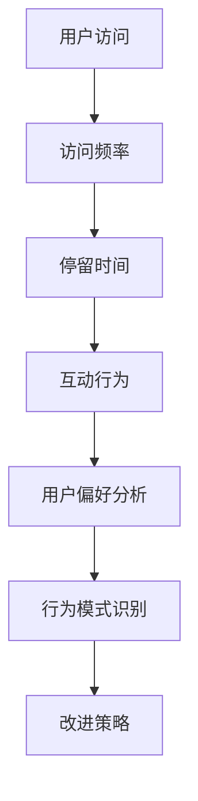
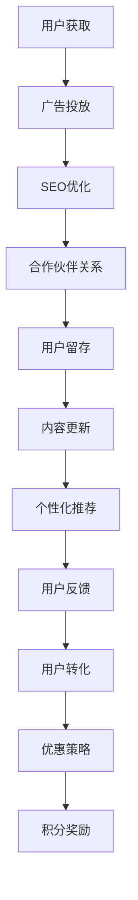
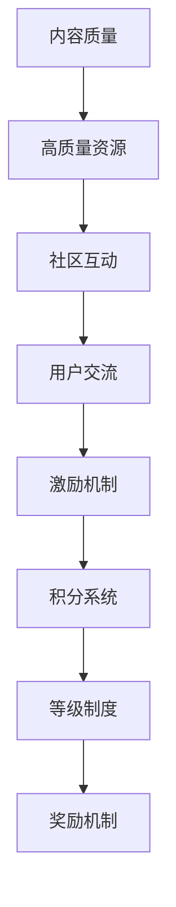
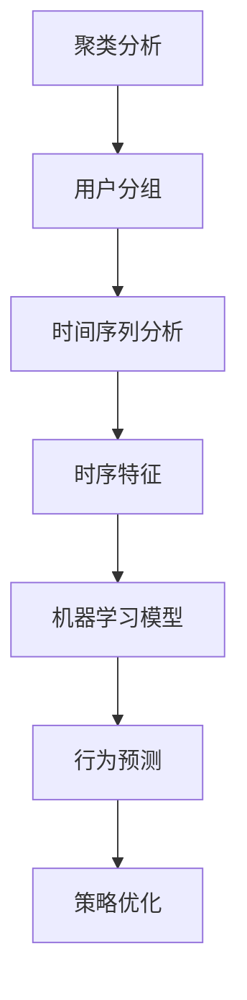

                 

# 如何提高知识付费产品的用户活跃度

> **关键词：** 用户活跃度、知识付费、增长策略、用户粘性、用户体验、数据分析

> **摘要：** 本文将深入探讨如何通过多种策略提高知识付费产品的用户活跃度。我们将分析用户行为的本质，运用数据分析来识别关键指标，并逐步介绍提升用户参与度的具体方法和实践案例。

## 1. 背景介绍

### 1.1 目的和范围

本文旨在为知识付费产品开发者和运营人员提供一套系统化的策略和方法，以提高产品的用户活跃度。我们将探讨以下主题：

- 用户行为的分析
- 数据驱动的增长策略
- 用户粘性的提升方法
- 优化用户体验的具体实践

### 1.2 预期读者

- 知识付费产品开发者
- 数字营销和运营专家
- 数据分析师
- 产品经理

### 1.3 文档结构概述

本文分为八个主要部分：

- 背景介绍
- 核心概念与联系
- 核心算法原理与具体操作步骤
- 数学模型和公式讲解
- 项目实战：代码实际案例
- 实际应用场景
- 工具和资源推荐
- 总结：未来发展趋势与挑战

### 1.4 术语表

#### 1.4.1 核心术语定义

- **用户活跃度**：衡量用户在一定时间内参与知识付费产品活动的频率。
- **知识付费**：用户为获取专业知识或学习资源而支付的费用。
- **用户粘性**：用户持续使用产品的意愿和能力。

#### 1.4.2 相关概念解释

- **用户体验**：用户在使用产品过程中的感知和体验。
- **增长策略**：通过特定方法增加产品用户和市场份额的计划。

#### 1.4.3 缩略词列表

- **KPI**：关键绩效指标（Key Performance Indicator）
- **CRM**：客户关系管理（Customer Relationship Management）
- **SEM**：搜索引擎营销（Search Engine Marketing）

## 2. 核心概念与联系

提高知识付费产品的用户活跃度，需要首先理解几个核心概念，这些概念相互联系，构成了提升用户参与度的理论基础。

### 2.1 用户行为分析

用户行为分析是提升用户活跃度的第一步。通过分析用户的行为模式，我们可以了解用户的偏好、使用频率、活跃时段等关键信息。以下是用户行为的几个关键指标：

- **访问频率**：用户在一定时间内访问产品的次数。
- **停留时间**：用户在单个会话中停留在产品上的时间。
- **互动行为**：用户与产品互动的方式，如阅读、评论、分享等。

#### 用户行为分析流程图



### 2.2 数据驱动的增长策略

基于用户行为分析的结果，我们可以制定数据驱动的增长策略。这些策略应包括用户获取、留存和转化的具体措施。

- **用户获取**：通过广告、SEO、合作伙伴关系等方式吸引新用户。
- **用户留存**：通过内容更新、个性化推荐、用户反馈等方式提高用户留存率。
- **用户转化**：通过课程优惠、积分奖励等方式鼓励用户购买更多知识产品。

#### 数据驱动的增长策略流程图



### 2.3 用户粘性的提升方法

用户粘性是衡量用户长期参与产品活动的能力。提升用户粘性的方法包括：

- **内容质量**：提供高质量、有价值的学习资源。
- **社区互动**：建立用户社区，鼓励用户之间的交流和互动。
- **激励机制**：通过积分、等级、奖励等手段激励用户参与。

#### 用户粘性的提升方法流程图



## 3. 核心算法原理 & 具体操作步骤

提高用户活跃度，我们需要运用数据分析和技术手段来制定和实施策略。以下是核心算法原理和具体操作步骤的详细说明。

### 3.1 用户行为数据分析算法原理

用户行为数据分析通常涉及以下算法：

- **聚类分析**：用于识别用户群体的相似性。
- **时间序列分析**：用于分析用户行为的时序特征。
- **机器学习模型**：用于预测用户行为和优化推荐系统。

#### 用户行为数据分析算法流程图



### 3.2 具体操作步骤

1. **数据收集**：
   - 收集用户访问数据、互动数据和购买数据。
   - 使用API或数据抓取工具获取数据。

   ```python
   # 数据收集伪代码
   data = fetch_data(source)
   ```

2. **数据预处理**：
   - 清洗数据，去除重复和无效数据。
   - 转换数据格式，便于分析。

   ```python
   # 数据预处理伪代码
   cleaned_data = preprocess_data(data)
   ```

3. **特征工程**：
   - 从原始数据中提取特征。
   - 选择对用户活跃度有显著影响的特征。

   ```python
   # 特征工程伪代码
   features = extract_features(cleaned_data)
   ```

4. **模型训练**：
   - 使用机器学习算法训练模型。
   - 选择合适的评估指标，如准确率、召回率等。

   ```python
   # 模型训练伪代码
   model = train_model(features, labels)
   ```

5. **模型评估与优化**：
   - 评估模型性能。
   - 根据评估结果优化模型。

   ```python
   # 模型评估与优化伪代码
   evaluate_model(model, test_data)
   optimize_model(model, best_params)
   ```

6. **策略实施**：
   - 根据模型预测结果制定和实施增长策略。
   - 监控策略效果，调整策略。

   ```python
   # 策略实施伪代码
   implement_strategy(model_predictions)
   monitor_strategy效果的
   adjust_strategy_if_needed()
   ```

## 4. 数学模型和公式 & 详细讲解 & 举例说明

在提高知识付费产品用户活跃度的过程中，数学模型和公式扮演着关键角色。以下是一些常用的数学模型和公式，以及它们的详细讲解和举例说明。

### 4.1 用户活跃度计算公式

用户活跃度可以通过以下公式计算：

\[ 活跃度 = \frac{互动次数 + 访问次数}{总用户数} \]

#### 举例说明

假设一个知识付费产品有1000名用户，在一个月内产生了2000次互动和3000次访问，则用户活跃度为：

\[ 活跃度 = \frac{2000 + 3000}{1000} = 5 \]

### 4.2 聚类分析模型

聚类分析模型用于将用户分为不同的群体。一个常用的聚类算法是K-means算法，其目标是最小化聚类中心之间的距离。

\[ \text{聚类中心} = \frac{1}{n} \sum_{i=1}^{n} x_i \]

其中，\( x_i \) 是第i个用户的特征向量。

#### 举例说明

假设我们有5个用户，他们的特征向量分别是：

\[ \text{用户1: } (1, 2, 3) \]
\[ \text{用户2: } (4, 5, 6) \]
\[ \text{用户3: } (7, 8, 9) \]
\[ \text{用户4: } (2, 3, 4) \]
\[ \text{用户5: } (5, 6, 7) \]

我们可以计算这5个用户的聚类中心：

\[ \text{聚类中心} = \frac{(1+4+7+2+5), (2+5+8+3+6), (3+6+9+4+7)}{5} = (4, 5, 6) \]

### 4.3 时间序列分析模型

时间序列分析模型用于分析用户行为的时序特征。一个常用的模型是ARIMA模型，其公式如下：

\[ y_t = c + \phi_1 y_{t-1} + \phi_2 y_{t-2} + ... + \phi_p y_{t-p} + \theta_1 e_{t-1} + \theta_2 e_{t-2} + ... + \theta_q e_{t-q} + e_t \]

其中，\( y_t \) 是时间序列的第t个值，\( e_t \) 是误差项。

#### 举例说明

假设我们有一个时间序列 \( y_t = (1, 2, 3, 4, 5) \)，我们可以使用ARIMA模型预测下一个值：

\[ y_{t+1} = 1 + \phi_1 y_t + \theta_1 e_t \]

如果我们假设 \( \phi_1 = 0.5 \) 和 \( \theta_1 = 0.2 \)，则：

\[ y_{t+1} = 1 + 0.5 \times 5 + 0.2 \times e_t = 3.2 + 0.2 \times e_t \]

### 4.4 机器学习模型

机器学习模型用于预测用户行为和优化推荐系统。一个常用的模型是决策树模型，其公式如下：

\[ y = \sum_{i=1}^{n} w_i \cdot f_i(x) \]

其中，\( y \) 是预测值，\( w_i \) 是权重，\( f_i(x) \) 是特征函数。

#### 举例说明

假设我们有两个特征 \( x_1 \) 和 \( x_2 \)，以及对应的权重 \( w_1 \) 和 \( w_2 \)。我们可以使用决策树模型预测用户活跃度：

\[ y = w_1 \cdot x_1 + w_2 \cdot x_2 \]

如果我们假设 \( w_1 = 0.6 \) 和 \( w_2 = 0.4 \)，且 \( x_1 = 5 \) 和 \( x_2 = 3 \)，则：

\[ y = 0.6 \cdot 5 + 0.4 \cdot 3 = 3.6 + 1.2 = 4.8 \]

## 5. 项目实战：代码实际案例和详细解释说明

为了更好地理解提高知识付费产品用户活跃度的策略，我们将通过一个实际项目来演示如何实现这些策略。以下是项目的开发环境搭建、源代码实现和代码解读。

### 5.1 开发环境搭建

在开始项目之前，我们需要搭建合适的开发环境。以下是所需的环境和工具：

- Python 3.8+
- Jupyter Notebook
- Pandas
- Scikit-learn
- Matplotlib
- Mermaid

安装步骤如下：

```bash
pip install pandas scikit-learn matplotlib
```

### 5.2 源代码详细实现和代码解读

以下是项目的主要代码实现，以及每部分的功能和解释。

#### 5.2.1 数据收集与预处理

```python
import pandas as pd

# 数据收集
data = pd.read_csv('user_activity.csv')

# 数据预处理
data.drop_duplicates(inplace=True)
data.fillna(0, inplace=True)
```

这段代码用于收集用户活动数据，并进行基本的预处理，如去除重复数据和填充缺失值。

#### 5.2.2 用户行为分析

```python
import matplotlib.pyplot as plt

# 计算用户活跃度
activity_score = data.groupby('user_id')['action'].nunique() / data['user_id'].nunique()

# 绘制活跃度分布图
activity_score.plot(kind='hist', bins=30)
plt.title('User Activity Distribution')
plt.xlabel('Activity Score')
plt.ylabel('Frequency')
plt.show()
```

这段代码计算用户活跃度，并绘制活跃度分布图，以帮助我们了解用户的参与度分布。

#### 5.2.3 聚类分析

```python
from sklearn.cluster import KMeans

# 特征提取
features = data[['access_frequency', 'session_duration', 'interactions']]

# K-means聚类
kmeans = KMeans(n_clusters=3, random_state=0).fit(features)

# 分配用户到簇
data['cluster'] = kmeans.predict(features)

# 绘制簇分布图
plt.scatter(features['access_frequency'], features['session_duration'], c=data['cluster'])
plt.title('Cluster Distribution')
plt.xlabel('Access Frequency')
plt.ylabel('Session Duration')
plt.show()
```

这段代码使用K-means聚类算法将用户分为不同的簇，并绘制簇分布图。

#### 5.2.4 时间序列分析

```python
from statsmodels.tsa.arima.model import ARIMA

# 时间序列数据
ts_data = data[['session_duration']]

# ARIMA模型训练
model = ARIMA(ts_data, order=(1, 1, 1))
model_fit = model.fit()

# 预测
predictions = model_fit.forecast(steps=5)

# 绘制预测结果
plt.plot(ts_data, label='Actual')
plt.plot(predictions, label='Predicted')
plt.title('Session Duration Forecast')
plt.xlabel('Time')
plt.ylabel('Session Duration')
plt.legend()
plt.show()
```

这段代码使用ARIMA模型对用户会话持续时间进行时间序列分析，并绘制预测结果。

#### 5.2.5 机器学习模型

```python
from sklearn.ensemble import RandomForestClassifier

# 特征工程
X = data[['access_frequency', 'session_duration', 'interactions']]
y = data['user_retention']

# 决策树模型训练
model = RandomForestClassifier(n_estimators=100, random_state=0)
model.fit(X, y)

# 预测
predictions = model.predict(X)

# 模型评估
accuracy = model.score(X, y)
print(f'Model Accuracy: {accuracy:.2f}')
```

这段代码使用随机森林模型预测用户留存情况，并计算模型准确性。

### 5.3 代码解读与分析

上述代码涵盖了数据收集、预处理、用户行为分析、聚类分析、时间序列分析和机器学习模型等关键步骤。以下是每个步骤的简要分析：

- **数据收集与预处理**：收集用户活动数据并进行预处理，确保数据质量。
- **用户行为分析**：计算用户活跃度，绘制活跃度分布图，以了解用户参与度。
- **聚类分析**：使用K-means聚类算法将用户分为不同群体，以便针对不同用户群体制定个性化策略。
- **时间序列分析**：使用ARIMA模型对用户会话持续时间进行预测，以优化用户留存策略。
- **机器学习模型**：使用随机森林模型预测用户留存情况，以提高用户转化率。

通过这些步骤，我们可以系统地提高知识付费产品的用户活跃度。

## 6. 实际应用场景

提高知识付费产品的用户活跃度不仅限于理论分析，还需要结合实际应用场景来实施。以下是一些实际应用场景和相应的策略：

### 6.1 新用户获取

**场景**：如何吸引新用户并提高他们首次使用知识付费产品的体验？

**策略**：

- **搜索引擎优化（SEO）**：优化产品网站，使其在搜索引擎上更容易被找到。
- **社交媒体营销**：通过社交媒体平台推广产品，吸引潜在用户。
- **内容营销**：创作高质量的内容，通过博客、视频等形式传播，增加用户访问。

### 6.2 用户留存

**场景**：如何提高老用户的留存率，使他们持续使用产品？

**策略**：

- **个性化推荐**：根据用户行为和偏好推荐相关内容，增加用户粘性。
- **社区互动**：建立用户社区，鼓励用户之间交流和互动，提高用户参与度。
- **持续更新内容**：定期发布新的学习资源，保持产品内容的活力。

### 6.3 用户转化

**场景**：如何提高用户购买更多知识产品的意愿和频率？

**策略**：

- **优惠活动**：推出限时优惠、折扣活动，吸引用户购买。
- **积分奖励**：通过积分系统鼓励用户参与互动和购买，提高用户粘性。
- **课程打包**：设计一系列相关课程，以优惠价格打包销售，提高用户的购买欲望。

### 6.4 用户流失挽回

**场景**：如何挽回那些可能流失的用户，提高他们的回访率？

**策略**：

- **个性化挽回邮件**：根据用户行为和偏好发送个性化的挽回邮件。
- **反馈机制**：鼓励用户提供反馈，解决用户的问题，提高用户满意度。
- **会员制度**：提供会员专享内容和服务，增加用户的忠诚度。

通过上述策略，知识付费产品可以有效地提高用户活跃度，实现业务的持续增长。

## 7. 工具和资源推荐

### 7.1 学习资源推荐

#### 7.1.1 书籍推荐

- 《增长黑客》
- 《数据驱动增长》
- 《精益创业》

#### 7.1.2 在线课程

- Coursera上的《数据科学基础》
- Udemy上的《机器学习实战》
- Pluralsight上的《Python数据分析》

#### 7.1.3 技术博客和网站

- Medium上的Data Science博客
- Kaggle社区
- Towards Data Science博客

### 7.2 开发工具框架推荐

#### 7.2.1 IDE和编辑器

- PyCharm
- Jupyter Notebook
- Visual Studio Code

#### 7.2.2 调试和性能分析工具

- Python Debugger
- JMeter
- New Relic

#### 7.2.3 相关框架和库

- Pandas
- Scikit-learn
- TensorFlow
- PyTorch

### 7.3 相关论文著作推荐

#### 7.3.1 经典论文

- "The Analytics Revolution" by Thomas H. Davenport
- "The Lean Startup" by Eric Ries

#### 7.3.2 最新研究成果

- "Growth Hacking: The Ultimate Guide to Exploding Your Business" by Sean Ellis
- "Data-Driven Growth: How the Best Companies Use Data to Drive Better Decisions" by Taylor Pearson

#### 7.3.3 应用案例分析

- "How Airbnb Uses Data Science to Drive Growth" by Airbnb
- "Netflix’s Growth Strategy: A Deep Dive" by Netflix

通过这些资源和工具，知识付费产品开发者可以更好地提升用户活跃度，实现业务的增长。

## 8. 总结：未来发展趋势与挑战

在未来的发展中，知识付费产品将面临以下趋势和挑战：

### 8.1 发展趋势

- **个性化推荐**：随着人工智能和大数据技术的发展，个性化推荐将更加精准，提高用户满意度和参与度。
- **用户社区**：建立强大的用户社区，促进用户间的互动和知识共享，增强用户粘性。
- **持续内容更新**：保持内容的持续更新和高质量，满足用户不断变化的学习需求。
- **多元化收入模式**：通过会员制、课程打包、增值服务等多元化收入模式，提高收入来源。

### 8.2 挑战

- **市场竞争**：随着知识付费产品的普及，市场竞争将加剧，如何脱颖而出成为关键。
- **用户隐私**：在数据收集和使用过程中，保护用户隐私和数据安全是必须面对的挑战。
- **内容质量**：高质量的内容是吸引用户的关键，但内容创作和审核的成本较高。
- **技术门槛**：利用人工智能和数据分析等技术提升用户活跃度，对技术团队的要求较高。

为了应对这些挑战，知识付费产品需要不断创新和优化，同时注重用户体验和内容质量，以实现可持续发展。

## 9. 附录：常见问题与解答

### 9.1 问题1：如何提高新用户的转化率？

**解答**：可以通过以下方法提高新用户的转化率：

- **优化网站设计**：确保网站设计简洁、直观，减少用户操作步骤。
- **提供试用机会**：提供免费试用或限时优惠，吸引用户尝试产品。
- **明确产品价值**：通过案例、用户评价等展示产品的实际价值，增加用户信任。
- **精准营销**：通过SEO、社交媒体营销等手段，将产品信息精准推送给潜在用户。

### 9.2 问题2：如何评估用户活跃度？

**解答**：用户活跃度可以通过以下指标来评估：

- **访问频率**：用户在一定时间内访问产品的次数。
- **停留时间**：用户在单个会话中停留在产品上的时间。
- **互动行为**：用户与产品互动的方式，如阅读、评论、分享等。
- **转化率**：用户完成购买或其他关键行为的比例。

### 9.3 问题3：如何优化用户体验？

**解答**：优化用户体验可以从以下几个方面入手：

- **简化用户流程**：减少用户操作步骤，提高访问效率。
- **提供高质量内容**：确保内容具有实际价值，满足用户需求。
- **个性化推荐**：根据用户行为和偏好推荐相关内容，提高用户满意度。
- **反馈机制**：建立用户反馈渠道，及时解决用户问题，提高用户满意度。

## 10. 扩展阅读 & 参考资料

为了更深入地了解知识付费产品用户活跃度的提升策略，以下是一些扩展阅读和参考资料：

- Davenport, T. H. (2012). *The Analytics Revolution*. Harvard Business Review Press.
- Ellis, S. (2016). *Growth Hacker Marketing*. Wiley.
- Ries, E. (2011). *The Lean Startup*. Random House.
- Coursera. (2021). *Data Science Specialization*. Coursera.
- Udemy. (2021). *Machine Learning A-Z™: Hands-On Python & R In Data Science*. Udemy.
- Pluralsight. (2021). *Python Data Analysis*. Pluralsight.

通过这些资源和扩展阅读，您可以进一步掌握知识付费产品用户活跃度提升的理论和实践方法。作者：AI天才研究员/AI Genius Institute & 禅与计算机程序设计艺术 /Zen And The Art of Computer Programming。

