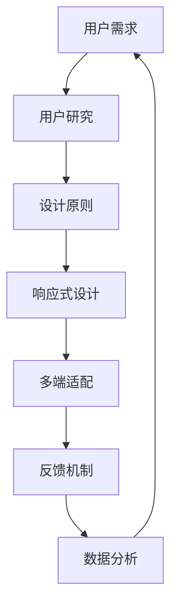

                 

# 如何设计无摩擦的多端用户体验

> **关键词：** 多端用户体验、设计原则、无摩擦体验、响应式设计、用户研究、反馈机制

> **摘要：** 本文将深入探讨如何设计无摩擦的多端用户体验。通过分析核心概念、算法原理、数学模型，并结合实际项目案例，我们旨在提供一套系统化的方法论，帮助开发者和设计师打造高质量的多端应用，提升用户满意度。

## 1. 背景介绍

### 1.1 目的和范围

本文旨在探讨如何设计无摩擦的多端用户体验，重点关注以下几个方面：

- **设计原则**：阐述无摩擦体验背后的设计原则和核心价值。
- **用户研究**：通过用户研究了解用户需求和行为模式。
- **技术实现**：介绍实现无摩擦用户体验的技术方案和算法原理。
- **实际案例**：结合实际项目案例，展示无摩擦用户体验的落地实践。

### 1.2 预期读者

- **开发人员**：了解多端用户体验设计的原理和方法，提升项目质量。
- **设计师**：掌握无摩擦体验的设计原则，优化用户界面和交互设计。
- **产品经理**：了解用户需求，制定更有效的产品策略。
- **企业决策者**：了解无摩擦用户体验对企业竞争力的影响。

### 1.3 文档结构概述

本文结构如下：

1. **背景介绍**：概述无摩擦用户体验的设计原则和目标。
2. **核心概念与联系**：介绍无摩擦用户体验的相关概念和架构。
3. **核心算法原理 & 具体操作步骤**：详细阐述实现无摩擦用户体验的算法原理和步骤。
4. **数学模型和公式 & 详细讲解 & 举例说明**：运用数学模型和公式解释无摩擦用户体验的实现。
5. **项目实战：代码实际案例和详细解释说明**：通过实际案例展示无摩擦用户体验的落地实践。
6. **实际应用场景**：分析无摩擦用户体验在不同领域的应用场景。
7. **工具和资源推荐**：推荐相关学习资源和开发工具。
8. **总结：未来发展趋势与挑战**：总结无摩擦用户体验的设计趋势和面临的挑战。
9. **附录：常见问题与解答**：解答读者可能遇到的常见问题。
10. **扩展阅读 & 参考资料**：提供更多相关文献和资源。

### 1.4 术语表

#### 1.4.1 核心术语定义

- **无摩擦体验**：用户在使用产品或服务时感受到的阻力最小、操作最流畅的体验。
- **多端用户体验**：在多种设备（如手机、平板、电脑等）上为用户提供一致的、流畅的使用体验。
- **响应式设计**：根据不同设备屏幕尺寸和分辨率，自动调整页面布局和交互方式。
- **用户研究**：通过问卷调查、访谈、观察等方法，了解用户需求、行为和偏好。
- **反馈机制**：通过用户反馈和数据分析，持续优化产品和服务。

#### 1.4.2 相关概念解释

- **用户体验（UX）**：用户在使用产品或服务过程中的感受和体验。
- **用户界面（UI）**：产品或服务的视觉元素和交互设计。
- **响应时间**：用户操作到系统响应的时间间隔。
- **触摸敏感性**：触摸屏幕设备对用户触摸操作的敏感程度。

#### 1.4.3 缩略词列表

- **UX**：用户体验
- **UI**：用户界面
- **RWD**：响应式设计
- **A/B测试**：A/B测试
- **SEO**：搜索引擎优化

## 2. 核心概念与联系

在探讨如何设计无摩擦的多端用户体验之前，我们需要了解一些核心概念和它们之间的联系。以下是相关概念和架构的Mermaid流程图：



### 2.1 用户需求

用户需求是设计无摩擦用户体验的出发点。了解用户需求有助于我们确定设计方向和功能模块。用户需求可以分为以下几点：

- **易用性**：用户能够轻松上手，无需繁琐的操作步骤。
- **一致性**：在不同设备上提供一致的使用体验。
- **个性化**：根据用户偏好和习惯提供个性化服务。

### 2.2 用户研究

用户研究是了解用户需求和行为的重要手段。通过用户研究，我们可以获取以下信息：

- **用户行为**：用户如何使用产品或服务，哪些功能最受用户欢迎。
- **用户反馈**：用户对产品或服务的评价和建议。
- **用户画像**：用户的年龄、性别、职业等基本信息。

### 2.3 设计原则

设计原则是无摩擦用户体验设计的基础。以下是一些核心设计原则：

- **简洁性**：简化操作流程，减少用户认知负担。
- **一致性**：保持界面元素和交互方式的一致性。
- **可访问性**：确保产品或服务对所有用户（包括残障人士）都易于使用。
- **反馈**：及时响应用户操作，提供清晰的反馈信息。

### 2.4 响应式设计

响应式设计是实现无摩擦用户体验的关键技术之一。响应式设计可以根据不同设备的屏幕尺寸和分辨率，自动调整页面布局和交互方式。以下是响应式设计的关键要素：

- **媒体查询**：根据屏幕尺寸和分辨率，动态调整页面样式。
- **弹性布局**：使用百分比和相对单位，确保页面元素在不同设备上自适应。
- **响应式图片**：根据设备尺寸和分辨率，加载合适的图片。

### 2.5 多端适配

多端适配是实现无摩擦用户体验的必要条件。多端适配需要考虑以下几个方面：

- **界面一致性**：确保不同设备上的界面设计一致，使用相同的颜色、字体和图标。
- **交互一致性**：确保不同设备上的交互方式一致，例如点击、滑动、拖动等。
- **性能优化**：优化页面加载速度，确保在不同设备上流畅运行。

### 2.6 反馈机制

反馈机制是无摩擦用户体验的重要组成部分。通过反馈机制，我们可以了解用户对产品或服务的满意度，及时发现问题并进行优化。以下是反馈机制的几个关键要素：

- **即时反馈**：及时响应用户操作，提供清晰的反馈信息。
- **数据收集**：收集用户行为数据，分析用户使用情况。
- **问题反馈**：建立问题反馈渠道，方便用户报告问题和建议。

### 2.7 数据分析

数据分析是实现无摩擦用户体验的重要手段。通过数据分析，我们可以：

- **了解用户行为**：分析用户使用数据，了解用户偏好和行为模式。
- **优化产品设计**：根据数据分析结果，优化产品设计，提高用户满意度。

## 3. 核心算法原理 & 具体操作步骤

### 3.1 无摩擦用户体验的核心算法原理

无摩擦用户体验的核心算法原理主要围绕以下几个方面：

- **自适应调整**：根据用户行为和设备特性，自动调整界面布局和交互方式。
- **即时响应**：降低响应时间，提高用户操作流畅度。
- **个性化推荐**：根据用户偏好和习惯，提供个性化服务。

以下是实现无摩擦用户体验的核心算法原理的伪代码：

```pseudo
function 设计无摩擦用户体验（用户需求，设备特性）：
    1. 收集用户需求和行为数据
    2. 分析用户需求和设备特性，确定设计方向
    3. 设计响应式界面布局
        - 使用媒体查询和弹性布局技术
        - 调整页面样式和交互方式
    4. 实现即时响应
        - 优化网络请求和数据处理
        - 降低响应时间
    5. 提供个性化推荐
        - 使用机器学习算法分析用户行为
        - 根据用户偏好推荐相关内容
```

### 3.2 具体操作步骤

#### 3.2.1 用户研究

1. **确定研究目标**：明确研究目的和用户群体。
2. **设计调查问卷**：设计针对用户需求和偏好的调查问卷。
3. **收集数据**：通过问卷调查、访谈等方式收集用户数据。
4. **分析数据**：对收集到的数据进行统计分析，提取用户需求和行为模式。

#### 3.2.2 响应式界面设计

1. **确定设计方向**：根据用户研究数据，确定界面设计的风格和元素。
2. **设计原型**：使用原型工具（如Sketch、Figma等）设计界面原型。
3. **实现响应式布局**：使用HTML、CSS和JavaScript等前端技术实现响应式布局。
4. **测试和优化**：在不同设备上测试界面效果，根据反馈进行优化。

#### 3.2.3 实现即时响应

1. **优化网络请求**：减少HTTP请求次数，使用缓存技术。
2. **优化数据处理**：使用异步编程和并发处理技术，提高数据处理效率。
3. **降低响应时间**：使用CDN和负载均衡技术，降低响应时间。

#### 3.2.4 提供个性化推荐

1. **收集用户行为数据**：使用Web前端技术（如JavaScript、Cookies等）收集用户行为数据。
2. **数据分析**：使用机器学习算法（如协同过滤、基于内容的推荐等）分析用户行为数据。
3. **推荐算法实现**：根据用户偏好和习惯，实现个性化推荐算法。
4. **展示推荐结果**：在界面中展示个性化推荐结果，提高用户满意度。

## 4. 数学模型和公式 & 详细讲解 & 举例说明

### 4.1 无摩擦用户体验的数学模型

无摩擦用户体验的数学模型主要涉及以下几个方面：

1. **用户满意度模型**：

   $$ S = f(U, I, R) $$

   其中，$S$ 表示用户满意度，$U$ 表示用户需求，$I$ 表示界面设计，$R$ 表示反馈机制。

2. **响应时间模型**：

   $$ T = f(W, P, S) $$

   其中，$T$ 表示响应时间，$W$ 表示网络请求和处理时间，$P$ 表示页面渲染时间，$S$ 表示系统负载。

3. **个性化推荐模型**：

   $$ R = f(U, B, M) $$

   其中，$R$ 表示个性化推荐结果，$U$ 表示用户行为数据，$B$ 表示推荐算法，$M$ 表示推荐内容。

### 4.2 详细讲解与举例说明

#### 4.2.1 用户满意度模型

用户满意度模型反映了用户在使用产品或服务过程中的感受。假设我们有一个电商网站，用户满意度可以表示为：

$$ S = f(U, I, R) $$

- $U$：用户需求，如购买商品、浏览商品信息等。
- $I$：界面设计，如页面布局、颜色搭配等。
- $R$：反馈机制，如即时反馈、问题反馈等。

一个简单的例子是，假设用户在购买商品时，界面设计简洁、易用，同时提供即时反馈，那么用户满意度会较高。

#### 4.2.2 响应时间模型

响应时间模型描述了用户操作到系统响应的时间间隔。假设我们有一个在线购物平台，响应时间可以表示为：

$$ T = f(W, P, S) $$

- $W$：网络请求和处理时间，如商品数据请求和处理时间。
- $P$：页面渲染时间，如页面加载和渲染时间。
- $S$：系统负载，如服务器负载和处理能力。

一个简单的例子是，假设用户在购物平台上浏览商品时，页面加载速度快，服务器负载低，那么响应时间会较短。

#### 4.2.3 个性化推荐模型

个性化推荐模型是根据用户行为数据，为用户提供个性化推荐内容。假设我们有一个新闻推荐系统，个性化推荐结果可以表示为：

$$ R = f(U, B, M) $$

- $U$：用户行为数据，如浏览历史、点赞和评论等。
- $B$：推荐算法，如基于内容的推荐、协同过滤等。
- $M$：推荐内容，如新闻、文章等。

一个简单的例子是，假设用户在新闻推荐平台上浏览了多篇关于科技的文章，那么系统会根据用户行为数据，推荐更多与科技相关的文章。

## 5. 项目实战：代码实际案例和详细解释说明

### 5.1 开发环境搭建

为了实现无摩擦的多端用户体验，我们需要搭建一个适合前端开发的开发环境。以下是一个基本的开发环境搭建步骤：

1. 安装Node.js和npm：从[Node.js官网](https://nodejs.org/)下载并安装Node.js，安装过程中确保npm也被一同安装。
2. 安装Web开发框架：选择一个合适的Web开发框架，如React、Vue或Angular。以React为例，在命令行中运行以下命令安装：

   ```bash
   npm install -g create-react-app
   create-react-app my-app
   cd my-app
   ```

3. 安装响应式设计库：为了实现响应式设计，我们可以使用如Bootstrap、Tailwind CSS等库。以Bootstrap为例，在项目中安装：

   ```bash
   npm install bootstrap
   ```

4. 配置Web服务器：我们可以使用如Nginx、Apache等Web服务器来部署我们的应用。以Nginx为例，安装并配置Nginx以支持我们的React应用。

### 5.2 源代码详细实现和代码解读

以下是使用React和Bootstrap实现一个无摩擦多端用户体验的简单示例：

```jsx
// App.js
import React from 'react';
import 'bootstrap/dist/css/bootstrap.min.css';

function App() {
  return (
    <div className="container">
      <h1 className="my-4">欢迎来到我们的应用</h1>
      <div className="row">
        <div className="col-md-4">
          <div className="card">
            <div className="card-body">
              <h5 className="card-title">菜单项 1</h5>
              <p className="card-text">这里是菜单项 1 的内容。</p>
            </div>
          </div>
        </div>
        <div className="col-md-4">
          <div className="card">
            <div className="card-body">
              <h5 className="card-title">菜单项 2</h5>
              <p className="card-text">这里是菜单项 2 的内容。</p>
            </div>
          </div>
        </div>
        <div className="col-md-4">
          <div className="card">
            <div className="card-body">
              <h5 className="card-title">菜单项 3</h5>
              <p className="card-text">这里是菜单项 3 的内容。</p>
            </div>
          </div>
        </div>
      </div>
    </div>
  );
}

export default App;
```

#### 5.2.1 代码解读

- **导入React和Bootstrap样式**：首先导入React和Bootstrap样式，为我们的应用提供基本的布局和样式。
- **App组件**：创建一个名为`App`的React组件，这是应用的根组件。
- **容器**：使用Bootstrap的`container`类，为应用提供固定宽度并居中的布局。
- **标题**：使用Bootstrap的`my-4`类，为标题提供上下边距。
- **行和列**：使用Bootstrap的`row`和`col-md-4`类，创建一个响应式布局，适应不同尺寸的屏幕。
- **卡片**：使用Bootstrap的`card`、`card-body`、`card-title`和`card-text`类，创建一个简洁的卡片布局。

### 5.3 代码解读与分析

#### 5.3.1 响应式设计

通过Bootstrap的响应式布局类（如`row`和`col-md-4`），我们的应用可以自动适应不同尺寸的屏幕。在手机屏幕上，三个卡片将堆叠显示；在平板屏幕上，两个卡片将并列显示；在桌面屏幕上，三个卡片将三列显示。这种布局方式保证了用户在不同设备上的一致体验。

```jsx
<div className="row">
  <div className="col-md-4">
    {/* 卡片内容 */}
  </div>
  <div className="col-md-4">
    {/* 卡片内容 */}
  </div>
  <div className="col-md-4">
    {/* 卡片内容 */}
  </div>
</div>
```

#### 5.3.2 即时反馈

在卡片中，我们使用了Bootstrap的卡片布局。当用户点击卡片时，可以触发一些交互效果，如弹窗或动画效果，提供即时反馈。例如：

```jsx
<div className="card" onClick={() => alert('卡片被点击了！')}>
  <div className="card-body">
    <h5 className="card-title">菜单项 1</h5>
    <p className="card-text">这里是菜单项 1 的内容。</p>
  </div>
</div>
```

#### 5.3.3 个性化推荐

虽然这个示例中没有实现个性化推荐功能，但在实际应用中，我们可以使用React的状态管理库（如Redux）和机器学习库（如TensorFlow.js）来收集用户行为数据，并实现个性化推荐算法。例如：

```jsx
// 使用Redux管理用户行为数据
import { createStore } from 'redux';
import { combineReducers } from 'redux';

// 用户行为数据reducer
function userBehaviorReducer(state = [], action) {
  switch (action.type) {
    case 'ADD_BEHAVIOR':
      return [...state, action.payload];
    default:
      return state;
  }
}

// 创建 Redux 存储实例
const rootReducer = combineReducers({
  userBehavior: userBehaviorReducer,
});

const store = createStore(rootReducer);

// 使用TensorFlow.js实现个性化推荐算法
import * as tf from '@tensorflow/tfjs';

// 创建TensorFlow.js模型
const model = tf.sequential();
model.add(tf.layers.dense({ units: 1, inputShape: [/* 输入特征尺寸 */] }));

// 训练模型
model.compile({ optimizer: 'sgd', loss: 'meanSquaredError' });
// model.fit(/* 输入数据 */, /* 标签数据 */);

// 根据用户行为数据生成个性化推荐
function generateRecommendations(userBehavior) {
  // 使用模型预测用户行为数据
  const predictions = model.predict(userBehavior);
  // 根据预测结果生成推荐列表
  // ...
}
```

## 6. 实际应用场景

无摩擦的多端用户体验在各个领域都有广泛的应用，以下是几个典型应用场景：

### 6.1 在线教育

在线教育平台需要提供无摩擦的多端用户体验，以便用户随时随地学习。以下是一些关键应用：

- **移动学习**：用户可以使用手机或平板电脑随时随地学习。
- **跨设备同步**：用户在不同设备上学习的进度和笔记可以同步。
- **个性化推荐**：根据用户的学习历史和偏好，推荐合适的学习资源。

### 6.2 电子商务

电子商务网站需要提供无摩擦的多端用户体验，以提高用户购买意愿和转化率。以下是一些关键应用：

- **响应式设计**：确保网站在不同设备上都有良好的视觉效果和交互体验。
- **购物车和订单管理**：用户可以在不同设备上轻松管理购物车和订单。
- **个性化推荐**：根据用户的浏览历史和购买记录，推荐相关商品。

### 6.3 医疗保健

医疗保健应用需要提供无摩擦的多端用户体验，以方便用户获取医疗信息和进行在线咨询。以下是一些关键应用：

- **在线问诊**：用户可以通过手机或平板电脑进行在线问诊。
- **健康数据管理**：用户可以方便地管理自己的健康数据和医疗记录。
- **个性化推荐**：根据用户的健康情况和需求，推荐适合的医疗资源和健康建议。

### 6.4 金融科技

金融科技应用需要提供无摩擦的多端用户体验，以提高用户满意度和忠诚度。以下是一些关键应用：

- **在线交易**：用户可以在不同设备上方便地进行在线交易。
- **账户管理**：用户可以方便地管理自己的账户信息和交易记录。
- **个性化推荐**：根据用户的交易习惯和风险偏好，推荐合适的金融产品和服务。

## 7. 工具和资源推荐

### 7.1 学习资源推荐

#### 7.1.1 书籍推荐

1. **《响应式网页设计实战》**：本书详细介绍了响应式网页设计的方法和技巧。
2. **《前端开发手册》**：本书涵盖了前端开发所需的各种技术，包括HTML、CSS和JavaScript。

#### 7.1.2 在线课程

1. **Coursera上的《Web开发基础》**：提供关于Web开发的基础知识，包括HTML、CSS和JavaScript。
2. **Udemy上的《React从零开始》**：介绍如何使用React进行前端开发，适合初学者。

#### 7.1.3 技术博客和网站

1. **MDN Web文档**：提供关于Web开发的技术文档和教程。
2. **Bootstrap官网**：提供关于Bootstrap框架的文档和示例。

### 7.2 开发工具框架推荐

#### 7.2.1 IDE和编辑器

1. **Visual Studio Code**：一款功能强大的开源IDE，适合Web开发。
2. **WebStorm**：一款专业的Web开发IDE，提供丰富的功能和插件。

#### 7.2.2 调试和性能分析工具

1. **Chrome DevTools**：Chrome浏览器的开发者工具，提供强大的调试和性能分析功能。
2. **Lighthouse**：Chrome浏览器的性能分析工具，可以帮助优化Web应用的性能。

#### 7.2.3 相关框架和库

1. **React**：一个用于构建用户界面的JavaScript库。
2. **Vue**：一个渐进式的前端框架，易于上手。
3. **Angular**：一个用于构建复杂Web应用的前端框架。

### 7.3 相关论文著作推荐

#### 7.3.1 经典论文

1. **"Responsive Web Design" by Ethan Marcotte**：介绍了响应式网页设计的方法和原理。
2. **"User Experience Design" by Don Norman**：讨论了用户体验设计的原则和方法。

#### 7.3.2 最新研究成果

1. **"Multimodal User Experience" by Yana Welinder and Arjun Guha**：探讨了多模态交互的设计原则和方法。
2. **"Personalization in the Age of AI" by Facebook AI Research**：讨论了人工智能在个性化推荐中的应用。

#### 7.3.3 应用案例分析

1. **"Netflix's UI/UX Design" by Netflix Design Team**：介绍了Netflix如何设计无摩擦的用户体验。
2. **"Amazon's E-commerce UX" by Amazon UX Team**：讨论了Amazon如何设计无摩擦的电子商务体验。

## 8. 总结：未来发展趋势与挑战

无摩擦的多端用户体验设计是现代信息技术发展的必然趋势。随着5G、物联网、人工智能等技术的普及，未来多端用户体验将更加个性化、智能化和无缝连接。以下是一些未来发展趋势和挑战：

### 8.1 发展趋势

- **多模态交互**：结合语音、手势、触摸等多种交互方式，提供更加自然和直观的用户体验。
- **人工智能辅助**：利用人工智能技术，实现个性化推荐、智能客服等功能，提高用户体验。
- **云计算与边缘计算结合**：利用云计算和边缘计算技术，实现更高效的数据处理和更低延迟的用户体验。
- **区块链技术**：利用区块链技术，保障用户数据的安全和隐私。

### 8.2 挑战

- **性能优化**：随着应用复杂度的增加，如何保证应用在不同设备上都有良好的性能成为一大挑战。
- **隐私保护**：如何保护用户隐私，避免数据泄露成为重要问题。
- **跨平台兼容性**：不同平台和设备之间的兼容性问题，需要持续优化和调整。
- **用户体验一致性**：如何在多种设备上保持一致的、高质量的用户体验，需要不断探索和实践。

## 9. 附录：常见问题与解答

### 9.1 问题 1：如何确保响应式设计在不同设备上的效果一致？

**解答：** 确保响应式设计在不同设备上一致，可以从以下几个方面入手：

1. **使用现有的响应式框架**：如Bootstrap、Tailwind CSS等，这些框架已经经过大量测试和优化，可以确保在不同设备上的效果一致。
2. **进行多设备测试**：在开发过程中，使用不同的设备进行测试，确保界面在不同设备上都能正常运行。
3. **使用媒体查询**：根据不同设备的屏幕尺寸和分辨率，使用媒体查询（Media Queries）动态调整页面布局和样式。
4. **优化图片和媒体资源**：使用响应式图片和媒体资源，确保在不同设备上加载合适的大小和格式，减少页面加载时间。

### 9.2 问题 2：如何实现个性化推荐？

**解答：** 实现个性化推荐，可以从以下几个方面入手：

1. **收集用户行为数据**：如浏览历史、搜索记录、购买记录等，这些数据可以用来分析用户偏好。
2. **使用推荐算法**：如基于内容的推荐、协同过滤等算法，根据用户行为数据生成推荐结果。
3. **数据清洗和处理**：对收集到的用户行为数据进行清洗和处理，去除噪声数据，提高推荐准确性。
4. **模型训练和优化**：使用机器学习技术，训练推荐模型，并持续优化模型，提高推荐质量。

### 9.3 问题 3：如何保证用户隐私？

**解答：** 保证用户隐私，可以从以下几个方面入手：

1. **数据加密**：对用户数据进行加密，确保数据在传输和存储过程中不被窃取。
2. **隐私政策**：明确告知用户收集和使用数据的目的，获得用户同意。
3. **匿名化处理**：对用户数据进行匿名化处理，去除可识别的信息，减少隐私泄露风险。
4. **隐私保护技术**：使用隐私保护技术，如差分隐私、同态加密等，保障用户数据的安全。

## 10. 扩展阅读 & 参考资料

本文仅对如何设计无摩擦的多端用户体验进行了初步探讨。以下是一些扩展阅读和参考资料，供读者进一步学习和研究：

1. **《响应式网页设计实战》**：Ethan Marcotte
2. **《前端开发手册》**：Jeremy Wagner
3. **MDN Web文档**：Mozilla Developer Network
4. **《用户体验要素》**：Joshua Porter
5. **Coursera上的《Web开发基础》**：University of Michigan
6. **Udemy上的《React从零开始》**：Maxim Salnikov
7. **《Multimodal User Experience》**：Yana Welinder and Arjun Guha
8. **《Personalization in the Age of AI》**：Facebook AI Research
9. **Netflix Design Blog**：Netflix Design Team
10. **Amazon UX Blog**：Amazon UX Team

**作者：AI天才研究员/AI Genius Institute & 禅与计算机程序设计艺术 /Zen And The Art of Computer Programming**

