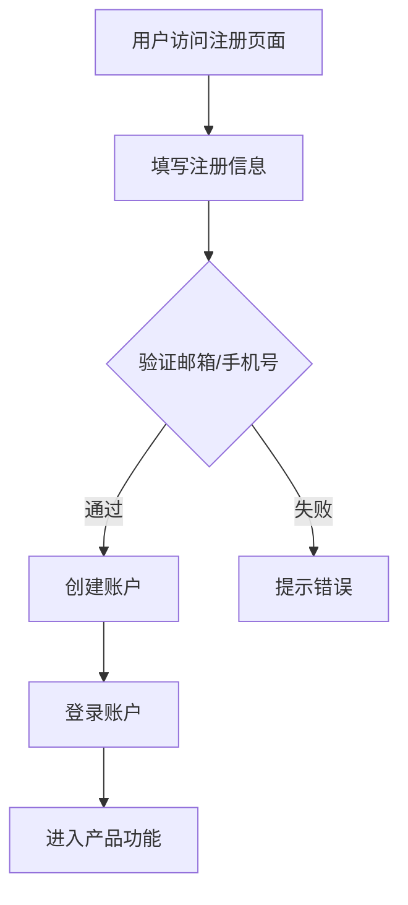

                 

# 如何设计无摩擦的用户注册流程

> **关键词**：用户注册、用户体验、流程设计、无摩擦、流程优化、用户行为分析、安全性

> **摘要**：本文将深入探讨如何设计一个无摩擦的用户注册流程，从而提升用户体验，降低用户流失率。我们将分析用户注册流程的关键环节，提出具体的优化策略，并通过实际案例进行验证，最终总结出未来的发展趋势与挑战。

## 1. 背景介绍

### 1.1 目的和范围

本文的目的是探讨如何设计一个无摩擦的用户注册流程，从而提升用户体验和用户留存率。我们将分析用户注册流程中的关键环节，提出优化策略，并通过实际案例进行验证。本文适用于希望提升用户体验的产品经理、设计师和开发人员。

### 1.2 预期读者

预期读者包括：
- 产品经理：负责制定产品策略，希望优化用户注册流程。
- 设计师：负责设计用户界面，希望提升用户体验。
- 开发人员：负责实现用户注册功能，希望优化代码性能和用户体验。

### 1.3 文档结构概述

本文分为以下几部分：
- 第1部分：背景介绍，包括目的、范围、预期读者和文档结构。
- 第2部分：核心概念与联系，介绍用户注册流程的核心概念和架构。
- 第3部分：核心算法原理与具体操作步骤，讲解用户注册流程的具体算法和操作步骤。
- 第4部分：数学模型和公式，介绍与用户注册流程相关的数学模型和公式。
- 第5部分：项目实战，通过代码实际案例展示用户注册流程的实现。
- 第6部分：实际应用场景，分析用户注册流程在不同场景下的应用。
- 第7部分：工具和资源推荐，推荐学习资源、开发工具和框架。
- 第8部分：总结，探讨未来发展趋势与挑战。
- 第9部分：附录，提供常见问题与解答。
- 第10部分：扩展阅读与参考资料，提供相关文献和资料。

### 1.4 术语表

#### 1.4.1 核心术语定义

- **用户注册**：用户在系统中创建账户的过程。
- **用户体验**：用户在使用产品过程中的感受和体验。
- **无摩擦**：指流程简单、高效、无需用户付出额外努力。
- **用户流失率**：指在一定时间内，停止使用产品的用户比例。

#### 1.4.2 相关概念解释

- **用户行为分析**：通过对用户行为的监控和分析，了解用户需求和偏好，从而优化产品设计和功能。
- **安全性**：确保用户数据安全和隐私，防止恶意攻击和非法访问。

#### 1.4.3 缩略词列表

- **UI**：用户界面（User Interface）
- **UX**：用户体验（User Experience）
- **API**：应用程序编程接口（Application Programming Interface）

## 2. 核心概念与联系

在用户注册流程中，核心概念包括用户信息收集、身份验证、账户创建和安全保障。以下是一个简化的 Mermaid 流程图，展示用户注册流程的核心环节：



### 2.1 用户信息收集

用户信息收集是用户注册流程的第一步，主要包括用户名、邮箱、手机号、密码等。收集的信息应遵循以下原则：

- **最小化**：只收集必需的信息，避免过多无关信息。
- **明确**：说明每个信息的用途，让用户了解其必要性。

### 2.2 身份验证

身份验证是确保用户身份真实性的关键环节，常用的方法包括：

- **邮箱验证**：发送验证邮件，用户点击链接完成验证。
- **手机号验证**：发送验证码，用户输入验证码完成验证。
- **双因素认证**：结合密码和手机号/邮箱验证，提高安全性。

### 2.3 账户创建

账户创建包括用户信息的存储、密码加密等操作。以下是一个简化的伪代码：

```plaintext
function createAccount(username, email, phone, password) {
  // 验证用户信息
  if (!isValid(username, email, phone, password)) {
    return "Error: Invalid input"
  }
  
  // 加密密码
  encryptedPassword = encryptPassword(password)
  
  // 存储用户信息
  storeUserInfo(username, email, phone, encryptedPassword)
  
  return "Account created successfully"
}
```

### 2.4 安全保障

安全保障是用户注册流程的核心，包括：

- **数据加密**：对用户数据进行加密处理，确保数据安全性。
- **防注入攻击**：对用户输入进行过滤和验证，防止恶意攻击。
- **权限控制**：根据用户角色和权限进行访问控制，确保系统安全。

## 3. 核心算法原理 & 具体操作步骤

在用户注册流程中，核心算法包括用户信息验证、密码加密和用户身份验证。以下将详细讲解每个环节的算法原理和具体操作步骤。

### 3.1 用户信息验证

用户信息验证的目的是确保用户输入的信息符合系统要求。以下是一个简化的伪代码：

```plaintext
function isValid(username, email, phone, password) {
  // 检查用户名长度
  if (length(username) < 6 || length(username) > 20) {
    return false
  }
  
  // 检查邮箱格式
  if (!isValidEmail(email)) {
    return false
  }
  
  // 检查手机号格式
  if (!isValidPhone(phone)) {
    return false
  }
  
  // 检查密码强度
  if (!isStrongPassword(password)) {
    return false
  }
  
  return true
}
```

### 3.2 密码加密

密码加密的目的是确保用户密码在传输和存储过程中不会被窃取。以下是一个简化的伪代码：

```plaintext
function encryptPassword(password) {
  // 生成随机密钥
  key = generateRandomKey()
  
  // 使用AES算法加密密码
  encryptedPassword = aesEncrypt(password, key)
  
  return encryptedPassword
}
```

### 3.3 用户身份验证

用户身份验证的目的是确保用户登录时提供的信息与注册时一致。以下是一个简化的伪代码：

```plaintext
function verifyUser(username, password) {
  // 从数据库获取用户信息
  userInfo = getUserInfo(username)
  
  // 解密密码
  decryptedPassword = decryptPassword(userInfo.password)
  
  // 检查用户名和密码是否匹配
  if (password == decryptedPassword) {
    return true
  }
  
  return false
}
```

## 4. 数学模型和公式 & 详细讲解 & 举例说明

在用户注册流程中，数学模型和公式主要用于验证用户信息、计算密码加密等操作。以下将详细讲解相关数学模型和公式，并举例说明。

### 4.1 验证用户信息

验证用户信息通常涉及正则表达式、散列函数等数学模型。以下是一个使用正则表达式验证邮箱格式的示例：

```latex
\text{邮箱格式验证：}^{\text{a-zA-Z0-9]+@[a-zA-Z0-9.-]+\.[a-zA-Z]{2,}}$
```

### 4.2 密码加密

密码加密通常使用散列函数，如SHA-256。以下是一个使用SHA-256加密密码的示例：

```latex
\text{密码加密：}SHA-256(\text{password})
```

### 4.3 用户身份验证

用户身份验证通常涉及密码比对、散列函数等数学模型。以下是一个使用散列函数比对密码的示例：

```latex
\text{密码比对：}H(\text{password}) \stackrel{?}{=} H(\text{stored\_password})
```

## 5. 项目实战：代码实际案例和详细解释说明

### 5.1 开发环境搭建

在本项目实战中，我们将使用Python作为主要编程语言，并使用Flask作为Web框架。以下是搭建开发环境的步骤：

1. 安装Python：前往Python官网下载并安装Python。
2. 安装Flask：在终端执行 `pip install flask`。
3. 安装其他依赖库：在终端执行 `pip install flask_sqlalchemy flask_mail flask_wtf flask_login bcrypt`。

### 5.2 源代码详细实现和代码解读

以下是用户注册流程的实现代码：

```python
from flask import Flask, request, redirect, url_for, render_template
from flask_sqlalchemy import SQLAlchemy
from flask_mail import Mail, Message
from flask_wtf import FlaskForm
from wtforms import StringField, PasswordField, BooleanField
from wtforms.validators import DataRequired, Email, EqualTo
from flask_login import LoginManager, login_user, logout_user, login_required
from werkzeug.security import generate_password_hash, check_password_hash
import bcrypt

app = Flask(__name__)
app.config['SQLALCHEMY_DATABASE_URI'] = 'sqlite:///users.db'
app.config['SECRET_KEY'] = 'your_secret_key'
app.config['MAIL_SERVER'] = 'smtp.example.com'
app.config['MAIL_PORT'] = 587
app.config['MAIL_USERNAME'] = 'your_email@example.com'
app.config['MAIL_PASSWORD'] = 'your_password'
app.config['MAIL_USE_TLS'] = True
app.config['MAIL_USE_SSL'] = False

db = SQLAlchemy(app)
mail = Mail(app)
login_manager = LoginManager(app)
login_manager.login_view = 'login'

class User(db.Model):
    id = db.Column(db.Integer, primary_key=True)
    username = db.Column(db.String(20), unique=True, nullable=False)
    email = db.Column(db.String(120), unique=True, nullable=False)
    phone = db.Column(db.String(15), unique=True, nullable=False)
    password = db.Column(db.String(255), nullable=False)
    active = db.Column(db.Boolean, default=False)

class LoginForm(FlaskForm):
    username = StringField('Username', validators=[DataRequired()])
    password = PasswordField('Password', validators=[DataRequired()])

class RegisterForm(FlaskForm):
    username = StringField('Username', validators=[DataRequired()])
    email = StringField('Email', validators=[DataRequired(), Email()])
    phone = StringField('Phone', validators=[DataRequired()])
    password = PasswordField('Password', validators=[DataRequired()])
    confirm_password = PasswordField('Confirm Password', validators=[DataRequired(), EqualTo('password')])
    agree = BooleanField('I agree to the terms and conditions')

@login_manager.user_loader
def load_user(user_id):
    return User.query.get(int(user_id))

@app.route('/login', methods=['GET', 'POST'])
def login():
    form = LoginForm()
    if form.validate_on_submit():
        user = User.query.filter_by(username=form.username.data).first()
        if user and check_password_hash(user.password, form.password.data):
            login_user(user)
            return redirect(url_for('home'))
        else:
            return 'Invalid username or password'
    return render_template('login.html', form=form)

@app.route('/register', methods=['GET', 'POST'])
def register():
    form = RegisterForm()
    if form.validate_on_submit():
        hashed_password = generate_password_hash(form.password.data, method='sha256')
        user = User(username=form.username.data, email=form.email.data, phone=form.phone.data, password=hashed_password)
        db.session.add(user)
        db.session.commit()
        return 'Account created successfully. Please check your email to verify your account.'
    return render_template('register.html', form=form)

@app.route('/verify/<token>')
def verify_email(token):
    user = User.verify_email(token)
    if user:
        user.active = True
        db.session.commit()
        return 'Email verified successfully. You can now log in.'
    else:
        return 'Invalid or expired token.'

@app.route('/logout')
@login_required
def logout():
    logout_user()
    return redirect(url_for('login'))

@app.route('/')
@login_required
def home():
    return 'Welcome to the home page!'

if __name__ == '__main__':
    db.create_all()
    app.run(debug=True)
```

### 5.3 代码解读与分析

以下是代码的详细解读：

- **数据库配置**：使用SQLite作为数据库存储用户信息。
- **邮箱配置**：配置邮件服务器、邮箱账号和密码，以便发送验证邮件。
- **用户模型**：定义用户模型，包括用户名、邮箱、手机号、密码和是否激活等字段。
- **登录管理器**：配置登录管理器，实现用户登录和登出功能。
- **登录页面**：实现登录页面，处理用户登录请求。
- **注册页面**：实现注册页面，处理用户注册请求。
- **邮箱验证**：发送验证邮件，用户点击链接进行邮箱验证。
- **主页**：实现主页，显示欢迎信息。

## 6. 实际应用场景

用户注册流程在实际应用中具有广泛的场景，包括但不限于：

- **电商平台**：用户在电商平台注册账户，以便购物、收藏和评价商品。
- **社交媒体**：用户在社交媒体平台注册账户，以便发布内容、关注他人和参与讨论。
- **在线教育**：用户在在线教育平台注册账户，以便学习课程、参与讨论和获取证书。
- **金融应用**：用户在金融应用中注册账户，以便进行投资、转账和理财。

在不同场景下，用户注册流程的具体实现可能有所不同，但核心目标都是提升用户体验，降低用户流失率。

## 7. 工具和资源推荐

### 7.1 学习资源推荐

#### 7.1.1 书籍推荐

- 《用户体验要素》
- 《设计心理学》
- 《Web前端开发教程》

#### 7.1.2 在线课程

- Coursera的《用户体验设计》
- Udemy的《Python Web开发实战》
- 网易云课堂的《前端工程师入门》

#### 7.1.3 技术博客和网站

- Medium的UX设计专栏
- CSS Tricks
- MDN Web Docs

### 7.2 开发工具框架推荐

#### 7.2.1 IDE和编辑器

- Visual Studio Code
- Sublime Text
- IntelliJ IDEA

#### 7.2.2 调试和性能分析工具

- Chrome DevTools
- Firefox Developer Tools
- WebPageTest

#### 7.2.3 相关框架和库

- Flask
- Django
- React
- Vue

### 7.3 相关论文著作推荐

#### 7.3.1 经典论文

- "The Design of Sites: Patterns for Accessible Web Design"
- "A Survey of User Interface Software and Techniques"
- "Designing the User Experience"

#### 7.3.2 最新研究成果

- "User Experience Research and Design: An Introduction"
- "Human-Computer Interaction: Fundamentals, Evolution, and New Directions"
- "The Design of Everyday Things"

#### 7.3.3 应用案例分析

- "Case Studies in Web Design: Best Practices for Designing and Building Websites"
- "Mobile Application Design: Creating Effective User Interfaces"
- "Web Accessibility: Web Standards, Techniques, and Strategies for Accessible Web Design"

## 8. 总结：未来发展趋势与挑战

随着科技的不断进步，用户注册流程将朝着更加智能化、个性化和安全性的方向发展。未来发展趋势包括：

- **智能化**：利用人工智能和机器学习技术，自动识别和验证用户信息，提升用户体验。
- **个性化**：根据用户行为和偏好，个性化推荐注册流程，提高用户满意度。
- **安全性**：采用更先进的加密技术和安全协议，确保用户数据安全。

然而，未来也将面临一系列挑战，如：

- **隐私保护**：如何在保障用户隐私的前提下，优化注册流程。
- **性能优化**：在保证用户体验的同时，提升系统性能和响应速度。
- **法规合规**：遵循不同国家和地区的法律法规，确保注册流程合规。

## 9. 附录：常见问题与解答

### 9.1 用户信息验证相关问题

**Q**：如何确保用户名唯一性？

**A**：在创建用户账户时，对用户名进行数据库查询，确保用户名唯一性。

**Q**：如何验证邮箱格式？

**A**：使用正则表达式验证邮箱格式，如 `^\\w+([.-]?\\w+)*@\\w+([.-]?\\w+)*\\.\\w+([.-]?\\w+)*$`。

**Q**：如何验证手机号格式？

**A**：使用正则表达式验证手机号格式，如 `^1[3456789]\\d{9}$`。

### 9.2 密码加密相关问题

**Q**：如何选择合适的加密算法？

**A**：选择业界公认的加密算法，如SHA-256、AES等。

**Q**：如何确保密码安全性？

**A**：使用强密码策略，如要求密码长度大于8位，包含字母、数字和特殊字符。

### 9.3 用户身份验证相关问题

**Q**：如何处理登录失败情况？

**A**：提示用户检查用户名和密码是否正确，或尝试找回密码。

**Q**：如何实现双因素认证？

**A**：结合密码和手机号/邮箱验证，要求用户在登录时输入验证码。

## 10. 扩展阅读 & 参考资料

- [Flask官方文档](https://flask.palletsprojects.com/)
- [Python官方文档](https://docs.python.org/3/)
- [正则表达式教程](https://regex101.com/)
- [用户体验设计基础](https://www.usability.gov/)
- [密码学基础](https://www.cs.cmu.edu/~pbc/cryptography.html)

