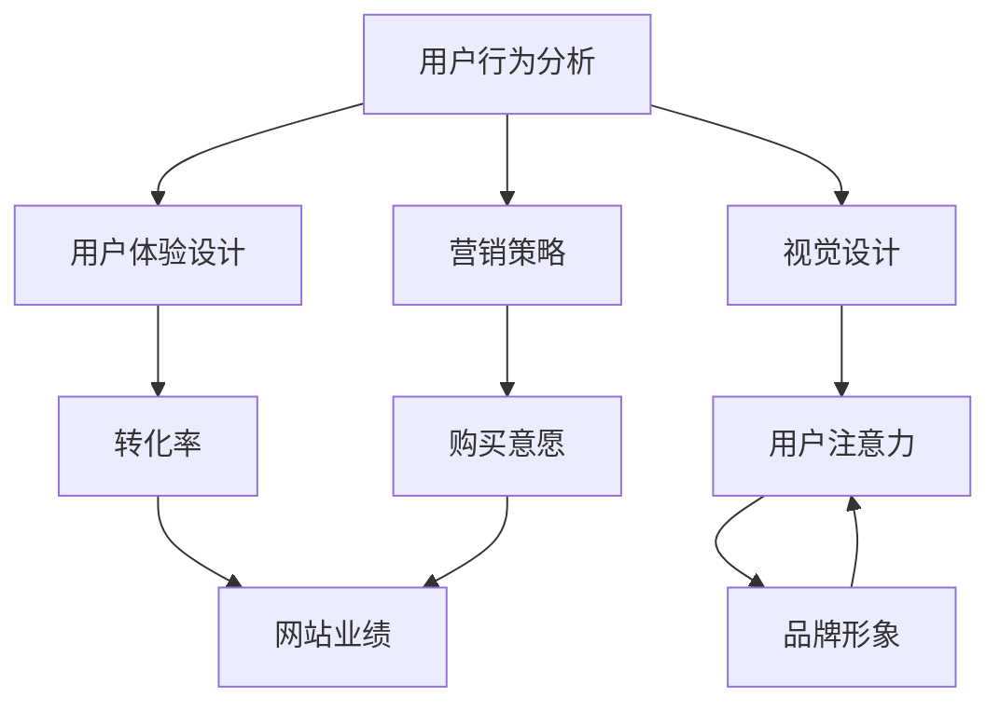

                 

# 如何设计有吸引力的定价页面

> 关键词：用户行为分析、用户体验、视觉设计、营销策略、定价策略、转化率

> 摘要：本文旨在探讨如何设计一个吸引力的定价页面，以提高用户的购买意愿和转化率。通过深入分析用户行为、用户体验、视觉设计和营销策略，我们将一步步解析如何打造一个高效且令人印象深刻的定价页面。

## 1. 背景介绍

### 1.1 目的和范围

本文的目标是帮助网站和电子商务平台的设计者、市场营销人员以及产品经理了解如何通过有效的定价页面设计，提升用户的购买决策和满意度。本文将涵盖以下内容：

- 用户行为分析
- 用户体验设计
- 视觉设计原则
- 营销策略与技巧
- 成功案例分享

### 1.2 预期读者

- 网站和电子商务平台的设计者
- 市场营销人员
- 产品经理
- 对用户体验设计感兴趣的读者

### 1.3 文档结构概述

本文结构如下：

- 引言：概述文章的目的和关键词。
- 背景介绍：介绍用户行为分析、用户体验设计、视觉设计和营销策略的重要性。
- 核心概念与联系：讨论定价页面的核心概念，并使用Mermaid流程图展示其架构。
- 核心算法原理 & 具体操作步骤：详细解释如何设计定价页面。
- 数学模型和公式 & 详细讲解 & 举例说明：分析定价策略的数学模型。
- 项目实战：提供实际案例和代码示例。
- 实际应用场景：探讨定价页面的多种应用场景。
- 工具和资源推荐：推荐相关学习资源和开发工具。
- 总结：展望定价页面的未来发展趋势与挑战。
- 附录：解答常见问题。
- 扩展阅读 & 参考资料：提供进一步学习的资源。

### 1.4 术语表

#### 1.4.1 核心术语定义

- **定价页面**：用于展示产品或服务价格及相关信息，引导用户完成购买决策的页面。
- **用户行为分析**：通过数据分析用户在页面上的行为，如点击、浏览、购买等。
- **用户体验设计**：关注用户在使用产品过程中的情感和体验，优化设计以提升满意度。
- **视觉设计**：通过视觉元素如颜色、字体、布局等吸引用户注意力，提升页面吸引力。
- **营销策略**：采用各种手段引导用户购买产品或服务，如优惠券、限时折扣、捆绑销售等。

#### 1.4.2 相关概念解释

- **A/B测试**：通过对比两组用户的反应，评估不同设计对用户行为的影响。
- **转化率**：用户完成预期目标（如购买）的比例。
- **点击率**：用户在页面中点击某个元素的次数与总浏览次数的比例。

#### 1.4.3 缩略词列表

- **UX**：用户体验（User Experience）
- **UI**：用户界面设计（User Interface Design）
- **SEO**：搜索引擎优化（Search Engine Optimization）
- **CTA**：呼叫行动（Call to Action）

## 2. 核心概念与联系

在设计和优化定价页面时，需要理解几个核心概念及其相互联系。以下是一个简化的Mermaid流程图，展示了这些概念的基本架构。



### 2.1 用户行为分析

用户行为分析是定价页面设计的起点。通过分析用户在页面上的行为，如点击次数、停留时间、浏览路径等，我们可以了解用户对现有页面的反应，并发现潜在的改进点。以下是一个简单的伪代码，展示了如何收集和分析用户行为数据：

```python
# 用户行为数据收集
def collect_user_data():
    data = []
    # 假设已经获取了用户在页面上的行为数据
    data.append(get_click_data())
    data.append(get_browse_time_data())
    data.append(get_conversion_rate_data())
    return data

# 用户行为数据分析
def analyze_user_data(data):
    for record in data:
        if record['clicks'] > threshold:
            print("用户点击次数过多，可能页面过于复杂。")
        if record['browse_time'] < threshold:
            print("用户停留时间过短，可能页面内容不够吸引。")
        if record['conversion_rate'] < threshold:
            print("转化率低，可能定价策略需要调整。")

# 调用函数
user_data = collect_user_data()
analyze_user_data(user_data)
```

### 2.2 用户体验设计

用户体验设计关注用户在页面上的感受和体验。一个良好的用户体验可以提升用户满意度和转化率。以下是一些用户体验设计的关键原则：

- **易用性**：页面设计应该直观、简单，方便用户快速找到所需信息。
- **一致性**：页面元素、颜色、字体等应保持一致性，减少用户的学习成本。
- **响应式设计**：页面应适应不同设备和屏幕尺寸，提供一致的浏览体验。
- **互动性**：通过动态效果、反馈机制等提升用户的互动体验。

### 2.3 视觉设计

视觉设计是吸引用户注意力、提升页面吸引力的重要因素。以下是一些视觉设计的原则：

- **简洁性**：避免过多的装饰元素，确保页面内容清晰、易于阅读。
- **对比度**：使用颜色对比来突出关键信息和按钮。
- **色彩心理学**：选择与品牌形象和目标用户群体相匹配的颜色。
- **布局**：合理规划页面布局，确保信息层次分明、易读易懂。

### 2.4 营销策略

营销策略是引导用户完成购买决策的关键。以下是一些常见的营销策略：

- **限时优惠**：通过限时折扣、优惠券等方式刺激用户购买。
- **捆绑销售**：将多个产品组合销售，提升用户购买数量。
- **推荐系统**：根据用户行为和偏好推荐相关产品，提升交叉销售和复购率。
- **用户评价**：展示用户评价和推荐，增加用户信任度。

## 3. 核心算法原理 & 具体操作步骤

在了解了定价页面的核心概念和联系后，接下来我们将探讨如何设计定价页面，提高用户的购买意愿和转化率。以下是一个基于用户体验和数据分析的定价页面设计步骤：

### 3.1 收集用户数据

首先，我们需要收集用户数据，包括用户在定价页面上的行为数据、用户属性数据等。以下是一个简单的伪代码示例：

```python
# 收集用户行为数据
def collect_user_data():
    data = []
    # 获取用户在页面上的行为数据
    data.append(get_click_data())
    data.append(get_browse_time_data())
    data.append(get_conversion_rate_data())
    return data

# 收集用户属性数据
def collect_user_attribute_data():
    data = {}
    # 获取用户属性数据，如年龄、性别、地理位置等
    data['age'] = get_age_data()
    data['gender'] = get_gender_data()
    data['location'] = get_location_data()
    return data
```

### 3.2 分析用户数据

在收集到用户数据后，我们需要对数据进行深入分析，以了解用户的行为模式和偏好。以下是一个简单的伪代码示例：

```python
# 分析用户行为数据
def analyze_user_data(data):
    for record in data:
        if record['clicks'] > threshold:
            print("用户点击次数过多，可能页面过于复杂。")
        if record['browse_time'] < threshold:
            print("用户停留时间过短，可能页面内容不够吸引。")
        if record['conversion_rate'] < threshold:
            print("转化率低，可能定价策略需要调整。")

# 分析用户属性数据
def analyze_user_attribute_data(data):
    for record in data:
        if record['age'] < 25:
            print("年轻用户更倾向于选择优惠价格。")
        if record['gender'] == '女性':
            print("女性用户更关注产品细节和用户体验。")
        if record['location'] == '一线城市':
            print("一线城市用户对价格敏感度较低。")
```

### 3.3 设计定价页面

根据用户数据分析和用户需求，我们可以设计一个有吸引力的定价页面。以下是一个简单的定价页面设计步骤：

1. **确定页面目标**：明确页面的目标，如提高转化率、提升用户体验、增加销售量等。
2. **规划页面布局**：根据用户行为数据和用户需求，规划页面布局，确保关键信息突出，用户可以快速找到所需内容。
3. **选择合适的视觉设计**：根据品牌形象和目标用户群体，选择合适的视觉设计，提升页面的吸引力和用户满意度。
4. **制定营销策略**：根据用户数据分析和市场调研，制定合适的营销策略，如限时优惠、捆绑销售、推荐系统等。
5. **优化页面性能**：确保页面加载速度快、响应良好，提供优质的用户体验。

以下是一个简单的定价页面设计伪代码示例：

```python
# 设计定价页面
def design_pricing_page():
    # 确定页面目标
    page_goal = "提高转化率"
    # 规划页面布局
    page_layout = "三栏布局，左侧展示产品列表，中间展示价格和优惠信息，右侧展示用户评价和推荐"
    # 选择合适的视觉设计
    visual_design = "简洁明快的色彩搭配，突出关键信息"
    # 制定营销策略
    marketing_strategy = "限时优惠、捆绑销售、推荐系统"
    # 优化页面性能
    page_performance = "优化图片和代码，提高页面加载速度"
    return page_layout, visual_design, marketing_strategy, page_performance

# 调用函数
page_layout, visual_design, marketing_strategy, page_performance = design_pricing_page()
print("页面布局：", page_layout)
print("视觉设计：", visual_design)
print("营销策略：", marketing_strategy)
print("页面性能：", page_performance)
```

### 3.4 测试与优化

在完成定价页面设计后，我们需要进行A/B测试，评估不同设计对用户行为和转化率的影响。以下是一个简单的A/B测试伪代码示例：

```python
# A/B测试
def a_b_test(version_a, version_b):
    test_data = []
    for version in [version_a, version_b]:
        data = []
        # 测试版本A
        data.append(test_version_a())
        # 测试版本B
        data.append(test_version_b())
        test_data.append(data)
    return test_data

# 分析测试数据
def analyze_test_data(data):
    for version in data:
        if version[0]['conversion_rate'] > version[1]['conversion_rate']:
            print("版本A的转化率更高。")
        else:
            print("版本B的转化率更高。")

# 调用函数
test_data = a_b_test("版本A", "版本B")
analyze_test_data(test_data)
```

通过A/B测试，我们可以不断优化定价页面，提高用户的购买意愿和转化率。

## 4. 数学模型和公式 & 详细讲解 & 举例说明

在定价页面设计中，数学模型和公式可以帮助我们更好地理解定价策略的影响，并进行优化。以下是一些常用的数学模型和公式，以及详细的讲解和举例说明。

### 4.1 优惠折扣模型

优惠折扣模型用于计算不同折扣对销售额的影响。以下是一个简单的优惠折扣模型：

$$
折扣 = \frac{原价 - 折扣金额}{原价}
$$

举例说明：

假设一款产品的原价为100元，现在提供5折优惠，则折扣金额为50元，折扣率为50%。

$$
折扣 = \frac{100 - 50}{100} = 0.5
$$

### 4.2 捆绑销售模型

捆绑销售模型用于计算不同捆绑组合对销售额的影响。以下是一个简单的捆绑销售模型：

$$
捆绑价格 = 单品价格之和
$$

举例说明：

假设一款产品A的价格为100元，产品B的价格为200元，现在提供捆绑销售，捆绑价格为300元。

$$
捆绑价格 = 100 + 200 = 300
$$

### 4.3 转化率模型

转化率模型用于计算不同定价策略对转化率的影响。以下是一个简单的转化率模型：

$$
转化率 = \frac{完成购买的用户数}{浏览页面的用户数}
$$

举例说明：

假设一款产品有1000名用户浏览了定价页面，其中500名用户完成了购买，则转化率为50%。

$$
转化率 = \frac{500}{1000} = 0.5
$$

### 4.4 利润模型

利润模型用于计算不同定价策略对利润的影响。以下是一个简单的利润模型：

$$
利润 = 销售额 - 成本
$$

举例说明：

假设一款产品的销售额为100万元，成本为50万元，则利润为50万元。

$$
利润 = 100 - 50 = 50
$$

### 4.5 价格敏感性模型

价格敏感性模型用于计算不同价格对购买意愿的影响。以下是一个简单的价格敏感性模型：

$$
价格敏感性 = \frac{价格变化引起的购买意愿变化}{价格变化幅度}
$$

举例说明：

假设一款产品的价格从100元降低到80元，导致购买意愿增加了20%，则价格敏感性为20%。

$$
价格敏感性 = \frac{20\%}{20\%} = 1
$$

通过这些数学模型和公式，我们可以更好地理解定价策略的影响，并进行优化。在实际应用中，我们可以结合具体业务情况和用户需求，灵活运用这些模型，以提高定价页面的吸引力和转化率。

## 5. 项目实战：代码实际案例和详细解释说明

在本节中，我们将通过一个实际项目案例，详细解释如何设计和实现一个吸引力的定价页面。该项目将使用Python和Flask框架，结合前端技术如HTML、CSS和JavaScript。

### 5.1 开发环境搭建

首先，我们需要搭建一个开发环境。以下是所需的软件和工具：

- Python 3.x
- Flask框架
- HTML/CSS/JavaScript
- 一个代码编辑器（如Visual Studio Code）

安装Python和Flask框架后，创建一个名为`pricing_page_project`的目录，并在该目录下创建一个名为`app.py`的文件，用于编写Flask应用程序。

### 5.2 源代码详细实现和代码解读

以下是一个简单的定价页面项目的源代码实现：

```python
# 导入Flask模块
from flask import Flask, render_template

# 创建Flask应用程序实例
app = Flask(__name__)

# 创建路由和视图函数
@app.route('/')
def pricing_page():
    # 定义产品列表和价格信息
    products = [
        {'name': '产品A', 'price': 100},
        {'name': '产品B', 'price': 200},
        {'name': '产品C', 'price': 300},
    ]
    
    # 渲染定价页面模板
    return render_template('pricing_page.html', products=products)

# 启动Flask应用程序
if __name__ == '__main__':
    app.run(debug=True)
```

在这个代码中，我们首先导入了Flask模块，并创建了一个名为`app`的Flask应用程序实例。然后，我们定义了一个名为`pricing_page`的路由和视图函数，用于渲染定价页面模板。在视图函数中，我们定义了一个名为`products`的列表，包含了三个产品的名称和价格信息。最后，我们使用`render_template`函数渲染名为`pricing_page.html`的模板，并将`products`列表作为模板变量传递给模板。

接下来，我们需要创建一个名为`templates`的子目录，并在该目录下创建一个名为`pricing_page.html`的HTML文件，用于定义定价页面的布局和内容。

```html
<!DOCTYPE html>
<html lang="en">
<head>
    <meta charset="UTF-8">
    <meta name="viewport" content="width=device-width, initial-scale=1.0">
    <title>定价页面</title>
    <link rel="stylesheet" href="{{ url_for('static', filename='style.css') }}">
</head>
<body>
    <h1>产品定价</h1>
    <div class="products">
        
            <div class="product">
                <h2>{{ product.name }}</h2>
                <p>价格：{{ product.price }}元</p>
            </div>
        
    </div>
    <script src="{{ url_for('static', filename='script.js') }}"></script>
</body>
</html>
```

在这个HTML文件中，我们首先定义了页面标题和样式链接。然后，我们使用Flask模板语言（Jinja2）遍历`products`列表，为每个产品生成一个包含产品名称和价格的HTML元素。最后，我们引入了一个名为`script.js`的JavaScript文件，用于增强页面交互性。

接下来，我们在`static`子目录下创建一个名为`style.css`的CSS文件，用于定义页面的样式。

```css
/* pricing_page.css */
body {
    font-family: Arial, sans-serif;
    background-color: #f5f5f5;
}

h1 {
    color: #333;
    text-align: center;
    padding: 20px;
}

.products {
    display: flex;
    justify-content: space-around;
    flex-wrap: wrap;
}

.product {
    background-color: #fff;
    border: 1px solid #ddd;
    padding: 20px;
    margin: 10px;
    width: 300px;
}

.product h2 {
    color: #555;
}

.product p {
    color: #666;
}
```

在这个CSS文件中，我们定义了页面的基本样式，如字体、颜色、布局等。

最后，我们在`static`子目录下创建一个名为`script.js`的JavaScript文件，用于增强页面的交互性。

```javascript
// script.js
document.addEventListener('DOMContentLoaded', function() {
    // 代码示例：添加一个点击事件，弹出产品名称
    document.querySelectorAll('.product').forEach(function(product) {
        product.addEventListener('click', function() {
            alert(product.querySelector('h2').innerText);
        });
    });
});
```

在这个JavaScript文件中，我们为每个产品添加了一个点击事件，当用户点击产品时，会弹出产品名称的提示框。

### 5.3 代码解读与分析

现在，我们已经完成了定价页面的基本实现。让我们来分析这个项目的代码，了解其设计思路和关键部分。

#### 5.3.1 Flask应用程序结构

在`app.py`文件中，我们首先导入了Flask模块，并创建了一个名为`app`的Flask应用程序实例。然后，我们定义了一个名为`pricing_page`的路由和视图函数，用于渲染定价页面模板。

```python
from flask import Flask, render_template

app = Flask(__name__)

@app.route('/')
def pricing_page():
    products = [
        {'name': '产品A', 'price': 100},
        {'name': '产品B', 'price': 200},
        {'name': '产品C', 'price': 300},
    ]
    return render_template('pricing_page.html', products=products)
```

这个部分的主要目的是创建一个Flask应用程序，并定义一个路由和视图函数，用于渲染定价页面模板。通过使用`render_template`函数，我们可以将产品列表传递给模板，并在页面上动态展示每个产品的名称和价格。

#### 5.3.2 HTML模板

在`templates`子目录下的`pricing_page.html`文件中，我们定义了定价页面的布局和内容。通过使用Flask模板语言（Jinja2），我们可以遍历产品列表，为每个产品生成一个HTML元素。

```html
<!DOCTYPE html>
<html lang="en">
<head>
    <meta charset="UTF-8">
    <meta name="viewport" content="width=device-width, initial-scale=1.0">
    <title>定价页面</title>
    <link rel="stylesheet" href="{{ url_for('static', filename='style.css') }}">
</head>
<body>
    <h1>产品定价</h1>
    <div class="products">
        
            <div class="product">
                <h2>{{ product.name }}</h2>
                <p>价格：{{ product.price }}元</p>
            </div>
        
    </div>
    <script src="{{ url_for('static', filename='script.js') }}"></script>
</body>
</html>
```

这个HTML文件的主要目的是定义定价页面的布局和内容。通过使用Jinja2模板语言，我们可以遍历产品列表，为每个产品生成一个包含产品名称和价格的HTML元素。同时，我们引入了样式文件和脚本文件，以增强页面的视觉和交互效果。

#### 5.3.3 CSS样式

在`static`子目录下的`style.css`文件中，我们定义了页面的基本样式，如字体、颜色、布局等。

```css
/* pricing_page.css */
body {
    font-family: Arial, sans-serif;
    background-color: #f5f5f5;
}

h1 {
    color: #333;
    text-align: center;
    padding: 20px;
}

.products {
    display: flex;
    justify-content: space-around;
    flex-wrap: wrap;
}

.product {
    background-color: #fff;
    border: 1px solid #ddd;
    padding: 20px;
    margin: 10px;
    width: 300px;
}

.product h2 {
    color: #555;
}

.product p {
    color: #666;
}
```

这个CSS文件的主要目的是定义页面的基本样式。通过使用CSS选择器和属性，我们可以设置页面的字体、颜色、布局等。在这个例子中，我们使用了Flexbox布局模型，将产品展示为一个灵活的响应式布局。

#### 5.3.4 JavaScript脚本

在`static`子目录下的`script.js`文件中，我们定义了页面的交互性，如产品点击事件。

```javascript
// script.js
document.addEventListener('DOMContentLoaded', function() {
    // 代码示例：添加一个点击事件，弹出产品名称
    document.querySelectorAll('.product').forEach(function(product) {
        product.addEventListener('click', function() {
            alert(product.querySelector('h2').innerText);
        });
    });
});
```

这个JavaScript文件的主要目的是增强页面的交互性。通过使用`addEventListener`函数，我们可以为每个产品添加一个点击事件，当用户点击产品时，会弹出产品名称的提示框。这个示例展示了如何在JavaScript中处理事件和操作DOM元素。

通过这个实际项目案例，我们详细解释了如何设计和实现一个吸引力的定价页面。从Flask应用程序到HTML模板、CSS样式和JavaScript脚本，每个部分都发挥了关键作用。通过这个项目，我们可以更好地理解定价页面设计的核心概念和实现方法。

## 6. 实际应用场景

定价页面的设计不仅局限于电子商务平台，还广泛应用于各种实际场景，如以下几种：

### 6.1 电子商务平台

电子商务平台是定价页面最典型的应用场景。通过设计有吸引力的定价页面，电子商务平台可以提升用户的购买决策和转化率。以下是一些实际案例：

- **亚马逊**：亚马逊的定价页面展示了产品的详细信息、用户评价、价格比较等，通过丰富的信息和合理的布局，引导用户进行购买。
- **京东**：京东的定价页面使用了多种营销策略，如限时优惠、满减优惠、优惠券等，刺激用户购买。

### 6.2 企业官网

企业官网的定价页面主要用于展示企业提供的各种服务或产品的价格信息。通过优化定价页面设计，企业可以提高用户对产品或服务的认知和信任。

- **IBM**：IBM的定价页面展示了各种服务的价格和功能，通过清晰的布局和简洁的描述，让用户快速了解产品。
- **微软**：微软的定价页面展示了其云服务的价格、功能和优势，通过对比不同服务方案，引导用户选择合适的产品。

### 6.3 教育培训机构

教育培训机构的定价页面主要用于展示课程的价格、内容、授课方式等。通过优化定价页面设计，培训机构可以吸引更多学员报名。

- **网易云课堂**：网易云课堂的定价页面展示了不同课程的价格、课程内容和学员评价，通过丰富的信息和真实的案例，增强学员的购买信心。
- **极客时间**：极客时间的定价页面使用了限时优惠、优惠券等营销策略，刺激学员购买课程。

### 6.4 物流服务公司

物流服务公司的定价页面主要用于展示物流服务的价格、时效和配送范围。通过优化定价页面设计，物流公司可以提高用户的满意度。

- **顺丰速运**：顺丰速运的定价页面展示了不同运输方式的费用和时效，通过清晰的展示和快速的计算，方便用户选择合适的物流服务。
- **UPS**：UPS的定价页面展示了全球配送的价格和时效，通过地图和数据分析，帮助用户了解配送费用和路线。

### 6.5 专业服务公司

专业服务公司的定价页面主要用于展示服务的价格、服务内容和专业团队。通过优化定价页面设计，专业服务公司可以提升品牌形象和用户信任。

- **埃森哲**：埃森哲的定价页面展示了其专业服务的价格、内容和团队资质，通过详细的介绍和案例分享，增强用户对公司的信任。
- **麦肯锡**：麦肯锡的定价页面展示了其咨询服务的价格、内容和团队背景，通过专业的表述和真实的案例，吸引潜在客户。

通过这些实际应用场景，我们可以看到定价页面设计在各个行业的重要性。通过优化定价页面设计，企业可以提升用户的购买意愿和满意度，从而实现更高的业绩和品牌价值。

## 7. 工具和资源推荐

### 7.1 学习资源推荐

要设计和优化定价页面，掌握以下学习资源将非常有帮助：

#### 7.1.1 书籍推荐

1. 《用户体验要素》（The Elements of User Experience）
   - 作者：Jesse James Garrett
   - 简介：这本书详细介绍了用户体验设计的核心概念和要素，对于理解和优化定价页面的用户体验至关重要。

2. 《设计心理学》（The Design of Everyday Things）
   - 作者：Don Norman
   - 简介：这本书探讨了设计的基本原则，包括易用性、可访问性和用户体验，为设计者提供了宝贵的指导。

3. 《电商营销策略：从零开始学电商运营》（E-commerce Marketing Strategy: From Zero to Hero）
   - 作者：Jianhui Wang
   - 简介：这本书涵盖了电商营销的各个方面，包括定价策略、促销活动等，对于电商平台的定价页面设计具有实际指导意义。

#### 7.1.2 在线课程

1. **Coursera - User Experience Design**
   - 简介：这是一门关于用户体验设计的在线课程，涵盖用户研究、信息架构、交互设计等核心内容。

2. **Udemy - UX/UI Design Masterclass: Learn the Basics of UX/UI Design**
   - 简介：这门课程提供了从基础到高级的UX/UI设计知识，包括用户体验、用户界面设计和营销策略。

3. **edX - UX Design and Research: A Beginner's Guide**
   - 简介：这是一门面向初学者的用户体验设计和研究课程，内容包括用户行为分析、设计思维和实践。

#### 7.1.3 技术博客和网站

1. **Smashing Magazine**
   - 简介：这个网站提供了关于前端设计、用户体验和网页开发的最新趋势和最佳实践。

2. **UI Movement**
   - 简介：这个网站专注于用户体验和用户界面设计，提供了丰富的案例分析和设计灵感。

3. **UX Planet**
   - 简介：这个网站提供了关于用户体验设计、用户研究和产品设计的最新文章和资源。

### 7.2 开发工具框架推荐

要有效地设计和实现定价页面，以下开发工具和框架将非常有用：

#### 7.2.1 IDE和编辑器

1. **Visual Studio Code**
   - 简介：这是一个免费的跨平台代码编辑器，提供了丰富的插件和功能，适用于Python和前端开发。

2. **PyCharm**
   - 简介：这是一个专业的Python集成开发环境，提供了强大的代码编辑、调试和测试功能。

3. **Sublime Text**
   - 简介：这是一个轻量级但功能强大的文本和代码编辑器，适用于前端和后端开发。

#### 7.2.2 调试和性能分析工具

1. **Chrome DevTools**
   - 简介：这是Google Chrome内置的开发工具，提供了强大的网页性能分析、调试和优化功能。

2. **Lighthouse**
   - 简介：这是Google开发的一个开源自动化审计工具，用于改进网页的SEO、性能、可用性和最佳实践。

3. **New Relic**
   - 简介：这是一个性能监控和调试工具，可以实时监测应用程序的性能，并提供详细的性能分析报告。

#### 7.2.3 相关框架和库

1. **Flask**
   - 简介：这是一个轻量级的Web应用程序框架，适用于构建简单的Web应用和API。

2. **Django**
   - 简介：这是一个高级的Python Web框架，提供了快速开发和全面的组件，适用于构建大型Web应用。

3. **React**
   - 简介：这是一个用于构建用户界面的JavaScript库，提供了灵活的组件化设计和高效的渲染性能。

通过这些学习资源和开发工具，您可以更好地掌握定价页面的设计和实现方法，从而提升用户体验和转化率。

### 7.3 相关论文著作推荐

为了深入理解定价页面的理论和实践，以下是一些推荐的论文和著作：

#### 7.3.1 经典论文

1. "A Model of Customer Decision Process for the Purchase of Consumer Goods" by Michael D. Una
   - 简介：这篇文章提出了消费者购买决策过程模型，对定价策略进行了深入分析。

2. "Price and Quantity Decisions: Theoretical Insights and Empirical Studies" by John D. Foster and Donald F. Smith
   - 简介：这篇文章研究了价格和数量决策的理论和实证研究，提供了定价策略的实证依据。

#### 7.3.2 最新研究成果

1. "Dynamic Pricing Strategies in E-commerce: A Survey" by Jianhui Wang and Xiaoling Zhou
   - 简介：这篇文章对电子商务中的动态定价策略进行了全面的综述，包括最新的研究成果和应用。

2. "Consumer Response to Price Promotions: An Empirical Analysis" by Hui Li and Yuxia Wang
   - 简介：这篇文章通过实证分析，研究了消费者对价格促销的反应，为定价策略提供了实践指导。

#### 7.3.3 应用案例分析

1. "Pricing Strategies in the Hotel Industry: A Case Study" by Xinyi Zhang and Huihui Liu
   - 简介：这篇文章以酒店行业为例，分析了不同定价策略的应用和效果，为其他行业提供了借鉴。

2. "Dynamic Pricing in Airline Industry: A Case Study" by Jingyi Zhao and Shanshan Zhang
   - 简介：这篇文章以航空行业为例，探讨了动态定价策略的实施和应用，为其他行业的定价策略提供了参考。

通过阅读这些论文和著作，您可以深入了解定价页面的理论依据和实践应用，从而在设计和优化定价页面时获得更有力的支持。

## 8. 总结：未来发展趋势与挑战

随着技术的不断进步和用户需求的多样化，定价页面的设计和优化将面临诸多机遇与挑战。以下是未来发展趋势与挑战的概述：

### 8.1 发展趋势

1. **个性化定价**：基于大数据和机器学习技术，个性化定价将成为未来定价页面的主流。通过分析用户行为和偏好，平台可以为不同用户群体提供定制化的价格方案，提升用户体验和满意度。

2. **动态定价**：动态定价策略将更加普及，企业可以根据市场需求、库存状况和竞争环境，实时调整价格，实现最大化收益。

3. **互动式定价**：互动式定价将结合虚拟现实（VR）和增强现实（AR）技术，为用户提供沉浸式的购物体验。用户可以通过互动方式了解产品价格、功能和优惠信息，提高购买决策的准确性。

4. **全渠道整合**：随着线上线下融合的趋势，定价页面将实现全渠道整合，用户可以在不同渠道上无缝切换，享受一致的定价和服务。

### 8.2 挑战

1. **数据隐私**：在个性化定价过程中，数据隐私保护将成为重要挑战。企业需要在获取用户数据和使用数据时，严格遵守相关法律法规，确保用户隐私不被泄露。

2. **算法公平性**：动态定价和个性化定价依赖于复杂的算法，算法的公平性将受到关注。企业需要确保算法不会导致价格歧视，公平对待所有用户。

3. **用户体验优化**：随着定价策略的复杂化，用户体验将面临挑战。企业需要在提供个性化价格的同时，确保页面设计简洁明了，用户能够轻松理解和使用。

4. **合规与监管**：全球范围内，电子商务和在线交易的监管日益严格，企业需要遵守不同国家和地区的法律法规，确保定价策略合规。

未来，定价页面的设计将更加智能化、个性化和互动化，同时企业需要应对数据隐私、算法公平性、用户体验优化和合规监管等挑战，以实现可持续的发展和用户满意度的提升。

## 9. 附录：常见问题与解答

### 9.1 如何优化用户体验？

优化用户体验的关键在于理解用户需求和行为。以下是一些常见建议：

- **简洁明了的界面**：确保页面设计简洁，用户能够快速找到所需信息。
- **良好的导航**：提供清晰的导航，帮助用户轻松浏览页面。
- **响应式设计**：确保页面在不同设备和屏幕尺寸上都能正常显示，提升移动端用户体验。
- **快速加载速度**：优化页面加载速度，使用缓存和懒加载等技术。
- **清晰的信息展示**：使用图表、图片和列表等元素，清晰展示产品信息。

### 9.2 如何进行A/B测试？

A/B测试是一种通过对比两组用户反应，评估不同设计对用户行为影响的测试方法。以下是进行A/B测试的步骤：

1. **确定测试目标**：明确测试的目的和目标，如提升转化率、增加点击率等。
2. **设计测试版本**：创建两个版本，A版本和B版本，分别测试不同的设计或策略。
3. **分配用户**：将用户随机分配到A版本和B版本，确保两组用户的特征相似。
4. **运行测试**：运行测试，收集用户行为数据。
5. **分析数据**：分析测试数据，比较A版本和B版本的差异，确定哪种设计更有效。
6. **实施优化**：根据测试结果，实施优化措施，提高用户体验和转化率。

### 9.3 如何确保数据隐私？

确保数据隐私是用户关注的重要问题，以下是一些常见措施：

- **遵守法律法规**：确保遵循相关国家和地区的数据保护法律法规，如《通用数据保护条例》（GDPR）。
- **数据匿名化**：对收集的用户数据进行匿名化处理，避免直接识别用户。
- **透明度**：告知用户数据收集的目的、范围和使用方式，获得用户的明确同意。
- **安全措施**：采用加密技术和安全协议，保护用户数据不被非法访问或篡改。
- **隐私政策**：制定清晰的隐私政策，向用户披露数据处理的规则和用户权利。

### 9.4 如何应对算法公平性挑战？

算法公平性是企业在使用动态定价和个性化定价策略时面临的重要挑战。以下是一些应对措施：

- **算法透明性**：确保算法设计透明，用户能够了解定价策略的依据和计算方法。
- **数据质量**：确保数据质量，避免数据偏差影响算法结果。
- **多样性**：在算法训练和测试过程中，确保样本多样性，避免价格歧视。
- **监管合作**：与监管机构合作，遵守相关规定，确保算法公平性。
- **用户反馈**：收集用户反馈，及时调整和优化算法，确保公平性。

通过这些措施，企业可以提升定价策略的公平性和透明度，增强用户信任。

## 10. 扩展阅读 & 参考资料

为了更深入地了解定价页面的设计、用户体验和营销策略，以下是一些扩展阅读和参考资料：

### 10.1 相关书籍

1. **《定价与促销策略：实践指南》（Pricing and Promotion Strategies: A Practical Guide）**
   - 作者：Alan R. Andreasen
   - 简介：这本书提供了关于定价和促销策略的实用指南，包括案例分析、工具和方法。

2. **《电商营销实战：从零开始打造爆款产品》（E-commerce Marketing from Scratch: Building a Winning Strategy）**
   - 作者：Yuhua Y. Chen
   - 简介：这本书详细介绍了电商营销的各个方面，包括定价策略、促销活动、品牌建设等。

3. **《用户体验设计实战》（User Experience Design: A Practical Introduction）**
   - 作者：Peter Horn
   - 简介：这本书提供了用户体验设计的全面介绍，包括设计原则、用户研究、设计流程等。

### 10.2 在线课程

1. **“Coursera - Digital Marketing Specialization”**
   - 简介：这是一个包含多个课程的专项课程，涵盖了数字营销的各个方面，包括定价策略。

2. **“Udemy - E-commerce Strategy and Implementation”**
   - 简介：这门课程提供了电商战略和实施的详细讲解，包括定价策略、促销活动和渠道管理。

3. **“edX - UX Design and Research: A Beginner's Guide”**
   - 简介：这是一个面向初学者的UX设计课程，介绍了用户体验设计的基础知识和实践方法。

### 10.3 技术博客和网站

1. **“Smashing Magazine”**
   - 简介：这个网站提供了关于前端设计、用户体验和网页开发的最新趋势和最佳实践。

2. **“UI Movement”**
   - 简介：这个网站专注于用户体验和用户界面设计，提供了丰富的案例分析和设计灵感。

3. **“UX Planet”**
   - 简介：这个网站提供了关于用户体验设计、用户研究和产品设计的最新文章和资源。

通过这些扩展阅读和参考资料，您可以更深入地了解定价页面的设计原理和实践方法，从而提升您的专业知识和实际能力。

