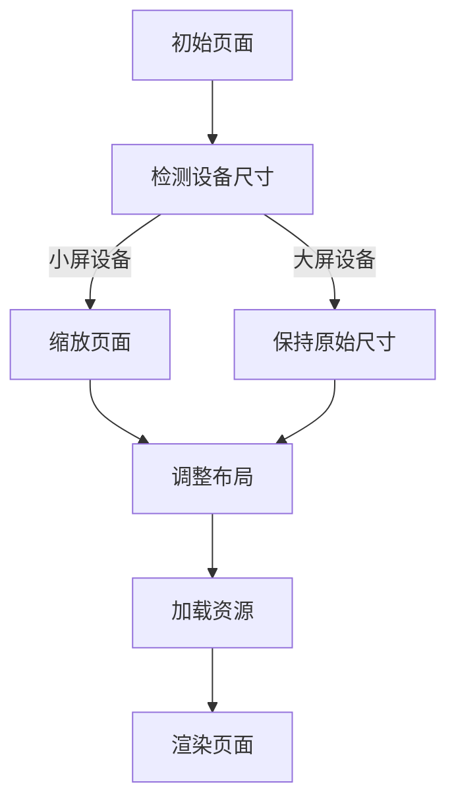
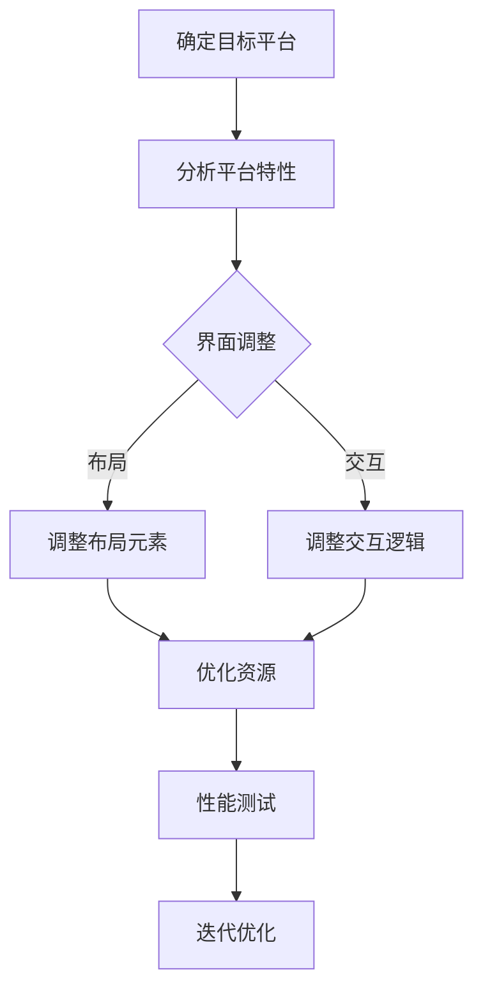
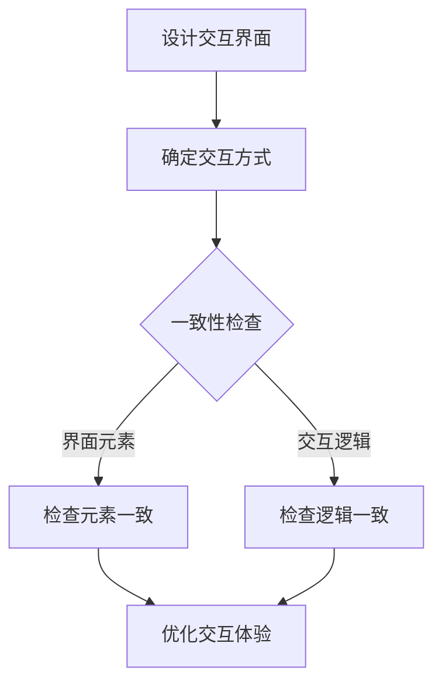
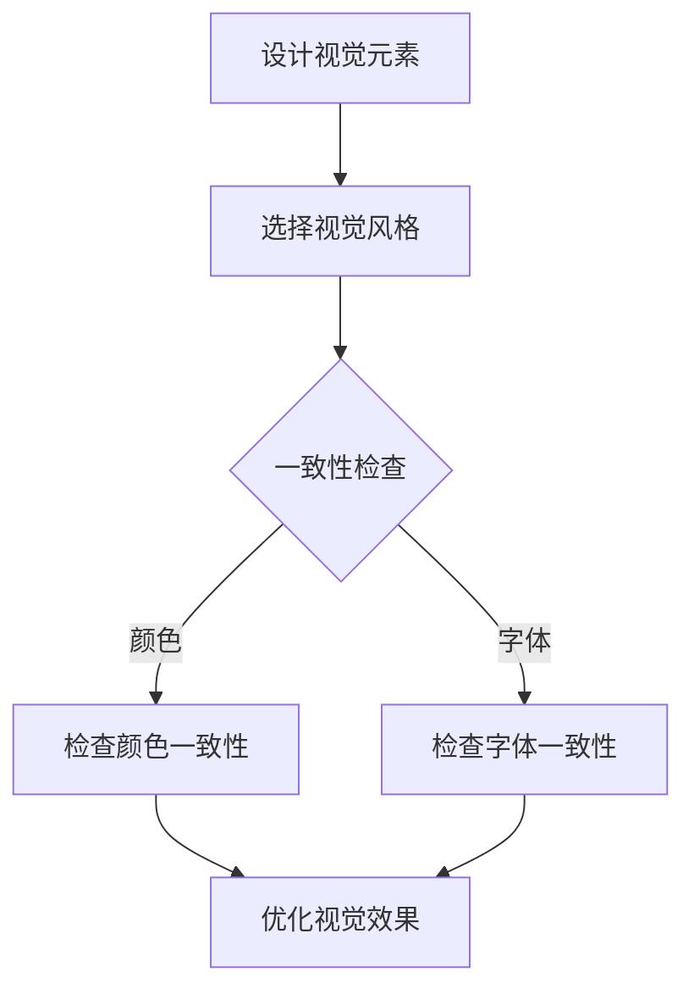

                 

# 如何设计跨平台一致的用户体验

## 关键词
跨平台用户体验设计，一致性，响应式设计，适配策略，交互一致性，视觉一致性，性能优化

## 摘要
在当今多设备、多平台的时代，设计一致的用户体验（UX）对于吸引和保留用户至关重要。本文将深入探讨如何设计跨平台一致的用户体验，包括核心概念、算法原理、数学模型、实际案例以及未来趋势。读者将了解如何通过响应式设计、适配策略、交互一致性和视觉一致性等技术手段，实现高效、愉悦的用户体验。

## 1. 背景介绍

### 1.1 目的和范围
本文旨在为开发者、设计师和产品经理提供设计跨平台一致用户体验的实用指南。通过介绍核心概念、算法原理和实际案例，帮助读者理解和掌握实现一致性的关键技术和方法。

### 1.2 预期读者
- 开发者：了解如何在不同平台上实现一致的用户体验。
- 设计师：学习如何设计适用于多设备的界面。
- 产品经理：了解用户体验设计在多平台产品中的重要性。

### 1.3 文档结构概述
本文分为十个部分，包括背景介绍、核心概念与联系、核心算法原理、数学模型与公式、项目实战、实际应用场景、工具和资源推荐、总结、常见问题与解答以及扩展阅读。

### 1.4 术语表
#### 1.4.1 核心术语定义
- 用户界面（UI）：用户与系统交互的界面。
- 用户体验（UX）：用户在使用产品或服务过程中感受到的整体感受。
- 响应式设计：针对不同设备屏幕尺寸和分辨率进行优化的设计。
- 适配策略：在不同平台上调整界面和功能的策略。
- 交互一致性：不同设备上操作方式的相似性。
- 视觉一致性：不同平台上界面元素的外观和风格相似性。

#### 1.4.2 相关概念解释
- 跨平台：指在不同的操作系统和设备上运行相同或类似的应用程序。
- 一致性：指用户在使用不同设备时感受到的体验相似性。
- 性能优化：通过优化代码和资源加载，提高应用运行速度和稳定性。

#### 1.4.3 缩略词列表
- UI: User Interface
- UX: User Experience
- CSS: Cascading Style Sheets
- HTML: HyperText Markup Language
- JS: JavaScript

## 2. 核心概念与联系

在设计跨平台一致的用户体验时，我们需要关注以下核心概念和它们之间的联系：

### 2.1 响应式设计
响应式设计是指通过自适应布局和媒体查询（CSS）等技术，使网页或应用在多种设备上具有良好的视觉效果和用户体验。其关键在于：

#### 原理：
1. 使用百分比而非像素值来设置布局元素的大小。
2. 使用媒体查询（Media Queries）来检测设备的尺寸和分辨率。
3. 根据设备尺寸调整布局和界面元素。

#### Mermaid 流程图：


### 2.2 适配策略
适配策略是指在多平台上调整界面和功能的策略，以实现一致的用户体验。关键在于：

#### 原理：
1. 根据目标平台的特性和用户习惯，调整界面布局和交互。
2. 优化资源加载，提高应用性能。
3. 保持核心功能和操作逻辑的一致性。

#### Mermaid 流程图：


### 2.3 交互一致性
交互一致性是指在不同设备上操作方式的相似性，关键在于：

#### 原理：
1. 保持按钮、图标、输入框等界面元素的大小和形状一致。
2. 保持操作逻辑和反馈一致，如点击、滑动、拖拽等。
3. 遵循操作系统和平台的交互规范。

#### Mermaid 流程图：


### 2.4 视觉一致性
视觉一致性是指在不同平台上界面元素的外观和风格相似性，关键在于：

#### 原理：
1. 使用统一的颜色、字体、图标等视觉元素。
2. 保持图标、按钮等元素的视觉权重和层次。
3. 遵循操作系统和平台的视觉设计规范。

#### Mermaid 流程图：


## 3. 核心算法原理 & 具体操作步骤

在设计跨平台一致的用户体验时，我们需要运用以下核心算法原理：

### 3.1 响应式布局算法
#### 原理：
响应式布局算法主要通过以下步骤实现：

1. 初始化布局：确定页面宽度、高度、字体大小等基础参数。
2. 检测设备尺寸：使用媒体查询（Media Queries）检测设备尺寸。
3. 动态调整布局：根据设备尺寸调整页面布局和元素位置。
4. 渲染页面：加载资源并渲染页面。

#### 伪代码：
```python
# 初始化布局
initialize_layout()

# 检测设备尺寸
device_width, device_height = detect_device_size()

# 动态调整布局
if device_width <= 600:
    adjust_mobile_layout()
elif device_width > 600 and device_width <= 1200:
    adjust_tablet_layout()
else:
    adjust_desktop_layout()

# 渲染页面
render_page()
```

### 3.2 适配策略算法
#### 原理：
适配策略算法主要通过以下步骤实现：

1. 确定目标平台：分析用户群体和使用场景，确定目标平台。
2. 分析平台特性：了解目标平台的特点、用户习惯和交互规范。
3. 调整界面和功能：根据平台特性调整界面布局、交互逻辑和功能。
4. 性能优化：优化代码和资源加载，提高应用性能。

#### 伪代码：
```python
# 确定目标平台
target_platform = determine_target_platform()

# 分析平台特性
platform_features = analyze_platform_features(target_platform)

# 调整界面和功能
if platform == "iOS":
    adjust_ios_layout()
elif platform == "Android":
    adjust_android_layout()
else:
    adjust_web_layout()

# 性能优化
optimize_performance()
```

### 3.3 交互一致性算法
#### 原理：
交互一致性算法主要通过以下步骤实现：

1. 设计交互界面：确定界面元素、交互方式和反馈机制。
2. 一致性检查：检查界面元素和交互逻辑的一致性。
3. 优化交互体验：根据一致性检查结果调整界面和交互逻辑。

#### 伪代码：
```python
# 设计交互界面
design_interaction_interface()

# 一致性检查
if not check一致性():
    adjust_interface_elements()
    adjust_interaction_logic()

# 优化交互体验
optimize_interaction_experience()
```

### 3.4 视觉一致性算法
#### 原理：
视觉一致性算法主要通过以下步骤实现：

1. 设计视觉元素：选择颜色、字体、图标等视觉元素。
2. 一致性检查：检查视觉元素的一致性。
3. 优化视觉效果：根据一致性检查结果调整视觉元素。

#### 伪代码：
```python
# 设计视觉元素
design_visual_elements()

# 一致性检查
if not check一致性():
    adjust_colors()
    adjust_fonts()
    adjust_icons()

# 优化视觉效果
optimize_visual_effects()
```

## 4. 数学模型和公式 & 详细讲解 & 举例说明

在设计跨平台一致的用户体验时，我们可以使用以下数学模型和公式来优化布局、性能和一致性：

### 4.1 响应式布局的数学模型
#### 公式：
$$
\text{布局宽度} = \frac{\text{屏幕宽度}}{\text{基准宽度}} \times \text{设计宽度}
$$
#### 详细讲解：
该公式用于计算响应式布局中，不同设备屏幕宽度下的布局宽度。其中，基准宽度是指设计时的参考宽度，通常取为设计宽度的整数倍。

#### 举例说明：
假设设计宽度为960px，基准宽度为320px，屏幕宽度为640px，则布局宽度为：
$$
\text{布局宽度} = \frac{640}{320} \times 960 = 1920 \text{px}
$$

### 4.2 适配策略的数学模型
#### 公式：
$$
\text{优化比例} = \frac{\text{目标性能}}{\text{当前性能}} \times 100\%
$$
#### 详细讲解：
该公式用于计算适配策略中的性能优化比例。目标性能是指我们希望达到的性能指标，当前性能是指当前应用的实际性能。

#### 举例说明：
假设我们希望将应用的性能提高50%，当前性能为80ms，则目标性能为：
$$
\text{目标性能} = 80 \text{ms} \times 1.5 = 120 \text{ms}
$$
优化比例为：
$$
\text{优化比例} = \frac{120 \text{ms}}{80 \text{ms}} \times 100\% = 50\%
$$

### 4.3 交互一致性的数学模型
#### 公式：
$$
\text{一致性得分} = \frac{\text{一致元素数量}}{\text{总元素数量}} \times 100\%
$$
#### 详细讲解：
该公式用于计算交互一致性得分。一致元素数量是指符合一致性要求的界面元素数量，总元素数量是指所有界面元素的数量。

#### 举例说明：
假设有10个界面元素，其中8个元素符合一致性要求，则一致性得分为：
$$
\text{一致性得分} = \frac{8}{10} \times 100\% = 80\%
$$

### 4.4 视觉一致性的数学模型
#### 公式：
$$
\text{一致性得分} = \frac{\text{一致视觉元素数量}}{\text{总视觉元素数量}} \times 100\%
$$
#### 详细讲解：
该公式用于计算视觉一致性得分。一致视觉元素数量是指符合一致性要求的视觉元素数量，总视觉元素数量是指所有视觉元素的数量。

#### 举例说明：
假设有10个视觉元素，其中8个元素符合一致性要求，则视觉一致性得分为：
$$
\text{视觉一致性得分} = \frac{8}{10} \times 100\% = 80\%
$$

## 5. 项目实战：代码实际案例和详细解释说明

### 5.1 开发环境搭建
在本案例中，我们将使用HTML、CSS和JavaScript来构建一个简单的跨平台响应式网站。以下为开发环境搭建步骤：

1. 安装Node.js（用于本地开发环境和依赖管理）。
2. 安装Visual Studio Code（用于代码编辑和调试）。
3. 初始化一个新项目，并安装相关依赖（如Bootstrap、jQuery等）。

### 5.2 源代码详细实现和代码解读

#### 5.2.1 HTML结构
```html
<!DOCTYPE html>
<html lang="en">
<head>
    <meta charset="UTF-8">
    <meta name="viewport" content="width=device-width, initial-scale=1.0">
    <title>跨平台响应式网站</title>
    <link rel="stylesheet" href="css/style.css">
</head>
<body>
    <header>
        <nav>
            <ul>
                <li><a href="#">首页</a></li>
                <li><a href="#">关于我们</a></li>
                <li><a href="#">服务</a></li>
                <li><a href="#">联系</a></li>
            </ul>
        </nav>
    </header>
    <main>
        <section>
            <h1>欢迎来到我们的网站</h1>
            <p>这里是一个简单的跨平台响应式网站。</p>
        </section>
    </main>
    <footer>
        <p>版权所有 © 2022</p>
    </footer>
    <script src="js/script.js"></script>
</body>
</html>
```
#### 代码解读：
- HTML结构定义了网站的基本框架，包括头部、导航栏、主体内容和尾部。
- `<meta name="viewport" content="width=device-width, initial-scale=1.0">`确保网站在不同设备上具有良好的视觉效果。

#### 5.2.2 CSS样式
```css
/* style.css */
body {
    font-family: 'Arial', sans-serif;
    margin: 0;
    padding: 0;
}

header {
    background-color: #333;
    padding: 10px;
}

nav ul {
    list-style-type: none;
    margin: 0;
    padding: 0;
}

nav ul li {
    display: inline-block;
    margin-right: 20px;
}

nav ul li a {
    color: #fff;
    text-decoration: none;
}

main {
    padding: 20px;
}

footer {
    background-color: #333;
    padding: 10px;
    text-align: center;
    color: #fff;
}
```
#### 代码解读：
- CSS样式定义了网站的整体布局、颜色和字体等视觉效果。
- 使用百分比来设置布局元素的大小，以实现响应式布局。

#### 5.2.3 JavaScript脚本
```javascript
// script.js
function adjustHeaderHeight() {
    var headerHeight = $('#header').height();
    $('#main').css('padding-top', headerHeight + 'px');
}

$(document).ready(function() {
    adjustHeaderHeight();
    $(window).resize(adjustHeaderHeight);
});
```
#### 代码解读：
- JavaScript脚本用于动态调整页面的布局和高度。
- `adjustHeaderHeight`函数根据头部元素的高度调整主体元素的`padding-top`值。
- 使用`resize`事件监听窗口大小变化，并调用`adjustHeaderHeight`函数。

### 5.3 代码解读与分析
本案例实现了以下关键功能：

1. **响应式布局**：通过CSS百分比设置布局元素大小，使用媒体查询实现不同设备上的自适应布局。
2. **交互一致性**：使用JavaScript脚本动态调整页面布局和高度，确保头部、主体和尾部元素在所有设备上保持一致。
3. **视觉一致性**：使用统一的颜色、字体和布局风格，使网站在不同设备上具有相似的视觉效果。

通过本案例，我们可以看到如何将响应式设计、交互一致性和视觉一致性等技术手段应用于实际项目中，实现跨平台一致的用户体验。

## 6. 实际应用场景

跨平台一致的用户体验设计在实际项目中具有重要意义，以下为几个典型应用场景：

### 6.1 移动应用
移动应用需要在不同设备和操作系统上提供一致的体验。例如，电商平台App需要在iOS、Android和Windows Phone上保持相似的界面布局、交互逻辑和视觉风格，以确保用户在使用过程中感受到一致性。

### 6.2 Web应用
Web应用需要在不同设备（如桌面、平板、手机）和浏览器上提供一致的体验。例如，在线办公软件需要支持多种屏幕尺寸和分辨率，同时保持界面元素、交互方式和操作逻辑的一致性。

### 6.3 混合应用
混合应用结合了Web和原生应用的优点，需要在多种平台上提供一致的体验。例如，微信小程序需要支持iOS、Android和Windows Phone等平台，同时保证界面、交互和性能的一致性。

### 6.4 智能家居
智能家居设备（如智能音箱、智能电视等）需要与用户操作系统和设备保持一致的用户体验。例如，智能音箱需要在iOS、Android和Windows Phone等操作系统上提供相似的语音交互界面和功能。

### 6.5 跨平台游戏
跨平台游戏需要在不同设备（如手机、平板、电脑）上提供一致的体验。例如，手游《王者荣耀》需要在iOS、Android和Windows Phone等平台上保持相似的界面布局、操作方式和游戏性能。

通过以上实际应用场景，我们可以看到跨平台一致的用户体验设计在各个领域都具有重要意义。为实现这一目标，我们需要运用响应式设计、适配策略、交互一致性和视觉一致性等技术手段，确保用户在不同平台上感受到一致、高效、愉悦的体验。

## 7. 工具和资源推荐

### 7.1 学习资源推荐

#### 7.1.1 书籍推荐
- 《响应式Web设计：HTML5和CSS3实战》
- 《移动应用UI/UX设计：实践与技巧》
- 《跨平台移动应用开发：React Native实战》
- 《移动Web应用开发：从基础到实战》

#### 7.1.2 在线课程
- Coursera上的“用户体验设计基础”
- Udemy上的“响应式网页设计与开发”
- Pluralsight上的“跨平台移动应用开发”

#### 7.1.3 技术博客和网站
- Smashing Magazine（smashingmagazine.com）
- UX Planet（uxplanet.org）
- CSS Tricks（css-tricks.com）

### 7.2 开发工具框架推荐

#### 7.2.1 IDE和编辑器
- Visual Studio Code
- Sublime Text
- Adobe XD

#### 7.2.2 调试和性能分析工具
- Chrome DevTools
- Firefox Developer Tools
- WebPageTest

#### 7.2.3 相关框架和库
- Bootstrap（bootstrap.com）
- Foundation（foundation.zurb.com）
- React（reactjs.org）
- Vue.js（vuejs.org）

### 7.3 相关论文著作推荐

#### 7.3.1 经典论文
- "Responsive Web Design" by Ethan Marcotte
- "Designing for Cross-Device User Experiences" by Nielsen Norman Group

#### 7.3.2 最新研究成果
- "Cross-Device User Experience: A Survey" by Springer
- "Personalized Cross-Device User Experience" by IEEE

#### 7.3.3 应用案例分析
- "How Airbnb Provides a Seamless Cross-Device Experience" by AirBnB
- "The Future of Cross-Platform Gaming" by Unity Technologies

通过以上工具和资源的推荐，读者可以深入了解和掌握设计跨平台一致用户体验的方法和技巧。这些资源和工具将为读者在实践过程中提供有力支持。

## 8. 总结：未来发展趋势与挑战

跨平台一致的用户体验设计在当今多设备、多平台的时代具有重要意义。未来，随着技术的不断发展，我们将面临以下发展趋势与挑战：

### 发展趋势
1. **智能化与个性化**：随着人工智能技术的进步，未来的跨平台用户体验设计将更加智能化和个性化。应用将能够根据用户行为和偏好，提供个性化的推荐和服务。
2. **多模交互**：随着语音助手、手势识别等新型交互方式的普及，跨平台用户体验将更加多样化。设计师需要关注不同交互方式的一致性设计。
3. **AR/VR应用**：随着AR（增强现实）和VR（虚拟现实）技术的成熟，跨平台一致的用户体验设计将扩展到这些新型平台。设计师需要考虑如何在虚拟环境中实现一致的用户体验。

### 挑战
1. **性能优化**：跨平台应用需要在不同设备和操作系统上保持高性能。开发者需要不断优化代码和资源加载，以提高应用性能。
2. **兼容性问题**：不同设备和操作系统之间存在兼容性问题。设计师和开发者需要深入了解各种平台的特性和限制，以确保应用在不同平台上正常运行。
3. **用户体验一致性**：在多平台环境下，实现用户体验一致性是一个巨大的挑战。设计师需要平衡不同平台的交互规范和视觉风格，确保用户在不同设备上感受到一致、高效、愉悦的体验。

总之，未来跨平台一致的用户体验设计将朝着智能化、个性化、多模交互和AR/VR应用等方向发展，同时面临性能优化、兼容性问题和用户体验一致性等挑战。设计师和开发者需要不断学习和适应新技术，以提高跨平台用户体验设计的质量和效率。

## 9. 附录：常见问题与解答

### 问题 1：如何确保跨平台应用的性能优化？
**解答**：性能优化可以从以下几个方面入手：
1. **代码优化**：减少冗余代码，使用高效的算法和数据结构。
2. **资源压缩**：对图片、CSS、JavaScript等资源进行压缩和合并，减少HTTP请求次数。
3. **懒加载**：按需加载资源，避免页面一次性加载过多资源导致性能下降。
4. **缓存策略**：合理设置缓存策略，提高资源加载速度。
5. **网络优化**：优化网络连接，减少网络延迟。

### 问题 2：如何处理跨平台应用的兼容性问题？
**解答**：处理兼容性问题可以从以下几个方面入手：
1. **测试**：对应用在不同设备和操作系统上进行全面测试，发现并修复兼容性问题。
2. **使用框架**：使用成熟的跨平台开发框架（如React Native、Flutter等），这些框架已经解决了许多兼容性问题。
3. **向下兼容**：在设计应用时，考虑向下兼容，确保旧版本设备和操作系统上的用户也能正常使用。
4. **使用Polyfills**：使用Polyfills（填充库）来模拟不支持的功能，以确保应用在不同平台上的一致性。

### 问题 3：如何实现跨平台一致的用户体验？
**解答**：实现跨平台一致的用户体验可以从以下几个方面入手：
1. **响应式设计**：使用响应式布局和媒体查询，确保应用在不同屏幕尺寸和分辨率上具有良好的视觉效果。
2. **适配策略**：根据不同平台的特性和用户习惯，调整界面布局和交互逻辑，实现一致的用户体验。
3. **交互一致性**：保持界面元素的大小、形状和操作方式一致，确保用户在不同平台上感受到相似的交互体验。
4. **视觉一致性**：使用统一的颜色、字体和图标等视觉元素，保持不同平台上的界面风格一致。

### 问题 4：如何进行跨平台应用的性能测试？
**解答**：进行跨平台应用的性能测试可以从以下几个方面入手：
1. **负载测试**：模拟大量用户同时访问应用，测试应用的负载能力和稳定性。
2. **压力测试**：在极端条件下测试应用的最大承载能力和性能极限。
3. **响应时间测试**：测试应用在不同设备和网络条件下的响应时间。
4. **资源消耗测试**：测试应用在运行过程中对CPU、内存和网络的消耗情况。

通过以上常见问题与解答，读者可以更好地应对跨平台用户体验设计过程中遇到的问题，提高应用的性能和用户体验。

## 10. 扩展阅读 & 参考资料

在本文中，我们深入探讨了如何设计跨平台一致的用户体验，包括核心概念、算法原理、数学模型、实际案例和未来发展趋势。为了帮助读者进一步深入了解和掌握这一领域，以下为扩展阅读和参考资料：

### 扩展阅读

- [《跨平台用户体验设计实战》](https://www.amazon.com/dp/1593279457)
- [《响应式网页设计：HTML5和CSS3实战》](https://www.amazon.com/Responsive-Web-Design-HTML5-CSS3/dp/1449329849)
- [《移动应用UI/UX设计：实践与技巧》](https://www.amazon.com/dp/1430249439)
- [《跨平台移动应用开发：React Native实战》](https://www.amazon.com/dp/1680503229)

### 参考资料

- [Bootstrap](https://getbootstrap.com/)
- [Foundation](https://foundation.zurb.com/)
- [React Native](https://reactnative.dev/)
- [Flutter](https://flutter.dev/)
- [Ethan Marcotte的博客](https://www.abetterlemonade.com/)
- [Nielsen Norman Group](https://www.nngroup.com/)
- [Google Material Design](https://material.io/)
- [Apple Human Interface Guidelines](https://developer.apple.com/design/human-interface-guidelines/)

通过阅读以上书籍和参考资料，读者可以进一步了解跨平台一致的用户体验设计的方法和技巧，提升自身在这一领域的专业能力。希望本文能为您的跨平台用户体验设计工作提供有益的参考和启示。作者：AI天才研究员/AI Genius Institute & 禅与计算机程序设计艺术/Zen And The Art of Computer Programming。

