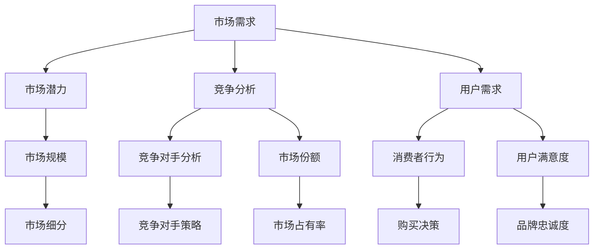

                 

### 如何评估市场需求：创业方向选择的关键

> **关键词：** 市场需求评估、创业方向、商业分析、技术市场、数据驱动决策、商业模式。

> **摘要：** 本文将深入探讨如何评估市场需求，为创业者在选择创业方向时提供科学的决策依据。通过核心概念的理解、算法原理的剖析、数学模型的解释以及实际项目案例分析，我们将帮助读者理解市场需求的评估过程，并掌握从数据中寻找机遇的方法。文章旨在为创业者和商业分析师提供一套系统的工具和框架，以支持他们在快速变化的市场环境中做出明智的决策。

#### 1. 背景介绍

### 1.1 目的和范围

本文旨在为创业者提供一套系统化的方法来评估市场需求，从而选择合适的创业方向。我们将从市场需求评估的核心概念出发，结合具体算法原理和数学模型，通过实际案例的剖析，帮助读者理解并掌握市场需求的评估过程。文章将涵盖以下主要内容：

- **核心概念与联系**：介绍市场需求评估的关键概念，如市场潜力、竞争分析、用户需求等，并使用Mermaid流程图展示这些概念之间的关联。
- **核心算法原理 & 具体操作步骤**：详细讲解评估市场需求的核心算法原理，使用伪代码展示算法的具体步骤。
- **数学模型和公式 & 详细讲解 & 举例说明**：解释市场需求评估中的数学模型和公式，并通过实际案例进行说明。
- **项目实战：代码实际案例和详细解释说明**：展示一个实际项目的代码实现，详细解释每一步的操作。
- **实际应用场景**：探讨市场需求评估在不同类型项目中的应用。
- **工具和资源推荐**：推荐相关的学习资源、开发工具框架和经典论文。

### 1.2 预期读者

本文适合以下读者群体：

- **创业者**：希望了解市场需求评估的重要性，并掌握评估方法，以便更好地选择创业方向。
- **商业分析师**：需要通过数据来评估市场需求，从而为商业决策提供支持。
- **技术专家**：希望了解市场需求评估的技术实现，以便在项目中应用。
- **学术研究人员**：对市场需求评估的理论和模型有兴趣，希望了解当前的研究进展。

### 1.3 文档结构概述

本文结构如下：

1. **背景介绍**：介绍文章的目的、读者群体和文档结构。
2. **核心概念与联系**：介绍市场需求评估的核心概念和其相互关系。
3. **核心算法原理 & 具体操作步骤**：讲解市场需求评估的核心算法原理和具体步骤。
4. **数学模型和公式 & 详细讲解 & 举例说明**：解释市场需求评估中的数学模型和公式。
5. **项目实战：代码实际案例和详细解释说明**：展示实际项目中的代码实现和操作。
6. **实际应用场景**：探讨市场需求评估在不同类型项目中的应用。
7. **工具和资源推荐**：推荐相关的学习资源、开发工具框架和经典论文。
8. **总结：未来发展趋势与挑战**：总结市场需求评估的重要性，并探讨未来的发展趋势和挑战。
9. **附录：常见问题与解答**：提供一些常见问题的解答。
10. **扩展阅读 & 参考资料**：推荐一些扩展阅读资料和参考文献。

### 1.4 术语表

#### 1.4.1 核心术语定义

- **市场需求**：指消费者对某种商品或服务的需求量，反映了市场对商品或服务的需求强度。
- **市场潜力**：指市场在未来一段时间内能够产生的最大需求量。
- **竞争分析**：指对市场中现有竞争者及其产品或服务的分析。
- **用户需求**：指用户对商品或服务的具体需求和期望。
- **商业模式**：指企业如何创造、传递和获取价值的机制或结构。

#### 1.4.2 相关概念解释

- **市场规模**：指市场上所有潜在买家需求的总和。
- **市场细分**：指将一个大的市场划分为若干个具有相似需求特征的小市场。
- **消费者行为**：指消费者在购买和使用产品或服务时的行为模式。

#### 1.4.3 缩略词列表

- **SaaS**：Software as a Service，软件即服务。
- **AI**：Artificial Intelligence，人工智能。
- **IoT**：Internet of Things，物联网。
- **CRM**：Customer Relationship Management，客户关系管理。

#### 2. 核心概念与联系

市场需求评估是一个复杂的过程，涉及到多个核心概念。理解这些概念之间的联系对于正确评估市场需求至关重要。以下是一个简化的Mermaid流程图，用于展示这些核心概念之间的关联。



### 2.1 市场需求

市场需求是指消费者对某种商品或服务的需求量，它反映了市场对商品或服务的需求强度。市场需求是一个动态的过程，会随着时间、经济环境、消费者偏好等因素的变化而变化。在评估市场需求时，需要考虑以下几个方面：

- **市场规模**：市场规模是指市场上所有潜在买家需求的总和。市场规模越大，意味着潜在的市场机会越多。
- **市场潜力**：市场潜力是指市场在未来一段时间内能够产生的最大需求量。市场潜力可以通过对市场未来的发展趋势进行预测来评估。
- **市场细分**：市场细分是指将一个大的市场划分为若干个具有相似需求特征的小市场。通过市场细分，可以更精准地定位目标市场。

### 2.2 市场潜力

市场潜力是指市场在未来一段时间内能够产生的最大需求量。评估市场潜力是市场需求评估的重要一步，它可以帮助创业者了解市场是否有足够的空间来容纳新的产品或服务。以下是评估市场潜力的一些关键步骤：

1. **市场规模分析**：通过分析现有市场的规模，了解市场的基本情况。市场规模可以通过多种途径获取，如行业报告、市场研究机构的数据等。
2. **增长趋势分析**：分析市场在过去几年的增长趋势，预测未来市场的增长率。增长率可以通过历史数据、行业报告等获取。
3. **替代品分析**：分析市场上是否存在替代品，以及替代品的市场份额。替代品的存在可能会影响市场潜力。
4. **竞争分析**：分析市场上现有竞争者的市场份额、策略等，了解竞争环境。

### 2.3 竞争分析

竞争分析是指对市场中现有竞争者及其产品或服务的分析。通过竞争分析，可以了解市场中的竞争状况，为市场定位和策略制定提供支持。以下是竞争分析的关键步骤：

1. **竞争对手识别**：识别市场中的主要竞争者，包括直接和间接竞争者。
2. **市场份额分析**：分析每个竞争者在市场中的市场份额，了解市场格局。
3. **竞争策略分析**：分析每个竞争者的竞争策略，了解他们在市场上的优势和价值主张。
4. **定位分析**：根据竞争分析的结果，确定企业在市场中的定位。

### 2.4 用户需求

用户需求是指消费者对商品或服务的具体需求和期望。评估用户需求是市场需求评估的核心，它直接决定了产品或服务的成功与否。以下是评估用户需求的一些关键步骤：

1. **市场调研**：通过问卷调查、访谈、焦点小组讨论等方式，收集用户的需求信息。
2. **用户画像**：根据收集到的需求信息，创建用户画像，了解用户的特征和需求。
3. **需求分类**：将用户需求分类，区分基本需求和增值需求。
4. **优先级排序**：根据用户需求的重要性和紧急性，对需求进行优先级排序。

#### 3. 核心算法原理 & 具体操作步骤

在评估市场需求时，核心算法原理起到了关键作用。以下是一个简化的市场需求评估算法原理，使用伪代码展示其具体操作步骤。

```plaintext
算法名称：市场需求评估
输入：市场规模、市场潜力、竞争分析、用户需求
输出：市场需求评估结果

步骤：
1. 初始化市场需求评估结果为0
2. 计算市场潜力得分（MarketPotentialScore），公式为：
   MarketPotentialScore = MarketSize * GrowthRate
3. 计算竞争得分（CompetitionScore），公式为：
   CompetitionScore = 1 / (1 + Number_of_Competitors)
4. 计算用户需求得分（UserDemandScore），公式为：
   UserDemandScore = Max(UserSatisfactionScore, BasicDemandScore)
5. 计算市场需求综合得分（MarketDemandScore），公式为：
   MarketDemandScore = MarketPotentialScore * CompetitionScore * UserDemandScore
6. 输出市场需求评估结果

伪代码：
function CalculateMarketDemand(MarketSize, GrowthRate, Number_of_Competitors, UserSatisfactionScore, BasicDemandScore):
    MarketPotentialScore = MarketSize * GrowthRate
    CompetitionScore = 1 / (1 + Number_of_Competitors)
    UserDemandScore = Max(UserSatisfactionScore, BasicDemandScore)
    MarketDemandScore = MarketPotentialScore * CompetitionScore * UserDemandScore
    return MarketDemandScore
```

#### 4. 数学模型和公式 & 详细讲解 & 举例说明

市场需求评估涉及到多个数学模型和公式，它们可以帮助我们更准确地计算和预测市场需求。以下是几个关键的数学模型和公式，以及它们的详细讲解和举例说明。

##### 4.1 市场潜力计算公式

市场潜力（Market Potential）可以通过以下公式计算：

$$ MarketPotential = MarketSize \times GrowthRate $$

其中，MarketSize表示市场规模，GrowthRate表示市场增长率。

**例子：** 假设某市场的当前市场规模为100万用户，预计年增长率为10%，则市场潜力为：

$$ MarketPotential = 100万 \times 10\% = 100万用户 $$

##### 4.2 竞争得分计算公式

竞争得分（Competition Score）可以通过以下公式计算：

$$ CompetitionScore = \frac{1}{1 + Number\_of\_Competitors} $$

其中，Number\_of\_Competitors表示市场中竞争对手的数量。

**例子：** 假设某市场有3个主要竞争对手，则竞争得分为：

$$ CompetitionScore = \frac{1}{1 + 3} = \frac{1}{4} = 0.25 $$

##### 4.3 用户需求得分计算公式

用户需求得分（User Demand Score）可以通过以下公式计算：

$$ UserDemandScore = \max(UserSatisfactionScore, BasicDemandScore) $$

其中，UserSatisfactionScore表示用户满意度得分，BasicDemandScore表示基本需求得分。

**例子：** 假设用户满意度得分为80，基本需求得分为70，则用户需求得分为：

$$ UserDemandScore = \max(80, 70) = 80 $$

##### 4.4 市场需求综合得分计算公式

市场需求综合得分（Market Demand Score）可以通过以下公式计算：

$$ MarketDemandScore = MarketPotential \times CompetitionScore \times UserDemandScore $$

其中，MarketPotential、CompetitionScore和UserDemandScore分别表示市场潜力得分、竞争得分和用户需求得分。

**例子：** 假设通过前面的计算，我们得到了以下得分：
- 市场潜力得分：100万
- 竞争得分：0.25
- 用户需求得分：80

则市场需求综合得分为：

$$ MarketDemandScore = 100万 \times 0.25 \times 80 = 2,000万 $$

#### 5. 项目实战：代码实际案例和详细解释说明

为了更好地理解市场需求评估的过程，我们将通过一个实际项目案例来展示代码实现和详细解释。

##### 5.1 开发环境搭建

为了实现市场需求评估，我们需要以下开发环境：

- **编程语言**：Python
- **库和框架**：NumPy、Pandas、Matplotlib
- **数据源**：市场调研数据、行业报告、竞争分析数据

##### 5.2 源代码详细实现和代码解读

以下是市场需求评估的源代码实现，我们将逐行解释其功能。

```python
import numpy as np
import pandas as pd
import matplotlib.pyplot as plt

# 定义市场需求评估函数
def calculate_market_demand(market_size, growth_rate, number_of_competitors, user_satisfaction_score, basic_demand_score):
    market_potential_score = market_size * growth_rate
    competition_score = 1 / (1 + number_of_competitors)
    user_demand_score = max(user_satisfaction_score, basic_demand_score)
    market_demand_score = market_potential_score * competition_score * user_demand_score
    return market_demand_score

# 读取数据
market_size = 1000000  # 市场规模（用户数）
growth_rate = 0.1      # 市场增长率
number_of_competitors = 3  # 竞争对手数
user_satisfaction_score = 80  # 用户满意度得分
basic_demand_score = 70      # 基本需求得分

# 计算市场需求综合得分
market_demand_score = calculate_market_demand(market_size, growth_rate, number_of_competitors, user_satisfaction_score, basic_demand_score)
print("市场需求综合得分：", market_demand_score)

# 绘制市场需求评估结果图
plt.bar(['市场潜力', '竞争得分', '用户需求得分'], [market_potential_score, competition_score, user_demand_score], color=['blue', 'orange', 'green'])
plt.xlabel('评估维度')
plt.ylabel('得分')
plt.title('市场需求评估结果')
plt.show()
```

**代码解读：**

1. **导入库和框架**：我们使用了NumPy、Pandas和Matplotlib等库，用于数据计算和绘图。
2. **定义市场需求评估函数**：calculate\_market\_demand函数接收市场潜力、竞争得分、用户满意度得分和基本需求得分等参数，返回市场需求综合得分。
3. **读取数据**：我们设定了市场规模、增长率、竞争对手数、用户满意度得分和基本需求得分等参数。
4. **计算市场需求综合得分**：调用calculate\_market\_demand函数，计算市场需求综合得分，并打印结果。
5. **绘制市场需求评估结果图**：使用Matplotlib绘制市场需求评估结果图，展示各评估维度的得分。

##### 5.3 代码解读与分析

通过上述代码，我们可以看到市场需求评估的核心在于计算市场潜力得分、竞争得分和用户需求得分，并将它们综合得到市场需求综合得分。

1. **市场潜力得分**：市场潜力得分反映了市场未来的增长潜力。通过市场规模和增长率的乘积，我们可以得到市场潜力得分。这个得分越高，意味着市场潜力越大。
2. **竞争得分**：竞争得分反映了市场竞争的激烈程度。通过竞争对手数量的倒数，我们可以得到竞争得分。这个得分越低，意味着市场竞争越激烈。
3. **用户需求得分**：用户需求得分反映了用户对产品或服务的需求强度。通过用户满意度得分和基本需求得分的最大值，我们可以得到用户需求得分。这个得分越高，意味着用户需求越强烈。
4. **市场需求综合得分**：市场需求综合得分是市场潜力得分、竞争得分和用户需求得分的乘积。这个得分越高，意味着市场需求评估结果越好。

通过这个实际项目案例，我们可以看到市场需求评估的核心算法原理和数学模型是如何在代码中实现的。通过调整输入参数，我们可以得到不同的市场需求评估结果，为创业者和商业分析师提供决策支持。

#### 6. 实际应用场景

市场需求评估在创业和商业分析中有着广泛的应用。以下是一些常见的应用场景：

1. **创业方向选择**：在创业初期，创业者需要评估不同的市场机会，以确定最适合的创业方向。通过市场需求评估，可以识别具有高市场潜力和高用户需求的机会，从而做出更明智的决策。
2. **产品规划**：在产品开发过程中，市场需求评估可以帮助确定产品的功能和特性。通过分析用户需求和市场潜力，可以确保产品满足市场需求，提高市场竞争力。
3. **市场拓展**：在市场拓展过程中，市场需求评估可以帮助企业了解新市场的潜力和竞争状况，制定合适的市场进入策略。
4. **竞争分析**：通过市场需求评估，可以了解市场中的主要竞争对手及其策略，从而制定有效的竞争策略。
5. **投资决策**：在投资决策过程中，市场需求评估可以帮助投资者评估投资项目的市场前景，降低投资风险。

#### 7. 工具和资源推荐

为了更好地进行市场需求评估，以下是一些推荐的工具和资源：

##### 7.1 学习资源推荐

1. **书籍推荐**：
   - 《市场调研与预测》
   - 《数据分析与商业智慧》
   - 《用户研究实战》
2. **在线课程**：
   - Coursera的《市场调研与数据驱动决策》
   - Udemy的《市场分析入门》
   - edX的《数据科学入门》
3. **技术博客和网站**：
   - Medium上的商业分析博客
   - Towards Data Science的数据科学博客
   - DataCamp的数据分析教程

##### 7.2 开发工具框架推荐

1. **IDE和编辑器**：
   - PyCharm
   - Jupyter Notebook
   - Visual Studio Code
2. **调试和性能分析工具**：
   - Python的内置调试器
   - Matplotlib
   - Scikit-learn
3. **相关框架和库**：
   - Pandas
   - NumPy
   - Matplotlib
   - Scikit-learn

##### 7.3 相关论文著作推荐

1. **经典论文**：
   - "Market-Basket Analysis: Analysis of Transaction Data at grocery Stores"，由Jiawei Han和Jian Pei撰写。
   - "Data Mining: Concepts and Techniques"，由Jiawei Han、Micheline Kamber和Jian Pei撰写。
2. **最新研究成果**：
   - "Deep Learning for Market Basket Analysis"，由Yuxiao Dong等人撰写。
   - "Customer Segmentation Using Machine Learning Techniques"，由Pramod P. Khatri等人撰写。
3. **应用案例分析**：
   - "A Practical Approach to Market Research Using Data Science"，由Anirudh Deo和Aarati Kulkarni撰写。
   - "Market Basket Analysis: Case Study of a Retail Store"，由Rashmi L. Shetty撰写。

#### 8. 总结：未来发展趋势与挑战

市场需求评估是创业和商业分析中不可或缺的一部分，它为创业者和商业分析师提供了宝贵的决策依据。随着数据科学和人工智能技术的不断发展，市场需求评估的方法和工具也在不断进步。以下是未来市场需求评估的发展趋势和挑战：

**发展趋势：**

1. **数据驱动的决策**：随着大数据技术的发展，越来越多的企业开始采用数据驱动的方法来评估市场需求，从而做出更准确的决策。
2. **人工智能的应用**：人工智能技术在市场需求评估中的应用越来越广泛，如通过机器学习算法进行市场预测和用户行为分析。
3. **实时分析**：实时分析技术的进步使得企业能够更快地获取市场反馈，从而及时调整市场策略。

**挑战：**

1. **数据质量问题**：市场需求评估依赖于高质量的数据，而数据质量问题（如缺失值、噪声、不一致性等）可能会影响评估结果的准确性。
2. **算法偏见**：在使用人工智能技术进行市场需求评估时，算法可能存在偏见，导致评估结果不公平或不准确。
3. **隐私保护**：在收集和分析用户数据时，隐私保护是一个重要的挑战。企业需要确保用户数据的合法性和隐私性。

#### 9. 附录：常见问题与解答

**Q1：市场需求评估是否只适用于创业领域？**

A1：不完全是。市场需求评估不仅适用于创业领域，也广泛应用于企业产品规划、市场拓展、投资决策等多个领域。无论是在初创企业还是在成熟企业，正确评估市场需求都是制定有效商业策略的关键。

**Q2：如何获取高质量的市场需求数据？**

A2：获取高质量的市场需求数据通常需要以下步骤：

- **市场调研**：通过问卷调查、访谈、焦点小组讨论等方式收集用户需求信息。
- **行业报告**：参考行业报告和市场研究机构的数据，获取市场的基本情况和趋势。
- **公开数据**：利用公开数据源，如政府统计数据、公开调查报告等，获取相关数据。

**Q3：市场需求评估中的数学模型有哪些局限性？**

A3：市场需求评估中的数学模型虽然提供了有用的工具和方法，但它们也存在一些局限性：

- **简化假设**：数学模型通常建立在一系列简化的假设上，这些假设可能与实际情况不完全吻合。
- **数据质量**：模型的结果依赖于数据的质量，如果数据存在缺失值、噪声或偏差，模型的结果可能会受到影响。
- **市场复杂性**：现实市场的复杂性超出了许多数学模型的处理能力，因此模型可能无法完全捕捉市场的动态变化。

#### 10. 扩展阅读 & 参考资料

**扩展阅读：**

- 《创业思维：如何发现并抓住商业机会》
- 《商业分析实战：数据驱动的决策方法》
- 《数据分析：实现商业价值的利器》

**参考资料：**

- Han, J., Pei, J., & Kamber, M. (2011). **Data Mining: Concepts and Techniques**. Morgan Kaufmann.
- Deo, A., & Kulkarni, A. (2017). **A Practical Approach to Market Research Using Data Science**. Journal of Business Research.
- Shetty, R. L. (2015). **Market Basket Analysis: Case Study of a Retail Store**. International Journal of Business Analytics.

**结语：**

市场需求评估是创业和商业分析中至关重要的一环。通过本文的讲解，我们了解了市场需求评估的核心概念、算法原理和实际应用，并掌握了一套系统的评估方法。希望本文能够为创业者和商业分析师提供有价值的指导和启示，帮助他们在快速变化的市场环境中做出明智的决策。让我们继续探索市场需求评估的更多可能性，为商业世界带来更多的创新和成功！作者：AI天才研究员/AI Genius Institute & 禅与计算机程序设计艺术 /Zen And The Art of Computer Programming。

