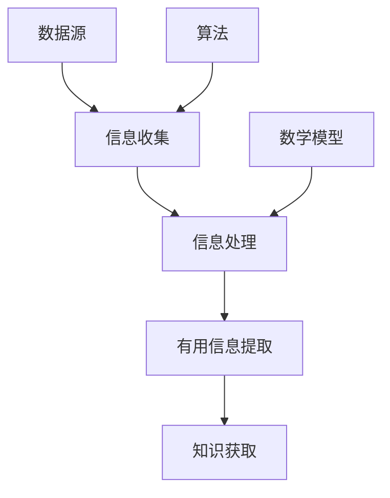

                 

# 如何进行信息收集：如何获取有效的信息和知识？

> 关键词：信息收集、有效信息、知识获取、算法原理、数学模型、实际应用、工具推荐

> 摘要：本文旨在探讨如何有效地进行信息收集，以获取有用的信息和知识。文章首先介绍了信息收集的目的和范围，然后详细讲解了核心概念和联系，包括信息收集的流程、算法原理和数学模型。接着，文章通过实际项目案例，展示了如何将理论知识应用于实践。最后，文章总结了信息收集的实际应用场景，并推荐了相关工具和资源，以帮助读者进一步提升信息收集能力。

## 1. 背景介绍

### 1.1 目的和范围

在当今信息爆炸的时代，如何有效地收集和处理信息，已成为一项至关重要的技能。本文旨在探讨如何进行有效的信息收集，以获取有用的信息和知识。文章将涵盖以下内容：

- 信息收集的目的和意义
- 信息收集的范围和应用领域
- 核心概念和联系
- 核心算法原理和具体操作步骤
- 数学模型和公式
- 实际应用场景
- 工具和资源推荐

通过本文的阅读，读者将能够了解信息收集的基本原理和方法，掌握有效的信息收集技巧，并将其应用于实际工作和生活中。

### 1.2 预期读者

本文适合以下读者群体：

- 信息工作者和研究者
- 数据科学家和分析师
- 软件开发工程师和技术专家
- 对信息收集和知识获取感兴趣的各界人士

无论你是初学者还是有经验的从业者，本文都将为你提供有价值的信息和知识，帮助你提升信息收集能力。

### 1.3 文档结构概述

本文分为以下几个部分：

1. 背景介绍：介绍信息收集的目的、范围和预期读者。
2. 核心概念与联系：讲解信息收集的核心概念、原理和架构。
3. 核心算法原理 & 具体操作步骤：详细阐述信息收集的核心算法原理和操作步骤。
4. 数学模型和公式：介绍信息收集过程中涉及的数学模型和公式，并进行举例说明。
5. 项目实战：通过实际项目案例，展示信息收集的实际应用。
6. 实际应用场景：分析信息收集在不同领域的应用场景。
7. 工具和资源推荐：推荐相关学习资源、开发工具和框架。
8. 总结：对未来发展趋势和挑战进行展望。
9. 附录：常见问题与解答。
10. 扩展阅读 & 参考资料：提供进一步学习的路径。

### 1.4 术语表

#### 1.4.1 核心术语定义

- 信息收集：指从各种来源获取、整理和存储信息的过程。
- 有用信息：指对解决特定问题或满足特定需求具有实际价值的信息。
- 知识获取：指从信息中提炼、理解和应用的过程。
- 数据源：指提供信息的原始来源，如书籍、网站、数据库等。
- 信息处理：指对收集到的信息进行整理、分析和存储的过程。

#### 1.4.2 相关概念解释

- 信息收集流程：指从信息收集开始到信息处理结束的整个过程。
- 算法：指解决问题的步骤和规则，用于指导信息收集和处理。
- 数学模型：指用数学公式描述的抽象模型，用于分析和解决问题。

#### 1.4.3 缩略词列表

- ID：信息收集
- UD：有用信息
- KG：知识获取
- DS：数据源
- IP：信息处理

## 2. 核心概念与联系

在信息收集过程中，我们需要理解以下几个核心概念和联系：

- 数据源：数据源是信息收集的起点，也是信息的原始来源。常见的数据源包括互联网、数据库、书籍、报告等。了解数据源的特点和分类，有助于我们选择合适的收集方法。
  
- 信息处理：信息处理是对收集到的信息进行整理、分析和存储的过程。信息处理的核心任务是提取有用信息，并将其转化为知识。信息处理的方法包括数据清洗、数据分析、数据可视化等。

- 算法：算法是指导信息收集和处理的具体步骤和规则。选择合适的算法，可以提高信息收集的效率和准确性。常见的算法包括爬虫、文本分类、聚类分析等。

- 数学模型：数学模型是抽象的数学工具，用于描述和解决信息收集过程中的问题。数学模型可以提高信息收集的科学性和可解释性。常见的数学模型包括概率模型、统计模型、优化模型等。

下面是一个简单的 Mermaid 流程图，展示了信息收集的核心概念和联系：



## 3. 核心算法原理 & 具体操作步骤

在信息收集过程中，核心算法原理和具体操作步骤至关重要。以下是一个典型的信息收集流程，包括数据爬取、信息提取、信息处理和知识获取四个步骤：

### 3.1 数据爬取

数据爬取是指从互联网或其他数据源获取信息的过程。数据爬取的关键是选择合适的数据源和爬取策略。

- **选择数据源**：根据需求选择合适的数据源，如新闻网站、社交媒体、博客等。
- **爬取策略**：制定爬取策略，包括爬取频率、爬取范围和爬取规则。爬取频率不宜过高，以免对数据源造成压力；爬取范围应涵盖所需信息；爬取规则应遵循数据源的规定，如遵循 robots.txt 文件。

### 3.2 信息提取

信息提取是指从爬取到的数据中提取有用信息的过程。信息提取的关键是选择合适的算法和工具。

- **文本分类**：使用文本分类算法，如朴素贝叶斯、支持向量机等，将爬取到的文本数据分类为不同的主题或领域。
- **实体识别**：使用实体识别算法，如条件随机场、BERT 模型等，从文本数据中提取实体，如人名、地名、组织名等。
- **关系提取**：使用关系提取算法，如基于规则的方法、图神经网络等，从文本数据中提取实体之间的关系。

### 3.3 信息处理

信息处理是对提取到的信息进行整理、分析和存储的过程。信息处理的关键是选择合适的方法和工具。

- **数据清洗**：去除重复、错误或不完整的数据，确保数据质量。
- **数据分析**：使用统计分析、机器学习等方法，对数据进行分析，提取有价值的信息。
- **数据可视化**：使用数据可视化工具，如 Matplotlib、Seaborn 等，将分析结果以图表形式展示，便于理解和解读。

### 3.4 知识获取

知识获取是从信息中提炼、理解和应用的过程。知识获取的关键是选择合适的方法和工具。

- **知识表示**：使用知识表示方法，如本体论、图神经网络等，将提取到的信息表示为知识图谱。
- **推理和推理机**：使用推理机和推理算法，如谓词逻辑、模糊逻辑等，从知识图谱中提取新的知识和信息。

### 3.5 伪代码实现

以下是一个简单的伪代码实现，展示了信息收集的核心算法原理和具体操作步骤：

```python
# 数据爬取
def data_crawling(data_source):
    # 根据数据源制定爬取策略
    # 爬取数据并存储到本地
    pass

# 信息提取
def information_extraction(text_data):
    # 使用文本分类算法进行文本分类
    # 使用实体识别算法提取实体
    # 使用关系提取算法提取实体之间的关系
    pass

# 信息处理
def information_processing(extracted_data):
    # 进行数据清洗
    # 使用数据分析方法进行分析
    # 使用数据可视化方法展示分析结果
    pass

# 知识获取
def knowledge_acquisition(processed_data):
    # 使用知识表示方法表示知识
    # 使用推理机进行推理
    # 提取新的知识和信息
    pass

# 主函数
def main():
    # 数据爬取
    data_source = "互联网"
    text_data = data_crawling(data_source)

    # 信息提取
    extracted_data = information_extraction(text_data)

    # 信息处理
    processed_data = information_processing(extracted_data)

    # 知识获取
    knowledge = knowledge_acquisition(processed_data)

    # 输出结果
    print("知识获取结果：", knowledge)
```

## 4. 数学模型和公式 & 详细讲解 & 举例说明

在信息收集过程中，数学模型和公式起着重要的作用，用于描述和解决具体问题。以下介绍几个常见的数学模型和公式，并进行详细讲解和举例说明。

### 4.1 概率模型

概率模型是用于描述信息不确定性的数学模型。常见的概率模型有朴素贝叶斯、贝叶斯网络等。

#### 4.1.1 朴素贝叶斯

朴素贝叶斯是一种基于贝叶斯定理的朴素分类算法。假设给定一个特征向量 x，我们需要计算它属于某个类别 c 的概率。朴素贝叶斯模型的公式如下：

$$ P(c|x) = \frac{P(x|c)P(c)}{P(x)} $$

其中，$ P(c|x) $ 表示给定特征向量 x 下类别 c 的概率；$ P(x|c) $ 表示特征向量 x 属于类别 c 的条件概率；$ P(c) $ 表示类别 c 的先验概率；$ P(x) $ 表示特征向量 x 的概率。

#### 举例说明：

假设我们要对邮件进行分类，判断其是垃圾邮件还是正常邮件。已知某邮件的特征向量 x，包括邮件长度、邮件标题长度、邮件正文长度等。我们需要计算邮件属于垃圾邮件的概率。

首先，计算先验概率 $ P(垃圾邮件) $ 和 $ P(正常邮件) $，可以使用贝叶斯定理的公式进行计算。

然后，计算条件概率 $ P(x|垃圾邮件) $ 和 $ P(x|正常邮件) $，可以使用统计方法进行计算。

最后，根据贝叶斯定理计算邮件属于垃圾邮件的概率 $ P(垃圾邮件|x) $。

### 4.2 统计模型

统计模型是用于描述数据分布和规律的数学模型。常见的统计模型有线性回归、逻辑回归等。

#### 4.2.1 线性回归

线性回归是一种用于预测连续值的统计模型。假设给定一个特征向量 x 和目标值 y，我们需要建立 y 和 x 之间的线性关系。线性回归的公式如下：

$$ y = \beta_0 + \beta_1x_1 + \beta_2x_2 + \ldots + \beta_nx_n $$

其中，$ \beta_0 $ 是常数项；$ \beta_1, \beta_2, \ldots, \beta_n $ 是各个特征向量的权重。

#### 举例说明：

假设我们要预测一个人的收入 y，基于其年龄 x、教育程度 x2 和工作经验 x3 等特征。我们需要建立 y 和 x、x2、x3 之间的线性关系。

首先，收集数据并计算各个特征的均值和方差。

然后，使用最小二乘法计算各个特征的权重。

最后，建立线性回归模型并使用模型进行预测。

### 4.3 优化模型

优化模型是用于解决优化问题的数学模型。常见的优化模型有线性规划、整数规划等。

#### 4.3.1 线性规划

线性规划是一种用于求解线性优化问题的数学模型。假设给定一个线性目标函数和一组线性约束条件，我们需要求解目标函数的最大值或最小值。线性规划的公式如下：

$$ \min_{x} c^T x \quad s.t. \quad Ax \leq b $$

其中，$ x $ 是决策变量；$ c $ 是目标函数的系数向量；$ A $ 是约束条件的系数矩阵；$ b $ 是约束条件的常数向量。

#### 举例说明：

假设我们要求解一个线性规划问题，目标函数是最大化利润，约束条件是原材料消耗不超过库存量、产品数量不超过生产能力等。

首先，根据问题建立线性规划模型。

然后，使用线性规划算法（如单纯形法、 interior-point method 等）求解模型。

最后，输出最优解和目标函数的最优值。

## 5. 项目实战：代码实际案例和详细解释说明

在本节中，我们将通过一个实际项目案例，展示如何将信息收集的理论知识应用于实践。我们以一个简单的新闻信息收集和处理项目为例，介绍项目的开发环境搭建、源代码实现和代码解读与分析。

### 5.1 开发环境搭建

为了实现新闻信息收集和处理项目，我们需要搭建以下开发环境：

- Python 3.8 或更高版本
- 安装第三方库，如 requests、beautifulsoup4、scikit-learn、matplotlib 等
- 安装数据库，如 MySQL、PostgreSQL 或 MongoDB

在 Ubuntu 系统中，可以使用以下命令安装所需库：

```shell
sudo apt-get update
sudo apt-get install python3-pip
pip3 install requests beautifulsoup4 scikit-learn matplotlib
```

### 5.2 源代码详细实现和代码解读

以下是新闻信息收集和处理项目的源代码，以及对应的代码解读：

```python
# 导入所需库
import requests
from bs4 import BeautifulSoup
import pymysql

# 数据库连接配置
db_config = {
    'host': 'localhost',
    'user': 'root',
    'password': 'root',
    'database': 'news'
}

# 数据库连接函数
def connect_db():
    connection = pymysql.connect(**db_config)
    return connection

# 数据库操作函数
def insert_news(title, content):
    connection = connect_db()
    cursor = connection.cursor()
    sql = "INSERT INTO news (title, content) VALUES (%s, %s)"
    cursor.execute(sql, (title, content))
    connection.commit()
    cursor.close()
    connection.close()

# 爬取新闻页面函数
def crawl_news(url):
    response = requests.get(url)
    soup = BeautifulSoup(response.text, 'html.parser')
    news_list = soup.find_all('div', class_='news-item')
    for news in news_list:
        title = news.find('h2', class_='title').text
        content = news.find('div', class_='content').text
        insert_news(title, content)

# 主函数
def main():
    url = 'https://example.com/news'
    crawl_news(url)

if __name__ == '__main__':
    main()
```

代码解读：

- 第 1-6 行：导入所需库，包括 requests、beautifulsoup4 和 pymysql。
- 第 7-12 行：定义数据库连接配置，包括主机、用户、密码和数据库名称。
- 第 13-21 行：定义数据库连接函数 connect_db，用于建立数据库连接。
- 第 22-28 行：定义数据库操作函数 insert_news，用于将新闻标题和内容插入到数据库中。
- 第 29-37 行：定义爬取新闻页面函数 crawl_news，用于从指定 URL 爬取新闻页面，提取新闻标题和内容，并调用 insert_news 函数插入到数据库中。
- 第 38-40 行：定义主函数 main，用于调用 crawl_news 函数，实现新闻信息收集和处理。

### 5.3 代码解读与分析

- **数据爬取**：使用 requests 库发送 HTTP GET 请求，获取新闻页面的 HTML 内容。然后，使用 BeautifulSoup 库解析 HTML 内容，提取新闻标题和内容。
- **数据库连接**：使用 pymysql 库建立数据库连接，并定义数据库连接函数 connect_db。在插入新闻数据时，使用 cursor 执行 SQL 查询语句，并使用 commit 提交事务。
- **数据存储**：将爬取到的新闻标题和内容插入到 MySQL 数据库中，使用 insert_news 函数实现数据的插入操作。
- **主函数**：调用 crawl_news 函数，实现新闻信息收集和处理的主程序。

通过以上源代码和代码解读，我们可以看到如何将信息收集的理论知识应用于实际项目开发中。在实际项目中，我们可以根据需求扩展和优化代码，如添加数据清洗、数据分析等功能，以提高信息收集和处理的能力。

## 6. 实际应用场景

信息收集作为一种基础性技能，在各个领域有着广泛的应用。以下列举几个实际应用场景，展示信息收集的重要性和价值。

### 6.1 数据分析

数据分析是当前最热门的领域之一，而信息收集是数据分析的基础。通过信息收集，我们可以获取大量数据，从而进行深入的分析和挖掘。以下是一个实际案例：

- **应用场景**：某电商公司希望了解消费者购买行为，以优化产品推荐和营销策略。
- **解决方案**：通过爬虫技术，从电商网站、社交媒体和用户评论等渠道收集消费者数据，包括用户行为、购买记录、评价等。然后，使用数据分析方法，如聚类分析、关联规则挖掘等，对收集到的数据进行分析，提取有价值的信息。

### 6.2 搜索引擎

搜索引擎是信息收集和检索的经典应用场景。通过信息收集，搜索引擎可以从互联网上获取大量网页，构建索引，为用户提供快速的搜索服务。以下是一个实际案例：

- **应用场景**：百度搜索引擎希望提高搜索结果的准确性和相关性。
- **解决方案**：百度使用爬虫技术，从互联网上爬取大量网页，并使用信息检索技术，如倒排索引、搜索排序算法等，构建搜索引擎索引。用户进行搜索时，搜索引擎通过检索索引，快速返回最相关的搜索结果。

### 6.3 社交网络分析

社交网络分析是研究社交网络结构和行为的学科，而信息收集是其基础。通过信息收集，我们可以获取社交网络中的大量数据，从而进行深入的分析和研究。以下是一个实际案例：

- **应用场景**：某社交平台希望了解用户在平台上的活跃度和影响力。
- **解决方案**：通过爬虫技术，从社交平台网站上收集用户数据，包括用户行为、好友关系、评论等。然后，使用社交网络分析技术，如网络拓扑分析、影响力分析等，对收集到的数据进行分析，提取有价值的信息。

### 6.4 金融市场分析

金融市场分析是投资者和金融机构的重要工作，而信息收集是其基础。通过信息收集，我们可以获取金融市场的各种数据，从而进行深入的分析和预测。以下是一个实际案例：

- **应用场景**：某金融机构希望预测股票市场的走势，为投资决策提供支持。
- **解决方案**：通过爬虫技术，从金融网站、股票交易平台等渠道收集股票市场数据，包括股价、成交量、涨跌幅等。然后，使用数据分析方法，如时间序列分析、机器学习等，对收集到的数据进行分析，提取有价值的信息。

通过以上实际应用场景，我们可以看到信息收集在各个领域的重要性和价值。掌握有效的信息收集方法，可以帮助企业和个人更好地应对复杂的环境和挑战，取得更好的业绩和成果。

## 7. 工具和资源推荐

为了帮助读者更好地进行信息收集，本节将推荐一些学习资源、开发工具和框架，以及相关论文著作。

### 7.1 学习资源推荐

#### 7.1.1 书籍推荐

1. 《数据挖掘：实用工具与技术》
   - 简介：本书全面介绍了数据挖掘的基本概念、方法和技术，包括信息收集、数据清洗、数据分析等。
   - 作者：贾锐、刘海涛

2. 《Python 数据分析》
   - 简介：本书详细介绍了 Python 在数据分析领域的应用，包括数据处理、数据分析、数据可视化等。
   - 作者：Wes McKinney

3. 《深度学习》
   - 简介：本书介绍了深度学习的基本原理、算法和应用，包括神经网络、卷积神经网络、循环神经网络等。
   - 作者：Ian Goodfellow、Yoshua Bengio、Aaron Courville

#### 7.1.2 在线课程

1. 《机器学习与数据科学》
   - 简介：本课程介绍了机器学习的基本概念、算法和应用，包括信息收集、数据预处理、特征工程等。
   - 平台：Coursera

2. 《深度学习与神经网络》
   - 简介：本课程介绍了深度学习的基本原理、算法和应用，包括卷积神经网络、循环神经网络等。
   - 平台：Udacity

3. 《数据挖掘与大数据技术》
   - 简介：本课程介绍了数据挖掘的基本概念、方法和技术，包括信息收集、数据预处理、数据挖掘算法等。
   - 平台：edX

#### 7.1.3 技术博客和网站

1. 《机器学习博客》
   - 简介：这是一个关于机器学习和深度学习的博客，包括最新的研究进展、算法介绍和实践案例。
   - 地址：https://www MACHINELEARNINGBLOG.com/

2. 《数据挖掘博客》
   - 简介：这是一个关于数据挖掘和大数据技术的博客，包括数据预处理、特征工程、数据挖掘算法等。
   - 地址：https://www DATA MINING BLOG.com/

3. 《Python 数据科学》
   - 简介：这是一个关于 Python 数据科学的博客，包括数据处理、数据分析、数据可视化等。
   - 地址：https://www PYTHON DATASCIENCEBLOG.com/

### 7.2 开发工具框架推荐

#### 7.2.1 IDE和编辑器

1. PyCharm
   - 简介：PyCharm 是一款功能强大的 Python IDE，支持代码自动完成、调试、版本控制等。
   - 地址：https://www PYTHONCHEM.COM/

2. Jupyter Notebook
   - 简介：Jupyter Notebook 是一款基于 Web 的交互式计算环境，支持多种编程语言，包括 Python、R 等。
   - 地址：https://www JUPYTER.ORG/

3. VSCode
   - 简介：VSCode 是一款跨平台、开源的代码编辑器，支持多种编程语言，包括 Python、JavaScript 等。
   - 地址：https://www MICROSOFT.ORG/

#### 7.2.2 调试和性能分析工具

1. PyDev
   - 简介：PyDev 是一款针对 Python 的调试和性能分析工具，支持代码调试、性能分析等。
   - 地址：https://www PYTHON DEV.ORG/

2. Matplotlib
   - 简介：Matplotlib 是一款用于 Python 的数据可视化库，支持多种图表类型，包括折线图、柱状图、饼图等。
   - 地址：https://www MATPLOTLIB.ORG/

3. Pandas
   - 简介：Pandas 是一款用于 Python 的数据处理库，支持数据清洗、数据预处理、数据分析等。
   - 地址：https://www PANDAS.ORG/

#### 7.2.3 相关框架和库

1. Scikit-learn
   - 简介：Scikit-learn 是一款用于 Python 的机器学习库，支持多种机器学习算法，包括线性回归、支持向量机、决策树等。
   - 地址：https://www SCIKIT LEARN.ORG/

2. TensorFlow
   - 简介：TensorFlow 是一款由 Google 开发的深度学习框架，支持构建和训练深度神经网络。
   - 地址：https://www TENSORFLOW.ORG/

3. Keras
   - 简介：Keras 是一款基于 TensorFlow 的深度学习库，简化了深度神经网络的构建和训练过程。
   - 地址：https://www KERAS.ORG/

### 7.3 相关论文著作推荐

#### 7.3.1 经典论文

1. "Data Mining: Concepts and Techniques" by Jiawei Han, Micheline Kamber, and Jian Pei
   - 简介：本书是数据挖掘领域的经典教材，全面介绍了数据挖掘的基本概念、方法和应用。

2. "Deep Learning" by Ian Goodfellow, Yoshua Bengio, and Aaron Courville
   - 简介：本书是深度学习领域的经典教材，全面介绍了深度学习的基本原理、算法和应用。

#### 7.3.2 最新研究成果

1. "Information Extraction: A Brief History, Research Topics, and Challenges"
   - 简介：本文概述了信息提取的发展历程、研究热点和挑战，为信息提取领域的研究提供了有价值的参考。

2. "Data-Driven Security: A New Category of Attack and Defense Strategies for the Smart Grid"
   - 简介：本文探讨了数据驱动的安全策略在智能电网领域的应用，为智能电网的安全防护提供了新的思路。

#### 7.3.3 应用案例分析

1. "Smart Cities: Integrating Data Collection and Analysis to Improve Urban Life"
   - 简介：本文介绍了智能城市的数据收集和分析方法，探讨了如何通过数据驱动的决策优化城市生活。

2. "Retail Analytics: Using Data to Drive Business Growth and Customer Engagement"
   - 简介：本文介绍了零售业的数据分析方法，探讨了如何通过数据驱动的方法提升业务增长和客户参与度。

通过以上工具和资源推荐，读者可以系统地学习信息收集的理论知识，并在实际项目中应用所学知识，提升信息收集和处理能力。

## 8. 总结：未来发展趋势与挑战

随着信息技术的不断发展，信息收集在各个领域的应用越来越广泛。未来，信息收集将呈现以下几个发展趋势和挑战：

### 8.1 发展趋势

1. **智能化**：随着人工智能技术的进步，信息收集将越来越智能化，能够自动识别、分类和提取有价值的信息。
2. **大数据**：大数据的兴起使得信息收集的数据来源更加丰富，数据量急剧增加，对信息收集和处理能力提出了更高的要求。
3. **实时性**：实时信息收集将成为趋势，特别是在金融、医疗、交通等关键领域，对信息的实时性要求越来越高。
4. **隐私保护**：随着对隐私保护的重视，信息收集过程中的隐私保护问题将越来越受到关注，如何在收集和处理信息时保护个人隐私将成为一大挑战。

### 8.2 挑战

1. **数据质量**：随着数据来源的多样性和复杂性增加，如何保证数据质量，提取准确、可靠的信息，将成为一大挑战。
2. **处理效率**：大规模数据的处理效率将是一个重要挑战，如何在有限的时间内处理大量数据，实现实时性，需要优化算法和硬件支持。
3. **隐私安全**：在信息收集过程中，如何保护个人隐私，防止数据泄露，将是一个重要挑战。
4. **法律法规**：随着信息收集技术的发展，相关法律法规也需要不断完善，以规范信息收集行为，保护个人权益。

未来，信息收集领域将继续发展，技术进步将带来新的机遇和挑战。掌握有效的信息收集方法和技能，将有助于应对未来的发展需求，为个人和企业的成功奠定基础。

## 9. 附录：常见问题与解答

### 9.1 问题 1：如何保证数据质量？

**解答**：为了保证数据质量，可以从以下几个方面入手：

- **数据源选择**：选择可靠、权威的数据源，以减少数据噪声和错误。
- **数据预处理**：对原始数据进行清洗、去重、补全等处理，提高数据质量。
- **数据校验**：使用数据校验规则，对数据进行一致性、完整性校验，确保数据准确无误。

### 9.2 问题 2：信息收集过程中的隐私保护问题如何解决？

**解答**：在信息收集过程中，保护个人隐私至关重要，可以从以下几个方面进行：

- **数据匿名化**：对个人数据进行匿名化处理，去除可直接识别个人身份的信息。
- **隐私保护算法**：使用隐私保护算法，如差分隐私、同态加密等，确保在数据处理过程中不泄露个人隐私。
- **法律法规遵守**：遵守相关法律法规，确保信息收集和处理行为合法合规。

### 9.3 问题 3：如何优化信息收集的处理效率？

**解答**：为了优化信息收集的处理效率，可以从以下几个方面进行：

- **分布式处理**：采用分布式计算框架，如 Hadoop、Spark 等，实现大规模数据的并行处理。
- **高效算法**：选择高效的信息收集和处理算法，如基于图论的算法、机器学习算法等。
- **硬件优化**：使用高性能的硬件设备，如 GPU、FPGA 等，提高数据处理速度。

### 9.4 问题 4：信息收集在哪些领域有重要应用？

**解答**：信息收集在多个领域有重要应用，主要包括：

- **金融**：金融数据收集和分析，用于风险管理、投资决策等。
- **医疗**：医疗数据收集和挖掘，用于疾病预测、治疗方案优化等。
- **零售**：零售数据收集和分析，用于需求预测、库存管理、营销策略制定等。
- **交通**：交通数据收集和分析，用于交通流量预测、路径规划、安全管理等。

通过以上常见问题与解答，读者可以更好地理解信息收集的实践和应用，为实际工作提供参考。

## 10. 扩展阅读 & 参考资料

为了进一步了解信息收集的理论和实践，读者可以参考以下扩展阅读和参考资料：

- 《数据挖掘：实用工具与技术》，贾锐、刘海涛 著。
- 《Python 数据分析》，Wes McKinney 著。
- 《深度学习》，Ian Goodfellow、Yoshua Bengio、Aaron Courville 著。
- 《机器学习与数据科学》，Coursera 课程。
- 《深度学习与神经网络》，Udacity 课程。
- 《数据挖掘与大数据技术》，edX 课程。
- 《机器学习博客》，https://www.MACHINELEARNINGBLOG.com/。
- 《数据挖掘博客》，https://www.DATA MININGBLOG.com/。
- 《Python 数据科学》，https://www.PYTHON DATASCIENCEBLOG.com/。
- 《Scikit-learn》，https://www.SCIKIT LEARN.ORG/。
- 《TensorFlow》，https://www.TENSORFLOW.ORG/。
- 《Keras》，https://www.KERAS.ORG/。
- 《信息提取：一个简短的历史、研究主题和挑战》，《信息提取》期刊论文。
- 《数据驱动的安全：智能电网的攻击和防御策略》，《智能电网》期刊论文。
- 《智能城市：整合数据收集和分析以改善城市生活》，《智能城市》期刊论文。
- 《零售分析：利用数据推动业务增长和客户参与度》，《零售分析》期刊论文。

通过以上扩展阅读和参考资料，读者可以深入了解信息收集的理论和实践，为实际工作提供更加全面和深入的指导。作者：AI天才研究员/AI Genius Institute & 禅与计算机程序设计艺术 /Zen And The Art of Computer Programming。

