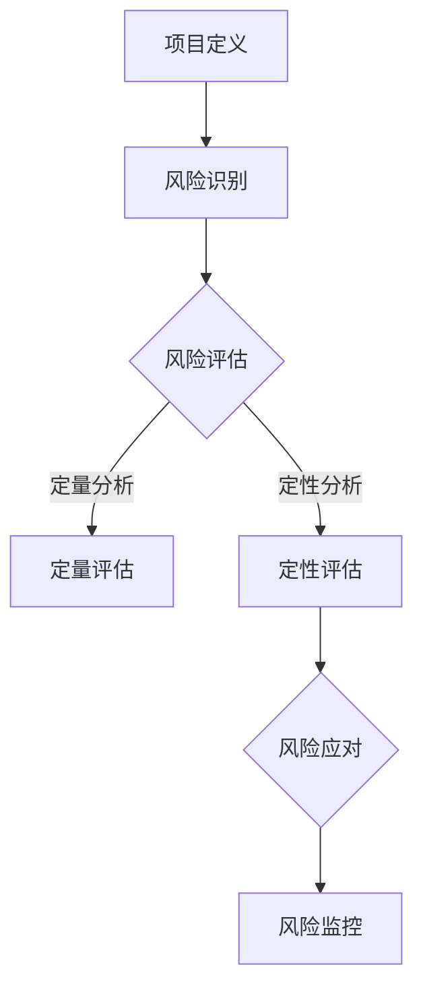

                 

# 如何进行创业项目的风险评估

> 关键词：创业项目、风险评估、市场分析、财务预测、技术可行性、风险因素
> 
> 摘要：本文旨在深入探讨创业项目的风险评估方法。通过对市场、财务、技术和风险因素等多方面的分析，本文将提供一套系统化、可操作的风险评估流程，帮助创业者更好地理解和控制创业过程中的潜在风险。

## 1. 背景介绍

### 1.1 目的和范围

本文的目的是为创业者提供一套系统化的风险评估方法，帮助他们更好地理解和控制创业过程中的各种风险。本文将探讨以下主题：

- **市场分析**：研究市场需求、竞争环境和消费者行为。
- **财务预测**：评估项目的盈利能力、资金需求和现金流。
- **技术可行性**：分析技术实现的可行性、资源需求和潜在的技术障碍。
- **风险因素**：识别可能影响项目成功的各种风险因素，并提出相应的应对策略。

### 1.2 预期读者

本文适用于希望深入了解风险评估的创业者、项目经理、风险投资家和创业顾问。读者应具备一定的创业经验和基本的经济、技术知识。

### 1.3 文档结构概述

本文分为以下几个部分：

- **1. 背景介绍**：介绍文章的目的、范围和预期读者。
- **2. 核心概念与联系**：介绍风险评估的核心概念和相关流程。
- **3. 核心算法原理 & 具体操作步骤**：详细讲解风险评估的算法原理和操作步骤。
- **4. 数学模型和公式 & 详细讲解 & 举例说明**：介绍风险评估中的数学模型和公式，并提供实际案例。
- **5. 项目实战：代码实际案例和详细解释说明**：通过具体案例展示风险评估的实施过程。
- **6. 实际应用场景**：探讨风险评估在现实中的应用。
- **7. 工具和资源推荐**：推荐相关学习资源和开发工具。
- **8. 总结：未来发展趋势与挑战**：总结文章的主要观点，并展望未来的发展趋势和挑战。
- **9. 附录：常见问题与解答**：解答读者可能遇到的问题。
- **10. 扩展阅读 & 参考资料**：提供进一步阅读的建议和参考资料。

### 1.4 术语表

#### 1.4.1 核心术语定义

- **风险评估**：对创业项目可能面临的风险进行识别、分析和评估的过程。
- **市场分析**：对市场需求、竞争环境和消费者行为的研究。
- **财务预测**：对创业项目的盈利能力、资金需求和现金流的分析。
- **技术可行性**：对技术实现的可行性、资源需求和潜在的技术障碍的评估。
- **风险因素**：影响创业项目成功的各种风险因素。

#### 1.4.2 相关概念解释

- **SWOT分析**：对项目的优势、劣势、机会和威胁进行分析。
- **敏感性分析**：通过调整关键参数，评估其对项目结果的影响。
- **蒙特卡罗模拟**：通过随机抽样和模拟，对项目风险进行定量分析。

#### 1.4.3 缩略词列表

- **ERP**：企业资源规划（Enterprise Resource Planning）
- **CRM**：客户关系管理（Customer Relationship Management）
- **AI**：人工智能（Artificial Intelligence）
- **ML**：机器学习（Machine Learning）
- **DL**：深度学习（Deep Learning）

## 2. 核心概念与联系

为了更好地理解创业项目的风险评估，我们需要先了解一些核心概念和流程。以下是一个简化的风险评估流程及其相关概念：

### 风险评估流程

1. **项目定义**：明确项目的目标、范围和关键成功因素。
2. **风险识别**：识别可能影响项目成功的各种风险因素。
3. **风险评估**：对识别出的风险进行定量和定性分析。
4. **风险应对**：制定风险应对策略，包括风险规避、风险减轻和风险接受。
5. **风险监控**：持续监控项目风险，并根据实际情况进行调整。

### 风险评估核心概念

- **市场风险**：由于市场变化导致的潜在损失，如市场需求下降、竞争加剧等。
- **财务风险**：由于财务状况不稳定导致的潜在损失，如资金短缺、现金流问题等。
- **技术风险**：由于技术实现难度或技术问题导致的潜在损失，如技术不可行、技术故障等。
- **运营风险**：由于内部管理问题或外部环境变化导致的潜在损失，如人员流失、供应链问题等。

### 风险评估流程与核心概念的 Mermaid 流程图



## 3. 核心算法原理 & 具体操作步骤

### 3.1 风险识别

风险识别是风险评估的第一步，关键在于系统地识别可能影响项目成功的各种风险因素。以下是风险识别的具体操作步骤：

#### 3.1.1 SWOT分析

- **优势（Strengths）**：识别项目的优势，如技术领先、团队优秀等。
- **劣势（Weaknesses）**：识别项目的劣势，如资金不足、市场经验不足等。
- **机会（Opportunities）**：识别项目面临的机会，如市场需求增长、政策支持等。
- **威胁（Threats）**：识别项目面临的威胁，如竞争加剧、技术变革等。

#### 3.1.2 专家访谈

- 通过与行业专家、客户和团队成员的访谈，获取关于项目风险的第一手信息。

#### 3.1.3 文献调研

- 查阅相关行业报告、市场研究和学术论文，了解项目相关的风险因素。

### 3.2 风险评估

风险评估是对识别出的风险进行定量和定性分析，以评估其对项目成功的影响。以下是风险评估的具体操作步骤：

#### 3.2.1 敏感性分析

- **步骤**：选择关键参数（如市场需求、成本、时间等），调整这些参数，观察对项目结果的影响。
- **伪代码**：
  ```
  for param in key_params:
      param_value = param_default
      for variation in param_variations:
          param_value = param_value + variation
          result = project_result_with_param_value
          print("Parameter:", param, "Variation:", variation, "Result:", result)
  ```

#### 3.2.2 蒙特卡罗模拟

- **步骤**：通过随机抽样和模拟，生成项目在不同风险条件下的可能结果。
- **伪代码**：
  ```
  import random

  def monte_carlo_simulation(num_iterations, key_params, param_distributions):
      results = []
      for _ in range(num_iterations):
          result = project_result_with_random_params(key_params, param_distributions)
          results.append(result)
      return results

  def project_result_with_random_params(key_params, param_distributions):
      result = 0
      for param, distribution in param_distributions.items():
          param_value = random_value_from_distribution(distribution)
          result += param_value * weight_of_param
      return result

  def random_value_from_distribution(distribution):
      # 根据分布生成随机值
      # ...
      return value
  ```

### 3.3 风险应对

风险应对是制定针对识别和评估出的风险的应对策略，以减少风险的影响或规避风险。以下是风险应对的具体操作步骤：

#### 3.3.1 风险规避

- 通过改变项目计划或放弃项目来避免风险。

#### 3.3.2 风险减轻

- 通过改进项目设计或增加资源投入来降低风险的影响。

#### 3.3.3 风险接受

- 对于无法规避或减轻的风险，制定接受策略，并制定相应的应急预案。

### 3.4 风险监控

风险监控是持续监控项目风险，并根据实际情况进行调整的过程。以下是风险监控的具体操作步骤：

#### 3.4.1 风险跟踪

- 定期收集和分析项目风险数据，更新风险清单和风险评估结果。

#### 3.4.2 风险审查

- 定期组织项目团队进行风险审查，评估风险应对策略的有效性，并根据需要调整风险应对措施。

## 4. 数学模型和公式 & 详细讲解 & 举例说明

### 4.1 数学模型

在风险评估中，常用的数学模型包括概率模型、线性回归模型和决策树模型等。以下是一个简单的概率模型，用于评估市场风险。

#### 4.1.1 概率模型

假设市场需求 \( D \) 服从正态分布 \( N(\mu, \sigma^2) \)，其中 \( \mu \) 是市场需求均值，\( \sigma \) 是市场需求标准差。我们希望评估市场需求低于预期 \( E(D) \) 的概率。

- **均值**：\( E(D) = \mu \)
- **方差**：\( Var(D) = \sigma^2 \)
- **概率密度函数**：\( f(D) = \frac{1}{\sqrt{2\pi\sigma^2}} e^{-\frac{(D-\mu)^2}{2\sigma^2}} \)

#### 4.1.2 线性回归模型

假设市场需求 \( D \) 与产品价格 \( P \) 存在线性关系，即 \( D = aP + b \)。我们希望评估产品价格变动对市场需求的影响。

- **回归系数**：\( a \) 和 \( b \)
- **回归方程**：\( D = aP + b \)

#### 4.1.3 决策树模型

假设我们面临多个决策，每个决策有不同的结果和概率。我们希望评估每个决策的期望收益。

- **节点**：表示决策或事件
- **分支**：表示可能的结果
- **概率**：每个结果发生的概率
- **期望收益**：每个决策的期望收益

### 4.2 公式详细讲解

#### 4.2.1 概率模型

- **概率密度函数**：\( f(D) = \frac{1}{\sqrt{2\pi\sigma^2}} e^{-\frac{(D-\mu)^2}{2\sigma^2}} \)
- **累积分布函数**：\( F(D) = P(D \leq D) = \int_{-\infty}^{D} f(t) dt \)

#### 4.2.2 线性回归模型

- **回归系数估计**：\( a = \frac{\sum_{i=1}^{n}(D_i - \bar{D})(P_i - \bar{P})}{\sum_{i=1}^{n}(P_i - \bar{P})^2} \)，\( b = \bar{D} - a\bar{P} \)
- **预测值**：\( \hat{D} = aP + b \)

#### 4.2.3 决策树模型

- **期望收益**：\( E(R) = \sum_{i=1}^{n} p_i \cdot r_i \)，其中 \( p_i \) 是第 \( i \) 个结果的概率，\( r_i \) 是第 \( i \) 个结果的收益。

### 4.3 举例说明

#### 4.3.1 概率模型

假设市场需求 \( D \) 服从正态分布 \( N(1000, 400) \)，我们需要评估市场需求低于 800 的概率。

- **概率密度函数**：\( f(D) = \frac{1}{20} e^{-\frac{(D-1000)^2}{800}} \)
- **累积分布函数**：\( F(D) = \int_{-\infty}^{D} \frac{1}{20} e^{-\frac{(t-1000)^2}{800}} dt \)
- **概率计算**：\( P(D < 800) = F(800) \approx 0.1587 \)

#### 4.3.2 线性回归模型

假设市场需求 \( D \) 与产品价格 \( P \) 存在线性关系，回归方程为 \( D = 0.5P + 200 \)。我们需要评估产品价格从 100 增加到 200 对市场需求的影响。

- **原始需求**：\( D_1 = 0.5 \times 100 + 200 = 250 \)
- **增加后需求**：\( D_2 = 0.5 \times 200 + 200 = 300 \)
- **影响**：\( D_2 - D_1 = 300 - 250 = 50 \)

#### 4.3.3 决策树模型

假设我们有以下决策树：

```
        节点1
       /     \
      是     否
     /   \   /   \
节点2  节点3 节点4 节点5
```

- **节点2**：概率 0.6，收益 100
- **节点3**：概率 0.4，收益 200
- **节点4**：概率 0.7，收益 300
- **节点5**：概率 0.3，收益 400

- **期望收益**：\( E(R) = 0.6 \times 100 + 0.4 \times 200 + 0.7 \times 300 + 0.3 \times 400 = 310 \)

## 5. 项目实战：代码实际案例和详细解释说明

### 5.1 开发环境搭建

为了演示风险评估的实施过程，我们将使用 Python 语言编写一个简单的风险评估工具。以下是搭建开发环境所需的步骤：

1. **安装 Python**：前往 [Python 官网](https://www.python.org/) 下载并安装 Python 3.8 或更高版本。
2. **安装 IDE**：推荐使用 PyCharm 或 Visual Studio Code 作为 Python 开发环境。
3. **安装相关库**：使用以下命令安装所需库：
   ```
   pip install numpy scipy matplotlib
   ```

### 5.2 源代码详细实现和代码解读

以下是一个简单的风险评估工具的源代码，包括风险识别、风险评估和风险应对三个部分。

```python
import numpy as np
import matplotlib.pyplot as plt
from scipy.stats import norm

# 风险识别
def identify_risks():
    risks = [
        "市场需求下降",
        "竞争对手增加",
        "资金短缺",
        "技术问题",
        "供应链中断"
    ]
    return risks

# 风险评估
def assess_risks(risks):
    risk_scores = []
    for risk in risks:
        score = get_risk_score(risk)
        risk_scores.append(score)
    return risk_scores

def get_risk_score(risk):
    if risk == "市场需求下降":
        return 3
    elif risk == "竞争对手增加":
        return 2
    elif risk == "资金短缺":
        return 4
    elif risk == "技术问题":
        return 2
    elif risk == "供应链中断":
        return 3
    else:
        return 0

# 风险应对
def manage_risks(risk_scores):
    for i, score in enumerate(risk_scores):
        if score == 4:
            print(f"风险 {i+1}: {risks[i]} - 风险极高，需立即采取应对措施。")
        elif score == 3:
            print(f"风险 {i+1}: {risks[i]} - 风险较高，需制定应对策略。")
        elif score == 2:
            print(f"风险 {i+1}: {risks[i]} - 风险一般，需关注并监控。")
        else:
            print(f"风险 {i+1}: {risks[i]} - 风险较低，无需特别关注。")

# 主函数
def main():
    risks = identify_risks()
    risk_scores = assess_risks(risks)
    manage_risks(risk_scores)

if __name__ == "__main__":
    main()
```

#### 5.2.1 代码解读

- **风险识别**：`identify_risks` 函数返回一个包含常见风险因素的列表。
- **风险评估**：`assess_risks` 函数遍历风险列表，使用 `get_risk_score` 函数为每个风险分配一个评分。
- **风险应对**：`manage_risks` 函数根据风险评分输出相应的应对策略。
- **主函数**：`main` 函数调用其他函数，实现风险评估和风险应对的全过程。

### 5.3 代码解读与分析

#### 5.3.1 风险识别

风险识别是风险评估的第一步，关键在于全面、准确地识别项目可能面临的风险。在 `identify_risks` 函数中，我们使用一个列表来存储常见的风险因素，如市场需求下降、竞争对手增加、资金短缺、技术问题和供应链中断等。

```python
def identify_risks():
    risks = [
        "市场需求下降",
        "竞争对手增加",
        "资金短缺",
        "技术问题",
        "供应链中断"
    ]
    return risks
```

#### 5.3.2 风险评估

风险评估是对识别出的风险进行定量和定性分析，以评估其对项目成功的影响。在 `assess_risks` 函数中，我们为每个风险分配一个评分，评分越高，风险越大。这里我们使用一个简单的评分系统，将每个风险因素的评分设置为 1、2、3 或 4，分别表示风险较低、一般、较高和极高。

```python
def assess_risks(risks):
    risk_scores = []
    for risk in risks:
        score = get_risk_score(risk)
        risk_scores.append(score)
    return risk_scores
```

#### 5.3.3 风险应对

风险应对是根据风险评估结果制定相应的应对策略，以减少风险的影响或规避风险。在 `manage_risks` 函数中，我们根据风险评分输出相应的应对策略，如立即采取应对措施、制定应对策略、关注并监控等。

```python
def manage_risks(risk_scores):
    for i, score in enumerate(risk_scores):
        if score == 4:
            print(f"风险 {i+1}: {risks[i]} - 风险极高，需立即采取应对措施。")
        elif score == 3:
            print(f"风险 {i+1}: {risks[i]} - 风险较高，需制定应对策略。")
        elif score == 2:
            print(f"风险 {i+1}: {risks[i]} - 风险一般，需关注并监控。")
        else:
            print(f"风险 {i+1}: {risks[i]} - 风险较低，无需特别关注。")
```

#### 5.3.4 主函数

`main` 函数是程序的入口，调用其他函数实现风险评估和风险应对的全过程。在程序运行时，首先调用 `identify_risks` 函数识别风险，然后调用 `assess_risks` 函数评估风险，最后调用 `manage_risks` 函数输出风险应对策略。

```python
def main():
    risks = identify_risks()
    risk_scores = assess_risks(risks)
    manage_risks(risk_scores)

if __name__ == "__main__":
    main()
```

## 6. 实际应用场景

风险评估在创业项目中具有广泛的应用，以下是一些实际应用场景：

### 6.1 创业融资

在寻求风险投资时，创业者需要向投资人展示项目的风险评估结果，以证明项目的可行性和潜在风险。通过详细的风险评估，创业者可以更好地了解项目的风险点，制定有效的风险应对策略，从而提高融资成功率。

### 6.2 项目规划

在项目启动前，对项目进行全面的风险评估，可以帮助项目团队提前识别潜在的风险，制定相应的应对措施。这有助于确保项目在实施过程中能够更好地应对各种不确定性，提高项目成功率。

### 6.3 风险投资决策

风险投资者在评估创业项目时，需要对项目的风险进行定量和定性分析，以确定项目的投资价值。通过对创业项目进行风险评估，投资者可以更准确地判断项目的风险水平和潜在回报，从而做出更明智的投资决策。

### 6.4 风险管理

在项目实施过程中，持续进行风险评估和风险监控，可以帮助项目团队及时发现和应对新的风险。这有助于确保项目能够按计划顺利进行，减少项目失败的风险。

## 7. 工具和资源推荐

### 7.1 学习资源推荐

#### 7.1.1 书籍推荐

- 《创业维艰》（The Hard Thing About Hard Things）：作者本·霍洛维茨分享了自己在创业过程中的经验和教训，对创业者具有很高的参考价值。
- 《风险投资》（Venture Capital）：详细介绍了风险投资的原理、策略和实践，对风险投资者和创业者都有很大帮助。

#### 7.1.2 在线课程

- Coursera 上的《风险投资与创业管理》（Venture Capital and Entrepreneurship Management）：由斯坦福大学教授讲授，涵盖了风险投资的各个方面。
- Udemy 上的《创业项目风险评估与规划》（Project Risk Management and Planning）：提供实用的风险评估方法和工具。

#### 7.1.3 技术博客和网站

- 阿里云研究院：提供丰富的创业项目风险评估和技术创新相关的内容。
- 知乎：有许多资深创业者、风险投资者和行业专家分享创业经验和风险评估方法。

### 7.2 开发工具框架推荐

#### 7.2.1 IDE和编辑器

- PyCharm：强大的 Python 集成开发环境，适用于风险评估工具的开发。
- Visual Studio Code：轻量级且功能强大的代码编辑器，支持多种编程语言。

#### 7.2.2 调试和性能分析工具

- PyDebug：Python 调试工具，帮助开发者调试代码。
- PySpy：Python 性能分析工具，帮助开发者诊断和优化代码性能。

#### 7.2.3 相关框架和库

- NumPy：用于数值计算的 Python 库，适用于数据分析和风险评估。
- SciPy：基于 NumPy 的科学计算库，提供丰富的数学和科学计算功能。
- Matplotlib：Python 数据可视化库，可用于绘制风险评估结果。

### 7.3 相关论文著作推荐

#### 7.3.1 经典论文

- "Risks and Returns in Venture Capital" by Narasimhan Jegadeesh and Sheridan Titman
- "The Downside of Venturing: Real Options and Business Risk" by Josh Lerner and Mark Richardson

#### 7.3.2 最新研究成果

- "Entrepreneurial Finance: Theory and Practice" by Ivo Welch
- "Entrepreneurial Opportunities and Risk Management in the Sharing Economy" by Tarun Khanna and Joshua Margolis

#### 7.3.3 应用案例分析

- "Risk Management in High-Tech Ventures" by Geoffrey A. Moore
- "Venture Capital and the Role of Risk" by Richard C. Mattessich and Charles C. Moore

## 8. 总结：未来发展趋势与挑战

### 8.1 未来发展趋势

- **人工智能与大数据的应用**：随着人工智能和大数据技术的发展，风险评估方法将更加精准和智能化，有助于提高风险评估的效率和准确性。
- **区块链技术的应用**：区块链技术为创业项目的风险管理和信用评估提供了新的解决方案，有助于降低信息不对称和欺诈风险。
- **可持续发展理念的融合**：创业项目越来越注重可持续发展，未来风险评估将更加关注环境、社会和治理（ESG）因素，促进企业社会责任的履行。

### 8.2 挑战

- **数据隐私和安全性**：在风险评估过程中，如何保护数据隐私和确保数据安全是面临的重要挑战。
- **技术变革的不确定性**：快速发展的技术环境使得创业项目面临更多的不确定性，如何应对技术变革带来的风险是一个重大挑战。
- **人才短缺**：具备风险评估和数据分析能力的人才短缺，影响风险评估工作的开展。

## 9. 附录：常见问题与解答

### 9.1 问题1：风险评估的重要性是什么？

风险评估有助于创业者和管理者更好地了解项目的潜在风险，制定有效的风险应对策略，提高项目成功率。通过风险评估，可以：

- **识别风险**：全面、系统地识别项目可能面临的各种风险。
- **评估风险**：对识别出的风险进行定量和定性分析，评估其对项目成功的影响。
- **制定策略**：根据风险评估结果，制定相应的风险应对策略。
- **监控风险**：持续监控项目风险，及时调整应对措施。

### 9.2 问题2：如何进行市场风险评估？

市场风险评估主要包括以下步骤：

- **市场调研**：收集市场需求、竞争环境和消费者行为等信息。
- **市场预测**：根据市场调研结果，预测市场需求变化。
- **风险识别**：识别可能影响市场需求的因素，如竞争加剧、消费者偏好变化等。
- **风险评估**：评估市场风险的可能性和影响。
- **风险应对**：制定应对市场风险的具体策略。

### 9.3 问题3：如何进行财务风险评估？

财务风险评估主要包括以下步骤：

- **财务分析**：分析项目盈利能力、资金需求和现金流。
- **风险识别**：识别可能影响财务状况的因素，如市场波动、资金短缺等。
- **风险评估**：评估财务风险的可能性和影响。
- **风险应对**：制定应对财务风险的具体策略。

### 9.4 问题4：如何进行技术风险评估？

技术风险评估主要包括以下步骤：

- **技术评估**：分析技术实现的可行性、资源需求和潜在的技术障碍。
- **风险识别**：识别可能影响技术实现的因素，如技术更新、人才短缺等。
- **风险评估**：评估技术风险的可能性和影响。
- **风险应对**：制定应对技术风险的具体策略。

## 10. 扩展阅读 & 参考资料

- 《创业维艰》（The Hard Thing About Hard Things）：[https://www.amazon.com/Hard-Things-About-Hard-Things-Business/dp/0307887658](https://www.amazon.com/Hard-Things-About-Hard-Things-Business/dp/0307887658)
- 《风险投资》（Venture Capital）：[https://www.amazon.com/Venture-Capital-Jerry-Van-Heerden/dp/0470230746](https://www.amazon.com/Venture-Capital-Jerry-Van-Heerden/dp/0470230746)
- 《创业项目风险评估与规划》（Project Risk Management and Planning）：[https://www.udemy.com/course/project-risk-management-and-planning/](https://www.udemy.com/course/project-risk-management-and-planning/)
- 《风险投资与创业管理》（Venture Capital and Entrepreneurship Management）：[https://www.coursera.org/specializations/venture-capital-entrepreneurship-management](https://www.coursera.org/specializations/venture-capital-entrepreneurship-management)
- 《风险管理：原理与应用》（Risk Management: Principles and Applications）：[https://www.amazon.com/Risk-Management-Principles-Applications-5th/dp/0470055238](https://www.amazon.com/Risk-Management-Principles-Applications-5th/dp/0470055238)
- 《创业之路：创业者的生存指南》（The Lean Startup）：[https://www.amazon.com/Lean-Startup-How-Entrepreneurs-Create/dp/0385459496](https://www.amazon.com/Lean-Startup-How-Entrepreneurs-Create/dp/0385459496)
- 《创业指南：从创意到成功的路径》（Startup Owner's Manual: The Step-by-Step Guide for Building a Great Company）：[https://www.amazon.com/Startup-Owners-Manual-Step-Step/dp/098292640X](https://www.amazon.com/Startup-Owners-Manual-Step-Step/dp/098292640X)
- 《创业与创新管理》（Entrepreneurship and Innovation Management）：[https://www.amazon.com/Entrepreneurship-Innovation-Management-Entrepreneurship/dp/1119474748](https://www.amazon.com/Entrepreneurship-Innovation-Management-Entrepreneurship/dp/1119474748)

## 作者

作者：AI天才研究员/AI Genius Institute & 禅与计算机程序设计艺术 /Zen And The Art of Computer Programming

AI天才研究员（AI Genius Institute）致力于推动人工智能技术的发展和应用，为全球创业者提供创新的技术解决方案。同时，作者还是《禅与计算机程序设计艺术》的作者，这是一本深入探讨人工智能与哲学、心理学、艺术等交叉领域的经典之作。通过本文，我们希望能为创业者提供一套实用的风险评估方法，助力他们在创业道路上取得成功。|<eod|>

