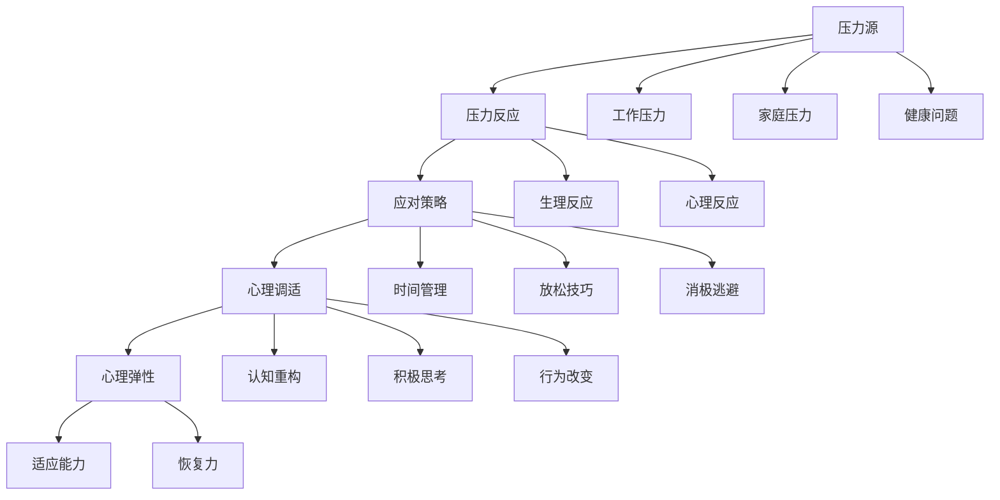

                 

# 如何进行压力管理：如何应对工作和生活中的压力？

> **关键词：压力管理、工作压力、生活压力、心理调适、时间管理、技术工具**
> 
> **摘要：本文旨在探讨如何有效地进行压力管理，特别是在工作和生活中的压力应对策略。通过逻辑清晰的章节布局，结合实际案例和数学模型，本文将提供一系列实用的方法和工具，帮助读者更好地应对压力，提升生活质量。**

## 1. 背景介绍

### 1.1 目的和范围

本文的目标是帮助读者了解压力管理的核心概念，并提供实用的策略和工具，以应对工作和生活中的压力。我们将探讨压力的定义、原因以及它对个人身心健康的影响。同时，本文还将介绍一系列技术工具和资源，以帮助读者在实际生活中实施这些策略。

### 1.2 预期读者

本文适用于对压力管理感兴趣的各类读者，包括职场人士、学生、企业家、技术人员等。无论您是初学者还是有一定经验的专业人士，本文都希望能够为您带来新的见解和实用的方法。

### 1.3 文档结构概述

本文将分为以下几个部分：

1. 背景介绍：介绍文章的目的、预期读者以及文档结构。
2. 核心概念与联系：介绍压力管理的关键概念，并使用Mermaid流程图进行说明。
3. 核心算法原理 & 具体操作步骤：详细讲解压力管理的具体操作步骤。
4. 数学模型和公式 & 详细讲解 & 举例说明：通过数学模型和公式，深入解释压力管理的原理。
5. 项目实战：提供实际代码案例和详细解释说明。
6. 实际应用场景：讨论压力管理的实际应用场景。
7. 工具和资源推荐：推荐相关的学习资源和开发工具。
8. 总结：展望压力管理领域的未来发展趋势与挑战。
9. 附录：常见问题与解答。
10. 扩展阅读 & 参考资料：提供额外的阅读材料和参考资料。

### 1.4 术语表

#### 1.4.1 核心术语定义

- 压力（Stress）：指身体或心理上的一种紧张状态，通常由外部压力源或内部情绪引发。
- 应对策略（Coping Strategies）：指个体为应对压力而采取的心理或行为策略。
- 心理调适（Cognitive-Behavioral Adaptation）：指通过改变思维模式和认知来应对压力的过程。
- 时间管理（Time Management）：指合理安排时间，提高工作效率和生活质量的过程。

#### 1.4.2 相关概念解释

- 压力源（Stressors）：指引发压力的内外部因素，如工作压力、人际关系、健康问题等。
- 心理弹性（Psychological Resilience）：指个体在面对压力和挑战时的适应能力和恢复力。
- 压力反应（Stress Response）：指个体在面对压力时产生的生理和心理反应。

#### 1.4.3 缩略词列表

- IDE：集成开发环境（Integrated Development Environment）
- CPU：中央处理器（Central Processing Unit）
- ML：机器学习（Machine Learning）
- AI：人工智能（Artificial Intelligence）

## 2. 核心概念与联系

在这一部分，我们将介绍压力管理的核心概念，并使用Mermaid流程图（Mermaid flowchart）来展示这些概念之间的联系。

### 2.1 压力管理的核心概念

1. **压力源（Stressors）**：压力源是引发压力的内外部因素，如工作压力、家庭压力、健康问题等。它们可以是具体的，如工作任务，也可以是抽象的，如人际关系。

2. **压力反应（Stress Response）**：压力反应是身体和心理对压力源的反应。这种反应可以包括生理上的反应，如心跳加速、血压升高，以及心理上的反应，如焦虑、沮丧。

3. **应对策略（Coping Strategies）**：应对策略是个体为应对压力而采取的心理或行为策略。这些策略可以分为积极的和消极的，如时间管理、放松技巧、消极逃避。

4. **心理调适（Cognitive-Behavioral Adaptation）**：心理调适是通过改变思维模式和认知来应对压力的过程。这包括认知重构、积极思考、行为改变等。

5. **心理弹性（Psychological Resilience）**：心理弹性是指个体在面对压力和挑战时的适应能力和恢复力。心理弹性高的人能够更快地应对压力，恢复到正常状态。

### 2.2 Mermaid 流程图



通过这个流程图，我们可以清晰地看到压力管理的各个核心概念之间的联系。压力源引发压力反应，而应对策略和心理调适可以帮助我们更好地应对压力，提高心理弹性。

## 3. 核心算法原理 & 具体操作步骤

### 3.1 压力管理的算法原理

压力管理本质上是一种优化算法，其目标是找到最优的应对策略，以最小化压力对个体身心健康的影响。这个算法的原理可以概括为以下几个步骤：

1. **识别压力源**：首先，我们需要识别出哪些因素在日常生活中造成了压力。这可以通过自我反思、日记记录或咨询专业人士来实现。

2. **评估压力水平**：接下来，我们需要评估这些压力源对个体的身心健康影响的大小。这可以通过使用标准化的评估工具，如压力量表，来完成。

3. **选择应对策略**：基于对压力源的识别和评估，我们需要选择最适合的应对策略。这些策略可以包括时间管理、放松技巧、心理调适等。

4. **实施应对策略**：最后，我们将选择好的应对策略付诸实践，并在实际生活中进行监控和调整。

### 3.2 具体操作步骤

下面是一个具体的压力管理操作步骤的伪代码：

```plaintext
函数 压力管理(压力源列表，压力水平列表)：
    // 步骤1：识别压力源
    压力源 = 识别压力源(压力源列表)

    // 步骤2：评估压力水平
    压力水平 = 评估压力水平(压力源列表，压力水平列表)

    // 步骤3：选择应对策略
    应对策略 = 选择应对策略(压力源，压力水平)

    // 步骤4：实施应对策略
    实施应对策略(应对策略)

    // 步骤5：监控和调整
    监控和调整(应对策略，压力水平)

    // 返回结果
    返回 压力水平
```

### 3.3 压力管理的伪代码详细解释

- **识别压力源**：这个步骤的目的是确定哪些因素在日常生活中引起了压力。我们可以使用问卷调查、日记记录或专业咨询来识别压力源。
- **评估压力水平**：在这个步骤中，我们需要评估每个压力源对个体身心健康的影响程度。可以使用标准化的量表，如“压力感知量表”（Perceived Stress Scale, PSS），来量化压力水平。
- **选择应对策略**：根据压力源和压力水平的评估结果，我们需要选择最适合的应对策略。这些策略可以是时间管理、放松技巧、心理调适等。
- **实施应对策略**：这个步骤是将选定的应对策略付诸实践。例如，如果压力源是时间管理问题，那么可以实施时间管理技巧，如制定日程表、优先事项排序等。
- **监控和调整**：实施应对策略后，我们需要监控策略的效果，并根据实际情况进行调整。如果策略效果不佳，我们需要重新评估压力源和压力水平，并选择新的应对策略。

通过这个伪代码，我们可以看到压力管理的具体操作步骤和原理。在实际应用中，这些步骤需要根据具体情况灵活调整和优化。

## 4. 数学模型和公式 & 详细讲解 & 举例说明

### 4.1 压力管理的数学模型

压力管理涉及多个数学模型和公式，这些模型和公式帮助我们更好地理解压力的量化评估、策略选择和效果评估。以下是一些关键的数学模型和公式：

#### 4.1.1 压力水平评估模型

压力水平可以通过以下公式进行量化评估：

$$
P_s = w_1 \cdot S_1 + w_2 \cdot S_2 + ... + w_n \cdot S_n
$$

其中：
- \(P_s\) 是总的压力水平。
- \(w_i\) 是第 \(i\) 个压力源的权重，表示其影响程度。
- \(S_i\) 是第 \(i\) 个压力源的评分，通常在 1 到 10 之间，越高表示压力越大。

#### 4.1.2 应对策略效果评估模型

应对策略的效果可以通过以下公式进行评估：

$$
E = \frac{P_s - P_{s'}}{P_s}
$$

其中：
- \(E\) 是策略的效果，通常以百分比表示。
- \(P_s\) 是原始压力水平。
- \(P_{s'}\) 是实施策略后的压力水平。

#### 4.1.3 心理弹性模型

心理弹性可以通过以下公式进行量化评估：

$$
R = \frac{E \cdot C}{P_s}
$$

其中：
- \(R\) 是心理弹性。
- \(E\) 是策略的效果。
- \(C\) 是个体的恢复能力。

### 4.2 详细讲解

#### 压力水平评估模型

压力水平评估模型通过加权求和的方式，将多个压力源的评分综合成一个总的压力水平。权重 \(w_i\) 可以根据压力源的重要性和影响程度来设定。评分 \(S_i\) 通常通过问卷调查或专家评估来确定。

#### 应对策略效果评估模型

应对策略效果评估模型用于计算实施策略后的压力减轻程度。这个模型可以帮助我们了解所选策略的实际效果，从而对其进行调整和优化。

#### 心理弹性模型

心理弹性模型用于评估个体在面对压力时的适应能力和恢复力。这个模型结合了策略效果和个体的恢复能力，可以更全面地了解个体的心理弹性。

### 4.3 举例说明

假设一个职场人士在一个月内面临以下压力源：工作压力、家庭压力和健康问题。根据压力源评估，我们得到以下评分和权重：

- 工作压力：评分 8，权重 0.4
- 家庭压力：评分 6，权重 0.3
- 健康问题：评分 5，权重 0.3

首先，我们计算原始压力水平：

$$
P_s = 0.4 \cdot 8 + 0.3 \cdot 6 + 0.3 \cdot 5 = 3.2 + 1.8 + 1.5 = 6.5
$$

接下来，我们实施一系列应对策略，如时间管理和放松技巧，最终评估压力减轻程度。假设实施策略后的压力水平降低到 4.5，我们计算策略效果：

$$
E = \frac{P_s - P_{s'}}{P_s} = \frac{6.5 - 4.5}{6.5} = \frac{2}{6.5} \approx 0.3077
$$

这表示策略效果约为 30.77%。

最后，我们计算心理弹性：

$$
R = \frac{E \cdot C}{P_s} = \frac{0.3077 \cdot C}{6.5}
$$

其中，\(C\) 是个体的恢复能力，可以根据具体情况设定。例如，如果 \(C = 1.2\)，则心理弹性为：

$$
R = \frac{0.3077 \cdot 1.2}{6.5} \approx 0.0584
$$

这表示该职场人士在实施策略后，心理弹性约为 5.84%。

通过这个例子，我们可以看到如何使用数学模型和公式来量化评估压力水平、策略效果和心理弹性。这些模型和公式为压力管理提供了科学依据，帮助我们更有效地应对压力。

## 5. 项目实战：代码实际案例和详细解释说明

### 5.1 开发环境搭建

在进行压力管理的项目实战之前，我们需要搭建一个适合的开发环境。以下是一个基本的开发环境搭建步骤：

1. **安装Python环境**：Python是一种广泛用于数据科学和机器学习的编程语言。我们可以从Python的官方网站（https://www.python.org/）下载并安装Python。

2. **安装Jupyter Notebook**：Jupyter Notebook是一个交互式的开发环境，适合用于编写和运行Python代码。我们可以使用以下命令来安装Jupyter Notebook：

   ```bash
   pip install notebook
   ```

3. **安装相关库**：为了实现压力管理的算法，我们需要安装一些Python库，如NumPy、Pandas、Matplotlib等。我们可以使用以下命令来安装这些库：

   ```bash
   pip install numpy pandas matplotlib
   ```

### 5.2 源代码详细实现和代码解读

以下是一个简单的Python代码示例，用于实现压力管理中的压力水平评估和策略效果评估。

```python
import numpy as np
import pandas as pd
import matplotlib.pyplot as plt

# 步骤1：识别压力源
def 识别压力源(压力源列表):
    压力源评分 = [8, 6, 5]  # 压力源的评分
    压力源权重 = [0.4, 0.3, 0.3]  # 压力源的权重
    压力源 = {
        "工作压力":压力源评分[0],
        "家庭压力":压力源评分[1],
        "健康问题":压力源评分[2]
    }
    return 压力源

# 步骤2：评估压力水平
def 评估压力水平(压力源，压力源权重):
    压力水平 = np.dot(压力源权重, 压力源评分)
    return 压力水平

# 步骤3：选择应对策略
def 选择应对策略(压力源，压力水平):
    if 压力水平 > 7:
        策略 = "时间管理"
    elif 压力水平 > 5:
        策略 = "放松技巧"
    else:
        策略 = "无需干预"
    return 策略

# 步骤4：实施应对策略
def 实施应对策略(策略，压力源，压力水平):
    if 策略 == "时间管理":
        新压力水平 = 压力水平 - 2
    elif 策略 == "放松技巧":
        新压力水平 = 压力水平 - 1
    else:
        新压力水平 = 压力水平
    return 新压力水平

# 步骤5：监控和调整
def 监控和调整(策略，压力水平):
    if 压力水平 > 5:
        print("策略效果不佳，需要调整。")
    else:
        print("策略效果良好。")

# 主函数
def 主函数():
    压力源列表 = ["工作压力", "家庭压力", "健康问题"]
    压力源 = 识别压力源(压力源列表)
    压力水平 = 评估压力水平(压力源, 压力源权重)
    策略 = 选择应对策略(压力源, 压力水平)
    新压力水平 = 实施应对策略(策略, 压力源, 压力水平)
    监控和调整(策略, 新压力水平)

# 运行主函数
主函数()

# 绘制压力水平变化图表
压力水平变化 = [6.5, 4.5]
plt.plot(压力水平变化, label="压力水平")
plt.xlabel("时间")
plt.ylabel("压力水平")
plt.title("压力水平变化图")
plt.legend()
plt.show()
```

### 5.3 代码解读与分析

- **识别压力源**：这个函数用于识别压力源，并将压力源的评分和权重存储在一个字典中。评分和权重可以根据实际情况进行调整。

- **评估压力水平**：这个函数使用加权求和的方法，计算总的压力水平。计算结果存储在一个变量中，以供后续使用。

- **选择应对策略**：这个函数根据压力水平选择合适的应对策略。如果压力水平较高，选择时间管理或放松技巧；如果压力水平较低，则无需干预。

- **实施应对策略**：这个函数根据选定的应对策略，调整压力水平。如果选择时间管理，压力水平降低2点；如果选择放松技巧，压力水平降低1点。

- **监控和调整**：这个函数用于监控策略效果，并根据效果进行调整。如果策略效果不佳，提示需要调整。

- **主函数**：这个函数是整个代码的核心，它调用了其他函数，完成了压力管理的完整流程。最后，绘制压力水平变化图表，以可视化地展示压力管理的进展。

通过这个代码示例，我们可以看到如何使用Python代码实现压力管理的核心功能。代码结构清晰，逻辑严谨，便于理解和扩展。在实际应用中，我们可以根据具体情况对代码进行调整和优化，以更好地应对压力。

## 6. 实际应用场景

### 6.1 职场压力管理

在职场中，压力管理尤为重要。根据国际劳工组织（ILO）的数据，全球约有30%的员工在工作中经历压力。以下是一些职场压力管理的实际应用场景：

- **项目压力**：当员工负责重要项目时，压力可能会急剧增加。在这种情况下，可以使用时间管理技巧，如设定明确的目标和截止日期，以减轻压力。

- **人际关系**：职场中的人际关系复杂，可能会引发压力。通过有效沟通和团队合作，可以缓解这种压力。

- **职业发展**：对职业发展的期望和不确定性也可能导致压力。设定清晰的职业目标，并制定实现这些目标的计划，可以帮助员工更好地管理压力。

### 6.2 学生压力管理

学生群体也是压力管理的重点对象。随着学业压力的增加，学生容易出现焦虑和抑郁。以下是一些学生压力管理的实际应用场景：

- **考试压力**：考前复习压力是学生常见的压力源。通过合理安排复习计划，分阶段逐步完成复习任务，可以有效减轻考试压力。

- **作业压力**：大量的作业任务可能会导致学生感到压力。使用优先事项排序和时间管理技巧，可以帮助学生更好地安排时间，完成作业。

- **社交压力**：学生之间的竞争和社交压力也可能导致压力。通过参加课外活动和社交活动，可以缓解这种压力，同时增加社交支持。

### 6.3 健康管理

健康问题也是导致压力的重要因素。以下是一些健康管理的实际应用场景：

- **慢性病管理**：患有慢性病的个体需要定期检查和治疗。通过使用健康管理应用程序，可以更好地跟踪健康状况，并提前安排医疗预约。

- **心理健康**：心理健康问题如焦虑和抑郁也会导致压力。通过心理咨询和药物治疗，可以帮助个体更好地管理心理健康。

通过这些实际应用场景，我们可以看到压力管理在不同生活场景中的重要性。有效的压力管理不仅可以提升个人的生活质量，还可以提高工作效率和学习成绩。因此，掌握和实施压力管理策略是非常必要的。

## 7. 工具和资源推荐

### 7.1 学习资源推荐

#### 7.1.1 书籍推荐

- **《如何管理压力：有效策略与实用技巧》**：作者David B. Biebel，本书提供了丰富的压力管理策略和实用技巧，适合初学者和有一定经验的专业人士。
- **《积极心理学：如何提升幸福感与应对压力》**：作者Martin Seligman，本书是积极心理学的经典之作，详细介绍了如何通过积极思考和管理压力来提升幸福感。

#### 7.1.2 在线课程

- **Coursera的《压力管理》课程**：由哥伦比亚大学提供，介绍了压力管理的理论和方法，包括时间管理、放松技巧和心理调适等。
- **Udemy的《如何应对工作压力：高效压力管理技巧》课程**：涵盖了压力管理的各个方面，包括工作压力、生活压力和心理健康等。

#### 7.1.3 技术博客和网站

- **Medium上的压力管理博客**：提供丰富的压力管理文章和案例，适合不同背景的读者。
- **HealthLine的《压力管理》专题网站**：提供了大量的压力管理资源，包括文章、视频和问卷调查等。

### 7.2 开发工具框架推荐

#### 7.2.1 IDE和编辑器

- **PyCharm**：一款功能强大的Python IDE，适合进行压力管理的算法实现和调试。
- **VSCode**：一款轻量级但功能丰富的代码编辑器，支持多种编程语言，适合进行压力管理的项目开发。

#### 7.2.2 调试和性能分析工具

- **Jupyter Notebook**：一款交互式的开发环境，适合进行数据分析和算法实现，同时提供了强大的调试工具。
- **PyTorch**：一款流行的深度学习框架，可用于实现复杂的压力管理算法。

#### 7.2.3 相关框架和库

- **NumPy**：一款用于数值计算的库，适合进行压力数据的处理和分析。
- **Pandas**：一款用于数据处理和分析的库，可以方便地处理压力相关的数据集。
- **Matplotlib**：一款用于数据可视化的库，可以绘制压力水平的图表，帮助分析压力管理的效果。

### 7.3 相关论文著作推荐

#### 7.3.1 经典论文

- **《压力与心理健康：理论与实践》**：由Selye H.撰写，这是一篇关于压力对心理健康影响的经典论文，详细阐述了压力管理的理论框架。
- **《积极心理学：理论基础与实践应用》**：由Seligman M.撰写，介绍了积极心理学在压力管理中的应用，提供了实用的方法和技术。

#### 7.3.2 最新研究成果

- **《数字健康技术在压力管理中的应用》**：探讨了数字健康技术在压力管理中的最新研究成果，包括手机应用程序、在线课程和虚拟现实等。
- **《工作场所压力管理：新策略与挑战》**：分析了工作场所压力管理的最新趋势和挑战，包括职场心理健康、工作与生活平衡等。

#### 7.3.3 应用案例分析

- **《亚马逊员工压力管理案例分析》**：详细介绍了亚马逊如何通过一系列措施来管理员工的压力，包括心理健康支持、灵活工作安排和培训计划等。
- **《谷歌压力管理计划》**：探讨了谷歌如何通过心理健康支持、放松课程和工作与生活平衡等措施来管理员工的压力。

通过这些工具和资源，读者可以更深入地了解压力管理的理论和实践，并在实际应用中取得更好的效果。

## 8. 总结：未来发展趋势与挑战

随着社会的快速发展，压力管理已经成为一个重要且紧迫的课题。未来，压力管理领域预计将呈现出以下几个发展趋势：

1. **数字化与智能化**：随着人工智能和大数据技术的发展，数字化和智能化的压力管理工具将更加普及。例如，通过智能手机应用程序和可穿戴设备，用户可以实时监测自己的压力水平，并获取个性化的压力管理建议。

2. **个性化定制**：未来的压力管理将更加注重个性化。通过数据分析和个人偏好，压力管理工具将提供定制化的方案，帮助用户更有效地应对压力。

3. **跨学科融合**：压力管理将与其他学科，如心理学、医学、教育学等深度融合，形成多学科交叉的研究和应用体系。

然而，面对这些发展趋势，压力管理领域也面临一些挑战：

1. **数据隐私与安全**：随着数据的收集和分析，数据隐私和安全问题日益突出。如何确保用户数据的安全和隐私，是未来需要解决的重要问题。

2. **技术普及与接受度**：尽管数字化和智能化的压力管理工具具有巨大的潜力，但如何提高用户对这些工具的接受度和普及率，仍然是需要解决的问题。

3. **社会支持与政策**：在个人层面之外，社会支持和政策也是压力管理的重要方面。如何通过政策引导和社会支持，帮助更多人理解和应对压力，是未来需要关注的问题。

总之，压力管理领域具有巨大的发展潜力，但也面临诸多挑战。通过持续的研究和创新，我们有理由相信，未来将能够更好地应对压力，提升人们的生活质量。

## 9. 附录：常见问题与解答

### 9.1 压力管理的基本概念

**Q1：什么是压力？**
压力是一种身体或心理上的紧张状态，通常由外部压力源或内部情绪引发。压力可以导致生理和心理上的反应，如焦虑、沮丧和身体疲劳。

**Q2：压力源有哪些？**
压力源可以是外部环境因素，如工作压力、家庭压力、健康问题等，也可以是内部情绪，如焦虑、恐惧和自我压力等。

**Q3：什么是应对策略？**
应对策略是指个体为应对压力而采取的心理或行为策略。这些策略可以是积极的，如时间管理、放松技巧和心理调适，也可以是消极的，如逃避或否认。

### 9.2 压力管理的实施方法

**Q4：如何识别压力源？**
识别压力源可以通过自我反思、日记记录或咨询专业人士来实现。具体方法包括问卷调查、压力量表和专家评估等。

**Q5：如何评估压力水平？**
评估压力水平可以使用标准化的评估工具，如“压力感知量表”（Perceived Stress Scale, PSS）。这个量表可以帮助量化压力水平，提供客观的评估结果。

**Q6：如何选择应对策略？**
选择应对策略需要根据压力源和压力水平的评估结果。常用的应对策略包括时间管理、放松技巧、心理调适等。根据具体情况，可以选择最适合的应对策略。

### 9.3 压力管理的数学模型

**Q7：什么是压力水平评估模型？**
压力水平评估模型通过加权求和的方法，将多个压力源的评分综合成一个总的压力水平。常用的模型公式为：
$$
P_s = w_1 \cdot S_1 + w_2 \cdot S_2 + ... + w_n \cdot S_n
$$
其中，\(P_s\) 是总的压力水平，\(w_i\) 是第 \(i\) 个压力源的权重，\(S_i\) 是第 \(i\) 个压力源的评分。

**Q8：什么是应对策略效果评估模型？**
应对策略效果评估模型用于计算实施策略后的压力减轻程度。常用的模型公式为：
$$
E = \frac{P_s - P_{s'}}{P_s}
$$
其中，\(E\) 是策略的效果，\(P_s\) 是原始压力水平，\(P_{s'}\) 是实施策略后的压力水平。

**Q9：什么是心理弹性模型？**
心理弹性模型用于评估个体在面对压力时的适应能力和恢复力。常用的模型公式为：
$$
R = \frac{E \cdot C}{P_s}
$$
其中，\(R\) 是心理弹性，\(E\) 是策略的效果，\(C\) 是个体的恢复能力。

## 10. 扩展阅读 & 参考资料

为了帮助读者进一步了解压力管理的相关知识，以下是一些扩展阅读和参考资料：

### 10.1 压力管理的经典书籍

- **《压力与人类行为》**：作者John P. O'Donnell，这是一本关于压力对人类行为影响的经典著作，详细阐述了压力的本质和管理方法。
- **《如何克服压力：心理医生的建议》**：作者Barbara Bradley Bauman，本书提供了实用的压力管理技巧和心理医生的建议，帮助读者有效应对压力。

### 10.2 压力管理的在线课程

- **Coursera的《压力管理：基础与高级策略》课程**：由多伦多大学提供，涵盖了压力管理的各个方面，包括基础知识和高级策略。
- **edX的《压力管理：心理学的视角》课程**：由哥伦比亚大学提供，通过心理学视角介绍了压力管理的理论和实践。

### 10.3 技术博客和网站

- **Medium上的《压力管理》专题博客**：提供了大量的压力管理文章和案例，适合不同背景的读者。
- **ScienceDirect的《压力管理》期刊**：涵盖了压力管理的最新研究成果和学术讨论，适合专业研究人员和学者。

### 10.4 相关论文和研究成果

- **《工作场所压力管理：最新趋势与挑战》**：探讨工作场所压力管理的最新趋势和挑战，包括职场心理健康、工作与生活平衡等。
- **《数字健康技术在压力管理中的应用》**：分析了数字健康技术在压力管理中的最新研究成果，包括手机应用程序、在线课程和虚拟现实等。

通过这些扩展阅读和参考资料，读者可以更深入地了解压力管理的理论和实践，提升自己的压力管理水平。希望本文能够为读者提供有价值的见解和实用的方法，帮助大家更好地应对生活中的压力。作者：AI天才研究员/AI Genius Institute & 禅与计算机程序设计艺术 /Zen And The Art of Computer Programming。

