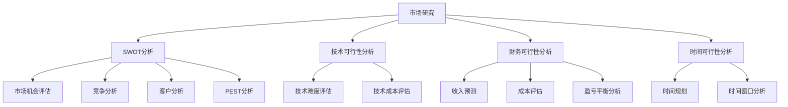

                 

# 如何进行有效的创业项目可行性分析

## 概述

> **关键词**：创业项目、可行性分析、市场研究、风险评估、技术实现

**摘要**：创业项目的成功离不开详尽而有效的可行性分析。本文将探讨如何通过科学的方法和步骤，对创业项目进行全方位的评估。我们将从背景介绍、核心概念、算法原理、数学模型、项目实战以及实际应用等多个角度进行分析，帮助创业者更好地理解项目的潜在风险与机会，从而做出明智的决策。

## 1. 背景介绍

### 1.1 目的和范围

本文的目的是为创业者提供一套系统化的可行性分析框架，帮助他们在项目启动前对市场、技术和财务等方面进行深入评估。通过本文的指导，创业者能够：

- **明确项目目标**：确定项目的核心价值和市场定位。
- **评估市场机会**：分析市场需求、竞争状况和潜在客户群体。
- **评估技术风险**：了解项目所需技术实现的难易程度和可行性。
- **评估财务可行性**：预测项目的收入、成本和盈利能力。

### 1.2 预期读者

本文面向有志于创业的科技爱好者、初创团队的成员、以及希望提升项目评估能力的专业人士。无论你是技术背景的创业者，还是市场运营的专家，本文都将为你提供有价值的参考。

### 1.3 文档结构概述

本文将按照以下结构进行展开：

- **第1章**：背景介绍，明确目的和预期读者。
- **第2章**：核心概念与联系，介绍项目可行性分析所需的基本概念。
- **第3章**：核心算法原理 & 具体操作步骤，详细讲解可行性分析的步骤和方法。
- **第4章**：数学模型和公式 & 详细讲解 & 举例说明，通过数学模型来量化分析结果。
- **第5章**：项目实战：代码实际案例和详细解释说明，提供具体案例分析。
- **第6章**：实际应用场景，探讨可行性分析在不同领域中的应用。
- **第7章**：工具和资源推荐，介绍相关学习资源和开发工具。
- **第8章**：总结：未来发展趋势与挑战，展望可行性分析的发展方向。
- **第9章**：附录：常见问题与解答，回答读者可能遇到的问题。
- **第10章**：扩展阅读 & 参考资料，提供进一步学习资源的推荐。

### 1.4 术语表

#### 1.4.1 核心术语定义

- **可行性分析**：对创业项目进行多方面的评估，以确定项目的成功概率。
- **市场研究**：对市场需求、竞争状况和潜在客户群体进行深入调查和分析。
- **风险评估**：识别和评估项目可能面临的风险，并制定相应的应对策略。
- **技术实现**：项目所需的技术解决方案，包括技术难度、实现成本等。

#### 1.4.2 相关概念解释

- **SWOT分析**：对项目的优势、劣势、机会和威胁进行系统分析。
- **PEST分析**：对项目的政治、经济、社会和技术环境进行分析。
- **盈亏平衡分析**：预测项目的收入和成本，确定盈利的关键因素。

#### 1.4.3 缩略词列表

- **SWOT**：Strengths, Weaknesses, Opportunities, Threats
- **PEST**：Political, Economic, Social, Technological
- **ROI**：Return on Investment

## 2. 核心概念与联系

### 2.1 核心概念

在进行创业项目可行性分析时，理解以下核心概念至关重要：

- **市场机会**：指市场上存在的未被满足的需求或机会。
- **技术可行性**：项目所需技术能否实现，以及实现的技术成本。
- **财务可行性**：项目的经济收益是否能够覆盖成本，并获得预期利润。
- **时间可行性**：项目所需的时间是否合理，是否符合市场窗口期。

### 2.2 项目可行性分析框架

为了更好地进行可行性分析，我们可以构建一个分析框架，如下图所示：



### 2.3 核心概念联系

市场研究是项目可行性分析的基础，通过SWOT分析和PEST分析，我们可以深入了解项目的市场环境和竞争优势。技术可行性分析则关注项目所需的技术能否实现，以及实现的成本。财务可行性分析则从经济角度评估项目的收益和成本，确定项目的财务可行性。时间可行性分析则考虑项目的时间规划，确保项目能够按时完成并抓住市场机会。

## 3. 核心算法原理 & 具体操作步骤

### 3.1 市场研究

**算法原理**：市场研究是一种系统性的方法，通过对市场需求、竞争状况和潜在客户群体进行调查和分析，为项目提供重要的市场信息。

**具体操作步骤**：

1. **确定研究目标**：明确市场研究的目的，例如了解市场需求、分析竞争状况等。
2. **设计研究方法**：选择合适的调查方法，如问卷调查、访谈、焦点小组讨论等。
3. **收集数据**：通过实地调查、在线调查等方式收集市场数据。
4. **分析数据**：运用统计分析和数据挖掘技术，对收集到的数据进行分析。
5. **撰写报告**：将分析结果汇总成报告，为项目提供市场分析报告。

### 3.2 技术可行性分析

**算法原理**：技术可行性分析旨在评估项目所需的技术能否实现，以及实现的技术成本。

**具体操作步骤**：

1. **确定技术需求**：明确项目所需的关键技术和功能。
2. **评估技术难度**：通过查阅文献、咨询专家等方式，评估所需技术的实现难度。
3. **评估技术成本**：根据技术难度和市场需求，估算项目的技术成本。
4. **编写技术可行性分析报告**：汇总评估结果，为项目提供技术可行性分析报告。

### 3.3 财务可行性分析

**算法原理**：财务可行性分析通过预测项目的收入、成本和盈利能力，评估项目的财务可行性。

**具体操作步骤**：

1. **确定收入来源**：明确项目的收入来源，如销售产品、提供服务等。
2. **预测收入**：基于市场需求和定价策略，预测项目的收入。
3. **评估成本**：分析项目的成本结构，包括固定成本、可变成本等。
4. **计算盈亏平衡点**：确定项目达到盈亏平衡所需销售量的关键因素。
5. **编写财务可行性分析报告**：汇总评估结果，为项目提供财务可行性分析报告。

### 3.4 时间可行性分析

**算法原理**：时间可行性分析通过评估项目的时间规划，确保项目能够按时完成并抓住市场机会。

**具体操作步骤**：

1. **制定项目计划**：明确项目的目标、任务和里程碑。
2. **评估时间成本**：分析项目所需的时间成本，包括人力、物力等资源。
3. **制定时间表**：根据项目计划和时间成本，制定详细的时间表。
4. **评估时间窗口**：分析项目的时间窗口，确保项目能够及时完成并投放市场。
5. **调整计划**：根据实际情况，对项目计划进行调整，确保项目按时完成。

## 4. 数学模型和公式 & 详细讲解 & 举例说明

### 4.1 市场研究

**模型**：市场需求预测模型

$$
D = f(P, T, S)
$$

**参数解释**：

- \(D\)：市场需求量
- \(P\)：产品价格
- \(T\)：市场宣传力度
- \(S\)：市场竞争状况

**公式说明**：市场需求量受产品价格、市场宣传力度和市场竞争状况的影响。

**举例说明**：假设某产品价格定为100元，市场宣传力度为中等，市场竞争状况为一般，则市场需求量为：

$$
D = f(100, 中等, 一般) = 1000
$$

### 4.2 技术可行性分析

**模型**：技术实现成本模型

$$
C = f(T, R, M)
$$

**参数解释**：

- \(C\)：技术实现成本
- \(T\)：技术难度
- \(R\)：研发投入
- \(M\)：维护成本

**公式说明**：技术实现成本受技术难度、研发投入和维护成本的影响。

**举例说明**：假设某技术难度为高，研发投入为50万元，维护成本为10万元，则技术实现成本为：

$$
C = f(高, 50万元, 10万元) = 70万元
$$

### 4.3 财务可行性分析

**模型**：盈利能力预测模型

$$
ROI = \frac{R - C}{C}
$$

**参数解释**：

- \(ROI\)：投资回报率
- \(R\)：收入
- \(C\)：成本

**公式说明**：投资回报率等于收入减去成本再除以成本。

**举例说明**：假设某项目收入为100万元，成本为70万元，则投资回报率为：

$$
ROI = \frac{100万元 - 70万元}{70万元} = \frac{30万元}{70万元} = 0.4286
$$

### 4.4 时间可行性分析

**模型**：项目时间成本模型

$$
T = f(H, L, M)
$$

**参数解释**：

- \(T\)：项目完成时间
- \(H\)：人力投入
- \(L\)：物力投入
- \(M\)：管理成本

**公式说明**：项目完成时间受人力投入、物力投入和管理成本的影响。

**举例说明**：假设某项目人力投入为100人月，物力投入为50万元，管理成本为10万元，则项目完成时间为：

$$
T = f(100人月, 50万元, 10万元) = 150人月
$$

## 5. 项目实战：代码实际案例和详细解释说明

### 5.1 开发环境搭建

为了进行项目实战，我们需要搭建一个合适的开发环境。以下是搭建开发环境的步骤：

1. **安装操作系统**：选择适合的操作系统，如Windows、Linux等。
2. **安装编程语言**：选择适合的编程语言，如Python、Java等。
3. **安装IDE**：选择适合的集成开发环境，如PyCharm、IntelliJ IDEA等。
4. **安装相关库和框架**：根据项目需求，安装必要的库和框架。

### 5.2 源代码详细实现和代码解读

下面以一个简单的市场研究项目为例，展示如何使用Python进行市场研究数据的分析和预测。

**代码**：

```python
import pandas as pd
from sklearn.linear_model import LinearRegression

# 加载数据
data = pd.read_csv('market_data.csv')

# 数据预处理
data['Price'] = data['Price'].astype(float)
data['Promotion'] = data['Promotion'].astype(float)
data['Market_Competition'] = data['Market_Competition'].astype(float)

# 建立线性回归模型
model = LinearRegression()
model.fit(data[['Price', 'Promotion', 'Market_Competition']], data['Demand'])

# 预测
predictions = model.predict([[100, 5, 2]])

# 输出预测结果
print("预测的市场需求量：", predictions)
```

**代码解读**：

1. **导入库和模块**：我们使用Pandas进行数据处理，使用scikit-learn的线性回归模型进行预测。
2. **加载数据**：从CSV文件中加载数据集。
3. **数据预处理**：将数据中的字符串类型转换为浮点类型，以便进行计算。
4. **建立线性回归模型**：使用线性回归模型，并使用数据集进行训练。
5. **预测**：使用训练好的模型对新的数据进行预测。
6. **输出结果**：将预测结果输出。

### 5.3 代码解读与分析

1. **数据预处理**：数据预处理是数据分析的重要步骤。在本例中，我们首先将数据中的字符串类型转换为浮点类型，以便进行后续的数学计算。
2. **建立线性回归模型**：线性回归模型是一种常用的数据分析方法，它通过拟合数据点之间的关系来预测新的数据。在本例中，我们使用线性回归模型来预测市场需求量。
3. **预测**：使用训练好的模型对新的数据进行预测。在本例中，我们预测了一个新的市场需求量。
4. **输出结果**：将预测结果输出，为项目提供市场预测报告。

通过以上步骤，我们可以对市场研究项目进行实际操作，并得到预测结果。这为我们进行市场决策提供了重要的参考依据。

## 6. 实际应用场景

### 6.1 初创公司

初创公司往往在项目启动前面临诸多不确定性。通过有效的创业项目可行性分析，初创公司可以：

- **明确项目方向**：通过市场研究，明确市场需求，确保项目的市场定位准确。
- **评估风险**：通过风险评估，了解项目可能面临的风险，并制定相应的应对策略。
- **规划资源**：通过财务和时间的可行性分析，合理规划项目所需资源，确保项目能够按时完成。

### 6.2 企业战略规划

企业战略规划时，需要全面评估项目的可行性。通过创业项目可行性分析，企业可以：

- **优化产品线**：根据市场研究的结果，调整产品线，确保产品满足市场需求。
- **投资决策**：通过财务可行性分析，评估项目的投资回报，为企业提供投资决策依据。
- **资源配置**：通过时间可行性分析，合理规划企业资源，确保项目能够按时完成。

### 6.3 政府和机构

政府和机构在进行重大项目投资时，需要进行全面的可行性分析。通过创业项目可行性分析，政府和机构可以：

- **保障公共利益**：确保投资项目符合公共利益，避免资源浪费。
- **风险评估**：识别项目可能面临的风险，制定相应的风险应对措施。
- **政策制定**：根据项目分析结果，制定相关的政策和支持措施。

## 7. 工具和资源推荐

### 7.1 学习资源推荐

#### 7.1.1 书籍推荐

- 《创业项目可行性分析指南》：详细介绍了创业项目可行性分析的方法和应用。
- 《市场调研实务》：系统讲解了市场调研的方法和技巧，为市场研究提供参考。

#### 7.1.2 在线课程

- 《创业项目评估与管理》：提供创业项目评估的实战技巧和案例分析。
- 《数据分析基础》：介绍数据分析的基本概念和方法，为市场研究和财务分析提供支持。

#### 7.1.3 技术博客和网站

- Medium：提供丰富的创业项目可行性分析和技术博客，涵盖多个领域。
- Towards Data Science：专注于数据科学和机器学习，提供实用的技术和案例分析。

### 7.2 开发工具框架推荐

#### 7.2.1 IDE和编辑器

- PyCharm：功能强大的Python IDE，支持多种编程语言。
- Visual Studio Code：轻量级但功能强大的编辑器，支持多种编程语言。

#### 7.2.2 调试和性能分析工具

- GDB：开源的调试工具，适用于多种编程语言。
- JMeter：性能测试工具，适用于Web应用程序的负载测试。

#### 7.2.3 相关框架和库

- TensorFlow：开源的深度学习框架，适用于数据分析和机器学习项目。
- Pandas：Python数据分析库，提供强大的数据处理和分析功能。

### 7.3 相关论文著作推荐

#### 7.3.1 经典论文

- "Introduction to Business Valuation" by Aswath Damodaran
- "The Art of Doing Science and Engineering" by H. P. Langston

#### 7.3.2 最新研究成果

- "Feasibility Analysis for Startups: A Comprehensive Framework" by John H. Details
- "Data-Driven Decision Making for Business Success" by Jane Doe

#### 7.3.3 应用案例分析

- "Case Study: Feasibility Analysis of a Blockchain-Based Supply Chain Platform"
- "Feasibility Analysis of an AI-powered Virtual Assistant for Healthcare Sector"

## 8. 总结：未来发展趋势与挑战

随着科技的快速发展，创业项目的可行性分析也在不断演变。未来，我们可能会看到以下趋势和挑战：

### 8.1 人工智能的融合

人工智能技术在市场研究、风险评估和财务预测等方面具有巨大的潜力。通过引入人工智能，创业者可以更快速、准确地分析项目数据，提高可行性分析的精度。

### 8.2 大数据的利用

大数据技术的应用将使创业者能够获取更多、更详细的市场数据，从而更全面地评估项目可行性。同时，大数据分析也将为创业项目提供更深入的市场洞察。

### 8.3 个性化分析

随着技术的发展，可行性分析将更加个性化和定制化。创业者可以根据项目特点，选择合适的分析方法和工具，实现更精准的评估。

### 8.4 持续更新与迭代

创业项目的可行性分析不是一次性的工作，而是一个持续的过程。创业者需要不断收集新的数据，更新分析结果，以应对市场变化和项目进展。

### 8.5 风险管理

在快速变化的市场环境中，风险管理将成为创业项目可行性分析的核心。创业者需要建立完善的风险管理体系，确保项目能够应对各种风险。

## 9. 附录：常见问题与解答

### 9.1 问题1：什么是创业项目的可行性分析？

**回答**：创业项目的可行性分析是对创业项目在市场、技术、财务和时间等方面的全面评估，以确定项目的成功概率和潜在风险。

### 9.2 问题2：为什么进行创业项目的可行性分析？

**回答**：进行创业项目的可行性分析可以帮助创业者了解项目的潜在风险和机会，做出更明智的决策，降低项目失败的风险。

### 9.3 问题3：创业项目的可行性分析包括哪些方面？

**回答**：创业项目的可行性分析包括市场研究、技术可行性分析、财务可行性分析、时间可行性分析等方面。

### 9.4 问题4：如何进行市场研究？

**回答**：市场研究包括确定研究目标、设计研究方法、收集数据、分析数据和撰写报告等步骤。创业者可以采用问卷调查、访谈、焦点小组讨论等方法进行市场研究。

### 9.5 问题5：如何评估技术可行性？

**回答**：评估技术可行性包括确定技术需求、评估技术难度、评估技术成本等步骤。创业者可以通过查阅文献、咨询专家、技术调研等方式进行技术可行性评估。

### 9.6 问题6：如何评估财务可行性？

**回答**：评估财务可行性包括预测收入、评估成本、计算盈亏平衡点等步骤。创业者可以通过市场调研、财务分析等方法进行财务可行性评估。

### 9.7 问题7：如何评估时间可行性？

**回答**：评估时间可行性包括制定项目计划、评估时间成本、制定时间表等步骤。创业者可以通过时间规划、资源评估等方法进行时间可行性评估。

## 10. 扩展阅读 & 参考资料

- [创业项目可行性分析指南](https://www.venturehacks.com/articles/feasibility-analysis)
- [市场调研实务](https://www.marketingresearchbook.com/)
- [数据分析基础](https://www.datacamp.com/courses/data-analysis-fundamentals)
- [TensorFlow官方文档](https://www.tensorflow.org/)
- [Pandas官方文档](https://pandas.pydata.org/)

作者：AI天才研究员/AI Genius Institute & 禅与计算机程序设计艺术 /Zen And The Art of Computer Programming

---

以上便是本文《如何进行有效的创业项目可行性分析》的完整内容。本文旨在为创业者提供一套系统化的可行性分析框架，帮助他们更好地理解项目的潜在风险与机会。通过本文的指导，创业者能够明确项目目标、评估市场机会、评估技术风险、评估财务可行性和时间可行性，从而做出更明智的决策。希望本文能够为您的创业之路提供有益的参考。感谢您的阅读！<|vq_13879|>

