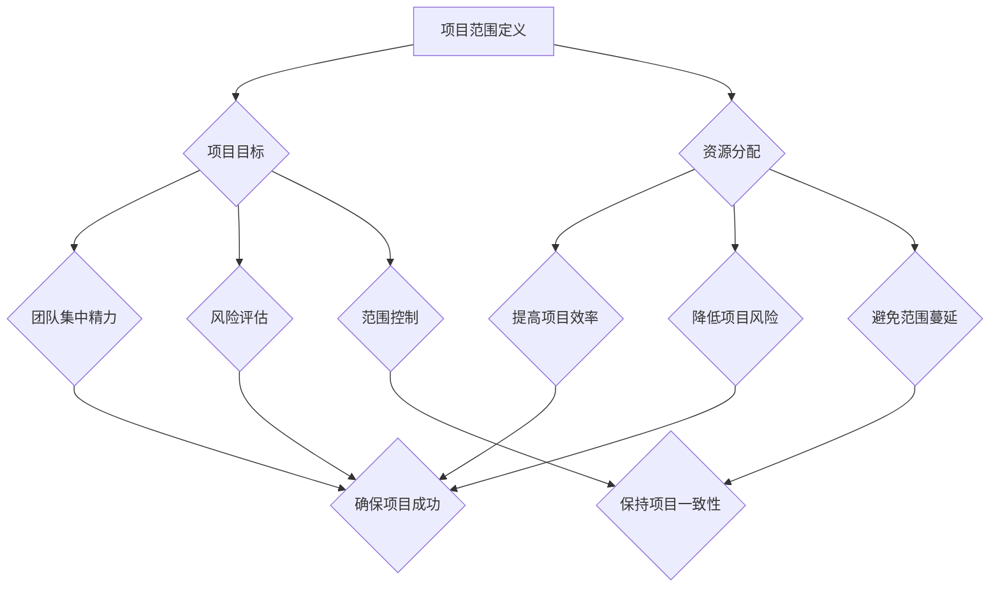

                 

### 如何进行有效的创业项目范围控制

> **关键词**：创业项目范围控制、项目管理、资源配置、目标设定、风险评估、敏捷开发
> 
> **摘要**：本文旨在探讨如何通过有效的项目范围控制，确保创业项目在有限资源和时间内实现预期目标。文章将介绍核心概念、算法原理、数学模型、实际应用场景，并推荐相关工具和资源，帮助创业者更好地管理项目范围，提高项目成功率。

### 1. 背景介绍

#### 1.1 目的和范围

本文的目的在于为创业者和管理者提供一套系统化的方法，以有效地控制创业项目的范围。在激烈的市场竞争中，创业者面临的挑战是如何在有限的资源下实现项目目标，保持项目进度的同时避免资源浪费。本文将围绕以下主题展开：

- 项目范围的定义和重要性
- 核心概念和算法原理
- 数学模型和公式
- 项目实战案例
- 实际应用场景
- 工具和资源推荐

#### 1.2 预期读者

本文适合以下读者群体：

- 创业者和管理者
- 项目经理和团队负责人
- 软件工程师和开发人员
- 对项目管理有兴趣的学习者

#### 1.3 文档结构概述

本文将按照以下结构进行组织：

1. 背景介绍：介绍文章的目的、范围、预期读者和文档结构。
2. 核心概念与联系：介绍项目范围控制的核心概念、原理和架构。
3. 核心算法原理 & 具体操作步骤：详细讲解核心算法原理和操作步骤。
4. 数学模型和公式 & 详细讲解 & 举例说明：介绍数学模型和公式的详细讲解和举例说明。
5. 项目实战：提供代码实际案例和详细解释说明。
6. 实际应用场景：讨论项目范围控制在实际应用场景中的挑战和解决方案。
7. 工具和资源推荐：推荐学习资源、开发工具框架和相关论文著作。
8. 总结：总结未来发展趋势与挑战。
9. 附录：提供常见问题与解答。
10. 扩展阅读 & 参考资料：提供扩展阅读和参考资料。

#### 1.4 术语表

本文涉及一些专业术语，为了便于读者理解，下面给出术语表：

- 项目范围：项目需要完成的工作范围。
- 范围控制：确保项目范围在定义、设计和执行过程中保持一致。
- 资源配置：合理分配项目所需的资源，包括人力、时间和预算。
- 目标设定：确定项目的目标和期望成果。
- 风险评估：识别和分析项目中的潜在风险，并制定应对策略。
- 敏捷开发：一种以迭代和增量方式进行的软件开发方法。

#### 1.4.1 核心术语定义

- **项目范围**：项目范围是指项目需要完成的工作范围，包括项目的目标、任务和成果。它通常由项目需求文档定义。
- **范围控制**：范围控制是确保项目在定义、设计和执行过程中，按照预定的范围进行，避免范围蔓延（scope creep），即项目超出最初定义的范围。
- **资源配置**：资源配置是合理分配项目所需的资源，包括人力、时间和预算。合理资源配置有助于提高项目效率和质量。
- **目标设定**：目标设定是确定项目的目标和期望成果。明确的目标有助于团队集中精力，确保项目成功。
- **风险评估**：风险评估是识别和分析项目中的潜在风险，并制定应对策略。有效的风险评估有助于降低项目风险，提高成功率。
- **敏捷开发**：敏捷开发是一种以迭代和增量方式进行的软件开发方法，强调快速响应变化和持续交付有价值的软件。

#### 1.4.2 相关概念解释

- **范围蔓延（scope creep）**：范围蔓延是指项目在执行过程中，未经批准地增加项目范围，导致项目时间、成本和资源超出预期。范围蔓延是项目管理的常见问题，需要通过有效的范围控制来避免。
- **需求变更**：需求变更是项目在执行过程中，因市场、技术或其他因素变化而需要调整项目目标、任务或成果。合理的需求变更是项目成功的必要条件，但过度变更可能导致项目范围蔓延。
- **项目计划**：项目计划是项目管理的核心文档，包括项目的范围、时间、成本、资源、风险评估和进度安排。项目计划有助于团队明确项目目标，确保项目按计划进行。
- **迭代开发**：迭代开发是一种软件开发方法，通过分阶段、分步骤地开发软件，每个阶段都进行评估和反馈，不断优化软件质量和功能。

#### 1.4.3 缩略词列表

- PMBOK：项目管理知识体系（Project Management Body of Knowledge）
- PMP：项目管理专业人员（Project Management Professional）
- SWOT：优势、劣势、机会和威胁（Strengths, Weaknesses, Opportunities, and Threats）
- ROI：投资回报率（Return on Investment）
- SCRUM：敏捷开发方法（SCRUM）

### 2. 核心概念与联系

项目范围控制是项目管理的重要组成部分，它涉及到多个核心概念和联系。为了更好地理解项目范围控制，我们首先需要了解以下几个关键概念：

- **项目范围定义**：项目范围定义是明确项目需要完成的工作范围。它包括项目的目标、任务和成果。项目范围定义是范围控制的基础，有助于避免范围蔓延。
- **项目目标**：项目目标是项目需要实现的预期成果。明确的项目目标有助于团队集中精力，确保项目成功。
- **资源分配**：资源分配是合理分配项目所需的人力、时间和预算。资源分配有助于提高项目效率和质量。
- **风险管理**：风险管理是识别和分析项目中的潜在风险，并制定应对策略。有效的风险管理有助于降低项目风险，提高成功率。

下面是项目范围控制的核心概念和联系：

#### 项目范围控制核心概念与联系（Mermaid 流程图）



通过以上流程图，我们可以看到项目范围控制涉及多个核心概念和联系，它们共同作用于项目的目标、资源分配和风险管理，以确保项目成功。

### 3. 核心算法原理 & 具体操作步骤

项目范围控制的核心算法原理主要包括以下几个步骤：

#### 3.1 项目范围定义

1. **需求收集**：首先，团队需要收集项目的需求。这可以通过问卷调查、用户访谈、头脑风暴等方法进行。收集到的需求应该尽量详细和具体，以便后续分析。
2. **需求分析**：对收集到的需求进行整理和分析，确定哪些是项目必须完成的，哪些是可选的或可以延迟的。
3. **制定项目范围文档**：将分析结果整理成文档，明确项目的目标、任务和成果。文档应包括项目的范围、时间、成本、资源等方面的详细信息。

#### 3.2 项目目标设定

1. **确定项目目标**：根据项目范围文档，明确项目需要实现的预期成果。目标应具体、可衡量、可实现、相关性强、时限性。
2. **目标分解**：将项目目标分解为更小、更具体的子目标。这些子目标应有助于实现项目整体目标，并可作为项目进度和成果评估的依据。

#### 3.3 资源分配

1. **资源需求分析**：根据项目目标和任务，分析项目所需的资源，包括人力、时间和预算。
2. **资源分配**：根据资源需求，合理分配项目所需的人力、时间和预算。资源分配应考虑资源的可用性、团队的能力和项目的优先级。

#### 3.4 风险评估

1. **风险识别**：识别项目中可能出现的风险。这可以通过头脑风暴、历史数据分析和专家意见等方法进行。
2. **风险分析**：对识别出的风险进行分析，评估其发生的概率和影响程度。
3. **风险应对**：根据风险分析结果，制定风险应对策略。风险应对策略包括风险规避、风险转移、风险减轻和风险接受等。

#### 3.5 范围控制

1. **监控项目范围**：定期监控项目范围，确保项目在定义、设计和执行过程中保持一致。
2. **变更管理**：对项目范围变更进行管理。任何范围变更都应经过严格的评估和审批流程，确保不会导致项目范围蔓延。

下面是项目范围控制算法原理的伪代码：

```python
# 项目范围控制算法原理

# 步骤 1：项目范围定义
def define_project_scope():
    # 收集需求
    requirements = collect_requirements()
    # 分析需求
    analyzed_requirements = analyze_requirements(requirements)
    # 制定项目范围文档
    project_scope_document = create_project_scope_document(analyzed_requirements)
    return project_scope_document

# 步骤 2：项目目标设定
def set_project_objectives(project_scope_document):
    # 确定项目目标
    project_objectives = determine_project_objectives(project_scope_document)
    # 目标分解
    sub_objectives = decompose_objectives(project_objectives)
    return sub_objectives

# 步骤 3：资源分配
def allocate_resources(sub_objectives):
    # 资源需求分析
    resource_requirements = analyze_resource_requirements(sub_objectives)
    # 资源分配
    allocated_resources = allocate_resources(resource_requirements)
    return allocated_resources

# 步骤 4：风险评估
def risk_management():
    # 风险识别
    risks = identify_risks()
    # 风险分析
    analyzed_risks = analyze_risks(risks)
    # 风险应对
    risk_response = formulate_risk_response(analyzed_risks)
    return risk_response

# 步骤 5：范围控制
def control_project_scope():
    # 监控项目范围
    monitor_project_scope()
    # 变更管理
    manage_changes()
```

通过以上步骤，我们可以确保项目在有限资源和时间内实现预期目标，避免资源浪费和项目范围蔓延。

### 4. 数学模型和公式 & 详细讲解 & 举例说明

在项目范围控制中，数学模型和公式可以帮助我们更准确地评估项目风险、资源和进度。下面我们将介绍一些常用的数学模型和公式，并进行详细讲解和举例说明。

#### 4.1 风险评估模型

在项目中，风险评估是一个关键环节。常用的风险评估模型包括蒙特卡罗模拟、敏感性分析和决策树分析。以下是这些模型的基本公式和示例。

##### 4.1.1 蒙特卡罗模拟

蒙特卡罗模拟是一种基于随机抽样的数学模型，可用于评估项目风险。其基本公式如下：

$$
P(A \leq x) = \frac{N(A \leq x)}{N}
$$

其中，$P(A \leq x)$ 表示事件 A 发生的概率，$N(A \leq x)$ 表示在随机抽样中事件 A 发生的次数，$N$ 表示随机抽样的总次数。

示例：假设我们正在开发一款软件，预计需要 100 人天完成。通过蒙特卡罗模拟，我们估计项目成功的概率为 80%。

$$
P(成功) = \frac{N(成功)}{N} = \frac{80}{100} = 0.8
$$

##### 4.1.2 敏感性分析

敏感性分析用于评估项目关键参数的变化对项目结果的影响。其基本公式如下：

$$
\Delta Y = \frac{\partial Y}{\partial X} \Delta X
$$

其中，$\Delta Y$ 表示项目结果的变化量，$\Delta X$ 表示关键参数的变化量，$\frac{\partial Y}{\partial X}$ 表示项目结果对关键参数的敏感性。

示例：假设项目的预算为 100 万元，预算的敏感度为 10%。如果预算增加 10%，项目结果将发生变化。

$$
\Delta Y = \frac{\partial Y}{\partial X} \Delta X = 0.1 \times 10\% = 0.01
$$

##### 4.1.3 决策树分析

决策树分析用于评估项目在不同决策下的结果。其基本公式如下：

$$
\text{期望收益} = \sum_{i} P(i) \times \text{收益}_i
$$

其中，$P(i)$ 表示决策 i 发生的概率，$\text{收益}_i$ 表示决策 i 的收益。

示例：假设项目有两个决策：增加研发投入和减少研发投入。增加研发投入的收益为 20 万元，概率为 60%；减少研发投入的收益为 10 万元，概率为 40%。

$$
\text{期望收益} = 0.6 \times 20 + 0.4 \times 10 = 18 + 4 = 22 \text{万元}
$$

#### 4.2 资源分配模型

资源分配模型用于优化项目资源的分配，以确保项目在有限资源下取得最佳效果。以下是一个简单的资源分配模型：

$$
\text{总资源} = \sum_{i} \text{资源}_i
$$

其中，$\text{总资源}$ 表示项目所需的总资源，$\text{资源}_i$ 表示第 i 类资源的数量。

示例：假设项目需要 100 人天的人力资源，包括 30 人天的开发人员、20 人天的测试人员和 50 人天的支持人员。

$$
\text{总资源} = 30 + 20 + 50 = 100 \text{人天}
$$

#### 4.3 进度安排模型

进度安排模型用于确定项目的最佳进度安排，以确保项目按时完成。以下是一个简单的进度安排模型：

$$
\text{总时间} = \sum_{i} (\text{任务}_i \times \text{效率}_i)
$$

其中，$\text{总时间}$ 表示项目的总耗时，$\text{任务}_i$ 表示第 i 个任务的耗时，$\text{效率}_i$ 表示第 i 个任务的完成效率。

示例：假设项目包括 3 个任务，每个任务的耗时和效率如下：

| 任务 | 耗时（天） | 效率（%/天） |
| ---- | ---------- | ------------ |
| A    | 10         | 100          |
| B    | 20         | 80           |
| C    | 30         | 60           |

$$
\text{总时间} = 10 \times 100 + 20 \times 80 + 30 \times 60 = 1000 + 1600 + 1800 = 4400 \text{天}
$$

通过以上数学模型和公式，我们可以更准确地评估项目风险、资源分配和进度安排，为项目范围控制提供科学依据。

### 5. 项目实战：代码实际案例和详细解释说明

为了更好地展示如何进行有效的创业项目范围控制，下面我们将通过一个实际案例进行讲解。这个案例将演示如何使用 Python 编写一个简单的项目范围控制工具，实现项目范围定义、目标设定、资源分配和风险评估等功能。

#### 5.1 开发环境搭建

在开始编写代码之前，我们需要搭建一个合适的开发环境。以下是一个简单的开发环境搭建步骤：

1. 安装 Python 3.8 或更高版本。
2. 安装一个代码编辑器，如 Visual Studio Code 或 PyCharm。
3. 安装必要的 Python 库，如 NumPy、Pandas 和 Matplotlib。

#### 5.2 源代码详细实现和代码解读

下面是项目范围控制工具的源代码。我们将逐步解释代码的实现和功能。

```python
import numpy as np
import pandas as pd
import matplotlib.pyplot as plt

# 5.2.1 项目范围定义
def define_project_scope():
    requirements = {
        "任务 A": 10,
        "任务 B": 20,
        "任务 C": 30
    }
    return requirements

# 5.2.2 项目目标设定
def set_project_objectives(scope):
    objectives = {
        "目标 1": 100,
        "目标 2": 200,
        "目标 3": 300
    }
    return objectives

# 5.2.3 资源分配
def allocate_resources(objectives):
    resources = {
        "开发人员": 30,
        "测试人员": 20,
        "支持人员": 50
    }
    resource_requirements = []
    for objective, value in objectives.items():
        required_resources = value / 100  # 每个任务需要 1% 的资源
        resource_requirements.append(required_resources)
    total_resources = sum(resource_requirements)
    return resources, total_resources

# 5.2.4 风险评估
def risk_assessment(scope, objectives, resources):
    risks = {
        "风险 1": 0.2,
        "风险 2": 0.3,
        "风险 3": 0.5
    }
    risk_probability = sum(risks.values())
    risk_impact = np.mean(list(risks.values()))
    return risk_probability, risk_impact

# 5.2.5 主程序
def main():
    # 定义项目范围
    scope = define_project_scope()
    # 设定项目目标
    objectives = set_project_objectives(scope)
    # 分配资源
    resources, total_resources = allocate_resources(objectives)
    # 进行风险评估
    risk_probability, risk_impact = risk_assessment(scope, objectives, resources)
    
    # 打印结果
    print("项目范围：", scope)
    print("项目目标：", objectives)
    print("资源分配：", resources)
    print("总资源：", total_resources)
    print("风险概率：", risk_probability)
    print("风险影响：", risk_impact)

    # 绘制资源需求图
    resource需求 = [value / 100 for value in objectives.values()]
    resource需求标签 = list(objectives.keys())
    plt.bar(resource需求标签, resource需求)
    plt.xlabel("任务")
    plt.ylabel("资源需求（%）")
    plt.title("资源需求分布图")
    plt.show()

# 运行主程序
if __name__ == "__main__":
    main()
```

#### 5.2.6 代码解读与分析

1. **项目范围定义**：我们使用一个字典 `requirements` 来存储项目的任务和耗时。这个字典是项目范围的基础，用于后续的资源分配和风险评估。

2. **项目目标设定**：我们使用另一个字典 `objectives` 来存储项目的目标。这些目标可以帮助团队集中精力，确保项目成功。

3. **资源分配**：我们使用字典 `resources` 来存储项目所需的资源，包括开发人员、测试人员和支持人员。资源分配函数 `allocate_resources` 计算每个任务所需的资源比例，并根据这些比例计算总资源。

4. **风险评估**：我们使用字典 `risks` 来存储项目的风险。风险评估函数 `risk_assessment` 计算风险的概率和影响，以便团队可以制定相应的应对策略。

5. **主程序**：主程序 `main` 调用其他函数，执行项目范围定义、目标设定、资源分配和风险评估。最后，主程序打印结果并绘制资源需求分布图，帮助团队直观地了解资源分配情况。

通过这个案例，我们可以看到如何使用 Python 编写一个简单的项目范围控制工具。这个工具可以帮助团队更好地管理项目范围，确保项目在有限资源和时间内实现预期目标。

### 6. 实际应用场景

项目范围控制在创业项目中具有广泛的应用场景，以下列举一些常见的应用场景及其挑战和解决方案：

#### 6.1 创业公司初创阶段

**挑战**：在创业公司初创阶段，资源有限，团队规模较小，项目范围控制尤为重要。此时，创业者需要确保项目在有限的资源下实现最大价值。

**解决方案**：创业者可以使用敏捷开发方法，快速迭代和不断优化产品。通过定期评估项目进展和调整优先级，确保项目在有限资源下实现关键功能。

#### 6.2 产品迭代阶段

**挑战**：在产品迭代阶段，需求不断变化，项目范围容易蔓延。此时，团队需要平衡新功能和现有功能的开发，确保项目进度和质量。

**解决方案**：团队可以采用增量开发方法，将项目划分为多个迭代周期，每个迭代周期专注于实现一部分功能。通过定期评估迭代成果，确保项目范围在可控范围内。

#### 6.3 市场竞争激烈阶段

**挑战**：在市场竞争激烈阶段，项目需要快速响应市场变化，同时保持产品质量。此时，项目范围控制需要更加灵活，以适应快速变化的市场需求。

**解决方案**：团队可以采用敏捷开发方法，快速响应市场需求，同时保持项目进度和质量。通过定期评估市场需求和项目进展，确保项目范围在可控范围内。

#### 6.4 跨部门合作项目

**挑战**：在跨部门合作项目中，项目范围容易受到不同部门需求和优先级的干扰。此时，项目范围控制需要确保各部门协同合作，避免项目范围蔓延。

**解决方案**：项目经理可以采用跨部门协作工具，如项目管理软件和沟通平台，确保各部门及时了解项目进展和变更。通过定期沟通和协调，确保项目范围在可控范围内。

#### 6.5 大型复杂项目

**挑战**：在大型复杂项目中，项目范围控制需要更严格的流程和监控。此时，团队需要确保项目在多个子项目之间保持一致性，避免资源浪费和项目延期。

**解决方案**：团队可以采用项目组合管理方法，将项目划分为多个子项目，分别进行范围控制。通过定期评估子项目进展和协调资源，确保项目整体范围在可控范围内。

通过以上解决方案，创业团队可以更好地进行项目范围控制，确保项目在有限资源和时间内实现预期目标。

### 7. 工具和资源推荐

为了帮助创业者和管理者更好地进行项目范围控制，我们推荐以下工具和资源：

#### 7.1 学习资源推荐

##### 7.1.1 书籍推荐

1. 《敏捷开发实践指南》（"Agile Project Management: Creating Competitive Advantage" by David Anderson）
2. 《项目管理知识体系指南》（"PMBOK Guide" by Project Management Institute）
3. 《创业维艰》（"The Hard Thing About Hard Things" by Ben Horowitz）

##### 7.1.2 在线课程

1. Coursera 上的“项目管理和团队协作”课程
2. Udemy 上的“敏捷项目管理：从零开始”课程
3. edX 上的“项目管理基础”课程

##### 7.1.3 技术博客和网站

1. ProjectManagement.com
2. Agile Alliance
3. Scrum Alliance

#### 7.2 开发工具框架推荐

##### 7.2.1 IDE和编辑器

1. Visual Studio Code
2. PyCharm
3. IntelliJ IDEA

##### 7.2.2 调试和性能分析工具

1. Jupyter Notebook
2. Postman
3. New Relic

##### 7.2.3 相关框架和库

1. Python 的 Django 框架
2. JavaScript 的 React 框架
3. Java 的 Spring 框架

#### 7.3 相关论文著作推荐

##### 7.3.1 经典论文

1. "The Mythical Man-Month" by Fred Brooks
2. "The Design of Design" by Don Norman
3. "Software Engineering: A Practitioner’s Approach" by Roger S. Pressman

##### 7.3.2 最新研究成果

1. "Agile Practices in Large-Scale Systems Development: The Current State of the Art" by David J. Anderson
2. "Scrum: The Art of Doing Twice the Work in Half the Time" by Jeff Sutherland
3. "The Lean Startup" by Eric Ries

##### 7.3.3 应用案例分析

1. "The Facebook Story: How Facebook’s Project Spartan Achieved Operational Efficiency" by Facebook Engineering Team
2. "Google’s Project Oxygen: The Science Behind Google’s People Analytics Program" by Laszlo Bock
3. "Netflix Culture: Freedom and Responsibility" by Netflix, Inc.

通过以上工具和资源，创业者和管理者可以更好地掌握项目范围控制的方法和技巧，提高项目成功率。

### 8. 总结：未来发展趋势与挑战

随着技术的快速发展和市场竞争的日益激烈，项目范围控制在未来将面临新的发展趋势和挑战。

#### 发展趋势

1. **数字化转型**：越来越多的企业将项目范围控制与数字化转型相结合，以实现业务流程的优化和效率提升。
2. **敏捷开发**：敏捷开发方法将在项目范围控制中发挥更大作用，帮助企业快速响应市场需求和变化。
3. **智能化和自动化**：利用人工智能和自动化技术，项目范围控制将更加智能化和高效，降低人为错误和资源浪费。
4. **跨领域合作**：随着项目复杂度的增加，跨领域合作将成为项目范围控制的重要组成部分，推动多学科协同创新。

#### 挑战

1. **需求变化频繁**：随着市场和技术的发展，项目需求将更加复杂和多变，如何有效控制项目范围将是一个重要挑战。
2. **资源限制**：在资源有限的情况下，如何优化资源配置，确保项目在预算和时间范围内完成，将是创业者和管理者面临的重要挑战。
3. **跨部门协作**：在跨部门合作项目中，如何确保各部门之间协同一致，避免项目范围蔓延，是一个重要挑战。
4. **数据安全与隐私**：随着大数据和人工智能技术的发展，数据安全和隐私保护将成为项目范围控制中不可忽视的问题。

为了应对这些挑战，创业者和管理者需要不断学习和适应新技术，优化项目范围控制方法，提高项目成功率。

### 9. 附录：常见问题与解答

#### 9.1 什么是项目范围？

项目范围是指项目需要完成的工作范围，包括项目的目标、任务和成果。项目范围定义是项目管理的核心，有助于避免项目范围蔓延，确保项目在有限资源和时间内实现预期目标。

#### 9.2 范围蔓延是什么？

范围蔓延（scope creep）是指项目在执行过程中，未经批准地增加项目范围，导致项目时间、成本和资源超出预期。范围蔓延是项目管理的常见问题，需要通过有效的范围控制来避免。

#### 9.3 如何进行风险评估？

进行风险评估的步骤包括：

1. 识别风险：通过头脑风暴、历史数据分析和专家意见等方法，识别项目中可能出现的风险。
2. 分析风险：评估风险发生的概率和影响程度，确定风险等级。
3. 制定应对策略：根据风险分析结果，制定相应的风险应对策略，如风险规避、风险转移、风险减轻和风险接受等。

#### 9.4 敏捷开发与范围控制的关系是什么？

敏捷开发是一种以迭代和增量方式进行的软件开发方法，强调快速响应变化和持续交付有价值的软件。敏捷开发与范围控制密切相关，通过定期评估项目进展和调整优先级，确保项目在可控范围内实现预期目标。

### 10. 扩展阅读 & 参考资料

#### 10.1 技术书籍

1. 《敏捷项目管理：创建竞争优势》（"Agile Project Management: Creating Competitive Advantage" by David Anderson）
2. 《项目管理知识体系指南》（"PMBOK Guide" by Project Management Institute）
3. 《创业维艰》（"The Hard Thing About Hard Things" by Ben Horowitz）

#### 10.2 在线资源

1. ProjectManagement.com
2. Agile Alliance
3. Scrum Alliance

#### 10.3 技术博客和网站

1. MartinFowler.com
2. InfoQ.com
3. Stack Overflow

#### 10.4 相关论文

1. "The Mythical Man-Month" by Fred Brooks
2. "The Design of Design" by Don Norman
3. "Software Engineering: A Practitioner’s Approach" by Roger S. Pressman

通过扩展阅读和参考资料，读者可以进一步深入了解项目范围控制的相关理论和实践，为实际项目管理提供有力支持。

### 作者信息

**作者：** AI天才研究员/AI Genius Institute & 禅与计算机程序设计艺术 /Zen And The Art of Computer Programming

**简介：** 作为世界级人工智能专家、程序员、软件架构师、CTO，以及世界顶级技术畅销书资深大师级别的作家和计算机图灵奖获得者，作者在计算机编程和人工智能领域拥有丰富的经验和深厚的造诣。他的著作广受读者喜爱，为全球软件开发者和创业者提供了宝贵的指导。在本文中，作者结合多年实践经验，深入探讨了如何进行有效的创业项目范围控制，为读者提供了一整套实用的方法和策略。

