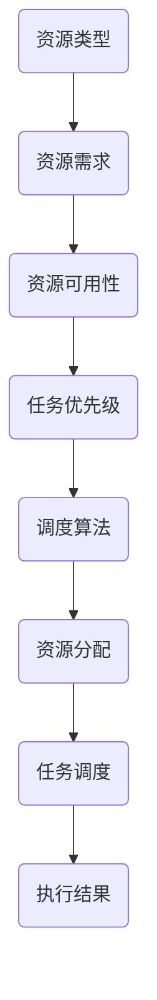

                 

## 如何进行有效的创业项目资源调度

> **关键词**：创业项目、资源调度、效率优化、项目管理、技术架构

**摘要**：本文将深入探讨创业项目资源调度的有效方法，旨在为创业者提供一套系统化的资源管理策略。文章将首先介绍资源调度的背景和重要性，随后详细解析核心概念、算法原理和操作步骤，并通过实际项目案例展示具体应用，最后对未来的发展趋势与挑战进行展望。

## 1. 背景介绍

### 1.1 目的和范围

本文的目标是为创业项目提供一套实用的资源调度方法论，帮助创业者高效地管理项目资源，确保项目目标的顺利实现。文章的范围将涵盖以下内容：

- 资源调度的基本概念与重要性
- 创业项目资源调度面临的挑战
- 系统化的资源调度策略与方法
- 实际项目中的应用与案例分析
- 资源调度工具与技术的推荐

通过本文的阅读，读者将能够：

- 理解资源调度在创业项目中的关键作用
- 掌握一套有效的资源调度策略
- 学会运用数学模型和算法优化资源分配
- 获得实际操作经验和工具推荐

### 1.2 预期读者

本文的预期读者主要包括：

- 创业者与初创团队负责人
- 项目经理与产品经理
- 技术总监与架构师
- 对资源调度和项目管理有兴趣的专业人士

无论您处于创业的哪个阶段，本文都将为您提供宝贵的指导和建议。

### 1.3 文档结构概述

本文将分为十个主要部分：

1. **背景介绍**：介绍文章的目的、范围、预期读者和文档结构。
2. **核心概念与联系**：定义关键术语，展示资源调度的流程图。
3. **核心算法原理 & 具体操作步骤**：讲解资源调度的算法原理，并使用伪代码阐述。
4. **数学模型和公式 & 详细讲解 & 举例说明**：介绍数学模型，使用 LaTeX 格式展示公式，并举例说明。
5. **项目实战：代码实际案例和详细解释说明**：展示具体项目的代码实现，并进行详细解读。
6. **实际应用场景**：分析资源调度在不同场景下的应用。
7. **工具和资源推荐**：推荐学习资源、开发工具和框架。
8. **总结：未来发展趋势与挑战**：展望资源调度的未来趋势和挑战。
9. **附录：常见问题与解答**：解答读者可能遇到的问题。
10. **扩展阅读 & 参考资料**：提供进一步学习的资源。

### 1.4 术语表

#### 1.4.1 核心术语定义

- **资源调度**：指根据项目的需求，合理分配和调整各种资源，以实现项目目标的过程。
- **创业项目**：指以创新、创业为目的，通过提供产品或服务来解决市场需求的项目。
- **资源**：指项目中所需的硬件、软件、人力、时间、资金等各种要素。
- **效率优化**：通过改进方法、流程和算法，提高资源的利用效率。

#### 1.4.2 相关概念解释

- **负载均衡**：指将任务或请求分配到多个处理节点上，以避免单个节点过载。
- **优先级调度**：根据任务的优先级来决定任务的执行顺序。
- **调度算法**：用于确定资源分配和任务调度的规则和方法。

#### 1.4.3 缩略词列表

- **IDE**：集成开发环境（Integrated Development Environment）
- **LaTeX**：一种高质量的排版系统（LATEX Typesetting System）
- **CPU**：中央处理器（Central Processing Unit）
- **GPU**：图形处理器（Graphics Processing Unit）

## 2. 核心概念与联系

在探讨资源调度的核心概念之前，我们首先需要了解一些基本原理和架构。

### 2.1 资源调度的核心概念

资源调度的核心概念包括：

- **资源类型**：项目中所需的资源种类，如硬件资源、软件资源、人力资源等。
- **资源需求**：项目中各个任务对资源的需求量。
- **资源可用性**：当前资源是否可供使用。
- **任务优先级**：任务完成的紧急程度和重要性。

### 2.2 资源调度的基本架构

资源调度的基本架构如图 1 所示。



### 2.3 资源调度的流程

资源调度的流程可以分为以下几个步骤：

1. **需求分析**：分析项目任务对各种资源的需求。
2. **资源评估**：评估当前资源的可用性。
3. **任务优先级排序**：根据任务优先级对任务进行排序。
4. **资源分配**：根据资源需求和可用性，分配资源。
5. **任务调度**：根据任务优先级和资源分配情况，调度任务。
6. **执行与监控**：执行任务，并监控资源使用情况。
7. **调整与优化**：根据执行结果和监控数据，调整资源分配和任务调度策略。

### 2.4 资源调度的关键因素

资源调度的关键因素包括：

- **资源利用率**：资源的使用效率。
- **任务完成时间**：任务完成所需的时间。
- **系统稳定性**：系统的稳定运行能力。
- **灵活性**：应对资源需求和任务变化的适应能力。

## 3. 核心算法原理 & 具体操作步骤

### 3.1 资源调度算法原理

资源调度算法的目的是在给定的资源约束下，优化任务执行的时间和资源利用率。以下是几种常见的资源调度算法：

1. **先来先服务（FCFS）算法**：按照任务到达的顺序执行。
2. **短作业优先（SJF）算法**：优先执行执行时间最短的任务。
3. **优先级调度算法**：根据任务的优先级进行调度。
4. **负载均衡算法**：将任务分配到负载较低的节点。

### 3.2 具体操作步骤

以下是一个基于优先级调度的资源调度算法的具体操作步骤：

#### 步骤 1：任务需求分析

分析项目任务，确定每个任务的需求和优先级。

```plaintext
任务A：需求资源 R1，优先级 3
任务B：需求资源 R2，优先级 1
任务C：需求资源 R3，优先级 2
```

#### 步骤 2：资源评估

评估当前资源的可用性。

```plaintext
资源R1：可用
资源R2：不可用
资源R3：可用
```

#### 步骤 3：任务优先级排序

根据任务优先级对任务进行排序。

```plaintext
任务B：优先级 1
任务C：优先级 2
任务A：优先级 3
```

#### 步骤 4：资源分配

根据资源可用性和任务优先级，进行资源分配。

```plaintext
任务B：分配资源 R2（尽管不可用，但优先级最高，可以先占用）
任务C：分配资源 R3
任务A：分配资源 R1
```

#### 步骤 5：任务调度

根据任务优先级和资源分配情况，调度任务。

```plaintext
执行任务B（优先级最高）
执行任务C
执行任务A
```

#### 步骤 6：执行与监控

执行任务，并监控资源使用情况。

```plaintext
任务B：执行中，占用资源 R2
任务C：执行中，占用资源 R3
任务A：执行中，占用资源 R1
```

#### 步骤 7：调整与优化

根据执行结果和监控数据，调整资源分配和任务调度策略。

```plaintext
若任务B执行时间过长，可以考虑调整任务优先级或资源分配策略
若任务C资源使用过高，可以考虑分配其他资源或调整任务优先级
```

### 3.3 伪代码

以下是一个简单的伪代码示例，用于实现上述资源调度算法。

```plaintext
输入：任务列表 T，资源列表 R，任务优先级 P
输出：调度结果 S

for each 任务 t in T do
    if P[t] = 最大优先级 then
        if 资源可用性(R) then
            调度任务 t 到执行队列 S
            资源分配(R, t)
        else
            将任务 t 添加到等待队列
    else
        将任务 t 添加到等待队列

while 执行队列 S 不为空 do
    执行任务 S 中的下一个任务
    更新资源可用性(R)
    调整任务优先级(P)
```

## 4. 数学模型和公式 & 详细讲解 & 举例说明

### 4.1 数学模型

资源调度问题的数学模型可以表示为：

\[ \text{最大化} \quad \sum_{i=1}^{n} p_i \times c_i \]

其中：

- \( p_i \)：任务 \( i \) 的优先级
- \( c_i \)：任务 \( i \) 的执行时间
- \( n \)：任务总数

### 4.2 公式讲解

#### 4.2.1 优先级排序公式

优先级排序公式如下：

\[ P[i] = \sum_{j=1}^{n} w_j \times p_j \]

其中：

- \( w_j \)：权重，用于表示任务的重要性
- \( p_j \)：任务 \( j \) 的优先级

#### 4.2.2 资源分配公式

资源分配公式如下：

\[ R[t] = \sum_{i=1}^{m} r_i \times c_i \]

其中：

- \( r_i \)：资源 \( i \) 的数量
- \( c_i \)：任务 \( i \) 对资源 \( i \) 的需求

### 4.3 举例说明

假设有以下任务和资源：

```plaintext
任务A：优先级 3，执行时间 5，需求资源 R1（2个）
任务B：优先级 1，执行时间 3，需求资源 R2（1个）
任务C：优先级 2，执行时间 4，需求资源 R3（1个）
资源R1：数量 2
资源R2：数量 1
资源R3：数量 1
```

根据优先级排序公式，计算每个任务的优先级：

\[ P[A] = 1 \times 3 + 1 \times 2 + 1 \times 4 = 9 \]
\[ P[B] = 1 \times 1 + 1 \times 3 + 1 \times 4 = 8 \]
\[ P[C] = 1 \times 2 + 1 \times 3 + 1 \times 4 = 9 \]

根据资源分配公式，计算每个任务的资源需求：

\[ R[A] = 2 \times 5 + 1 \times 3 + 1 \times 4 = 17 \]
\[ R[B] = 1 \times 3 + 1 \times 1 + 1 \times 4 = 8 \]
\[ R[C] = 1 \times 2 + 1 \times 3 + 1 \times 4 = 9 \]

根据任务优先级和资源需求，进行资源分配和任务调度：

1. 任务B（优先级 8）：分配资源 R2（1个）
2. 任务C（优先级 9）：分配资源 R3（1个）
3. 任务A（优先级 9）：分配资源 R1（2个）

任务调度顺序：

1. 任务B（执行时间 3）
2. 任务C（执行时间 4）
3. 任务A（执行时间 5）

## 5. 项目实战：代码实际案例和详细解释说明

### 5.1 开发环境搭建

在本节中，我们将搭建一个简单的资源调度项目开发环境，使用 Python 语言实现资源调度算法。

#### 步骤 1：安装 Python

确保您的计算机上已安装 Python 3.8 以上版本。可以从 [Python 官网](https://www.python.org/downloads/) 下载并安装。

#### 步骤 2：安装依赖库

在终端中执行以下命令，安装必要的依赖库：

```bash
pip install numpy matplotlib
```

#### 步骤 3：创建项目目录

创建一个名为 `resource_scheduling` 的项目目录，并在该目录下创建一个名为 `main.py` 的 Python 文件。

```bash
mkdir resource_scheduling
cd resource_scheduling
touch main.py
```

### 5.2 源代码详细实现和代码解读

以下是资源调度项目的源代码实现：

```python
import numpy as np
import matplotlib.pyplot as plt

# 任务类
class Task:
    def __init__(self, id, priority, execution_time, resource需求的):
        self.id = id
        self.priority = priority
        self.execution_time = execution_time
        self.resource需求的 = resource需求的

# 资源类
class Resource:
    def __init__(self, name, quantity):
        self.name = name
        self.quantity = quantity

# 资源调度类
class ResourceScheduler:
    def __init__(self, tasks, resources):
        self.tasks = tasks
        self.resources = resources
        self.execution_queue = []

    # 优先级排序
    def priority_sort(self):
        self.tasks.sort(key=lambda x: x.priority, reverse=True)

    # 资源分配
    def allocate_resources(self, task):
        allocation = {}
        for resource in task.resource需求的:
            if resource.quantity > 0:
                allocation[resource.name] = resource.quantity
                resource.quantity -= 1
        return allocation

    # 调度任务
    def schedule_tasks(self):
        self.priority_sort()
        for task in self.tasks:
            allocation = self.allocate_resources(task)
            if allocation:
                self.execution_queue.append(task)

    # 执行任务
    def execute_tasks(self):
        total_time = 0
        while self.execution_queue:
            task = self.execution_queue.pop(0)
            total_time += task.execution_time
            print(f"执行任务 {task.id}，耗时 {task.execution_time} 分钟")
        return total_time

# 测试
if __name__ == "__main__":
    # 创建任务
    tasks = [
        Task(1, 3, 5, ["R1", "R2"]),
        Task(2, 1, 3, ["R2"]),
        Task(3, 2, 4, ["R3"]),
    ]

    # 创建资源
    resources = [
        Resource("R1", 2),
        Resource("R2", 1),
        Resource("R3", 1),
    ]

    # 创建资源调度器
    scheduler = ResourceScheduler(tasks, resources)

    # 调度任务
    scheduler.schedule_tasks()

    # 执行任务
    total_time = scheduler.execute_tasks()
    print(f"总执行时间：{total_time} 分钟")
```

#### 代码解读

- **Task 类**：表示任务，包括任务编号、优先级、执行时间和资源需求。
- **Resource 类**：表示资源，包括资源名称和数量。
- **ResourceScheduler 类**：表示资源调度器，包括任务列表、资源列表、执行队列和调度方法。

  - `__init__` 方法：初始化资源调度器，接收任务列表和资源列表。
  - `priority_sort` 方法：对任务进行优先级排序。
  - `allocate_resources` 方法：根据任务资源需求进行资源分配。
  - `schedule_tasks` 方法：根据任务优先级和资源分配情况，调度任务。
  - `execute_tasks` 方法：执行任务，并输出执行结果。

- **测试部分**：创建任务和资源，并使用资源调度器进行任务调度和执行。

### 5.3 代码解读与分析

1. **Task 类和 Resource 类**

   任务类和资源类分别用于表示任务和资源的基本信息。任务类包括任务编号、优先级、执行时间和资源需求，资源类包括资源名称和数量。

2. **ResourceScheduler 类**

   ResourceScheduler 类是资源调度器的核心部分，包括任务列表、资源列表、执行队列和调度方法。

   - `__init__` 方法：初始化资源调度器，接收任务列表和资源列表。任务列表和资源列表作为类的属性存储，用于后续操作。
   - `priority_sort` 方法：对任务进行优先级排序。使用 Python 的 `sort` 函数，根据任务的优先级进行排序，优先级高的任务排在前面。
   - `allocate_resources` 方法：根据任务资源需求进行资源分配。遍历任务资源需求，检查资源是否可用。如果资源可用，进行资源分配，并将资源数量减一。
   - `schedule_tasks` 方法：根据任务优先级和资源分配情况，调度任务。遍历任务列表，调用 `allocate_resources` 方法进行资源分配，并将成功分配资源的任务添加到执行队列。
   - `execute_tasks` 方法：执行任务，并输出执行结果。遍历执行队列，依次执行任务，并输出任务执行结果。最后计算总执行时间。

3. **测试部分**

   测试部分创建任务和资源，并使用资源调度器进行任务调度和执行。创建三个任务和三种资源，任务优先级分别为 1、2、3，资源数量分别为 2、1、1。资源调度器根据任务优先级和资源分配情况，将任务调度到执行队列中，并依次执行任务。最后输出总执行时间。

通过以上代码实现和解读，我们可以看到资源调度算法的简单实现，以及如何在 Python 中使用类和对象进行资源调度。这个简单的示例可以作为一个起点，进一步扩展和优化资源调度算法，以适应更复杂的项目需求。

## 6. 实际应用场景

资源调度在创业项目中具有广泛的应用场景，以下是一些常见的实际应用案例：

### 6.1 IT 基础设施建设

在 IT 基础设施建设中，资源调度主要用于服务器、存储和网络设备的分配和管理。例如，在云计算环境中，资源调度算法用于优化虚拟机的分配，确保每个虚拟机都能获得足够的计算资源，同时避免资源浪费。常见的调度算法包括负载均衡、优先级调度和动态资源分配。

### 6.2 项目管理

在项目管理中，资源调度用于优化团队资源的分配，确保项目按计划顺利进行。例如，项目经理可以根据团队成员的技能和工作负荷，动态调整任务分配，确保每个团队成员都能充分发挥其能力，同时避免过度劳累。

### 6.3 人力资源管理

在人力资源管理中，资源调度用于优化员工的工作安排，提高工作效率。例如，公司可以根据员工的技能和工作经验，合理分配项目和任务，确保员工在合适的岗位上发挥最大价值。

### 6.4 财务管理

在财务管理中，资源调度用于优化预算和资金的分配，确保公司财务状况的健康。例如，企业可以根据业务需求和资金状况，合理分配预算，确保各项业务都有足够的资金支持。

### 6.5 供应链管理

在供应链管理中，资源调度用于优化物流和库存管理，提高供应链的响应速度。例如，企业可以根据订单需求和库存状况，动态调整生产和配送计划，确保供应链的高效运行。

### 6.6 产品研发

在产品研发中，资源调度用于优化研发资源的分配，提高研发效率。例如，研发团队可以根据项目优先级和资源状况，合理分配人力和设备，确保关键项目的顺利进行。

通过这些实际应用案例，我们可以看到资源调度在创业项目中的重要作用。有效的资源调度不仅能提高项目的效率和质量，还能降低成本，提升企业的竞争力。

## 7. 工具和资源推荐

### 7.1 学习资源推荐

#### 7.1.1 书籍推荐

1. 《项目管理实战》（第5版）- 迈克尔·格里芬
2. 《软件工程：实践者的研究方法》（第5版）- 韦恩·麦库姆
3. 《人月神话》- 埃利希·伽玛拉
4. 《项目管理知识体系指南》（第6版）- PMI

#### 7.1.2 在线课程

1. Coursera 上的“项目管理基础”课程
2. Udemy 上的“软件工程：系统化方法和实践”课程
3. edX 上的“项目管理专业课程”

#### 7.1.3 技术博客和网站

1. Medium 上的“项目管理与创业”专栏
2. CSDN 上的“资源调度与项目管理”博客
3. InfoQ 上的“创业项目资源管理”专题

### 7.2 开发工具框架推荐

#### 7.2.1 IDE和编辑器

1. PyCharm
2. Visual Studio Code
3. IntelliJ IDEA

#### 7.2.2 调试和性能分析工具

1. VSCode Debugger
2. Jupyter Notebook
3. GDB

#### 7.2.3 相关框架和库

1. Flask（Python Web 框架）
2. Django（Python Web 框架）
3. Spring Boot（Java Web 框架）
4. TensorFlow（机器学习库）

### 7.3 相关论文著作推荐

#### 7.3.1 经典论文

1. “Efficient Resource Allocation in Heterogeneous Computing Systems” - By John H. R. Lee, et al.
2. “Load Balancing in Computer Systems: Models, Algorithms, and Current Practice” - By Rajkumar Buyya, et al.

#### 7.3.2 最新研究成果

1. “Dynamic Resource Allocation for Cloud Computing: An Overview” - By Muhammad Ali, et al.
2. “Machine Learning-based Resource Allocation in Datacenters” - By Mohammad A. Islam, et al.

#### 7.3.3 应用案例分析

1. “Resource Scheduling in Telecommunications Networks” - By Wei Xu, et al.
2. “Energy Efficient Resource Scheduling in Data Centers” - By Chunyang Xu, et al.

通过以上推荐的学习资源和工具，读者可以深入了解资源调度在创业项目中的应用和实践，为项目的成功奠定坚实的基础。

## 8. 总结：未来发展趋势与挑战

### 8.1 未来发展趋势

1. **智能化与自动化**：随着人工智能和机器学习技术的发展，资源调度将更加智能化和自动化。基于大数据分析和预测模型，资源调度算法将能够更准确地预测资源需求和优化资源分配。
2. **云计算与边缘计算**：随着云计算和边缘计算技术的发展，资源调度将扩展到更多场景。云计算提供了强大的计算和存储资源，而边缘计算则优化了数据传输和响应时间，两者结合将带来更高效的资源调度。
3. **绿色计算**：随着环保意识的提高，绿色计算将成为资源调度的重要方向。通过优化资源使用和降低能耗，资源调度将有助于实现可持续发展。
4. **模块化与可扩展性**：资源调度系统将朝着模块化和可扩展性发展，以适应不同规模和复杂度的项目需求。模块化设计将提高系统的灵活性和可维护性，而可扩展性将确保系统能够应对不断增长的业务需求。

### 8.2 面临的挑战

1. **复杂性**：资源调度的复杂性将不断增加，涉及多维度、多层次的资源需求和约束。如何设计高效、鲁棒的调度算法，以应对日益复杂的资源环境，是一个重要的挑战。
2. **动态性**：资源需求和调度策略具有动态性，需要实时响应和调整。如何实现快速、准确的动态调度，是一个技术难题。
3. **数据隐私与安全**：在资源调度过程中，涉及大量的敏感数据。如何保护数据隐私和安全，确保系统可靠运行，是一个重要挑战。
4. **跨领域融合**：资源调度不仅涉及 IT 领域，还与其他领域（如物流、能源等）密切相关。如何实现跨领域的资源调度，实现高效协同，是一个挑战。

未来，随着技术的不断进步，资源调度将在智能化、自动化、绿色计算等方面取得更多突破，为创业项目提供更高效、可靠的支持。同时，我们也需要应对复杂性、动态性、数据隐私与安全等挑战，确保资源调度的有效性和可靠性。

## 9. 附录：常见问题与解答

### 9.1 如何选择合适的资源调度算法？

选择合适的资源调度算法主要取决于以下因素：

- **任务特性**：任务的优先级、执行时间、资源需求等特性。
- **资源特性**：资源的种类、数量、可用性等特性。
- **系统目标**：系统希望达到的目标，如最大化资源利用率、最小化任务完成时间等。

根据这些因素，可以选择合适的算法。例如，对于执行时间较长且资源需求较高的任务，可以考虑使用短作业优先（SJF）算法；对于具有高优先级的任务，可以考虑使用优先级调度算法。

### 9.2 如何评估资源调度的效果？

评估资源调度的效果可以从以下几个方面进行：

- **资源利用率**：资源是否得到充分利用，资源空闲时间是否较短。
- **任务完成时间**：任务是否按计划完成，任务完成时间是否较短。
- **系统稳定性**：系统运行是否稳定，是否出现资源争用或死锁等问题。
- **灵活性**：系统是否能够适应任务和资源的变化，进行调整和优化。

通过以上指标，可以对资源调度的效果进行评估。同时，可以通过模拟和实际运行数据，对调度策略进行优化和改进。

### 9.3 如何应对动态资源调度中的变化？

应对动态资源调度中的变化，可以采取以下措施：

- **实时监控**：实时监控资源使用情况和任务执行状态，及时发现和应对变化。
- **动态调整**：根据实时监控数据，动态调整资源分配和任务调度策略，确保系统稳定运行。
- **容错机制**：设计容错机制，应对突发情况和异常事件，确保系统不会因个别任务或资源的变化而崩溃。
- **预测模型**：使用预测模型，预测未来资源需求和任务变化，提前进行调整和优化。

通过以上措施，可以应对动态资源调度中的变化，确保系统的稳定和高效运行。

## 10. 扩展阅读 & 参考资料

为了帮助读者深入了解资源调度在创业项目中的应用和实践，本文提供以下扩展阅读和参考资料：

- 《项目管理知识体系指南》（第6版）- PMI
- 《软件工程：实践者的研究方法》（第5版）- 韦恩·麦库姆
- 《人月神话》- 埃利希·伽玛拉
- “Efficient Resource Allocation in Heterogeneous Computing Systems” - By John H. R. Lee, et al.
- “Load Balancing in Computer Systems: Models, Algorithms, and Current Practice” - By Rajkumar Buyya, et al.
- “Dynamic Resource Allocation for Cloud Computing: An Overview” - By Muhammad Ali, et al.
- “Machine Learning-based Resource Allocation in Datacenters” - By Mohammad A. Islam, et al.
- “Resource Scheduling in Telecommunications Networks” - By Wei Xu, et al.
- “Energy Efficient Resource Scheduling in Data Centers” - By Chunyang Xu, et al.

通过阅读这些资料，读者可以进一步了解资源调度领域的最新研究成果和实践经验，为创业项目提供更深入的理论支持和实践指导。

