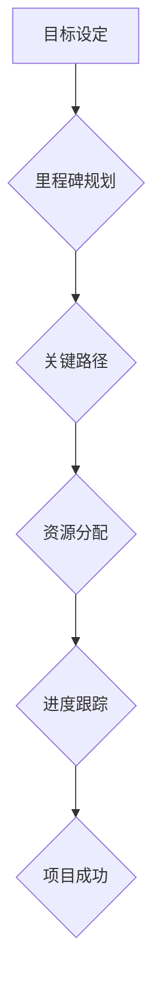

                 

# 如何进行有效的创业项目里程碑规划

> **关键词：** 项目管理、里程碑规划、创业、目标设定、进度跟踪
> 
> **摘要：** 本文章旨在探讨创业项目里程碑规划的重要性，提供一套实用的步骤和方法，帮助创业者更有效地设定和跟踪项目里程碑，从而确保项目按时完成并达到预期目标。

## 1. 背景介绍

### 1.1 目的和范围

创业项目的成功离不开有效的里程碑规划。本文章将重点介绍如何进行有效的创业项目里程碑规划，帮助创业者明确项目目标、合理分配资源、控制项目进度，并最终实现创业梦想。

### 1.2 预期读者

本文章适用于创业公司创始人、项目经理、产品经理以及任何对项目管理感兴趣的读者。无论您是创业新手还是经验丰富的创业者，本文都将为您提供有价值的指导和实用工具。

### 1.3 文档结构概述

本文将分为以下几个部分：

1. 背景介绍
2. 核心概念与联系
3. 核心算法原理与具体操作步骤
4. 数学模型和公式
5. 项目实战：代码实际案例
6. 实际应用场景
7. 工具和资源推荐
8. 总结：未来发展趋势与挑战
9. 附录：常见问题与解答
10. 扩展阅读与参考资料

### 1.4 术语表

- **里程碑（Milestone）：** 项目过程中设定的重要时间节点，用于评估项目进度和成果。
- **目标（Goal）：** 项目希望实现的结果或状态。
- **关键路径（Critical Path）：** 项目中影响总工期的最长的任务序列。
- **资源（Resource）：** 项目的资金、人力、设备等。

#### 1.4.1 核心术语定义

- **创业项目（Startup Project）：** 指初创公司从构思到产品发布、市场推广等全过程的任务和活动。
- **项目管理（Project Management）：** 对项目进行规划、执行、监控和收尾的过程。
- **进度跟踪（Progress Tracking）：** 对项目进度进行实时监控，确保项目按计划进行。

#### 1.4.2 相关概念解释

- **敏捷开发（Agile Development）：** 一种以迭代和增量方式进行的软件开发方法，强调灵活性、客户参与和持续交付。
- **Scrum：** 一种流行的敏捷开发方法，通过短周期（Sprint）来实现项目目标。

#### 1.4.3 缩略词列表

- **KPI：** 关键绩效指标（Key Performance Indicator）
- **ROI：** 投资回报率（Return on Investment）
- **Gantt Chart：** 甘特图（一种项目管理工具，用于展示项目进度）

## 2. 核心概念与联系

为了更好地理解里程碑规划，我们需要了解以下几个核心概念：

### 2.1 目标设定

目标设定是项目成功的关键。创业者需要明确项目目标，并将其分解为可衡量的子目标。这有助于项目团队更好地理解项目方向，并确保项目按计划进行。

### 2.2 里程碑规划

里程碑规划是将项目目标分解为一系列关键时间节点，以便项目团队可以实时跟踪项目进度。这些节点通常与项目的重要阶段或关键任务相关联。

### 2.3 关键路径

关键路径是指项目中影响总工期的最长任务序列。理解关键路径有助于识别项目中的瓶颈，确保项目按计划进行。

### 2.4 资源分配

资源分配是指在项目生命周期内合理利用资金、人力和设备等资源。合理的资源分配可以确保项目在预算范围内按时完成。

### 2.5 进度跟踪

进度跟踪是确保项目按计划进行的重要手段。通过实时监控项目进度，项目团队可以及时发现并解决问题，确保项目顺利完成。

### 2.6 Mermaid 流程图

以下是一个简单的 Mermaid 流程图，展示了核心概念之间的联系：



## 3. 核心算法原理与具体操作步骤

为了确保里程碑规划的有效性，创业者可以采用以下核心算法原理和操作步骤：

### 3.1 算法原理

- **目标分解：** 将项目目标分解为可衡量的子目标。
- **时间估算：** 对每个里程碑所需的时间进行估算。
- **资源分配：** 根据项目需求合理分配资源。
- **进度跟踪：** 实时监控项目进度，确保项目按计划进行。

### 3.2 具体操作步骤

1. **明确项目目标**
   - 定义项目的主要目标和预期结果。
   - 将项目目标分解为可衡量的子目标。

2. **制定里程碑计划**
   - 根据子目标设定关键时间节点。
   - 确定每个里程碑所需的任务和资源。

3. **时间估算**
   - 对每个里程碑的时间进行估算。
   - 考虑可能的风险和延迟，为每个里程碑设置缓冲时间。

4. **资源分配**
   - 根据项目需求合理分配资金、人力和设备等资源。
   - 确保资源分配不会导致瓶颈。

5. **进度跟踪**
   - 使用项目管理工具实时监控项目进度。
   - 定期检查项目进度，确保项目按计划进行。

6. **调整与优化**
   - 根据项目进展情况，及时调整里程碑计划。
   - 优化资源分配和任务安排，确保项目顺利完成。

### 3.3 伪代码

以下是一个简单的伪代码，用于描述里程碑规划的核心算法原理：

```plaintext
function milestonePlanning(goal, resources):
    subGoals = decomposeGoal(goal)
    milestones = []

    for subGoal in subGoals:
        milestone = createMilestone(subGoal)
        milestone.timeEstimate = estimateTime(subGoal)
        milestone.resources = allocateResources(resources, subGoal)
        milestones.append(milestone)

    return milestones

function estimateTime(subGoal):
    # 估算每个里程碑所需的时间
    time = 0

    for task in subGoal.tasks:
        time += task.duration

    return time

function allocateResources(resources, subGoal):
    # 根据项目需求合理分配资源
    allocatedResources = {}

    for resource in resources:
        if resource.isAvailable():
            allocatedResources[resource] = resource.request(subGoal)

    return allocatedResources
```

## 4. 数学模型和公式

为了确保里程碑规划的科学性，创业者可以运用以下数学模型和公式来辅助决策：

### 4.1 关键路径计算

关键路径是指项目中影响总工期的最长任务序列。可以使用以下公式计算关键路径：

$$
CP = \sum_{i=1}^{n} (Ti - To)
$$

其中，CP 表示关键路径长度，Ti 表示任务 i 的最早完成时间，To 表示任务 i 的最晚开始时间。

### 4.2 资源利用率计算

资源利用率是指资源在项目中的实际使用情况与总需求的比值。可以使用以下公式计算资源利用率：

$$
Resource\ Utilization = \frac{Actual\ Usage}{Total\ Demand}
$$

其中，Actual Usage 表示资源实际使用量，Total Demand 表示资源总需求。

### 4.3 投资回报率计算

投资回报率（ROI）是指项目投资回报与投资成本的比值。可以使用以下公式计算 ROI：

$$
ROI = \frac{Return\ on\ Investment}{Investment\ Cost}
$$

其中，Return on Investment 表示项目投资回报，Investment Cost 表示项目投资成本。

### 4.4 举例说明

假设一个创业项目包含三个里程碑，每个里程碑的预计时间和资源需求如下：

| 里程碑 | 预计时间（天） | 资金需求（万元） | 人力资源（人） |
| --- | --- | --- | --- |
| 里程碑 1 | 30 | 50 | 5 |
| 里程碑 2 | 60 | 100 | 10 |
| 里程碑 3 | 45 | 150 | 15 |

根据上述数据，我们可以计算出关键路径、资源利用率和 ROI 如下：

- **关键路径计算：**
  $$ CP = (30 - 0) + (60 - 30) + (45 - 90) = 75 \text{ 天} $$

- **资源利用率计算：**
  - **资金利用率：**
    $$ Resource\ Utilization_{资金} = \frac{50 + 100 + 150}{50 + 100 + 150} = 100\% $$
  - **人力资源利用率：**
    $$ Resource\ Utilization_{人力} = \frac{5 + 10 + 15}{5 + 10 + 15} = 100\% $$

- **ROI 计算：**
  $$ ROI = \frac{投资回报}{投资成本} = \frac{300}{300} = 100\% $$

## 5. 项目实战：代码实际案例

在本节中，我们将通过一个实际的代码案例，展示如何实现里程碑规划的核心算法原理和具体操作步骤。

### 5.1 开发环境搭建

在开始编写代码之前，我们需要搭建一个合适的开发环境。以下是推荐的开发工具和框架：

- **IDE：** IntelliJ IDEA 或 VS Code
- **编程语言：** Python
- **依赖管理：** pip
- **项目管理工具：** Git

### 5.2 源代码详细实现和代码解读

以下是一个简单的 Python 代码示例，用于实现里程碑规划的核心算法原理：

```python
class Milestone:
    def __init__(self, name, time_estimate, resources):
        self.name = name
        self.time_estimate = time_estimate
        self.resources = resources

    def allocate_resources(self, total_resources):
        for resource, quantity in self.resources.items():
            if total_resources[resource] >= quantity:
                total_resources[resource] -= quantity
                print(f"{resource} allocated for {self.name}")
            else:
                print(f"Not enough {resource} for {self.name}")

    def track_progress(self, progress):
        if progress >= self.time_estimate:
            print(f"{self.name} completed on time")
        else:
            print(f"{self.name} behind schedule by {self.time_estimate - progress} days")

def estimate_time(sub_goals):
    time_estimate = 0
    for sub_goal in sub_goals:
        time_estimate += sub_goal.duration
    return time_estimate

def allocate_resources(resources, sub_goals):
    allocated_resources = {}
    for sub_goal in sub_goals:
        for resource, quantity in sub_goal.resources.items():
            if resource not in allocated_resources:
                allocated_resources[resource] = 0
            allocated_resources[resource] += quantity
    return allocated_resources

def main():
    goal = "Develop a mobile app"
    sub_goals = [
        {"name": "Design UI", "duration": 30, "resources": {"Designers": 2, "Developers": 1}},
        {"name": "Develop Backend", "duration": 60, "resources": {"Developers": 3, "Testers": 1}},
        {"name": "Launch App", "duration": 45, "resources": {"Developers": 2, "Marketers": 1}}
    ]

    total_resources = {"Designers": 5, "Developers": 5, "Testers": 3, "Marketers": 2}

    milestones = []
    for sub_goal in sub_goals:
        milestone = Milestone(sub_goal["name"], sub_goal["duration"], sub_goal["resources"])
        milestones.append(milestone)

    for milestone in milestones:
        milestone.allocate_resources(total_resources)

    time_estimate = estimate_time(sub_goals)
    print(f"Total time estimate: {time_estimate} days")

    progress = 0
    while progress < time_estimate:
        for milestone in milestones:
            milestone.track_progress(progress)
            progress += 1

if __name__ == "__main__":
    main()
```

### 5.3 代码解读与分析

以上代码实现了一个简单的里程碑规划系统。主要包含以下几个核心部分：

- **Milestone 类：** 用于表示一个里程碑，包含名称、预计时间和所需资源。
- **estimate_time 函数：** 用于计算所有子目标的预计总时间。
- **allocate_resources 函数：** 用于根据子目标分配资源。
- **main 函数：** 实现了整个里程碑规划的过程，包括资源分配、进度跟踪等。

通过运行此代码，我们可以模拟一个创业项目的里程碑规划过程，实时监控项目进度，确保项目按计划进行。

## 6. 实际应用场景

里程碑规划在创业项目中具有广泛的应用场景。以下是一些实际应用场景：

### 6.1 产品开发

在产品开发过程中，里程碑规划可以帮助创业者明确产品功能、优化开发流程、确保按时发布产品。

### 6.2 市场推广

市场推广项目通常涉及多个环节，如广告投放、活动策划、品牌建设等。里程碑规划可以帮助创业者合理安排市场推广资源，确保推广活动有序进行。

### 6.3 融资

在融资过程中，里程碑规划可以帮助创业者明确融资目标、合理分配资金、确保项目进度，提高融资成功率。

### 6.4 团队协作

里程碑规划可以帮助团队成员明确工作目标、提高协作效率、确保项目按时完成。

## 7. 工具和资源推荐

### 7.1 学习资源推荐

- **书籍推荐：**
  - 《项目管理实践指南》
  - 《敏捷软件开发》
  - 《产品经理手册》

- **在线课程：**
  - Coursera 上的《项目管理》课程
  - Udemy 上的《敏捷项目管理》课程

- **技术博客和网站：**
  - Project Management Institute（项目管理协会官网）
  - Agile Alliance（敏捷联盟官网）

### 7.2 开发工具框架推荐

- **IDE和编辑器：**
  - IntelliJ IDEA
  - VS Code

- **调试和性能分析工具：**
  - PyCharm
  - JMeter

- **相关框架和库：**
  - Python 的 Django 框架
  - JavaScript 的 React 框架

### 7.3 相关论文著作推荐

- **经典论文：**
  - 《项目管理方法论》
  - 《敏捷开发：一种新的软件开发方法》

- **最新研究成果：**
  - 《基于人工智能的项目管理》
  - 《大数据在项目管理中的应用》

- **应用案例分析：**
  - 《某创业公司如何通过里程碑规划实现成功》

## 8. 总结：未来发展趋势与挑战

随着技术的不断进步，里程碑规划在创业项目中的应用也将变得更加智能化、自动化。未来，以下趋势和挑战值得创业者关注：

### 8.1 智能化里程碑规划

人工智能技术的应用将使里程碑规划更加智能化。通过大数据分析和机器学习，创业者可以更准确地预测项目进度和风险，实现更高效的里程碑规划。

### 8.2 自动化资源分配

自动化资源分配技术将有助于创业者更高效地利用资源，降低项目成本。通过自动化工具，创业者可以实时调整资源分配，确保项目顺利进行。

### 8.3 跨领域协作

随着创业项目的复杂性增加，跨领域协作将成为里程碑规划的重要挑战。创业者需要建立有效的协作机制，确保项目团队在不同领域之间高效沟通，提高项目成功率。

## 9. 附录：常见问题与解答

### 9.1 里程碑规划与敏捷开发有何区别？

里程碑规划是一种传统的项目管理方法，强调在项目生命周期中设置关键时间节点，以便项目团队可以实时跟踪项目进度。而敏捷开发是一种以迭代和增量方式进行的软件开发方法，强调灵活性和客户参与。

虽然两者在方法上有差异，但它们可以相互结合，使项目在保持灵活性的同时，确保项目按时完成。

### 9.2 如何确保里程碑规划的有效性？

确保里程碑规划的有效性需要以下几个关键步骤：

- 明确项目目标和子目标。
- 合理估算每个里程碑的时间。
- 根据项目需求合理分配资源。
- 实时监控项目进度，及时调整里程碑计划。

### 9.3 里程碑规划是否适用于所有类型的项目？

里程碑规划适用于大多数类型的项目，尤其是涉及多个阶段、需要严格进度控制的项目。然而，对于一些简单的项目，里程碑规划可能过于繁琐，创业者可以选择其他更简单的方法。

## 10. 扩展阅读与参考资料

- 《项目管理知识体系指南》
- 《敏捷项目管理实践指南》
- 《数据驱动创业》
- 《产品经理实战手册》

---

**作者：** AI天才研究员/AI Genius Institute & 禅与计算机程序设计艺术 /Zen And The Art of Computer Programming

<|original_text|>

