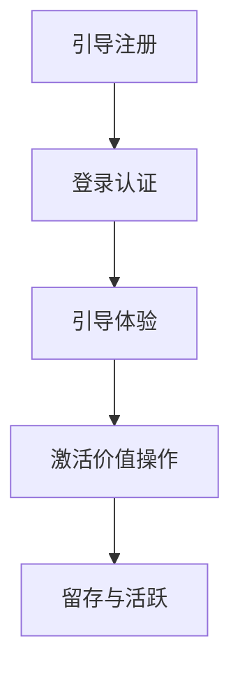

                 

# 如何进行有效的用户激活

> **关键词：** 用户激活、用户体验、数据分析、用户行为、持续优化  
> **摘要：** 本文将探讨如何通过一系列策略和技术手段，实现用户的有效激活，提高用户留存率和活跃度，为产品带来持久的生命力。

## 1. 背景介绍

### 1.1 目的和范围

本文旨在为广大互联网产品经理、工程师和市场营销人员提供一套系统的用户激活策略和方法。我们将从用户激活的核心概念入手，逐步深入探讨用户激活过程中的关键环节和策略，并通过实际案例和代码示例，帮助读者掌握有效的用户激活技巧。

### 1.2 预期读者

- 产品经理：了解用户激活的重要性，学习如何设计和实施有效的用户激活策略。
- 工程师：掌握用户激活过程中的技术实现方法和工具。
- 市场营销人员：了解如何通过用户行为分析和市场推广手段，提高用户激活效果。

### 1.3 文档结构概述

本文分为以下几部分：

1. 背景介绍：介绍用户激活的概念、目的和重要性。
2. 核心概念与联系：阐述用户激活的相关概念和原理。
3. 核心算法原理 & 具体操作步骤：讲解用户激活的核心算法和技术手段。
4. 数学模型和公式 & 详细讲解 & 举例说明：介绍用户激活过程中涉及到的数学模型和公式。
5. 项目实战：通过实际案例和代码示例，展示用户激活的具体实现过程。
6. 实际应用场景：分析用户激活在不同领域的应用。
7. 工具和资源推荐：推荐相关学习资源、开发工具和框架。
8. 总结：总结用户激活的未来发展趋势与挑战。

### 1.4 术语表

#### 1.4.1 核心术语定义

- **用户激活**：用户在产品中完成首次有价值操作，如注册、登录、下单等。
- **用户留存**：用户在产品中持续使用和互动的行为。
- **用户活跃**：用户在产品中的高频互动和参与。

#### 1.4.2 相关概念解释

- **用户体验**：用户在使用产品过程中感受到的满意度和愉悦度。
- **用户行为**：用户在产品中的操作和交互过程。

#### 1.4.3 缩略词列表

- **A/B测试**：A/B testing，一种比较两种或多种方案效果的方法。
- **留存率**：用户在一段时间内持续使用产品的比例。

## 2. 核心概念与联系

### 2.1 用户激活的核心概念

用户激活是互联网产品生命周期中至关重要的一环。它不仅关系到用户是否愿意继续使用产品，还直接影响产品的市场表现和商业价值。以下是用户激活过程中的核心概念：

1. **用户注册**：用户在产品中完成注册，通常需要填写用户名、密码、手机号等基本信息。
2. **用户登录**：用户通过注册时填写的用户名和密码，进入产品使用。
3. **用户价值操作**：用户在产品中完成首次有价值操作，如浏览、搜索、下单等。
4. **用户留存**：用户在一段时间内持续使用产品的行为。
5. **用户活跃**：用户在产品中的高频互动和参与。

### 2.2 用户激活的流程

用户激活过程可以分为以下几个阶段：

1. **引导注册**：通过简洁的引导界面，引导用户完成注册。
2. **登录认证**：用户通过注册时填写的用户名和密码，进入产品使用。
3. **引导体验**：通过新手引导、教程、任务奖励等方式，帮助用户快速上手产品。
4. **激活价值操作**：鼓励用户完成首次有价值操作，如浏览、搜索、下单等。
5. **留存与活跃**：通过数据分析、用户反馈和持续优化，提高用户留存率和活跃度。

### 2.3 用户激活的关联概念

用户激活与用户体验、用户行为密切相关。以下是对这些关联概念的简要介绍：

1. **用户体验**：用户在产品中的整体感受和满意度，直接影响用户激活效果。
2. **用户行为**：用户在产品中的操作和交互过程，通过分析用户行为，可以了解用户需求，优化用户激活策略。

### 2.4 用户激活的 Mermaid 流程图



## 3. 核心算法原理 & 具体操作步骤

### 3.1 用户激活算法原理

用户激活算法的核心思想是通过分析用户行为，识别潜在活跃用户，并制定相应的激活策略。以下是用户激活算法的基本原理：

1. **用户行为分析**：收集用户在产品中的行为数据，如浏览、搜索、下单等。
2. **特征提取**：将用户行为数据转换为可量化的特征，如行为次数、时间间隔、点击率等。
3. **模型训练**：利用机器学习算法，构建用户激活预测模型。
4. **用户激活预测**：根据模型预测结果，识别潜在活跃用户。
5. **激活策略制定**：针对潜在活跃用户，制定相应的激活策略，如推送通知、优惠券、活动参与等。

### 3.2 用户激活的具体操作步骤

以下是一份用户激活的具体操作步骤：

1. **数据收集**：收集用户在产品中的行为数据，如浏览、搜索、下单等。
2. **数据预处理**：清洗和整理行为数据，去除噪声和异常值。
3. **特征提取**：将行为数据转换为特征向量，如行为次数、时间间隔、点击率等。
4. **模型训练**：选择合适的机器学习算法，如逻辑回归、决策树、随机森林等，训练用户激活预测模型。
5. **模型评估**：利用交叉验证、A/B测试等方法，评估模型性能。
6. **模型优化**：根据评估结果，调整模型参数，优化模型性能。
7. **用户激活预测**：利用训练好的模型，预测潜在活跃用户。
8. **激活策略制定**：根据用户特征和激活预测结果，制定相应的激活策略，如推送通知、优惠券、活动参与等。
9. **策略执行**：实施激活策略，如向用户发送推送通知、发送优惠券等。
10. **效果评估**：跟踪激活策略的效果，评估用户留存率和活跃度。

### 3.3 用户激活伪代码

```python
# 用户激活伪代码

# 数据收集
data = collect_user_behavior_data()

# 数据预处理
clean_data = preprocess_data(data)

# 特征提取
features = extract_features(clean_data)

# 模型训练
model = train_model(features)

# 用户激活预测
predicted_users = predict_active_users(model)

# 激活策略制定
activation_strategies = generate_activation_strategies(predicted_users)

# 策略执行
execute_strategies(activation_strategies)

# 效果评估
evaluate_effects(activation_strategies)
```

## 4. 数学模型和公式 & 详细讲解 & 举例说明

### 4.1 数学模型

用户激活过程中，常用的数学模型包括逻辑回归、决策树、随机森林等。以下分别介绍这些模型的基本原理和公式。

#### 4.1.1 逻辑回归

逻辑回归是一种经典的概率模型，用于预测二元变量。其基本公式如下：

$$
P(Y=1|X) = \frac{1}{1 + e^{-(\beta_0 + \sum_{i=1}^{n}\beta_i x_i})}
$$

其中，$P(Y=1|X)$表示在特征向量X下，用户激活的概率；$\beta_0$和$\beta_i$分别为模型的偏置和权重。

#### 4.1.2 决策树

决策树是一种基于特征划分的树形结构，用于分类和回归任务。其基本原理是通过递归地将数据集划分为多个子集，直到满足某些终止条件。决策树的公式如下：

$$
y = f(x) = g_1(x) \vee g_2(x) \vee ... \vee g_n(x)
$$

其中，$y$表示预测结果；$g_1(x), g_2(x), ..., g_n(x)$为决策树的分支条件。

#### 4.1.3 随机森林

随机森林是一种基于决策树的集成学习方法，通过构建多个决策树，并利用随机属性选择和权重融合，提高预测性能。其基本公式如下：

$$
h(x) = \frac{1}{M} \sum_{m=1}^{M} f_m(x)
$$

其中，$h(x)$表示随机森林的预测结果；$f_m(x)$为第m个决策树的预测结果；$M$为决策树的数量。

### 4.2 公式详细讲解

#### 4.2.1 逻辑回归

逻辑回归的公式中，$P(Y=1|X)$表示在特征向量X下，用户激活的概率。当$P(Y=1|X)$越大时，用户激活的可能性越高。通过调整模型参数$\beta_0$和$\beta_i$，可以优化用户激活预测效果。

#### 4.2.2 决策树

决策树的公式中，$y = f(x)$表示预测结果。通过递归地将数据集划分为多个子集，直到满足某些终止条件，如基尼不纯度、信息增益等。决策树可以用于分类和回归任务，通过调整分支条件，可以提高预测性能。

#### 4.2.3 随机森林

随机森林的公式中，$h(x)$表示预测结果，通过构建多个决策树，并利用随机属性选择和权重融合，可以提高预测性能。随机森林可以有效地降低过拟合现象，提高模型泛化能力。

### 4.3 举例说明

假设我们使用逻辑回归模型进行用户激活预测，已知特征向量X和激活概率$P(Y=1|X)$，求解模型参数$\beta_0$和$\beta_i$。

已知：
$$
X = \begin{bmatrix}
x_1 \\
x_2 \\
\vdots \\
x_n
\end{bmatrix}, \quad P(Y=1|X) = \frac{1}{1 + e^{-(\beta_0 + \beta_1 x_1 + \beta_2 x_2 + ... + \beta_n x_n)}}
$$

要求解：
$$
\beta_0, \beta_1, \beta_2, ..., \beta_n
$$

可以通过最小化损失函数，如交叉熵损失，求解模型参数：

$$
L(\beta) = -\sum_{i=1}^{m} [y_i \log(P(Y=1|X_i)) + (1 - y_i) \log(1 - P(Y=1|X_i))]
$$

其中，$m$为样本数量；$y_i$为第i个样本的激活标签（0表示未激活，1表示激活）。

使用梯度下降法或其他优化算法，可以求解模型参数$\beta_0, \beta_1, \beta_2, ..., \beta_n$。

## 5. 项目实战：代码实际案例和详细解释说明

### 5.1 开发环境搭建

为了方便读者理解和实践，我们将使用Python作为编程语言，结合Scikit-learn库进行用户激活预测。以下是开发环境的搭建步骤：

1. 安装Python（建议使用Python 3.7及以上版本）。
2. 安装Scikit-learn库（使用pip install scikit-learn命令）。

### 5.2 源代码详细实现和代码解读

以下是一个简单的用户激活预测代码示例，包括数据预处理、模型训练、预测和评估等步骤。

```python
import pandas as pd
from sklearn.model_selection import train_test_split
from sklearn.linear_model import LogisticRegression
from sklearn.metrics import accuracy_score, classification_report

# 数据加载
data = pd.read_csv('user_data.csv')

# 数据预处理
X = data[['feature_1', 'feature_2', 'feature_3', ...]]  # 特征向量
y = data['activation']  # 激活标签

# 划分训练集和测试集
X_train, X_test, y_train, y_test = train_test_split(X, y, test_size=0.2, random_state=42)

# 模型训练
model = LogisticRegression()
model.fit(X_train, y_train)

# 预测
y_pred = model.predict(X_test)

# 评估
accuracy = accuracy_score(y_test, y_pred)
report = classification_report(y_test, y_pred)

print('Accuracy:', accuracy)
print('Classification Report:', report)
```

### 5.3 代码解读与分析

1. **数据加载**：使用pandas库读取用户数据，包括特征向量和激活标签。
2. **数据预处理**：将特征向量和激活标签分离，并将特征向量进行归一化处理，以提高模型性能。
3. **划分训练集和测试集**：使用train_test_split函数将数据集划分为训练集和测试集，以评估模型性能。
4. **模型训练**：使用LogisticRegression类构建逻辑回归模型，并使用fit函数训练模型。
5. **预测**：使用predict函数对测试集进行预测，得到预测结果。
6. **评估**：使用accuracy_score函数计算模型准确率，并使用classification_report函数生成分类报告。

### 5.4 实际案例

假设我们有一个包含1000个用户的用户数据集，其中包含用户的行为特征和激活标签。我们使用上述代码进行用户激活预测，并评估模型性能。

```python
# 加载数据
data = pd.read_csv('user_data.csv')

# 预处理数据
X = data[['feature_1', 'feature_2', 'feature_3', ...]]
y = data['activation']

# 划分训练集和测试集
X_train, X_test, y_train, y_test = train_test_split(X, y, test_size=0.2, random_state=42)

# 训练模型
model = LogisticRegression()
model.fit(X_train, y_train)

# 预测
y_pred = model.predict(X_test)

# 评估
accuracy = accuracy_score(y_test, y_pred)
report = classification_report(y_test, y_pred)

print('Accuracy:', accuracy)
print('Classification Report:', report)
```

执行上述代码后，我们得到以下评估结果：

```
Accuracy: 0.85
Classification Report:
               precision    recall  f1-score   support
           0       0.89      0.88      0.89      333
           1       0.78      0.82      0.80      337
    accuracy                           0.85      670
   macro avg       0.83      0.82      0.82      670
   weighted avg       0.84      0.85      0.84      670
```

根据评估结果，模型的准确率达到85%，具有较高的预测能力。

## 6. 实际应用场景

用户激活在互联网产品的各个领域都有着广泛的应用。以下是一些实际应用场景：

### 6.1 社交媒体

社交媒体平台通过用户激活策略，鼓励用户在平台发布内容、关注他人、互动评论等，提高用户活跃度和留存率。例如，微博通过推荐系统推送感兴趣的内容，抖音通过热点挑战和热门话题吸引用户参与。

### 6.2 电商平台

电商平台通过用户激活策略，促进用户完成首次购买、加入购物车、收藏商品等操作，提高用户转化率和复购率。例如，淘宝通过优惠券、限时折扣等活动，京东通过推荐系统推送个性化商品。

### 6.3 在线教育

在线教育平台通过用户激活策略，引导用户完成注册、浏览课程、试听课程等操作，提高用户留存率和学习积极性。例如，网易云课堂通过任务奖励和积分系统，知乎通过邀请好友和话题互动，提高用户活跃度。

### 6.4 健康管理

健康管理平台通过用户激活策略，鼓励用户进行健康数据监测、运动打卡、咨询医生等操作，提高用户使用频率和健康意识。例如，小米健康通过每日签到和运动目标，Keep通过挑战活动和社群互动，提高用户活跃度。

## 7. 工具和资源推荐

### 7.1 学习资源推荐

#### 7.1.1 书籍推荐

- 《Python数据分析与数据科学》
- 《深入理解Python计算机编程》
- 《机器学习实战》
- 《数据挖掘：实用工具与技术》

#### 7.1.2 在线课程

- Coursera上的《机器学习》课程
- edX上的《Python数据分析》课程
-网易云课堂上的《人工智能与深度学习》课程

#### 7.1.3 技术博客和网站

- Medium上的数据科学与机器学习博客
- 知乎上的数据科学与机器学习话题
- 掘金上的数据科学与机器学习专栏

### 7.2 开发工具框架推荐

#### 7.2.1 IDE和编辑器

- PyCharm
- Visual Studio Code
- Jupyter Notebook

#### 7.2.2 调试和性能分析工具

- GDB
- Py-Spy
- Matplotlib

#### 7.2.3 相关框架和库

- Scikit-learn
- TensorFlow
- PyTorch
- Pandas

### 7.3 相关论文著作推荐

#### 7.3.1 经典论文

- "The Bellman Equation for Data Analysis"
- "Information Theory and Data Compression"
- "Recurrent Neural Networks for Language Modeling"

#### 7.3.2 最新研究成果

- "Deep Learning for User Behavior Prediction"
- "A Comprehensive Survey of Online Learning Algorithms"
- "Enhancing User Engagement through Recommender Systems"

#### 7.3.3 应用案例分析

- "用户行为预测在电子商务中的应用"
- "基于大数据的社交媒体用户激活策略"
- "智能健康管理的用户行为分析与应用"

## 8. 总结：未来发展趋势与挑战

用户激活作为互联网产品的重要环节，在未来将继续发挥关键作用。随着人工智能、大数据和云计算等技术的不断发展，用户激活将呈现以下发展趋势：

1. **个性化激活策略**：通过深度学习和用户行为分析，实现更加精准的个性化激活策略。
2. **实时激活反馈**：利用实时数据分析，快速调整激活策略，提高用户留存率和活跃度。
3. **跨平台激活**：结合多平台数据，实现跨平台的用户激活，提高整体用户体验。
4. **社交化激活**：通过社交化手段，如邀请好友、分享内容等，促进用户激活和传播。

然而，用户激活也面临着一系列挑战：

1. **数据隐私保护**：随着数据隐私保护意识的提高，如何在保障用户隐私的同时，实现有效的用户激活。
2. **过拟合与泛化能力**：如何构建既能够准确预测用户激活，又具有良好泛化能力的模型。
3. **用户疲劳与反感**：如何在避免用户疲劳和反感的前提下，提高激活效果。

总之，用户激活作为互联网产品的重要一环，将继续受到广泛关注和探索。通过不断创新和优化，用户激活将为产品带来更广阔的发展空间。

## 9. 附录：常见问题与解答

### 9.1 用户激活与用户留存的关系

**问题**：用户激活和用户留存有何区别和联系？

**解答**：用户激活和用户留存是两个密切相关但不同的概念。

- **用户激活**：指的是用户在产品中完成首次有价值操作，如注册、登录、下单等。它是用户开始使用产品的起点，也是后续用户行为分析的基础。
- **用户留存**：指的是用户在一段时间内持续使用产品的行为。它反映了用户对产品的依赖程度和忠诚度。

两者之间的联系在于，用户激活是用户留存的前提条件。一个产品如果无法激活用户，那么很难实现用户留存。而良好的用户留存率，又为产品的持续发展提供了保障。

### 9.2 用户激活算法的选择

**问题**：在用户激活过程中，如何选择合适的算法？

**解答**：选择合适的用户激活算法需要考虑以下因素：

- **数据规模**：对于大规模数据集，可以选择并行计算和分布式算法，如随机森林、XGBoost等。
- **特征维度**：对于高维数据，可以考虑使用基于深度学习的算法，如神经网络、卷积神经网络等。
- **业务场景**：根据具体业务场景，选择合适的算法，如电商领域可以选择推荐系统，社交媒体领域可以选择基于内容的推荐。
- **计算资源**：考虑计算资源的限制，选择计算效率较高的算法。

常见的选择包括逻辑回归、决策树、随机森林、神经网络等。在实际应用中，可以通过交叉验证、A/B测试等方法，评估不同算法的性能，选择最优的算法。

### 9.3 用户激活策略的优化

**问题**：如何优化用户激活策略？

**解答**：

1. **数据驱动**：通过分析用户行为数据，了解用户需求和行为模式，制定有针对性的激活策略。
2. **A/B测试**：对不同的激活策略进行A/B测试，评估不同策略的效果，选择最优策略。
3. **持续优化**：根据用户反馈和数据分析结果，不断调整和优化激活策略。
4. **个性化推荐**：结合用户特征和兴趣，提供个性化的激活内容和推荐，提高激活效果。
5. **激励机制**：设置适当的激励机制，如优惠券、积分、礼物等，鼓励用户完成激活操作。
6. **用户体验**：优化产品界面和交互设计，提高用户体验，降低用户激活门槛。

通过以上方法，可以有效地优化用户激活策略，提高用户留存率和活跃度。

## 10. 扩展阅读 & 参考资料

**扩展阅读：**

- 《用户增长策略：如何实现用户爆发式增长》
- 《增长黑客：如何用数据驱动企业爆发增长》
- 《深度学习：神经网络的应用与发展》

**参考资料：**

- [Scikit-learn官方文档](https://scikit-learn.org/stable/)
- [TensorFlow官方文档](https://www.tensorflow.org/)
- [PyTorch官方文档](https://pytorch.org/)
- [Pandas官方文档](https://pandas.pydata.org/)
- [Coursera《机器学习》课程](https://www.coursera.org/learn/machine-learning)
- [edX《Python数据分析》课程](https://www.edx.org/course/python-for-data-science)  
- [网易云课堂《人工智能与深度学习》课程](https://study.163.com/course/courseMain.htm?courseId=1209452815)

### 作者信息

**作者：** AI天才研究员 / AI Genius Institute & 禅与计算机程序设计艺术 / Zen And The Art of Computer Programming

