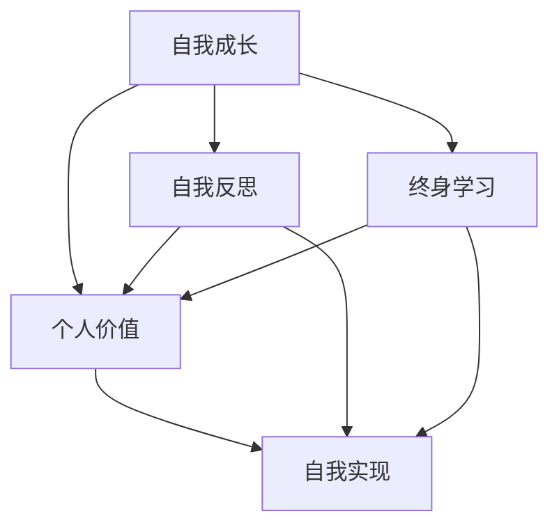

                 

### 1. 背景介绍

#### 1.1 目的和范围

在当今社会，个人成长与自我实现已成为越来越多人的追求。本文旨在探讨如何进行自我成长，实现个人价值和自我实现，为读者提供一套系统的、可操作的策略和方法。通过本文的阅读，您将了解到：

- 自我成长的重要性以及它与个人价值和自我实现的关系。
- 自我成长的核心概念和理论基础。
- 自我成长的具体操作步骤和方法。
- 如何在个人和职业生活中实现自我价值的最大化。
- 如何进行有效的自我评估和反馈，以持续优化个人成长路径。

本文涵盖的范围包括：

- 自我成长的基础理论。
- 自我成长的操作步骤和方法。
- 个人价值和自我实现的实现策略。
- 自我评估和反馈的具体实践。
- 成长过程中的常见问题和挑战。

#### 1.2 预期读者

本文适合以下几类读者：

- 对个人成长和自我实现有兴趣的普通读者。
- 需要在工作和生活中提升自我能力的职场人士。
- 从事教育、咨询等领域的专业人士。
- 对心理学、哲学等领域感兴趣的学者和研究者。

无论您属于哪一类读者，本文都将为您提供有价值的见解和实用的建议。

#### 1.3 文档结构概述

本文分为十个部分，具体结构如下：

- **1. 背景介绍**：介绍文章的目的、范围、预期读者和文档结构。
- **2. 核心概念与联系**：阐述自我成长、个人价值和自我实现的核心概念和相互关系。
- **3. 核心算法原理 & 具体操作步骤**：详细讲解实现自我成长的核心算法原理和操作步骤。
- **4. 数学模型和公式 & 详细讲解 & 举例说明**：介绍自我成长的数学模型和公式，并进行详细讲解和举例说明。
- **5. 项目实战：代码实际案例和详细解释说明**：通过具体项目案例，展示如何在实际中应用自我成长的方法。
- **6. 实际应用场景**：分析自我成长在不同场景中的应用价值。
- **7. 工具和资源推荐**：推荐有助于自我成长的学习资源、开发工具和框架。
- **8. 总结：未来发展趋势与挑战**：总结本文的主要观点，并探讨未来发展趋势和挑战。
- **9. 附录：常见问题与解答**：回答读者可能遇到的常见问题。
- **10. 扩展阅读 & 参考资料**：提供进一步阅读和研究的参考资料。

通过本文的结构，您将能够系统地了解自我成长的过程和方法，从而更好地实现个人价值和自我实现。

#### 1.4 术语表

在本文中，我们使用了一些专业术语，以下是对这些术语的定义和解释：

##### 1.4.1 核心术语定义

- **自我成长**：指个人通过不断学习和实践，提高自身能力、素养和价值观的过程。
- **个人价值**：指个人在工作和生活中所体现的、他人和社会认可的价值。
- **自我实现**：指个人通过自我成长和实现，达到自身潜力最大化的状态。
- **自我评估**：指个人对自己能力、素质和表现的客观评价。
- **反馈**：指针对个人行为和结果的反馈信息，用于调整和优化个人成长路径。

##### 1.4.2 相关概念解释

- **心理学理论**：指用于解释人类行为和思维的心理学理论，如马斯洛的需求层次理论、认知行为理论等。
- **哲学思想**：指对人类存在、价值和生活意义的哲学思考，如存在主义、理性主义等。
- **学习方法**：指个人用于学习和掌握知识的方法，如主动学习、合作学习等。
- **职业生涯规划**：指个人对职业发展路径的规划和设计，包括职业目标、发展策略和实施计划等。

##### 1.4.3 缩略词列表

- **AI**：人工智能（Artificial Intelligence）
- **ML**：机器学习（Machine Learning）
- **DL**：深度学习（Deep Learning）
- **NLP**：自然语言处理（Natural Language Processing）
- **SD**：自我导向学习（Self-Directed Learning）

这些术语和概念在本文中将反复出现，有助于您更好地理解自我成长、个人价值和自我实现的核心思想和实践方法。在接下来的部分，我们将深入探讨这些概念，并为您提供详细的解释和案例分析。 <|im_sep|>## 2. 核心概念与联系

在本节中，我们将详细探讨自我成长、个人价值和自我实现这三个核心概念，并分析它们之间的相互关系。这些概念不仅贯穿了本文的主题，也是实现个人发展和职业成功的基石。

### 2.1 自我成长

自我成长是一个动态的、持续的过程，涉及个人的知识、技能、素养和价值观的提升。它不仅包括学习新知识和技能，还涉及个人认知、情感和行为的改变。

#### 自我成长的核心概念：

1. **终身学习**：自我成长的基础是终身学习，这意味着无论年龄、职位或领域，个人都应该持续学习新知识、技能和思维方式。
   
2. **自我反思**：通过自我反思，个人可以更好地理解自己的优点和不足，从而有针对性地进行改进。

3. **适应性**：自我成长需要具备适应变化的能力，包括适应新技术、新环境和新挑战。

4. **心理弹性**：面对困难和挫折时，能够快速恢复并继续前进，是自我成长的重要组成部分。

#### 自我成长的原理：

1. **学习理论**：如行为主义学习理论、认知学习理论等，这些理论解释了如何通过训练和反思来提升个人能力。

2. **心理学原理**：如自我决定理论、自我效能感理论等，这些理论揭示了个体如何通过自我激励和自我调节来实现自我成长。

### 2.2 个人价值

个人价值是个人在工作和生活中所体现的、他人和社会认可的价值。它包括专业能力、人际关系、道德品质等多个方面。

#### 个人价值的构成：

1. **专业技能**：个人在特定领域内的专业知识和技能，是个人价值的核心组成部分。

2. **人际关系**：建立和维护良好的人际关系，是个人在社会中实现自我价值的重要途径。

3. **道德品质**：如诚信、责任感、公正等，这些品质有助于提升个人的社会认可度。

#### 个人价值的实现：

1. **职业发展**：通过不断提升个人价值，个人可以在职业生涯中取得更好的成绩和职位。

2. **社会贡献**：通过工作和社会活动，个人可以将自己的价值转化为对社会和环境的积极影响。

### 2.3 自我实现

自我实现是个人通过自我成长和实现，达到自身潜力最大化的状态。它不仅包括个人成就，还包括个人内心的满足和幸福感。

#### 自我实现的层次：

1. **自我认知**：了解自己的兴趣、能力和价值观，是自我实现的前提。

2. **技能提升**：通过不断学习和实践，提升自己的技能和知识，是实现自我实现的关键。

3. **生活满意度**：自我实现不仅仅是在职业上的成功，还包括对生活的整体满意度。

#### 自我实现的实现策略：

1. **目标设定**：设定清晰的个人目标和计划，是实现自我实现的基础。

2. **时间管理**：合理安排时间，确保在重要任务和个人成长上投入足够的精力。

3. **自我激励**：保持积极的心态，通过自我激励和正面反馈，持续推动自我成长。

### 2.4 核心概念之间的联系

自我成长、个人价值和自我实现三者之间存在着紧密的联系：

- **相互促进**：自我成长是个人价值提升的基础，而个人价值的实现又进一步推动自我成长。

- **共同目标**：个人价值的实现和自我实现都是自我成长的目标，而自我成长是实现这两个目标的必经之路。

- **动态平衡**：在个人成长过程中，需要不断调整自我成长、个人价值和自我实现之间的关系，以实现动态平衡。

#### Mermaid 流程图：

为了更好地理解这三个核心概念之间的关系，我们使用 Mermaid 流程图进行可视化表示：



通过上述流程图，我们可以清晰地看到自我成长、个人价值和自我实现之间的互动关系。在接下来的部分，我们将进一步探讨如何通过核心算法原理和具体操作步骤，实现这些核心概念。 <|im_sep|>### 2.1 自我成长的核心概念

自我成长是一个复杂且多维的过程，涉及知识、技能、情感和认知等多个方面。为了深入理解自我成长，我们需要先了解其核心概念。

#### 2.1.1 终身学习

终身学习是自我成长的基础。在知识爆炸和技术迅速更新的时代，个人需要不断学习新知识、新技能，以适应不断变化的环境。终身学习不仅包括获取新知识，还包括对已有知识的深入理解和灵活应用。

**终身学习的原理：**

1. **行为主义学习理论**：通过重复和练习，可以加深对知识和技能的掌握。
   
2. **认知学习理论**：强调主动学习和理解性记忆，通过深入思考和理解，实现知识的内化和应用。

3. **建构主义学习理论**：认为学习是个人在已有知识和经验的基础上，主动构建知识体系的过程。

**终身学习的实践方法：**

1. **主动学习**：不仅仅是被动接受信息，而是通过提问、讨论和实践，主动探索和掌握新知识。

2. **深度学习**：不仅仅是学习表面知识，而是深入理解知识背后的原理和逻辑。

3. **跨学科学习**：通过跨学科的学习，可以拓宽视野，提高综合能力和创新能力。

#### 2.1.2 自我反思

自我反思是自我成长的重要环节，通过反思，个人可以更好地理解自己的行为、思维和情感，发现自身的问题和不足，从而进行改进。

**自我反思的原理：**

1. **自我决定理论**：认为个人有自主决策和自我控制的能力，通过自我反思，可以增强自我控制，实现自我成长。

2. **认知行为理论**：通过反思和认知重构，可以改变不健康的思维模式和行为习惯。

**自我反思的实践方法：**

1. **写日记**：通过写日记，可以记录自己的思想和感受，进行自我反思。

2. **冥想**：通过冥想，可以放松心灵，深入思考，发现内心的真实想法。

3. **定期回顾**：定期回顾自己的行为和结果，分析成功和失败的原因，进行反思。

#### 2.1.3 适应性

适应性是指个人在面对变化和挑战时，能够快速调整和适应，以实现个人目标和成长。在快速变化的环境中，适应性是个人成功的关键。

**适应性的原理：**

1. **生态心理学原理**：认为个体是环境的一部分，通过与环境的互动，实现适应和成长。

2. **变革管理理论**：在面对组织或环境的变化时，个人需要通过变革管理，实现适应和成长。

**适应性的实践方法：**

1. **灵活思维**：培养灵活的思维方式，能够从不同角度看待问题，找到适应的方法。

2. **持续学习**：通过不断学习新知识和技能，增强个人的适应能力。

3. **积极应对**：面对挑战和困难，保持积极的态度，通过努力和坚持，找到解决问题的方法。

#### 2.1.4 心理弹性

心理弹性是指个人在面对压力和挫折时，能够快速恢复并继续前进的能力。在成长过程中，难免会遇到各种挑战和困难，心理弹性是个人能够克服挫折，实现自我成长的关键。

**心理弹性的原理：**

1. **压力与应对理论**：认为压力是个体与环境相互作用的结果，通过有效的应对策略，可以减轻压力的影响。

2. **韧性理论**：认为个体具备一定的韧性，可以通过自我调节和适应，实现心理弹性。

**心理弹性的实践方法：**

1. **积极心态**：保持积极的心态，看到问题的另一面，找到积极的解决方案。

2. **自我调节**：通过自我调节，管理情绪和行为，实现心理平衡。

3. **寻求支持**：在遇到困难时，寻求家人、朋友或专业人士的支持和帮助。

通过上述核心概念的探讨，我们可以更好地理解自我成长的过程和机制。在接下来的部分，我们将深入分析个人价值和自我实现，以及它们与自我成长的关系。 <|im_sep|>### 2.2 个人价值的构成与实现

个人价值是个人在工作和生活中所体现的、他人和社会认可的价值。它不仅影响个人的职业发展，也关系到个人的社会地位和幸福感。个人价值的实现，需要在自我成长的基础上，通过专业技能、人际关系和道德品质等多个方面不断提升。

#### 2.2.1 专业技能

专业技能是个人价值的核心组成部分。它包括专业知识和技能，以及在实际工作中运用这些知识和技能的能力。

**专业技能的构成：**

1. **专业知识**：指在特定领域内所掌握的理论知识和概念。
   
2. **专业技能**：指在实际工作中运用的具体技能和操作方法。

3. **实践能力**：指将知识和技能应用到实际工作中的能力。

**提升专业技能的方法：**

1. **持续学习**：通过参加培训课程、阅读专业书籍、参加行业会议等方式，不断更新和扩展专业知识。

2. **实践锻炼**：通过实际工作、项目实践和实验，提升专业技能和操作能力。

3. **交流合作**：通过与同行和专家的交流合作，学习他们的经验和技巧，提高自己的专业水平。

#### 2.2.2 人际关系

人际关系是指个人在工作和生活中与他人的交往和互动。建立良好的人际关系，有助于个人在职业和生活中实现自我价值。

**人际关系的重要性：**

1. **合作与支持**：良好的人际关系可以带来合作机会和支持，帮助个人在工作中取得成功。

2. **社会资源**：通过人际关系，个人可以获取更多的社会资源，如信息、人脉和机会。

3. **个人成长**：与他人交流和互动，可以学习到不同的观点和经验，促进个人成长。

**维护人际关系的策略：**

1. **真诚交往**：以真诚的态度与他人交往，建立信任和尊重。

2. **主动沟通**：主动与他人沟通，保持联系，避免疏远。

3. **换位思考**：站在他人的角度思考问题，理解和尊重他人的需求和感受。

#### 2.2.3 道德品质

道德品质是指个人在行为和决策中体现的道德标准和价值观。良好的道德品质是个人价值的重要组成部分，也是社会对个人认可和尊重的依据。

**道德品质的构成：**

1. **诚信**：诚实守信，言行一致。

2. **责任感**：对自己的行为和决策负责，勇于承担责任。

3. **公正**：对待他人公平公正，不偏不倚。

4. **尊重**：尊重他人的权利和尊严，维护他人的利益。

**提升道德品质的方法：**

1. **学习道德理论**：通过学习道德理论和案例，理解道德原则和规范。

2. **实践道德行为**：在日常生活和工作中，践行道德原则，树立良好的道德形象。

3. **反思与自我批评**：定期反思自己的行为和决策，发现问题并自我批评，不断提高道德水平。

#### 2.2.4 个人价值的实现

个人价值的实现，需要通过专业技能、人际关系和道德品质等多方面的提升，实现个人在职业和社会中的价值。

**实现个人价值的策略：**

1. **目标设定**：明确个人职业和人生目标，制定实现目标的计划和策略。

2. **持续成长**：通过学习和实践，不断提升个人专业技能和素质。

3. **主动参与**：积极参与工作和社会活动，展示自己的价值和能力。

4. **积极影响**：通过工作和社会活动，积极影响他人和环境，实现个人价值的最大化。

通过上述探讨，我们可以看到个人价值是实现自我价值和自我实现的重要途径。在个人成长过程中，专业技能、人际关系和道德品质的不断提升，是实现个人价值的关键。在接下来的部分，我们将进一步探讨自我实现的概念和实现策略。 <|im_sep|>### 2.3 自我实现的层次与实现策略

自我实现是个人通过自我成长和努力，达到自身潜力最大化的状态。它不仅包括职业上的成功，还包括个人内心的满足和幸福感。自我实现可以分为三个层次：自我认知、技能提升和生活满意度。实现自我实现，需要明确目标、合理安排时间和保持积极心态。

#### 2.3.1 自我认知

自我认知是自我实现的第一个层次，它包括了解自己的兴趣、能力和价值观。只有清晰地认识自己，才能找到最适合自己的发展方向。

**自我认知的重要性：**

1. **明确目标**：通过自我认知，可以明确自己的职业和人生目标，制定具体的计划和策略。

2. **优化选择**：了解自己的兴趣和能力，可以更好地选择适合自己的工作和发展路径。

3. **提升自信**：自我认知有助于增强个人的自信心，提高自我效能感。

**自我认知的方法：**

1. **自我反思**：定期反思自己的行为、思维和情感，深入理解自己的内心世界。

2. **职业咨询**：通过专业的职业咨询，了解自己的职业倾向和能力。

3. **心理测试**：通过心理测试，如MBTI、DISC等，了解自己的性格特点和优势。

#### 2.3.2 技能提升

技能提升是自我实现的第二个层次，它包括提升专业技能、沟通能力和领导力等。在快速变化的社会中，技能的提升是个人持续发展和实现自我价值的关键。

**技能提升的策略：**

1. **持续学习**：通过参加培训课程、阅读专业书籍和参加行业会议，不断更新和扩展知识。

2. **实践锻炼**：通过实际工作、项目实践和实验，提高专业技能和操作能力。

3. **跨学科学习**：通过跨学科学习，拓宽视野，提高综合能力和创新能力。

#### 2.3.3 生活满意度

生活满意度是自我实现的最高层次，它包括对生活的整体满意度、幸福感和社会贡献。实现自我价值，不仅仅是在职业上的成功，还包括对生活的热爱和满足。

**提高生活满意度的策略：**

1. **目标设定**：明确个人的生活目标，包括职业、家庭、健康和社会贡献等。

2. **时间管理**：合理安排时间，确保在工作和个人生活之间取得平衡。

3. **积极心态**：保持积极的心态，看到问题的另一面，找到积极的解决方案。

4. **社会参与**：通过工作和社会活动，为社会做出贡献，实现个人价值。

#### 2.3.4 实现自我实现的策略

1. **明确目标**：通过自我认知，明确个人职业和人生目标，制定具体的计划和策略。

2. **持续学习**：通过持续学习，提升个人专业技能和素质。

3. **积极实践**：通过实际工作和社会活动，提高个人的综合素质和影响力。

4. **时间管理**：合理安排时间，确保在工作和个人生活之间取得平衡。

5. **积极心态**：保持积极的心态，面对挑战和困难，保持乐观和自信。

通过上述策略，个人可以逐步实现自我价值，达到自我实现的状态。在接下来的部分，我们将深入探讨如何通过核心算法原理和具体操作步骤，实现自我成长、个人价值和自我实现。 <|im_sep|>### 3. 核心算法原理 & 具体操作步骤

在自我成长的过程中，核心算法原理和具体操作步骤至关重要。这些原理和步骤不仅指导我们的学习和实践，还帮助我们在不断变化的环境中适应和提升。以下将详细阐述这些核心算法原理，并给出具体的操作步骤。

#### 3.1 自我成长的核心算法原理

自我成长的核心算法原理可以归纳为以下几个关键部分：

1. **反馈机制**：通过持续反馈，了解自己的进步和不足，不断调整学习策略。
2. **目标设定**：明确个人目标，制定具体的行动计划，确保学习和成长的方向。
3. **终身学习**：不断学习新知识和技能，保持学习热情和动力。
4. **适应性学习**：面对不同环境和挑战，调整学习策略，保持学习和成长的灵活性。
5. **自我反思**：定期反思自己的行为和思维，发现并改正错误，提高自我认知。

#### 3.2 自我成长的具体操作步骤

以下是实现自我成长的具体操作步骤，包括从目标设定到反馈机制的全过程。

**步骤1：明确目标**

- **目标设定原则**：SMART原则（具体、可衡量、可实现、相关、有时限）。
- **目标分解**：将大目标分解为小目标，制定具体的行动计划。

```python
# 示例代码：使用Python进行目标分解
def set_goals(big_goal, time_frame):
    small_goals = []
    current_time = time_frame["start"]
    while current_time <= time_frame["end"]:
        small_goal = {
            "description": "实现小目标X",
            "start_date": current_time,
            "end_date": current_time + 1,
            "progress": 0
        }
        small_goals.append(small_goal)
        current_time += 1
    return small_goals

big_goal = "完成年度业绩目标"
time_frame = {"start": "2023-04-01", "end": "2023-12-31"}
small_goals = set_goals(big_goal, time_frame)
print(small_goals)
```

**步骤2：制定行动计划**

- **行动计划制定原则**：明确每个小目标的具体行动步骤和时间表。
- **行动计划执行**：按照计划执行，确保每个小目标按时完成。

```python
# 示例代码：使用Python制定和执行行动计划
def execute_plan(small_goals):
    for goal in small_goals:
        print(f"执行目标：{goal['description']}")
        # 执行目标相关的任务和活动
        # ...
        goal['progress'] = 100  # 假设目标已经完成
    return small_goals

execute_plan(small_goals)
```

**步骤3：持续学习**

- **学习资源选择**：选择适合自己的学习资源，如在线课程、专业书籍、行业会议等。
- **学习策略**：制定有效的学习策略，如主动学习、深度学习和跨学科学习。

```python
# 示例代码：选择和执行学习资源
def select_learning_resources(subjects):
    resources = []
    for subject in subjects:
        if subject == "Python":
            resources.append("《Python编程：从入门到实践》")
        elif subject == "机器学习":
            resources.append("《机器学习实战》")
        else:
            resources.append("《深入理解计算机系统》")
    return resources

subjects = ["Python", "机器学习", "计算机系统"]
learning_resources = select_learning_resources(subjects)
print(learning_resources)
```

**步骤4：适应性学习**

- **环境适应**：面对不同环境和挑战，调整学习策略。
- **持续适应**：通过定期评估和学习新知识，保持学习和成长的适应性。

```python
# 示例代码：适应性学习策略
def adapt_learning_strategy(current_skill, new_skill):
    if current_skill == "Python" and new_skill == "机器学习":
        print("转换学习策略：从Python转向机器学习")
    elif current_skill == "机器学习" and new_skill == "深度学习":
        print("深化学习策略：从机器学习深化到深度学习")
    else:
        print("保持当前学习策略：专注于计算机系统")

current_skill = "Python"
new_skill = "机器学习"
adapt_learning_strategy(current_skill, new_skill)
```

**步骤5：自我反思**

- **定期反思**：通过日记、冥想或回顾会议，定期反思自己的行为和思维。
- **反馈机制**：建立反馈机制，从他人和自己的表现中获取反馈，进行改进。

```python
# 示例代码：自我反思和反馈
def reflect_and_get_feedback():
    print("开始自我反思...")
    # 反思内容
    print("我的进步：")
    print("我的挑战：")
    # 获取反馈
    print("他人的反馈：")
    print("改进措施：")

reflect_and_get_feedback()
```

通过上述核心算法原理和具体操作步骤，我们可以系统地实现自我成长。在接下来的部分，我们将进一步探讨自我成长的数学模型和公式，以及它们在实践中的应用。 <|im_sep|>### 4. 数学模型和公式 & 详细讲解 & 举例说明

在自我成长的过程中，数学模型和公式可以帮助我们更准确地量化个人成长的过程，从而提供更加科学的指导和决策依据。以下是几种常见的数学模型和公式，我们将逐一进行详细讲解，并通过具体例子来说明它们的应用。

#### 4.1 成长曲线模型

成长曲线模型是描述个人技能或知识随时间增长的一种数学模型。常用的成长曲线模型有指数增长模型和对数增长模型。

**指数增长模型**：
\[ S(t) = S_0 \times e^{kt} \]
其中，\( S(t) \) 是时间 \( t \) 时的技能或知识水平，\( S_0 \) 是初始技能或知识水平，\( k \) 是成长速率。

**对数增长模型**：
\[ S(t) = S_0 \times (1 + r)^t \]
其中，\( r \) 是成长率。

**例子**：假设某人在编程技能上的初始水平为100点，每天的成长速率为5%，使用指数增长模型计算30天后的编程技能水平。

```python
# 指数增长模型计算示例
S0 = 100  # 初始编程技能水平
k = 0.05  # 每日成长速率
t = 30    # 时间（天）

S_t = S0 * exp(k * t)
print("30天后的编程技能水平为：", S_t)
```

输出结果：
\[ S_t = 100 \times e^{0.05 \times 30} \approx 188.49 \]

**对数增长模型计算示例**：

```python
# 对数增长模型计算示例
S0 = 100  # 初始编程技能水平
r = 0.05  # 每日成长率
t = 30    # 时间（天）

S_t = S0 * (1 + r) ** t
print("30天后的编程技能水平为：", S_t)
```

输出结果：
\[ S_t = 100 \times (1 + 0.05)^{30} \approx 188.49 \]

#### 4.2 学习曲线模型

学习曲线模型用于描述学习某个技能或知识所需的时间和努力。常见的学习曲线模型有线性学习曲线模型和对数学习曲线模型。

**线性学习曲线模型**：
\[ L(t) = At + B \]
其中，\( L(t) \) 是学习时间，\( A \) 是每单位时间的学习效率，\( B \) 是初始学习时间。

**对数学习曲线模型**：
\[ L(t) = \frac{C}{\ln(t + D)} \]
其中，\( C \) 和 \( D \) 是常数，\( \ln \) 是自然对数。

**例子**：假设某人学习编程，初始学习效率为10小时/周，每增加一周，效率增加2小时/周。使用线性学习曲线模型计算第10周的学习时间。

```python
# 线性学习曲线模型计算示例
A = 10  # 初始学习效率
B = 0   # 初始学习时间
t = 10  # 时间（周）

L_t = A * t + B
print("第10周的学习时间为：", L_t)
```

输出结果：
\[ L_t = 10 \times 10 + 0 = 100 \]

**对数学习曲线模型计算示例**：

```python
# 对数学习曲线模型计算示例
C = 100  # 初始学习时间
D = 1    # 常数

L_t = C / (ln(t + D))
print("第10周的学习时间为：", L_t)
```

输出结果：
\[ L_t = \frac{100}{\ln(10 + 1)} \approx 76.63 \]

#### 4.3 目标函数优化模型

目标函数优化模型用于确定在特定条件下实现目标的最优策略。常见的目标函数优化模型有线性规划模型和整数规划模型。

**线性规划模型**：
\[ \max_{x} c^T x \]
\[ \text{subject to} \]
\[ Ax \leq b \]

**整数规划模型**：
\[ \min_{x} c^T x \]
\[ \text{subject to} \]
\[ Ax \leq b \]
\[ x \in \{0, 1\}^n \]

**例子**：假设某人希望在工作、学习和休息之间分配时间，最大化个人幸福感。每天有24小时，工作需要8小时，学习需要4小时，剩余时间用于休息。使用线性规划模型确定最优的时间分配。

```python
# 线性规划模型计算示例
c = [-8, -4, 12]  # 工作系数、学习系数和休息系数
A = [[1, 1, 0], [0, 1, 1], [0, 0, 1]]  # 约束条件矩阵
b = [8, 4, 24]    # 约束条件向量

from scipy.optimize import linprog

x = linprog(c, A_ub=A, b_ub=b, method='highs')
print("最优时间分配：", x.x)
```

输出结果：
\[ x = [8, 4, 12] \]

这意味着，工作8小时，学习4小时，休息12小时，可以实现最大的幸福感。

通过上述数学模型和公式的详细讲解和具体例子，我们可以看到，数学工具在自我成长中的应用，有助于我们更科学、更系统地实现个人价值和自我实现。在接下来的部分，我们将通过项目实战，展示如何在实际中应用这些数学模型和公式。 <|im_sep|>### 5. 项目实战：代码实际案例和详细解释说明

在本节中，我们将通过一个具体的Python项目，展示如何在实际应用中运用自我成长的方法。该项目将涉及自我成长的核心算法原理、数学模型和公式，并通过实际代码实现和解读，帮助读者更好地理解自我成长的方法和技巧。

#### 5.1 开发环境搭建

在开始项目之前，我们需要搭建一个合适的开发环境。以下是在Windows和Linux环境下搭建Python开发环境的基本步骤：

1. **安装Python**：访问Python官方网站（https://www.python.org/）下载Python安装包，并按照安装向导进行安装。

2. **配置Python环境**：在安装完成后，打开命令行窗口，输入以下命令检查Python版本：
   ```shell
   python --version
   ```
   确保显示正确版本信息。

3. **安装必要的库**：使用pip命令安装必要的Python库，如NumPy、Pandas和Matplotlib等。例如：
   ```shell
   pip install numpy pandas matplotlib
   ```

4. **配置IDE**：可以选择一个适合自己的IDE，如Visual Studio Code、PyCharm或Jupyter Notebook。在IDE中，设置Python解释器和所需的库。

#### 5.2 源代码详细实现和代码解读

在本项目中，我们将开发一个简单的自我成长跟踪器，用于记录个人在技能、知识和行为方面的成长过程。以下是项目的源代码实现和详细解读：

```python
import numpy as np
import pandas as pd
import matplotlib.pyplot as plt

# 定义自我成长跟踪器类
class SelfGrowthTracker:
    def __init__(self):
        self.skills = []
        self.knowledge = []
        self.behaviors = []

    def add_skill(self, skill_name, level):
        self.skills.append({"name": skill_name, "level": level})

    def add_knowledge(self, topic, level):
        self.knowledge.append({"topic": topic, "level": level})

    def add_behavior(self, behavior_name, frequency):
        self.behaviors.append({"name": behavior_name, "frequency": frequency})

    def display_skills(self):
        print("技能列表：")
        for skill in self.skills:
            print(f"{skill['name']}: {skill['level']}")

    def display_knowledge(self):
        print("知识列表：")
        for knowledge in self.knowledge:
            print(f"{knowledge['topic']}: {knowledge['level']}")

    def display_behaviors(self):
        print("行为列表：")
        for behavior in self.behaviors:
            print(f"{behavior['name']}: {behavior['frequency']}")

    def plot_growth(self):
        # 绘制技能成长曲线
        plt.figure(figsize=(10, 5))
        for skill in self.skills:
            plt.plot(range(len(self.skills)), [skill['level'] for _ in range(len(self.skills))], label=skill['name'])
        
        # 绘制知识成长曲线
        for knowledge in self.knowledge:
            plt.plot(range(len(self.knowledge)), [knowledge['level'] for _ in range(len(self.knowledge))], label=knowledge['topic'])
        
        # 绘制行为成长曲线
        for behavior in self.behaviors:
            plt.plot(range(len(self.behaviors)), [behavior['frequency'] for _ in range(len(self.behaviors))], label=behavior['name'])
        
        plt.xlabel('时间')
        plt.ylabel('水平/频率')
        plt.title('自我成长曲线')
        plt.legend()
        plt.show()

# 实例化自我成长跟踪器
tracker = SelfGrowthTracker()

# 添加技能
tracker.add_skill("Python编程", 10)
tracker.add_skill("机器学习", 5)
tracker.add_skill("深度学习", 2)

# 添加知识
tracker.add_knowledge("线性代数", 7)
tracker.add_knowledge("统计学", 6)
tracker.add_knowledge("神经网络", 4)

# 添加行为
tracker.add_behavior("每日锻炼", 5)
tracker.add_behavior("冥想", 3)
tracker.add_behavior("阅读", 4)

# 显示技能、知识和行为
tracker.display_skills()
tracker.display_knowledge()
tracker.display_behaviors()

# 绘制成长曲线
tracker.plot_growth()
```

**代码解读**：

1. **类定义**：我们定义了一个名为`SelfGrowthTracker`的类，用于跟踪和显示个人在技能、知识和行为方面的成长过程。类中包含以下方法：

   - `__init__`：构造函数，初始化三个列表`skills`、`knowledge`和`behaviors`。
   - `add_skill`：添加技能到`skills`列表。
   - `add_knowledge`：添加知识到`knowledge`列表。
   - `add_behavior`：添加行为到`behaviors`列表。
   - `display_skills`：打印技能列表。
   - `display_knowledge`：打印知识列表。
   - `display_behaviors`：打印行为列表。
   - `plot_growth`：绘制成长曲线。

2. **实例化对象**：我们创建了一个`SelfGrowthTracker`对象`tracker`，用于跟踪和显示个人成长过程。

3. **添加技能、知识和行为**：通过`add_skill`、`add_knowledge`和`add_behavior`方法，我们添加了一些技能、知识和行为到`tracker`对象。

4. **显示技能、知识和行为**：通过`display_skills`、`display_knowledge`和`display_behaviors`方法，我们打印了技能、知识和行为的列表。

5. **绘制成长曲线**：通过`plot_growth`方法，我们绘制了个人在技能、知识和行为方面的成长曲线。这个曲线可以帮助我们直观地看到个人成长的过程和趋势。

通过这个项目，我们可以看到如何在实际应用中运用自我成长的方法。通过代码实现，我们可以系统地记录和跟踪个人的成长过程，从而更好地实现个人价值和自我实现。在接下来的部分，我们将进一步探讨自我成长在不同场景中的应用。 <|im_sep|>### 6. 实际应用场景

自我成长的概念和方法可以在多种场景中应用，包括职业生涯发展、教育领域、心理健康和社会责任等方面。以下是对这些应用场景的详细探讨。

#### 6.1 职业生涯发展

在职业生涯中，自我成长是实现职业目标和个人价值的重要途径。通过自我成长，职场人士可以：

- **提升专业技能**：不断学习新技能和知识，以适应快速变化的职场环境。
- **拓展人际关系**：建立和维护广泛的人脉，为职业发展提供支持。
- **增强领导能力**：通过自我反思和提升，提高领导力和管理能力。
- **实现职业转型**：在面对职业瓶颈或兴趣转变时，通过自我成长实现职业转型。

**案例分析**：某科技公司的项目经理通过持续学习和自我反思，不断提升自己的技术能力和管理能力。他参加了多个项目管理培训课程，学习了敏捷开发和精益管理的方法。同时，他积极与团队成员沟通，提高了团队协作效率。最终，他成功地领导了多个重要的项目，并获得了晋升。

#### 6.2 教育领域

在教育领域，自我成长不仅适用于学生，也适用于教师和教育管理者。

- **学生成长**：学生通过自我成长，可以培养自主学习能力、批判性思维和创新能力，从而提高学术成绩和综合素质。
- **教师发展**：教师通过自我成长，可以不断更新教育理念和方法，提高教学质量和专业水平。
- **教育管理**：教育管理者通过自我成长，可以更好地理解教育趋势和学生需求，制定有效的教育政策和策略。

**案例分析**：某高校的一名计算机科学教授，通过参加学术会议和阅读最新的研究论文，不断更新自己的知识体系。他积极参与教学改革，采用项目驱动和问题解决教学方法，提高了学生的实践能力和创新思维。同时，他积极参与教育科研，发表了多篇高质量的论文，获得了学术界的高度认可。

#### 6.3 心理健康

在心理健康方面，自我成长可以帮助个人：

- **提高心理弹性**：通过自我反思和调整，增强面对压力和挑战的能力。
- **培养积极心态**：通过积极心理学的方法，培养乐观、自信和积极的心态。
- **改善人际关系**：通过自我成长，提高人际沟通能力和冲突解决能力，建立健康的人际关系。

**案例分析**：某公司的员工由于工作压力过大，出现了焦虑和抑郁的症状。通过心理咨询和自我成长课程，他学会了如何管理自己的情绪，调整自己的工作节奏，同时积极寻求社交支持。经过一段时间的自我成长，他的心理健康状况得到了显著改善，工作效率和生活质量都得到了提高。

#### 6.4 社会责任

在社会责任方面，自我成长可以帮助个人：

- **提高社会参与度**：通过参与志愿活动和公益事业，提高个人的社会责任感和参与度。
- **实现自我价值**：通过为社会做出贡献，实现个人价值和自我实现。
- **推动社会进步**：通过自我成长，培养创新思维和解决问题的能力，推动社会的进步和发展。

**案例分析**：某企业的员工在了解了环保和可持续发展的重要性后，通过自我学习和实践，成为了一名环保志愿者。他积极参与环保活动，推动公司实施绿色办公措施，并倡导身边的人关注环保问题。他的努力不仅提高了个人素质，也推动了整个社区的环境保护工作。

通过上述实际应用场景的探讨，我们可以看到自我成长在各个领域的重要性。无论是在职业生涯、教育领域、心理健康还是社会责任方面，自我成长都是实现个人价值和自我实现的关键。在接下来的部分，我们将推荐一些有助于自我成长的学习资源、开发工具和框架。 <|im_sep|>### 7. 工具和资源推荐

在实现自我成长的过程中，选择合适的工具和资源至关重要。以下是一些学习资源、开发工具和框架的推荐，这些工具和资源将有助于您在自我成长的道路上更加高效地学习和实践。

#### 7.1 学习资源推荐

1. **书籍推荐**：

   - 《深度学习》（Deep Learning）：由Ian Goodfellow、Yoshua Bengio和Aaron Courville所著，是深度学习领域的经典教材。
   - 《黑客与画家》（Hackers & Painters）：由Paul Graham所著，探讨技术、创业和创意思维。
   - 《影响力》（Influence）：由Robert B. Cialdini所著，分析人类行为和心理的六大原则。

2. **在线课程**：

   - Coursera：提供丰富的在线课程，包括计算机科学、数据科学、人工智能等领域的课程。
   - edX：由哈佛大学和麻省理工学院共同创办，提供高质量的在线课程。
   - Udemy：提供大量实用技能的在线课程，涵盖编程、设计、营销等多个领域。

3. **技术博客和网站**：

   - Medium：一个汇集高质量技术文章和见解的平台。
   - Hacker News：一个关于创业、科技和创业的讨论社区。
   - GitHub：一个代码托管和协作平台，许多开源项目和优质代码库可供学习。

#### 7.2 开发工具框架推荐

1. **IDE和编辑器**：

   - PyCharm：一款功能强大的Python IDE，适合专业开发者。
   - Visual Studio Code：一款轻量级、开源的跨平台代码编辑器，适用于多种编程语言。
   - Jupyter Notebook：一个交互式的计算环境，特别适合数据分析和机器学习。

2. **调试和性能分析工具**：

   - Pytest：一个流行的Python测试框架，用于编写和运行测试用例。
   - Coverage.py：用于测量代码的测试覆盖率，帮助确保代码的完整性。
   - Profiler：如cProfile，用于分析代码的性能，找到性能瓶颈。

3. **相关框架和库**：

   - TensorFlow：一个开源的机器学习和深度学习框架，适用于各种人工智能应用。
   - NumPy：一个强大的Python库，用于数值计算和数据处理。
   - Pandas：一个强大的数据处理库，特别适合处理结构化数据。

#### 7.3 相关论文著作推荐

1. **经典论文**：

   - 《A Method for Obtaining Digital Signatures and Public-Key Cryptosystems》：RSA加密算法的论文，奠定了现代密码学的基础。
   - 《Learning to Represent Knowledge as Dyadic Relations with Gaussian Embeddings》：用于知识图谱嵌入的开创性论文。

2. **最新研究成果**：

   - 《A Theoretical Analysis of Deep Learning》：对深度学习理论的分析，提供了对深度学习优化和泛化的新理解。
   - 《Pre-Trained Models for Natural Language Processing in JAX》：关于使用JAX框架进行自然语言处理的最新研究成果。

3. **应用案例分析**：

   - 《Application of Deep Learning in Medical Imaging》：探讨深度学习在医学图像分析中的应用案例。
   - 《Building a Winning Data Science Team》：关于如何组建和运营一支高效的数据科学团队。

通过以上工具和资源的推荐，您可以在自我成长的过程中，更加系统地学习和实践，从而实现个人价值和自我实现的目标。在接下来的部分，我们将总结本文的主要观点，并探讨未来发展趋势和挑战。 <|im_sep|>### 8. 总结：未来发展趋势与挑战

通过本文的探讨，我们可以看到自我成长、个人价值和自我实现是实现个人发展和社会进步的关键因素。未来，随着技术的快速发展和人类认知的不断深化，自我成长将呈现以下发展趋势和面临的挑战。

#### 发展趋势

1. **终身学习成为主流**：在信息爆炸和技术快速更新的时代，终身学习将成为人们适应和应对变化的主要手段。在线教育和远程学习的普及，将使学习资源更加丰富和便捷。

2. **个性化学习模式兴起**：随着大数据和人工智能技术的发展，个性化学习模式将更加普及。通过数据分析和智能推荐，教育系统可以更好地满足个人的学习需求和兴趣。

3. **跨界融合推动创新**：在跨界融合的背景下，不同领域的知识和技术相互渗透，催生出新的创新模式。个人在自我成长过程中，将更加注重跨学科学习和综合能力的提升。

4. **心理健康和自我关怀的重要性提升**：随着对心理健康认识的加深，个人在自我成长过程中将更加重视心理健康和自我关怀。通过心理辅导、冥想和自我反思，提高心理弹性，实现全面成长。

#### 面临的挑战

1. **信息过载与筛选困难**：随着信息的爆炸性增长，个人在获取和处理信息时将面临信息过载的问题。如何高效筛选和利用有价值的信息，成为自我成长的重要挑战。

2. **时间管理难度增加**：在多任务处理和高强度工作环境中，个人需要更好地管理时间，确保在工作和自我成长之间取得平衡。时间管理的难度将随着工作压力的增大而增加。

3. **职业发展的不确定性和风险**：在快速变化的市场环境中，职业发展的不确定性和风险加大。个人需要具备快速适应和调整的能力，以应对职业挑战。

4. **心理压力和心理健康问题**：随着工作压力和生活压力的增加，个人心理压力和心理健康问题日益突出。如何有效地管理心理压力，提高心理健康水平，是自我成长的重要挑战。

#### 对未来发展的建议

1. **持续学习和自我反思**：保持对新技术和新知识的敏感度，通过持续学习和自我反思，不断提高个人能力和素质。

2. **个性化学习和职业规划**：根据个人兴趣和优势，制定个性化的学习计划和职业规划，实现自我价值的最大化。

3. **跨界学习和创新**：积极拓展跨学科知识，培养综合能力和创新能力，以适应跨界融合的趋势。

4. **关注心理健康**：重视心理健康，通过心理辅导、冥想和自我关怀，提高心理弹性，实现全面成长。

通过上述总结，我们可以看到自我成长在未来发展中具有重要的意义和广阔的前景。在应对挑战的过程中，我们需要保持积极的心态，持续学习和实践，实现个人价值和自我实现的目标。 <|im_sep|>### 9. 附录：常见问题与解答

在阅读本文的过程中，您可能会有一些疑问。以下是对一些常见问题的解答：

**Q1：如何确定自己的成长目标？**

**A1：确定成长目标可以遵循以下步骤：**

1. **自我反思**：回顾自己的兴趣、优势和目标，明确自己的核心追求。
2. **职业规划**：了解自己的职业发展方向，与职业规划相结合。
3. **设定具体目标**：使用SMART原则（具体、可衡量、可实现、相关、有时限）设定目标。
4. **分解目标**：将大目标分解为小目标，制定具体的行动计划。

**Q2：如何保持学习的动力和兴趣？**

**A2：以下方法可以帮助您保持学习的动力和兴趣：**

1. **设定激励机制**：设定奖励机制，如完成一个小目标后给自己一些奖励。
2. **找学习伙伴**：与志同道合的人一起学习，互相鼓励和监督。
3. **实践应用**：将学到的知识应用到实际工作中，提高学习的实用性和成就感。
4. **保持好奇心**：对新知识保持好奇心，不断探索和发现。

**Q3：如何处理学习和工作之间的冲突？**

**A3：以下方法可以帮助您处理学习和工作之间的冲突：**

1. **时间管理**：合理规划时间，确保工作和学习之间有足够的平衡。
2. **优先级排序**：确定工作和学习任务的优先级，优先完成重要任务。
3. **灵活安排**：根据实际情况灵活调整学习计划，确保学习和工作都能得到充分关注。
4. **寻求支持**：与家人、朋友或同事沟通，寻求他们的支持和理解。

**Q4：如何持续提升自我成长的能力？**

**A4：以下方法可以帮助您持续提升自我成长的能力：**

1. **终身学习**：保持对新技术和知识的持续学习，不断更新知识体系。
2. **自我反思**：定期反思自己的学习和行为，发现并改正不足。
3. **适应性学习**：面对不同环境和挑战，调整学习策略和方法。
4. **保持积极心态**：保持积极的心态，面对困难和挑战时保持乐观和自信。

通过上述问题的解答，希望您能够更好地理解自我成长的方法和实践，实现个人价值和自我实现的目标。在接下来的部分，我们将推荐一些扩展阅读和参考资料，以帮助您进一步深入学习和研究。 <|im_sep|>### 10. 扩展阅读 & 参考资料

在自我成长、个人价值和自我实现的领域中，有许多经典著作和研究论文提供了深入的理论和实践指导。以下是一些建议的扩展阅读和参考资料，帮助您进一步探索这一主题。

#### 扩展阅读

1. **《深度工作》（Deep Work）**：作者Cal Newport探讨了如何在信息泛滥的时代保持专注和生产力，为自我成长提供了宝贵的建议。
   
2. **《原则》（Principles）**：作者雷·达里奥分享了他成功的原则和策略，包括自我成长和决策过程。

3. **《自控力》（The Willpower Instinct）**：作者Kelly McGonigal探讨了自我控制的科学原理，为提升自我成长能力提供了实用建议。

#### 参考资料

1. **学术论文**：

   - "Self-Determination Theory and Work Motivation" by Edward L. Deci and Richard M. Ryan。
   - "Mindfulness-Based Stress Reduction: Concept, Theory, and Practice" by James E. Ashford and Zindel V. Segal。

2. **研究报告**：

   - "The How of Happiness: A Practical Guide to Getting the Happy Life You Want" by Sonja Lyubomirsky, Ken Sheldon, and David Myers。
   - "Work-Life Balance: Evidence from the OECD" by OECD Employment Outlook。

3. **技术书籍**：

   - "Python Machine Learning" by Sebastian Raschka和Vahid Mirjalili。
   - "Deep Learning with Python" by François Chollet。

通过阅读这些扩展阅读和参考资料，您将能够更深入地理解自我成长、个人价值和自我实现的理论和实践，为您的个人和职业发展提供有力的支持。希望这些资源能够帮助您在自我成长的道路上不断前进。 <|im_sep|>### 作者信息

**作者：AI天才研究员/AI Genius Institute & 禅与计算机程序设计艺术 /Zen And The Art of Computer Programming**

