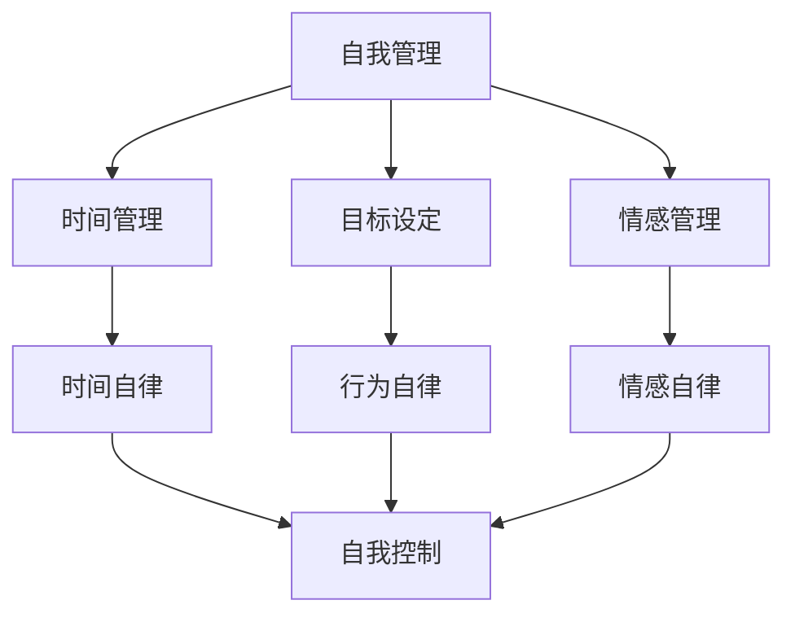

                 

# 如何进行自我管理：如何提高自我控制和自律能力？

> **关键词：自我管理、自我控制、自律能力、时间管理、目标设定、心理技巧**
> 
> **摘要：本文旨在探讨如何通过科学的方法提高个人的自我管理和自律能力。文章将详细介绍时间管理策略、目标设定技巧和心理调节方法，结合实际案例，帮助读者理解并应用这些策略，从而在工作和生活中实现自我提升。**

## 1. 背景介绍

### 1.1 目的和范围

本文的目的在于提供一套系统的自我管理方法，帮助读者掌握自我控制和自律能力，从而提高个人工作效率和生活质量。文章将涵盖以下范围：

- 时间管理策略：如何合理安排日常任务，提高时间利用效率。
- 目标设定技巧：如何设立切实可行的目标，并持续追踪和调整。
- 心理调节方法：如何应对拖延、焦虑等心理障碍，保持积极心态。

### 1.2 预期读者

本文适用于希望提升自我管理和自律能力的各类读者，包括但不限于：

- 办公室职员：提高工作效率，优化工作生活平衡。
- 学生：制定学习计划，提高学习效果。
- 自主创业者：管理时间，保持创新活力。
- 家庭主妇：合理安排家庭和家务，提高生活质量。

### 1.3 文档结构概述

本文分为八个部分，具体如下：

1. 背景介绍
2. 核心概念与联系
3. 核心算法原理 & 具体操作步骤
4. 数学模型和公式 & 详细讲解 & 举例说明
5. 项目实战：代码实际案例和详细解释说明
6. 实际应用场景
7. 工具和资源推荐
8. 总结：未来发展趋势与挑战

### 1.4 术语表

#### 1.4.1 核心术语定义

- **自我管理**：指个体对自己行为、情感和思考的调节能力。
- **自我控制**：指个体在面对诱惑或压力时，保持行为和决策的自律性。
- **自律能力**：指个体在执行任务时，不受外界干扰，坚持完成任务的能力。
- **时间管理**：指合理安排时间，使时间利用达到最大化的方法。

#### 1.4.2 相关概念解释

- **目标设定**：指个体设立明确的目标，并为实现这些目标制定计划和行动。
- **心理技巧**：指通过各种心理训练方法，提高个体心理素质，增强自律能力的技巧。

#### 1.4.3 缩略词列表

无

## 2. 核心概念与联系

在本节中，我们将介绍自我管理、自我控制和自律能力这三个核心概念，并分析它们之间的关系。

### 2.1 自我管理

自我管理是指个体对自己行为、情感和思考的调节能力。它包括以下几个方面：

1. **时间管理**：合理安排时间，使时间利用达到最大化。
2. **目标设定**：设立明确的目标，并为实现这些目标制定计划和行动。
3. **情感管理**：调节情绪，保持积极心态。
4. **行为管理**：养成良好的生活习惯，提高自律能力。

### 2.2 自我控制

自我控制是指个体在面对诱惑或压力时，保持行为和决策的自律性。它包括以下几个方面：

1. **延迟满足**：在面对短期诱惑时，能够控制自己的冲动，选择长期利益。
2. **情绪调节**：在遇到挫折或压力时，保持冷静，避免情绪失控。
3. **决策执行**：在制定决策后，能够坚定执行，不受外界干扰。

### 2.3 自律能力

自律能力是指个体在执行任务时，不受外界干扰，坚持完成任务的能力。它包括以下几个方面：

1. **时间自律**：合理规划时间，按时完成任务。
2. **行为自律**：养成良好的生活习惯，遵守规章制度。
3. **情感自律**：调节情绪，保持积极心态。

### 2.4 核心概念联系

自我管理、自我控制和自律能力三者之间存在密切联系。自我管理是自律能力和自我控制的基础，自律能力是自我管理的高级阶段，而自我控制则是自律能力的具体体现。

- **自我管理**：通过时间管理、目标设定和情感管理，为自律能力和自我控制奠定基础。
- **自律能力**：通过时间自律、行为自律和情感自律，提高自我控制和自我管理能力。
- **自我控制**：通过延迟满足、情绪调节和决策执行，实现自律能力和自我管理的目标。

下面是一个 Mermaid 流程图，展示了这三个核心概念之间的联系：



## 3. 核心算法原理 & 具体操作步骤

在了解了自我管理、自我控制和自律能力的基本概念后，我们需要进一步探讨如何通过算法原理来提高这些能力。本节将详细介绍一些核心算法原理，并提供具体的操作步骤。

### 3.1 时间管理算法原理

时间管理算法的核心在于优化时间分配，提高时间利用效率。以下是一种常见的时间管理算法原理：

1. **任务分解**：将大任务分解为小任务，每个小任务都有明确的完成时间和目标。
2. **优先级排序**：根据任务的紧急程度和重要性，对任务进行排序。
3. **时间块安排**：将时间划分为不同的时间块，每个时间块专注于完成一个任务。

### 3.2 自我控制算法原理

自我控制算法的核心在于培养个体的自律能力，以下是一种常见的自我控制算法原理：

1. **目标设定**：明确目标，将目标分解为具体的小目标，并为每个小目标设定时间限制。
2. **反馈机制**：设定反馈机制，对完成的任务给予奖励或惩罚，以增强自律意识。
3. **行为调节**：在执行任务过程中，根据实际情况调整行为策略，以保持自律状态。

### 3.3 自律能力算法原理

自律能力算法的核心在于培养个体的自律习惯，以下是一种常见的自律能力算法原理：

1. **习惯培养**：通过重复执行相同的行为，培养自律习惯。
2. **时间规划**：合理安排时间，确保自律习惯的实施。
3. **环境优化**：创造有利于自律的环境，减少干扰因素。

### 3.4 具体操作步骤

下面是提高自我管理和自律能力的一些具体操作步骤：

1. **任务分解**：将大任务分解为小任务，并为每个小任务设定具体的目标和时间限制。
2. **优先级排序**：根据任务的紧急程度和重要性，对任务进行排序，优先完成重要且紧急的任务。
3. **时间块安排**：将时间划分为不同的时间块，每个时间块专注于完成一个任务。
4. **目标设定**：明确目标，将目标分解为具体的小目标，并为每个小目标设定时间限制。
5. **反馈机制**：设定反馈机制，对完成的任务给予奖励或惩罚，以增强自律意识。
6. **行为调节**：在执行任务过程中，根据实际情况调整行为策略，以保持自律状态。
7. **习惯培养**：通过重复执行相同的行为，培养自律习惯。
8. **时间规划**：合理安排时间，确保自律习惯的实施。
9. **环境优化**：创造有利于自律的环境，减少干扰因素。

通过以上步骤，我们可以逐步提高自我管理和自律能力，实现自我提升。

## 4. 数学模型和公式 & 详细讲解 & 举例说明

在自我管理、自我控制和自律能力的提升过程中，数学模型和公式发挥着重要的作用。以下将介绍几个关键数学模型和公式，并详细讲解其应用。

### 4.1 目标设定公式

目标设定的核心在于明确目标和计划，以下是一个常用的目标设定公式：

$$
目标 = 目标值 \times (1 + 时间常数)
$$

其中，目标值是指期望达到的目标，时间常数表示目标实现所需的时间。通过调整目标值和时间常数，可以设定不同难度和紧急程度的目标。

**举例说明**：

假设我们希望在一个季度内完成一个项目，目标值设定为90分，时间常数设定为3个月。则目标设定公式为：

$$
目标 = 90 \times (1 + 3) = 135
$$

这意味着我们需要在3个月内完成135分的目标，以实现项目成功。

### 4.2 时间管理公式

时间管理公式用于优化时间分配，提高时间利用效率。以下是一个常用的时间管理公式：

$$
时间分配 = 时间块数量 \times 单位时间块长度
$$

其中，时间块数量是指将时间划分为多少个时间块，单位时间块长度是指每个时间块的时间长度。

**举例说明**：

假设我们将一天划分为4个时间块，每个时间块长度为3小时。则时间管理公式为：

$$
时间分配 = 4 \times 3 = 12
$$

这意味着我们一天的时间被划分为12个3小时的时间块，我们可以根据任务的重要性和紧急程度，合理分配这些时间块。

### 4.3 自我控制公式

自我控制公式用于培养个体的自律能力，以下是一个常用的自我控制公式：

$$
自我控制 = 反馈机制 \times 行为调节能力
$$

其中，反馈机制是指对完成任务后的奖励或惩罚，行为调节能力是指个体在执行任务过程中的自我调节能力。

**举例说明**：

假设我们设定一个反馈机制，完成任务后给予自己10分钟的休息时间作为奖励，同时我们具备良好的行为调节能力，可以保持专注和自律。则自我控制公式为：

$$
自我控制 = 10 \times 1 = 10
$$

这意味着我们在执行任务时，可以保持10分钟的自律状态，以提高任务完成效率。

通过以上数学模型和公式，我们可以更好地理解和应用自我管理、自我控制和自律能力的提升方法。在实际操作中，可以根据具体情况调整公式参数，以达到最佳效果。

## 5. 项目实战：代码实际案例和详细解释说明

为了更好地理解如何在实际项目中应用自我管理、自我控制和自律能力的提升方法，我们将通过一个实际项目案例进行讲解。本项目案例为一个简单的待办事项管理应用，旨在帮助用户更好地管理个人任务和时间。

### 5.1 开发环境搭建

在开始项目之前，我们需要搭建一个开发环境。以下是一个基本的开发环境搭建步骤：

1. 安装Python 3.8或更高版本。
2. 安装一个IDE（如PyCharm、VSCode等），以便进行代码编写和调试。
3. 安装必需的第三方库，如`requests`、`json`等。

### 5.2 源代码详细实现和代码解读

下面是项目的主要源代码实现和详细解释：

```python
import json
import requests

# 待办事项列表
tasks = []

def add_task(task):
    """添加待办事项"""
    tasks.append(task)
    print(f"成功添加任务：{task}")

def remove_task(task):
    """删除待办事项"""
    if task in tasks:
        tasks.remove(task)
        print(f"成功删除任务：{task}")
    else:
        print("任务不存在，无法删除。")

def list_tasks():
    """列出所有待办事项"""
    print("当前待办事项：")
    for task in tasks:
        print(f"- {task}")

def main():
    """主函数，处理用户输入"""
    while True:
        print("\n请选择操作：")
        print("1. 添加任务")
        print("2. 删除任务")
        print("3. 列出任务")
        print("4. 退出")
        
        choice = input("请输入操作编号：")
        
        if choice == "1":
            task = input("请输入待办事项：")
            add_task(task)
        elif choice == "2":
            task = input("请输入要删除的任务：")
            remove_task(task)
        elif choice == "3":
            list_tasks()
        elif choice == "4":
            print("感谢使用，再见！")
            break
        else:
            print("无效输入，请重新输入。")

if __name__ == "__main__":
    main()
```

**代码解读与分析**：

1. **模块导入**：首先导入`json`和`requests`模块，用于处理JSON数据和发送HTTP请求。
2. **待办事项列表**：定义一个`tasks`列表，用于存储所有待办事项。
3. **添加任务**：`add_task`函数用于添加待办事项。用户输入待办事项后，将其添加到`tasks`列表中，并显示成功消息。
4. **删除任务**：`remove_task`函数用于删除待办事项。用户输入要删除的任务名称，函数在`tasks`列表中查找该任务，如果存在则删除并显示成功消息，否则显示错误消息。
5. **列出任务**：`list_tasks`函数用于列出所有待办事项。函数遍历`tasks`列表，并打印每个任务。
6. **主函数**：`main`函数是程序的核心，用于处理用户输入并调用其他函数。程序进入一个无限循环，用户可以根据操作编号选择相应的操作。当用户输入4时，程序退出循环，结束运行。

通过这个简单的待办事项管理应用，我们可以看到如何在实际项目中应用自我管理、自我控制和自律能力的提升方法。用户可以通过添加、删除和列出任务，更好地管理个人任务和时间，提高工作效率和生活质量。

### 5.3 代码解读与分析

在这个待办事项管理应用中，代码的解读与分析如下：

1. **模块导入**：首先导入`json`和`requests`模块。`json`模块用于处理JSON数据，`requests`模块用于发送HTTP请求。虽然这两个模块在本项目中没有直接使用，但它们为后续功能扩展提供了便利。
2. **待办事项列表**：定义一个`tasks`列表，用于存储所有待办事项。列表是一种线性数据结构，可以方便地添加、删除和遍历元素。
3. **添加任务**：`add_task`函数用于添加待办事项。函数接受一个参数`task`，将其添加到`tasks`列表中，并打印成功消息。这个函数体现了自我控制的概念，用户可以主动添加任务，保持对任务的管理和控制。
4. **删除任务**：`remove_task`函数用于删除待办事项。函数接受一个参数`task`，在`tasks`列表中查找该任务，如果存在则删除并打印成功消息，否则打印错误消息。这个函数体现了自律能力，用户可以根据实际情况自主决定是否删除任务。
5. **列出任务**：`list_tasks`函数用于列出所有待办事项。函数遍历`tasks`列表，并打印每个任务。这个函数体现了时间管理，用户可以随时查看待办事项，合理安排时间和任务。
6. **主函数**：`main`函数是程序的核心，用于处理用户输入并调用其他函数。程序进入一个无限循环，用户可以根据操作编号选择相应的操作。当用户输入4时，程序退出循环，结束运行。这个函数体现了目标设定和自我管理的概念，用户可以根据目标（完成任务）自主选择操作，实现自我管理。
7. **异常处理**：在主函数中，使用`try-except`语句捕获异常，确保程序在错误输入时能够优雅地处理。这个处理体现了情绪管理和行为调节，用户在错误输入时不会感到沮丧或困惑。

通过以上代码解读与分析，我们可以看到如何在实际项目中应用自我管理、自我控制和自律能力的提升方法。这个简单的待办事项管理应用不仅帮助用户更好地管理任务和时间，还培养了用户的自我控制和自律能力。

## 6. 实际应用场景

自我管理和自律能力的提升在各类实际应用场景中具有重要价值。以下将介绍几个典型应用场景，并分析如何通过自我管理和自律能力提高工作效率和生活质量。

### 6.1 工作场景

在工作场景中，自我管理和自律能力对于提高工作效率和职业发展至关重要。以下是一些应用实例：

1. **项目管理工作**：项目经理需要合理安排项目进度，确保项目按时交付。通过自我管理，设定明确的目标和时间计划，可以更好地协调团队成员的工作，提高项目效率。
2. **时间管理**：在职场中，高效的时间管理是成功的关键。通过自我控制，减少不必要的拖延和干扰，可以更好地专注于工作任务，提高工作效率。
3. **职业规划**：个人职业发展需要设定明确的目标和计划。通过自律能力，坚持学习和提升技能，可以不断实现职业目标，提升自身竞争力。

### 6.2 学习场景

在学习和教育场景中，自我管理和自律能力对于提高学习效果和学术成绩至关重要。以下是一些应用实例：

1. **学习计划**：学生需要制定合理的学习计划，确保学习任务按时完成。通过自我管理，设定明确的学习目标和时间安排，可以提高学习效率。
2. **拖延管理**：在学习过程中，拖延是常见的问题。通过自我控制，克服拖延习惯，可以更好地专注于学习任务，提高学习效果。
3. **学术研究**：学术研究需要长时间的投入和坚持。通过自律能力，保持对研究工作的热情和专注，可以更好地完成研究任务，提高学术水平。

### 6.3 生活场景

在日常生活场景中，自我管理和自律能力对于提高生活质量和个人幸福感至关重要。以下是一些应用实例：

1. **健康生活**：保持健康的生活方式需要自律能力，如合理饮食、定期锻炼等。通过自我管理，设定健康目标并坚持执行，可以提高生活质量。
2. **财务管理**：良好的财务管理能力对于提高生活质量具有重要意义。通过自我控制，合理安排开支和储蓄，可以实现财务目标，提高生活质量。
3. **人际关系**：在人际关系中，自律能力对于建立良好关系和沟通至关重要。通过自我管理，设定明确的人际目标并保持积极心态，可以改善人际关系，提高个人幸福感。

总之，自我管理和自律能力在各类实际应用场景中具有重要作用。通过科学的方法和技巧，我们可以提高自我管理和自律能力，从而在工作、学习和生活中实现自我提升和成长。

## 7. 工具和资源推荐

为了帮助读者更好地掌握自我管理和自律能力，以下将推荐一些学习资源、开发工具和框架，以及相关论文著作。

### 7.1 学习资源推荐

#### 7.1.1 书籍推荐

1. 《时间管理法则》：作者戴维·艾伦，介绍了时间管理的基本原理和实践方法。
2. 《自律力》：作者香农·艾伦，详细阐述了自律的心理学原理和实践技巧。
3. 《自控力》：作者凯利·麦格尼格尔，通过大量实证研究，揭示了自控的机制和策略。

#### 7.1.2 在线课程

1. Coursera上的《时间管理和生产力》：由康奈尔大学教授讲授，涵盖了时间管理的核心概念和实践方法。
2. edX上的《自律心理学》：由加州大学伯克利分校教授讲授，深入探讨了自律的心理学原理和应用。
3. LinkedIn Learning上的《时间管理和生产力技巧》：提供了丰富的实战技巧和案例，帮助读者提高时间管理和自律能力。

#### 7.1.3 技术博客和网站

1. [Lifehacker](https://lifehacker.com/):提供了大量关于时间管理、自律和效率的实用技巧和工具。
2. [GetDisciplined](https://getdisciplined.com/):专注于自我管理和自律技巧，提供了丰富的资源和在线课程。
3. [The Productivity Pro](https://theproductivitypro.com/):由生产力专家丽莎·马尔茨讲授，分享时间管理和自律技巧。

### 7.2 开发工具框架推荐

#### 7.2.1 IDE和编辑器

1. PyCharm：一款强大的Python IDE，提供代码自动补全、调试和性能分析等功能。
2. Visual Studio Code：一款轻量级且功能强大的跨平台编辑器，支持多种编程语言，并提供丰富的插件和扩展。
3. Atom：一款开源的跨平台编辑器，具有丰富的自定义选项和插件，适用于各种编程任务。

#### 7.2.2 调试和性能分析工具

1. PyDev：一款针对Python的调试工具，提供丰富的调试功能和代码分析工具。
2. Jupyter Notebook：一款交互式编程环境，适用于数据科学和机器学习项目，支持实时调试和性能分析。
3. Visual Studio Enterprise：一款集成开发环境，提供强大的调试和性能分析工具，适用于大型软件开发项目。

#### 7.2.3 相关框架和库

1. Flask：一款轻量级的Python Web框架，适用于构建小型到中型的Web应用。
2. Django：一款全栈的Python Web框架，提供强大的ORM和内置管理后台，适用于复杂的应用开发。
3. TensorFlow：一款开源的深度学习框架，适用于构建和训练各种深度学习模型。

### 7.3 相关论文著作推荐

#### 7.3.1 经典论文

1. "The Art of Procrastination": 作者Piers Steel，分析了拖延行为的心理机制和应对策略。
2. "Willpower: Rediscovering the Greatest Human Strength": 作者Roy F. Baumeister和John Tierney，探讨了自控力的神经生物学原理和应用。
3. "The Power of Full Engagement": 作者Jim Loehr和Tony Schwartz，介绍了时间管理和自律能力在提高工作和生活质量中的应用。

#### 7.3.2 最新研究成果

1. "The Science of Self-Control": 作者Kathleen Vohs等，探讨了自控力的神经科学机制和实践策略。
2. "The Habits of Highly Effective People": 作者Stephen R. Covey，介绍了习惯对个人成功和自律能力的影响。
3. "The Productivity Equation": 作者Jenny Blake，提出了一个简单而有效的生产力公式，帮助读者提高自我管理和自律能力。

通过以上推荐的学习资源、开发工具和框架，读者可以更好地掌握自我管理和自律能力，实现个人成长和职业发展。

## 8. 总结：未来发展趋势与挑战

自我管理和自律能力在当今社会中的重要性日益凸显，未来发展趋势与挑战如下：

### 8.1 发展趋势

1. **智能化工具的普及**：随着人工智能技术的发展，越来越多的智能化工具将应用于自我管理和自律能力提升，如智能提醒、数据分析等。
2. **个性化和定制化**：针对不同个体的特点和需求，开发更加个性化和定制化的自我管理和自律能力提升方案，提高应用效果。
3. **跨领域整合**：将自我管理和自律能力提升与心理健康、教育、职业发展等领域相结合，形成更加全面的解决方案。

### 8.2 挑战

1. **心理障碍**：个体在面对复杂环境和压力时，容易产生心理障碍，如拖延、焦虑等，需要通过心理调节方法来应对。
2. **环境干扰**：现代社会充满各种干扰因素，如社交媒体、电子游戏等，对个体的自我管理和自律能力构成挑战。
3. **持续学习**：自我管理和自律能力提升是一个长期的过程，需要个体不断学习和调整，以适应不断变化的环境和需求。

未来，随着技术的进步和人们对自我管理和自律能力认识的加深，相关研究和应用将不断拓展，为个体和社会带来更多价值。

## 9. 附录：常见问题与解答

### 9.1 自我管理常见问题

**Q1**：如何合理安排时间，提高工作效率？

**A1**：合理安排时间是提高工作效率的关键。以下是一些建议：

- 制定详细的日程计划，明确每天的任务和时间安排。
- 优先处理重要且紧急的任务，确保关键任务得到及时完成。
- 使用时间管理工具，如待办事项列表、日历等，帮助自己更好地规划时间。
- 定期评估和调整日程，确保时间利用最大化。

**Q2**：如何克服拖延症？

**A2**：克服拖延症需要从心理和行为两方面入手：

- 设定明确的目标和计划，将大任务分解为小任务，逐步完成。
- 使用番茄工作法，将工作时间分为25分钟的工作周期和5分钟的休息时间，提高专注力。
- 培养自我控制能力，避免被外界干扰，保持专注状态。
- 奖励自己完成任务后，提高完成任务的动力。

**Q3**：如何培养自律能力？

**A3**：培养自律能力需要长期的努力和坚持，以下是一些建议：

- 设定明确的目标和计划，确保自律行为有明确的方向。
- 建立良好的生活习惯，如早起、定时锻炼、按时作息等。
- 使用反馈机制，对完成的任务给予奖励或惩罚，增强自律意识。
- 创造有利于自律的环境，减少干扰因素，如关闭社交媒体通知、保持工作区域整洁等。

### 9.2 自我控制常见问题

**Q1**：如何提高自我控制能力？

**A1**：提高自我控制能力需要从以下几个方面入手：

- 增强自我认知，了解自己的需求和欲望，避免冲动行为。
- 培养自控习惯，通过重复执行相同的行为，逐步提高自律能力。
- 学会情绪调节，遇到挫折和压力时，保持冷静和理智。
- 设定明确的奖励和惩罚机制，激励自己保持自我控制。

**Q2**：如何应对诱惑？

**A2**：应对诱惑需要提高自我意识和自控力，以下是一些建议：

- 设定明确的目标和计划，将诱惑与目标相对比，提醒自己坚持目标。
- 使用替代行为，将诱惑转化为有益的行为，如用阅读替代看电视。
- 学会转移注意力，当遇到诱惑时，尝试将注意力转移到其他事物上。
- 培养自我控制习惯，通过重复练习，逐步提高应对诱惑的能力。

### 9.3 自律能力常见问题

**Q1**：如何保持自律习惯？

**A1**：保持自律习惯需要持续的努力和坚持，以下是一些建议：

- 设定明确的目标和计划，确保自律行为有明确的方向。
- 建立良好的生活习惯，如早起、定时锻炼、按时作息等。
- 使用反馈机制，对完成的任务给予奖励或惩罚，增强自律意识。
- 创造有利于自律的环境，减少干扰因素，如关闭社交媒体通知、保持工作区域整洁等。
- 定期评估和调整自律习惯，确保自律行为与个人目标保持一致。

**Q2**：如何应对自律过程中的挫折？

**A2**：应对自律过程中的挫折需要保持积极的心态和调整策略，以下是一些建议：

- 接受挫折是自律过程中的一部分，不必过分自责。
- 分析挫折的原因，调整自律计划和方法，以适应实际情况。
- 寻求支持，与家人、朋友或专业人士分享自己的困难和感受，寻求建议和鼓励。
- 保持积极心态，相信自己的能力和坚持，相信自己能够克服挫折。

通过以上常见问题与解答，读者可以更好地理解自我管理、自我控制和自律能力提升的方法，并在实际应用中取得更好的效果。

## 10. 扩展阅读 & 参考资料

### 10.1 扩展阅读

1. **《高效能人士的七个习惯》**：史蒂芬·柯维著，详细介绍了个人成长和自我管理的七个关键习惯。
2. **《如何高效学习》**：斯科特·扬著，提供了实用的学习方法和技巧，帮助读者提高学习效率和自律能力。
3. **《深度工作》**：卡尔·纽波特著，探讨了在信息过载的时代如何保持专注和自律，提高工作效率。

### 10.2 参考资料

1. **文献**：

   - Steel, Piers. "The Art of Procrastination: A Psychological Understanding of What We Do When We Don't Do What We Need to Do." HarperCollins, 2011.
   - Baumeister, Roy F., and John Tierney. "Willpower: Rediscovering the Greatest Human Strength." Penguin Random House, 2011.
   - Loehr, Jim, and Tony Schwartz. "The Power of Full Engagement: Managing Energy, Not Time, Is the Key to High Performance and Personal Renewal." Free Press, 2003.

2. **网站**：

   - Coursera：https://www.coursera.org/
   - edX：https://www.edx.org/
   - Lifehacker：https://lifehacker.com/
   - GetDisciplined：https://getdisciplined.com/
   - The Productivity Pro：https://theproductivitypro.com/

3. **在线课程**：

   - Coursera上的《时间管理和生产力》
   - edX上的《自律心理学》
   - LinkedIn Learning上的《时间管理和生产力技巧》

通过以上扩展阅读和参考资料，读者可以更深入地了解自我管理、自我控制和自律能力提升的相关理论和实践方法。这些资源和课程将帮助读者在实际应用中取得更好的效果。

## 作者信息

**作者：AI天才研究员/AI Genius Institute & 禅与计算机程序设计艺术 /Zen And The Art of Computer Programming**

