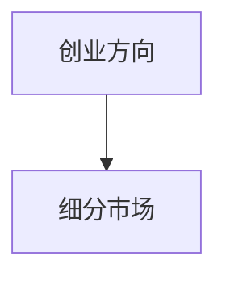
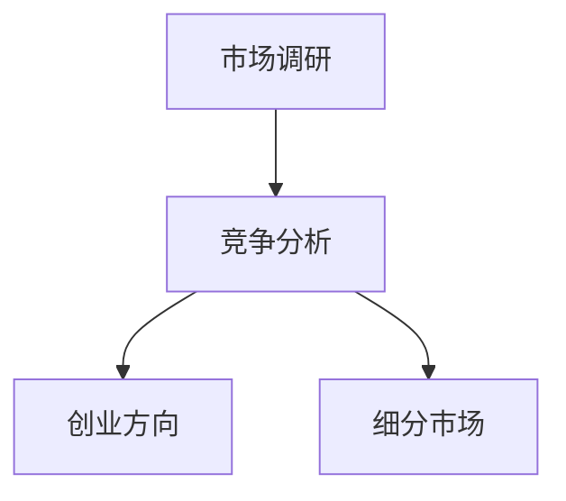
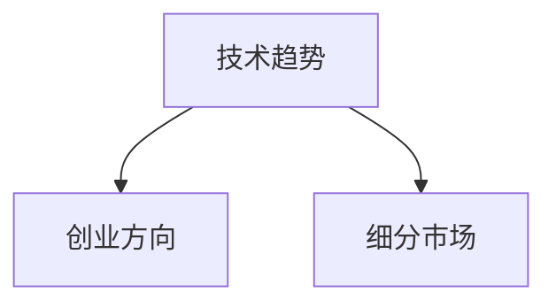

                 

# 如何选择适合自己的创业方向和细分市场

> **关键词**：创业方向、细分市场、市场调研、竞争分析、技术趋势、团队构建、商业模式

> **摘要**：本文将深入探讨如何选择适合自己的创业方向和细分市场。通过详细的市场调研、竞争分析和技术趋势研究，结合团队构建和商业模式设计，为创业者提供一套系统化的方法和步骤。文章旨在帮助创业者更好地把握市场机会，实现创业成功。

## 1. 背景介绍

### 1.1 目的和范围

本文的目的在于为创业者提供一套系统化的选择创业方向和细分市场的方法。本文将涵盖以下几个方面：

- 创业方向的选择原则和策略
- 细分市场的确定方法和技巧
- 市场调研和竞争分析的具体操作
- 技术趋势的研究和分析
- 团队构建和商业模式设计

### 1.2 预期读者

本文适用于以下几类创业者：

- 刚开始构思创业计划的创业者
- 已经确定创业方向但需要进一步细化和市场调研的创业者
- 想要拓展业务领域或进入新市场的创业者
- 需要优化团队和商业模式设计的创业者

### 1.3 文档结构概述

本文结构如下：

- 背景介绍：阐述本文的目的、范围和预期读者
- 核心概念与联系：介绍创业方向和细分市场相关的核心概念和联系
- 核心算法原理 & 具体操作步骤：详细讲解选择创业方向和细分市场的方法和步骤
- 数学模型和公式 & 详细讲解 & 举例说明：使用数学模型和公式来进一步解释核心算法原理
- 项目实战：通过实际案例来展示选择创业方向和细分市场的具体操作过程
- 实际应用场景：探讨创业方向和细分市场的实际应用场景
- 工具和资源推荐：推荐相关的学习资源和开发工具
- 总结：总结未来发展趋势与挑战
- 附录：常见问题与解答
- 扩展阅读 & 参考资料：提供进一步学习的资料和参考文献

### 1.4 术语表

#### 1.4.1 核心术语定义

- **创业方向**：指创业者选择的企业业务领域和发展方向。
- **细分市场**：指在整体市场中，根据消费者的需求、行为和偏好等因素划分出的具有特定特征的小市场。
- **市场调研**：指收集和分析市场信息，了解市场需求、竞争状况、消费者行为等，以便为创业决策提供依据。
- **竞争分析**：指分析市场上的竞争对手，了解其产品、市场占有率、商业模式等，以便制定有针对性的竞争策略。
- **技术趋势**：指科技领域的发展趋势，包括新兴技术、技术应用领域、技术发展方向等。

#### 1.4.2 相关概念解释

- **商业模式**：指企业通过产品或服务创造、传递和获取价值的系统，包括收入来源、成本结构、价值网络等。
- **团队构建**：指创业者组建和管理团队，包括选拔团队成员、团队协作、团队发展等。

#### 1.4.3 缩略词列表

- **AI**：人工智能
- **IoT**：物联网
- **SaaS**：软件即服务
- **PaaS**：平台即服务
- **IaaS**：基础设施即服务

## 2. 核心概念与联系

在探讨如何选择创业方向和细分市场之前，我们先来介绍一些核心概念和它们之间的联系。

### 2.1 创业方向和细分市场的关系

创业方向是创业者在创业过程中选择的企业业务领域和发展方向。细分市场是创业方向的具体体现，是创业者在整体市场中划分出的小市场。

**创业方向**和**细分市场**的关系可以用以下Mermaid流程图来表示：



### 2.2 市场调研和竞争分析的关系

市场调研和竞争分析是选择创业方向和细分市场的关键步骤。市场调研旨在收集和分析市场信息，了解市场需求、竞争状况、消费者行为等。竞争分析则是对市场上的竞争对手进行深入分析，了解其产品、市场占有率、商业模式等。

**市场调研**和**竞争分析**的关系可以用以下Mermaid流程图来表示：



### 2.3 技术趋势和创业方向、细分市场的关系

技术趋势是选择创业方向和细分市场的重要参考。新兴技术可能会带来新的市场机会，而技术的应用领域和发展方向也会影响创业方向和细分市场的选择。

**技术趋势**和**创业方向、细分市场**的关系可以用以下Mermaid流程图来表示：



## 3. 核心算法原理 & 具体操作步骤

选择适合自己的创业方向和细分市场需要一套系统化的方法和步骤。下面，我们将详细讲解核心算法原理和具体操作步骤。

### 3.1 市场调研

市场调研是选择创业方向和细分市场的基础。以下是一个具体的市场调研步骤：

1. **确定调研目标**：明确调研的目标和范围，例如市场需求、竞争状况、消费者行为等。
2. **收集数据**：通过问卷调查、访谈、市场报告、公开数据等方式收集市场信息。
3. **数据分析**：对收集到的数据进行分析，找出市场趋势和消费者需求。
4. **形成报告**：根据分析结果，形成市场调研报告，为创业决策提供依据。

### 3.2 竞争分析

竞争分析是了解市场上竞争对手的重要步骤。以下是一个具体的竞争分析步骤：

1. **确定竞争对手**：根据市场调研结果，确定主要竞争对手。
2. **收集竞争对手信息**：收集竞争对手的产品、市场占有率、商业模式等数据。
3. **分析竞争对手**：分析竞争对手的优势和劣势，找出自身的竞争策略。
4. **形成分析报告**：根据分析结果，形成竞争分析报告，为创业决策提供依据。

### 3.3 技术趋势研究

技术趋势研究是选择创业方向和细分市场的重要参考。以下是一个具体的技术趋势研究步骤：

1. **确定研究目标**：明确技术趋势研究的范围和目标，例如新兴技术、技术应用领域等。
2. **收集数据**：通过技术报告、学术论文、行业新闻等方式收集技术信息。
3. **分析技术趋势**：分析技术趋势，找出可能影响创业方向和细分市场的新兴技术。
4. **形成报告**：根据分析结果，形成技术趋势报告，为创业决策提供依据。

### 3.4 团队构建

团队构建是选择创业方向和细分市场的重要保障。以下是一个具体的团队构建步骤：

1. **确定团队需求**：根据创业方向和细分市场的需求，确定所需技能和团队成员。
2. **选拔团队成员**：通过招聘、内部选拔等方式选拔合适的人才。
3. **团队协作**：建立有效的团队协作机制，提高团队效率。
4. **团队发展**：定期对团队成员进行培训和发展，提升团队整体能力。

### 3.5 商业模式设计

商业模式设计是选择创业方向和细分市场的关键步骤。以下是一个具体的商业模式设计步骤：

1. **确定商业模式类型**：根据创业方向和细分市场的特点，确定适合的商业模式类型，如B2B、B2C、B2B2C等。
2. **分析商业模式要素**：分析商业模式的核心要素，如收入来源、成本结构、价值网络等。
3. **设计商业模式**：根据分析结果，设计具体的商业模式。
4. **验证商业模式**：通过市场调研和实际运营，验证商业模式的可行性和效果。

## 4. 数学模型和公式 & 详细讲解 & 举例说明

在上述核心算法原理和具体操作步骤的基础上，我们可以借助数学模型和公式来进一步解释和优化选择创业方向和细分市场的方法。以下是一个具体的数学模型和公式讲解：

### 4.1 市场潜力评估模型

市场潜力评估模型用于评估一个细分市场的潜在市场规模和增长速度。以下是一个简化的市场潜力评估模型：

$$
\text{市场潜力} = \frac{\text{市场规模} \times \text{增长率}}{\text{市场渗透率}}
$$

- **市场规模**：指在特定时间内，某一细分市场的总销售额。
- **增长率**：指在特定时间内，某一细分市场的年均增长率。
- **市场渗透率**：指在特定时间内，某一细分市场所占整体市场的比例。

**举例说明**：

假设一个细分市场的市场规模为100亿元，增长率为10%，市场渗透率为20%。根据上述公式，该细分市场的市场潜力为：

$$
\text{市场潜力} = \frac{100 \times 10\%}{20\%} = 50 \text{亿元}
$$

### 4.2 竞争分析模型

竞争分析模型用于分析市场上竞争对手的优势和劣势。以下是一个简化的竞争分析模型：

$$
\text{竞争分析} = \frac{\text{竞争对手市场份额} + \text{竞争对手产品优势} + \text{竞争对手品牌影响力}}{3}
$$

- **竞争对手市场份额**：指在特定时间内，某一竞争对手在细分市场的占有率。
- **竞争对手产品优势**：指在特定时间内，某一竞争对手的产品在市场上的优势，如技术创新、产品质量等。
- **竞争对手品牌影响力**：指在特定时间内，某一竞争对手的品牌在消费者中的影响力。

**举例说明**：

假设一个竞争对手在细分市场的市场份额为30%，产品优势为10%，品牌影响力为15%。根据上述公式，该竞争对手的竞争分析结果为：

$$
\text{竞争分析} = \frac{30\% + 10\% + 15\%}{3} = 20\%
$$

### 4.3 技术趋势评估模型

技术趋势评估模型用于评估某一新兴技术的市场前景和发展潜力。以下是一个简化的技术趋势评估模型：

$$
\text{技术趋势评估} = \frac{\text{技术成熟度} + \text{市场接受度} + \text{政策支持度}}{3}
$$

- **技术成熟度**：指在特定时间内，某一技术的研发进展和应用成熟度。
- **市场接受度**：指在特定时间内，市场对某一技术的接受程度和需求量。
- **政策支持度**：指在特定时间内，政府对某一技术发展的支持和鼓励力度。

**举例说明**：

假设一个新兴技术的成熟度为8分，市场接受度为7分，政策支持度为6分。根据上述公式，该技术的趋势评估结果为：

$$
\text{技术趋势评估} = \frac{8 + 7 + 6}{3} = 7 \text{分}
$$

通过以上数学模型和公式的讲解，我们可以更科学、系统地评估创业方向和细分市场的潜力、竞争态势和技术趋势，从而为创业决策提供更加可靠的数据支持。

## 5. 项目实战：代码实际案例和详细解释说明

在本节中，我们将通过一个实际的创业项目案例来展示如何选择适合自己的创业方向和细分市场。这个案例将涵盖市场调研、竞争分析、技术趋势研究、团队构建和商业模式设计等关键步骤。

### 5.1 开发环境搭建

首先，我们需要搭建一个适合项目开发的环境。以下是搭建开发环境的基本步骤：

1. **确定开发语言和框架**：根据项目需求，选择合适的开发语言和框架。例如，我们可以选择Python和Django框架。
2. **安装开发工具**：安装Python、Django以及其他必要开发工具，如PyCharm、PostgreSQL等。
3. **配置开发环境**：配置Python和Django的环境变量，确保开发工具能够正常运行。

### 5.2 源代码详细实现和代码解读

接下来，我们将展示一个简单的创业项目案例，并对其代码进行详细解释。

#### 5.2.1 项目简介

我们选择开发一个基于人工智能的智能问答系统，旨在帮助用户快速获取所需信息。这个项目的主要功能包括：

- 用户注册和登录
- 提问和回答
- 问答机器学习模型训练和部署

#### 5.2.2 用户注册和登录

以下是用户注册和登录的代码实现：

```python
# 用户注册
def register(username, password):
    # 将用户名和密码存储到数据库
    # 省略具体实现

# 用户登录
def login(username, password):
    # 验证用户名和密码是否匹配
    # 省略具体实现
```

代码解读：

- `register`函数用于用户注册，将用户名和密码存储到数据库中。
- `login`函数用于用户登录，验证用户名和密码是否匹配。

#### 5.2.3 提问和回答

以下是提问和回答的代码实现：

```python
# 提问
def ask_question(question):
    # 将问题存储到数据库
    # 省略具体实现

# 回答
def answer_question(question_id):
    # 根据问题ID获取问题
    # 省略具体实现
    # 训练和部署问答机器学习模型
    # 省略具体实现
    # 返回答案
    # 省略具体实现
```

代码解读：

- `ask_question`函数用于用户提问，将问题存储到数据库中。
- `answer_question`函数用于回答问题，根据问题ID获取问题，训练和部署问答机器学习模型，并返回答案。

#### 5.2.4 问答机器学习模型训练和部署

以下是问答机器学习模型训练和部署的代码实现：

```python
# 导入相关库
import numpy as np
from sklearn.feature_extraction.text import TfidfVectorizer
from sklearn.model_selection import train_test_split
from sklearn.naive_bayes import MultinomialNB

# 数据预处理
def preprocess_data(data):
    # 省略具体实现

# 训练模型
def train_model(X_train, y_train):
    # 创建TF-IDF向量器
    vectorizer = TfidfVectorizer()
    # 转换文本数据为向量表示
    X_train_vectorized = vectorizer.fit_transform(X_train)
    # 创建朴素贝叶斯分类器
    classifier = MultinomialNB()
    # 训练分类器
    classifier.fit(X_train_vectorized, y_train)
    return classifier, vectorizer

# 部署模型
def deploy_model(model, vectorizer):
    # 省略具体实现
```

代码解读：

- `preprocess_data`函数用于数据预处理，包括文本清洗、分词、去停用词等。
- `train_model`函数用于训练机器学习模型，包括创建TF-IDF向量器、转换文本数据为向量表示、创建朴素贝叶斯分类器、训练分类器等。
- `deploy_model`函数用于部署机器学习模型，包括加载训练好的模型、向量器，以及用于在线回答问题等。

### 5.3 代码解读与分析

通过以上代码实现，我们可以看到如何利用Python和Django框架开发一个简单的智能问答系统。代码的主要部分包括用户注册和登录、提问和回答、问答机器学习模型训练和部署等。

在代码解读与分析中，我们可以发现以下几点：

1. **用户注册和登录**：这是任何在线系统的基础功能，确保用户能够安全、方便地使用系统。
2. **提问和回答**：这是系统的核心功能，用户可以通过提问获取答案。
3. **问答机器学习模型训练和部署**：这是系统智能化的重要部分，通过训练和部署机器学习模型，使系统能够自动回答用户问题，提高用户体验。

通过这个项目案例，我们可以看到如何利用市场调研、竞争分析、技术趋势研究等步骤来选择创业方向和细分市场。同时，通过代码实现和解读，我们可以更好地理解如何将理论应用到实际项目中，实现创业目标。

## 6. 实际应用场景

在选择适合自己的创业方向和细分市场后，我们需要将其应用到实际场景中，以实现商业价值和市场成功。以下是一些实际应用场景：

### 6.1 教育领域

- **在线教育平台**：随着互联网技术的发展，在线教育市场日益扩大。创业者可以选择开发一个在线教育平台，提供课程内容、直播课程、互动教学等功能，满足用户的学习需求。
- **个性化学习应用**：通过大数据分析和人工智能技术，为用户提供个性化的学习建议和资源，提高学习效果。

### 6.2 健康医疗领域

- **远程医疗咨询**：利用人工智能技术，为用户提供在线医疗咨询服务，缓解医疗资源不足的问题。
- **健康管理应用**：通过智能设备收集用户健康数据，结合人工智能算法，为用户提供个性化的健康建议和管理方案。

### 6.3 物流领域

- **智能物流管理系统**：利用物联网和人工智能技术，实现物流过程的智能化管理，提高物流效率。
- **无人配送**：通过无人配送机器人或无人机，实现最后一公里的快速配送。

### 6.4 金融领域

- **智能投顾**：利用大数据和人工智能技术，为用户提供个性化的投资建议和资产管理方案。
- **智能风控系统**：通过机器学习算法，实时监控和预测金融风险，提高金融市场的稳定性。

### 6.5 社交领域

- **社交电商平台**：结合社交网络和电商平台，为用户提供便捷的购物体验和社交互动。
- **兴趣社区**：围绕特定兴趣领域，构建用户互动和内容分享的平台，实现社区营销和品牌推广。

在这些实际应用场景中，创业者需要结合市场需求、技术趋势和自身优势，制定合适的商业策略，实现创业目标。同时，创业者还需要不断学习和调整，以应对市场的变化和挑战。

## 7. 工具和资源推荐

在选择适合自己的创业方向和细分市场时，工具和资源的选择至关重要。以下是一些推荐的工具和资源：

### 7.1 学习资源推荐

#### 7.1.1 书籍推荐

- 《创业维艰》（The Hard Thing About Hard Things）：作者本·霍洛维茨，讲述了创业者面临的各种挑战和困境，提供实用的创业经验和建议。
- 《精益创业》（The Lean Startup）：作者埃里克·莱斯，介绍了精益创业方法论，帮助创业者快速验证和调整创业项目。

#### 7.1.2 在线课程

- Coursera：提供丰富的在线课程，涵盖商业管理、数据分析、人工智能等领域。
- Udemy：提供大量付费和免费课程，包括编程、市场营销、运营管理等内容。

#### 7.1.3 技术博客和网站

- Medium：一个优秀的在线写作和分享平台，涵盖多个技术领域。
- HackerRank：一个编程挑战和竞赛平台，帮助开发者提高编程技能。

### 7.2 开发工具框架推荐

#### 7.2.1 IDE和编辑器

- PyCharm：适用于Python开发的集成开发环境，功能强大，支持多种编程语言。
- Visual Studio Code：一款跨平台、轻量级的代码编辑器，支持多种编程语言和扩展。

#### 7.2.2 调试和性能分析工具

- PyTest：Python的测试框架，用于编写和执行测试用例。
- Profiler：Python的性能分析工具，用于监控和优化代码性能。

#### 7.2.3 相关框架和库

- Django：Python的Web开发框架，提供快速、高效、安全的Web开发体验。
- TensorFlow：Google开发的开源机器学习框架，用于构建和训练深度学习模型。

### 7.3 相关论文著作推荐

#### 7.3.1 经典论文

- "The Lean Startup"：作者埃里克·莱斯，介绍了精益创业方法论。
- "The Lean Analytics"：作者Alistair Croll和Brendan Boyle，介绍了精益数据分析方法。

#### 7.3.2 最新研究成果

- arXiv：一个开源的学术论文预印本平台，涵盖多个科学领域。
- Google Scholar：一个学术搜索引擎，可以查找相关领域的学术论文和研究报告。

#### 7.3.3 应用案例分析

- "How Airbnb Disrupted the Hotel Industry"：分析Airbnb如何通过创新和用户需求驱动，颠覆传统酒店行业。
- "Uber and the Sharing Economy"：探讨Uber如何通过共享经济模式，改变传统出租车行业。

通过这些工具和资源的推荐，创业者可以更好地进行市场调研、技术研究和团队构建，为创业成功奠定坚实基础。

## 8. 总结：未来发展趋势与挑战

在选择适合自己的创业方向和细分市场时，创业者需要关注未来的发展趋势和面临的挑战。以下是一些关键点：

### 8.1 未来发展趋势

1. **数字化和智能化转型**：随着5G、人工智能、大数据等技术的普及，各行各业都在加速数字化转型和智能化升级。创业者应关注这些趋势，寻找机会进行技术创新和应用。
2. **可持续发展**：随着环境问题的日益突出，可持续发展成为全球关注的重要议题。创业者可以关注绿色能源、环保技术、低碳生活等领域，为环境保护和可持续发展做出贡献。
3. **用户需求个性化**：随着消费升级和个性化需求的增长，创业者需要更加关注用户需求，提供个性化的产品和服务，提升用户体验。
4. **跨界融合**：不同行业之间的融合和创新将成为未来发展趋势。创业者可以尝试跨界合作，打破传统行业边界，实现资源共享和优势互补。

### 8.2 挑战

1. **市场竞争加剧**：随着市场的不断扩张和竞争的加剧，创业者需要不断提升自身竞争力，不断创新和优化产品和服务。
2. **技术壁垒**：一些行业存在较高的技术壁垒，创业者需要具备一定的技术实力和创新能力，才能在市场中脱颖而出。
3. **资金和资源**：创业初期，创业者需要投入大量资金和资源，包括人力资源、技术资源、市场资源等。如何有效地管理和运用这些资源，成为创业者面临的重要挑战。
4. **法律法规**：创业者需要关注相关法律法规，确保企业的合规运营，避免法律风险。

### 8.3 应对策略

1. **持续学习与创新**：创业者应不断学习新技术、新理念，保持创新意识，以应对市场变化和竞争压力。
2. **团队协作与建设**：创业者需要组建一支高效的团队，发挥团队协作的优势，共同应对挑战。
3. **精准市场定位**：创业者应深入研究市场需求，找到自身的独特优势，精准定位目标市场。
4. **灵活调整战略**：在面对市场变化和挑战时，创业者应具备灵活调整战略的能力，及时调整发展方向和策略。

总之，在选择适合自己的创业方向和细分市场时，创业者需要关注未来发展趋势，积极应对挑战，通过持续学习、团队协作和市场定位等策略，实现创业成功。

## 9. 附录：常见问题与解答

### 9.1 如何进行市场调研？

**市场调研**是选择创业方向和细分市场的关键步骤。以下是市场调研的一些常见问题和解答：

**Q1：市场调研的具体步骤是什么？**

A1：市场调研的具体步骤包括：

1. 确定调研目标：明确调研的目标和范围，例如市场需求、竞争状况、消费者行为等。
2. 收集数据：通过问卷调查、访谈、市场报告、公开数据等方式收集市场信息。
3. 数据分析：对收集到的数据进行分析，找出市场趋势和消费者需求。
4. 形成报告：根据分析结果，形成市场调研报告，为创业决策提供依据。

**Q2：如何选择合适的调研方法？**

A2：选择合适的调研方法取决于调研目标、资源和时间。以下是几种常见的调研方法：

- **问卷调查**：适用于大规模、结构化数据收集，可以通过线上或线下方式进行。
- **访谈**：适用于深入了解用户需求和意见，可以通过面对面、电话或在线视频进行。
- **市场报告**：适用于获取行业数据和趋势分析，可以从专业机构、咨询公司等获取。
- **公开数据**：适用于获取宏观经济、行业数据等，可以从政府、行业协会等获取。

**Q3：如何确保调研数据的准确性？**

A3：确保调研数据的准确性需要：

- 精确定义调研目标，确保调研问题的明确性。
- 选择合适的调研方法，确保数据的代表性。
- 设计合理的问卷或访谈提纲，避免引导性问题。
- 对数据进行交叉验证和分析，确保数据的一致性和准确性。

### 9.2 如何进行竞争分析？

**竞争分析**是了解市场上竞争对手的重要步骤。以下是竞争分析的一些常见问题和解答：

**Q1：竞争分析的主要方法有哪些？**

A1：竞争分析的主要方法包括：

- **SWOT分析**：对竞争对手的优势、劣势、机会和威胁进行分析。
- **五力模型**：分析市场上主要的竞争对手、供应商、买家、潜在进入者和替代品。
- **用户调查**：通过用户调查了解竞争对手的用户满意度、市场份额等。
- **产品分析**：比较竞争对手的产品功能、性能、价格等。

**Q2：如何获取竞争对手的信息？**

A2：获取竞争对手的信息可以通过以下途径：

- **公开数据**：通过市场报告、行业分析等获取公开的竞争对手数据。
- **社交媒体**：关注竞争对手的社交媒体账号，了解其宣传策略、用户反馈等。
- **用户反馈**：通过用户调查、用户评论等获取竞争对手的产品评价和用户反馈。
- **内部员工**：如果可能，获取竞争对手的内部员工信息，了解其业务运营和策略。

**Q3：如何确保竞争分析的准确性？**

A3：确保竞争分析的准确性需要：

- 选择多个可靠的数据来源，进行交叉验证。
- 对数据进行分析和总结，找出关键信息和趋势。
- 保持持续的关注和更新，确保竞争分析的时效性。

### 9.3 如何进行技术趋势研究？

**技术趋势研究**是选择创业方向和细分市场的重要参考。以下是技术趋势研究的一些常见问题和解答：

**Q1：技术趋势研究的方法有哪些？**

A1：技术趋势研究的方法包括：

- **文献综述**：通过查阅学术论文、技术报告等，了解某一领域的技术发展动态。
- **专家访谈**：与行业专家进行深入交流，获取他们对技术趋势的看法和预测。
- **行业报告**：通过市场研究机构发布的行业报告，了解技术趋势和市场前景。
- **社交媒体**：关注技术社区、行业论坛等，了解技术话题和趋势讨论。

**Q2：如何确保技术趋势研究的准确性？**

A2：确保技术趋势研究的准确性需要：

- 选择多个可靠的信息来源，进行交叉验证。
- 结合多种研究方法，从不同角度了解技术趋势。
- 定期更新研究内容，确保趋势分析的时效性。

**Q3：如何将技术趋势应用于创业方向选择？**

A3：将技术趋势应用于创业方向选择的方法包括：

- **识别新兴技术**：通过技术趋势研究，识别具有潜力的新兴技术。
- **分析应用领域**：分析新兴技术在哪些领域具有广泛的应用前景。
- **结合市场需求**：结合市场需求，选择具有市场前景的技术应用方向。
- **评估竞争态势**：分析竞争对手在技术趋势上的布局和策略，确保创业项目的差异化竞争。

通过以上常见问题与解答，创业者可以更好地进行市场调研、竞争分析和技术趋势研究，为选择适合自己的创业方向和细分市场提供有力支持。

## 10. 扩展阅读 & 参考资料

选择适合自己的创业方向和细分市场是一个复杂而系统化的过程，涉及市场调研、竞争分析、技术趋势研究等多个方面。以下是一些建议的扩展阅读和参考资料，以帮助读者深入了解相关主题：

### 10.1 经典书籍

- **《创业维艰》（The Hard Thing About Hard Things）**：作者本·霍洛维茨，详细阐述了创业过程中可能遇到的挑战和如何应对。
- **《精益创业》（The Lean Startup）**：作者埃里克·莱斯，介绍了如何通过精益创业方法快速验证和调整创业项目。

### 10.2 在线课程

- **Coursera**：提供包括商业管理、数据分析、人工智能等领域的在线课程。
- **Udemy**：涵盖编程、市场营销、运营管理等多个领域的在线课程。

### 10.3 技术博客和网站

- **Medium**：一个在线写作平台，涵盖多个技术领域。
- **HackerRank**：提供编程挑战和竞赛的平台，有助于提高编程技能。

### 10.4 学术论文和研究报告

- **arXiv**：一个开源的学术论文预印本平台，涵盖多个科学领域。
- **Google Scholar**：一个学术搜索引擎，可以查找相关领域的学术论文和研究报告。

### 10.5 行业报告和案例分析

- **《互联网行业年度报告》**：分析互联网行业的趋势和发展状况。
- **《人工智能行业白皮书》**：详细介绍人工智能技术的发展和应用。

通过以上扩展阅读和参考资料，读者可以更全面地了解创业方向选择和细分市场研究的理论和实践，为创业成功打下坚实基础。

