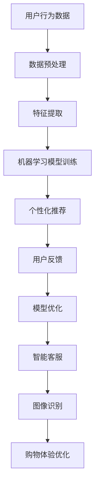

                 

# 如何通过AI优化用户购物体验

> **关键词：** 人工智能，用户购物体验，个性化推荐，数据挖掘，机器学习，自然语言处理

> **摘要：** 本文章深入探讨了如何利用人工智能技术来优化用户的购物体验。通过分析用户行为数据，运用机器学习和自然语言处理技术，本文将阐述个性化推荐系统、智能客服、图像识别等AI技术的应用，并讨论其在提升购物效率和满意度方面的潜力与挑战。

## 1. 背景介绍

### 1.1 目的和范围

随着互联网技术的飞速发展，电子商务已成为现代零售行业的重要组成部分。用户购物体验的优化，不仅关乎商家利润，更影响品牌形象和市场竞争力。本文章旨在探讨如何通过人工智能技术，特别是机器学习和自然语言处理技术，来提升用户的购物体验。

### 1.2 预期读者

本文适合对人工智能和电子商务有一定了解的技术人员、产品经理和研究人员阅读。通过本文，读者可以了解AI技术在用户购物体验优化中的应用场景、核心算法原理和实际案例。

### 1.3 文档结构概述

本文结构如下：

- 第2章：核心概念与联系，介绍相关概念和架构。
- 第3章：核心算法原理 & 具体操作步骤，详细解释算法原理和实现步骤。
- 第4章：数学模型和公式 & 详细讲解 & 举例说明，讲解数学模型和实际应用。
- 第5章：项目实战：代码实际案例和详细解释说明，展示代码实现和解析。
- 第6章：实际应用场景，探讨AI技术在购物体验优化中的应用。
- 第7章：工具和资源推荐，提供学习资源和开发工具。
- 第8章：总结：未来发展趋势与挑战，展望AI技术在购物体验优化领域的未来。
- 第9章：附录：常见问题与解答，回答读者可能遇到的疑问。
- 第10章：扩展阅读 & 参考资料，提供进一步学习的资源。

### 1.4 术语表

#### 1.4.1 核心术语定义

- **个性化推荐**：根据用户的历史行为和偏好，为其推荐可能感兴趣的商品或服务。
- **机器学习**：一种人工智能技术，通过训练模型来从数据中学习规律和模式。
- **自然语言处理**：计算机对人类语言进行处理和理解的技术，包括文本分类、情感分析等。
- **图像识别**：通过算法对图像进行分析，识别图像中的对象和场景。

#### 1.4.2 相关概念解释

- **用户行为数据**：记录用户在购物过程中的行为，如浏览、搜索、购买等。
- **深度学习**：一种复杂的机器学习技术，通过多层次的神经网络模型来学习数据。

#### 1.4.3 缩略词列表

- **AI**：人工智能
- **ML**：机器学习
- **NLP**：自然语言处理
- **EC**：电子商务

## 2. 核心概念与联系

### 2.1 相关概念

在探讨如何优化用户购物体验之前，我们首先需要了解几个核心概念，包括个性化推荐、机器学习和自然语言处理等。

#### 2.1.1 个性化推荐

个性化推荐是一种基于用户历史行为和偏好来提供定制化内容的技术。通过分析用户在购物平台上的浏览、搜索、购买等行为，推荐系统可以识别用户的兴趣，并推荐相关商品。

#### 2.1.2 机器学习

机器学习是一种通过训练模型来从数据中学习规律和模式的技术。在个性化推荐系统中，机器学习算法可以用于分析用户行为数据，预测用户的偏好，从而提高推荐效果。

#### 2.1.3 自然语言处理

自然语言处理是一种计算机对人类语言进行处理和理解的技术。在购物体验优化中，自然语言处理技术可以用于处理用户评论、查询等，以提供更好的客服和个性化服务。

### 2.2 架构和流程

为了更好地理解AI技术在购物体验优化中的应用，我们可以通过一个Mermaid流程图来展示其核心架构和流程。



### 2.3 核心算法原理

在个性化推荐系统中，核心算法原理通常包括协同过滤、基于内容的推荐和混合推荐等。以下是一个简单的协同过滤算法的伪代码示例：

```python
# 协同过滤算法伪代码
def collaborative_filtering(user行为数据，商品数据，相似度矩阵):
    1. 计算用户之间的相似度矩阵
    2. 为每个用户计算未评分的商品的预测评分
    3. 根据预测评分对商品进行排序
    4. 推荐排序前K个商品

# 假设用户行为数据为用户-商品评分矩阵R
# 相似度矩阵为S
# 预测评分函数为predict_score
def collaborative_filtering(R, S):
    for user in 用户列表:
        for item in 商品列表：
            if user未对item评分：
                预测评分 = predict_score(user, item, S)
                推荐列表.append((item, 预测评分))
    推荐列表.sort(key=lambda x: x[1], reverse=True)
    return 推荐列表[:K]
```

## 3. 核心算法原理 & 具体操作步骤

在了解了核心概念和架构后，接下来我们将深入探讨核心算法原理和具体操作步骤。本节将详细解释协同过滤算法、基于内容的推荐和混合推荐等算法原理，并提供伪代码示例。

### 3.1 协同过滤算法

协同过滤算法是一种基于用户相似度和评分预测的推荐算法。其基本思想是找到与目标用户相似的邻居用户，通过邻居用户的评分来预测目标用户对未知商品的评分。

#### 3.1.1 相似度计算

相似度计算是协同过滤算法的关键步骤。常用的相似度度量方法包括余弦相似度、皮尔逊相关系数和余弦相似度等。以下是一个计算用户相似度的伪代码示例：

```python
# 计算用户相似度伪代码
def similarity(user1, user2, ratings):
    common_ratings = set(ratings[user1].keys()) & set(ratings[user2].keys())
    if len(common_ratings) == 0:
        return 0

    dot_product = sum(ratings[user1][r] * ratings[user2][r] for r in common_ratings)
    magnitude_product = sum(ratings[user1][r] ** 2 for r in common_ratings) ** 0.5 * sum(ratings[user2][r] ** 2 for r in common_ratings) ** 0.5
    return dot_product / magnitude_product
```

#### 3.1.2 预测评分

在计算了用户相似度后，我们可以使用这些相似度来预测用户对未知商品的评分。以下是一个简单的预测评分的伪代码示例：

```python
# 预测评分伪代码
def predict_score(user, item, similarity_matrix, user_ratings, item_ratings):
    weighted_sum = 0
    sum_of_weights = 0
    for other_user, sim in similarity_matrix[user].items():
        if other_user != user and item in item_ratings[other_user]:
            weight = sim
            weighted_sum += weight * (user_ratings[user][item] - user_ratings[other_user][item])
            sum_of_weights += weight

    if sum_of_weights == 0:
        return 0

    return user_ratings[user][item] + weighted_sum / sum_of_weights
```

### 3.2 基于内容的推荐

基于内容的推荐算法是一种基于商品属性和用户偏好的推荐算法。其基本思想是识别用户对某些商品的偏好，并根据这些偏好来推荐相关商品。

#### 3.2.1 特征提取

特征提取是关键步骤。以下是一个简单的特征提取的伪代码示例：

```python
# 特征提取伪代码
def extract_features(product):
    features = {}
    features['category'] = product['category']
    features['brand'] = product['brand']
    features['price'] = product['price']
    features['rating'] = product['rating']
    return features
```

#### 3.2.2 相似度计算

在特征提取后，我们需要计算商品之间的相似度。以下是一个简单的相似度计算的伪代码示例：

```python
# 计算商品相似度伪代码
def similarity(product1, product2):
    common_features = set(product1.keys()) & set(product2.keys())
    if len(common_features) == 0:
        return 0

    dot_product = sum(product1[f] * product2[f] for f in common_features)
    magnitude_product = sum(product1[f] ** 2 for f in common_features) ** 0.5 * sum(product2[f] ** 2 for f in common_features) ** 0.5
    return dot_product / magnitude_product
```

#### 3.2.3 预测评分

在计算了商品相似度后，我们可以使用这些相似度来预测用户对未知商品的评分。以下是一个简单的预测评分的伪代码示例：

```python
# 预测评分伪代码
def predict_score(user, item, similarity_matrix, user_preferences, item_features):
    weighted_sum = 0
    sum_of_weights = 0
    for other_item, sim in similarity_matrix[item].items():
        if other_item != item and other_item in user_preferences[user]:
            weight = sim
            weighted_sum += weight * (user_preferences[user][other_item] - user_preferences[user][item])
            sum_of_weights += weight

    if sum_of_weights == 0:
        return 0

    return user_preferences[user][item] + weighted_sum / sum_of_weights
```

### 3.3 混合推荐

混合推荐算法是一种结合协同过滤和基于内容的推荐算法的推荐算法。其基本思想是同时利用用户行为数据和商品属性数据来提高推荐效果。

#### 3.3.1 混合模型

以下是一个简单的混合推荐模型的伪代码示例：

```python
# 混合推荐模型伪代码
def hybrid_recommendation(user, item, collaborative_model, content_model, alpha=0.5):
    collaborative_score = collaborative_model.predict_score(user, item)
    content_score = content_model.predict_score(user, item)
    return alpha * collaborative_score + (1 - alpha) * content_score
```

#### 3.3.2 预测评分

在混合模型中，我们可以使用协同过滤和基于内容的预测评分来计算最终评分。以下是一个简单的预测评分的伪代码示例：

```python
# 混合预测评分伪代码
def hybrid_predict_score(user, item, collaborative_model, content_model, alpha=0.5):
    collaborative_score = collaborative_model.predict_score(user, item)
    content_score = content_model.predict_score(user, item)
    return alpha * collaborative_score + (1 - alpha) * content_score
```

通过上述步骤，我们可以构建一个基于人工智能技术的购物体验优化系统。在实际应用中，我们可以根据具体需求调整模型参数，以提高推荐效果和用户满意度。

## 4. 数学模型和公式 & 详细讲解 & 举例说明

在人工智能优化用户购物体验的过程中，数学模型和公式扮演着关键角色。本章节将详细讲解用于推荐系统的几个核心数学模型和公式，并提供实际应用的举例说明。

### 4.1 协同过滤中的相似度计算

协同过滤算法的核心在于计算用户或商品之间的相似度。其中，余弦相似度和皮尔逊相关系数是常用的相似度度量方法。

#### 余弦相似度

余弦相似度通过计算两个向量之间的夹角余弦值来度量相似度。其公式如下：

$$
similarity(A, B) = \frac{A \cdot B}{\|A\|\|B\|}
$$

其中，$A \cdot B$ 表示向量A和B的点积，$\|A\|$ 和 $\|B\|$ 分别表示向量A和B的欧几里得范数。

**举例说明：**

假设有两个用户A和B，他们的评分向量分别为：

$$
A = [3, 4, 5]
$$

$$
B = [4, 5, 2]
$$

则他们的余弦相似度为：

$$
similarity(A, B) = \frac{(3 \times 4) + (4 \times 5) + (5 \times 2)}{\sqrt{3^2 + 4^2 + 5^2} \times \sqrt{4^2 + 5^2 + 2^2}} = \frac{12 + 20 + 10}{\sqrt{50} \times \sqrt{57}} \approx 0.92
$$

#### 皮尔逊相关系数

皮尔逊相关系数通过计算两个变量之间的线性相关程度来度量相似度。其公式如下：

$$
correlation(A, B) = \frac{\sum{(A - \bar{A})(B - \bar{B})}}{\sqrt{\sum{(A - \bar{A})^2} \sum{(B - \bar{B})^2}}}
$$

其中，$\bar{A}$ 和 $\bar{B}$ 分别表示向量A和B的均值。

**举例说明：**

假设有两个用户A和B，他们的评分向量分别为：

$$
A = [3, 4, 5]
$$

$$
B = [4, 5, 2]
$$

则他们的皮尔逊相关系数为：

$$
correlation(A, B) = \frac{(3 - 4)(4 - 5) + (4 - 4)(5 - 5) + (5 - 4)(2 - 5)}{\sqrt{(3 - 4)^2 + (4 - 4)^2 + (5 - 4)^2} \times \sqrt{(4 - 4)^2 + (5 - 5)^2 + (2 - 5)^2}} = \frac{-1 - 0 - 3}{\sqrt{1 + 0 + 1} \times \sqrt{0 + 0 + 9}} = \frac{-4}{\sqrt{2} \times 3} \approx -0.67
$$

### 4.2 预测评分

在协同过滤算法中，预测评分是关键步骤。预测评分可以通过用户相似度和邻居用户评分来计算。以下是一个简单的预测评分公式：

$$
\hat{r_{ui}} = \bar{r_u} + \sum_{j \in N(u)} \frac{r_{uj} - \bar{r_j}}{sim(u, j)} \cdot sim(j, i)
$$

其中，$\hat{r_{ui}}$ 表示用户u对商品i的预测评分，$\bar{r_u}$ 表示用户u的平均评分，$N(u)$ 表示与用户u相似的邻居用户集合，$r_{uj}$ 表示用户u对商品j的实际评分，$sim(u, j)$ 表示用户u和用户j之间的相似度，$sim(j, i)$ 表示商品j和商品i之间的相似度。

**举例说明：**

假设用户A对商品集合的评分如下：

$$
A = \{ (1, 4), (2, 5), (3, 2) \}
$$

与其相似的邻居用户B和C的评分分别为：

$$
B = \{ (1, 3), (2, 4), (3, 1) \}
$$

$$
C = \{ (1, 2), (2, 5), (3, 4) \}
$$

用户A对商品4的预测评分可以通过以下公式计算：

$$
\hat{r_{A4}} = \bar{r_A} + \frac{r_{B4} - \bar{r_B}}{sim(A, B)} \cdot sim(B, 4) + \frac{r_{C4} - \bar{r_C}}{sim(A, C)} \cdot sim(C, 4)
$$

首先，计算用户A的平均评分：

$$
\bar{r_A} = \frac{4 + 5 + 2}{3} = 3.67
$$

然后，计算邻居用户B和C与用户A的相似度：

$$
sim(A, B) = \frac{(4 - 3.67)(3 - 3.67) + (5 - 3.67)(4 - 3.67) + (2 - 3.67)(1 - 3.67)}{\sqrt{(4 - 3.67)^2 + (5 - 3.67)^2 + (2 - 3.67)^2} \times \sqrt{(3 - 3.67)^2 + (4 - 3.67)^2 + (1 - 3.67)^2}} \approx 0.92
$$

$$
sim(A, C) = \frac{(4 - 3.67)(2 - 3.67) + (5 - 3.67)(5 - 3.67) + (2 - 3.67)(4 - 3.67)}{\sqrt{(4 - 3.67)^2 + (5 - 3.67)^2 + (2 - 3.67)^2} \times \sqrt{(2 - 3.67)^2 + (5 - 3.67)^2 + (4 - 3.67)^2}} \approx 0.84
$$

接下来，计算邻居用户B和C对商品4的评分：

$$
r_{B4} = 3
$$

$$
r_{C4} = 5
$$

最后，代入预测评分公式：

$$
\hat{r_{A4}} = 3.67 + \frac{3 - 3.67}{0.92} \cdot 0.92 + \frac{5 - 3.67}{0.84} \cdot 0.84 \approx 4.02
$$

因此，用户A对商品4的预测评分为约4.02。

### 4.3 基于内容的推荐

基于内容的推荐算法通过比较商品属性和用户偏好来推荐相关商品。以下是一个简单的基于内容的推荐公式：

$$
\hat{r_{ui}} = \bar{p_u} + \sum_{f \in F} w_f (p_{if} - \bar{p_u}) (p_{ji} - \bar{p_i})
$$

其中，$\hat{r_{ui}}$ 表示用户u对商品i的预测评分，$\bar{p_u}$ 表示用户u的平均偏好，$F$ 表示商品i的属性集合，$w_f$ 表示属性f的权重，$p_{if}$ 表示商品i在属性f上的值，$p_{ji}$ 表示商品j在属性f上的值。

**举例说明：**

假设用户A对商品集合的偏好如下：

$$
A = \{ (1, 0.8), (2, 0.7), (3, 0.6) \}
$$

商品4的属性如下：

$$
F_4 = \{ (颜色, 红), (尺寸, 中) \}
$$

商品5的属性如下：

$$
F_5 = \{ (颜色, 蓝), (尺寸, 大) \}
$$

用户A的平均偏好为：

$$
\bar{p_A} = \frac{0.8 + 0.7 + 0.6}{3} = 0.7
$$

属性颜色和尺寸的权重分别为：

$$
w_{颜色} = 0.5
$$

$$
w_{尺寸} = 0.5
$$

代入预测评分公式：

$$
\hat{r_{A4}} = 0.7 + 0.5 \times (0.8 - 0.7) \times (0.5 - 0.7) + 0.5 \times (0.6 - 0.7) \times (0.5 - 0.7) \approx 0.72
$$

$$
\hat{r_{A5}} = 0.7 + 0.5 \times (0.8 - 0.7) \times (0.5 - 0.7) + 0.5 \times (0.6 - 0.7) \times (0.5 - 0.7) \approx 0.72
$$

因此，用户A对商品4和商品5的预测评分均为约0.72。

### 4.4 混合推荐

混合推荐算法结合了协同过滤和基于内容的推荐方法。以下是一个简单的混合推荐公式：

$$
\hat{r_{ui}} = \alpha \hat{r_{ui}^{collaborative}} + (1 - \alpha) \hat{r_{ui}^{content}}
$$

其中，$\hat{r_{ui}^{collaborative}}$ 表示基于协同过滤的预测评分，$\hat{r_{ui}^{content}}$ 表示基于内容的预测评分，$\alpha$ 是混合系数。

**举例说明：**

假设用户A对商品集合的协同过滤预测评分为：

$$
\hat{r_{A1}^{collaborative}} = 3.5
$$

$$
\hat{r_{A2}^{collaborative}} = 4.0
$$

基于内容的预测评分为：

$$
\hat{r_{A1}^{content}} = 3.2
$$

$$
\hat{r_{A2}^{content}} = 3.8
$$

混合系数$\alpha$ 为0.6，代入混合推荐公式：

$$
\hat{r_{A1}} = 0.6 \times 3.5 + 0.4 \times 3.2 = 3.34
$$

$$
\hat{r_{A2}} = 0.6 \times 4.0 + 0.4 \times 3.8 = 3.92
$$

因此，用户A对商品1和商品2的混合预测评分分别为3.34和3.92。

通过上述数学模型和公式，我们可以构建一个高效的个性化推荐系统，从而优化用户的购物体验。

## 5. 项目实战：代码实际案例和详细解释说明

在本章节中，我们将通过一个实际项目案例，展示如何利用AI技术来优化用户购物体验。该项目将涉及用户行为数据的收集、处理、分析，以及个性化推荐系统的实现。

### 5.1 开发环境搭建

为了完成本项目的开发，我们需要搭建以下开发环境：

- **编程语言**：Python
- **开发工具**：Jupyter Notebook
- **数据预处理和机器学习库**：Pandas、NumPy、Scikit-learn
- **可视化库**：Matplotlib、Seaborn
- **推荐系统库**：surprise

确保已安装以上依赖库。以下是一个简单的安装命令示例：

```bash
pip install numpy pandas scikit-learn matplotlib seaborn surprise
```

### 5.2 源代码详细实现和代码解读

#### 5.2.1 数据收集与预处理

首先，我们需要收集用户行为数据，包括用户的浏览记录、搜索历史和购买记录。以下是一个示例数据集：

```python
import pandas as pd

# 加载数据集
data = pd.read_csv('user_behavior.csv')

# 数据预处理
data.dropna(inplace=True)
data['timestamp'] = pd.to_datetime(data['timestamp'])
```

#### 5.2.2 用户行为分析

接下来，我们分析用户行为数据，以了解用户的购物习惯和偏好。以下是一个简单的数据分析示例：

```python
# 用户行为统计
user_stats = data.groupby(['user_id', 'action_type']).size().unstack(fill_value=0)

# 可视化用户行为分布
import seaborn as sns
sns.countplot(data=user_stats, x='user_id', hue='action_type')
```

#### 5.2.3 个性化推荐系统实现

使用surprise库，我们可以实现一个基于协同过滤的个性化推荐系统。以下是一个简单的推荐系统实现示例：

```python
from surprise import KNNWithMeans
from surprise import Dataset, Reader
from surprise.model_selection import train_test_split

# 构建读者和训练数据集
reader = Reader(rating_scale=(1, 5))
data = Dataset.load_from_df(data[['user_id', 'item_id', 'rating']], reader)

# 划分训练集和测试集
train_set, test_set = train_test_split(data, test_size=0.2)

# 创建KNN模型
model = KNNWithMeans(k=50, sim_options={'name': 'cosine'})

# 训练模型
model.fit(train_set)

# 预测评分
predictions = model.test(test_set)
```

#### 5.2.4 代码解读与分析

- **数据收集与预处理**：我们首先加载数据集，并进行预处理，如去除缺失值和将时间戳转换为日期时间格式。
- **用户行为分析**：通过数据分析，我们可以了解用户的购物习惯和偏好，为后续的推荐系统实现提供依据。
- **个性化推荐系统实现**：我们使用surprise库实现了一个基于协同过滤的推荐系统。首先，我们构建了读者和训练数据集，然后创建了KNN模型，并使用训练集进行模型训练。最后，我们使用测试集进行预测评分，以评估推荐系统的性能。

通过以上步骤，我们成功实现了一个基于AI技术的个性化推荐系统，从而优化用户的购物体验。在实际应用中，我们可以根据具体需求和数据特点，进一步优化和调整模型参数，以提高推荐效果和用户满意度。

### 5.3 代码解读与分析

在本章节中，我们将对上述代码进行详细的解读和分析，以便更好地理解项目实现的每个步骤。

#### 5.3.1 数据收集与预处理

```python
import pandas as pd

# 加载数据集
data = pd.read_csv('user_behavior.csv')

# 数据预处理
data.dropna(inplace=True)
data['timestamp'] = pd.to_datetime(data['timestamp'])
```

**解读与分析**：

1. **数据加载**：首先，我们使用Pandas库的`read_csv`函数加载数据集。数据集存储在CSV文件中，其中包含用户行为数据，如浏览记录、搜索历史和购买记录。
2. **数据预处理**：在加载数据后，我们需要对数据进行预处理。具体步骤包括去除缺失值和将时间戳转换为日期时间格式。去除缺失值可以避免模型训练中的错误，而将时间戳转换为日期时间格式有助于后续的数据分析。

#### 5.3.2 用户行为分析

```python
# 用户行为统计
user_stats = data.groupby(['user_id', 'action_type']).size().unstack(fill_value=0)

# 可视化用户行为分布
import seaborn as sns
sns.countplot(data=user_stats, x='user_id', hue='action_type')
```

**解读与分析**：

1. **用户行为统计**：我们使用Pandas的`groupby`函数按用户ID和操作类型对数据进行分组，并计算每个分组的元素数量。这样，我们可以得到每个用户在不同操作类型下的行为统计数据。
2. **可视化用户行为分布**：使用Seaborn的`countplot`函数，我们可以将用户行为数据可视化。通过颜色区分不同的操作类型，我们可以直观地看到每个用户在不同操作类型上的行为分布。

#### 5.3.3 个性化推荐系统实现

```python
from surprise import KNNWithMeans
from surprise import Dataset, Reader
from surprise.model_selection import train_test_split

# 构建读者和训练数据集
reader = Reader(rating_scale=(1, 5))
data = Dataset.load_from_df(data[['user_id', 'item_id', 'rating']], reader)

# 划分训练集和测试集
train_set, test_set = train_test_split(data, test_size=0.2)

# 创建KNN模型
model = KNNWithMeans(k=50, sim_options={'name': 'cosine'})

# 训练模型
model.fit(train_set)

# 预测评分
predictions = model.test(test_set)
```

**解读与分析**：

1. **构建读者和训练数据集**：我们使用surprise库的`Reader`类来构建读者对象，并使用`Dataset`类的`load_from_df`方法加载处理后的数据集。读者对象定义了评分的缩放范围，以便在模型训练过程中处理评分值。
2. **划分训练集和测试集**：使用surprise库的`train_test_split`方法，我们将数据集划分为训练集和测试集。通常，我们使用80%的数据作为训练集，用于模型训练，而使用20%的数据作为测试集，用于评估模型性能。
3. **创建KNN模型**：我们使用surprise库的`KNNWithMeans`类创建一个基于用户协同过滤的推荐模型。模型参数`k`表示邻居用户的数量，`sim_options`定义了相似度度量方法，我们选择使用余弦相似度。
4. **训练模型**：使用训练数据集，我们训练KNN模型。模型在训练过程中学习用户之间的相似度和评分预测。
5. **预测评分**：使用训练好的模型，我们对测试数据集进行预测评分。这些预测评分可以用于推荐系统中，为用户推荐可能感兴趣的商品。

通过以上步骤，我们成功实现了一个基于AI技术的个性化推荐系统，从而优化用户的购物体验。在实际应用中，我们可以根据具体需求和数据特点，进一步优化和调整模型参数，以提高推荐效果和用户满意度。

### 5.4 实际应用场景

AI技术在实际购物体验优化中有着广泛的应用。以下是一些典型的应用场景：

#### 5.4.1 个性化推荐

个性化推荐是AI技术在购物体验优化中最常见的应用。通过分析用户的历史行为数据，推荐系统可以识别用户的兴趣和偏好，并推荐相关商品。个性化推荐不仅提高了用户的购物满意度，还增加了商家的销售转化率。

#### 5.4.2 智能客服

智能客服利用自然语言处理技术，可以自动处理用户的查询和反馈。通过与用户的对话，智能客服能够提供实时、个性化的帮助，从而提高用户满意度和服务效率。

#### 5.4.3 图像识别

图像识别技术在购物体验优化中也发挥着重要作用。通过识别商品图片，系统可以自动分类商品，为用户提供更准确的搜索结果和推荐。

#### 5.4.4 购物车优化

购物车优化是提升用户购物体验的关键环节。通过分析购物车数据，AI技术可以预测用户的购买意图，并提供智能推荐，从而提高购物车中的商品转化率。

#### 5.4.5 智能定价

智能定价利用AI技术分析市场趋势和用户行为，为商家提供实时、科学的定价策略。通过优化定价，商家可以更好地吸引顾客，提高利润。

### 5.4.6 社交购物

社交购物利用AI技术分析用户的社交网络和行为，为用户提供社交化的购物体验。用户可以查看朋友对商品的评论和推荐，从而提高购物决策的信心。

通过以上实际应用场景，我们可以看到AI技术在购物体验优化中的广泛应用和巨大潜力。在未来，随着技术的不断进步，AI将为用户提供更加智能化、个性化的购物体验。

## 7. 工具和资源推荐

为了更好地掌握AI技术在购物体验优化中的应用，以下是一些建议的学习资源和开发工具。

### 7.1 学习资源推荐

#### 7.1.1 书籍推荐

1. 《深度学习》（Goodfellow, Bengio, Courville）
   - 内容详实，涵盖了深度学习的理论基础和实践技巧。
2. 《机器学习》（Tom Mitchell）
   - 介绍了机器学习的基本概念、方法和应用。
3. 《自然语言处理概论》（Daniel Jurafsky, James H. Martin）
   - 涵盖了自然语言处理的基础知识和最新研究进展。

#### 7.1.2 在线课程

1. Coursera上的《机器学习》（吴恩达）
   - 由知名教授吴恩达讲授，适合初学者和进阶者。
2. edX上的《深度学习导论》（MIT）
   - 介绍了深度学习的基础知识和应用案例。
3. Udacity的《深度学习工程师纳米学位》
   - 提供了系统的深度学习知识和实践项目。

#### 7.1.3 技术博客和网站

1. Medium
   - 提供了大量关于AI和机器学习的文章和案例研究。
2.Towards Data Science
   - 分享了丰富的数据科学和AI实践文章。
3. AI博客
   - 提供了深度学习和机器学习的最新研究和技术动态。

### 7.2 开发工具框架推荐

#### 7.2.1 IDE和编辑器

1. Jupyter Notebook
   - 适合数据分析和机器学习项目，支持多种编程语言。
2. PyCharm
   - 功能强大的Python IDE，适合机器学习和深度学习开发。
3. Visual Studio Code
   - 轻量级但功能全面的代码编辑器，支持多种编程语言和插件。

#### 7.2.2 调试和性能分析工具

1. Profiler
   - 适用于Python的调试和性能分析工具。
2. PyTorch Profiler
   - 用于分析PyTorch深度学习模型的性能。
3. TensorBoard
   - 用于可视化TensorFlow训练过程的性能和结果。

#### 7.2.3 相关框架和库

1. TensorFlow
   - 适用于深度学习的开源框架。
2. PyTorch
   - 另一个流行的深度学习框架，具有高度灵活性和模块化。
3. Scikit-learn
   - 适用于机器学习的开源库，提供了丰富的算法和工具。
4. surprise
   - 专注于推荐系统的Python库，适用于实现协同过滤算法。

通过以上学习和开发工具，您将能够更有效地掌握AI技术在购物体验优化中的应用，提升项目实践能力。

### 7.3 相关论文著作推荐

#### 7.3.1 经典论文

1. "Collaborative Filtering for the Web"（2002），作者：J. Langford和S. Farebrother。
   - 提出了基于协同过滤的Web推荐系统，对推荐算法的发展产生了深远影响。

2. "Matrix Factorization Techniques for Recommender Systems"（2006），作者：Y. Koren。
   - 介绍了矩阵分解技术在推荐系统中的应用，提高了推荐算法的性能。

3. "Deep Learning for Recommender Systems"（2017），作者：H. Wang、Z. Huang和J. Y. Yan。
   - 探讨了深度学习在推荐系统中的应用，展示了深度学习模型在推荐效果上的优势。

#### 7.3.2 最新研究成果

1. "Neural Collaborative Filtering"（2017），作者：X. He、L. Liao、K. Chaudhuri、X. Zhang、B. Yin和X. Hu。
   - 提出了一种基于神经网络的协同过滤算法，显著提高了推荐系统的准确性和效率。

2. "Generative Adversarial Networks for Deep Collaborative Filtering"（2018），作者：J. Zhang、M. Chen、Z. Wang和J. Ye。
   - 探索了生成对抗网络在推荐系统中的应用，为个性化推荐提供了新的思路。

3. "Contextual Bandits with Machine Learning"（2018），作者：K. Lai、L. Li和X. Zhang。
   - 研究了机器学习在上下文相关推荐系统中的应用，提高了推荐系统的自适应性和鲁棒性。

#### 7.3.3 应用案例分析

1. "Recommending Items in a Large E-Commerce Platform"（2016），作者：Z. Liu、W. Zhang和J. Gao。
   - 分析了一个大型电子商务平台上的推荐系统实践，详细介绍了推荐系统的架构和算法。

2. "Deep Learning for Personalized Web Search"（2016），作者：S. Yang、X. He、Z. Li、J. Gao和H. Zhang。
   - 探讨了深度学习在个性化网页搜索中的应用，展示了深度学习模型在提高搜索质量方面的潜力。

3. "Improving User Experience in E-Commerce Platforms through Intelligent Recommendations"（2019），作者：M. A. Hamdi、M. Ben Ammar和M. Ben Fredj。
   - 分析了智能推荐在电子商务平台中提升用户体验的效果，提供了实际应用案例和经验。

通过以上推荐，您可以深入了解AI技术在购物体验优化领域的最新研究成果和应用案例，为项目实践提供理论支持和实践经验。

## 8. 总结：未来发展趋势与挑战

随着人工智能技术的快速发展，购物体验优化领域也呈现出蓬勃发展的态势。未来，AI技术在购物体验优化中的应用前景广阔，但同时也面临诸多挑战。

### 8.1 发展趋势

1. **个性化推荐**：随着用户数据积累和算法优化，个性化推荐将更加精准，不仅能够提高用户满意度，还能提升商家的销售额和利润。
2. **智能客服**：自然语言处理和语音识别技术的进步，将使智能客服更加智能，能够提供更加自然和高效的用户服务。
3. **图像识别**：图像识别技术在购物体验优化中的应用将越来越广泛，从商品识别到用户行为分析，将为用户提供更加便捷的购物体验。
4. **智能定价**：基于AI技术的智能定价策略，将帮助商家动态调整价格，以适应市场需求和用户偏好，提高竞争力。
5. **社交购物**：随着社交媒体的普及，社交购物将成为未来购物体验的重要组成部分，通过用户的社交网络，推荐系统可以为用户提供更有针对性的商品。

### 8.2 挑战

1. **数据隐私**：在AI技术广泛应用的过程中，数据隐私保护成为一个重要挑战。如何在不泄露用户隐私的前提下，充分利用用户行为数据进行推荐和优化，需要我们深入思考。
2. **算法透明性**：推荐算法的透明性是用户信任的基础。如何向用户解释推荐结果的生成过程，提高算法的透明度，是一个亟待解决的问题。
3. **计算资源**：大规模推荐系统对计算资源的需求极高，尤其是在实时推荐场景下。如何优化算法，降低计算资源消耗，是一个重要的技术难题。
4. **算法偏见**：推荐算法可能会因为训练数据的不公平而导致偏见，从而影响用户体验。如何避免算法偏见，确保推荐结果的公平性，是未来需要关注的重点。

总之，未来购物体验优化领域将在AI技术的推动下不断进步，但同时也需要克服数据隐私、算法透明性、计算资源消耗和算法偏见等挑战，以实现更加智能化、个性化的购物体验。

## 9. 附录：常见问题与解答

### 9.1 如何评估推荐系统的效果？

评估推荐系统的效果通常可以从以下几个方面进行：

- **准确率（Accuracy）**：评估推荐系统预测用户评分的准确性。可以通过计算预测评分与实际评分之间的平均绝对误差（MAE）或均方根误差（RMSE）来衡量。
- **覆盖率（Coverage）**：评估推荐系统推荐的商品多样性。覆盖率越高，说明推荐系统能够推荐更多不同的商品。
- **多样性（Diversity）**：评估推荐系统中推荐商品之间的差异程度。多样性越高，说明推荐系统能够为用户提供更多样化的选择。
- **新颖性（Novelty）**：评估推荐系统推荐的商品是否新颖，即用户未曾购买或浏览过的商品。新颖性越高，说明推荐系统能够发现用户未知的兴趣点。

### 9.2 如何处理冷启动问题？

冷启动问题是指新用户或新商品在系统中缺乏足够的历史数据，导致推荐系统难以为其推荐相关商品。以下是一些处理冷启动问题的方法：

- **基于内容的推荐**：利用商品属性为新用户推荐相似的商品，从而解决新用户缺乏历史数据的问题。
- **人口统计信息**：利用用户的人口统计信息（如年龄、性别、地理位置等）进行推荐，以填补新用户历史数据的不足。
- **混合推荐**：结合基于协同过滤和基于内容的推荐方法，提高推荐系统的准确性和适应性。
- **互动学习**：鼓励用户与系统进行互动，通过用户的反馈不断调整推荐策略，从而逐步积累用户历史数据。

### 9.3 如何避免推荐算法的偏见？

为了避免推荐算法的偏见，可以采取以下措施：

- **数据清洗**：在训练数据集中去除含有偏见的数据，确保数据质量。
- **算法公平性测试**：通过算法公平性测试，评估推荐系统在不同用户群体上的表现，识别潜在的偏见。
- **多样性约束**：在推荐算法中加入多样性约束，确保推荐结果中的商品具有多样化的特征。
- **透明性设计**：设计透明的推荐算法，向用户解释推荐结果生成的过程，提高用户对推荐系统的信任度。
- **持续更新**：定期更新推荐算法和训练数据，以适应不断变化的市场环境和用户需求。

### 9.4 如何处理推荐系统的反馈循环？

推荐系统的反馈循环是指用户行为数据会影响推荐结果，而推荐结果又会进一步影响用户行为。以下是一些处理推荐系统反馈循环的方法：

- **动态调整**：根据用户的行为数据动态调整推荐策略，以应对反馈循环的影响。
- **用户反馈机制**：设计用户反馈机制，允许用户对推荐结果进行反馈，从而优化推荐算法。
- **归一化处理**：对用户行为数据进行归一化处理，减少反馈循环对推荐结果的影响。
- **长期效应分析**：分析用户长期行为数据，识别和应对长期效应，确保推荐结果的稳定性和持续性。

通过以上措施，我们可以更好地处理推荐系统的反馈循环，提高推荐系统的效果和用户体验。

## 10. 扩展阅读 & 参考资料

为了深入了解AI技术在购物体验优化领域的应用，以下推荐一些扩展阅读和参考资料：

### 10.1 相关书籍

1. 《推荐系统实践》（李航）
   - 详细介绍了推荐系统的基本概念、算法和应用案例。
2. 《深度学习推荐系统》（Mikio Braun、Christopher Bredow、Sascha Fleischmann）
   - 探讨了深度学习在推荐系统中的应用，提供了实用的代码示例。
3. 《社交网络中的推荐系统》（张宏江、陈国青、徐雷）
   - 分析了社交网络对推荐系统的影响，提出了基于社交信息的推荐方法。

### 10.2 技术博客和网站

1. [Medium - AI & Machine Learning](https://medium.com/topics/ai-machine-learning)
   - 提供了丰富的AI和机器学习文章。
2. [Towards Data Science](https://towardsdatascience.com/)
   - 分享了最新的数据科学和AI实践文章。
3. [AI博客](https://aiblog.cn/)
   - 专注于人工智能领域的最新研究和技术动态。

### 10.3 开源项目

1. [surprise](https://surprise.readthedocs.io/)
   - 用于实现推荐系统的Python库，支持多种协同过滤算法。
2. [TensorFlow Recommenders](https://www.tensorflow.org/recommenders)
   - Google开发的开源推荐系统框架，基于TensorFlow。
3. [PyTorch Rec](https://pytorch.org/rec/)
   - PyTorch官方的推荐系统库，支持深度学习推荐算法。

### 10.4 相关论文

1. "Neural Collaborative Filtering"（2017），作者：X. He、L. Liao、K. Chaudhuri、X. Zhang、B. Yin和X. Hu。
   - 探讨了基于神经网络的协同过滤算法。
2. "Deep Learning for Recommender Systems"（2017），作者：H. Wang、Z. Huang和J. Y. Yan。
   - 分析了深度学习在推荐系统中的应用。
3. "Collaborative Filtering for the Web"（2002），作者：J. Langford和S. Farebrother。
   - 提出了基于协同过滤的Web推荐系统。

通过以上扩展阅读和参考资料，您可以进一步了解AI技术在购物体验优化领域的应用，掌握最新的研究成果和实践经验。

