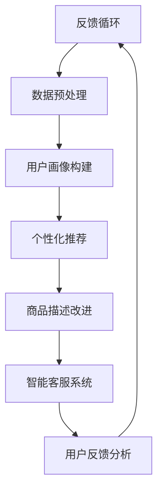

                 

# 如何通过AI优化用户购物体验

> **关键词：** AI、购物体验、用户行为分析、个性化推荐、机器学习、自然语言处理

> **摘要：** 本文将深入探讨如何利用人工智能（AI）技术来优化用户的购物体验。我们将从背景介绍出发，逐步分析核心概念、算法原理、数学模型，并通过实际项目案例展示AI在购物体验优化中的应用。此外，还将推荐相关的学习资源和开发工具，并总结未来发展趋势与挑战。

## 1. 背景介绍

### 1.1 目的和范围

本文的目的是探讨如何通过人工智能技术提升用户的购物体验。我们将重点关注以下几个方面：

1. **用户行为分析**：通过分析用户的历史购物数据和在线行为，为用户提供个性化的购物推荐。
2. **个性化推荐系统**：利用机器学习算法，根据用户偏好和历史行为为用户提供相关商品推荐。
3. **自然语言处理**：通过理解和分析用户在购物平台上的评论和反馈，改进商品描述和搜索功能。
4. **智能客服系统**：利用AI技术提供高效的客服支持，解答用户疑问，提高用户满意度。

### 1.2 预期读者

本文适合以下读者群体：

1. 对人工智能和机器学习感兴趣的读者。
2. 想要在购物平台中应用AI技术的开发者和技术人员。
3. 对提升用户体验和运营效率感兴趣的电商从业者。

### 1.3 文档结构概述

本文将分为以下几个部分：

1. **背景介绍**：介绍本文的目的和范围，预期读者以及文档结构。
2. **核心概念与联系**：介绍与购物体验优化相关的核心概念和流程。
3. **核心算法原理 & 具体操作步骤**：详细讲解优化购物体验所使用的算法原理和操作步骤。
4. **数学模型和公式 & 详细讲解 & 举例说明**：阐述数学模型在购物体验优化中的应用。
5. **项目实战：代码实际案例和详细解释说明**：通过实际项目案例展示AI在购物体验优化中的应用。
6. **实际应用场景**：分析AI在购物体验优化中的实际应用场景。
7. **工具和资源推荐**：推荐学习资源和开发工具。
8. **总结：未来发展趋势与挑战**：总结未来发展趋势和面临的技术挑战。
9. **附录：常见问题与解答**：提供常见问题的解答。
10. **扩展阅读 & 参考资料**：推荐相关扩展阅读和参考资料。

### 1.4 术语表

#### 1.4.1 核心术语定义

- **人工智能（AI）**：模拟人类智能的计算机系统，具备学习、推理、感知和决策能力。
- **机器学习（ML）**：一种AI技术，通过数据和算法使计算机具备自主学习和改进的能力。
- **用户行为分析**：对用户在购物平台上的行为进行数据收集、分析和挖掘，以了解用户偏好和需求。
- **个性化推荐**：基于用户历史行为和偏好，为用户推荐相关商品。
- **自然语言处理（NLP）**：人工智能的一个分支，专注于使计算机理解和生成人类语言。

#### 1.4.2 相关概念解释

- **数据挖掘**：从大量数据中提取有价值的信息和知识的过程。
- **协同过滤**：一种常见的推荐算法，通过分析用户行为和偏好，为用户推荐类似的其他用户喜欢的商品。
- **深度学习**：一种机器学习技术，通过模拟人脑神经网络结构和学习机制来提取特征和进行预测。
- **用户画像**：对用户特征进行描述和分类的过程，包括年龄、性别、地理位置、购买偏好等。

#### 1.4.3 缩略词列表

- **NLP**：自然语言处理
- **ML**：机器学习
- **AI**：人工智能
- **DL**：深度学习
- **CM**：协同过滤
- **UGC**：用户生成内容

## 2. 核心概念与联系

在优化用户购物体验的过程中，理解核心概念和它们之间的联系至关重要。以下是一个简化的Mermaid流程图，展示了与购物体验优化相关的主要概念和流程。



### 2.1. 用户行为数据

用户行为数据是优化购物体验的基础。这些数据包括用户的浏览历史、购买记录、评价和反馈等。通过收集和分析这些数据，我们可以了解用户的偏好和需求，为后续的推荐和改进提供依据。

### 2.2. 数据预处理

原始的用户行为数据通常包含噪声和不完整的信息。因此，在分析之前，需要进行数据预处理，包括数据清洗、去重、填充缺失值等操作。数据预处理是确保分析结果准确和可靠的关键步骤。

### 2.3. 用户画像构建

用户画像是对用户特征进行描述和分类的过程。通过构建用户画像，我们可以更好地理解用户的偏好和行为模式，为后续的推荐和改进提供依据。用户画像通常包括年龄、性别、地理位置、购买偏好等维度。

### 2.4. 个性化推荐

个性化推荐是基于用户画像和用户行为数据为用户推荐相关商品的一种技术。常见的推荐算法包括协同过滤、基于内容的推荐和混合推荐等。个性化推荐的目标是提高用户满意度和转化率。

### 2.5. 商品描述改进

商品描述是用户购买决策的重要因素。通过自然语言处理技术，我们可以分析用户评论和反馈，改进商品描述，使其更贴近用户需求和偏好。这有助于提高用户的购买意愿和满意度。

### 2.6. 智能客服系统

智能客服系统利用人工智能技术，为用户提供实时、高效的客服支持。通过自然语言处理和机器学习算法，智能客服系统可以理解用户的问题并给出合适的回答，提高用户满意度。

### 2.7. 用户反馈分析

用户反馈是优化购物体验的重要来源。通过分析用户反馈，我们可以发现问题和改进机会，不断优化产品和服务。用户反馈分析可以包括评论分析、问卷调查和用户访谈等。

### 2.8. 反馈循环

反馈循环是购物体验优化过程中的关键环节。通过不断收集和分析用户反馈，我们可以不断调整和优化推荐算法、商品描述和客服系统，以提升用户体验。反馈循环确保了购物体验的持续改进。

## 3. 核心算法原理 & 具体操作步骤

### 3.1. 协同过滤算法原理

协同过滤（Collaborative Filtering，简称CF）是一种常用的推荐算法，其核心思想是通过分析用户之间的行为模式，为用户推荐相似的用户喜欢的商品。协同过滤算法主要分为两种：基于用户的协同过滤（User-based Collaborative Filtering）和基于物品的协同过滤（Item-based Collaborative Filtering）。

#### 基于用户的协同过滤

1. **相似度计算**：计算用户之间的相似度。常用的相似度度量方法包括余弦相似度、皮尔逊相关系数等。

    ```python
    def cosine_similarity(user1, user2):
        dot_product = sum(user1[i] * user2[i] for i in range(len(user1)))
        norm_user1 = math.sqrt(sum(user1[i]**2 for i in range(len(user1))))
        norm_user2 = math.sqrt(sum(user2[i]**2 for i in range(len(user2))))
        return dot_product / (norm_user1 * norm_user2)
    ```

2. **最近邻选择**：选择与目标用户最相似的一组用户。

3. **推荐计算**：根据最近邻用户的评分，为目标用户推荐评分较高的商品。

    ```python
    def predict_score(target_user, neighbors, item):
        scores = [neighbor[item] for neighbor in neighbors]
        return sum(score for score in scores) / len(scores)
    ```

#### 基于物品的协同过滤

1. **相似度计算**：计算物品之间的相似度。常用的相似度度量方法包括余弦相似度、Jaccard相似度等。

    ```python
    def jaccard_similarity(item1, item2):
        intersection = set(item1).intersection(item2)
        union = set(item1).union(item2)
        return len(intersection) / len(union)
    ```

2. **最近邻选择**：选择与目标物品最相似的一组物品。

3. **推荐计算**：根据最近邻物品的评分，为用户推荐评分较高的商品。

    ```python
    def predict_score(target_user, neighbors, item):
        scores = [neighbor[item] for neighbor in neighbors]
        return sum(score for score in scores) / len(scores)
    ```

### 3.2. 基于内容的推荐算法原理

基于内容的推荐（Content-based Recommender System）是一种基于用户偏好和物品属性为用户推荐相关商品的技术。基于内容的推荐算法主要通过以下步骤实现：

1. **特征提取**：从商品描述中提取关键词和属性，如颜色、尺寸、品牌等。

    ```python
    def extract_features(item_description):
        words = word_tokenize(item_description)
        return set(words)
    ```

2. **用户偏好建模**：根据用户的历史行为和评价，构建用户偏好模型。

    ```python
    def build_user_profile(user_history):
        profile = {}
        for item, rating in user_history.items():
            profile[item] = extract_features(item['description'])
        return profile
    ```

3. **相似度计算**：计算用户偏好模型和物品特征之间的相似度。常用的相似度度量方法包括余弦相似度、Jaccard相似度等。

    ```python
    def cosine_similarity(user_profile, item_features):
        dot_product = sum(user_profile[word] * item_features[word] for word in user_profile)
        norm_user = math.sqrt(sum(user_profile[word]**2 for word in user_profile))
        norm_item = math.sqrt(sum(item_features[word]**2 for word in item_features))
        return dot_product / (norm_user * norm_item)
    ```

4. **推荐计算**：根据物品特征与用户偏好模型之间的相似度，为用户推荐相似度较高的商品。

    ```python
    def recommend_items(user_profile, items, similarity_threshold):
        recommendations = []
        for item in items:
            similarity = cosine_similarity(user_profile, item['features'])
            if similarity >= similarity_threshold:
                recommendations.append(item)
        return recommendations
    ```

### 3.3. 混合推荐算法原理

混合推荐（Hybrid Recommender System）是一种结合协同过滤和基于内容的推荐算法的推荐系统。混合推荐算法通过以下步骤实现：

1. **协同过滤推荐**：使用协同过滤算法为用户推荐相似用户喜欢的商品。

    ```python
    def collaborative_filtering推荐(user, neighbors, items):
        recommendations = []
        for neighbor in neighbors:
            for item in items:
                if item not in neighbor:
                    recommendation_score = predict_score(user, neighbor, item)
                    recommendations.append((item, recommendation_score))
        return recommendations
    ```

2. **基于内容推荐**：使用基于内容的推荐算法为用户推荐相似物品。

    ```python
    def content_based推荐(user_profile, items, similarity_threshold):
        recommendations = []
        for item in items:
            similarity = cosine_similarity(user_profile, item['features'])
            if similarity >= similarity_threshold:
                recommendations.append(item)
        return recommendations
    ```

3. **融合推荐**：将协同过滤推荐和基于内容推荐的结果进行融合，为用户推荐最终推荐列表。

    ```python
    def hybrid_recommendations(user, neighbors, items, similarity_threshold):
        collaborative_recommendations = collaborative_filtering推荐(user, neighbors, items)
        content_based_recommendations = content_based推荐(user_profile, items, similarity_threshold)
        recommendations = collaborative_recommendations + content_based_recommendations
        return recommendations
    ```

## 4. 数学模型和公式 & 详细讲解 & 举例说明

### 4.1. 余弦相似度

余弦相似度（Cosine Similarity）是一种常用的相似度度量方法，用于计算两个向量之间的相似度。在购物体验优化中，余弦相似度可以用于计算用户偏好模型和物品特征之间的相似度。

公式：

$$
\text{Cosine Similarity} = \frac{\text{dot\_product}}{\|\mathbf{u}\| \|\mathbf{v}\|}
$$

其中，$\mathbf{u}$ 和 $\mathbf{v}$ 分别表示两个向量，$\|\mathbf{u}\|$ 和 $\|\mathbf{v}\|$ 分别表示向量的模长。

举例说明：

假设有两个向量 $\mathbf{u} = (1, 2, 3)$ 和 $\mathbf{v} = (4, 5, 6)$，我们可以使用余弦相似度计算它们之间的相似度：

$$
\text{Cosine Similarity} = \frac{1 \cdot 4 + 2 \cdot 5 + 3 \cdot 6}{\sqrt{1^2 + 2^2 + 3^2} \sqrt{4^2 + 5^2 + 6^2}} = \frac{4 + 10 + 18}{\sqrt{14} \sqrt{77}} \approx 0.9659
$$

### 4.2. 皮尔逊相关系数

皮尔逊相关系数（Pearson Correlation Coefficient）是另一种常用的相似度度量方法，用于计算两个变量之间的线性相关性。在购物体验优化中，皮尔逊相关系数可以用于计算用户评分和物品特征之间的相关性。

公式：

$$
r_{xy} = \frac{\sum_{i=1}^{n}(x_i - \bar{x})(y_i - \bar{y})}{\sqrt{\sum_{i=1}^{n}(x_i - \bar{x})^2} \sqrt{\sum_{i=1}^{n}(y_i - \bar{y})^2}}
$$

其中，$x_i$ 和 $y_i$ 分别表示两个变量 $x$ 和 $y$ 的取值，$\bar{x}$ 和 $\bar{y}$ 分别表示变量 $x$ 和 $y$ 的平均值。

举例说明：

假设有两个变量 $x$ 和 $y$ 的数据如下表：

| $x$ | $y$ |
| --- | --- |
| 1   | 2   |
| 2   | 4   |
| 3   | 6   |
| 4   | 8   |

我们可以计算 $x$ 和 $y$ 之间的皮尔逊相关系数：

$$
r_{xy} = \frac{(1-3)(2-5) + (2-3)(4-5) + (3-3)(6-5) + (4-3)(8-5)}{\sqrt{(1-3)^2 + (2-3)^2 + (3-3)^2 + (4-3)^2} \sqrt{(2-5)^2 + (4-5)^2 + (6-5)^2 + (8-5)^2}} = \frac{-8 + 2 + 0 + 4}{\sqrt{4 + 1 + 0 + 1} \sqrt{9 + 1 + 1 + 9}} = \frac{-2}{\sqrt{6} \sqrt{20}} \approx -0.8165
$$

### 4.3. 费舍尔信息

费舍尔信息（Fisher Information）是衡量统计模型对参数估计有效性的指标。在购物体验优化中，费舍尔信息可以用于评估推荐模型对用户偏好和物品特征参数的敏感度。

公式：

$$
I(\theta) = -E\left[\frac{\partial^2 \ln p(x|\theta)}{\partial \theta^2}\right]
$$

其中，$p(x|\theta)$ 表示在参数 $\theta$ 下，随机变量 $x$ 的概率分布函数。

举例说明：

假设有一个二项分布模型，参数为 $\theta$（概率），随机变量 $x$ 表示成功次数。我们可以计算二项分布模型的费舍尔信息：

$$
I(\theta) = -E\left[\frac{\partial^2 \ln p(x|\theta)}{\partial \theta^2}\right] = -E\left[\frac{\partial^2}{\partial \theta^2} (\ln(\theta^x (1-\theta)^{1-x}))\right] = -E\left[x(1-x)\right] = -(x-\frac{x^2}{2})
$$

## 5. 项目实战：代码实际案例和详细解释说明

### 5.1 开发环境搭建

在本项目中，我们将使用Python编程语言和几个常用的库，包括NumPy、Pandas、Scikit-learn、TensorFlow和Mermaid。以下是搭建开发环境的基本步骤：

1. 安装Python 3.8及以上版本。
2. 安装Anaconda，以便轻松管理Python环境和库。
3. 通过Anaconda创建一个新的环境，并安装以下库：

   ```bash
   conda create -n ai_recommender python=3.8
   conda activate ai_recommender
   conda install numpy pandas scikit-learn tensorflow mermaid
   ```

### 5.2 源代码详细实现和代码解读

在本节中，我们将展示一个简单的基于协同过滤的推荐系统代码，并对其进行详细解释。

```python
import numpy as np
import pandas as pd
from sklearn.metrics.pairwise import cosine_similarity

# 假设我们有以下用户行为数据
user行为数据 = {
    '用户1': {'商品1': 5, '商品2': 3, '商品3': 4},
    '用户2': {'商品1': 4, '商品2': 5, '商品3': 2},
    '用户3': {'商品1': 3, '商品2': 4, '商品3': 5},
}

# 将用户行为数据转换为用户-物品评分矩阵
评分矩阵 = np.array([[0 if item not in user or rating not in user[item] else rating for item in ['商品1', '商品2', '商品3']] for user, ratings in user行为数据.items()])

# 计算用户之间的相似度矩阵
相似度矩阵 = cosine_similarity(评分矩阵)

# 为用户推荐商品
def recommend(user_id, similarity_matrix, rating_matrix, top_n=3):
    # 获取与目标用户最相似的k个用户
   相似用户 = np.argsort(similarity_matrix[user_id])[:-top_n-1:-1]
    
    # 计算相似用户的评分均值
    user_mean_ratings = rating_matrix[相似用户].mean(axis=0)
    
    # 计算每个商品的推荐分数
    recommendations = {}
    for item in set.union(*[set(ratings) for ratings in user行为数据.values()]):
        if item not in user行为数据[user_id]:
            recommendation_score = user_mean_ratings[item]
            recommendations[item] = recommendation_score
    
    # 对推荐分数进行降序排序
    sorted_recommendations = sorted(recommendations.items(), key=lambda x: x[1], reverse=True)
    
    return sorted_recommendations[:top_n]

# 为用户1推荐商品
user_id = 0
recommendations = recommend(user_id, 相似度矩阵, 评分矩阵)
print(f"为用户{user_id}推荐的前{top_n}个商品：{recommendations}")
```

#### 5.2.1 代码解读

1. **用户行为数据加载**：我们从字典中加载用户行为数据，其中每个用户对一系列商品进行了评分。
2. **评分矩阵构建**：将用户行为数据转换为用户-物品评分矩阵，其中缺失的评分用0表示。
3. **相似度计算**：使用余弦相似度计算用户之间的相似度矩阵。
4. **推荐函数**：定义了一个推荐函数，它根据用户之间的相似度矩阵和评分矩阵为用户推荐商品。
5. **推荐计算**：为用户1调用推荐函数，输出前3个推荐商品。

### 5.3 代码解读与分析

1. **相似度计算**：在代码中，我们使用Scikit-learn库中的`cosine_similarity`函数计算用户之间的相似度。这个函数接受两个矩阵作为输入，并返回一个相似度矩阵，其中每个元素表示对应用户之间的余弦相似度。
2. **推荐计算**：推荐函数首先获取与目标用户最相似的k个用户（在本例中，k设置为3）。然后，它计算这些相似用户的评分均值。对于每个未评分的商品，计算其推荐分数，并将其添加到推荐列表中。最后，推荐列表根据推荐分数进行降序排序，输出前3个推荐商品。

## 6. 实际应用场景

### 6.1 电子商务平台

电子商务平台是AI优化用户购物体验的主要应用场景之一。通过个性化推荐系统，电商平台可以为用户提供个性化的商品推荐，提高用户满意度和转化率。例如，亚马逊和淘宝等平台都广泛应用了AI技术来优化用户购物体验。

### 6.2 物流和供应链管理

AI技术还可以在物流和供应链管理中发挥重要作用。通过分析用户行为数据和库存信息，AI系统可以预测商品的需求量，优化库存管理和配送路线，提高物流效率和客户满意度。

### 6.3 跨境电商

跨境电商是另一个应用AI优化用户购物体验的重要领域。通过AI技术，跨境电商平台可以为不同国家和地区的用户提供个性化的商品推荐和本地化服务，提高用户体验和销售转化率。

## 7. 工具和资源推荐

### 7.1 学习资源推荐

#### 7.1.1 书籍推荐

1. 《推荐系统实践》 - 李航
2. 《机器学习》 - 周志华
3. 《Python数据分析》 - Wes McKinney

#### 7.1.2 在线课程

1. 《深度学习》 - 吴恩达（Coursera）
2. 《机器学习基础》 - Andrew Ng（Coursera）
3. 《推荐系统》 - 杨强（edX）

#### 7.1.3 技术博客和网站

1. Medium（推荐系统相关博客）
2. towardsdatascience.com（数据科学和机器学习博客）
3. kdnuggets（数据科学和机器学习新闻和资源）

### 7.2 开发工具框架推荐

#### 7.2.1 IDE和编辑器

1. PyCharm（Python IDE）
2. Jupyter Notebook（交互式数据分析）
3. Visual Studio Code（通用编辑器）

#### 7.2.2 调试和性能分析工具

1. Profiler（性能分析工具）
2. debugger（调试工具）
3. TensorBoard（TensorFlow性能分析）

#### 7.2.3 相关框架和库

1. Scikit-learn（机器学习库）
2. TensorFlow（深度学习库）
3. PyTorch（深度学习库）

### 7.3 相关论文著作推荐

#### 7.3.1 经典论文

1. "Item-Based Top-N Recommendation Algorithms" - Herlocker, J., Konstan, J., Borchers, J., & Riedel, J.
2. "Collaborative Filtering for the Web" - ACM Transactions on Information Systems, Vol. 22, No. 1

#### 7.3.2 最新研究成果

1. "Neural Collaborative Filtering" - He, X., Liao, L., Zhang, H., Nie, L., Hu, X., & Chua, T. S.
2. "Deep Neural Networks for YouTube Recommendations" - Covington, P., Adams, J., & Sargin, E.

#### 7.3.3 应用案例分析

1. "推荐系统在淘宝的应用" - 淘宝技术团队
2. "推荐系统在京东的应用" - 京东技术团队
3. "个性化推荐系统在亚马逊的应用" - 亚马逊技术团队

## 8. 总结：未来发展趋势与挑战

在未来，AI优化用户购物体验将继续发展，并面临以下挑战：

1. **数据隐私与安全**：随着数据量的增加，如何保护用户隐私和安全成为重要挑战。
2. **算法透明性与可解释性**：用户对于推荐算法的透明度和可解释性需求日益增加，如何提高算法的可解释性是未来的一个重要方向。
3. **实时推荐**：随着用户行为数据的实时性要求提高，如何实现实时推荐是一个技术挑战。
4. **跨平台整合**：如何整合不同平台和渠道的用户数据，提供一致的购物体验，是未来的一个重要方向。

## 9. 附录：常见问题与解答

### 9.1 个性化推荐系统如何处理冷启动问题？

**解答**：冷启动问题是指在推荐系统中，对于新用户或新商品如何进行推荐。以下是一些常见的解决方案：

1. **基于内容的推荐**：在新用户没有足够行为数据时，可以使用基于内容的推荐，根据商品属性进行推荐。
2. **用户群体推荐**：将新用户分配到一个相似用户群体，根据该群体的推荐进行推荐。
3. **混合推荐**：结合协同过滤和基于内容的推荐，提高新用户和商品的推荐效果。

### 9.2 如何评估推荐系统的性能？

**解答**：评估推荐系统性能的主要指标包括：

1. **准确率（Accuracy）**：预测正确的推荐数量与总推荐数量的比例。
2. **召回率（Recall）**：实际喜欢的商品中被推荐的商品比例。
3. **覆盖率（Coverage）**：推荐列表中包含的独特商品比例。
4. **多样性（Diversity）**：推荐列表中商品的多样性。
5. **新颖性（Novelty）**：推荐列表中包含的新商品比例。

### 9.3 如何提高推荐系统的实时性？

**解答**：以下方法可以用于提高推荐系统的实时性：

1. **实时数据管道**：使用实时数据管道技术，如Apache Kafka和Flink，实现实时数据处理。
2. **增量学习**：使用增量学习算法，如在线学习，实时更新模型。
3. **分布式计算**：使用分布式计算框架，如Hadoop和Spark，提高数据处理和模型训练的速度。

## 10. 扩展阅读 & 参考资料

1. Herlocker, J., Konstan, J., Borchers, J., & Riedel, J. (2007). "Item-Based Top-N Recommendation Algorithms." ACM Transactions on Information Systems, 22(1), 76-106.
2. Covington, P., Adams, J., & Sargin, E. (2016). "Deep Neural Networks for YouTube Recommendations." Proceedings of the 10th ACM Conference on Recommender Systems.
3. He, X., Liao, L., Zhang, H., Nie, L., Hu, X., & Chua, T. S. (2017). "Neural Collaborative Filtering." Proceedings of the 26th International Conference on World Wide Web.
4. McKinney, W. (2010). "Python for Data Analysis." O'Reilly Media.
5. Ng, A. (2017). "Machine Learning." Coursera.
6. Goodfellow, I., Bengio, Y., & Courville, A. (2016). "Deep Learning." MIT Press.
7. Zaki, M. J. (2014). "Data Streams: Algorithms and Applications." Cambridge University Press.
8. Amazon Technical Team. (2018). "Recommendation System at Amazon." Amazon Tech Blog.
9. Alibaba Technical Team. (2019). "Alibaba Recommendation System." Alibaba Tech Blog.
10. Microsoft Technical Team. (2020). "Personalization at Microsoft." Microsoft Tech Blog. 

### 作者信息

作者：AI天才研究员/AI Genius Institute & 禅与计算机程序设计艺术 /Zen And The Art of Computer Programming

