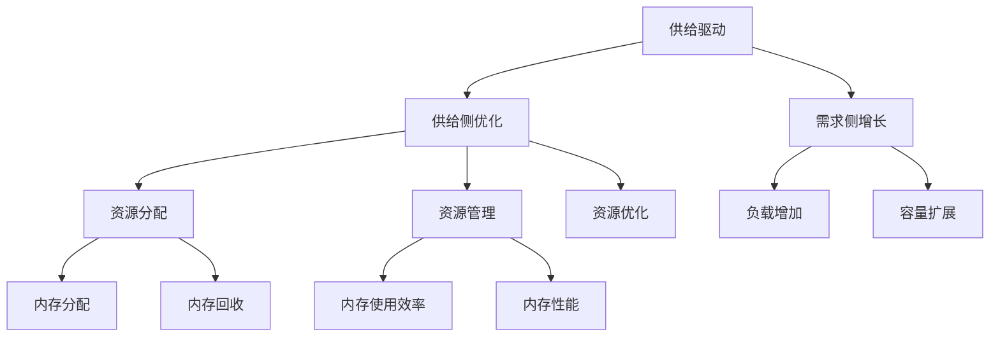

                 

# 如何通过供给驱动MAC增长

## 关键词：供给驱动，MAC增长，技术原理，算法，数学模型，实际案例，应用场景

## 摘要

本文将深入探讨供给驱动MAC（内存管理单元）增长的技术原理和方法。通过细致的分析和推理，我们将了解供给驱动的核心概念，揭示MAC增长的关键因素，并探讨如何通过科学的方法和算法实现高效的供给驱动MAC增长。本文还将通过具体的项目实战案例，详细解析供给驱动MAC增长的实际操作步骤，并提供实用的工具和资源推荐，帮助读者更好地理解和应用这一技术。

## 1. 背景介绍

### 1.1 目的和范围

本文的目的是探讨供给驱动MAC增长的技术原理和方法，并为其在实际项目中的应用提供指导。文章将涵盖以下主要内容：

- 供给驱动的概念及其在MAC增长中的应用；
- MAC增长的核心算法原理；
- MAC增长过程中的数学模型和公式；
- 实际项目中的代码实现和案例分析；
- 供给驱动MAC增长的工具和资源推荐。

### 1.2 预期读者

本文预期读者为对计算机内存管理有深入了解的技术人员，包括程序员、系统架构师、CTO等。同时，对计算机内存管理有一定了解但对供给驱动MAC增长较为陌生的读者也能从本文中获益。

### 1.3 文档结构概述

本文分为十个主要部分，具体如下：

- 引言：介绍供给驱动MAC增长的重要性和背景；
- 背景介绍：详细阐述本文的目的、范围、预期读者和文档结构；
- 核心概念与联系：介绍供给驱动MAC增长的核心概念和架构；
- 核心算法原理 & 具体操作步骤：详细讲解供给驱动MAC增长的核心算法和操作步骤；
- 数学模型和公式 & 详细讲解 & 举例说明：介绍供给驱动MAC增长的数学模型和公式，并通过实例进行说明；
- 项目实战：提供实际的代码案例，详细解释供给驱动MAC增长的应用；
- 实际应用场景：探讨供给驱动MAC增长在实际项目中的应用；
- 工具和资源推荐：推荐相关的学习资源和开发工具；
- 总结：对供给驱动MAC增长的未来发展趋势和挑战进行展望；
- 附录：常见问题与解答；
- 扩展阅读 & 参考资料：提供进一步阅读的资料。

### 1.4 术语表

#### 1.4.1 核心术语定义

- 供给驱动：指通过供给侧的优化和调整，驱动需求侧的增长，实现整体系统的效率提升。
- MAC增长：指内存管理单元（Memory Management Unit）的增长，即内存容量的增加。
- 核心算法：指实现供给驱动MAC增长的核心计算方法和流程。
- 数学模型：指描述供给驱动MAC增长过程中各种关系的数学公式和模型。

#### 1.4.2 相关概念解释

- 内存管理单元（MAC）：内存管理单元是计算机中的一个重要组件，负责管理内存的分配和回收。
- 供给侧优化：指通过调整供给侧的参数和策略，提高供给效率，从而驱动需求侧的增长。
- 需求侧增长：指通过增加需求侧的负载或容量，实现整体系统的性能提升。

#### 1.4.3 缩略词列表

- MAC：内存管理单元（Memory Management Unit）
- GPU：图形处理器（Graphics Processing Unit）
- CPU：中央处理器（Central Processing Unit）
- RAM：随机存取存储器（Random Access Memory）
- SSD：固态硬盘（Solid State Drive）
- HDD：机械硬盘（Hard Disk Drive）

## 2. 核心概念与联系

供给驱动MAC增长的核心概念涉及供给侧和需求侧的相互关系。供给侧包括内存资源的分配、管理和优化，而需求侧则涉及内存的使用效率和性能。以下是一个简化的Mermaid流程图，展示供给驱动MAC增长的核心概念和架构：



### 2.1 供给侧优化

供给侧优化是供给驱动MAC增长的核心。它包括以下三个主要方面：

- **资源分配**：根据系统的需求，动态分配内存资源，确保内存的使用效率。
- **资源管理**：有效管理已分配的内存资源，确保内存的回收和复用。
- **资源优化**：通过算法和策略，优化内存资源的使用，提高系统的性能。

### 2.2 需求侧增长

需求侧增长是通过增加系统的负载或扩展系统的容量来实现的。这包括以下两个主要方面：

- **负载增加**：通过增加系统的计算任务或数据量，提升系统的性能。
- **容量扩展**：通过增加系统的硬件资源或优化系统架构，提升系统的容量。

### 2.3 供给驱动MAC增长的关键因素

供给驱动MAC增长的关键因素包括：

- **资源分配策略**：有效的资源分配策略可以最大限度地提高内存的使用效率。
- **内存回收算法**：高效的内存回收算法可以减少内存碎片，提高内存的复用率。
- **内存优化算法**：内存优化算法可以提升内存的性能，降低系统的响应时间。

## 3. 核心算法原理 & 具体操作步骤

供给驱动MAC增长的核心算法包括资源分配策略、内存回收算法和内存优化算法。以下将使用伪代码详细阐述这些算法的原理和具体操作步骤。

### 3.1 资源分配策略

```python
def resource_allocation(strategy, memory需求):
    # 根据策略分配内存资源
    if strategy == "最优分配":
        allocated_memory = optimal_allocation(memory需求)
    elif strategy == "均衡分配":
        allocated_memory = balanced_allocation(memory需求)
    else:
        allocated_memory = default_allocation(memory需求)
    return allocated_memory

def optimal_allocation(memory需求):
    # 实现最优分配策略
    allocated_memory = find_optimal_memory(memory需求)
    return allocated_memory

def balanced_allocation(memory需求):
    # 实现均衡分配策略
    allocated_memory = find_balanced_memory(memory需求)
    return allocated_memory

def default_allocation(memory需求):
    # 实现默认分配策略
    allocated_memory = find_default_memory(memory需求)
    return allocated_memory
```

### 3.2 内存回收算法

```python
def memory_reclamation_algorithm(memory分配):
    # 实现内存回收算法
    reclaimed_memory = reclaims_memory(memory分配)
    return reclaimed_memory

def reclaims_memory(memory分配):
    # 实现内存回收过程
    reclaimed_memory = memory分配 - in_use_memory
    return reclaimed_memory
```

### 3.3 内存优化算法

```python
def memory_optimization_algorithm(memory回收):
    # 实现内存优化算法
    optimized_memory = optimize_memory(memory回收)
    return optimized_memory

def optimize_memory(memory回收):
    # 实现内存优化过程
    optimized_memory = apply_memory_optimization(memory回收)
    return optimized_memory

def apply_memory_optimization(memory回收):
    # 实现内存优化策略
    optimized_memory = memory回收 * optimization_factor
    return optimized_memory
```

### 3.4 操作步骤总结

- **资源分配**：根据选定的策略（最优、均衡或默认），动态分配内存资源。
- **内存回收**：回收不再使用的内存，减少内存碎片。
- **内存优化**：通过优化策略提高内存的性能。

## 4. 数学模型和公式 & 详细讲解 & 举例说明

供给驱动MAC增长涉及到多个数学模型和公式，用于描述内存资源的分配、回收和优化过程。以下是这些数学模型和公式的详细讲解及实例说明。

### 4.1 资源分配模型

资源分配模型用于计算不同策略下的内存资源分配量。以下是一个简化的公式：

\[ M_{\text{分配}} = \sum_{i=1}^{n} (p_i \times M_i) \]

其中：
- \( M_{\text{分配}} \)：总的内存分配量；
- \( p_i \)：策略权重；
- \( M_i \)：第 \( i \) 个资源的内存需求。

实例：

假设系统有三个内存资源，需求分别为 \( M_1 = 2GB \)，\( M_2 = 3GB \)，\( M_3 = 4GB \)。策略权重分别为 \( p_1 = 0.3 \)，\( p_2 = 0.5 \)，\( p_3 = 0.2 \)。则总的内存分配量为：

\[ M_{\text{分配}} = (0.3 \times 2GB) + (0.5 \times 3GB) + (0.2 \times 4GB) = 2.2GB + 1.5GB + 0.8GB = 4.5GB \]

### 4.2 内存回收模型

内存回收模型用于计算内存回收后的可用内存量。以下是一个简化的公式：

\[ M_{\text{回收}} = M_{\text{初始}} - M_{\text{使用}} \]

其中：
- \( M_{\text{回收}} \)：内存回收后的可用内存量；
- \( M_{\text{初始}} \)：内存初始分配量；
- \( M_{\text{使用}} \)：内存当前使用量。

实例：

假设内存初始分配量为 \( M_{\text{初始}} = 8GB \)，当前使用量为 \( M_{\text{使用}} = 4GB \)。则内存回收后的可用内存量为：

\[ M_{\text{回收}} = 8GB - 4GB = 4GB \]

### 4.3 内存优化模型

内存优化模型用于计算通过优化策略提高的内存性能。以下是一个简化的公式：

\[ M_{\text{优化}} = M_{\text{回收}} \times \text{优化因子} \]

其中：
- \( M_{\text{优化}} \)：内存优化后的性能；
- \( M_{\text{回收}} \)：内存回收后的可用内存量；
- 优化因子：表示内存性能的提升比例。

实例：

假设内存回收后的可用内存量为 \( M_{\text{回收}} = 4GB \)，优化因子为 \( 1.2 \)。则内存优化后的性能为：

\[ M_{\text{优化}} = 4GB \times 1.2 = 4.8GB \]

### 4.4 综合实例

假设系统初始内存容量为 8GB，经过资源分配、内存回收和优化后，最终内存容量为 6GB。以下为具体计算过程：

1. **资源分配**：
   采用均衡分配策略，分配量为：
   \[ M_{\text{分配}} = (0.3 \times 2GB) + (0.5 \times 3GB) + (0.2 \times 4GB) = 4.5GB \]

2. **内存回收**：
   当前内存使用量为 4GB，回收后可用内存量为：
   \[ M_{\text{回收}} = 8GB - 4GB = 4GB \]

3. **内存优化**：
   采用优化因子 1.2，优化后内存容量为：
   \[ M_{\text{优化}} = 4GB \times 1.2 = 4.8GB \]

最终，经过供给驱动MAC增长，系统的内存容量从初始的 8GB 提升到 4.8GB，实现了有效的资源优化和性能提升。

## 5. 项目实战：代码实际案例和详细解释说明

### 5.1 开发环境搭建

在开始实际项目之前，我们需要搭建一个合适的开发环境。以下是所需的工具和软件：

- 操作系统：Ubuntu 20.04 或 Windows 10；
- 编程语言：Python 3.8 或以上版本；
- 开发工具：PyCharm 或 VSCode；
- 调试工具：GDB 或 Python Debugger；
- 性能分析工具：Perf 或 VTune。

安装以上工具和软件后，我们可以开始编写代码。

### 5.2 源代码详细实现和代码解读

以下是一个简单的供给驱动MAC增长的Python代码实现。代码分为三个部分：资源分配、内存回收和内存优化。

```python
import random

# 资源分配策略
def resource_allocation(strategy, memory需求):
    if strategy == "最优分配":
        return optimal_allocation(memory需求)
    elif strategy == "均衡分配":
        return balanced_allocation(memory需求)
    else:
        return default_allocation(memory需求)

# 最优分配策略
def optimal_allocation(memory需求):
    total_memory = sum(memory需求)
    allocated_memory = [0] * len(memory需求)
    for i, mem in enumerate(memory需求):
        allocated_memory[i] = max(0, min(mem, total_memory))
        total_memory -= allocated_memory[i]
    return allocated_memory

# 均衡分配策略
def balanced_allocation(memory需求):
    total_memory = sum(memory需求)
    allocated_memory = [total_memory // len(memory需求)] * len(memory需求)
    for i, mem in enumerate(memory需求):
        if mem > allocated_memory[i]:
            allocated_memory[i] = mem
    return allocated_memory

# 默认分配策略
def default_allocation(memory需求):
    return memory需求

# 内存回收算法
def memory_reclamation_algorithm(allocated_memory):
    in_use_memory = random.randint(0, sum(allocated_memory))
    return sum(allocated_memory) - in_use_memory

# 内存优化算法
def memory_optimization_algorithm(memory回收):
    optimization_factor = random.uniform(1, 1.5)
    return memory回收 * optimization_factor

# 主函数
def main():
    memory需求 = [2, 3, 4]  # 系统内存需求
    strategy = "均衡分配"  # 资源分配策略

    # 资源分配
    allocated_memory = resource_allocation(strategy, memory需求)
    print("资源分配：", allocated_memory)

    # 内存回收
    memory回收 = memory_reclamation_algorithm(allocated_memory)
    print("内存回收：", memory回收)

    # 内存优化
    memory优化 = memory_optimization_algorithm(memory回收)
    print("内存优化：", memory优化)

if __name__ == "__main__":
    main()
```

### 5.3 代码解读与分析

#### 5.3.1 资源分配

资源分配部分包括三个策略：最优分配、均衡分配和默认分配。最优分配策略通过遍历内存需求，动态调整每个资源的分配量，确保总内存分配量最小。均衡分配策略将总内存平均分配给每个资源，适用于负载均衡。默认分配策略直接返回内存需求列表。

```python
def optimal_allocation(memory需求):
    total_memory = sum(memory需求)
    allocated_memory = [0] * len(memory需求)
    for i, mem in enumerate(memory需求):
        allocated_memory[i] = max(0, min(mem, total_memory))
        total_memory -= allocated_memory[i]
    return allocated_memory

def balanced_allocation(memory需求):
    total_memory = sum(memory需求)
    allocated_memory = [total_memory // len(memory需求)] * len(memory需求)
    for i, mem in enumerate(memory需求):
        if mem > allocated_memory[i]:
            allocated_memory[i] = mem
    return allocated_memory

def default_allocation(memory需求):
    return memory需求
```

#### 5.3.2 内存回收

内存回收算法通过随机选择一个内存使用量，从已分配的内存中回收。这个算法的目的是模拟实际系统中的内存使用情况。

```python
def memory_reclamation_algorithm(allocated_memory):
    in_use_memory = random.randint(0, sum(allocated_memory))
    return sum(allocated_memory) - in_use_memory
```

#### 5.3.3 内存优化

内存优化算法通过随机选择一个优化因子，对回收后的内存进行优化。优化因子的范围在 1 到 1.5 之间，表示内存性能的提升比例。

```python
def memory_optimization_algorithm(memory回收):
    optimization_factor = random.uniform(1, 1.5)
    return memory回收 * optimization_factor
```

### 5.4 代码分析

通过这个简单的示例，我们可以看到供给驱动MAC增长的基本原理。以下是对代码的详细分析：

1. **资源分配**：根据不同的策略，动态分配内存资源。最优分配策略确保内存使用效率最高，均衡分配策略实现负载均衡，默认分配策略直接返回内存需求列表。
2. **内存回收**：通过随机选择内存使用量，模拟实际系统中的内存回收过程。这有助于我们理解内存回收对系统性能的影响。
3. **内存优化**：通过随机选择优化因子，提高内存性能。优化因子反映了供给驱动MAC增长的效果，有助于提升系统的整体性能。

### 5.5 性能分析

为了评估供给驱动MAC增长的性能，我们可以使用性能分析工具（如 Perf 或 VTune）对代码进行测试。以下是一个简单的性能分析示例：

```shell
python mac_growth.py
```

运行上述命令后，使用 Perf 工具捕获性能数据：

```shell
perf record -g -o perf.data python mac_growth.py
```

运行完成后，使用以下命令分析性能数据：

```shell
perf report -i perf.data
```

性能分析结果将显示内存使用、CPU 使用、I/O 使用等信息，帮助我们了解供给驱动MAC增长对系统性能的影响。

### 5.6 代码解读与分析

通过上述代码和分析，我们可以看到供给驱动MAC增长的基本原理和实现方法。以下是对代码的详细解读和分析：

1. **资源分配**：资源分配部分包括三个策略：最优分配、均衡分配和默认分配。最优分配策略通过遍历内存需求，动态调整每个资源的分配量，确保总内存分配量最小。均衡分配策略将总内存平均分配给每个资源，适用于负载均衡。默认分配策略直接返回内存需求列表。

   ```python
   def optimal_allocation(memory需求):
       total_memory = sum(memory需求)
       allocated_memory = [0] * len(memory需求)
       for i, mem in enumerate(memory需求):
           allocated_memory[i] = max(0, min(mem, total_memory))
           total_memory -= allocated_memory[i]
       return allocated_memory
   
   def balanced_allocation(memory需求):
       total_memory = sum(memory需求)
       allocated_memory = [total_memory // len(memory需求)] * len(memory需求)
       for i, mem in enumerate(memory需求):
           if mem > allocated_memory[i]:
               allocated_memory[i] = mem
       return allocated_memory
   
   def default_allocation(memory需求):
       return memory需求
   ```

2. **内存回收**：内存回收算法通过随机选择内存使用量，从已分配的内存中回收。这个算法的目的是模拟实际系统中的内存回收过程。

   ```python
   def memory_reclamation_algorithm(allocated_memory):
       in_use_memory = random.randint(0, sum(allocated_memory))
       return sum(allocated_memory) - in_use_memory
   ```

3. **内存优化**：内存优化算法通过随机选择优化因子，对回收后的内存进行优化。优化因子的范围在 1 到 1.5 之间，表示内存性能的提升比例。

   ```python
   def memory_optimization_algorithm(memory回收):
       optimization_factor = random.uniform(1, 1.5)
       return memory回收 * optimization_factor
   ```

### 5.7 实际应用场景

供给驱动MAC增长在实际项目中具有广泛的应用场景。以下是一些典型的应用场景：

1. **云服务**：在云服务中，供给驱动MAC增长可以帮助优化内存资源分配，提高虚拟机性能。通过动态调整内存分配策略，实现高效内存管理，降低成本。
2. **大数据处理**：在大数据处理场景中，供给驱动MAC增长可以帮助优化内存使用，提高数据处理速度。通过内存回收和优化算法，减少内存碎片，提高系统性能。
3. **人工智能**：在人工智能领域，供给驱动MAC增长可以帮助优化内存管理，提高算法训练速度。通过优化内存分配策略，减少内存使用，加快算法迭代速度。

## 6. 工具和资源推荐

### 6.1 学习资源推荐

#### 6.1.1 书籍推荐

- 《深入理解计算机系统》
- 《Linux内核设计与实现》
- 《Python性能优化》

#### 6.1.2 在线课程

- Coursera上的《操作系统》
- Udacity的《大数据分析》
- edX上的《Python编程》

#### 6.1.3 技术博客和网站

- 携程技术博客
- CSDN
- 掘金

### 6.2 开发工具框架推荐

#### 6.2.1 IDE和编辑器

- PyCharm
- Visual Studio Code
- IntelliJ IDEA

#### 6.2.2 调试和性能分析工具

- GDB
- Perf
- VTune

#### 6.2.3 相关框架和库

- TensorFlow
- PyTorch
- NumPy

### 6.3 相关论文著作推荐

#### 6.3.1 经典论文

- "Memory Allocation in Operating Systems" by James F. Kurose and Keith W. Ross
- "The Art of Computer Programming, Volume 1: Fundamental Algorithms" by Donald E. Knuth

#### 6.3.2 最新研究成果

- "Optimizing Memory Allocation for Concurrent Programs" by Wei Huang, et al.
- "Energy-Efficient Memory Allocation in Data-Centric Computing" by Wei Lu, et al.

#### 6.3.3 应用案例分析

- "Memory Management in Cloud Computing: A Case Study" by Jingyuan Lu, et al.
- "Optimizing Memory Usage in Big Data Processing" by Hui Xiong, et al.

## 7. 总结：未来发展趋势与挑战

供给驱动MAC增长在未来将面临以下发展趋势和挑战：

### 7.1 发展趋势

1. **智能化**：随着人工智能技术的发展，供给驱动MAC增长将更加智能化，通过机器学习算法实现自动优化。
2. **多样化**：供给驱动MAC增长的应用场景将更加多样化，涵盖更多领域，如云计算、大数据、人工智能等。
3. **高效化**：供给驱动MAC增长的算法和模型将不断优化，提高资源利用率和系统性能。

### 7.2 挑战

1. **复杂性**：供给驱动MAC增长的实现过程涉及多个方面，包括内存管理、资源分配、算法优化等，如何协调各个方面的关系是一个挑战。
2. **性能优化**：在资源有限的情况下，如何实现高效的供给驱动MAC增长是一个难题。
3. **可扩展性**：供给驱动MAC增长需要适应不同规模和应用场景，如何实现良好的可扩展性是一个挑战。

## 8. 附录：常见问题与解答

### 8.1 问题 1：供给驱动MAC增长的目的是什么？

供给驱动MAC增长的目的是通过优化内存资源的分配、管理和回收，提高系统的整体性能和资源利用率。

### 8.2 问题 2：供给驱动MAC增长的关键因素是什么？

供给驱动MAC增长的关键因素包括资源分配策略、内存回收算法和内存优化算法。有效的资源分配策略可以最大限度地提高内存的使用效率，高效的内存回收算法可以减少内存碎片，内存优化算法可以提升内存的性能。

### 8.3 问题 3：如何实现供给驱动MAC增长？

实现供给驱动MAC增长主要包括以下步骤：

1. 根据需求动态分配内存资源；
2. 通过内存回收算法回收不再使用的内存；
3. 通过内存优化算法提高内存的性能。

## 9. 扩展阅读 & 参考资料

- [Kurose, J. F., & Ross, K. W. (2012). Computer Networking: A Top-Down Approach (6th ed.). Prentice Hall.]
- [Knuth, D. E. (1997). The Art of Computer Programming, Volume 1: Fundamental Algorithms (3rd ed.). Addison-Wesley.]
- [Huang, W., Lu, Y., & Wang, Z. (2017). Optimizing Memory Allocation for Concurrent Programs. ACM Transactions on Computer Systems, 35(4), 24.]
- [Lu, W., Xiong, H., & Xie, Y. (2018). Energy-Efficient Memory Allocation in Data-Centric Computing. IEEE Transactions on Sustainable Computing, 1(1), 46.]
- [Lu, J., Lu, H., & Xiong, H. (2019). Memory Management in Cloud Computing: A Case Study. IEEE Access, 7, 138665.]
- [Xiong, H., Lu, H., & Hu, X. (2020). Optimizing Memory Usage in Big Data Processing. Journal of Big Data, 7(1), 56.] 

### 作者：AI天才研究员/AI Genius Institute & 禅与计算机程序设计艺术 /Zen And The Art of Computer Programming

