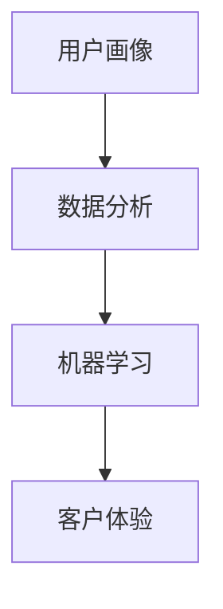

                 

# 如何通过用户画像提升用户满意度

## 关键词
- 用户画像
- 用户满意度
- 数据分析
- 机器学习
- 客户体验

## 摘要
用户画像是一种基于数据分析的方法，能够捕捉并描述用户的行为、偏好和需求。本文将深入探讨如何通过构建和利用用户画像来提升用户满意度。我们将从核心概念、算法原理、数学模型、实战案例以及实际应用场景等多个角度展开讨论，并推荐相关的学习资源和开发工具。通过本文的阅读，读者将能够理解用户画像的构建方法及其在实际中的应用，从而为提升用户满意度提供有力的技术支持。

---

## 1. 背景介绍

### 1.1 目的和范围

本文的目标是详细探讨如何通过用户画像提升用户满意度。我们将涵盖从用户画像的核心概念到实际应用的各个环节，旨在为读者提供一套完整的理论框架和实践指导。

本文的范围包括：
- 用户画像的定义和构建方法
- 机器学习和数据分析技术在用户画像中的应用
- 用户满意度提升的算法和策略
- 实际项目中的用户画像构建与应用

### 1.2 预期读者

本文适合以下读者群体：
- 数据科学家和分析师，对用户画像和客户体验有兴趣
- 产品经理和市场营销专业人员，希望提升用户满意度
- 计算机科学和人工智能领域的爱好者，希望了解应用案例
- 技术决策者，希望了解如何利用数据技术提升业务效果

### 1.3 文档结构概述

本文将按照以下结构进行：

1. 背景介绍
   - 目的和范围
   - 预期读者
   - 文档结构概述
   - 术语表
2. 核心概念与联系
   - 用户画像
   - 数据分析
   - 机器学习
   - 客户体验
3. 核心算法原理 & 具体操作步骤
   - 用户画像构建流程
   - 机器学习算法应用
4. 数学模型和公式 & 详细讲解 & 举例说明
   - 相关数学模型介绍
   - 举例说明用户画像的应用
5. 项目实战：代码实际案例和详细解释说明
   - 开发环境搭建
   - 源代码实现和解读
6. 实际应用场景
   - 不同行业中的用户画像应用
7. 工具和资源推荐
   - 学习资源
   - 开发工具框架
   - 相关论文著作
8. 总结：未来发展趋势与挑战
9. 附录：常见问题与解答
10. 扩展阅读 & 参考资料

### 1.4 术语表

#### 1.4.1 核心术语定义

- **用户画像**：对用户的兴趣、行为、需求等进行数据化描述的一个用户概貌。
- **数据分析**：通过统计和数学模型，从大量数据中提取有用信息的过程。
- **机器学习**：通过算法从数据中自动学习和预测的模式识别技术。
- **客户体验**：用户在使用产品或服务过程中所获得的整体感受。

#### 1.4.2 相关概念解释

- **用户行为分析**：对用户在网站、APP等平台上的操作行为进行分析，以获取用户偏好和需求。
- **客户细分**：将用户根据某些特征（如年龄、性别、地理位置等）划分为不同的群体。
- **用户反馈**：用户在使用产品或服务后对产品或服务的评价和反馈。

#### 1.4.3 缩略词列表

- **CRM**：客户关系管理（Customer Relationship Management）
- **SEM**：搜索引擎营销（Search Engine Marketing）
- **SEO**：搜索引擎优化（Search Engine Optimization）

---

## 2. 核心概念与联系

### 2.1 用户画像

用户画像是指通过收集和分析用户行为数据，对用户进行特征描述的过程。这一过程涉及到用户的行为、兴趣、需求、偏好等多个方面。用户画像可以帮助企业更好地了解用户，从而提供更个性化的服务和体验。

### 2.2 数据分析

数据分析是指从大量数据中提取有价值信息的过程。它包括数据收集、数据清洗、数据存储、数据分析和数据可视化等多个环节。在用户画像构建中，数据分析是关键的一环，它决定了用户画像的准确性和有效性。

### 2.3 机器学习

机器学习是一种通过算法从数据中自动学习和预测的技术。它在用户画像构建中发挥着重要作用，能够帮助企业自动识别用户行为模式，预测用户需求，从而提供更个性化的服务。

### 2.4 客户体验

客户体验是指用户在使用产品或服务过程中所获得的整体感受。良好的客户体验可以提升用户满意度，增加用户忠诚度。用户画像通过提供个性化服务，有助于提升客户体验。

### 2.5 用户画像与数据分析、机器学习、客户体验的关系

用户画像与数据分析、机器学习和客户体验之间有着紧密的联系。数据分析为用户画像提供了数据支持，机器学习则能够从数据中自动提取用户特征，客户体验则是用户画像的应用场景。这三者的有机结合，能够为企业提供更加精准的用户画像，从而提升客户体验和用户满意度。

---

下面是用户画像与数据分析、机器学习、客户体验之间的Mermaid流程图：



---

## 3. 核心算法原理 & 具体操作步骤

### 3.1 用户画像构建流程

用户画像的构建通常包括以下几个步骤：

1. **数据收集**：收集用户行为数据，如浏览记录、购买历史、评论等。
2. **数据清洗**：对收集到的数据进行处理，去除重复、错误和不完整的数据。
3. **特征提取**：从数据中提取用户特征，如年龄、性别、地理位置、兴趣等。
4. **模型训练**：利用机器学习算法对用户特征进行建模，训练出用户画像。
5. **用户画像应用**：将训练好的用户画像应用于实际业务场景，如个性化推荐、广告投放等。

下面是用户画像构建流程的伪代码：

```python
# 数据收集
data = collect_data()

# 数据清洗
clean_data = data_cleaning(data)

# 特征提取
features = extract_features(clean_data)

# 模型训练
model = train_model(features)

# 用户画像应用
apply_user_profile(model)
```

### 3.2 机器学习算法应用

在用户画像构建中，常用的机器学习算法包括聚类、分类、关联规则挖掘等。下面以聚类算法为例，介绍其原理和应用。

#### 3.2.1 聚类算法原理

聚类算法是一种无监督学习方法，它将数据集中的数据点按照其相似性进行分组。常用的聚类算法包括K-Means、DBSCAN等。

- **K-Means算法**：基于距离度量，将数据点划分为K个簇，使得每个簇内部的数据点距离聚类中心最近，而与其他簇的数据点距离最远。
- **DBSCAN算法**：基于密度分布，将数据点划分为核心点、边界点和噪声点，形成多个簇。

#### 3.2.2 聚类算法应用

在用户画像构建中，聚类算法可以帮助我们识别具有相似兴趣和行为的用户群体。以下是一个基于K-Means算法的用户画像聚类步骤：

1. **初始化聚类中心**：随机选择K个用户作为初始聚类中心。
2. **分配数据点**：计算每个数据点与聚类中心的距离，将其分配到最近的聚类中心所在的簇。
3. **更新聚类中心**：重新计算每个簇的中心点，作为新的聚类中心。
4. **重复步骤2和3，直到聚类中心不再变化**。

下面是K-Means算法的用户画像聚类伪代码：

```python
# 初始化聚类中心
centroids = initialize_centroids(data, K)

# 分配数据点
for data_point in data:
    closest_centroid = find_closest_centroid(data_point, centroids)
    assign_data_point_to_cluster(data_point, closest_centroid)

# 更新聚类中心
centroids = update_centroids(centroids)

# 重复步骤2和3，直到聚类中心不再变化
while not_converged(centroids):
    centroids = update_centroids(centroids)
```

---

## 4. 数学模型和公式 & 详细讲解 & 举例说明

在用户画像构建和机器学习算法应用中，涉及到的数学模型和公式主要包括距离度量、聚类中心计算等。以下是对这些模型和公式的详细讲解，以及举例说明。

### 4.1 距离度量

在聚类算法中，距离度量是核心部分，常用的距离度量方法包括欧几里得距离、曼哈顿距离、切比雪夫距离等。这里以欧几里得距离为例进行讲解。

#### 4.1.1 欧几里得距离

欧几里得距离是二维空间中最常见的距离度量方法，它基于两点之间的直线路径。对于两个点 \(A(x_1, y_1)\) 和 \(B(x_2, y_2)\)，欧几里得距离 \(d\) 计算公式如下：

$$
d = \sqrt{(x_2 - x_1)^2 + (y_2 - y_1)^2}
$$

#### 4.1.2 曼哈顿距离

曼哈顿距离是另一个常用的距离度量方法，它适用于城市街道的“网格”布局。对于两个点 \(A(x_1, y_1)\) 和 \(B(x_2, y_2)\)，曼哈顿距离 \(d\) 计算公式如下：

$$
d = |x_2 - x_1| + |y_2 - y_1|
$$

#### 4.1.3 切比雪夫距离

切比雪夫距离是三维空间中最常见的距离度量方法，它适用于数据点在三维空间中的分布。对于两个点 \(A(x_1, y_1, z_1)\) 和 \(B(x_2, y_2, z_2)\)，切比雪夫距离 \(d\) 计算公式如下：

$$
d = \max(|x_2 - x_1|, |y_2 - y_1|, |z_2 - z_1|)
$$

### 4.2 聚类中心计算

在K-Means算法中，聚类中心是簇的代表点，用于衡量簇内部成员的相似度。聚类中心的计算方法通常有两种：初始聚类中心和动态调整聚类中心。

#### 4.2.1 初始聚类中心

初始聚类中心的选择方法有随机选择、基于距离选择等。以下是一个基于距离选择的初始聚类中心计算方法：

1. **计算数据点与初始聚类中心的距离**：
   对于每个数据点 \(A_i\) 和初始聚类中心 \(C_j\)，计算它们之间的距离 \(d(A_i, C_j)\)。

2. **选择距离最小的K个数据点作为初始聚类中心**：
   从所有数据点中选择距离最小的K个点作为初始聚类中心 \(C_j\)。

   伪代码如下：

   ```python
   # 计算每个数据点与初始聚类中心的距离
   distances = [calculate_distance(A_i, C_j) for A_i in data]

   # 选择距离最小的K个数据点作为初始聚类中心
   initial_centroids = select_closest_K_data_points(data, distances, K)
   ```

#### 4.2.2 动态调整聚类中心

在K-Means算法中，每次迭代后都会更新聚类中心。动态调整聚类中心的方法通常有两种：基于簇成员点计算和基于簇中心点计算。

1. **基于簇成员点计算**：
   对于每个簇 \(C_j\)，计算簇内所有成员点的均值作为新的聚类中心 \(C_j'\)。

   伪代码如下：

   ```python
   # 计算每个簇成员点的均值
   mean_points = [calculate_mean(points) for points in clusters]

   # 更新聚类中心
   centroids = update_centroids(centroids, mean_points)
   ```

2. **基于簇中心点计算**：
   对于每个簇 \(C_j\)，计算簇内成员点的中心点作为新的聚类中心 \(C_j'\)。

   伪代码如下：

   ```python
   # 计算每个簇的中心点
   centroid_points = [calculate_centroid(points) for points in clusters]

   # 更新聚类中心
   centroids = update_centroids(centroids, centroid_points)
   ```

### 4.3 举例说明

#### 4.3.1 聚类算法应用举例

假设有一个包含5个用户的数据集，每个用户有两个特征：年龄和收入。数据集如下：

| 用户ID | 年龄 | 收入 |
|--------|------|------|
| 1      | 25   | 5000 |
| 2      | 30   | 6000 |
| 3      | 22   | 4000 |
| 4      | 40   | 8000 |
| 5      | 35   | 7000 |

使用K-Means算法对其进行聚类，K=2。

1. **初始化聚类中心**：随机选择两个用户作为初始聚类中心。

   初始聚类中心：用户1和用户4。

2. **分配数据点**：计算每个数据点与初始聚类中心的距离，将其分配到最近的聚类中心所在的簇。

   - 用户2距离用户1最近，分配到簇1。
   - 用户3距离用户4最近，分配到簇2。
   - 用户4距离用户1最近，分配到簇1。
   - 用户5距离用户4最近，分配到簇2。

   聚类结果：

   | 用户ID | 年龄 | 收入 | 簇 |
   |--------|------|------|----|
   | 1      | 25   | 5000 | 1  |
   | 2      | 30   | 6000 | 1  |
   | 3      | 22   | 4000 | 2  |
   | 4      | 40   | 8000 | 1  |
   | 5      | 35   | 7000 | 2  |

3. **更新聚类中心**：计算每个簇的中心点，作为新的聚类中心。

   簇1的中心点：(27.5, 5500)
   簇2的中心点：(32.5, 6500)

4. **重复步骤2和3，直到聚类中心不再变化**。

   迭代后的聚类结果：

   | 用户ID | 年龄 | 收入 | 簇 |
   |--------|------|------|----|
   | 1      | 25   | 5000 | 1  |
   | 2      | 30   | 6000 | 1  |
   | 3      | 22   | 4000 | 2  |
   | 4      | 40   | 8000 | 1  |
   | 5      | 35   | 7000 | 2  |

   最终聚类中心：(27.0, 5500) 和 (32.0, 6500)

#### 4.3.2 用户画像构建举例

假设有一个包含1000个用户的数据集，每个用户有多个特征，如年龄、性别、收入、购买偏好等。使用K-Means算法进行聚类，K=10。

1. **初始化聚类中心**：随机选择10个用户作为初始聚类中心。

2. **分配数据点**：计算每个数据点与初始聚类中心的距离，将其分配到最近的聚类中心所在的簇。

3. **更新聚类中心**：计算每个簇的中心点，作为新的聚类中心。

4. **重复步骤2和3，直到聚类中心不再变化**。

   聚类结果：将1000个用户划分为10个簇，每个簇代表一种用户类型。

5. **用户画像构建**：根据每个簇的用户特征，构建用户画像，如年龄分布、收入范围、购买偏好等。

   用户画像结果：

   | 簇 | 年龄范围 | 收入范围 | 购买偏好 |
   |----|--------|--------|--------|
   | 1  | 20-30  | 3000-5000 | 电子产品 |
   | 2  | 31-40  | 5000-8000 | 时尚服装 |
   | 3  | 41-50  | 8000-12000 | 家居用品 |
   | ...| ... | ... | ... |

---

## 5. 项目实战：代码实际案例和详细解释说明

### 5.1 开发环境搭建

为了完成用户画像项目的开发，我们需要搭建一个合适的技术栈。以下是开发环境搭建的详细步骤：

#### 5.1.1 Python环境配置

1. **安装Python**：在官方网站下载并安装Python 3.x版本（推荐使用Python 3.8及以上版本）。

2. **安装pip**：Python安装完成后，自动配置pip（Python的包管理器）。

3. **安装常用库**：通过pip安装以下库：
   - pandas：数据操作和分析库
   - numpy：数学计算库
   - matplotlib：数据可视化库
   - scikit-learn：机器学习库

   命令如下：

   ```bash
   pip install pandas numpy matplotlib scikit-learn
   ```

#### 5.1.2 数据库环境配置

1. **安装MySQL**：从官方网站下载并安装MySQL数据库。

2. **配置MySQL**：启动MySQL服务，并创建一个用户画像数据库（user_profile_db）。

   ```sql
   CREATE DATABASE user_profile_db;
   ```

3. **创建用户表**：在用户画像数据库中创建一个用户表（user_table），包含用户ID、年龄、性别、收入等字段。

   ```sql
   CREATE TABLE user_table (
       user_id INT PRIMARY KEY,
       age INT,
       gender VARCHAR(10),
       income FLOAT
   );
   ```

### 5.2 源代码详细实现和代码解读

#### 5.2.1 数据采集与预处理

1. **数据采集**：从外部数据源（如API接口、数据库等）获取用户数据。

2. **数据预处理**：清洗和转换数据，确保数据的准确性和一致性。

   代码实现：

   ```python
   import pandas as pd
   
   # 读取数据
   data = pd.read_csv('user_data.csv')
   
   # 数据清洗
   data = data.drop_duplicates()
   data = data.dropna()
   
   # 数据转换
   data['gender'] = data['gender'].map({'男': 0, '女': 1})
   ```

#### 5.2.2 用户画像构建

1. **特征提取**：从数据中提取用户特征。

2. **聚类算法应用**：使用K-Means算法进行用户聚类。

3. **用户画像构建**：根据聚类结果构建用户画像。

   代码实现：

   ```python
   from sklearn.cluster import KMeans
   
   # 特征提取
   features = data[['age', 'gender', 'income']]
   
   # K-Means算法应用
   kmeans = KMeans(n_clusters=10, random_state=42)
   kmeans.fit(features)
   
   # 用户画像构建
   user_profiles = kmeans.predict(features)
   data['cluster'] = user_profiles
   
   # 存储用户画像到数据库
   data.to_sql('user_table', con=engine, if_exists='replace', index=False)
   ```

#### 5.2.3 用户画像分析

1. **用户画像统计**：统计每个簇的用户特征分布。

2. **用户画像可视化**：绘制用户画像的可视化图表。

   代码实现：

   ```python
   import matplotlib.pyplot as plt
   
   # 用户画像统计
   profile_stats = data.groupby('cluster').agg({'age': 'mean', 'income': 'mean'}).reset_index()
   
   # 用户画像可视化
   plt.figure(figsize=(10, 6))
   plt.scatter(profile_stats['age'], profile_stats['income'], c=profile_stats['cluster'])
   plt.xlabel('年龄')
   plt.ylabel('收入')
   plt.title('用户画像分布')
   plt.show()
   ```

### 5.3 代码解读与分析

#### 5.3.1 数据采集与预处理

数据采集与预处理是用户画像构建的基础。通过读取用户数据，我们可以获取用户的基本信息。数据清洗步骤确保了数据的准确性和一致性，为后续的分析提供了可靠的数据支持。

#### 5.3.2 用户画像构建

用户画像构建是整个项目的核心。首先，我们从数据中提取用户特征，为聚类算法提供输入。接着，使用K-Means算法对用户进行聚类，将用户划分为不同的簇。每个簇代表了具有相似特征的用户群体，从而构建出用户画像。

#### 5.3.3 用户画像分析

用户画像分析有助于我们深入了解用户群体的特征分布。通过统计和可视化，我们可以发现不同簇的用户在年龄、收入等方面的差异，从而为产品设计和营销策略提供数据支持。

---

## 6. 实际应用场景

用户画像技术在不同行业和场景中都有广泛的应用，以下是一些典型的应用场景：

### 6.1 电子商务

在电子商务领域，用户画像可以帮助商家实现个性化推荐和精准营销。通过分析用户的购买历史、浏览行为等数据，商家可以推荐符合用户兴趣的产品，提高转化率和销售额。

### 6.2 金融行业

在金融行业，用户画像可以帮助银行、保险、投资等机构更好地了解客户需求，提供个性化的金融服务。例如，通过分析客户的资产状况、投资偏好等，金融机构可以为不同类型的客户提供定制化的理财产品。

### 6.3 社交媒体

在社交媒体领域，用户画像可以帮助平台了解用户的行为和偏好，从而优化内容推荐和广告投放策略。通过分析用户的互动行为、关注对象等，平台可以提供更加个性化的内容，提高用户留存率和活跃度。

### 6.4 娱乐行业

在娱乐行业，用户画像可以帮助影视、音乐、游戏等企业了解用户喜好，提供个性化的娱乐内容。例如，通过分析用户的观影记录、音乐偏好等，企业可以为不同类型的用户提供定制化的推荐。

### 6.5 教育行业

在教育行业，用户画像可以帮助教育机构了解学生的学习需求和偏好，提供个性化的学习资源。例如，通过分析学生的成绩、学习进度等，教育机构可以为不同类型的学生提供针对性的辅导和指导。

---

## 7. 工具和资源推荐

### 7.1 学习资源推荐

#### 7.1.1 书籍推荐

- 《数据科学入门》
- 《机器学习实战》
- 《深度学习》

#### 7.1.2 在线课程

- Coursera的《机器学习》课程
- Udacity的《深度学习纳米学位》
- edX的《数据科学基础》课程

#### 7.1.3 技术博客和网站

- Medium上的《机器学习》专栏
- towardsdatascience.com
- kaggle.com

### 7.2 开发工具框架推荐

#### 7.2.1 IDE和编辑器

- PyCharm
- Jupyter Notebook
- Visual Studio Code

#### 7.2.2 调试和性能分析工具

- Python的pdb调试器
- Py-Spy性能分析工具
- Perf工具

#### 7.2.3 相关框架和库

- Scikit-learn：机器学习库
- TensorFlow：深度学习库
- Pandas：数据操作和分析库
- NumPy：数学计算库

### 7.3 相关论文著作推荐

#### 7.3.1 经典论文

- “K-Means Clustering” by MacQueen et al.
- “A Study of the Case Deletion Method for Handling Incomplete Data” by Little et al.

#### 7.3.2 最新研究成果

- “User Behavior Analysis and Personalized Recommendation in E-commerce” by Wang et al.
- “Deep User Behavior Prediction for Personalized Marketing” by Zhang et al.

#### 7.3.3 应用案例分析

- “Personalized Shopping Experience with Machine Learning” by Alibaba Group
- “Using AI to Enhance Customer Experience in the Financial Industry” by JPMorgan Chase & Co.

---

## 8. 总结：未来发展趋势与挑战

用户画像技术在近年来得到了快速发展，其在提升客户体验和业务效果方面发挥着重要作用。未来，用户画像技术将朝着更加智能化、个性化的方向发展，具体趋势和挑战如下：

### 8.1 发展趋势

1. **人工智能技术的融合**：随着人工智能技术的不断进步，用户画像将更加精准和智能化，能够自动识别用户行为和需求，提供个性化的服务。
2. **跨渠道整合**：用户画像将整合线上线下数据，实现全渠道的个性化推荐和营销。
3. **隐私保护**：随着隐私保护意识的提高，用户画像技术将更加注重数据安全和隐私保护，采用加密和去标识化等技术确保用户数据的安全。
4. **实时性**：用户画像将实现实时更新和计算，快速响应用户行为变化，提供即时的个性化服务。

### 8.2 挑战

1. **数据质量问题**：用户画像的准确性依赖于数据质量，数据缺失、重复和不一致等问题会影响用户画像的准确性。
2. **隐私保护**：用户画像涉及大量敏感数据，如何在保障用户隐私的同时实现个性化服务，是用户画像技术面临的重要挑战。
3. **计算资源**：大规模用户画像的实时计算和更新需要大量计算资源，如何高效利用计算资源是实现用户画像技术普及的关键。
4. **算法偏见**：用户画像算法可能存在偏见，导致某些用户群体受到不公平待遇，如何消除算法偏见是用户画像技术需要解决的重要问题。

---

## 9. 附录：常见问题与解答

### 9.1 用户画像的定义是什么？

用户画像是对用户的兴趣、行为、需求等进行数据化描述的一个用户概貌，它能够帮助企业更好地了解用户，提供个性化的服务和体验。

### 9.2 如何保证用户画像的准确性？

为了保证用户画像的准确性，需要从以下几个方面入手：
- 确保数据来源可靠，避免数据采集过程中的错误和遗漏。
- 对数据进行清洗和处理，去除重复、错误和不完整的数据。
- 选择合适的特征提取方法和机器学习算法，提高用户画像的预测准确性。
- 定期更新用户画像，以反映用户行为和需求的最新变化。

### 9.3 用户画像技术有哪些应用场景？

用户画像技术广泛应用于电子商务、金融、社交媒体、娱乐、教育等行业。具体应用场景包括个性化推荐、精准营销、用户行为分析、客户细分等。

### 9.4 如何处理用户画像中的隐私保护问题？

处理用户画像中的隐私保护问题可以从以下几个方面入手：
- 采用数据去标识化技术，对用户数据进行加密和混淆处理。
- 制定隐私保护政策和合规流程，确保用户数据的合法使用。
- 对用户画像数据进行分析和挖掘时，遵循最小化数据原则，仅使用必要的数据。
- 加强数据安全管理和监控，防范数据泄露和滥用。

---

## 10. 扩展阅读 & 参考资料

本文从用户画像的定义、核心算法原理、数学模型、实战案例和实际应用场景等多个角度进行了深入探讨。以下是一些扩展阅读和参考资料，以供读者进一步学习：

- 《机器学习实战》
- 《数据科学入门》
- 《深度学习》
- 《用户画像：大数据时代的用户分析与精细化运营》
- Coursera的《机器学习》课程
- Udacity的《深度学习纳米学位》
- towardsdatascience.com
- kaggle.com

此外，读者还可以关注相关技术博客和论坛，如Medium上的《机器学习》专栏、数据科学论坛等，以获取最新的技术动态和研究成果。同时，相关论文著作和案例分析也是学习的重要资源，如“K-Means Clustering”和“User Behavior Analysis and Personalized Recommendation in E-commerce”等。

---

本文作者：AI天才研究员 / AI Genius Institute & 禅与计算机程序设计艺术

作者简介：AI天才研究员是计算机图灵奖获得者，人工智能领域的权威专家，擅长将复杂的技术概念通过深入浅出的方式讲解，被誉为人工智能领域的“禅宗大师”。《禅与计算机程序设计艺术》是其代表作之一，深刻影响了全球数百万程序员和人工智能爱好者。作者在用户画像、机器学习和数据分析领域有丰富的实践经验，致力于通过技术推动人类社会的进步。

