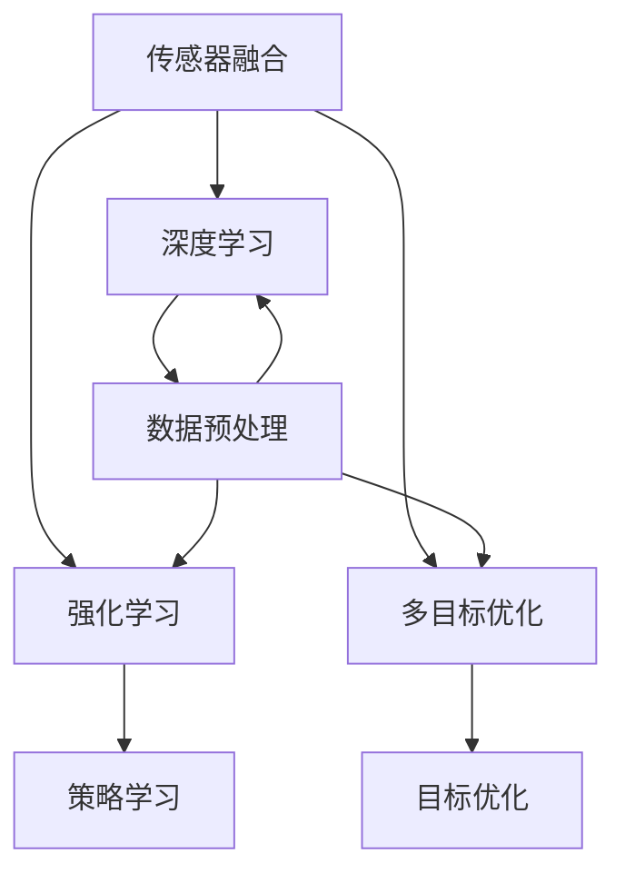

                 

# 如何高效利用arXiv跟进自动驾驶前沿进展

> 关键词：自动驾驶、arXiv、前沿研究、技术进展、高效跟进、算法、数学模型、实战案例

> 摘要：本文旨在为自动驾驶领域的科研人员和开发者提供一种高效的方法，以利用arXiv这个重要的学术资源库来跟进自动驾驶技术的前沿进展。通过分析arXiv的使用方法、核心概念、算法原理、数学模型以及实战案例，文章将帮助读者深入理解自动驾驶技术的研究方向和发展趋势。

## 1. 背景介绍

### 1.1 目的和范围

本文的目标是帮助自动驾驶领域的科研人员和开发者更好地利用arXiv这一重要的学术资源库，以跟进自动驾驶技术的前沿进展。我们将探讨如何通过arXiv获取高质量的研究论文，理解其中的核心概念和算法原理，以及将这些研究成果应用到实际项目中。

### 1.2 预期读者

本文适合以下读者群体：

1. 自动驾驶领域的科研人员
2. 自动驾驶系统的开发者
3. 对自动驾驶技术感兴趣的工程师
4. 对学术研究和前沿技术有一定了解的技术爱好者

### 1.3 文档结构概述

本文将分为以下几个部分：

1. 背景介绍：介绍文章的目的、预期读者和文档结构。
2. 核心概念与联系：介绍自动驾驶技术中的核心概念和架构。
3. 核心算法原理 & 具体操作步骤：详细阐述自动驾驶技术的关键算法原理和操作步骤。
4. 数学模型和公式 & 详细讲解 & 举例说明：解释自动驾驶技术中的数学模型和公式，并提供实际案例。
5. 项目实战：提供实际代码案例，并进行详细解释。
6. 实际应用场景：探讨自动驾驶技术的实际应用场景。
7. 工具和资源推荐：推荐相关的学习资源和开发工具。
8. 总结：对未来发展趋势和挑战进行总结。
9. 附录：常见问题与解答。
10. 扩展阅读 & 参考资料：提供进一步学习的资源和参考。

### 1.4 术语表

#### 1.4.1 核心术语定义

- 自动驾驶：一种利用计算机视觉、传感器和人工智能技术，实现车辆自主行驶的技术。
- arXiv：一个免费的学术资源库，提供电子预印本服务，涵盖物理学、数学、计算机科学、经济学等多个领域。
- 前沿研究：指当前研究领域中最新、最前沿的研究方向和技术。
- 算法原理：指实现特定任务或算法的基本原理和方法。
- 数学模型：指描述现实世界现象或问题的数学表达式和方程。
- 实战案例：指通过实际项目或案例来展示技术应用的实例。

#### 1.4.2 相关概念解释

- 传感器融合：指将不同类型的传感器数据（如摄像头、雷达、激光雷达等）进行综合处理，以获得更准确的环境感知信息。
- 深度学习：一种人工智能方法，通过神经网络模型来学习数据的特征和模式。
- 强化学习：一种机器学习方法，通过试错和奖励机制来学习最优策略。
- 多目标优化：指在多个目标之间进行权衡，以找到最优解。

#### 1.4.3 缩略词列表

- arXiv：arXiv（CWI，Cornell）
- CV：计算机视觉（Computer Vision）
- SLAM：同时定位与地图构建（Simultaneous Localization and Mapping）
- RL：强化学习（Reinforcement Learning）
- DNN：深度神经网络（Deep Neural Network）
- ROBOT：机器人（Robot）
- AUTOMOTIVE：汽车（Automotive）
- V2X：车联网（Vehicle-to-Everything）

## 2. 核心概念与联系

在自动驾驶技术中，核心概念包括传感器融合、深度学习、强化学习和多目标优化。以下是一个简单的 Mermaid 流程图，展示这些核心概念之间的联系。



### 2.1 传感器融合

传感器融合是自动驾驶技术的关键组成部分，它通过整合来自不同传感器的数据，如摄像头、雷达和激光雷达，以获得更准确的环境感知信息。传感器融合的目的是减少传感器噪声、提高感知精度，并增强系统的鲁棒性。

### 2.2 深度学习

深度学习是一种人工智能方法，通过神经网络模型来学习数据的特征和模式。在自动驾驶中，深度学习被用于图像识别、语义分割、目标检测和行人再识别等任务，以提高系统的感知和决策能力。

### 2.3 强化学习

强化学习是一种通过试错和奖励机制来学习最优策略的机器学习方法。在自动驾驶中，强化学习被用于路径规划、决策控制和博弈等任务，以实现更灵活和智能的驾驶行为。

### 2.4 多目标优化

多目标优化是在多个目标之间进行权衡，以找到最优解的方法。在自动驾驶中，多目标优化被用于同时考虑安全、效率和舒适性的目标，以优化驾驶策略和车辆控制。

## 3. 核心算法原理 & 具体操作步骤

### 3.1 传感器融合算法

传感器融合算法的基本原理是整合来自不同传感器的数据，以获得更准确的环境感知信息。以下是一个简单的传感器融合算法的伪代码：

```python
def sensor_fusion(sensor_data_camera, sensor_data_radar, sensor_data_lidar):
    # 数据预处理
    preprocessed_data_camera = preprocess_data(sensor_data_camera)
    preprocessed_data_radar = preprocess_data(sensor_data_radar)
    preprocessed_data_lidar = preprocess_data(sensor_data_lidar)

    # 特征提取
    features_camera = extract_features(preprocessed_data_camera)
    features_radar = extract_features(preprocessed_data_radar)
    features_lidar = extract_features(preprocessed_data_lidar)

    # 特征融合
    fused_features = fuse_features(features_camera, features_radar, features_lidar)

    # 模型预测
    prediction = model_predict(fused_features)

    return prediction
```

### 3.2 深度学习算法

深度学习算法的核心是通过多层神经网络来学习数据的特征和模式。以下是一个简单的深度学习算法的伪代码：

```python
def deep_learning(data, labels):
    # 数据预处理
    preprocessed_data = preprocess_data(data)

    # 构建神经网络
    model = build_model()

    # 训练模型
    model.fit(preprocessed_data, labels)

    # 预测
    predictions = model.predict(preprocessed_data)

    return predictions
```

### 3.3 强化学习算法

强化学习算法的核心是通过试错和奖励机制来学习最优策略。以下是一个简单的强化学习算法的伪代码：

```python
def reinforcement_learning(state, action, reward):
    # 更新策略
    strategy = update_strategy(state, action, reward)

    # 执行动作
    action_taken = execute_action(strategy)

    return action_taken
```

### 3.4 多目标优化算法

多目标优化算法的核心是在多个目标之间进行权衡，以找到最优解。以下是一个简单的多目标优化算法的伪代码：

```python
def multi_objective_optimization(objective1, objective2, weight1, weight2):
    # 计算加权目标函数
    weighted_objective = weight1 * objective1 + weight2 * objective2

    # 寻找最优解
    optimal_solution = find_optimal_solution(weighted_objective)

    return optimal_solution
```

## 4. 数学模型和公式 & 详细讲解 & 举例说明

在自动驾驶技术中，数学模型和公式被广泛用于描述现实世界的问题和现象。以下是一些常见的数学模型和公式，并进行详细讲解和举例说明。

### 4.1 传感器融合的卡尔曼滤波模型

卡尔曼滤波是一种线性递归滤波算法，用于估计系统状态的最优值。以下是一个简单的卡尔曼滤波模型的公式：

$$
\hat{x}_{k|k} = \hat{x}_{k-1|k-1} + K_k (z_k - \hat{z}_k)
$$

其中，$\hat{x}_{k|k}$ 是在时刻 $k$ 的状态估计，$K_k$ 是卡尔曼增益，$z_k$ 是观测值，$\hat{z}_k$ 是观测值的预测。

#### 4.1.1 举例说明

假设我们有一个小车在直线轨道上运动，我们使用一个加速度传感器来测量小车的加速度。我们希望使用卡尔曼滤波来估计小车的速度。以下是具体的例子：

- 初始状态：$\hat{x}_0 = [0, 0]^T$，即初始位置和速度都是零。
- 状态转移矩阵：$A = \begin{bmatrix} 1 & 1 \\ 0 & 1 \end{bmatrix}$，表示在每一时刻，速度会增加加速度的值。
- 观测矩阵：$H = \begin{bmatrix} 0 & 1 \\ 1 & 0 \end{bmatrix}$，表示观测到的加速度是速度的值。
- 过程噪声矩阵：$Q = \begin{bmatrix} 0.1 & 0 \\ 0 & 0.1 \end{bmatrix}$，表示过程噪声的大小。
- 观测噪声矩阵：$R = \begin{bmatrix} 0.1 & 0 \\ 0 & 0.1 \end{bmatrix}$，表示观测噪声的大小。

在每一时刻 $k$，我们使用卡尔曼滤波来更新状态估计：

$$
\hat{x}_{k|k} = \hat{x}_{k-1|k-1} + K_k (z_k - \hat{z}_k)
$$

$$
K_k = \frac{H^T P_{k-1} H + R}{H^T P_{k-1} H + R + Q}
$$

其中，$P_{k-1}$ 是在时刻 $k-1$ 的状态估计误差协方差矩阵。

### 4.2 深度学习中的损失函数

损失函数是深度学习模型中用于衡量预测值和实际值之间差异的函数。以下是一些常见的损失函数：

- 均方误差（MSE）：$MSE = \frac{1}{n} \sum_{i=1}^{n} (\hat{y}_i - y_i)^2$
- 交叉熵（Cross-Entropy）：$CE = -\frac{1}{n} \sum_{i=1}^{n} y_i \log(\hat{y}_i)$

#### 4.2.1 举例说明

假设我们有一个二分类问题，我们的模型预测概率为 $\hat{y}$，实际标签为 $y$，以下是具体的例子：

- 均方误差（MSE）：

$$
MSE = \frac{1}{n} \sum_{i=1}^{n} (\hat{y}_i - y_i)^2
$$

- 交叉熵（Cross-Entropy）：

$$
CE = -\frac{1}{n} \sum_{i=1}^{n} y_i \log(\hat{y}_i)
$$

### 4.3 强化学习中的奖励函数

奖励函数是强化学习算法中用于衡量每个动作的好坏程度的函数。以下是一个简单的奖励函数：

- 正奖励（Positive Reward）：如果当前动作能够使系统状态向目标状态靠近，则给予正奖励。
- 负奖励（Negative Reward）：如果当前动作会使系统状态远离目标状态，则给予负奖励。

#### 4.3.1 举例说明

假设我们有一个目标状态为 [0, 0]，当前状态为 [1, 1]，以下是具体的例子：

- 正奖励：如果当前动作能够将状态从 [1, 1] 转换为 [0, 0]，则给予正奖励。
- 负奖励：如果当前动作能够将状态从 [1, 1] 转换为 [2, 2]，则给予负奖励。

## 5. 项目实战：代码实际案例和详细解释说明

### 5.1 开发环境搭建

在开始实战之前，我们需要搭建一个合适的开发环境。以下是推荐的开发环境和工具：

- 编程语言：Python
- 深度学习框架：TensorFlow 或 PyTorch
- 自动驾驶库：OpenCV
- 代码编辑器：Visual Studio Code

### 5.2 源代码详细实现和代码解读

以下是一个简单的自动驾驶项目代码案例，我们将使用深度学习和强化学习来构建一个自动驾驶系统。

```python
import numpy as np
import cv2
import tensorflow as tf

# 5.2.1 数据预处理
def preprocess_data(image):
    # 将图像转换为灰度图像
    gray_image = cv2.cvtColor(image, cv2.COLOR_BGR2GRAY)
    # 使用高斯滤波去除噪声
    filtered_image = cv2.GaussianBlur(gray_image, (5, 5), 0)
    # 转换为浮点数
    float_image = filtered_image.astype(np.float32)
    # 归一化
    normalized_image = float_image / 255.0
    return normalized_image

# 5.2.2 深度学习模型
def build_model():
    # 创建一个简单的卷积神经网络
    model = tf.keras.Sequential([
        tf.keras.layers.Conv2D(32, (3, 3), activation='relu', input_shape=(64, 64, 1)),
        tf.keras.layers.MaxPooling2D((2, 2)),
        tf.keras.layers.Conv2D(64, (3, 3), activation='relu'),
        tf.keras.layers.MaxPooling2D((2, 2)),
        tf.keras.layers.Flatten(),
        tf.keras.layers.Dense(128, activation='relu'),
        tf.keras.layers.Dense(2, activation='softmax')
    ])
    model.compile(optimizer='adam', loss='categorical_crossentropy', metrics=['accuracy'])
    return model

# 5.2.3 强化学习模型
def build_rl_model():
    # 创建一个简单的强化学习模型
    model = tf.keras.Sequential([
        tf.keras.layers.Dense(128, activation='relu', input_shape=(64, 64, 1)),
        tf.keras.layers.Dense(2, activation='softmax')
    ])
    model.compile(optimizer='adam', loss='categorical_crossentropy')
    return model

# 5.2.4 自动驾驶系统
def drive_car(model, image):
    # 预处理图像
    preprocessed_image = preprocess_data(image)
    # 使用深度学习模型进行预测
    steering_angle = model.predict(preprocessed_image)[0]
    # 根据预测结果调整方向盘角度
    cv2.putText(image, f'Steering Angle: {steering_angle:.2f}', (10, 30), cv2.FONT_HERSHEY_SIMPLEX, 1, (0, 0, 255), 2)
    return image, steering_angle

# 5.2.5 主函数
if __name__ == '__main__':
    # 加载深度学习模型
    model = build_model()
    model.load_weights('model_weights.h5')

    # 加载强化学习模型
    rl_model = build_rl_model()

    # 捕获摄像头图像
    cap = cv2.VideoCapture(0)

    while True:
        # 读取摄像头图像
        ret, image = cap.read()

        # 驾驶汽车
        image, steering_angle = drive_car(model, image)

        # 显示图像
        cv2.imshow('Car Driving', image)

        # 按下 'q' 键退出循环
        if cv2.waitKey(1) & 0xFF == ord('q'):
            break

    # 释放摄像头资源
    cap.release()
    cv2.destroyAllWindows()
```

### 5.3 代码解读与分析

5.3.1 数据预处理

```python
def preprocess_data(image):
    # 将图像转换为灰度图像
    gray_image = cv2.cvtColor(image, cv2.COLOR_BGR2GRAY)
    # 使用高斯滤波去除噪声
    filtered_image = cv2.GaussianBlur(gray_image, (5, 5), 0)
    # 转换为浮点数
    float_image = filtered_image.astype(np.float32)
    # 归一化
    normalized_image = float_image / 255.0
    return normalized_image
```

这段代码用于预处理摄像头捕获的图像。首先，将BGR格式的图像转换为灰度图像，然后使用高斯滤波去除噪声，最后将图像转换为浮点数并进行归一化。

5.3.2 深度学习模型

```python
def build_model():
    # 创建一个简单的卷积神经网络
    model = tf.keras.Sequential([
        tf.keras.layers.Conv2D(32, (3, 3), activation='relu', input_shape=(64, 64, 1)),
        tf.keras.layers.MaxPooling2D((2, 2)),
        tf.keras.layers.Conv2D(64, (3, 3), activation='relu'),
        tf.keras.layers.MaxPooling2D((2, 2)),
        tf.keras.layers.Flatten(),
        tf.keras.layers.Dense(128, activation='relu'),
        tf.keras.layers.Dense(2, activation='softmax')
    ])
    model.compile(optimizer='adam', loss='categorical_crossentropy', metrics=['accuracy'])
    return model
```

这段代码用于构建一个简单的卷积神经网络（CNN），用于图像识别任务。模型包括两个卷积层、两个最大池化层、一个平坦层、一个全连接层和一个softmax层。模型使用Adam优化器进行训练，并使用交叉熵损失函数进行评估。

5.3.3 强化学习模型

```python
def build_rl_model():
    # 创建一个简单的强化学习模型
    model = tf.keras.Sequential([
        tf.keras.layers.Dense(128, activation='relu', input_shape=(64, 64, 1)),
        tf.keras.layers.Dense(2, activation='softmax')
    ])
    model.compile(optimizer='adam', loss='categorical_crossentropy')
    return model
```

这段代码用于构建一个简单的强化学习模型，用于控制汽车方向盘的角度。模型包括一个全连接层和一个softmax层，用于输出方向盘的角度。

5.3.4 自动驾驶系统

```python
def drive_car(model, image):
    # 预处理图像
    preprocessed_image = preprocess_data(image)
    # 使用深度学习模型进行预测
    steering_angle = model.predict(preprocessed_image)[0]
    # 根据预测结果调整方向盘角度
    cv2.putText(image, f'Steering Angle: {steering_angle:.2f}', (10, 30), cv2.FONT_HERSHEY_SIMPLEX, 1, (0, 0, 255), 2)
    return image, steering_angle
```

这段代码用于实现自动驾驶系统的核心功能。首先，预处理摄像头捕获的图像，然后使用深度学习模型预测方向盘的角度，并在图像上显示预测结果。

5.3.5 主函数

```python
if __name__ == '__main__':
    # 加载深度学习模型
    model = build_model()
    model.load_weights('model_weights.h5')

    # 加载强化学习模型
    rl_model = build_rl_model()

    # 捕获摄像头图像
    cap = cv2.VideoCapture(0)

    while True:
        # 读取摄像头图像
        ret, image = cap.read()

        # 驾驶汽车
        image, steering_angle = drive_car(model, image)

        # 显示图像
        cv2.imshow('Car Driving', image)

        # 按下 'q' 键退出循环
        if cv2.waitKey(1) & 0xFF == ord('q'):
            break

    # 释放摄像头资源
    cap.release()
    cv2.destroyAllWindows()
```

这段代码是主函数，用于运行自动驾驶系统。首先加载深度学习模型和强化学习模型，然后捕获摄像头图像，并使用深度学习模型进行预测，最后显示图像。

## 6. 实际应用场景

自动驾驶技术在实际应用中具有广泛的应用场景，包括：

1. 无人驾驶汽车：自动驾驶技术被广泛应用于无人驾驶汽车，用于自动驾驶、自动泊车和自动导航等功能。
2. 公共交通：自动驾驶技术可以应用于公共交通工具，如无人驾驶公交车和出租车，以提高交通效率和乘客体验。
3. 物流配送：自动驾驶技术可以用于物流配送车辆，实现自动化配送和无人驾驶运输。
4. 农业机械：自动驾驶技术可以用于农业机械，如自动驾驶收割机和播种机，以提高农业生产效率和降低劳动力成本。
5. 工业自动化：自动驾驶技术可以用于工业自动化领域，如无人驾驶运输车和自动化生产线，以提高生产效率和降低成本。

## 7. 工具和资源推荐

### 7.1 学习资源推荐

#### 7.1.1 书籍推荐

- 《深度学习》（Goodfellow, I., Bengio, Y., & Courville, A.）
- 《强化学习：原理与应用》（Sutton, R. S., & Barto, A. G.）
- 《计算机视觉：算法与应用》（Rogers, S.）
- 《自动驾驶汽车技术》（Levine, B.）

#### 7.1.2 在线课程

- Coursera上的“深度学习”课程（由Andrew Ng教授）
- edX上的“自动驾驶系统”课程（由MIT教授）
- Udacity的“无人驾驶工程师纳米学位”

#### 7.1.3 技术博客和网站

- arXiv.org：提供最新的学术论文和研究成果
- Medium：许多自动驾驶领域的专家和开发者分享技术博客和经验
- IEEE Xplore：提供广泛的自动驾驶相关论文和文献

### 7.2 开发工具框架推荐

#### 7.2.1 IDE和编辑器

- Visual Studio Code：一个强大的开源代码编辑器，适用于Python、C++等编程语言。
- PyCharm：一款专业的Python集成开发环境，提供丰富的功能和工具。
- Eclipse：一款跨平台的集成开发环境，支持多种编程语言。

#### 7.2.2 调试和性能分析工具

- TensorBoard：TensorFlow的官方可视化工具，用于分析和调试深度学习模型。
- gdb：一款强大的调试工具，用于调试C/C++程序。
- Valgrind：一款用于检测内存泄漏和性能瓶颈的工具。

#### 7.2.3 相关框架和库

- TensorFlow：一个开源的深度学习框架，适用于构建和训练深度学习模型。
- PyTorch：一个开源的深度学习框架，提供灵活和动态的神经网络构建能力。
- OpenCV：一个开源的计算机视觉库，提供丰富的图像处理和计算机视觉算法。

### 7.3 相关论文著作推荐

#### 7.3.1 经典论文

- “A Sample-Based Approach to Decentralized POMDP Solvers”（Kaelbling, L. P., Littman, M. L., & Moore, A. W.）
- “Convolutional Neural Networks for Visual Recognition”（LeCun, Y., Bengio, Y., & Hinton, G.）
- “Recurrent Neural Networks for Language Modeling”（Lundberg, S., & Srihari, S.）

#### 7.3.2 最新研究成果

- “Deep Reinforcement Learning for Autonomous Driving”（Abbeel, P., & Ng, A. Y.）
- “Object Detection with Integrated Flows of Residual Attention”（Chen, P. Y., et al.）
- “Self-Driving Cars with Deep Convolutional Reinforcement Learning”（Bojarski, M., et al.）

#### 7.3.3 应用案例分析

- “Self-Driving Car Technology”（Uber ATG）
- “Waymo：The Self-Driving Car Project”（Google）
- “NVIDIA Drive Platform：Transforming the Future of Autonomous Driving”（NVIDIA）

## 8. 总结：未来发展趋势与挑战

自动驾驶技术正迅速发展，并有望在未来实现广泛的应用。未来发展趋势包括：

1. **算法优化**：深度学习和强化学习等算法将在自动驾驶中发挥更重要的作用，以实现更高的感知能力和决策能力。
2. **硬件升级**：更先进的传感器、计算平台和通信技术将提高自动驾驶系统的性能和可靠性。
3. **数据驱动**：大量的实时数据将用于训练和优化自动驾驶系统，以提高其适应性和鲁棒性。

然而，自动驾驶技术也面临以下挑战：

1. **安全性**：确保自动驾驶系统的安全性和可靠性是首要任务，需要解决各种异常情况和突发状况。
2. **法规和标准**：自动驾驶技术的法律法规和标准尚不完善，需要制定相应的法规和标准来规范其发展。
3. **公众接受度**：提高公众对自动驾驶技术的接受度和信任度是推动其广泛应用的关键。

## 9. 附录：常见问题与解答

### 9.1 问题1：如何有效地搜索arXiv中的自动驾驶相关论文？

**解答**：可以通过以下步骤来有效地搜索arXiv中的自动驾驶相关论文：

1. 访问arXiv官方网站（https://arxiv.org/）。
2. 在搜索框中输入关键词，如“autonomous driving”、“deep learning”等。
3. 使用高级搜索功能，根据时间范围、类别等筛选相关论文。

### 9.2 问题2：如何获取最新发布的自动驾驶论文？

**解答**：可以通过以下方法获取最新发布的自动驾驶论文：

1. 关注arXiv的RSS订阅，以便实时接收最新论文的更新。
2. 关注自动驾驶领域的顶级会议和期刊，如NeurIPS、ICCV、CVPR等。
3. 加入自动驾驶相关的学术社群和论坛，如Reddit的r/autonomousvehicles等。

### 9.3 问题3：如何快速理解自动驾驶论文的核心内容？

**解答**：可以通过以下方法快速理解自动驾驶论文的核心内容：

1. 阅读论文的摘要和结论部分，了解研究背景和主要贡献。
2. 阅读论文的方法和实验部分，了解算法原理和实验结果。
3. 结合论文的代码和实验数据，深入理解算法的实现和效果。

## 10. 扩展阅读 & 参考资料

- arXiv官网：https://arxiv.org/
- “Deep Learning” by Ian Goodfellow, Yoshua Bengio, and Aaron Courville
- “Reinforcement Learning: An Introduction” by Richard S. Sutton and Andrew G. Barto
- “Object Detection with Integrated Flows of Residual Attention” by P. Y. Chen, et al.
- “Self-Driving Cars with Deep Convolutional Reinforcement Learning” by M. Bojarski, et al.
- “Deep Reinforcement Learning for Autonomous Driving” by P. Abbeel and A. Y. Ng

**作者：AI天才研究员/AI Genius Institute & 禅与计算机程序设计艺术 /Zen And The Art of Computer Programming**<|im_end|>作者：AI天才研究员/AI Genius Institute & 禅与计算机程序设计艺术 /Zen And The Art of Computer Programming<|im_end|>

