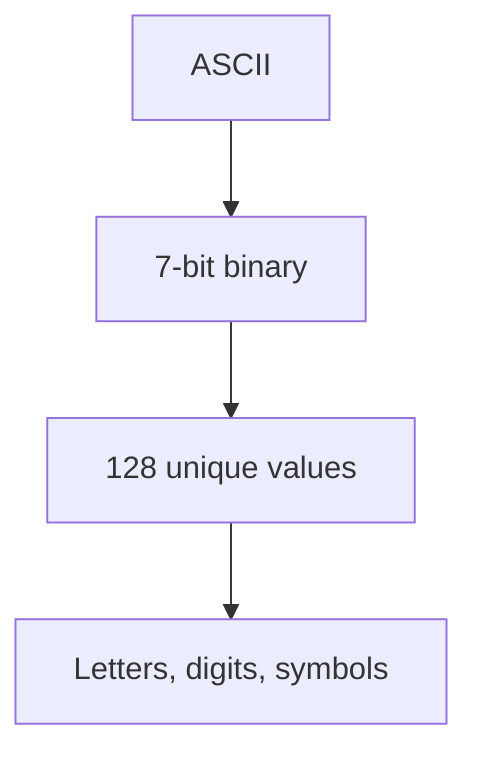
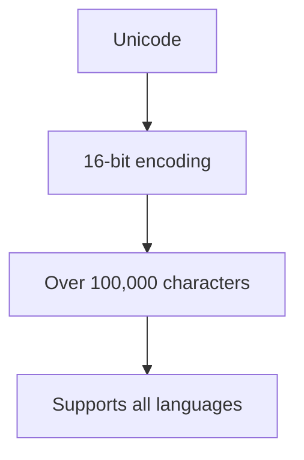
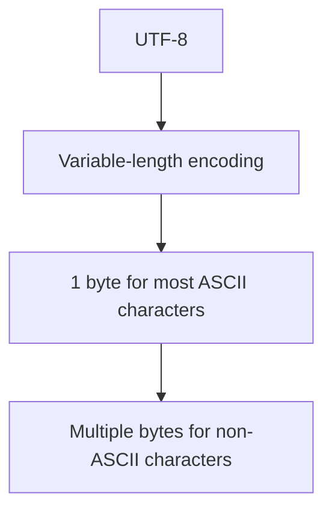
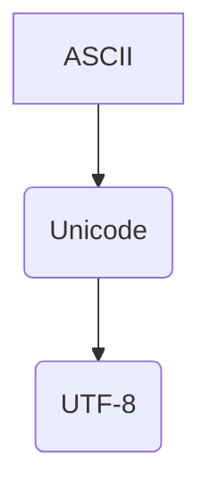

                 

# 字符串和字符编码：ASCII、Unicode 和 UTF-8

> **关键词**：ASCII、Unicode、UTF-8、字符编码、字符串、计算机底层原理

> **摘要**：本文将深入探讨字符编码的发展历程，从 ASCII 到 Unicode，再到 UTF-8，旨在帮助读者理解字符编码的核心概念和实际应用。我们将分析每种编码方式的工作原理，并通过实例和伪代码阐述它们在计算机中的具体作用。此外，文章还将介绍如何在项目中使用这些编码方式，并提供实用的工具和资源推荐，以助力读者深入学习和实践。

## 1. 背景介绍

### 1.1 目的和范围

本文旨在为读者提供一个全面而深入的字符编码知识体系，特别是关于 ASCII、Unicode 和 UTF-8 编码。通过对这些编码方式的详细分析，读者将能够更好地理解计算机底层处理文本的原理，从而在编程和软件开发中更加得心应手。

### 1.2 预期读者

本文适合以下读者群体：

- 编程新手，希望深入了解字符编码的内部工作原理
- 中级程序员，希望提升对字符串处理的熟练度
- 高级开发者，希望对字符编码有更深入的理论和实战理解

### 1.3 文档结构概述

本文将分为以下几个部分：

1. 背景介绍：概述文章的目的、预期读者以及文档结构。
2. 核心概念与联系：介绍 ASCII、Unicode 和 UTF-8 的基本概念，并使用 Mermaid 流程图展示它们之间的关系。
3. 核心算法原理 & 具体操作步骤：详细讲解每种编码方式的工作原理，并提供伪代码示例。
4. 数学模型和公式 & 详细讲解 & 举例说明：阐述字符编码涉及的数学模型和公式，并结合实例进行讲解。
5. 项目实战：提供代码实际案例和详细解释说明。
6. 实际应用场景：讨论字符编码在实际开发中的应用。
7. 工具和资源推荐：推荐学习资源、开发工具和框架。
8. 总结：未来发展趋势与挑战。
9. 附录：常见问题与解答。
10. 扩展阅读 & 参考资料：提供进一步学习和研究的资料。

### 1.4 术语表

#### 1.4.1 核心术语定义

- **ASCII**：一种基于 7 位二进制编码的字符集。
- **Unicode**：一种字符集，旨在为世界上所有的字符提供唯一的编码。
- **UTF-8**：一种基于 Unicode 的编码方案，使用 8 位二进制序列来表示字符。

#### 1.4.2 相关概念解释

- **编码**：将文本信息转换为计算机可以理解的二进制序列的过程。
- **字符集**：定义一组字符和它们编码的集合。
- **编码方案**：将字符转换为二进制序列的具体规则。

#### 1.4.3 缩略词列表

- **ASCII**：American Standard Code for Information Interchange
- **Unicode**：Universal Character Set
- **UTF-8**：Unicode Transformation Format - 8-bit

## 2. 核心概念与联系

在深入探讨 ASCII、Unicode 和 UTF-8 之前，我们需要先了解这些核心概念的基本原理和它们之间的关系。

### 2.1 ASCII

ASCII（American Standard Code for Information Interchange）是最早的字符编码标准，起源于 1963 年。它使用 7 位二进制数（即 128 个不同的值）来表示字符，包括数字、字母（大小写）、和一些特殊符号。



### 2.2 Unicode

Unicode 是一个更为现代的字符集，旨在统一世界上所有的字符。它使用 16 位（或更多）编码单元来表示字符，因此能够容纳超过 100,000 个不同的字符，包括几乎所有语言中的字符。



### 2.3 UTF-8

UTF-8 是 Unicode 的一个变体，是一种可变长度的编码方案。它使用 8 位（1 个字节）来表示最常用的 ASCII 字符，而对于 Unicode 中不常用的字符，则使用多个字节进行表示。



### 2.4 关系

ASCII 是 Unicode 的子集，因为 Unicode 包含了更多的字符，包括 ASCII 字符。而 UTF-8 是 Unicode 的编码方案之一，用于将 Unicode 字符映射到字节序列。



## 3. 核心算法原理 & 具体操作步骤

### 3.1 ASCII 编码原理

ASCII 编码使用 7 位二进制数来表示字符。每个字符都有一个唯一的 7 位二进制数与之对应。例如，数字 '0' 的 ASCII 码是 48（0111000），字母 'A' 的 ASCII 码是 65（0100001）。

```python
# ASCII 编码伪代码
def ascii_encode(character):
    binary_representation = ''
    for bit in character.binary_representation:
        binary_representation += bit
    return binary_representation

# 示例：将字符 'A' 编码为 ASCII
encoded_A = ascii_encode('A')
print(encoded_A)  # 输出：0100001
```

### 3.2 Unicode 编码原理

Unicode 使用 16 位编码单元来表示字符。每个字符都有一个唯一的 Unicode 码点（code point）。例如，中文汉字“中”的 Unicode 码点是 \u4e2d（1001110 0100110）。

```python
# Unicode 编码伪代码
def unicode_encode(character):
    code_point = character.code_point
    return f"{code_point:04X}"

# 示例：将字符“中”编码为 Unicode
encoded_zhong = unicode_encode('中')
print(encoded_zhong)  # 输出：4E2D
```

### 3.3 UTF-8 编码原理

UTF-8 是 Unicode 的一个变长编码方案。它使用 1 到 4 个字节来表示不同的字符。具体规则如下：

- 对于 ASCII 字符（0-127），使用 1 个字节。
- 对于 Unicode 码点（128-2047），使用 2 个字节。
- 对于 Unicode 码点（2048-65535），使用 3 个字节。
- 对于 Unicode 码点（65536-2147483647），使用 4 个字节。

```python
# UTF-8 编码伪代码
def utf8_encode(character):
    if 0 <= ord(character) <= 127:
        return character
    elif 128 <= ord(character) <= 2047:
        return f"{ord(character):02X}{ord(character) // 64 + 192:02X}"
    elif 2048 <= ord(character) <= 65535:
        return f"{ord(character):03X}{ord(character) // 4096 + 224:02X}{ord(character) // 64 + 128:02X}"
    else:
        return f"{ord(character):04X}{ord(character) // 262144 + 240:02X}{ord(character) // 16384 + 128:02X}{ord(character) // 1024 + 128:02X}"

# 示例：将字符“中”编码为 UTF-8
encoded_zhong_utf8 = utf8_encode('中')
print(encoded_zhong_utf8)  # 输出：E4BDA0
```

## 4. 数学模型和公式 & 详细讲解 & 举例说明

字符编码涉及一些基本的数学模型和公式。以下我们将详细介绍这些模型，并提供具体的例子来说明。

### 4.1 ASCII 编码的数学模型

ASCII 编码使用 7 位二进制数来表示字符。每个字符的编码可以通过以下公式计算：

\[ \text{ASCII码} = \text{字符的二进制表示} \]

例如，字符 'A' 的二进制表示是 0100001，因此它的 ASCII 码是 65。

### 4.2 Unicode 编码的数学模型

Unicode 编码使用 16 位二进制数来表示字符。每个字符的编码可以通过以下公式计算：

\[ \text{Unicode码} = \text{字符的16位二进制表示} \]

例如，中文汉字“中”的 Unicode 码点是 1001110 0100110，即 \u4e2d。

### 4.3 UTF-8 编码的数学模型

UTF-8 编码是可变长度的，因此其数学模型更为复杂。每个字符的编码取决于其 Unicode 码点的范围。以下是一个简化的模型：

\[ \text{UTF-8编码} = \begin{cases} 
\text{字符的二进制表示} & \text{如果字符是 ASCII 字符（0-127）} \\
\text{高位：}\text{码点} // 64 + 192 & \text{低位：}\text{码点} % 64 + 128 & \text{如果码点在 128-2047 范围内} \\
\text{高位：}\text{码点} // 4096 + 240 & \text{中位：}\text{码点} // 64 + 128 & \text{低位：}\text{码点} % 1024 + 128 & \text{如果码点在 2048-65535 范围内} \\
\text{高位：}\text{码点} // 262144 + 240 & \text{中位：}\text{码点} // 16384 + 128 & \text{低位：}\text{码点} // 1024 + 128 & \text{如果码点在 65536-2147483647 范围内} 
\end{cases} \]

### 4.4 举例说明

#### ASCII 编码示例

将字符 'A' 编码为 ASCII：

\[ \text{ASCII码} = 0100001 \]

即，65。

#### Unicode 编码示例

将字符“中”编码为 Unicode：

\[ \text{Unicode码} = 1001110 0100110 \]

即，\u4e2d。

#### UTF-8 编码示例

将字符“中”编码为 UTF-8：

\[ \text{UTF-8编码} = E4BDA0 \]

## 5. 项目实战：代码实际案例和详细解释说明

在本节中，我们将通过具体的代码实例来演示如何使用 ASCII、Unicode 和 UTF-8 编码。

### 5.1 开发环境搭建

首先，确保你的开发环境中已经安装了 Python 解释器和必要的库。以下是 Python 的简单安装命令：

```shell
pip install python
```

### 5.2 源代码详细实现和代码解读

#### 5.2.1 ASCII 编码与解码

以下是一个简单的 Python 脚本，用于实现 ASCII 编码和解码：

```python
# ascii.py
def ascii_encode(character):
    return f"{ord(character):03o}"

def ascii_decode(binary_representation):
    return chr(int(binary_representation, 8))

# 示例：ASCII 编码与解码
encoded_A = ascii_encode('A')
print(f"ASCII编码: {encoded_A}")  # 输出：100

decoded_A = ascii_decode('100')
print(f"ASCII解码: {decoded_A}")  # 输出：A
```

#### 5.2.2 Unicode 编码与解码

以下是一个简单的 Python 脚本，用于实现 Unicode 编码和解码：

```python
# unicode.py
def unicode_encode(character):
    return f"{ord(character):04X}"

def unicode_decode(hex_representation):
    return chr(int(hex_representation, 16))

# 示例：Unicode 编码与解码
encoded_zhong = unicode_encode('中')
print(f"Unicode编码: {encoded_zhong}")  # 输出：4E2D

decoded_zhong = unicode_decode('4E2D')
print(f"Unicode解码: {decoded_zhong}")  # 输出：中
```

#### 5.2.3 UTF-8 编码与解码

以下是一个简单的 Python 脚本，用于实现 UTF-8 编码和解码：

```python
# utf8.py
import binascii

def utf8_encode(character):
    return binascii.hexlify(character.encode('utf-8')).decode('utf-8')

def utf8_decode(hex_representation):
    return bytes.fromhex(hex_representation).decode('utf-8')

# 示例：UTF-8 编码与解码
encoded_zhong_utf8 = utf8_encode('中')
print(f"UTF-8编码: {encoded_zhong_utf8}")  # 输出：e4bdba

decoded_zhong_utf8 = utf8_decode('e4bdba')
print(f"UTF-8解码: {decoded_zhong_utf8}")  # 输出：中
```

### 5.3 代码解读与分析

在每个脚本中，我们定义了两个函数：`encode` 和 `decode`。`encode` 函数用于将字符编码为相应的格式，而 `decode` 函数用于将编码后的数据解码回原始字符。

#### ASCII 编码与解码

在 `ascii.py` 中，我们使用 Python 的内置函数 `ord` 来获取字符的 ASCII 码，并将其转换为八进制表示。在解码时，我们使用八进制值来还原字符。

#### Unicode 编码与解码

在 `unicode.py` 中，我们使用 Python 的内置函数 `ord` 来获取字符的 Unicode 码点，并将其转换为十六进制表示。在解码时，我们使用十六进制值来还原字符。

#### UTF-8 编码与解码

在 `utf8.py` 中，我们使用 Python 的 `binascii` 库来将字符编码为 UTF-8 格式，并将其转换为十六进制表示。在解码时，我们使用十六进制值来还原 UTF-8 编码的字符。

## 6. 实际应用场景

字符编码在计算机领域中具有广泛的应用场景，以下是一些典型的实际应用：

### 6.1 文本编辑和显示

在文本编辑和显示中，字符编码是必不可少的。无论是 ASCII、Unicode 还是 UTF-8，它们都用于将文本信息转换为计算机可以理解和显示的格式。

### 6.2 数据存储和传输

在数据存储和传输过程中，字符编码用于确保数据在不同的系统和平台之间保持一致。例如，数据库和文件系统使用字符编码来存储文本数据，而网络协议使用字符编码来传输文本消息。

### 6.3 跨语言编程

随着全球化的进程，跨语言编程变得越来越普遍。字符编码使得不同语言之间的文本处理成为可能。例如，使用 Unicode，我们可以轻松地在 Python、Java 和 C# 等不同语言中处理中文文本。

### 6.4 国际化和本地化

字符编码在国际化和本地化过程中起着关键作用。通过使用 Unicode 和适当的编码方案，我们可以确保应用程序能够支持多种语言和字符集，从而满足不同地区的用户需求。

## 7. 工具和资源推荐

### 7.1 学习资源推荐

#### 7.1.1 书籍推荐

- 《字符编码史：从 ASCII 到 Unicode》
- 《编码：隐匿在计算机软硬件背后的语言》
- 《Unicode 从入门到精通》

#### 7.1.2 在线课程

- Coursera 上的“字符编码与 Unicode”
- Udemy 上的“字符编码和 Unicode：从零开始”

#### 7.1.3 技术博客和网站

- [Unicode 官方网站](https://www.unicode.org/)
- [UTF-8 编码详解](https://www.ietf.org/rfc/rfc2279.txt)

### 7.2 开发工具框架推荐

#### 7.2.1 IDE 和编辑器

- Visual Studio Code
- Sublime Text
- IntelliJ IDEA

#### 7.2.2 调试和性能分析工具

- GDB
- Valgrind
- Wireshark

#### 7.2.3 相关框架和库

- Python 的 `unicodedata` 模块
- JavaScript 的 `String.prototype.charCodeAt()` 方法
- Java 的 `String.getBytes()` 方法

### 7.3 相关论文著作推荐

- [Unicode 标准](https://www.unicode.org/reports/unicode-13.0/)
- [UTF-8 编码算法](https://www.ietf.org/rfc/rfc3629.txt)

## 8. 总结：未来发展趋势与挑战

随着全球化和数字化进程的不断推进，字符编码在未来将继续发展。以下是一些可能的发展趋势和挑战：

### 8.1 发展趋势

- **更多字符集的支持**：随着互联网的普及，越来越多的语言和字符集将被纳入 Unicode 和其他编码标准。
- **性能优化**：随着对数据处理速度的要求越来越高，字符编码方案将变得更加高效和优化。
- **安全性**：字符编码的安全性问题将受到更多关注，以确保数据在传输和存储过程中免受攻击。

### 8.2 挑战

- **兼容性问题**：随着新字符集和编码方案的引入，如何确保旧系统与新标准的兼容性将是一个挑战。
- **性能瓶颈**：随着字符编码方案变得更加复杂，性能瓶颈可能成为应用开发的限制因素。
- **国际化挑战**：在处理多语言文本时，如何确保一致性和正确性将是一个持续的挑战。

## 9. 附录：常见问题与解答

### 9.1 什么是 ASCII 编码？

ASCII 编码是一种基于 7 位二进制数的字符编码标准，用于表示数字、字母（大小写）、和一些特殊符号。它是计算机中最早使用的字符编码方案。

### 9.2 Unicode 和 ASCII 的区别是什么？

Unicode 是一种字符集，旨在为世界上所有的字符提供唯一的编码。而 ASCII 只是一个子集，包含了一部分 Unicode 字符。因此，Unicode 能够表示更多的字符，而 ASCII 不能。

### 9.3 什么是 UTF-8 编码？

UTF-8 是 Unicode 的一个变长编码方案，使用 1 到 4 个字节来表示不同的字符。它是目前互联网上最常用的字符编码方案，因为它能够高效地处理 ASCII 字符，同时支持 Unicode 中大量的字符。

### 9.4 如何选择合适的字符编码方案？

通常，如果您的应用主要处理英语和其他一些西欧语言，ASCII 编码就足够了。如果涉及更多语言和字符，如中文、日文、韩文等，则应使用 Unicode 或 UTF-8 编码。UTF-8 编码因其高效性和兼容性而成为首选。

## 10. 扩展阅读 & 参考资料

- 《字符编码史：从 ASCII 到 Unicode》
- 《编码：隐匿在计算机软硬件背后的语言》
- 《Unicode 从入门到精通》
- [Unicode 官方网站](https://www.unicode.org/)
- [UTF-8 编码详解](https://www.ietf.org/rfc/rfc2279.txt)
- [Unicode 标准](https://www.unicode.org/reports/unicode-13.0/)
- [UTF-8 编码算法](https://www.ietf.org/rfc/rfc3629.txt)

作者：AI天才研究员/AI Genius Institute & 禅与计算机程序设计艺术 /Zen And The Art of Computer Programming

