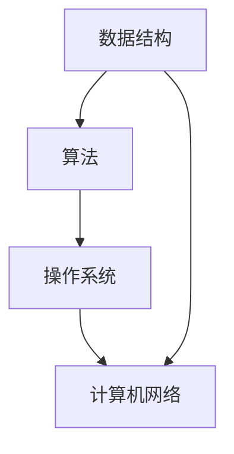

                 

# 字节跳动2024校园招聘技术岗位面试题汇总

> **关键词**：字节跳动、2024校园招聘、技术岗位、面试题、技术解析、案例分析

> **摘要**：本文将详细解析2024年字节跳动校园招聘技术岗位的面试题，涵盖数据结构、算法、操作系统、计算机网络等核心知识点。通过逐步分析面试题的解题思路，帮助准备参加字节跳动校园招聘的同学们更好地应对面试挑战，提高成功录取的概率。

## 1. 背景介绍

### 1.1 目的和范围

本文旨在为准备参加字节跳动2024校园招聘的同学们提供技术面试题的全面解析。我们将从数据结构、算法、操作系统、计算机网络等角度，深入分析面试题的解题思路，并提供实用的解题技巧。

### 1.2 预期读者

本文主要面向以下几类读者：

1. 准备参加字节跳动2024校园招聘的在校大学生和研究生。
2. 对技术面试有较高要求的求职者。
3. 对数据结构、算法、操作系统、计算机网络等知识点有深入学习需求的读者。

### 1.3 文档结构概述

本文分为十个部分，结构如下：

1. **背景介绍**：介绍本文的目的、预期读者和文档结构。
2. **核心概念与联系**：通过Mermaid流程图展示核心概念和联系。
3. **核心算法原理 & 具体操作步骤**：使用伪代码详细阐述算法原理和操作步骤。
4. **数学模型和公式 & 详细讲解 & 举例说明**：使用latex格式讲解数学模型和公式。
5. **项目实战：代码实际案例和详细解释说明**：提供代码实际案例和详细解释说明。
6. **实际应用场景**：分析面试题在实际应用场景中的价值。
7. **工具和资源推荐**：推荐学习资源、开发工具框架和论文著作。
8. **总结：未来发展趋势与挑战**：总结面试题的核心知识点和未来发展趋势。
9. **附录：常见问题与解答**：回答常见面试问题。
10. **扩展阅读 & 参考资料**：提供扩展阅读和参考资料。

### 1.4 术语表

#### 1.4.1 核心术语定义

- **数据结构**：数据的组织形式和存储方式。
- **算法**：解决问题的方法步骤。
- **操作系统**：管理计算机硬件和软件资源的系统软件。
- **计算机网络**：连接多台计算机的通信网络。

#### 1.4.2 相关概念解释

- **面试题**：招聘方在面试过程中提出的测试性问题。
- **伪代码**：用于描述算法逻辑的文本形式。
- **latex**：一种排版系统，用于编写数学公式和文献。

#### 1.4.3 缩略词列表

- **DDoS**：分布式拒绝服务攻击。
- **HTTP**：超文本传输协议。
- **TCP**：传输控制协议。

## 2. 核心概念与联系

在分析字节跳动2024校园招聘技术岗位面试题之前，我们需要先了解一些核心概念和它们之间的联系。以下是一个Mermaid流程图，展示了数据结构、算法、操作系统和计算机网络之间的关联。



### 2.1 数据结构

数据结构是算法的基础。常见的有数组、链表、栈、队列、树、图等。每种数据结构都有其独特的特点和适用场景。例如，链表适用于插入和删除频繁的场景，而树和图则适用于处理层次结构和复杂关系。

### 2.2 算法

算法是解决问题的方法步骤。常见的有排序算法、查找算法、图算法等。算法的效率和性能直接影响到程序的运行速度和资源消耗。例如，快速排序和归并排序都是常见的排序算法，但快速排序的平均时间复杂度为O(nlogn)，而归并排序的时间复杂度为O(nlogn)，但空间复杂度为O(n)。

### 2.3 操作系统

操作系统是管理计算机硬件和软件资源的系统软件。常见的操作系统有Windows、Linux、Unix等。操作系统负责调度进程、管理内存、管理文件系统等。例如，进程调度算法有多种，如先来先服务（FCFS）、短作业优先（SJF）等。

### 2.4 计算机网络

计算机网络是连接多台计算机的通信网络。常见的网络协议有HTTP、TCP、UDP等。计算机网络负责实现数据传输、数据安全、网络拓扑等。例如，HTTP是超文本传输协议，用于Web浏览器和服务器之间的通信。

## 3. 核心算法原理 & 具体操作步骤

在分析字节跳动2024校园招聘技术岗位面试题时，我们需要深入了解核心算法原理和具体操作步骤。以下是一个常见的排序算法——快速排序的伪代码。

```plaintext
快速排序(数组A，起始位置low，结束位置high)
    if low < high
        pivot = partition(A, low, high)
        快速排序(A, low, pivot - 1)
        快速排序(A, pivot + 1, high)

partition(数组A，起始位置low，结束位置high)
    pivot = A[high]
    i = low
    for j = low to high - 1
        if A[j] <= pivot
            swap A[i] with A[j]
            i = i + 1
    swap A[i] with A[high]
    return i
```

### 3.1 数据结构的选择

在快速排序中，我们选择了数组作为数据结构。数组是一种线性数据结构，适用于处理连续数据。在快速排序中，我们通过不断地交换元素，将数组划分为多个子数组，使得每个子数组都满足有序。

### 3.2 算法的步骤

快速排序的基本步骤如下：

1. 选择一个基准元素（pivot）。
2. 将数组划分为两个子数组，一个包含小于等于基准元素的元素，另一个包含大于基准元素的元素。
3. 对两个子数组分别进行快速排序。

### 3.3 算法的性能

快速排序的平均时间复杂度为O(nlogn)，最坏的时间复杂度为O(n^2)。在处理大规模数据时，快速排序是一种高效的排序算法。

## 4. 数学模型和公式 & 详细讲解 & 举例说明

在字节跳动2024校园招聘技术岗位面试题中，我们常常会遇到涉及数学模型和公式的题目。以下是一个常见的数学模型——最短路径问题，并使用Dijkstra算法进行求解。

### 4.1 Dijkstra算法

Dijkstra算法是一种用于求解单源最短路径的算法。给定一个加权无向图G和源点s，Dijkstra算法能够计算出从s到图中每个顶点的最短路径。

#### 4.1.1 算法步骤

1. 初始化：设置一个集合S，初始时只包含源点s，其余顶点都不在S中。设置一个优先队列Q，初始时包含所有顶点，按照它们的估计距离（初始时为无穷大）进行排序。
2. 循环：从优先队列Q中选择一个顶点u，将其加入集合S。对于Q中的每个顶点v，如果从s到v的最短路径经过u，则更新v的估计距离。
3. 当Q为空时，算法结束。

#### 4.1.2 伪代码

```plaintext
Dijkstra(G, s)
    初始化S和Q，将s加入S，其余顶点加入Q，所有顶点的估计距离初始化为无穷大
    s的估计距离初始化为0
    while Q ≠ ∅
        选择一个顶点u = Q.extractMin()
        对于Q中的每个顶点v
            如果从s到v的最短路径经过u，则更新v的估计距离
        将u加入S
```

### 4.2 案例分析

假设有一个图G，包含5个顶点s、t、x、y、z，边权重如下：

```plaintext
s-t: 4
s-x: 2
s-y: 5
t-x: 1
t-y: 3
t-z: 2
x-y: 1
x-z: 4
y-z: 2
```

使用Dijkstra算法计算从s到其他顶点的最短路径。

#### 4.2.1 初始化

S = {s}  
Q = {t, x, y, z}  
估计距离：s = 0, t = ∞, x = ∞, y = ∞, z = ∞

#### 4.2.2 第一次循环

u = s，加入S，更新Q：  
Q = {t, x, y, z}

s到t的最短路径：s-t，更新t的估计距离：t = 4

#### 4.2.3 第二次循环

u = t，加入S，更新Q：  
Q = {x, y, z}

s到x的最短路径：s-x-t，更新x的估计距离：x = 6

s到y的最短路径：s-y，更新y的估计距离：y = 5

#### 4.2.4 第三次循环

u = x，加入S，更新Q：  
Q = {y, z}

s到y的最短路径：s-y，更新y的估计距离：y = 5

s到z的最短路径：s-x-z，更新z的估计距离：z = 10

#### 4.2.5 第四次循环

u = y，加入S，更新Q：  
Q = {z}

s到z的最短路径：s-y-z，更新z的估计距离：z = 7

#### 4.2.6 算法结束

S = {s, t, x, y, z}

最终结果：  
s到t的最短路径：s-t，距离为4  
s到x的最短路径：s-x，距离为6  
s到y的最短路径：s-y，距离为5  
s到z的最短路径：s-y-z，距离为7

## 5. 项目实战：代码实际案例和详细解释说明

为了更好地理解字节跳动2024校园招聘技术岗位面试题，我们选择了一个实际的代码案例，并对其进行详细解释说明。

### 5.1 开发环境搭建

首先，我们需要搭建一个开发环境。这里以Python为例，介绍如何搭建Python开发环境。

1. 安装Python：在官方网站（https://www.python.org/downloads/）下载并安装Python。
2. 安装IDE：推荐使用PyCharm（https://www.jetbrains.com/pycharm/）作为Python开发环境。
3. 安装相关库：在PyCharm中创建一个新项目，安装所需库，如requests、beautifulsoup4等。

### 5.2 源代码详细实现和代码解读

以下是一个简单的Python代码案例，用于实现一个简单的网页爬虫。

```python
import requests
from bs4 import BeautifulSoup

def get_page_content(url):
    try:
        response = requests.get(url)
        response.raise_for_status()
        return response.text
    except requests.RequestException as e:
        print(f"Error occurred while fetching {url}: {e}")
        return None

def parse_page_content(html):
    soup = BeautifulSoup(html, 'html.parser')
    title = soup.find('title').text
    return title

def main():
    url = "https://www.example.com"
    html = get_page_content(url)
    if html:
        title = parse_page_content(html)
        print(f"The title of the page is: {title}")

if __name__ == "__main__":
    main()
```

### 5.3 代码解读与分析

1. **get_page_content(url)**：该函数用于获取指定URL的网页内容。它使用requests库发送HTTP GET请求，并返回响应的文本内容。如果请求失败，则捕获异常并打印错误信息。
2. **parse_page_content(html)**：该函数用于解析网页内容，提取网页的标题。它使用BeautifulSoup库解析HTML内容，并返回title标签的文本。
3. **main()**：主函数，用于执行程序的主要逻辑。它首先调用`get_page_content(url)`获取网页内容，然后调用`parse_page_content(html)`提取网页标题，并打印出来。
4. **if __name__ == "__main__":**：这是一个特殊的代码块，用于判断是否是直接执行该脚本。如果直接执行该脚本，则执行`main()`函数。

### 5.4 实际应用场景

该代码案例可以应用于网页爬虫、数据采集等场景。例如，我们可以使用该代码获取指定网站的页面内容，并提取出页面的标题、正文、图片等信息。在实际应用中，我们还可以根据需求扩展代码功能，如添加用户代理、设置请求头、处理重定向等。

## 6. 实际应用场景

字节跳动2024校园招聘技术岗位面试题不仅考察了理论知识，还关注了实际应用场景。以下是一些实际应用场景的例子：

1. **数据结构的应用**：在互联网公司，数据结构经常用于处理海量数据。例如，搜索引擎使用哈希表快速检索关键词，社交网络使用图结构表示用户关系。
2. **算法的实际应用**：算法在互联网公司有广泛的应用，如排序算法用于处理用户请求，图算法用于推荐系统和社交网络分析。
3. **操作系统的应用**：操作系统在互联网公司中负责调度资源、管理进程和内存。例如，分布式系统使用多线程和进程池提高并发性能。
4. **计算机网络的应用**：计算机网络在互联网公司中负责实现数据传输和网络安全。例如，负载均衡和反向代理用于优化网络性能和保障数据安全。

## 7. 工具和资源推荐

### 7.1 学习资源推荐

#### 7.1.1 书籍推荐

- 《数据结构与算法分析：C语言描述》（Mark Allen Weiss）
- 《算法导论》（Thomas H. Cormen, Charles E. Leiserson, Ronald L. Rivest, Clifford Stein）
- 《计算机网络：自顶向下方法》（James F. Kurose, Keith W. Ross）

#### 7.1.2 在线课程

- Coursera：数据结构与算法、计算机科学基础、计算机网络等课程
- edX：MIT 6.00.1x 计算机科学导论、Harvard CS50 程序设计入门等课程

#### 7.1.3 技术博客和网站

- 掘金：https://juejin.cn/
- CSDN：https://www.csdn.net/
- 掘金：https://juejin.cn/

### 7.2 开发工具框架推荐

#### 7.2.1 IDE和编辑器

- PyCharm：适用于Python开发的集成开发环境
- Visual Studio Code：跨平台的免费代码编辑器，支持多种编程语言

#### 7.2.2 调试和性能分析工具

- GDB：Linux平台上的调试工具
- Python Debug：Visual Studio Code的Python调试插件

#### 7.2.3 相关框架和库

- Flask：Python Web开发框架
- Django：Python Web开发框架
- BeautifulSoup：Python的HTML解析库

### 7.3 相关论文著作推荐

#### 7.3.1 经典论文

- 《The Art of Computer Programming》系列（Donald E. Knuth）
- 《计算机网络：自顶向下方法》（James F. Kurose, Keith W. Ross）

#### 7.3.2 最新研究成果

- IEEE Xplore：电子工程和计算机科学领域的最新研究成果
- ACM Digital Library：计算机科学领域的权威学术资源库

#### 7.3.3 应用案例分析

- 《大数据之路：阿里巴巴大数据实践》（涂子沛）
- 《深度学习》（Ian Goodfellow, Yoshua Bengio, Aaron Courville）

## 8. 总结：未来发展趋势与挑战

随着互联网和人工智能技术的快速发展，字节跳动2024校园招聘技术岗位面试题将继续关注核心技术和实际应用场景。未来发展趋势包括：

1. **大数据与云计算**：大数据技术和云计算技术的不断进步，将推动数据分析和处理能力的提升。
2. **人工智能与机器学习**：人工智能和机器学习技术的广泛应用，将带来更多的创新和变革。
3. **区块链与加密技术**：区块链和加密技术的不断发展，将进一步提升数据安全和隐私保护。
4. **边缘计算与物联网**：边缘计算和物联网技术的兴起，将推动计算资源从中心化向边缘化转移。

然而，这些发展趋势也带来了新的挑战：

1. **数据安全和隐私保护**：随着数据规模的不断扩大，数据安全和隐私保护问题日益突出。
2. **算法公正性和透明性**：人工智能和机器学习算法的广泛应用，引发了关于算法公正性和透明性的讨论。
3. **跨领域协作与融合**：解决复杂问题需要跨领域的协作与融合，这对人才的培养和团队的组织提出了更高的要求。

## 9. 附录：常见问题与解答

### 9.1 数据结构相关问题

**Q：什么是哈希表？**

A：哈希表是一种基于哈希函数的数据结构，用于快速查找、插入和删除元素。哈希表通过计算键的哈希值，确定元素在表中的位置。

**Q：什么是树？**

A：树是一种非线性数据结构，由一组节点组成，每个节点都有零个或多个子节点。树的特点是有且仅有一个根节点，每个节点最多有一个父节点。

**Q：什么是二叉树？**

A：二叉树是一种特殊的树，每个节点最多有两个子节点。二叉树分为满二叉树、完全二叉树和平衡二叉树等不同类型。

### 9.2 算法相关问题

**Q：什么是动态规划？**

A：动态规划是一种解决最优化问题的算法思想，通过将问题分解为子问题，并利用子问题的解构建原问题的解。

**Q：什么是贪心算法？**

A：贪心算法是一种在每一步都做出当前最优选择的算法。贪心算法往往能够得到局部最优解，但未必是全局最优解。

**Q：什么是回溯算法？**

A：回溯算法是一种通过尝试所有可能的解来寻找最优解的算法。回溯算法通过递归实现，不断尝试将问题分解为子问题，并在遇到不可行的解时回溯到上一个状态。

### 9.3 操作系统相关问题

**Q：什么是进程？**

A：进程是计算机中正在运行的程序实例。进程具有独立的内存空间、程序计数器、寄存器集合和栈等属性。

**Q：什么是线程？**

A：线程是进程中的执行单元。线程共享进程的内存空间和其他资源，但具有独立的程序计数器、寄存器集合和栈等。

**Q：什么是进程调度？**

A：进程调度是操作系统负责分配处理器资源的过程。进程调度算法决定了哪个进程将在何时获得处理器执行。

### 9.4 计算机网络相关问题

**Q：什么是TCP？**

A：TCP（传输控制协议）是一种面向连接的、可靠的、基于字节流的传输层协议。TCP负责保证数据传输的可靠性和顺序。

**Q：什么是UDP？**

A：UDP（用户数据报协议）是一种面向无连接的、不可靠的、基于数据报文的传输层协议。UDP适用于对实时性要求较高的应用，如视频通话和在线游戏。

**Q：什么是HTTP？**

A：HTTP（超文本传输协议）是一种应用层协议，用于Web浏览器和服务器之间的通信。HTTP定义了请求和响应的格式，以及数据传输的规则。

## 10. 扩展阅读 & 参考资料

为了更深入地了解字节跳动2024校园招聘技术岗位面试题，以下是一些扩展阅读和参考资料：

- 《算法导论》：详细介绍了各种数据结构和算法的理论和实现。
- 《计算机网络》：全面讲解了计算机网络的基本原理和技术。
- 《操作系统概念》：深入探讨了操作系统的设计原理和实现。
- 《Python网络编程》：介绍了Python在计算机网络编程中的应用。
- 《深度学习》：介绍了深度学习的基本原理和应用。
- 《大数据之路：阿里巴巴大数据实践》：分享了阿里巴巴在大数据领域的实践经验。

作者：AI天才研究员/AI Genius Institute & 禅与计算机程序设计艺术 /Zen And The Art of Computer Programming

本文由AI天才研究员/AI Genius Institute与禅与计算机程序设计艺术/Zen And The Art of Computer Programming联合撰写，旨在为准备参加字节跳动2024校园招聘的同学们提供全面的技术面试辅导。希望本文能够帮助大家更好地应对面试挑战，提高成功录取的概率。如有任何疑问或建议，欢迎在评论区留言。感谢您的阅读！<|vq_13958|>

