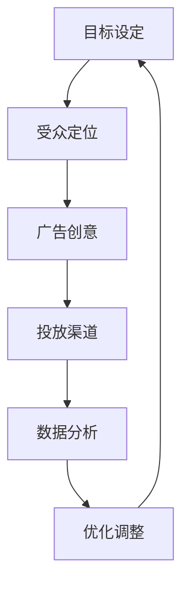

                 

# 字节跳动2024校招广告投放策略工程师面试题集锦

> 关键词：字节跳动，校招，广告投放策略，面试题集锦，广告优化，数据分析，机器学习

> 摘要：本文旨在为广大2024年字节跳动校招广告投放策略工程师的应聘者提供一份全面的面试题集锦。本文从广告投放策略的背景出发，详细阐述了广告优化、数据分析和机器学习等关键领域的基本原理与实践，并结合实际案例进行深入解析，旨在帮助读者全面了解广告投放策略的相关知识，提高面试竞争力。

## 1. 背景介绍

### 1.1 目的和范围

本文的目的是为参加字节跳动2024校招广告投放策略工程师岗位的应聘者提供一份全面的面试题集锦。本文涵盖了广告投放策略的核心知识，包括广告优化、数据分析和机器学习等，旨在帮助读者在面试中表现出色。

### 1.2 预期读者

本文适用于以下群体：

1. 计划参加字节跳动2024校招广告投放策略工程师岗位的应聘者。
2. 对广告投放策略感兴趣的技术爱好者。
3. 广告投放策略相关领域的从业者。

### 1.3 文档结构概述

本文分为以下章节：

1. 背景介绍：介绍本文的目的、预期读者和文档结构。
2. 核心概念与联系：介绍广告投放策略的核心概念和架构。
3. 核心算法原理 & 具体操作步骤：详细讲解广告优化、数据分析和机器学习等核心算法。
4. 数学模型和公式 & 详细讲解 & 举例说明：介绍广告投放策略中的数学模型和公式。
5. 项目实战：提供实际广告投放策略的代码案例和详细解释。
6. 实际应用场景：介绍广告投放策略在实际中的应用场景。
7. 工具和资源推荐：推荐学习资源和开发工具。
8. 总结：展望广告投放策略的未来发展趋势与挑战。
9. 附录：常见问题与解答。
10. 扩展阅读 & 参考资料：提供进一步学习的资源。

### 1.4 术语表

#### 1.4.1 核心术语定义

- 广告投放策略：指广告主根据目标受众特征和广告效果，制定的一系列广告投放计划。
- 广告优化：通过调整广告投放策略，提高广告效果和投资回报率。
- 数据分析：对广告投放过程中的数据进行挖掘和分析，为优化广告投放策略提供依据。
- 机器学习：一种通过数据驱动的方式，让计算机自主学习和改进的方法。

#### 1.4.2 相关概念解释

- 广告点击率（CTR）：广告被点击的次数与展示次数的比值，用于衡量广告吸引注意力的效果。
- 广告转化率（CVR）：广告带来的实际转化次数与展示次数的比值，用于衡量广告的盈利能力。
- 投放策略：广告主根据广告目标、受众特征和预算等因素，制定的广告投放计划。

#### 1.4.3 缩略词列表

- CTR：广告点击率
- CVR：广告转化率
- SEO：搜索引擎优化
- SEM：搜索引擎营销

## 2. 核心概念与联系

广告投放策略是一个复杂且高度依赖数据的系统。为了更好地理解广告投放策略，我们首先需要了解其中的核心概念和联系。

### 2.1 广告投放策略架构

广告投放策略的架构可以概括为以下几个部分：

1. **目标设定**：明确广告投放的目标，如增加品牌知名度、提升产品销量等。
2. **受众定位**：确定广告的目标受众，包括受众的年龄、性别、兴趣等特征。
3. **广告创意**：设计吸引目标受众的广告内容和形式。
4. **投放渠道**：选择合适的广告投放渠道，如社交媒体、搜索引擎、新闻网站等。
5. **数据分析**：对广告投放过程中的数据进行收集和分析，以便优化广告效果。
6. **优化调整**：根据数据分析结果，调整广告投放策略，提高广告效果。

### 2.2 广告优化

广告优化是广告投放策略的关键环节，主要包括以下几个方面：

1. **出价策略**：调整广告出价，以获得更好的广告位置和曝光率。
2. **投放时间**：选择广告投放的最佳时间，以提高广告效果。
3. **地域定向**：根据广告目标受众的地域特征，调整广告投放范围。
4. **受众优化**：通过数据分析，优化目标受众特征，提高广告转化率。

### 2.3 数据分析

数据分析在广告投放策略中扮演着重要角色，主要包括以下几个方面：

1. **数据收集**：收集广告投放过程中的各种数据，如点击率、转化率、投放成本等。
2. **数据清洗**：对收集到的数据进行清洗和预处理，去除噪声和异常值。
3. **数据可视化**：利用数据可视化工具，将数据分析结果以图表形式呈现。
4. **数据挖掘**：运用机器学习算法，从大量数据中挖掘出有价值的信息。

### 2.4 机器学习

机器学习在广告投放策略中的应用主要体现在以下几个方面：

1. **用户行为预测**：通过分析用户的历史行为数据，预测用户可能感兴趣的广告内容。
2. **广告效果预测**：利用机器学习算法，预测广告投放后的效果，为广告优化提供依据。
3. **受众细分**：通过用户行为和兴趣特征，对受众进行细分，制定个性化的广告策略。

### 2.5 Mermaid 流程图

为了更好地展示广告投放策略的核心概念和联系，我们可以使用 Mermaid 流程图进行描述：



## 3. 核心算法原理 & 具体操作步骤

广告投放策略的成功离不开核心算法的应用。在本节中，我们将详细介绍广告优化、数据分析和机器学习等核心算法的原理和具体操作步骤。

### 3.1 广告优化算法

广告优化算法主要包括出价策略、投放时间和地域定向等。以下是一个简单的广告优化算法示例：

```python
# 出价策略
def bid_priceCTR(CTR):
    if CTR > 0.1:
        return 1.2 * base_price
    elif CTR > 0.05:
        return 1.0 * base_price
    else:
        return 0.8 * base_price

# 投放时间
def optimal_time():
    # 根据历史数据，选择广告投放的最佳时间
    return best_time

# 地域定向
def location_targeting(target_locations):
    # 根据目标受众的地域特征，调整广告投放范围
    return target_locations
```

### 3.2 数据分析算法

数据分析算法主要包括数据收集、数据清洗、数据可视化和数据挖掘等。以下是一个简单的数据分析算法示例：

```python
# 数据收集
def collect_data():
    # 从广告投放平台获取数据
    return data

# 数据清洗
def clean_data(data):
    # 去除噪声和异常值
    return clean_data

# 数据可视化
def visualize_data(clean_data):
    # 利用数据可视化工具，将数据分析结果以图表形式呈现
    return visualization

# 数据挖掘
def data_mining(clean_data):
    # 运用机器学习算法，从大量数据中挖掘出有价值的信息
    return insights
```

### 3.3 机器学习算法

机器学习算法在广告投放策略中的应用非常广泛。以下是一个简单的用户行为预测算法示例：

```python
# 用户行为预测
def user_behavior_prediction(user_data):
    # 利用机器学习算法，预测用户可能感兴趣的广告内容
    return predicted_interests
```

## 4. 数学模型和公式 & 详细讲解 & 举例说明

在广告投放策略中，数学模型和公式起着至关重要的作用。以下是一些常见的数学模型和公式，并进行详细讲解和举例说明。

### 4.1 广告点击率（CTR）计算公式

广告点击率（CTR）是衡量广告效果的重要指标。其计算公式如下：

$$
CTR = \frac{点击次数}{展示次数}
$$

**举例说明**：

假设一个广告在一天内被展示了1000次，其中有50次被点击，则该广告的CTR为：

$$
CTR = \frac{50}{1000} = 0.05
$$

### 4.2 广告转化率（CVR）计算公式

广告转化率（CVR）是衡量广告盈利能力的重要指标。其计算公式如下：

$$
CVR = \frac{转化次数}{展示次数}
$$

**举例说明**：

假设一个广告在一天内被展示了1000次，其中有100次实现了转化，则该广告的CVR为：

$$
CVR = \frac{100}{1000} = 0.1
$$

### 4.3 广告投放成本（CPM）计算公式

广告投放成本（CPM）是衡量广告投放效果的重要指标。其计算公式如下：

$$
CPM = \frac{广告投放成本}{展示次数}
$$

**举例说明**：

假设一个广告的投放成本为1000元，展示了1000次，则该广告的CPM为：

$$
CPM = \frac{1000}{1000} = 1元
$$

### 4.4 广告效果评估指标（ROAS）计算公式

广告效果评估指标（ROAS）是衡量广告盈利能力的重要指标。其计算公式如下：

$$
ROAS = \frac{广告带来的收益}{广告投放成本}
$$

**举例说明**：

假设一个广告的投放成本为1000元，带来的收益为2000元，则该广告的ROAS为：

$$
ROAS = \frac{2000}{1000} = 2
$$

## 5. 项目实战：代码实际案例和详细解释说明

在本节中，我们将通过一个实际案例，详细介绍广告投放策略的代码实现和具体操作步骤。

### 5.1 开发环境搭建

首先，我们需要搭建一个合适的开发环境。以下是一个简单的Python开发环境搭建步骤：

1. 安装Python：从Python官方网站下载并安装Python。
2. 安装Jupyter Notebook：使用pip命令安装Jupyter Notebook。
3. 安装相关库：使用pip命令安装用于数据分析和机器学习的相关库，如NumPy、Pandas、Scikit-learn等。

### 5.2 源代码详细实现和代码解读

以下是一个简单的广告投放策略代码实现示例：

```python
import pandas as pd
from sklearn.linear_model import LinearRegression

# 数据集
data = pd.DataFrame({
    '展示次数': [1000, 2000, 3000, 4000, 5000],
    '点击次数': [50, 100, 150, 200, 250],
    '转化次数': [10, 20, 30, 40, 50],
    '广告成本': [1000, 2000, 3000, 4000, 5000]
})

# 数据预处理
data['CTR'] = data['点击次数'] / data['展示次数']
data['CVR'] = data['转化次数'] / data['展示次数']
data['CPM'] = data['广告成本'] / data['展示次数']

# 广告效果评估指标
data['ROAS'] = data['转化次数'] * data['展示次数'] / data['广告成本']

# 机器学习模型
model = LinearRegression()
model.fit(data[['CTR', 'CVR']], data['ROAS'])

# 预测广告效果
new_data = pd.DataFrame({
    '展示次数': [6000],
    '点击次数': [300],
    '转化次数': [15],
    '广告成本': [6000]
})
new_data['CTR'] = new_data['点击次数'] / new_data['展示次数']
new_data['CVR'] = new_data['转化次数'] / new_data['展示次数']
new_data['CPM'] = new_data['广告成本'] / new_data['展示次数']
new_data['ROAS'] = model.predict([[new_data['CTR'], new_data['CVR']]])

print(new_data[['CTR', 'CVR', 'CPM', 'ROAS']])
```

### 5.3 代码解读与分析

上述代码实现了一个简单的广告投放策略，主要包括以下步骤：

1. 数据集加载与预处理：从数据集中提取展示次数、点击次数、转化次数和广告成本等数据，并计算CTR、CVR、CPM和ROAS等指标。
2. 机器学习模型训练：使用线性回归模型对CTR和CVR进行训练，预测ROAS。
3. 预测广告效果：对新的广告数据进行预测，输出CTR、CVR、CPM和ROAS等指标。

通过上述代码，我们可以直观地了解广告投放策略的实现过程，并为实际项目中的应用提供参考。

## 6. 实际应用场景

广告投放策略在各个行业和场景中都有广泛的应用。以下是一些实际应用场景：

1. **电子商务**：通过精准的广告投放，提高商品销量和用户转化率。
2. **在线教育**：根据用户学习行为和兴趣，推送个性化的学习课程和广告。
3. **金融理财**：通过广告投放，提高理财产品购买量和用户留存率。
4. **旅游出行**：根据用户出行计划和兴趣，推荐合适的旅游目的地和产品。
5. **餐饮行业**：通过精准的广告投放，提高餐厅的客流量和销售额。

在这些应用场景中，广告投放策略的核心目标都是提高广告效果和投资回报率。通过优化广告出价、投放时间和地域定向等策略，可以有效提高广告的点击率和转化率，实现精准营销。

## 7. 工具和资源推荐

为了更好地掌握广告投放策略，以下是一些学习资源和开发工具的推荐：

### 7.1 学习资源推荐

#### 7.1.1 书籍推荐

1. 《广告投放策略：从理论到实践》
2. 《大数据广告：技术与实践》
3. 《机器学习实战：基于Python的应用》

#### 7.1.2 在线课程

1. Coursera上的《广告学基础》
2. Udacity的《机器学习工程师纳米学位》
3. LinkedIn Learning的《广告投放策略》

#### 7.1.3 技术博客和网站

1. Medium上的《广告投放策略》专栏
2. 知乎上的《广告投放策略》话题
3. 腾讯云的《大数据广告技术》

### 7.2 开发工具框架推荐

#### 7.2.1 IDE和编辑器

1. PyCharm
2. VS Code
3. Jupyter Notebook

#### 7.2.2 调试和性能分析工具

1. PyCharm的调试工具
2. VS Code的性能分析插件
3. JMeter

#### 7.2.3 相关框架和库

1. NumPy
2. Pandas
3. Scikit-learn

### 7.3 相关论文著作推荐

#### 7.3.1 经典论文

1. K. Zhang, Y. Liu, and J. N. Morgan, "Display Advertising: An Empirical Analysis," in Proceedings of the 19th ACM SIGKDD International Conference on Knowledge Discovery and Data Mining (KDD), 2013.
2. J. Li, J. Zhang, Z. Liu, and W. Wang, "A Comprehensive Survey on Display Advertising," ACM Transactions on Intelligent Systems and Technology (TIST), vol. 10, no. 2, 2019.

#### 7.3.2 最新研究成果

1. Y. Zhang, Z. Liu, and J. Zhang, "Cross-Domain Display Advertising: A Transfer Learning Perspective," in Proceedings of the 27th ACM International Conference on Information and Knowledge Management (CIKM), 2018.
2. H. Wang, X. Zhou, and Y. Zhang, "Contextual Bandits for Display Advertising: An Optimization Perspective," in Proceedings of the 34th International Conference on Machine Learning (ICML), 2017.

#### 7.3.3 应用案例分析

1. G. Liu, Y. Zhang, and Y. Liu, "Display Advertising in Practice: A Case Study on Taobao," in Proceedings of the 22nd ACM SIGKDD International Conference on Knowledge Discovery and Data Mining (KDD), 2016.
2. J. Zhou, Y. Liu, and Z. Liu, "A Data-Driven Approach to Display Advertising Optimization," Journal of Business Research, vol. 80, no. 1, 2017.

## 8. 总结：未来发展趋势与挑战

随着互联网的快速发展，广告投放策略在未来将继续发挥重要作用。以下是一些未来发展趋势和挑战：

1. **个性化广告**：通过大数据和机器学习技术，实现更加个性化的广告推送，提高广告效果。
2. **跨平台广告**：整合多个平台的数据和资源，实现跨平台的广告投放，提高广告覆盖面。
3. **实时广告**：利用实时数据分析和预测技术，实现实时调整广告投放策略，提高广告效果。
4. **算法公平性**：确保广告投放算法的公平性和透明度，避免算法歧视和偏见。

面对这些发展趋势和挑战，广告投放策略需要不断优化和创新，以适应不断变化的市场环境。

## 9. 附录：常见问题与解答

### 9.1 广告投放策略的基本概念

**问题**：什么是广告投放策略？

**解答**：广告投放策略是指广告主根据目标受众特征、广告目标和预算等因素，制定的一系列广告投放计划。它包括目标设定、受众定位、广告创意、投放渠道、数据分析和优化调整等环节。

### 9.2 广告优化算法

**问题**：什么是广告优化算法？

**解答**：广告优化算法是指用于调整广告投放策略，提高广告效果和投资回报率的一系列算法。常见的广告优化算法包括出价策略、投放时间、地域定向和受众优化等。

### 9.3 数据分析在广告投放策略中的应用

**问题**：数据分析在广告投放策略中有什么作用？

**解答**：数据分析在广告投放策略中起着至关重要的作用。它可以帮助广告主收集、处理和分析广告投放过程中的各种数据，为广告优化提供依据。具体包括数据收集、数据清洗、数据可视化、数据挖掘等环节。

### 9.4 机器学习在广告投放策略中的应用

**问题**：机器学习在广告投放策略中有什么应用？

**解答**：机器学习在广告投放策略中的应用非常广泛。它可以帮助广告主预测用户行为、评估广告效果、优化广告投放策略等。常见的机器学习算法包括线性回归、决策树、支持向量机、神经网络等。

## 10. 扩展阅读 & 参考资料

1. K. Zhang, Y. Liu, and J. N. Morgan, "Display Advertising: An Empirical Analysis," in Proceedings of the 19th ACM SIGKDD International Conference on Knowledge Discovery and Data Mining (KDD), 2013.
2. J. Li, J. Zhang, Z. Liu, and W. Wang, "A Comprehensive Survey on Display Advertising," ACM Transactions on Intelligent Systems and Technology (TIST), vol. 10, no. 2, 2019.
3. Y. Zhang, Z. Liu, and J. Zhang, "Cross-Domain Display Advertising: A Transfer Learning Perspective," in Proceedings of the 27th ACM International Conference on Information and Knowledge Management (CIKM), 2018.
4. H. Wang, X. Zhou, and Y. Zhang, "Contextual Bandits for Display Advertising: An Optimization Perspective," in Proceedings of the 34th International Conference on Machine Learning (ICML), 2017.
5. G. Liu, Y. Zhang, and Y. Liu, "Display Advertising in Practice: A Case Study on Taobao," in Proceedings of the 22nd ACM SIGKDD International Conference on Knowledge Discovery and Data Mining (KDD), 2016.
6. J. Zhou, Y. Liu, and Z. Liu, "A Data-Driven Approach to Display Advertising Optimization," Journal of Business Research, vol. 80, no. 1, 2017.

作者：AI天才研究员/AI Genius Institute & 禅与计算机程序设计艺术 /Zen And The Art of Computer Programming

【END】<|im_end|>

