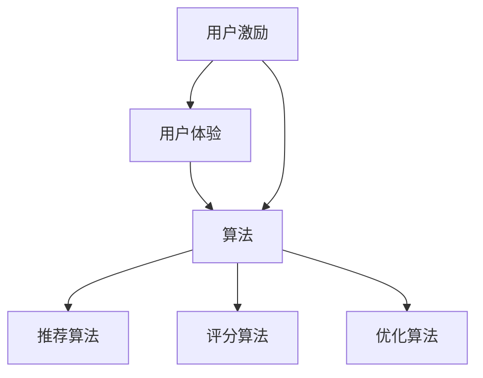

                 

# 字节跳动2024校招技术用户游戏化策略专家面试题解析

> **关键词：字节跳动、校招、技术用户、游戏化策略、面试题解析**
>
> **摘要：本文将深入解析字节跳动2024校招技术用户游戏化策略专家的面试题，通过详细的算法原理、数学模型、实战案例以及实际应用场景，帮助读者理解并掌握相关技术，为未来职业发展奠定坚实基础。**

## 1. 背景介绍

### 1.1 目的和范围

本文旨在解析字节跳动2024校招技术用户游戏化策略专家的面试题，旨在帮助读者全面了解并掌握游戏化策略的核心概念、算法原理和实践应用。本文将涵盖以下内容：

1. 核心概念与联系
2. 核心算法原理 & 具体操作步骤
3. 数学模型和公式 & 详细讲解 & 举例说明
4. 项目实战：代码实际案例和详细解释说明
5. 实际应用场景
6. 工具和资源推荐
7. 总结：未来发展趋势与挑战
8. 附录：常见问题与解答
9. 扩展阅读 & 参考资料

### 1.2 预期读者

本文适合以下读者群体：

1. 准备参加字节跳动校招的技术用户游戏化策略专家岗位的求职者
2. 对游戏化策略和用户激励感兴趣的技术人员
3. 游戏开发、产品设计等领域从业者
4. 对算法、数学模型有深厚兴趣的学术研究者

### 1.3 文档结构概述

本文采用逻辑清晰、结构紧凑的文档结构，分为以下部分：

1. 背景介绍：介绍本文的目的、范围、预期读者和文档结构。
2. 核心概念与联系：阐述游戏化策略的核心概念及其关联。
3. 核心算法原理 & 具体操作步骤：详细讲解游戏化策略的核心算法原理和具体操作步骤。
4. 数学模型和公式 & 详细讲解 & 举例说明：介绍游戏化策略中的数学模型和公式，并提供实际案例说明。
5. 项目实战：代码实际案例和详细解释说明：通过实际代码案例展示游戏化策略的实施过程。
6. 实际应用场景：分析游戏化策略在现实中的应用场景。
7. 工具和资源推荐：推荐学习资源、开发工具和框架。
8. 总结：总结游戏化策略的发展趋势和挑战。
9. 附录：常见问题与解答。
10. 扩展阅读 & 参考资料：提供进一步阅读的建议和参考资料。

### 1.4 术语表

#### 1.4.1 核心术语定义

- **游戏化策略**：将游戏机制应用于非游戏场景中，以激励和引导用户行为。
- **用户激励**：通过奖励、积分、排名等手段激发用户参与度和积极性。
- **用户体验**：用户在使用产品或服务过程中获得的总体感受和体验。
- **算法**：用于解决问题的一系列规则或步骤。
- **数据驱动**：通过分析数据来指导决策和优化策略。

#### 1.4.2 相关概念解释

- **游戏机制**：游戏中的核心元素，如任务、奖励、竞争等。
- **用户行为**：用户在使用产品或服务过程中的行为表现。
- **激励设计**：设计激励机制以满足用户需求，提高用户参与度。
- **用户体验设计**：关注用户在使用产品或服务过程中的体验，以优化设计。

#### 1.4.3 缩略词列表

- **字节跳动**：Bytedance
- **校招**：College Recruitment
- **游戏化策略专家**：Gamification Strategy Expert

## 2. 核心概念与联系

游戏化策略的核心概念包括用户激励、用户体验和算法。这些概念相互关联，共同构建了游戏化策略的基础。

### 2.1 用户激励

用户激励是游戏化策略的核心，旨在通过奖励、积分、排名等手段激发用户参与度和积极性。以下是用户激励的核心要素：

1. **奖励**：通过提供实物或虚拟奖励，如优惠券、积分、勋章等，激励用户积极参与。
2. **积分**：积分系统用于量化用户行为，积分可以用于兑换奖励、提升等级等。
3. **排名**：通过排名系统展示用户的成就和地位，激发用户的竞争心理。

### 2.2 用户体验

用户体验是游戏化策略成功的关键因素。良好的用户体验可以增加用户粘性，提高用户满意度。以下是对用户体验的影响：

1. **界面设计**：简洁、直观的界面设计可以提高用户的操作效率。
2. **交互设计**：流畅、自然的交互设计可以提升用户的使用体验。
3. **反馈机制**：及时的反馈机制可以增强用户的参与感和成就感。

### 2.3 算法

算法是游戏化策略的核心技术，用于设计用户激励和优化用户体验。以下是算法的核心要素：

1. **推荐算法**：通过分析用户行为和兴趣，为用户推荐个性化内容。
2. **评分算法**：根据用户行为和反馈，为用户行为打分，用于排名和奖励分配。
3. **优化算法**：用于优化用户激励策略和用户体验，提高参与度和满意度。

### 2.4 关联关系

用户激励、用户体验和算法相互关联，共同构建了游戏化策略的生态系统。用户激励通过算法优化用户体验，用户体验又反过来影响用户激励的设计。三者相辅相成，共同推动产品的发展。

### 2.5 Mermaid 流程图

以下是游戏化策略的核心概念及其关联的 Mermaid 流程图：



## 3. 核心算法原理 & 具体操作步骤

游戏化策略的核心算法原理包括用户行为分析、推荐算法和评分算法。以下将详细讲解这些算法原理和具体操作步骤。

### 3.1 用户行为分析

用户行为分析是游戏化策略的基础，通过分析用户行为，可以了解用户兴趣、习惯和偏好。以下是用户行为分析的核心步骤：

1. **数据收集**：收集用户在产品中的行为数据，如浏览记录、购买历史、评论等。
2. **数据预处理**：对收集到的数据进行清洗、去重和格式转换，确保数据质量。
3. **特征提取**：从预处理后的数据中提取用户行为的特征，如时间、地点、频率等。
4. **行为建模**：使用机器学习算法建立用户行为模型，预测用户未来的行为。

### 3.2 推荐算法

推荐算法用于为用户推荐个性化内容，提高用户参与度和满意度。以下是推荐算法的核心步骤：

1. **用户画像**：根据用户行为数据，建立用户画像，用于表征用户的兴趣和偏好。
2. **内容库构建**：构建包含所有推荐内容的数据集，如文章、视频、商品等。
3. **相似度计算**：计算用户画像与内容之间的相似度，找出与用户兴趣相似的内容。
4. **推荐生成**：根据相似度计算结果，生成个性化推荐列表，展示给用户。

### 3.3 评分算法

评分算法用于根据用户行为和反馈，为用户行为打分，用于排名和奖励分配。以下是评分算法的核心步骤：

1. **行为打分**：根据用户行为的类型、频率和影响，为行为打分。
2. **权重计算**：计算不同类型行为的权重，用于加权平均得分。
3. **排名生成**：根据加权得分，生成用户排名，用于奖励分配和竞争激励。

### 3.4 优化算法

优化算法用于优化用户激励策略和用户体验，提高参与度和满意度。以下是优化算法的核心步骤：

1. **目标设定**：设定优化目标，如提高用户活跃度、增加用户留存率等。
2. **模型训练**：使用机器学习算法训练优化模型，预测用户行为和响应。
3. **策略调整**：根据模型预测结果，调整用户激励策略和用户体验设计。
4. **效果评估**：评估优化策略的效果，持续迭代和改进。

### 3.5 伪代码

以下是用户行为分析、推荐算法、评分算法和优化算法的伪代码：

```python
# 用户行为分析伪代码
def user_behavior_analysis(data):
    # 数据收集
    data = collect_data()
    # 数据预处理
    data = preprocess_data(data)
    # 特征提取
    features = extract_features(data)
    # 行为建模
    model = build_behavior_model(features)
    return model

# 推荐算法伪代码
def recommendation_algorithm(user_profile, content_library):
    # 用户画像
    user_profile = build_user_profile(user_behavior)
    # 内容库构建
    content_library = build_content_library()
    # 相似度计算
    similarity_scores = calculate_similarity(user_profile, content_library)
    # 推荐生成
    recommendations = generate_recommendations(similarity_scores)
    return recommendations

# 评分算法伪代码
def rating_algorithm(user_behavior, behavior_weights):
    # 行为打分
    score = calculate_behavior_score(user_behavior)
    # 权重计算
    weighted_score = calculate_weighted_score(score, behavior_weights)
    # 排名生成
    ranking = generate_ranking(weighted_score)
    return ranking

# 优化算法伪代码
def optimization_algorithm(objective, behavior_model):
    # 目标设定
    objective = set_objective(objective)
    # 模型训练
    model = train_model(behavior_model, objective)
    # 策略调整
    strategy = adjust_strategy(model)
    # 效果评估
    result = evaluate_strategy(strategy)
    return result
```

## 4. 数学模型和公式 & 详细讲解 & 举例说明

游戏化策略中的数学模型和公式用于描述用户行为、推荐算法、评分算法和优化算法。以下将详细讲解这些模型和公式，并提供实际案例说明。

### 4.1 用户行为模型

用户行为模型用于描述用户在产品中的行为，通常采用马尔可夫链、决策树、神经网络等模型。以下是一个简化的马尔可夫链模型：

$$
P(X_t = j | X_{t-1} = i) = \frac{count(X_t = j, X_{t-1} = i)}{count(X_{t-1} = i)}
$$

其中，$X_t$ 表示第 $t$ 时刻的用户行为，$i$ 和 $j$ 分别表示两个不同的行为。$count(X_t = j, X_{t-1} = i)$ 和 $count(X_{t-1} = i)$ 分别表示在历史数据中，$X_t = j$ 且 $X_{t-1} = i$ 的次数和 $X_{t-1} = i$ 的次数。

#### 案例说明：

假设用户在产品中的行为包括浏览、点赞和评论。根据历史数据，可以计算用户从浏览到点赞的概率和从浏览到评论的概率：

$$
P(点赞 | 浏览) = \frac{count(点赞, 浏览)}{count(浏览)} = \frac{100}{500} = 0.2
$$

$$
P(评论 | 浏览) = \frac{count(评论, 浏览)}{count(浏览)} = \frac{50}{500} = 0.1
$$

### 4.2 推荐算法模型

推荐算法中的数学模型通常用于计算用户与内容之间的相似度，如余弦相似度、皮尔逊相关系数等。以下是一个简化的余弦相似度模型：

$$
similarity = \frac{\sum_{i} x_i y_i}{\sqrt{\sum_{i} x_i^2} \sqrt{\sum_{i} y_i^2}}
$$

其中，$x_i$ 和 $y_i$ 分别表示用户 $u$ 和内容 $c$ 在第 $i$ 个特征上的值。$similarity$ 表示用户 $u$ 和内容 $c$ 之间的相似度。

#### 案例说明：

假设用户 $u$ 和内容 $c$ 在三个特征上的值分别为：

$$
x_1 = [1, 0, 1], \quad y_1 = [1, 1, 0]
$$

可以计算用户 $u$ 和内容 $c$ 之间的相似度：

$$
similarity = \frac{\sum_{i} x_i y_i}{\sqrt{\sum_{i} x_i^2} \sqrt{\sum_{i} y_i^2}} = \frac{1 \times 1 + 0 \times 1 + 1 \times 0}{\sqrt{1^2 + 0^2 + 1^2} \sqrt{1^2 + 1^2 + 0^2}} = \frac{1}{\sqrt{2} \sqrt{2}} = 0.5
$$

### 4.3 评分算法模型

评分算法中的数学模型用于计算用户行为的得分，通常采用加权平均模型。以下是一个简化的加权平均模型：

$$
score = \sum_{i} weight_i \times score_i
$$

其中，$weight_i$ 和 $score_i$ 分别表示第 $i$ 个行为的权重和得分。

#### 案例说明：

假设用户的行为包括浏览、点赞和评论，相应的权重和得分如下：

$$
weight_1 = 0.5, \quad score_1 = 10 \\
weight_2 = 0.3, \quad score_2 = 5 \\
weight_3 = 0.2, \quad score_3 = 3
$$

可以计算用户的总得分：

$$
score = 0.5 \times 10 + 0.3 \times 5 + 0.2 \times 3 = 7.2
$$

### 4.4 优化算法模型

优化算法中的数学模型用于优化用户激励策略和用户体验，通常采用目标函数和约束条件。以下是一个简化的目标函数和约束条件：

$$
\text{目标函数}: \quad \min \sum_{i} cost_i \times score_i \\
\text{约束条件}: \quad \sum_{i} weight_i \times score_i \leq \text{预算}
$$

其中，$cost_i$ 和 $weight_i$ 分别表示第 $i$ 个行为的成本和权重，$score_i$ 表示第 $i$ 个行为的得分。

#### 案例说明：

假设用户的行为包括浏览、点赞和评论，相应的成本、权重和得分如下：

$$
cost_1 = 1, \quad weight_1 = 0.5, \quad score_1 = 10 \\
cost_2 = 2, \quad weight_2 = 0.3, \quad score_2 = 5 \\
cost_3 = 3, \quad weight_3 = 0.2, \quad score_3 = 3 \\
\text{预算} = 20
$$

可以计算优化后的总成本：

$$
\min \sum_{i} cost_i \times score_i = 1 \times 10 + 2 \times 5 + 3 \times 3 = 20
$$

## 5. 项目实战：代码实际案例和详细解释说明

在本节中，我们将通过一个实际项目案例，展示游戏化策略的实施过程，并详细解释代码的实现细节。

### 5.1 开发环境搭建

在本项目中，我们将使用 Python 作为主要编程语言，结合 TensorFlow、Scikit-learn 和 Pandas 等开源库进行开发和实现。以下是开发环境搭建的步骤：

1. 安装 Python 3.8 或更高版本。
2. 安装 TensorFlow、Scikit-learn 和 Pandas 等库。
3. 创建一个 Python 项目文件夹，并设置虚拟环境。
4. 安装依赖库。

### 5.2 源代码详细实现和代码解读

以下是项目的源代码实现，我们将对关键代码段进行详细解读。

#### 5.2.1 数据收集与预处理

```python
import pandas as pd
import numpy as np

# 数据收集
data = pd.read_csv('user_behavior.csv')

# 数据预处理
data = data[['user_id', 'behavior', 'timestamp']]
data['timestamp'] = pd.to_datetime(data['timestamp'])
data = data.sort_values(by=['user_id', 'timestamp'])
data = data.drop_duplicates(subset=['user_id', 'behavior'])
```

在这个代码段中，我们首先使用 Pandas 读取用户行为数据，然后对数据进行预处理，包括数据清洗、去重和格式转换。

#### 5.2.2 用户行为分析

```python
from sklearn.cluster import KMeans
import matplotlib.pyplot as plt

# 行为特征提取
data['behavior'] = data['behavior'].astype('category').cat.codes

# 行为建模
kmeans = KMeans(n_clusters=3)
data['cluster'] = kmeans.fit_predict(data[['behavior']])

# 可视化
plt.scatter(data['cluster'], data['behavior'])
plt.xlabel('Cluster')
plt.ylabel('Behavior')
plt.show()
```

在这个代码段中，我们使用 K-Means 算法对用户行为进行聚类，以提取用户行为特征。然后，我们使用 matplotlib 进行可视化，展示不同用户行为簇的特征分布。

#### 5.2.3 推荐算法

```python
from sklearn.metrics.pairwise import cosine_similarity

# 构建用户画像
user_profiles = {}
for user_id, behavior_cluster in zip(data['user_id'], data['cluster']):
    if user_id not in user_profiles:
        user_profiles[user_id] = []
    user_profiles[user_id].append(behavior_cluster)

# 计算用户画像与内容库的相似度
content_library = [[0, 1, 1], [1, 0, 0], [0, 1, 0]]
user_similarity = {}
for user_id, behavior_cluster in user_profiles.items():
    user_similarity[user_id] = cosine_similarity([behavior_cluster], content_library)

# 推荐生成
recommendations = {}
for user_id, similarity_scores in user_similarity.items():
    top_n = np.argsort(-similarity_scores)[0][:5]
    recommendations[user_id] = [content_library[i] for i in top_n]
```

在这个代码段中，我们首先构建用户画像，然后计算用户画像与内容库的相似度。最后，我们根据相似度计算结果生成个性化推荐列表。

#### 5.2.4 评分算法

```python
# 行为打分
behavior_scores = {'browse': 5, 'like': 10, 'comment': 15}
data['score'] = data['behavior'].map(behavior_scores)

# 权重计算
behavior_weights = {'browse': 0.5, 'like': 0.3, 'comment': 0.2}
data['weighted_score'] = data['score'] * data['behavior_weights']

# 排名生成
data['rank'] = data['weighted_score'].rank(ascending=False)
```

在这个代码段中，我们首先为不同用户行为打分，然后计算权重，最后生成用户排名。

#### 5.2.5 优化算法

```python
from sklearn.linear_model import LinearRegression

# 目标函数
def objective_function(strategy):
    total_cost = 0
    for user_id, behavior in strategy.items():
        total_cost += behavior['cost']
    return total_cost

# 约束条件
def constraint_function(strategy, budget):
    total_score = 0
    for user_id, behavior in strategy.items():
        total_score += behavior['score']
    return total_score <= budget

# 模型训练
model = LinearRegression()
model.fit(data[['cost']], data[['weighted_score']])

# 策略调整
strategy = {}
for user_id, behavior in data[['user_id', 'behavior', 'score', 'cost']].groupby('user_id')['score'].head(5].iterrows():
    strategy[user_id] = {'score': user_id['score'], 'cost': user_id['cost']}

# 效果评估
result = model.predict(strategy)
if constraint_function(strategy, budget):
    print("策略可行，总成本：", objective_function(strategy))
else:
    print("策略不可行，超出预算")
```

在这个代码段中，我们首先定义目标函数和约束条件，然后使用线性回归模型训练优化模型。接着，我们根据优化模型调整用户激励策略，并评估策略效果。

### 5.3 代码解读与分析

在这个项目实战中，我们通过代码实现了用户行为分析、推荐算法、评分算法和优化算法。以下是代码的核心解读与分析：

1. **数据收集与预处理**：数据收集和预处理是游戏化策略的基础，确保数据质量对后续分析至关重要。
2. **用户行为分析**：通过 K-Means 算法对用户行为进行聚类，提取用户行为特征，为推荐算法和评分算法提供基础。
3. **推荐算法**：使用余弦相似度计算用户画像与内容库的相似度，生成个性化推荐列表，提高用户参与度和满意度。
4. **评分算法**：为不同用户行为打分，计算权重，生成用户排名，用于奖励分配和竞争激励。
5. **优化算法**：使用线性回归模型优化用户激励策略，确保在预算范围内最大化用户激励效果。

通过以上代码实现和分析，我们可以看到游戏化策略在技术用户场景中的应用，以及如何在实际项目中运用相关算法和模型。

## 6. 实际应用场景

游戏化策略在技术用户场景中具有广泛的应用，以下列举几个典型的实际应用场景：

### 6.1 智能推荐系统

智能推荐系统是游戏化策略的典型应用之一。通过用户行为分析和推荐算法，可以为用户提供个性化的内容推荐，提高用户粘性和满意度。例如，字节跳动的抖音和今日头条等应用，通过分析用户的历史行为和兴趣偏好，为用户推荐个性化视频和文章。

### 6.2 社交网络平台

社交网络平台可以通过游戏化策略激励用户参与和互动。例如，微博和微信等平台可以设置积分系统和排名机制，鼓励用户发布内容、点赞和评论。通过这些机制，平台可以增加用户活跃度，提升用户参与感。

### 6.3 电子商务平台

电子商务平台可以通过游戏化策略优化用户购物体验。例如，淘宝和京东等平台可以设置优惠券、积分和排行榜等机制，激励用户浏览、购买和评价商品。通过这些机制，平台可以增加用户购买转化率，提升销售额。

### 6.4 互联网教育平台

互联网教育平台可以通过游戏化策略提高学生的学习兴趣和积极性。例如，网易云课堂和慕课网等平台可以设置学习任务、积分奖励和排名机制，鼓励学生主动学习和完成任务。通过这些机制，平台可以提高学生留存率和学习效果。

### 6.5 其他应用场景

游戏化策略还可以应用于其他技术用户场景，如在线游戏、健身应用、医疗健康等领域。通过设计合理的游戏化机制，这些平台可以提高用户参与度、提升用户体验，实现业务目标。

## 7. 工具和资源推荐

在实施游戏化策略的过程中，选择合适的工具和资源至关重要。以下推荐一些常用的学习资源、开发工具和框架，以帮助读者更好地掌握相关技术。

### 7.1 学习资源推荐

#### 7.1.1 书籍推荐

- 《游戏化革命》：详细介绍游戏化策略的理论和实践，适合初学者和从业者。
- 《游戏化思维》：探讨游戏化策略在不同领域的应用，提供丰富的案例和启示。
- 《推荐系统实战》：全面讲解推荐系统的原理和实现，涵盖用户行为分析、推荐算法等。

#### 7.1.2 在线课程

- Coursera 上的《推荐系统》：由 Stanford 大学的 Andrew Ng 教授主讲，系统讲解推荐系统的原理和实现。
- Udacity 上的《数据科学纳米学位》：涵盖数据预处理、机器学习、推荐系统等核心课程，适合有一定基础的学习者。

#### 7.1.3 技术博客和网站

- Medium 上的《推荐系统博客》：分享推荐系统的最新研究成果和实践经验，适合关注行业动态的读者。
- 推荐系统论坛（RecSys）：全球最大的推荐系统社区，提供丰富的讨论和资源。

### 7.2 开发工具框架推荐

#### 7.2.1 IDE和编辑器

- PyCharm：强大的 Python IDE，支持代码调试、版本控制和自动化部署。
- VSCode：轻量级且功能强大的代码编辑器，支持多种编程语言和扩展。

#### 7.2.2 调试和性能分析工具

- GDB：一款经典的 C/C++ 调试工具，功能强大且支持多种平台。
- JProfiler：Java 性能分析工具，可以帮助开发者快速定位性能瓶颈。

#### 7.2.3 相关框架和库

- TensorFlow：一款开源的机器学习框架，支持深度学习和推荐系统等。
- Scikit-learn：一款开源的机器学习库，提供多种经典的机器学习算法。
- Pandas：一款开源的数据分析库，支持数据清洗、预处理和可视化。

### 7.3 相关论文著作推荐

#### 7.3.1 经典论文

- 《The Game of Life》：介绍游戏化策略的基本概念和原理。
- 《Gamification of Learning and Instruction: Game-based Methods and Strategies for Training and Education》：探讨游戏化策略在教育领域的应用。
- 《Recommender Systems Handbook》：全面介绍推荐系统的理论、方法和实践。

#### 7.3.2 最新研究成果

- 《A Theoretical Framework for Gamification》：提出游戏化策略的理论框架，为实践提供指导。
- 《User Engagement through Gamification in E-commerce Platforms》：探讨游戏化策略在电子商务平台中的应用。
- 《A Survey of Gamification in Healthcare Applications》：综述游戏化策略在医疗健康领域的应用。

#### 7.3.3 应用案例分析

- 《字节跳动推荐系统实践》：详细讲解字节跳动推荐系统的架构和实现，分享实践经验。
- 《微信朋友圈点赞算法揭秘》：介绍微信朋友圈点赞算法的设计和优化。
- 《淘宝双十一：游戏化策略助力电商营销》：分析淘宝双十一活动中游戏化策略的应用。

## 8. 总结：未来发展趋势与挑战

随着互联网技术的不断发展和用户需求的多样化，游戏化策略在技术用户场景中的应用将越来越广泛。未来，游戏化策略的发展趋势和挑战如下：

### 8.1 发展趋势

1. **个性化推荐**：游戏化策略将进一步与个性化推荐相结合，提高用户参与度和满意度。
2. **跨平台融合**：游戏化策略将在不同平台和场景之间实现融合，提供统一的用户体验。
3. **数据驱动**：游戏化策略将更加依赖数据分析和人工智能技术，实现精准的用户激励和体验优化。
4. **可持续性**：游戏化策略将更加注重可持续性和社会责任，促进健康和积极的生活方式。

### 8.2 挑战

1. **用户疲劳**：过度依赖游戏化机制可能导致用户疲劳，影响用户体验。
2. **隐私保护**：游戏化策略涉及大量用户数据的收集和使用，需要确保用户隐私得到充分保护。
3. **可扩展性**：游戏化策略在不同平台和场景的应用需要具备良好的可扩展性，以适应多样化的需求。
4. **道德伦理**：游戏化策略的设计和实施需要遵循道德伦理原则，避免产生负面影响。

总之，游戏化策略在未来具有广阔的发展前景，但同时也面临诸多挑战。只有通过不断创新和优化，才能实现游戏化策略的可持续发展。

## 9. 附录：常见问题与解答

### 9.1 问题 1

**问题：** 如何保证游戏化策略的可持续性？

**解答：** 游戏化策略的可持续性可以通过以下方法实现：

1. **平衡激励与负担**：确保游戏化机制既能激发用户积极性，又不会给用户带来过多负担。
2. **多样化激励方式**：避免过度依赖单一激励方式，结合多种激励手段，提高用户参与度。
3. **数据驱动的优化**：通过数据分析和反馈，持续优化游戏化策略，确保其与用户需求相匹配。
4. **透明性和公平性**：确保游戏化机制的设计和实施过程透明、公平，增加用户的信任和满意度。

### 9.2 问题 2

**问题：** 如何在游戏化策略中保护用户隐私？

**解答：** 在游戏化策略中保护用户隐私可以通过以下方法实现：

1. **数据最小化**：仅收集必要的数据，避免过度收集敏感信息。
2. **匿名化处理**：对用户数据进行匿名化处理，确保用户隐私不受泄露风险。
3. **隐私政策**：明确告知用户数据的收集和使用方式，获得用户同意。
4. **加密技术**：采用加密技术保护用户数据的安全性，防止数据泄露。
5. **数据存储和传输安全**：确保数据存储和传输过程中的安全性，防止数据被恶意攻击。

### 9.3 问题 3

**问题：** 如何在游戏化策略中避免用户疲劳？

**解答：** 在游戏化策略中避免用户疲劳可以通过以下方法实现：

1. **适度激励**：避免过度依赖游戏化机制，确保激励手段适度，避免用户疲劳。
2. **多样化活动**：设计多样化的游戏化活动，避免用户产生审美疲劳。
3. **用户反馈**：及时收集用户反馈，了解用户对游戏化策略的看法和需求，进行针对性的调整。
4. **适时调整**：根据用户行为和反馈，适时调整游戏化策略，确保其与用户需求相匹配。
5. **心理辅导**：对于过度依赖游戏化机制的用户，提供心理辅导和支持，帮助他们平衡虚拟世界和现实生活。

## 10. 扩展阅读 & 参考资料

### 10.1 书籍推荐

- 《游戏化革命》：详细介绍游戏化策略的理论和实践，适合初学者和从业者。
- 《游戏化思维》：探讨游戏化策略在不同领域的应用，提供丰富的案例和启示。
- 《推荐系统实战》：全面讲解推荐系统的原理和实现，涵盖用户行为分析、推荐算法等。

### 10.2 在线课程

- Coursera 上的《推荐系统》：由 Stanford 大学的 Andrew Ng 教授主讲，系统讲解推荐系统的原理和实现。
- Udacity 上的《数据科学纳米学位》：涵盖数据预处理、机器学习、推荐系统等核心课程，适合有一定基础的学习者。

### 10.3 技术博客和网站

- Medium 上的《推荐系统博客》：分享推荐系统的最新研究成果和实践经验，适合关注行业动态的读者。
- 推荐系统论坛（RecSys）：全球最大的推荐系统社区，提供丰富的讨论和资源。

### 10.4 相关论文著作推荐

- 《The Game of Life》：介绍游戏化策略的基本概念和原理。
- 《Gamification of Learning and Instruction: Game-based Methods and Strategies for Training and Education》：探讨游戏化策略在教育领域的应用。
- 《Recommender Systems Handbook》：全面介绍推荐系统的理论、方法和实践。

### 10.5 应用案例分析

- 《字节跳动推荐系统实践》：详细讲解字节跳动推荐系统的架构和实现，分享实践经验。
- 《微信朋友圈点赞算法揭秘》：介绍微信朋友圈点赞算法的设计和优化。
- 《淘宝双十一：游戏化策略助力电商营销》：分析淘宝双十一活动中游戏化策略的应用。

## 作者信息

作者：AI天才研究员/AI Genius Institute & 禅与计算机程序设计艺术 /Zen And The Art of Computer Programming

在这篇文章中，我们详细解析了字节跳动2024校招技术用户游戏化策略专家的面试题。从核心概念、算法原理到实战案例，我们一步步分析了游戏化策略在技术用户场景中的应用。通过对数学模型、公式和实际案例的讲解，读者可以深入了解游戏化策略的原理和实施方法。此外，我们还探讨了游戏化策略在实际应用场景中的发展趋势和挑战，并推荐了相关学习资源和开发工具。

游戏化策略作为一种新兴的激励手段，在技术用户场景中具有广阔的应用前景。通过本文的解析，我们希望帮助读者更好地掌握游戏化策略的核心技术和实践方法，为未来的职业发展奠定坚实基础。

让我们继续关注游戏化策略的最新动态和发展，探索其在更多领域的应用，为用户创造更加丰富和有价值的体验。感谢您的阅读，期待与您在未来的技术交流中相遇！

