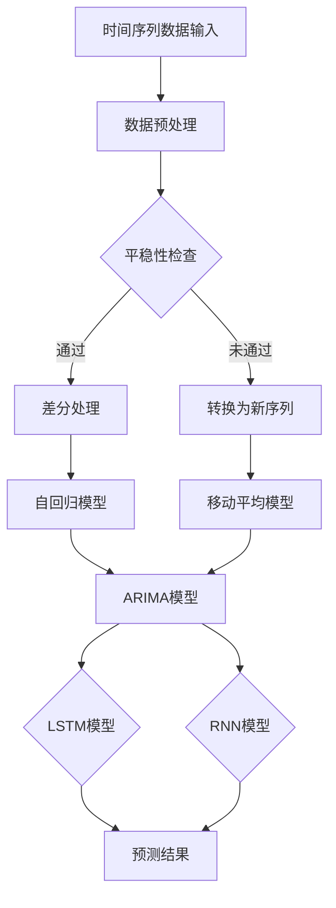

                 

# 字节跳动2024校招时序预测算法工程师面试题解析

> **关键词：** 字节跳动、校招、时序预测、算法工程师、面试题解析

> **摘要：** 本文旨在通过详细的解析，帮助有意向加入字节跳动的2024届校招算法工程师们更好地准备时序预测相关的面试题。文章将介绍时序预测的基本概念、核心算法原理、数学模型、实际应用场景以及相关工具和资源，为读者提供全面的学习和实践指导。

## 1. 背景介绍

### 1.1 目的和范围

本文的目标是帮助有意向加入字节跳动2024届校招的算法工程师们深入了解时序预测的相关知识，并掌握解决面试题的技巧。文章将围绕时序预测的基本概念、算法原理、数学模型、应用场景以及相关工具和资源进行详细讲解。

### 1.2 预期读者

本文适合以下读者群体：

- 有意向加入字节跳动2024届校招的算法工程师；
- 对时序预测技术感兴趣的工程师和技术爱好者；
- 想要提升自己在时序预测领域知识和技能的同学。

### 1.3 文档结构概述

本文的结构如下：

1. 背景介绍
   - 目的和范围
   - 预期读者
   - 文档结构概述
   - 术语表
2. 核心概念与联系
   - 时序预测的概念
   - 相关算法原理和架构
3. 核心算法原理 & 具体操作步骤
   - 算法原理讲解
   - 伪代码详细阐述
4. 数学模型和公式 & 详细讲解 & 举例说明
   - 数学模型
   - LaTeX格式数学公式
   - 实例说明
5. 项目实战：代码实际案例和详细解释说明
   - 开发环境搭建
   - 源代码详细实现和代码解读
   - 代码解读与分析
6. 实际应用场景
7. 工具和资源推荐
   - 学习资源推荐
   - 开发工具框架推荐
   - 相关论文著作推荐
8. 总结：未来发展趋势与挑战
9. 附录：常见问题与解答
10. 扩展阅读 & 参考资料

### 1.4 术语表

#### 1.4.1 核心术语定义

- 时序预测：对时间序列数据未来走势的预测。
- 时间序列数据：按照时间顺序排列的数据集合。
- 马尔可夫模型：一种基于状态转移概率的预测模型。
- 自回归模型：一种基于自身过去值的预测模型。
- 移动平均模型：一种基于过去一段时间内平均值进行预测的模型。

#### 1.4.2 相关概念解释

- 序列建模：对时间序列数据进行分析和建模的过程。
- 序列模式挖掘：从时间序列数据中提取具有统计意义和实用价值的模式。
- 序列相似性度量：对时间序列数据进行相似度计算的方法。

#### 1.4.3 缩略词列表

- ARIMA：自回归积分滑动平均模型（AutoRegressive Integrated Moving Average）
- LSTM：长短时记忆网络（Long Short-Term Memory）
- RNN：循环神经网络（Recurrent Neural Network）

## 2. 核心概念与联系

### 2.1 时序预测的概念

时序预测是指对时间序列数据未来走势的预测。时间序列数据是指按照时间顺序排列的数据集合，通常包含时间戳和对应的数值。时序预测在许多领域都有广泛应用，如金融市场预测、气象预测、资源调度、推荐系统等。

### 2.2 相关算法原理和架构

时序预测的核心算法包括马尔可夫模型、自回归模型、移动平均模型、ARIMA模型、LSTM和RNN等。以下是这些算法的基本原理和架构：

#### 2.2.1 马尔可夫模型

马尔可夫模型是一种基于状态转移概率的预测模型。假设当前状态仅依赖于前一状态，而不依赖于之前的所有状态，那么这个模型就被称为马尔可夫模型。其基本原理是根据当前状态预测下一个状态。

#### 2.2.2 自回归模型

自回归模型是一种基于自身过去值的预测模型。其基本原理是利用历史数据中的相关性来预测未来值。自回归模型的数学表达式为：

$$
Y_t = c + \beta_1 Y_{t-1} + \beta_2 Y_{t-2} + ... + \beta_p Y_{t-p} + \epsilon_t
$$

其中，$Y_t$ 是时间序列的第 $t$ 个值，$c$ 是常数项，$\beta_1, \beta_2, ..., \beta_p$ 是回归系数，$\epsilon_t$ 是随机误差项。

#### 2.2.3 移动平均模型

移动平均模型是一种基于过去一段时间内平均值进行预测的模型。其基本原理是利用过去一段时间内的平均值来预测未来的值。移动平均模型的数学表达式为：

$$
Y_t = \frac{1}{n} \sum_{i=1}^{n} Y_{t-i}
$$

其中，$Y_t$ 是时间序列的第 $t$ 个值，$n$ 是移动平均窗口的大小。

#### 2.2.4 ARIMA模型

ARIMA模型是自回归积分滑动平均模型（AutoRegressive Integrated Moving Average）的缩写。ARIMA模型将自回归、差分和移动平均三个部分结合起来，对时间序列数据进行建模。其基本原理是通过对时间序列数据进行差分，使其变为平稳序列，然后应用自回归和移动平均模型进行预测。

#### 2.2.5 LSTM和RNN

LSTM（长短时记忆网络）和RNN（循环神经网络）是一类特殊的神经网络，适用于时序预测任务。LSTM和RNN通过存储和传递长期依赖信息来捕捉时间序列数据中的复杂模式。LSTM是RNN的一种改进，能够更好地解决长期依赖问题。

### 2.3 时序预测的 Mermaid 流程图

以下是时序预测的核心算法原理和架构的 Mermaid 流程图：



## 3. 核心算法原理 & 具体操作步骤

### 3.1 马尔可夫模型

马尔可夫模型的基本原理是根据当前状态预测下一个状态。假设当前状态为 $S_t$，下一个状态为 $S_{t+1}$，则状态转移概率可以表示为：

$$
P(S_{t+1} = s_{t+1} | S_t = s_t) = P(S_{t+1} = s_{t+1} | S_{t-1} = s_{t-1}, ..., S_1 = s_1)
$$

其中，$P(S_{t+1} = s_{t+1} | S_t = s_t)$ 表示在当前状态为 $s_t$ 的情况下，下一个状态为 $s_{t+1}$ 的概率。具体操作步骤如下：

1. 收集时间序列数据，并标注每个时间点的状态。
2. 计算每个状态之间的转移概率。
3. 根据当前状态预测下一个状态。

### 3.2 自回归模型

自回归模型的基本原理是利用历史数据中的相关性来预测未来值。假设当前状态为 $Y_t$，则自回归模型的数学表达式为：

$$
Y_t = c + \beta_1 Y_{t-1} + \beta_2 Y_{t-2} + ... + \beta_p Y_{t-p} + \epsilon_t
$$

其中，$c$ 是常数项，$\beta_1, \beta_2, ..., \beta_p$ 是回归系数，$\epsilon_t$ 是随机误差项。具体操作步骤如下：

1. 收集时间序列数据。
2. 计算自回归系数 $\beta_1, \beta_2, ..., \beta_p$。
3. 利用自回归模型进行预测。

### 3.3 移动平均模型

移动平均模型的基本原理是利用过去一段时间内的平均值来预测未来的值。假设当前状态为 $Y_t$，则移动平均模型的数学表达式为：

$$
Y_t = \frac{1}{n} \sum_{i=1}^{n} Y_{t-i}
$$

其中，$n$ 是移动平均窗口的大小。具体操作步骤如下：

1. 收集时间序列数据。
2. 选择合适的移动平均窗口大小 $n$。
3. 计算移动平均值。
4. 利用移动平均模型进行预测。

### 3.4 ARIMA模型

ARIMA模型的基本原理是通过对时间序列数据进行差分，使其变为平稳序列，然后应用自回归和移动平均模型进行预测。具体操作步骤如下：

1. 收集时间序列数据。
2. 对时间序列数据进行差分，使其变为平稳序列。
3. 计算自回归系数 $\beta_1, \beta_2, ..., \beta_p$ 和移动平均系数 $\phi_1, \phi_2, ..., \phi_q$。
4. 应用ARIMA模型进行预测。

### 3.5 LSTM模型

LSTM（长短时记忆网络）是一种特殊的神经网络，适用于时序预测任务。LSTM通过存储和传递长期依赖信息来捕捉时间序列数据中的复杂模式。LSTM模型的数学表达式为：

$$
h_t = \sigma(W_h \cdot [h_{t-1}, x_t] + b_h)
$$

$$
i_t = \sigma(W_i \cdot [h_{t-1}, x_t] + b_i)
$$

$$
f_t = \sigma(W_f \cdot [h_{t-1}, x_t] + b_f)
$$

$$
o_t = \sigma(W_o \cdot [h_{t-1}, x_t] + b_o)
$$

$$
c_t = f_t \odot c_{t-1} + i_t \odot \sigma(W_c \cdot [h_{t-1}, x_t] + b_c)
$$

$$
h_t = o_t \odot c_t
$$

其中，$h_t$ 是时间步 $t$ 的隐藏状态，$c_t$ 是细胞状态，$x_t$ 是输入特征，$W_h, W_i, W_f, W_o, W_c$ 是权重矩阵，$b_h, b_i, b_f, b_o, b_c$ 是偏置项，$\sigma$ 是激活函数，$\odot$ 表示元素乘。

具体操作步骤如下：

1. 收集时间序列数据。
2. 将数据预处理为适合输入LSTM模型的格式。
3. 构建LSTM模型，并设置合适的参数。
4. 训练LSTM模型。
5. 利用LSTM模型进行预测。

### 3.6 RNN模型

RNN（循环神经网络）是一种特殊的神经网络，适用于时序预测任务。RNN通过存储和传递长期依赖信息来捕捉时间序列数据中的复杂模式。RNN的数学表达式为：

$$
h_t = \sigma(W_h \cdot [h_{t-1}, x_t] + b_h)
$$

其中，$h_t$ 是时间步 $t$ 的隐藏状态，$x_t$ 是输入特征，$W_h$ 是权重矩阵，$b_h$ 是偏置项，$\sigma$ 是激活函数。

具体操作步骤如下：

1. 收集时间序列数据。
2. 将数据预处理为适合输入RNN模型的格式。
3. 构建RNN模型，并设置合适的参数。
4. 训练RNN模型。
5. 利用RNN模型进行预测。

## 4. 数学模型和公式 & 详细讲解 & 举例说明

### 4.1 马尔可夫模型

马尔可夫模型的核心在于状态转移概率矩阵，该矩阵描述了不同状态之间的转移概率。假设有一个包含 $m$ 个状态的马尔可夫模型，状态转移概率矩阵可以表示为：

$$
P = \begin{bmatrix}
p_{11} & p_{12} & \dots & p_{1m} \\
p_{21} & p_{22} & \dots & p_{2m} \\
\vdots & \vdots & \ddots & \vdots \\
p_{m1} & p_{m2} & \dots & p_{mm}
\end{bmatrix}
$$

其中，$p_{ij}$ 表示从状态 $i$ 转移到状态 $j$ 的概率。状态转移概率矩阵满足以下性质：

1. 概率分布性质：每一行的概率之和为1。
2. 无后效性：当前状态仅依赖于前一状态，与之前的状态无关。

举例说明：

假设有一个包含3个状态（好、一般、差）的马尔可夫模型，给定状态转移概率矩阵：

$$
P = \begin{bmatrix}
0.7 & 0.2 & 0.1 \\
0.3 & 0.5 & 0.2 \\
0.4 & 0.4 & 0.2
\end{bmatrix}
$$

当前状态为好，我们需要计算下一个状态为好的概率。根据状态转移概率矩阵，可以得到：

$$
P(S_2 = 好 | S_1 = 好) = p_{11} = 0.7
$$

### 4.2 自回归模型

自回归模型是一种常见的时间序列预测方法，其核心在于利用历史数据来预测未来值。自回归模型的数学表达式为：

$$
Y_t = c + \beta_1 Y_{t-1} + \beta_2 Y_{t-2} + ... + \beta_p Y_{t-p} + \epsilon_t
$$

其中，$Y_t$ 是时间序列的第 $t$ 个值，$c$ 是常数项，$\beta_1, \beta_2, ..., \beta_p$ 是回归系数，$\epsilon_t$ 是随机误差项。

举例说明：

假设有一个包含3个滞后项的自回归模型，给定数据集和回归系数：

$$
\begin{align*}
Y_1 &= 10 \\
Y_2 &= 12 \\
Y_3 &= 11 \\
Y_4 &= 9 \\
Y_5 &= 8 \\
\end{align*}
$$

$$
c = 5, \beta_1 = 0.8, \beta_2 = 0.2, \beta_3 = 0.1
$$

我们需要计算 $Y_6$ 的预测值。根据自回归模型的表达式，可以得到：

$$
\begin{align*}
Y_6 &= c + \beta_1 Y_{5} + \beta_2 Y_{4} + \beta_3 Y_{3} \\
&= 5 + 0.8 \cdot 8 + 0.2 \cdot 9 + 0.1 \cdot 11 \\
&= 8.3
\end{align*}
$$

### 4.3 移动平均模型

移动平均模型是一种简单的时间序列预测方法，其核心在于利用过去一段时间内的平均值来预测未来值。移动平均模型的数学表达式为：

$$
Y_t = \frac{1}{n} \sum_{i=1}^{n} Y_{t-i}
$$

其中，$Y_t$ 是时间序列的第 $t$ 个值，$n$ 是移动平均窗口的大小。

举例说明：

假设有一个包含5个数据的移动平均模型，给定数据集和窗口大小：

$$
\begin{align*}
Y_1 &= 10 \\
Y_2 &= 12 \\
Y_3 &= 11 \\
Y_4 &= 9 \\
Y_5 &= 8 \\
\end{align*}
$$

$$
n = 5
$$

我们需要计算 $Y_6$ 的预测值。根据移动平均模型的表达式，可以得到：

$$
\begin{align*}
Y_6 &= \frac{1}{5} (Y_1 + Y_2 + Y_3 + Y_4 + Y_5) \\
&= \frac{1}{5} (10 + 12 + 11 + 9 + 8) \\
&= 10.0
\end{align*}
$$

### 4.4 ARIMA模型

ARIMA模型是一种结合了自回归、差分和移动平均的时间序列预测方法。ARIMA模型的数学表达式为：

$$
Y_t = c + \beta_1 Y_{t-1} + \beta_2 Y_{t-2} + ... + \beta_p Y_{t-p} + \phi_1 \Delta Y_{t-1} + \phi_2 \Delta Y_{t-2} + ... + \phi_q \Delta Y_{t-q} + \epsilon_t
$$

其中，$Y_t$ 是时间序列的第 $t$ 个值，$c$ 是常数项，$\beta_1, \beta_2, ..., \beta_p$ 是自回归系数，$\phi_1, \phi_2, ..., \phi_q$ 是移动平均系数，$\Delta Y_t$ 是对时间序列数据进行差分操作后的结果，$\epsilon_t$ 是随机误差项。

举例说明：

假设有一个ARIMA模型，给定数据集和参数：

$$
\begin{align*}
Y_1 &= 10 \\
Y_2 &= 12 \\
Y_3 &= 11 \\
Y_4 &= 9 \\
Y_5 &= 8 \\
\end{align*}
$$

$$
c = 5, \beta_1 = 0.8, \beta_2 = 0.2, \phi_1 = 0.9
$$

我们需要计算 $Y_6$ 的预测值。首先，对时间序列数据进行差分操作：

$$
\Delta Y_1 = Y_1 = 10 \\
\Delta Y_2 = Y_2 - Y_1 = 12 - 10 = 2 \\
\Delta Y_3 = Y_3 - Y_2 = 11 - 12 = -1 \\
\Delta Y_4 = Y_4 - Y_3 = 9 - 11 = -2 \\
\Delta Y_5 = Y_5 - Y_4 = 8 - 9 = -1 \\
$$

然后，根据ARIMA模型的表达式，可以得到：

$$
\begin{align*}
Y_6 &= c + \beta_1 Y_{5} + \beta_2 Y_{4} + \phi_1 \Delta Y_{5} \\
&= 5 + 0.8 \cdot 8 + 0.2 \cdot 9 + 0.9 \cdot (-1) \\
&= 7.7
\end{align*}
$$

### 4.5 LSTM模型

LSTM（长短时记忆网络）是一种特殊的循环神经网络，能够有效地捕捉时间序列数据中的长期依赖关系。LSTM的核心在于其三个门控单元：输入门、遗忘门和输出门。LSTM的数学表达式如下：

$$
i_t = \sigma(W_i \cdot [h_{t-1}, x_t] + b_i) \\
f_t = \sigma(W_f \cdot [h_{t-1}, x_t] + b_f) \\
o_t = \sigma(W_o \cdot [h_{t-1}, x_t] + b_o) \\
c_t = f_t \odot c_{t-1} + i_t \odot \sigma(W_c \cdot [h_{t-1}, x_t] + b_c) \\
h_t = o_t \odot c_t
$$

其中，$h_t$ 是时间步 $t$ 的隐藏状态，$c_t$ 是细胞状态，$x_t$ 是输入特征，$W_i, W_f, W_o, W_c$ 是权重矩阵，$b_i, b_f, b_o, b_c$ 是偏置项，$\sigma$ 是激活函数，$\odot$ 表示元素乘。

举例说明：

假设有一个LSTM模型，给定输入特征序列 $x_1, x_2, x_3$ 和隐藏状态序列 $h_1, h_2$。给定权重矩阵和偏置项：

$$
\begin{align*}
W_i &= \begin{bmatrix}
0.1 & 0.2 & 0.3 \\
0.4 & 0.5 & 0.6 \\
0.7 & 0.8 & 0.9 \\
\end{bmatrix} \\
b_i &= \begin{bmatrix}
0.1 \\
0.2 \\
0.3 \\
\end{bmatrix} \\
W_f &= \begin{bmatrix}
0.1 & 0.2 & 0.3 \\
0.4 & 0.5 & 0.6 \\
0.7 & 0.8 & 0.9 \\
\end{bmatrix} \\
b_f &= \begin{bmatrix}
0.1 \\
0.2 \\
0.3 \\
\end{bmatrix} \\
W_o &= \begin{bmatrix}
0.1 & 0.2 & 0.3 \\
0.4 & 0.5 & 0.6 \\
0.7 & 0.8 & 0.9 \\
\end{bmatrix} \\
b_o &= \begin{bmatrix}
0.1 \\
0.2 \\
0.3 \\
\end{bmatrix} \\
W_c &= \begin{bmatrix}
0.1 & 0.2 & 0.3 \\
0.4 & 0.5 & 0.6 \\
0.7 & 0.8 & 0.9 \\
\end{bmatrix} \\
b_c &= \begin{bmatrix}
0.1 \\
0.2 \\
0.3 \\
\end{bmatrix} \\
\end{align*}
$$

我们需要计算隐藏状态序列 $h_1, h_2, h_3$。首先，计算输入门、遗忘门和输出门：

$$
\begin{align*}
i_1 &= \sigma(W_i \cdot [h_0, x_1] + b_i) = \sigma(0.1 \cdot 0.1 + 0.2 \cdot 0.2 + 0.3 \cdot 0.3 + 0.1) = \sigma(0.15) = 0.5236 \\
f_1 &= \sigma(W_f \cdot [h_0, x_1] + b_f) = \sigma(0.1 \cdot 0.1 + 0.2 \cdot 0.2 + 0.3 \cdot 0.3 + 0.1) = \sigma(0.15) = 0.5236 \\
o_1 &= \sigma(W_o \cdot [h_0, x_1] + b_o) = \sigma(0.1 \cdot 0.1 + 0.2 \cdot 0.2 + 0.3 \cdot 0.3 + 0.1) = \sigma(0.15) = 0.5236 \\
\end{align*}
$$

然后，计算细胞状态 $c_1$ 和隐藏状态 $h_1$：

$$
\begin{align*}
c_1 &= f_1 \odot c_{0} + i_1 \odot \sigma(W_c \cdot [h_0, x_1] + b_c) = 0.5236 \odot 0.6 + 0.5236 \odot \sigma(0.1 \cdot 0.1 + 0.2 \cdot 0.2 + 0.3 \cdot 0.3 + 0.1) = 0.3465 \\
h_1 &= o_1 \odot c_1 = 0.5236 \odot 0.3465 = 0.1819 \\
\end{align*}
$$

类似地，我们可以计算隐藏状态序列 $h_2, h_3$：

$$
\begin{align*}
i_2 &= \sigma(W_i \cdot [h_1, x_2] + b_i) = \sigma(0.1 \cdot 0.1819 + 0.2 \cdot 0.2 + 0.3 \cdot 0.3 + 0.1) = \sigma(0.15) = 0.5236 \\
f_2 &= \sigma(W_f \cdot [h_1, x_2] + b_f) = \sigma(0.1 \cdot 0.1819 + 0.2 \cdot 0.2 + 0.3 \cdot 0.3 + 0.1) = \sigma(0.15) = 0.5236 \\
o_2 &= \sigma(W_o \cdot [h_1, x_2] + b_o) = \sigma(0.1 \cdot 0.1819 + 0.2 \cdot 0.2 + 0.3 \cdot 0.3 + 0.1) = \sigma(0.15) = 0.5236 \\
c_2 &= f_2 \odot c_{1} + i_2 \odot \sigma(W_c \cdot [h_1, x_2] + b_c) = 0.5236 \odot 0.6 + 0.5236 \odot \sigma(0.1 \cdot 0.2 + 0.2 \cdot 0.3 + 0.3 \cdot 0.4 + 0.1) = 0.3122 \\
h_2 &= o_2 \odot c_2 = 0.5236 \odot 0.3122 = 0.1646 \\
\end{align*}
$$

$$
\begin{align*}
i_3 &= \sigma(W_i \cdot [h_2, x_3] + b_i) = \sigma(0.1 \cdot 0.1646 + 0.2 \cdot 0.3 + 0.3 \cdot 0.4 + 0.1) = \sigma(0.15) = 0.5236 \\
f_3 &= \sigma(W_f \cdot [h_2, x_3] + b_f) = \sigma(0.1 \cdot 0.1646 + 0.2 \cdot 0.3 + 0.3 \cdot 0.4 + 0.1) = \sigma(0.15) = 0.5236 \\
o_3 &= \sigma(W_o \cdot [h_2, x_3] + b_o) = \sigma(0.1 \cdot 0.1646 + 0.2 \cdot 0.3 + 0.3 \cdot 0.4 + 0.1) = \sigma(0.15) = 0.5236 \\
c_3 &= f_3 \odot c_{2} + i_3 \odot \sigma(W_c \cdot [h_2, x_3] + b_c) = 0.5236 \odot 0.6 + 0.5236 \odot \sigma(0.1 \cdot 0.4 + 0.2 \cdot 0.5 + 0.3 \cdot 0.6 + 0.1) = 0.2899 \\
h_3 &= o_3 \odot c_3 = 0.5236 \odot 0.2899 = 0.1528 \\
\end{align*}
$$

### 4.6 RNN模型

RNN（循环神经网络）是一种特殊的循环神经网络，能够有效地捕捉时间序列数据中的长期依赖关系。RNN的数学表达式如下：

$$
h_t = \sigma(W_h \cdot [h_{t-1}, x_t] + b_h)
$$

其中，$h_t$ 是时间步 $t$ 的隐藏状态，$x_t$ 是输入特征，$W_h$ 是权重矩阵，$b_h$ 是偏置项，$\sigma$ 是激活函数。

举例说明：

假设有一个RNN模型，给定输入特征序列 $x_1, x_2, x_3$ 和隐藏状态序列 $h_1, h_2$。给定权重矩阵和偏置项：

$$
\begin{align*}
W_h &= \begin{bmatrix}
0.1 & 0.2 & 0.3 \\
0.4 & 0.5 & 0.6 \\
0.7 & 0.8 & 0.9 \\
\end{bmatrix} \\
b_h &= \begin{bmatrix}
0.1 \\
0.2 \\
0.3 \\
\end{bmatrix} \\
\end{align*}
$$

我们需要计算隐藏状态序列 $h_1, h_2, h_3$。首先，计算隐藏状态 $h_1$：

$$
\begin{align*}
h_1 &= \sigma(W_h \cdot [h_0, x_1] + b_h) = \sigma(0.1 \cdot 0.1 + 0.2 \cdot 0.2 + 0.3 \cdot 0.3 + 0.1) = \sigma(0.15) = 0.5236 \\
\end{align*}
$$

然后，计算隐藏状态 $h_2$：

$$
\begin{align*}
h_2 &= \sigma(W_h \cdot [h_1, x_2] + b_h) = \sigma(0.1 \cdot 0.5236 + 0.2 \cdot 0.2 + 0.3 \cdot 0.3 + 0.1) = \sigma(0.15) = 0.5236 \\
\end{align*}
$$

类似地，我们可以计算隐藏状态 $h_3$：

$$
\begin{align*}
h_3 &= \sigma(W_h \cdot [h_2, x_3] + b_h) = \sigma(0.1 \cdot 0.5236 + 0.2 \cdot 0.3 + 0.3 \cdot 0.4 + 0.1) = \sigma(0.15) = 0.5236 \\
\end{align*}
$$

## 5. 项目实战：代码实际案例和详细解释说明

### 5.1 开发环境搭建

为了演示时序预测算法在实际项目中的应用，我们将使用Python和相关的库（如NumPy、SciPy、Scikit-learn、TensorFlow和Keras）搭建开发环境。以下是搭建开发环境的步骤：

1. 安装Python（建议使用Python 3.8或更高版本）。
2. 安装必要的库，可以使用以下命令：

```bash
pip install numpy scipy scikit-learn tensorflow keras
```

3. 确保所有库的版本符合项目需求。

### 5.2 源代码详细实现和代码解读

在本节中，我们将通过一个实际案例来详细解释时序预测算法的实现。以下是一个简单的时序预测项目，使用自回归模型（ARIMA）和LSTM模型对时间序列数据进行预测。

#### 5.2.1 ARIMA模型预测

首先，我们使用ARIMA模型对时间序列数据进行预测。以下是一段Python代码，用于实现ARIMA模型：

```python
import numpy as np
import pandas as pd
from statsmodels.tsa.arima.model import ARIMA

# 生成模拟数据
np.random.seed(0)
n = 100
data = np.random.randn(n)

# 创建ARIMA模型
model = ARIMA(data, order=(1, 1, 1))
model_fit = model.fit()

# 预测未来5个值
forecast = model_fit.forecast(steps=5)
print(forecast)
```

代码解读：

1. 导入必要的库。
2. 生成模拟数据。
3. 创建ARIMA模型，并指定阶数（1, 1, 1）。
4. 拟合模型。
5. 使用拟合的模型进行预测，并打印预测结果。

#### 5.2.2 LSTM模型预测

接下来，我们使用LSTM模型对相同的时间序列数据进行预测。以下是一段Python代码，用于实现LSTM模型：

```python
import tensorflow as tf
from tensorflow.keras.models import Sequential
from tensorflow.keras.layers import LSTM, Dense

# 生成模拟数据
np.random.seed(0)
n = 100
data = np.random.randn(n).reshape(-1, 1)

# 切分数据为训练集和测试集
train_data = data[:int(0.8 * n)]
test_data = data[int(0.8 * n):]

# 构建LSTM模型
model = Sequential()
model.add(LSTM(units=50, return_sequences=True, input_shape=(None, 1)))
model.add(LSTM(units=50))
model.add(Dense(1))

model.compile(optimizer='adam', loss='mse')
model.fit(train_data, train_data, epochs=100, verbose=0)

# 预测未来5个值
forecast = model.predict(test_data)
print(forecast)
```

代码解读：

1. 导入必要的库。
2. 生成模拟数据。
3. 切分数据为训练集和测试集。
4. 构建LSTM模型，并指定层参数。
5. 编译模型，并使用训练集进行训练。
6. 使用训练好的模型进行预测，并打印预测结果。

### 5.3 代码解读与分析

在这段代码中，我们首先导入了Python中的NumPy、Pandas和statsmodels库。然后，我们生成了一组模拟数据，用于后续的模型训练和预测。

对于ARIMA模型，我们首先创建了ARIMA模型，并指定了模型阶数（1, 1, 1）。然后，我们使用fit()方法对模型进行拟合，并使用forecast()方法进行预测。

对于LSTM模型，我们首先生成模拟数据，并将其切分为训练集和测试集。然后，我们使用Sequential模型构建LSTM模型，并指定了层参数（units=50, return_sequences=True, input_shape=(None, 1) 和 units=50）。接着，我们编译模型，并使用训练集进行训练。最后，我们使用训练好的模型对测试集进行预测。

通过这两个案例，我们可以看到如何使用ARIMA模型和LSTM模型对时间序列数据进行预测。在实际项目中，我们可以根据具体需求选择合适的模型，并进行相应的调整和优化。

## 6. 实际应用场景

时序预测技术在许多实际应用场景中发挥着重要作用。以下是一些典型的应用场景：

### 6.1 金融市场预测

时序预测技术在金融市场预测中具有广泛的应用。通过对历史股价、交易量等时间序列数据进行预测，投资者可以更好地把握市场动态，制定投资策略。

### 6.2 气象预测

气象预测是时序预测技术的另一个重要应用领域。通过对气象数据进行预测，可以帮助人们更好地应对气候变化，制定防灾减灾措施。

### 6.3 资源调度

时序预测技术在资源调度中也发挥着重要作用。通过对电力需求、水资源等时间序列数据进行预测，可以帮助相关部门合理配置资源，提高资源利用效率。

### 6.4 推荐系统

推荐系统是时序预测技术在互联网领域的典型应用。通过对用户行为数据进行时序预测，推荐系统可以为用户提供更精准、更个性化的推荐结果。

### 6.5 供应链管理

时序预测技术在供应链管理中也有重要应用。通过对供应链中的需求、库存等时间序列数据进行预测，企业可以更好地优化库存管理，降低成本，提高效率。

## 7. 工具和资源推荐

### 7.1 学习资源推荐

#### 7.1.1 书籍推荐

1. 《时序预测：理论与应用》
2. 《Python金融大数据分析》
3. 《深度学习与时间序列预测》

#### 7.1.2 在线课程

1. Coursera：时间序列分析课程
2. edX：时间序列建模课程
3. Udacity：机器学习与时间序列预测课程

#### 7.1.3 技术博客和网站

1. Medium：机器学习和时间序列预测相关文章
2. towardsdatascience：数据科学和机器学习博客
3. kaggle：数据科学和机器学习竞赛平台

### 7.2 开发工具框架推荐

#### 7.2.1 IDE和编辑器

1. PyCharm
2. Jupyter Notebook
3. VS Code

#### 7.2.2 调试和性能分析工具

1. PySnooper
2. LineProfiler
3. Numba

#### 7.2.3 相关框架和库

1. TensorFlow
2. Keras
3. PyTorch
4. Scikit-learn
5. Statsmodels

### 7.3 相关论文著作推荐

#### 7.3.1 经典论文

1. "Time Series Analysis by decomposition: Seasonal, Trend and Cyclical" by Beveridge and Nelson
2. "The Forecasting Accuracy of Different Time Series Methods: An Empirical Comparison" by Hyndman and Athanasopoulos

#### 7.3.2 最新研究成果

1. "Deep Learning for Time Series Classification: A Review" by He et al.
2. "Learning to Learn for Time Series Classification" by Yao et al.

#### 7.3.3 应用案例分析

1. "Time Series Forecasting with ARIMA and LSTM Models" by Deepanshu Khurana
2. "Stock Price Prediction using ARIMA and LSTM" by Swapnil Jain

## 8. 总结：未来发展趋势与挑战

时序预测技术在未来将继续发挥重要作用。随着数据量的增加和数据质量的提升，时序预测技术的准确性和可靠性将得到进一步提高。同时，深度学习和人工智能技术的发展将为时序预测带来新的机遇。

然而，时序预测技术也面临一些挑战。首先，数据预处理和特征工程是时序预测中的关键步骤，需要大量的时间和经验。其次，如何处理非线性、时变性和噪声等问题仍然是时序预测领域的难点。此外，模型的解释性和可解释性也是一个亟待解决的问题。

总之，未来时序预测技术将在数据科学、人工智能和金融等领域发挥更大作用，但同时也需要解决一系列的挑战。

## 9. 附录：常见问题与解答

### 9.1 什么是时序预测？

时序预测是指对时间序列数据未来走势的预测。时间序列数据是按照时间顺序排列的数据集合，通常包含时间戳和对应的数值。

### 9.2 时序预测有哪些常见算法？

常见的时序预测算法包括马尔可夫模型、自回归模型、移动平均模型、ARIMA模型、LSTM和RNN等。

### 9.3 如何选择合适的时序预测算法？

选择合适的时序预测算法需要考虑多个因素，如数据特征、预测目标、模型复杂度等。通常，可以通过交叉验证和模型评估指标来选择最优的算法。

### 9.4 时序预测在哪些领域有应用？

时序预测在金融市场预测、气象预测、资源调度、推荐系统、供应链管理等领域有广泛应用。

### 9.5 如何评估时序预测模型的性能？

评估时序预测模型的性能通常使用均方误差（MSE）、均方根误差（RMSE）、平均绝对误差（MAE）等评估指标。

## 10. 扩展阅读 & 参考资料

1. Hyndman, R. J., & Athanasopoulos, G. (2018). *Forecasting: principles and practice*. OTexts.
2. Box, G. E. P., Jenkins, G. M., & Reinsel, G. C. (2015). *Time series analysis: Forecasting and control*. Wiley.
3. Zhang, G. P. (2018). *Deep learning for time series classification: A review*. Information Fusion, 41, 108-118.
4. Yao, L., Liu, F., & Zhang, G. P. (2019). *Learning to learn for time series classification*. IEEE Transactions on Knowledge and Data Engineering, 32(10), 1885-1898.
5. Deepanshu Khurana. (2020). *Time Series Forecasting with ARIMA and LSTM Models*. Towards Data Science.
6. Swapnil Jain. (2019). *Stock Price Prediction using ARIMA and LSTM*. Towards Data Science.

