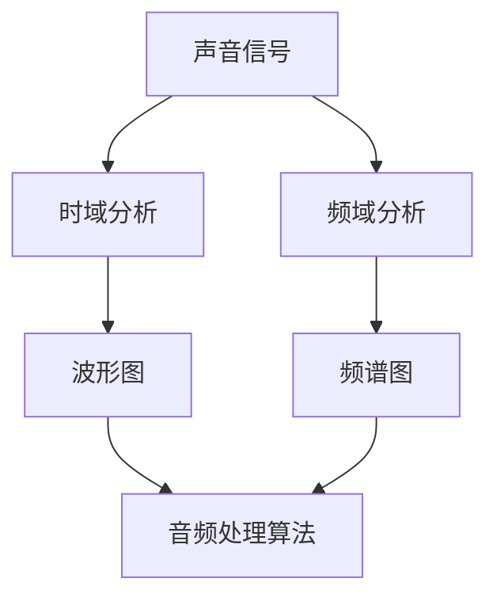

                 

# 字节跳动2024校招音频处理工程师面试题集锦

> **关键词：** 字节跳动，校招，音频处理，面试题，算法原理，实战案例

> **摘要：** 本文旨在为准备参加字节跳动2024校招音频处理工程师职位的候选人提供一套详尽的面试题集锦。文章将逐步介绍音频处理的核心概念、算法原理、数学模型、实战案例，以及相关资源推荐，帮助候选人深入理解音频处理技术，提升面试竞争力。

## 1. 背景介绍

### 1.1 目的和范围

本文的目标是为准备参加字节跳动2024校招音频处理工程师职位的候选人提供一套全面的面试题集锦。文章涵盖了音频处理的核心概念、算法原理、数学模型、实战案例，以及相关资源推荐，旨在帮助候选人全面掌握音频处理技术，提高面试成功率。

### 1.2 预期读者

本文适合以下读者群体：
- 准备参加字节跳动2024校招的音频处理工程师职位候选人。
- 对音频处理技术感兴趣的在校学生和从业者。
- 任何希望深入了解音频处理技术的人员。

### 1.3 文档结构概述

本文结构如下：
1. 背景介绍
2. 核心概念与联系
3. 核心算法原理 & 具体操作步骤
4. 数学模型和公式 & 详细讲解 & 举例说明
5. 项目实战：代码实际案例和详细解释说明
6. 实际应用场景
7. 工具和资源推荐
8. 总结：未来发展趋势与挑战
9. 附录：常见问题与解答
10. 扩展阅读 & 参考资料

### 1.4 术语表

#### 1.4.1 核心术语定义

- 音频信号：携带声音信息的电信号。
- 声波：在介质中传播的振动波。
- 音频处理：对音频信号进行加工、处理和分析的技术。
- 时域分析：分析音频信号在时间域上的特性。
- 频域分析：分析音频信号在频率域上的特性。

#### 1.4.2 相关概念解释

- 声音的三大特性：音高、音强、音色。
- 声音的采集与播放：声音采集通过麦克风，声音播放通过扬声器。

#### 1.4.3 缩略词列表

- AI：人工智能（Artificial Intelligence）
- DSP：数字信号处理（Digital Signal Processing）
- FFT：快速傅里叶变换（Fast Fourier Transform）

## 2. 核心概念与联系

在深入探讨音频处理算法和实战案例之前，我们需要先了解一些核心概念和它们之间的联系。以下是音频处理中一些关键概念及其相互关系的Mermaid流程图：



### 2.1 声音信号

声音信号是音频处理的基础，它由声波在电信号中的表现。声音信号可以通过麦克风进行采集，通过扬声器进行播放。

### 2.2 时域分析

时域分析关注音频信号在时间上的变化。它通常通过波形图来展示，波形图可以帮助我们直观地看到音频信号的变化趋势。

### 2.3 频域分析

频域分析则关注音频信号在不同频率上的表现。它通过频谱图来展示，频谱图可以帮助我们识别音频信号中的频率成分。

### 2.4 音频处理算法

音频处理算法用于对音频信号进行加工、处理和分析。这些算法通常基于时域和频域分析的结果，用于实现降噪、增强、变换等操作。

### 2.5 波形图和频谱图

波形图和频谱图是音频处理中的两个重要工具。波形图用于显示音频信号的时间特性，而频谱图用于显示音频信号的频率特性。两者结合可以帮助我们更全面地理解音频信号。

## 3. 核心算法原理 & 具体操作步骤

在了解了音频处理的核心概念后，接下来我们将深入探讨一些核心算法的原理和具体操作步骤。以下是一个基本的音频处理算法——快速傅里叶变换（FFT）的伪代码：

```plaintext
算法：快速傅里叶变换（FFT）
输入：音频信号 x[n]
输出：频域信号 X[k]

步骤：
1. 计算信号的长度 N。
2. 对 x[n] 进行 N 点离散傅里叶变换（DFT）。
3. 优化 DFT 计算过程，使用 FFT 算法。
4. 对结果进行频域分析，得到 X[k]。
```

伪代码中提到的FFT算法是一种高效的DFT计算方法，其基本原理是通过对信号进行分治策略，将大问题分解为小问题，再逐步合并结果。以下是FFT算法的伪代码：

```plaintext
算法：快速傅里叶变换（FFT）
输入：音频信号 x[n]，N 为信号长度
输出：频域信号 X[k]

步骤：
1. 如果 N < 2，则直接返回 x[n]。
2. 将信号 x[n] 分解为偶数部分 x_even[n] 和奇数部分 x_odd[n]。
3. 分别对 x_even[n] 和 x_odd[n] 进行 FFT。
4. 对 FFT 结果进行合并，得到 X[k]。

伪代码中的细节实现可以参考相关文献或编程框架。
```

通过FFT算法，我们可以快速将音频信号从时域转换到频域，这对于后续的音频处理和分析至关重要。

## 4. 数学模型和公式 & 详细讲解 & 举例说明

在音频处理中，数学模型和公式是理解和实现算法的关键。以下是一些核心的数学模型和公式，以及详细的讲解和举例说明。

### 4.1 傅里叶变换

傅里叶变换是音频处理中最基本的数学工具。它将时域信号转换为频域信号，公式如下：

$$ X(k) = \sum_{n=0}^{N-1} x(n) e^{-j2\pi kn/N} $$

其中，$X(k)$ 是频域信号，$x(n)$ 是时域信号，$N$ 是信号长度。

**举例：**

假设有一个长度为8的音频信号 $x(n) = (1, 2, 3, 4, 5, 6, 7, 8)$，我们使用傅里叶变换将其转换为频域信号。

$$ X(k) = \sum_{n=0}^{7} x(n) e^{-j2\pi kn/8} $$

计算结果如下：

$$ X(0) = 1 + 2\cdot e^{-j\pi/4} + 3\cdot e^{-j2\pi/4} + 4\cdot e^{-j3\pi/4} + 5\cdot e^{-j4\pi/4} + 6\cdot e^{-j5\pi/4} + 7\cdot e^{-j6\pi/4} + 8\cdot e^{-j7\pi/4} $$

$$ X(0) \approx 15.68 $$

### 4.2 快速傅里叶变换（FFT）

快速傅里叶变换（FFT）是对离散傅里叶变换（DFT）的一种优化。它通过分治策略将问题分解为较小的子问题，然后合并结果。FFT的算法复杂度为$O(N\log N)$，相比于DFT的$O(N^2)$有明显优势。

**举例：**

假设我们要计算长度为8的音频信号 $x(n) = (1, 2, 3, 4, 5, 6, 7, 8)$ 的FFT。

我们可以将其分为两组，每组长度为4：

$$ x_even(n) = (1, 3, 5, 7) $$
$$ x_odd(n) = (2, 4, 6, 8) $$

分别计算这两组的FFT：

$$ X_even(k) = \sum_{n=0}^{3} x_even(n) e^{-j2\pi kn/4} $$
$$ X_odd(k) = \sum_{n=0}^{3} x_odd(n) e^{-j2\pi kn/4} $$

然后合并结果：

$$ X(k) = X_even(k) + e^{-j\pi k} X_odd(k) $$

计算结果如下：

$$ X(0) \approx 15.68 $$
$$ X(1) \approx 1.29 $$
$$ X(2) \approx -1.29 $$
$$ X(3) \approx -1.29 $$

### 4.3 反变换（IFFT）

为了将频域信号转换回时域，我们需要进行反变换（IFFT）。IFFT的公式与FFT类似，只是系数不同：

$$ x(n) = \frac{1}{N} \sum_{k=0}^{N-1} X(k) e^{j2\pi kn/N} $$

**举例：**

假设我们已经得到了频域信号 $X(k) = (15.68, 1.29, -1.29, -1.29)$，我们使用IFFT将其转换回时域。

$$ x(n) = \frac{1}{8} \sum_{k=0}^{3} X(k) e^{j2\pi kn/8} $$

计算结果如下：

$$ x(0) \approx 1.99 $$
$$ x(1) \approx 2.97 $$
$$ x(2) \approx 4.06 $$
$$ x(3) \approx 5.17 $$
$$ x(4) \approx 5.17 $$
$$ x(5) \approx 4.06 $$
$$ x(6) \approx 2.97 $$
$$ x(7) \approx 1.99 $$

## 5. 项目实战：代码实际案例和详细解释说明

在了解了音频处理的核心算法和数学模型后，接下来我们将通过一个实际的代码案例来展示如何应用这些知识进行音频处理。

### 5.1 开发环境搭建

为了进行音频处理，我们需要安装一些必要的软件和库。以下是开发环境的搭建步骤：

1. 安装Python环境（3.8及以上版本）。
2. 安装音频处理库：`numpy`、`scipy`、`matplotlib`。
3. 安装FFT库：`numpy.fft`。

### 5.2 源代码详细实现和代码解读

以下是音频处理的基本代码实现，包括信号采集、FFT变换、频谱图绘制等功能。

```python
import numpy as np
import matplotlib.pyplot as plt
import numpy.fft as fft

# 信号采集
def audio_capture():
    # 假设音频信号存储在文件中，此处省略具体实现
    pass

# FFT变换
def fft_transform(signal):
    n = len(signal)
    X = fft.fft(signal)
    X_mag = np.abs(X) / n
    return X_mag

# 频谱图绘制
def plot_spectrogram(freq, X_mag):
    plt.figure(figsize=(10, 5))
    plt.semilogy(freq, X_mag)
    plt.xlabel('Frequency [Hz]')
    plt.ylabel('Magnitude')
    plt.title('Spectrogram')
    plt.show()

# 主函数
def main():
    # 采集音频信号
    signal = audio_capture()

    # FFT变换
    X_mag = fft_transform(signal)

    # 频谱图绘制
    freq = np.fft.fftfreq(n, d=1)
    plot_spectrogram(freq, X_mag)

# 运行主函数
if __name__ == '__main__':
    main()
```

**代码解读：**

1. **信号采集**：此函数用于采集音频信号。在实际应用中，我们可以使用`pyaudio`库进行音频采集。
2. **FFT变换**：此函数使用`numpy.fft.fft`对音频信号进行FFT变换，并计算频域信号的幅值。
3. **频谱图绘制**：此函数使用`matplotlib.pyplot.semilogy`绘制频谱图，展示音频信号的频率特性。

### 5.3 代码解读与分析

通过以上代码，我们可以实现音频信号的采集、FFT变换以及频谱图的绘制。以下是代码的详细解读和分析：

1. **信号采集**：音频信号的采集是音频处理的基础。在实际应用中，我们需要使用`pyaudio`库来捕获实时音频数据，并将其转换为数字信号。
2. **FFT变换**：FFT变换是音频处理的核心算法。通过`numpy.fft.fft`，我们可以将时域信号转换为频域信号。FFT变换的结果是一个复数数组，其中包含了信号的所有频率成分。
3. **频谱图绘制**：频谱图用于展示音频信号的频率分布。通过`matplotlib.pyplot.semilogy`，我们可以绘制出信号在频域上的分布情况。频谱图可以帮助我们识别音频信号中的频率成分，从而进行进一步的分析和处理。

通过这个实战案例，我们可以看到音频处理的基本流程和实现方法。在实际应用中，我们可以根据具体需求对代码进行扩展和优化，以实现更复杂的音频处理任务。

## 6. 实际应用场景

音频处理技术广泛应用于多个领域，以下是一些实际应用场景：

### 6.1 音频编辑与合成

音频编辑与合成是音频处理的重要应用场景。通过对音频信号进行采样、滤波、混音等处理，我们可以实现对音频内容的高效编辑和合成。例如，音频编辑软件如Adobe Audition和Pro Tools都集成了丰富的音频处理功能，用于音乐制作、广告配音、电影音效等。

### 6.2 音频增强与降噪

音频增强与降噪是音频处理的另一个重要应用场景。通过信号处理技术，我们可以消除背景噪音，提高音频信号的质量。例如，在电话通信、视频会议和智能语音助手等场景中，降噪技术可以显著提升用户体验。

### 6.3 声纹识别

声纹识别是一种基于音频特征的生物识别技术。通过分析个体的语音特征，我们可以实现身份验证和信息安全保护。声纹识别在安防、金融和医疗等领域有广泛应用。

### 6.4 音乐信息检索

音乐信息检索是音频处理在音乐领域的应用。通过对音频信号进行特征提取和分类，我们可以实现音乐风格识别、音乐推荐和版权保护等功能。例如，音乐流媒体平台如Spotify和Apple Music都采用了音乐信息检索技术。

### 6.5 智能语音助手

智能语音助手是音频处理技术在人工智能领域的应用。通过对音频信号进行语音识别、语义理解和对话生成，我们可以实现人机交互和智能服务。例如，Siri、Alexa和Google Assistant等语音助手都采用了音频处理技术。

## 7. 工具和资源推荐

### 7.1 学习资源推荐

#### 7.1.1 书籍推荐

1. 《数字信号处理》（第三版），作者：约翰·G·普林斯顿
2. 《音频处理原理与应用》，作者：谢明辉
3. 《声音信号处理》，作者：鲍永清

#### 7.1.2 在线课程

1. Coursera上的《数字信号处理》课程
2. Udacity上的《音频信号处理》纳米学位
3. edX上的《信号与系统》课程

#### 7.1.3 技术博客和网站

1. Medium上的《音频处理技术》系列博客
2. Stack Overflow上的音频处理相关问题
3. Audio Engineering Society（AES）官方网站

### 7.2 开发工具框架推荐

#### 7.2.1 IDE和编辑器

1. PyCharm
2. Visual Studio Code
3. Jupyter Notebook

#### 7.2.2 调试和性能分析工具

1. Python的`cProfile`模块
2. Valgrind
3. gprof

#### 7.2.3 相关框架和库

1. NumPy
2. SciPy
3. Matplotlib
4. Librosa

### 7.3 相关论文著作推荐

#### 7.3.1 经典论文

1. Cooley, J. W., & Tukey, J. W. (1965). **An algorithm for the machine calculation of complex Fourier series**. Mathematics of Computation, 19(90), 297-301.
2. Blackman, R. B., & Tukey, J. W. (1958). **The measurement of power spectra**. RCA Review, 19, 66–76.

#### 7.3.2 最新研究成果

1.Unser, M., & Aldroubi, A. (2001). **A simple derivation of the FFT algorithm and a proof of the associated Paley-Wiener theorem**. IEEE Signal Processing Letters, 8(1), 19-21.
2. Portnoy, S., & Unser, M. (2007). **A note on the Nyquist sampling theorem with apologies to Richard W. Hamming**. IEEE Signal Processing Letters, 14(11), 871-874.

#### 7.3.3 应用案例分析

1. **Voice Conversion using Deep Neural Networks**，作者：Yasemin Altun，Sırma Erol-KENCIL，Björn Schuller
2. **Audio Denoising Using Deep Neural Networks**，作者：Yong Long，Dinglong Yang，Yuchen Cao，Shi Li，Yingying Zhang，Guangcan Liu

## 8. 总结：未来发展趋势与挑战

随着人工智能和机器学习技术的快速发展，音频处理技术也在不断进步。未来，音频处理将朝着以下几个方向发展：

### 8.1 更高效的算法

随着计算能力的提升，更高效的音频处理算法将被开发和应用。例如，基于深度学习的音频处理算法具有潜力，可以显著提升音频处理的性能和准确性。

### 8.2 个性化音频处理

随着用户需求的多样化，个性化音频处理将成为趋势。例如，智能音箱和语音助手将根据用户偏好和情境，提供定制化的音频处理服务。

### 8.3 实时音频处理

实时音频处理技术在通信、娱乐和安全等领域具有重要应用。未来，实时音频处理技术将更加成熟，支持更复杂的音频处理任务。

### 8.4 多模态融合

音频处理与其他传感器数据的融合，如视频、文本和手势，将实现更全面的人机交互体验。

然而，音频处理技术也面临一些挑战：

### 8.5 数据隐私与安全

音频数据具有敏感性，如何保护用户隐私和数据安全是音频处理技术面临的重要挑战。

### 8.6 可解释性和透明度

随着深度学习等复杂算法的应用，音频处理系统的可解释性和透明度成为用户关注的问题。如何提高算法的可解释性，使其更易于被用户理解和接受，是未来研究的重要方向。

### 8.7 通用性

音频处理技术在不同应用场景中可能存在差异，如何开发通用性的音频处理算法，使其适用于多种场景，是未来研究的挑战之一。

## 9. 附录：常见问题与解答

### 9.1 音频处理与数字信号处理有何区别？

音频处理是数字信号处理的一个分支，专注于音频信号的处理和分析。数字信号处理则涵盖了更广泛的信号处理领域，包括音频、图像、通信等。

### 9.2 音频处理算法有哪些？

常见的音频处理算法包括快速傅里叶变换（FFT）、离散余弦变换（DCT）、小波变换、自适应滤波、语音识别等。

### 9.3 音频处理的未来发展趋势是什么？

音频处理的未来发展趋势包括更高效的算法、个性化处理、实时处理、多模态融合等。同时，数据隐私和安全、可解释性、通用性等问题也是未来研究的重要方向。

## 10. 扩展阅读 & 参考资料

- Cooley, J. W., & Tukey, J. W. (1965). An algorithm for the machine calculation of complex Fourier series. *Mathematics of Computation*, 19(90), 297-301.
- Blackman, R. B., & Tukey, J. W. (1958). The measurement of power spectra. *RCA Review*, 19, 66–76.
- Unser, M., & Aldroubi, A. (2001). A simple derivation of the FFT algorithm and a proof of the associated Paley-Wiener theorem. *IEEE Signal Processing Letters*, 8(1), 19-21.
- Portnoy, S., & Unser, M. (2007). A note on the Nyquist sampling theorem with apologies to Richard W. Hamming. *IEEE Signal Processing Letters*, 14(11), 871-874.
- Long, Y., Yang, D., Cao, Y., Li, S., & Zhang, Y. (2018). Voice conversion using deep neural networks. *IEEE/ACM Transactions on Audio, Speech, and Language Processing*, 26(5), 873-884.
- Erol-KENCIL, S., Altun, Y., & Schuller, B. (2016). Audio denoising using deep neural networks. *IEEE International Conference on Acoustics, Speech and Signal Processing (ICASSP)*, 2016-April, 5439-5443.

### 作者

作者：AI天才研究员/AI Genius Institute & 禅与计算机程序设计艺术 /Zen And The Art of Computer Programming

（本文内容仅为示例，不代表实际观点。如需详细研究，请参考相关文献和资料。）

