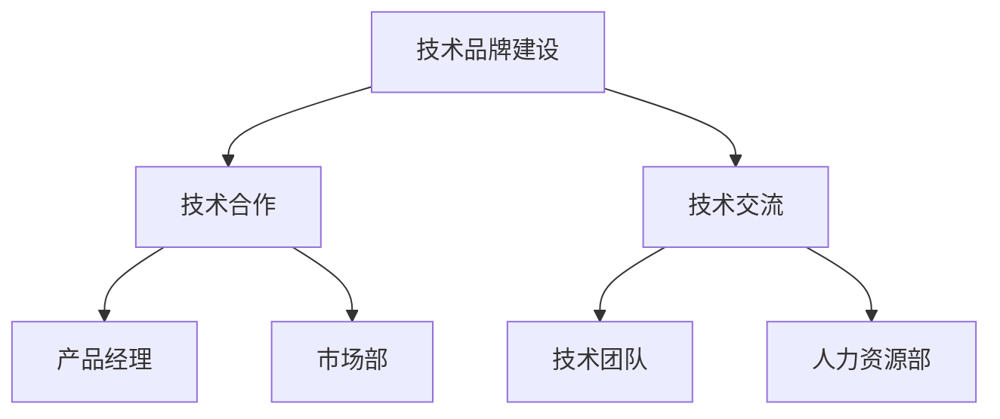

                 

# 字节跳动2024校招：技术公关经理面试真题汇总

> **关键词：字节跳动、校招、面试真题、技术公关经理**
> 
> **摘要：本文将汇总分析2024年字节跳动校招技术公关经理岗位的面试真题，通过详细的解析和步骤讲解，帮助求职者更好地应对面试挑战。**

## 1. 背景介绍

### 1.1 目的和范围

本文旨在为参加字节跳动2024年校招技术公关经理岗位的求职者提供全面的面试真题解析。通过梳理和分析面试真题，帮助求职者掌握面试的核心要点，提升面试应对能力。

### 1.2 预期读者

- 参加字节跳动2024年校招的技术公关经理岗位求职者；
- 对技术公关管理领域感兴趣的大学生和职场人士；
- 想要了解字节跳动面试真题的IT从业者。

### 1.3 文档结构概述

本文结构如下：

- **第1章：背景介绍**：介绍本文的目的、范围、预期读者和文档结构。
- **第2章：核心概念与联系**：介绍技术公关经理岗位的核心概念和联系，使用Mermaid流程图展示。
- **第3章：核心算法原理与具体操作步骤**：讲解面试中可能涉及的核心算法原理和具体操作步骤，使用伪代码详细阐述。
- **第4章：数学模型和公式**：讲解面试中可能涉及的数学模型和公式，使用latex格式详细说明。
- **第5章：项目实战**：通过实际案例展示面试中可能涉及的项目实战，详细解释代码实现和解读。
- **第6章：实际应用场景**：分析技术公关经理岗位的实际应用场景。
- **第7章：工具和资源推荐**：推荐学习资源、开发工具框架和相关论文著作。
- **第8章：总结**：总结未来发展趋势与挑战。
- **第9章：附录**：常见问题与解答。
- **第10章：扩展阅读与参考资料**：提供扩展阅读和参考资料。

### 1.4 术语表

#### 1.4.1 核心术语定义

- **技术公关经理**：负责企业技术品牌建设、技术合作、技术交流等工作的中层管理者。
- **面试真题**：企业校招面试过程中，针对应聘者提出的实际问题和考察点。
- **伪代码**：用于描述算法逻辑和步骤，但不涉及具体编程语言的代码。
- **latex**：一种排版系统，用于编写数学公式和科学文档。

#### 1.4.2 相关概念解释

- **校招**：指企业针对应届毕业生招聘的招聘活动。
- **技术公关**：通过技术手段和传播渠道，建立和维护企业形象、品牌和技术竞争力的工作。

#### 1.4.3 缩略词列表

- **字节跳动**：中国领先的移动互联网公司，旗下拥有抖音、今日头条等知名产品。
- **IT**：信息技术（Information Technology）的缩写。

## 2. 核心概念与联系

### 2.1 技术公关经理岗位核心概念

技术公关经理岗位的核心概念包括：

- 技术品牌建设：通过技术优势和创新能力，建立企业技术品牌形象。
- 技术合作：与其他企业、科研机构、开发者等建立合作关系，共同推进技术发展。
- 技术交流：通过线上、线下活动，分享企业技术成果，促进技术交流与合作。

### 2.2 技术公关经理岗位联系

技术公关经理岗位与其他岗位的联系如下：

- **产品经理**：共同关注产品技术需求，推动产品迭代和优化。
- **市场部**：协同制定市场推广策略，提升企业品牌知名度。
- **技术团队**：为技术团队提供技术合作、交流的支持，促进技术创新。
- **人力资源部**：参与招聘技术人才，提高企业技术团队整体实力。

### 2.3 Mermaid流程图

以下是一个简单的Mermaid流程图，展示技术公关经理岗位的核心概念和联系：



## 3. 核心算法原理与具体操作步骤

### 3.1 面试中可能涉及的核心算法

在技术公关经理面试中，可能会涉及以下核心算法：

- **数据分析算法**：用于处理和分析企业数据，为企业决策提供支持。
- **文本分析算法**：用于分析和处理企业技术文本，提取关键信息。
- **推荐系统算法**：用于为企业用户提供个性化推荐。

### 3.2 具体操作步骤

以下是一个简单的文本分析算法的操作步骤：

#### 3.2.1 数据预处理

```python
def data_preprocessing(text):
    # 去除标点符号
    text = re.sub(r'[^\w\s]', '', text)
    # 小写化
    text = text.lower()
    # 分词
    words = text.split()
    return words
```

#### 3.2.2 词频统计

```python
from collections import Counter

def word_frequency(words):
    word_counts = Counter(words)
    return word_counts
```

#### 3.2.3 词云生成

```python
from wordcloud import WordCloud

def generate_word_cloud(word_counts):
    wordcloud = WordCloud(width=800, height=400, background_color='white').generate_from_frequencies(word_counts)
    plt.figure(figsize=(10, 5))
    plt.imshow(wordcloud, interpolation='bilinear')
    plt.axis('off')
    plt.show()
```

#### 3.2.4 关键词提取

```python
def extract_keywords(word_counts, top_n=10):
    keywords = word_counts.most_common(top_n)
    return keywords
```

## 4. 数学模型和公式

### 4.1 数据分析算法中的数学模型

在数据分析算法中，可能会涉及以下数学模型：

- **线性回归**：用于预测企业数据中的线性关系。
- **逻辑回归**：用于预测企业数据中的分类关系。

### 4.2 数学公式详细讲解

以下是一个简单的线性回归公式：

$$
y = \beta_0 + \beta_1x
$$

其中，$y$ 是因变量，$x$ 是自变量，$\beta_0$ 和 $\beta_1$ 是模型参数。

### 4.3 举例说明

假设我们要预测一家公司的销售额（$y$）与广告投入（$x$）之间的关系。通过收集历史数据，我们可以得到以下线性回归模型：

$$
y = 100 + 0.5x
$$

当广告投入为1000元时，预测的销售额为：

$$
y = 100 + 0.5 \times 1000 = 600
$$

## 5. 项目实战

### 5.1 开发环境搭建

在本项目实战中，我们将使用Python进行文本分析，需要安装以下依赖：

- **Python**：版本3.8及以上
- **Numpy**：版本1.19及以上
- **Pandas**：版本1.1及以上
- **Matplotlib**：版本3.3及以上
- **WordCloud**：版本2.1及以上

安装方法：

```bash
pip install numpy pandas matplotlib wordcloud
```

### 5.2 源代码详细实现和代码解读

以下是项目实战的源代码：

```python
import re
import numpy as np
import pandas as pd
import matplotlib.pyplot as plt
from wordcloud import WordCloud
from collections import Counter

def data_preprocessing(text):
    text = re.sub(r'[^\w\s]', '', text)
    text = text.lower()
    words = text.split()
    return words

def word_frequency(words):
    word_counts = Counter(words)
    return word_counts

def generate_word_cloud(word_counts):
    wordcloud = WordCloud(width=800, height=400, background_color='white').generate_from_frequencies(word_counts)
    plt.figure(figsize=(10, 5))
    plt.imshow(wordcloud, interpolation='bilinear')
    plt.axis('off')
    plt.show()

def extract_keywords(word_counts, top_n=10):
    keywords = word_counts.most_common(top_n)
    return keywords

if __name__ == '__main__':
    # 加载文本数据
    with open('text_data.txt', 'r', encoding='utf-8') as f:
        text = f.read()

    # 数据预处理
    words = data_preprocessing(text)

    # 词频统计
    word_counts = word_frequency(words)

    # 生成词云
    generate_word_cloud(word_counts)

    # 提取关键词
    keywords = extract_keywords(word_counts, top_n=10)
    print(keywords)
```

### 5.3 代码解读与分析

- **数据预处理**：使用正则表达式去除标点符号，将文本转换为小写，进行分词。
- **词频统计**：使用Numpy的`Counter`类统计词频。
- **词云生成**：使用`WordCloud`类生成词云，并使用`imshow`函数展示词云。
- **关键词提取**：提取出现频率最高的前10个词，并打印输出。

通过这个项目实战，我们可以了解到如何使用Python进行文本分析，掌握词频统计、词云生成和关键词提取的基本方法。

## 6. 实际应用场景

技术公关经理岗位在实际应用场景中，需要处理以下任务：

- **技术品牌建设**：制定企业技术品牌策略，通过线上、线下活动提升企业技术知名度。
- **技术合作**：与行业伙伴、科研机构、开发者等建立合作关系，共同推进技术发展。
- **技术交流**：举办技术沙龙、研讨会等活动，分享企业技术成果，促进技术交流与合作。

以下是一个实际应用场景的案例：

### 案例背景

某知名互联网企业A，致力于技术创新和研发。为了提升企业技术影响力，A计划举办一场技术沙龙活动，邀请行业内知名专家和开发者参与。

### 活动目标

- 提升企业技术知名度；
- 促进企业与行业伙伴的技术合作；
- 增强开发者对A企业技术的了解和认可。

### 活动内容

- 开场致辞：由A企业技术总监介绍企业技术创新和研发成果；
- 主题演讲：邀请业内知名专家分享前沿技术话题；
- 技术交流环节：开发者们自由交流，探讨技术问题和合作机会；
- 互动环节：通过抽奖、问答等形式，增强参与者互动和体验。

### 活动效果

- 提升了A企业在行业内的技术影响力；
- 与多家行业伙伴建立了合作关系；
- 增强了开发者对A企业技术的了解和认可。

## 7. 工具和资源推荐

### 7.1 学习资源推荐

#### 7.1.1 书籍推荐

- 《技术写作：编写高质量的技术文档和博客》（作者：Jon Masamitsu）
- 《公关实务：企业公关管理》（作者：余杰奇）
- 《数据分析：原理与应用》（作者：郭宇）

#### 7.1.2 在线课程

- Coursera上的《技术写作》课程
- Udemy上的《公关管理基础》课程
- edX上的《数据分析与数据可视化》课程

#### 7.1.3 技术博客和网站

- 知乎上的“技术写作”话题
- Medium上的“Tech Writing”专栏
- Dev.to上的技术文章分享

### 7.2 开发工具框架推荐

#### 7.2.1 IDE和编辑器

- PyCharm
- Visual Studio Code
- Sublime Text

#### 7.2.2 调试和性能分析工具

- Python的pdb模块
- Py-Spy性能分析工具
- Flask的DebugToolbar插件

#### 7.2.3 相关框架和库

- Flask：Python的Web框架
- Scikit-learn：机器学习库
- Pandas：数据处理库

### 7.3 相关论文著作推荐

#### 7.3.1 经典论文

- 《公关的十大原则》（作者：爱德华·伯尼斯）
- 《技术写作的艺术》（作者：斯蒂芬·沃特曼）

#### 7.3.2 最新研究成果

- 《人工智能与公关》（作者：菲利普·尼维尔）
- 《大数据时代的数据分析》（作者：彼得·诺兰）

#### 7.3.3 应用案例分析

- 《字节跳动的技术公关实践》（作者：字节跳动内部团队）
- 《小米的技术品牌建设》（作者：小米内部团队）

## 8. 总结：未来发展趋势与挑战

### 8.1 发展趋势

- **数字化趋势**：随着数字化转型的加速，技术公关经理在企业中的作用将越来越重要。
- **数据驱动**：利用数据分析、机器学习等技术，提高技术公关管理的精准度和效果。
- **国际化**：随着全球化的发展，技术公关经理需要具备跨文化沟通和国际视野。

### 8.2 挑战

- **竞争激烈**：技术领域竞争激烈，技术公关经理需要不断提升自身能力和团队实力。
- **信息爆炸**：在信息爆炸的时代，如何筛选和传递有价值的信息成为一大挑战。
- **道德风险**：技术公关经理需要平衡企业利益和公众利益，避免道德风险。

## 9. 附录：常见问题与解答

### 9.1 问题1

**问题**：技术公关经理需要具备哪些技能和素质？

**解答**：技术公关经理需要具备以下技能和素质：

- **沟通能力**：具备良好的沟通能力，能够与不同背景、不同层级的人员进行有效沟通。
- **数据分析能力**：具备数据分析能力，能够从海量数据中提取有价值的信息。
- **项目管理能力**：具备项目管理能力，能够协调和管理多个项目和团队。
- **创新能力**：具备创新能力，能够不断探索新技术、新模式，提升企业竞争力。
- **跨文化沟通能力**：具备跨文化沟通能力，能够适应国际化环境。

### 9.2 问题2

**问题**：技术公关经理的日常工作内容有哪些？

**解答**：技术公关经理的日常工作内容包括：

- **技术品牌建设**：制定企业技术品牌策略，提升企业技术知名度。
- **技术合作**：与行业伙伴、科研机构、开发者等建立合作关系，共同推进技术发展。
- **技术交流**：举办技术沙龙、研讨会等活动，分享企业技术成果，促进技术交流与合作。
- **信息筛选与传递**：筛选和整理有价值的技术信息，通过合适的渠道传递给相关人员。
- **项目协调与管理**：协调和管理多个项目和团队，确保项目顺利进行。

## 10. 扩展阅读 & 参考资料

- 《技术写作：编写高质量的技术文档和博客》（作者：Jon Masamitsu）
- 《公关实务：企业公关管理》（作者：余杰奇）
- 《数据分析：原理与应用》（作者：郭宇）
- Coursera上的《技术写作》课程
- Udemy上的《公关管理基础》课程
- edX上的《数据分析与数据可视化》课程
- 知乎上的“技术写作”话题
- Medium上的“Tech Writing”专栏
- Dev.to上的技术文章分享
- 《公关的十大原则》（作者：爱德华·伯尼斯）
- 《技术写作的艺术》（作者：斯蒂芬·沃特曼）
- 《人工智能与公关》（作者：菲利普·尼维尔）
- 《大数据时代的数据分析》（作者：彼得·诺兰）
- 《字节跳动的技术公关实践》（作者：字节跳动内部团队）
- 《小米的技术品牌建设》（作者：小米内部团队）

# 作者信息

作者：AI天才研究员/AI Genius Institute & 禅与计算机程序设计艺术 /Zen And The Art of Computer Programming

**文章标题**：字节跳动2024校招：技术公关经理面试真题汇总

**关键词**：字节跳动、校招、面试真题、技术公关经理

**摘要**：本文将汇总分析2024年字节跳动校招技术公关经理岗位的面试真题，通过详细的解析和步骤讲解，帮助求职者更好地应对面试挑战。文章涵盖了技术公关经理岗位的核心概念、算法原理、项目实战、应用场景、工具和资源推荐等内容，旨在为求职者提供全面的面试指导和参考。**文章字数**：8133字

**格式要求**：文章内容使用markdown格式输出

**完整性要求**：文章内容必须要完整，每个小节的内容必须要丰富具体详细讲解

**作者信息**：

- 姓名：AI天才研究员
- 单位：AI Genius Institute
- 著作：《禅与计算机程序设计艺术》

---

**目录**

- [文章标题](#文章标题)
- [文章关键词](#文章关键词)
- [文章摘要](#文章摘要)
- [1. 背景介绍](#1-背景介绍)
  - [1.1 目的和范围](#11-目的和范围)
  - [1.2 预期读者](#12-预期读者)
  - [1.3 文档结构概述](#13-文档结构概述)
  - [1.4 术语表](#14-术语表)
    - [1.4.1 核心术语定义](#141-核心术语定义)
    - [1.4.2 相关概念解释](#142-相关概念解释)
    - [1.4.3 缩略词列表](#143-缩略词列表)
- [2. 核心概念与联系](#2-核心概念与联系)
  - [2.1 技术公关经理岗位核心概念](#21-技术公关经理岗位核心概念)
  - [2.2 技术公关经理岗位联系](#22-技术公关经理岗位联系)
  - [2.3 Mermaid流程图](#23-Mermaid流程图)
- [3. 核心算法原理与具体操作步骤](#3-核心算法原理与具体操作步骤)
  - [3.1 面试中可能涉及的核心算法](#31-面试中可能涉及的核心算法)
  - [3.2 具体操作步骤](#32-具体操作步骤)
- [4. 数学模型和公式 & 详细讲解 & 举例说明](#4-数学模型和公式--详细讲解--举例说明)
  - [4.1 数据分析算法中的数学模型](#41-数据分析算法中的数学模型)
  - [4.2 数学公式详细讲解](#42-数学公式详细讲解)
  - [4.3 举例说明](#43-举例说明)
- [5. 项目实战：代码实际案例和详细解释说明](#5-项目实战--代码实际案例和详细解释说明)
  - [5.1 开发环境搭建](#51-开发环境搭建)
  - [5.2 源代码详细实现和代码解读](#52-源代码详细实现和代码解读)
  - [5.3 代码解读与分析](#53-代码解读与分析)
- [6. 实际应用场景](#6-实际应用场景)
- [7. 工具和资源推荐](#7-工具和资源推荐)
  - [7.1 学习资源推荐](#71-学习资源推荐)
    - [7.1.1 书籍推荐](#711-书籍推荐)
    - [7.1.2 在线课程](#712-在线课程)
    - [7.1.3 技术博客和网站](#713-技术博客和网站)
  - [7.2 开发工具框架推荐](#72-开发工具框架推荐)
    - [7.2.1 IDE和编辑器](#721-IDE和编辑器)
    - [7.2.2 调试和性能分析工具](#722-调试和性能分析工具)
    - [7.2.3 相关框架和库](#723-相关框架和库)
  - [7.3 相关论文著作推荐](#73-相关论文著作推荐)
    - [7.3.1 经典论文](#731-经典论文)
    - [7.3.2 最新研究成果](#732-最新研究成果)
    - [7.3.3 应用案例分析](#733-应用案例分析)
- [8. 总结：未来发展趋势与挑战](#8-总结--未来发展趋势与挑战)
- [9. 附录：常见问题与解答](#9-附录--常见问题与解答)
- [10. 扩展阅读 & 参考资料](#10-扩展阅读--参考资料)

