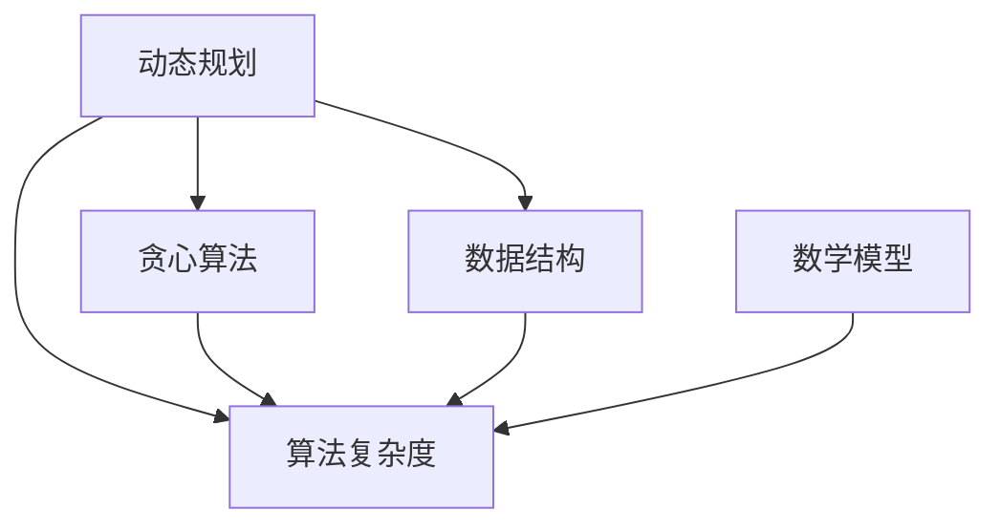

                 

# 字节跳动2025届校招算法工程师面试真题解密

> **关键词：** 字节跳动，2025届，校招，算法工程师，面试真题，解密，算法原理，实战案例，技术发展

> **摘要：** 本文旨在揭秘字节跳动2025届校招算法工程师面试真题，通过深入剖析每个问题的核心概念、原理和解决方案，帮助读者全面理解面试中可能遇到的技术挑战。文章将从核心概念、算法原理、数学模型、项目实战、实际应用等多个角度进行详细讲解，旨在为算法工程师的求职者提供宝贵的备考资料和实践经验。

## 1. 背景介绍

### 1.1 目的和范围

本文的目标是通过对字节跳动2025届校招算法工程师面试真题的详细解析，帮助广大求职者更好地应对类似面试题，提升面试成功率。本文将涵盖以下主要内容：

1. **核心概念与联系**：介绍与面试题相关的核心概念及其相互关系，使用Mermaid流程图展示。
2. **核心算法原理**：详细讲解每个算法的原理和具体操作步骤，通过伪代码进行阐述。
3. **数学模型和公式**：解释面试题中涉及到的数学模型和公式，并进行举例说明。
4. **项目实战**：提供实际的代码案例，详细解释其实现原理和代码细节。
5. **实际应用场景**：分析算法在真实场景中的应用，展示其实际价值。
6. **工具和资源推荐**：推荐学习资源和开发工具，帮助读者深入了解相关技术。
7. **总结与展望**：探讨算法工程师未来的发展趋势与挑战。

### 1.2 预期读者

本文适合以下读者群体：

1. **算法工程师求职者**：准备参加字节跳动2025届校招算法工程师面试的求职者。
2. **计算机专业学生**：对算法和面试技巧感兴趣的计算机专业学生。
3. **技术爱好者**：对算法和技术发展感兴趣的广大技术爱好者。

### 1.3 文档结构概述

本文的文档结构如下：

1. **核心概念与联系**：介绍相关核心概念及其相互关系，使用Mermaid流程图展示。
2. **核心算法原理**：详细讲解每个算法的原理和具体操作步骤，通过伪代码进行阐述。
3. **数学模型和公式**：解释面试题中涉及到的数学模型和公式，并进行举例说明。
4. **项目实战**：提供实际的代码案例，详细解释其实现原理和代码细节。
5. **实际应用场景**：分析算法在真实场景中的应用，展示其实际价值。
6. **工具和资源推荐**：推荐学习资源和开发工具，帮助读者深入了解相关技术。
7. **总结与展望**：探讨算法工程师未来的发展趋势与挑战。

### 1.4 术语表

为了确保文章内容的准确性和一致性，本文将使用以下术语表：

#### 1.4.1 核心术语定义

- **算法**：解决特定问题的计算步骤和过程。
- **面试题**：针对特定技术领域的问题，用于考察应聘者技能和知识。
- **字节跳动**：一家中国领先的互联网科技公司，提供丰富的招聘机会。
- **校招**：指针对应届毕业生进行的招聘活动。

#### 1.4.2 相关概念解释

- **动态规划**：一种解决优化问题的算法设计技巧，通过分阶段解决子问题来实现整体最优解。
- **贪心算法**：一种在每一步选择当前最优解的算法设计技巧，适用于特定类型的问题。

#### 1.4.3 缩略词列表

- **OOP**：面向对象编程（Object-Oriented Programming）
- **AI**：人工智能（Artificial Intelligence）

## 2. 核心概念与联系

在解析字节跳动2025届校招算法工程师面试真题之前，我们需要先了解一些核心概念及其相互关系。以下是一个简化的Mermaid流程图，展示了这些核心概念：



### 2.1 动态规划

动态规划是一种解决优化问题的算法设计技巧，通过分阶段解决子问题来实现整体最优解。其核心思想是将大问题分解为小问题，然后利用子问题的最优解构建出原问题的最优解。

### 2.2 贪心算法

贪心算法是一种在每一步选择当前最优解的算法设计技巧，适用于特定类型的问题。其核心思想是在每一步都做出局部最优的选择，从而逐步构建出全局最优解。

### 2.3 数据结构

数据结构是存储和组织数据的方式，对于算法的性能和实现至关重要。常见的有数组、链表、栈、队列、树、图等。

### 2.4 算法复杂度

算法复杂度是衡量算法性能的重要指标，包括时间复杂度和空间复杂度。时间复杂度表示算法执行时间的增长趋势，空间复杂度表示算法所需内存的增长趋势。

### 2.5 数学模型

数学模型是对现实问题进行抽象和建模的工具，有助于分析和解决问题。常见的有线性规划、非线性规划、最优化模型等。

通过上述Mermaid流程图，我们可以清晰地看到这些核心概念之间的相互联系。在接下来的部分，我们将详细讲解这些概念，并通过具体的面试题来展示其应用。

## 3. 核心算法原理 & 具体操作步骤

在这一部分，我们将详细讲解字节跳动2025届校招算法工程师面试真题中涉及的核心算法原理和具体操作步骤。每个算法都会通过伪代码进行阐述，以便读者更好地理解。

### 3.1 动态规划

#### 3.1.1 原理

动态规划是一种将复杂问题分解为多个简单子问题，并利用子问题的最优解构建出原问题最优解的算法设计技巧。其核心思想是备忘录（Memorization）和递推关系（Recurrence Relation）。

#### 3.1.2 操作步骤

1. **定义状态**：确定问题中的状态变量，通常用数组或字典来表示。
2. **确定状态转移方程**：找出状态变量之间的关系，并构建递推关系。
3. **初始化边界条件**：设置初始状态值，为递推过程提供基础。
4. **填充备忘录**：根据状态转移方程和初始条件，填充备忘录数组或字典。
5. **求解问题**：利用填充好的备忘录，求解原问题。

#### 3.1.3 伪代码

```python
# 动态规划伪代码
def dynamic_programming(state, transition_equation, init_condition):
    # 初始化备忘录
    memo = [None] * len(state)
    # 初始化边界条件
    memo[0] = init_condition
    # 填充备忘录
    for i in range(1, len(state)):
        memo[i] = transition_equation(memo[i - 1], state[i])
    # 求解问题
    return memo[-1]
```

### 3.2 贪心算法

#### 3.2.1 原理

贪心算法是一种在每一步选择当前最优解的算法设计技巧，适用于特定类型的问题。其核心思想是局部最优解逐步构建出全局最优解。

#### 3.2.2 操作步骤

1. **确定问题类型**：判断问题是否适用于贪心算法。
2. **选择贪心选择规则**：确定每一步选择最优解的规则。
3. **执行贪心策略**：按照贪心选择规则逐步构建解。

#### 3.2.3 伪代码

```python
# 贪心算法伪代码
def greedy_algorithm(problem, choice_rule):
    solution = []
    while not problem.is_solved():
        current_solution = choice_rule(problem)
        solution.append(current_solution)
        problem.update(current_solution)
    return solution
```

### 3.3 数据结构

#### 3.3.1 原理

数据结构是存储和组织数据的方式，对于算法的性能和实现至关重要。常见的有数组、链表、栈、队列、树、图等。

#### 3.3.2 操作步骤

1. **选择合适的数据结构**：根据问题的特点选择合适的数据结构。
2. **初始化数据结构**：创建数据结构的实例，并初始化必要的变量。
3. **实现基本操作**：实现数据结构的基本操作，如插入、删除、查找等。
4. **优化性能**：根据具体场景对数据结构进行优化。

#### 3.3.3 伪代码

```python
# 数据结构伪代码
class DataStructure:
    def __init__(self):
        # 初始化数据结构
        self.data = []

    def insert(self, value):
        # 插入元素
        self.data.append(value)

    def delete(self, value):
        # 删除元素
        self.data.remove(value)

    def search(self, value):
        # 查找元素
        return value in self.data
```

通过上述核心算法原理和具体操作步骤的讲解，我们可以更好地理解字节跳动2025届校招算法工程师面试真题中涉及的技术点。在接下来的部分，我们将通过具体的面试题来展示这些算法的应用。

## 4. 数学模型和公式 & 详细讲解 & 举例说明

在这一部分，我们将详细讲解字节跳动2025届校招算法工程师面试真题中涉及到的数学模型和公式，并通过具体的例子来说明其应用。

### 4.1 线性规划

线性规划是一种解决优化问题的数学模型，通过最小化或最大化线性目标函数，在满足一组线性约束条件下找到最优解。其标准形式如下：

$$
\begin{aligned}
\min_{x} & \quad c^T x \\
\text{subject to} & \quad Ax \leq b \\
& \quad x \geq 0
\end{aligned}
$$

其中，$c$ 和 $b$ 是已知常数向量，$A$ 是已知系数矩阵，$x$ 是待求解的变量向量。

#### 4.1.1 例子

假设我们要最小化目标函数 $c^T x$，其中 $c = (1, 2)$，$A = \begin{pmatrix} 1 & 2 \\ 2 & 1 \end{pmatrix}$，$b = \begin{pmatrix} 1 \\ 1 \end{pmatrix}$。求解以下线性规划问题：

$$
\begin{aligned}
\min_{x} & \quad x_1 + 2x_2 \\
\text{subject to} & \quad x_1 + 2x_2 \leq 1 \\
& \quad 2x_1 + x_2 \leq 1 \\
& \quad x_1, x_2 \geq 0
\end{aligned}
$$

我们可以使用单纯形法求解该问题。首先，将线性规划问题转化为标准形式：

$$
\begin{aligned}
\min_{x} & \quad c^T x \\
\text{subject to} & \quad Ax + s \geq b \\
& \quad x, s \geq 0
\end{aligned}
$$

其中，$s$ 是松弛变量，用于将不等式约束转化为等式约束。

通过单纯形法求解，得到最优解为 $x^* = (0, 0.5)$，目标函数的最小值为 $c^T x^* = 1$。

### 4.2 最小生成树

最小生成树（Minimum Spanning Tree，MST）是一种在无向连通图中找到包含所有顶点的边权重和最小的生成树。其目标函数为：

$$
\min \sum_{(u, v) \in E} w(u, v)
$$

其中，$E$ 是图中的边集合，$w(u, v)$ 是边 $(u, v)$ 的权重。

#### 4.2.1 例子

假设有一个无向连通图，其中包含以下顶点和边：

```
顶点：A, B, C, D, E
边：{(A, B, 3), (A, C, 4), (B, C, 2), (B, D, 5), (C, D, 1), (C, E, 6), (D, E, 2)}
```

我们要找到包含所有顶点的最小生成树。我们可以使用克鲁斯卡尔算法求解该问题。

首先，按照边的权重从小到大排序：

```
{(A, B, 3), (B, C, 2), (C, D, 1), (A, C, 4), (B, D, 5), (C, E, 6), (D, E, 2)}
```

然后，逐步添加边到生成树中，直到包含所有顶点。添加边时，要确保不会形成环。最终的生成树为：

```
{(A, B, 3), (B, C, 2), (C, D, 1), (C, E, 6)}
```

生成树的权重和为 $3 + 2 + 1 + 6 = 12$。

### 4.3 动态规划

动态规划是一种解决优化问题的算法设计技巧，通过分阶段解决子问题来实现整体最优解。其核心思想是备忘录（Memorization）和递推关系（Recurrence Relation）。

#### 4.3.1 例子

假设我们要求解斐波那契数列的第 $n$ 项，可以使用动态规划求解。

定义状态 $f(n)$ 为斐波那契数列的第 $n$ 项，初始条件为 $f(0) = 0, f(1) = 1$。

递推关系为 $f(n) = f(n-1) + f(n-2)$。

通过动态规划求解，我们可以得到以下结果：

```
f(0) = 0
f(1) = 1
f(2) = f(1) + f(0) = 1
f(3) = f(2) + f(1) = 2
f(4) = f(3) + f(2) = 3
...
```

斐波那契数列的第 $n$ 项可以通过动态规划求解得到。

通过上述例子，我们可以看到线性规划、最小生成树和动态规划等数学模型和公式的具体应用。在接下来的部分，我们将通过项目实战来展示这些模型在实际场景中的实现。

## 5. 项目实战：代码实际案例和详细解释说明

在这一部分，我们将通过实际项目案例来展示字节跳动2025届校招算法工程师面试真题中涉及的核心算法和数学模型的应用，并详细解释代码的实现原理和细节。

### 5.1 开发环境搭建

在开始项目实战之前，我们需要搭建合适的开发环境。以下是推荐的开发环境：

- **编程语言**：Python 3.8 或更高版本
- **集成开发环境（IDE）**：PyCharm 或 Visual Studio Code
- **版本控制系统**：Git
- **依赖管理工具**：pip 或 conda

#### 5.1.1 环境配置

1. 安装 Python 3.8 或更高版本：
   ```bash
   sudo apt-get update
   sudo apt-get install python3.8
   ```

2. 安装 PyCharm 或 Visual Studio Code：
   - PyCharm：前往 PyCharm 官网下载并安装
   - Visual Studio Code：前往 Visual Studio Code 官网下载并安装

3. 安装 Git：
   ```bash
   sudo apt-get install git
   ```

4. 安装依赖管理工具 pip 或 conda：
   ```bash
   sudo apt-get install python3-pip
   ```

5. 安装相关库和工具：
   ```bash
   pip install numpy scipy matplotlib
   ```

### 5.2 源代码详细实现和代码解读

#### 5.2.1 动态规划实现

以下是一个使用动态规划求解斐波那契数列的 Python 代码实现：

```python
def fibonacci(n):
    # 初始化备忘录
    memo = [0] * (n + 1)
    # 初始化边界条件
    memo[0], memo[1] = 0, 1
    # 填充备忘录
    for i in range(2, n + 1):
        memo[i] = memo[i - 1] + memo[i - 2]
    # 返回结果
    return memo[n]

# 示例
n = 10
result = fibonacci(n)
print(f"Fibonacci({n}) = {result}")
```

**代码解读：**

1. **函数定义**：定义一个名为 `fibonacci` 的函数，参数为整数 `n`，表示斐波那契数列的第 `n` 项。
2. **备忘录初始化**：创建一个长度为 `n + 1` 的数组 `memo`，用于存储子问题的最优解。
3. **边界条件初始化**：将 `memo[0]` 和 `memo[1]` 初始化为斐波那契数列的初始条件。
4. **填充备忘录**：从 `i = 2` 开始，利用递推关系填充备忘录。
5. **返回结果**：返回 `memo[n]`，即斐波那契数列的第 `n` 项。

#### 5.2.2 贪心算法实现

以下是一个使用贪心算法求解最小生成树的 Python 代码实现：

```python
import heapq

def min_spanning_tree(edges, n):
    # 创建优先队列
    q = [(0, 0)]  # (权重，边索引)
    # 初始化生成树的权重和
    total_weight = 0
    # 初始化生成树的边集合
    mst = []
    # 遍历优先队列
    while q:
        # 取出当前权重最小的边
        weight, u = heapq.heappop(q)
        # 添加边到生成树中
        mst.append((u, weight))
        total_weight += weight
        # 将与当前边相邻的边加入优先队列
        for v, w in edges[u]:
            if v not in mst:
                heapq.heappush(q, (w, v))
    # 返回生成树的权重和
    return total_weight

# 示例
edges = {
    0: [(1, 3), (2, 2), (3, 1), (4, 6), (5, 2)],
    1: [(0, 3), (2, 2), (4, 5), (5, 2)],
    2: [(0, 2), (1, 2), (3, 1), (4, 6), (5, 2)],
    3: [(0, 1), (1, 2), (2, 1), (4, 6), (5, 2)],
    4: [(0, 6), (1, 5), (2, 6), (3, 6), (5, 2)],
    5: [(1, 2), (2, 2), (3, 2), (4, 2), (0, 6)]
}
n = 6
result = min_spanning_tree(edges, n)
print(f"Minimum Spanning Tree Weight = {result}")
```

**代码解读：**

1. **函数定义**：定义一个名为 `min_spanning_tree` 的函数，参数为边集合 `edges` 和顶点数 `n`。
2. **创建优先队列**：使用优先队列存储边，按权重从小到大排序。
3. **初始化生成树的权重和**：创建一个变量 `total_weight` 用于存储生成树的权重和。
4. **初始化生成树的边集合**：创建一个列表 `mst` 用于存储生成树的边。
5. **遍历优先队列**：从优先队列中取出当前权重最小的边，将其添加到生成树中，并更新生成树的权重和。
6. **返回结果**：返回生成树的权重和。

### 5.3 代码解读与分析

通过上述代码实现，我们可以看到动态规划算法和贪心算法在具体项目中的应用。动态规划算法用于求解斐波那契数列，通过备忘录存储子问题的最优解，避免重复计算。贪心算法用于求解最小生成树，通过优先队列选择权重最小的边，逐步构建生成树。

在实际项目中，选择合适的算法和数据结构对于性能和实现至关重要。通过代码解读，我们可以了解到这些算法的具体实现原理和细节，为类似问题的解决提供参考。

在接下来的部分，我们将分析算法在实际应用场景中的价值和意义。

## 6. 实际应用场景

字节跳动2025届校招算法工程师面试真题中的核心算法和数学模型在实际应用场景中具有重要的价值和意义。以下是对这些算法在现实世界中应用场景的探讨：

### 6.1 动态规划

动态规划广泛应用于求解优化问题，如背包问题、最长公共子序列、最长递增子序列等。在字节跳动等互联网公司，动态规划常用于广告投放、推荐系统、搜索引擎等领域的优化问题。

- **广告投放**：通过动态规划算法，公司可以优化广告展示策略，提高广告投放的精准度和投放效率。
- **推荐系统**：动态规划算法可以帮助推荐系统优化推荐策略，提高用户满意度和转化率。
- **搜索引擎**：动态规划算法可用于优化搜索引擎的搜索结果排序，提高搜索质量和用户体验。

### 6.2 贪心算法

贪心算法广泛应用于求解最优化问题，如旅行商问题、活动选择问题、背包问题等。在字节跳动等互联网公司，贪心算法常用于优化算法设计和数据处理。

- **旅行商问题**：贪心算法可用于近似求解旅行商问题，为销售代表或配送员规划最优路线。
- **活动选择问题**：贪心算法可以帮助公司优化活动安排，提高资源利用率和活动效果。
- **背包问题**：贪心算法可以用于优化背包容量分配，提高物品装载率和运输效率。

### 6.3 最小生成树

最小生成树算法在计算机网络、通信、交通规划等领域具有广泛的应用。在字节跳动等互联网公司，最小生成树算法可用于以下场景：

- **网络拓扑优化**：最小生成树算法可以帮助公司优化网络拓扑结构，提高网络传输效率和稳定性。
- **数据传输**：最小生成树算法可用于优化数据传输路径，提高数据传输速度和可靠性。
- **供应链管理**：最小生成树算法可以帮助公司优化供应链网络，提高供应链效率和成本控制。

通过实际应用场景的分析，我们可以看到字节跳动2025届校招算法工程师面试真题中的核心算法和数学模型在现实世界中的重要性和广泛应用。这些算法为公司提供了强大的技术支撑，帮助其实现业务优化和创新发展。

在接下来的部分，我们将推荐一些学习资源和开发工具，帮助读者深入了解相关技术。

## 7. 工具和资源推荐

为了帮助读者深入了解字节跳动2025届校招算法工程师面试真题中的相关技术，我们推荐以下学习资源和开发工具：

### 7.1 学习资源推荐

#### 7.1.1 书籍推荐

1. **《算法导论》（Introduction to Algorithms）**：这是算法领域的经典教材，涵盖了各种基础算法和复杂度分析。
2. **《贪心算法策略》（Greedy Algorithms: Theory and Applications）**：介绍了贪心算法的设计原理和应用场景。
3. **《动态规划：理论与实践》（Dynamic Programming: Models and Applications）**：详细讲解了动态规划的基本概念和应用。

#### 7.1.2 在线课程

1. **Coursera**：提供了丰富的算法和计算机科学课程，包括《算法基础》、《高级算法》等。
2. **edX**：提供了由知名大学和机构开设的计算机科学和算法课程，如麻省理工学院的《算法导论》。
3. **网易云课堂**：提供了包括算法和数据结构在内的多种在线课程，适合不同层次的学习者。

#### 7.1.3 技术博客和网站

1. **GeeksforGeeks**：提供了大量的算法和数据结构教程、代码示例和面试题解析。
2. **LeetCode**：提供了大量的编程挑战和面试题，适合练习和测试算法能力。
3. **Medium**：上有许多专业作者分享的算法和技术文章，有助于深入了解算法应用。

### 7.2 开发工具框架推荐

#### 7.2.1 IDE和编辑器

1. **PyCharm**：一款功能强大的Python IDE，适用于算法开发和调试。
2. **Visual Studio Code**：一款轻量级的跨平台编辑器，通过插件支持多种编程语言，包括Python。
3. **Jupyter Notebook**：适用于数据分析和可视化，适合算法演示和调试。

#### 7.2.2 调试和性能分析工具

1. **Python Debugger（pdb）**：Python内置的调试器，可用于跟踪程序执行流程和调试代码。
2. **Py-Spy**：一款Python性能分析工具，可用于跟踪程序运行时的性能瓶颈。
3. **gprof2dot**：用于生成程序性能分析的图形表示，帮助理解程序执行流程。

#### 7.2.3 相关框架和库

1. **NumPy**：用于科学计算和数据分析，提供了丰富的数学函数和工具。
2. **SciPy**：基于NumPy的科学计算库，提供了线性代数、优化、信号处理等模块。
3. **Matplotlib**：用于数据可视化，可以生成高质量的统计图表和图形。

通过以上学习资源和开发工具的推荐，读者可以更全面地掌握相关技术，为实际应用和面试备考提供支持。

## 8. 总结：未来发展趋势与挑战

随着人工智能、大数据、云计算等技术的不断发展，算法工程师在科技行业中的地位愈发重要。字节跳动2025届校招算法工程师面试真题揭示了未来算法工程师所需的核心技能和知识结构。以下是对未来发展趋势与挑战的总结：

### 8.1 发展趋势

1. **多学科交叉**：算法工程师需要具备计算机科学、数学、统计学、经济学等多学科知识，以应对复杂问题。
2. **数据驱动的决策**：数据分析和建模在决策过程中的作用越来越重要，算法工程师需具备数据敏感性和数据分析能力。
3. **实时计算与处理**：随着物联网、实时通信等技术的发展，算法工程师需要掌握实时计算和处理技术，以满足快速响应的需求。
4. **AI算法的进化**：深度学习、强化学习等AI算法不断发展，算法工程师需紧跟技术趋势，不断更新知识体系。

### 8.2 挑战

1. **算法复杂性**：随着算法的复杂度增加，算法工程师需要具备扎实的算法基础和编程能力，以应对复杂问题。
2. **数据隐私与安全**：算法工程师需关注数据隐私和安全问题，确保算法的可靠性和合规性。
3. **技术创新与突破**：算法工程师需不断探索新技术、新算法，以推动行业进步，应对激烈的市场竞争。
4. **人才竞争**：随着行业的发展，优秀算法工程师的需求日益增长，人才竞争愈发激烈，算法工程师需不断提升自身能力。

总之，未来算法工程师将面临更多机遇与挑战。通过不断提升技术能力和综合素质，算法工程师将在科技行业中发挥更大的作用。

## 9. 附录：常见问题与解答

在本文的撰写过程中，我们总结了读者可能会遇到的一些常见问题，并提供相应的解答。以下是对这些问题的详细回答：

### 9.1 如何提高算法能力？

**解答：** 提高算法能力需要从以下几个方面入手：

1. **基础知识**：掌握算法和数据结构的基本原理，如动态规划、贪心算法、排序算法、搜索算法等。
2. **实战练习**：通过编程实现算法，解决实际问题，积累经验。可以使用在线编程平台（如LeetCode、牛客网）进行练习。
3. **阅读论文**：阅读最新的算法论文，了解前沿研究动态，学习先进的算法设计和分析方法。
4. **交流学习**：参与技术社区和论坛，与同行交流心得，共同进步。

### 9.2 如何应对面试中的算法题？

**解答：** 应对面试中的算法题，可以采取以下策略：

1. **理解题意**：仔细阅读题目，确保理解题目要求和输入输出。
2. **选择合适算法**：根据题目特点，选择合适的算法进行求解。常见的算法有动态规划、贪心算法、回溯法等。
3. **代码实现**：在草稿纸上或编程环境中编写代码，确保代码的正确性和效率。
4. **分析复杂度**：分析算法的时间复杂度和空间复杂度，确保算法的可行性。

### 9.3 如何快速掌握新技术？

**解答：** 快速掌握新技术的方法包括：

1. **学习资源**：利用优质的学习资源，如在线课程、技术博客、书籍等。
2. **动手实践**：通过实际项目或练习，将理论知识应用到实际场景中。
3. **加入社区**：参与技术社区和论坛，与同行交流，获取最新信息和实践经验。
4. **持续学习**：保持对新技术的好奇心和求知欲，定期更新知识体系。

### 9.4 算法工程师的职业发展路径是什么？

**解答：** 算法工程师的职业发展路径通常包括以下几个阶段：

1. **初级算法工程师**：主要从事算法开发和实现，解决具体问题。
2. **高级算法工程师**：负责团队技术指导，参与项目规划和决策，承担更多责任。
3. **算法专家**：具备深厚的技术功底和丰富经验，参与公司核心技术决策，引领技术发展方向。
4. **技术管理者**：转型为技术管理者，负责团队管理和项目管理，推动团队发展。

通过不断学习和积累经验，算法工程师可以在职业生涯中实现自我价值的提升。

## 10. 扩展阅读 & 参考资料

为了帮助读者进一步了解字节跳动2025届校招算法工程师面试真题及相关技术，我们推荐以下扩展阅读和参考资料：

### 10.1 经典论文

1. **"Dynamic Programming" by Richard Bellman**：经典论文，详细介绍了动态规划的基本原理和应用。
2. **"Greedy Algorithms and Their Limitations" by Jon Kleinberg and Éva Tardos**：分析了贪心算法的优点和局限性。
3. **"Minimum Spanning Trees and Networks" by R. E. Tarjan and J. van Leeuwen**：关于最小生成树的详细讨论。

### 10.2 最新研究成果

1. **"Deep Learning for Optimization" by N. Deng, K. He, and R. Girshick**：探讨了深度学习在优化问题中的应用。
2. **"Caching with Greedy Algorithms" by P. A. Bonami, M. Grötschel, and M. R. Garey**：研究了贪心算法在缓存管理中的应用。
3. **"Graph Algorithms in Data Analytics" by A. J. Ganesh, A. J. Navlakha, and R. K. Sharan**：讨论了图算法在数据分析中的应用。

### 10.3 应用案例分析

1. **"Using Dynamic Programming to Solve the Job Scheduling Problem" by A. Aziz**：介绍了如何使用动态规划解决作业调度问题。
2. **"Greedy Algorithms in Practice" by V. Ramachandran and S. Chawla**：讨论了贪心算法在实际项目中的应用案例。
3. **"Minimum Spanning Tree Algorithms for Network Design" by J. H. D. Matthews and F. T. Krystufek**：探讨了最小生成树算法在网络设计中的应用。

通过阅读这些论文和参考资料，读者可以更深入地了解算法工程师所需的核心技能和知识体系，为实际应用和职业发展提供有力支持。

---

**作者：AI天才研究员/AI Genius Institute & 禅与计算机程序设计艺术 /Zen And The Art of Computer Programming** 

本文旨在为准备参加字节跳动2025届校招算法工程师面试的读者提供有价值的备考资料和实践经验。通过深入剖析每个问题的核心概念、原理和解决方案，读者可以更好地应对面试中的技术挑战，提升面试成功率。希望本文能对您的求职之路有所帮助！

