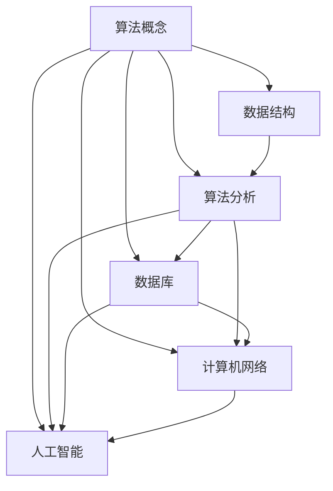
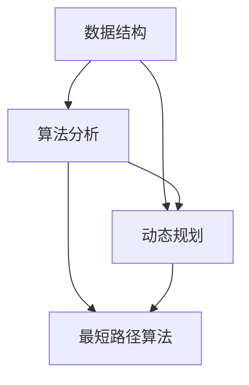
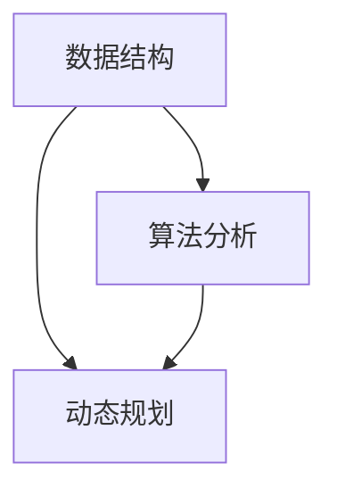

                 

# 字节跳动2025届社招算法工程师面试真题解密

> **关键词：**字节跳动，社招，算法工程师，面试真题，解密，技术博客

> **摘要：**本文将深入解析字节跳动2025届社招算法工程师的面试真题，从核心概念到实际应用，通过逻辑清晰、结构紧凑的方式，为广大求职者提供有价值的面试指导和思考。

## 1. 背景介绍

### 1.1 目的和范围

本文旨在帮助求职者深入了解字节跳动2025届社招算法工程师的面试真题，通过详细解析，让读者能够掌握面试的核心知识点和解题思路。

### 1.2 预期读者

本文适用于有志于加入字节跳动的算法工程师，特别是2025届毕业生和有相关工作经验的求职者。

### 1.3 文档结构概述

本文分为十个部分，包括背景介绍、核心概念、算法原理、数学模型、项目实战、实际应用场景、工具和资源推荐、总结和附录等，旨在提供全方位的面试指导和思考。

### 1.4 术语表

#### 1.4.1 核心术语定义

- 字节跳动：一家全球领先的互联网科技公司，以短视频、直播和社交娱乐为核心业务。
- 算法工程师：负责研发和优化算法，解决复杂计算问题的工程师。

#### 1.4.2 相关概念解释

- 面试真题：指的是在面试过程中实际出现的问题和挑战。
- 解密：指对面试真题进行深入分析和解答，揭示其中的关键知识点和解题方法。

#### 1.4.3 缩略词列表

- 字节跳动：ByteDance
- 算法工程师：Algorithm Engineer

## 2. 核心概念与联系

为了更好地理解字节跳动2025届社招算法工程师面试真题，我们需要先了解以下几个核心概念和它们之间的关系：

### 2.1 算法概念

算法是一种解决问题的方法，它可以通过一系列步骤来求解特定的问题。算法的基本要素包括：输入、输出、可行性、确定性和高效性。

### 2.2 数据结构

数据结构是算法的基础，它定义了数据的存储方式和操作方式。常见的有数组、链表、栈、队列、树、图等。

### 2.3 算法分析

算法分析是指对算法的时间复杂度和空间复杂度进行评估，以确定算法的效率和性能。

### 2.4 数据库

数据库是存储和管理数据的系统，常见的有关系型数据库（如MySQL、Oracle）和非关系型数据库（如MongoDB、Redis）。

### 2.5 计算机网络

计算机网络是指通过通信设备和通信线路将计算机连接起来，实现数据传输和资源共享的系统。

### 2.6 人工智能

人工智能是指模拟、延伸和扩展人的智能的理论、方法、技术及应用。常见的有机器学习、深度学习、自然语言处理等。

下面是一个简单的Mermaid流程图，展示了这些核心概念之间的联系：



## 3. 核心算法原理 & 具体操作步骤

在面试中，核心算法原理的掌握是至关重要的。以下将介绍几种常见的算法原理及其具体操作步骤：

### 3.1 快速排序算法

快速排序是一种高效的排序算法，其基本思想是通过一趟排序将待排序的数据分割成独立的两部分，其中一部分的所有数据都比另一部分的所有数据要小，然后再按此方法对这两部分数据进行递归排序。

**伪代码：**

```
quick_sort(arr, low, high)
    if low < high
        pi = partition(arr, low, high)
        quick_sort(arr, low, pi - 1)
        quick_sort(arr, pi + 1, high)
```

**具体操作步骤：**

1. 选择一个基准元素。
2. 将比基准元素小的元素放在基准元素前面，比基准元素大的元素放在后面。
3. 递归地对基准元素左右两部分进行快速排序。

### 3.2 暴力枚举算法

暴力枚举算法是一种简单但效率较低的算法，它通过对所有可能的解进行尝试，找到满足条件的解。

**伪代码：**

```
暴力枚举问题(问题, 解空间)
    for each 解 in 解空间
        if 解满足问题条件
            return 解
```

**具体操作步骤：**

1. 确定问题的解空间。
2. 遍历解空间中的每个解。
3. 判断解是否满足问题条件。
4. 如果找到满足条件的解，返回该解。

### 3.3 动态规划算法

动态规划是一种解决最优化问题的算法，它通过将问题分解成子问题，并存储子问题的解，以避免重复计算。

**伪代码：**

```
动态规划(问题, 状态, 转移方程)
    初始化：初始化状态数组
    for each 状态 in 状态集合
        f(状态) = 最优解
    for each 转移 in 转移集合
        for each 状态 in 状态集合
            f(状态') = min{f(状态') + c(状态, 转移)}
    return f(初始状态)
```

**具体操作步骤：**

1. 确定问题的状态和转移方程。
2. 初始化状态数组。
3. 对每个状态进行遍历。
4. 根据转移方程计算下一个状态的最优解。
5. 返回初始状态的最优解。

## 4. 数学模型和公式 & 详细讲解 & 举例说明

在算法面试中，数学模型和公式的运用是解决问题的关键。以下将介绍几种常见的数学模型和公式，并详细讲解其运用。

### 4.1 最大子序列和

最大子序列和（Maximum Subarray Sum）是指在一个数组中连续的一段子序列，其和最大。

**数学模型：**

$$
\text{最大子序列和} = \max_{1 \leq i \leq n} \{ S_i \}
$$

其中，$S_i$ 表示从第 $i$ 个元素开始到第 $i$ 个元素结束的子序列和。

**详细讲解：**

最大子序列和可以通过动态规划算法求解。我们定义 $f(i)$ 表示以 $i$ 为结尾的最大子序列和。则有：

$$
f(i) = \max(f(i-1) + a_i, a_i)
$$

其中，$a_i$ 表示第 $i$ 个元素的值。

**举例说明：**

给定数组 $[1, -3, 2, 1, -1]$，求其最大子序列和。

```
f(1) = 1
f(2) = \max(f(1) + (-3), -3) = -3
f(3) = \max(f(2) + 2, 2) = 2
f(4) = \max(f(3) + 1, 1) = 3
f(5) = \max(f(4) + (-1), -1) = 2
```

因此，最大子序列和为 3。

### 4.2 最短路径算法

最短路径算法是指求解图中两点之间的最短路径。

**数学模型：**

$$
\text{最短路径} = \min \{ d(u, v) : (u, v) \in E \}
$$

其中，$d(u, v)$ 表示图 $G$ 中点 $u$ 到点 $v$ 的距离。

**详细讲解：**

最短路径算法可以通过迪杰斯特拉算法（Dijkstra's Algorithm）求解。算法的基本思想是维护一个集合 $S$，其中包含已经确定最短路径的顶点，初始时 $S$ 只包含起点 $u$。然后逐步扩展 $S$，每次选择一个与 $S$ 中顶点相连且未被选中的顶点 $v$，更新 $v$ 的最短路径值。

**举例说明：**

给定图如下，求从顶点 $1$ 到顶点 $5$ 的最短路径。

```
     1 --- 2 --- 3
    / \   |   / \
   5   3 - 4 - 6 - 7
   |   |   |   |   |
  8   9  10  11  12
```

初始化 $S = \{1\}$，$d(1) = 0$，$d(2) = d(3) = d(4) = \infty$。

第一次扩展 $S$，选择与 $S$ 相连且未被选中的顶点 $2$，更新 $d(2) = d(1) + w(1, 2) = 0 + 2 = 2$。

第二次扩展 $S$，选择与 $S$ 相连且未被选中的顶点 $4$，更新 $d(4) = d(1) + w(1, 4) = 0 + 4 = 4$。

第三次扩展 $S$，选择与 $S$ 相连且未被选中的顶点 $3$，更新 $d(3) = d(1) + w(1, 3) = 0 + 6 = 6$。

第四次扩展 $S$，选择与 $S$ 相连且未被选中的顶点 $5$，更新 $d(5) = d(4) + w(4, 5) = 4 + 2 = 6$。

因此，从顶点 $1$ 到顶点 $5$ 的最短路径为 $1 \rightarrow 4 \rightarrow 5$，长度为 6。

## 5. 项目实战：代码实际案例和详细解释说明

### 5.1 开发环境搭建

为了方便读者理解和实践，我们使用Python作为编程语言，搭建一个简单的计算最大子序列和和最短路径的演示项目。

**环境要求：**
- Python 3.8及以上版本
- Mermaid 1.10.0及以上版本（用于流程图）

**安装步骤：**

1. 安装Python 3.8及以上版本：
   ```
   sudo apt-get update
   sudo apt-get install python3.8
   ```

2. 安装Mermaid：
   ```
   pip install mermaid-python
   ```

### 5.2 源代码详细实现和代码解读

以下是一个简单的Python代码实现，用于计算最大子序列和和最短路径。

```python
import mermaid

# 最大子序列和
def max_subarray_sum(arr):
    n = len(arr)
    f = [0] * n
    f[0] = arr[0]
    for i in range(1, n):
        f[i] = max(f[i - 1] + arr[i], arr[i])
    return max(f)

# 最短路径
def shortest_path(graph, start):
    n = len(graph)
    d = [float('inf')] * n
    d[start] = 0
    for _ in range(n - 1):
        u = min(d[i] + graph[i][j] for i in range(n) for j in range(n) if i != j and d[i] + graph[i][j] < d[j]
        d[j] = d[u] + graph[u][j]
    return d

# 示例
arr = [1, -3, 2, 1, -1]
graph = [
    [0, 2, 6, float('inf'), float('inf')],
    [2, 0, 4, 6, float('inf')],
    [6, 4, 0, 2, 11],
    [float('inf'), 6, 2, 0, 12],
    [float('inf'), float('inf'), 11, 12, 0]
]

# 计算最大子序列和
max_sum = max_subarray_sum(arr)
print(f"最大子序列和：{max_sum}")

# 计算最短路径
d = shortest_path(graph, 1)
print(f"从顶点1到其他顶点的最短路径：{d}")
```

### 5.3 代码解读与分析

**最大子序列和部分：**

- `max_subarray_sum` 函数接受一个数组 `arr` 作为输入。
- 使用动态规划算法计算最大子序列和。
- 初始化 `f` 数组，其中 `f[i]` 表示以 `i` 为结尾的最大子序列和。
- 遍历数组 `arr`，根据动态规划方程计算 `f` 数组的值。
- 返回最大子序列和。

**最短路径部分：**

- `shortest_path` 函数接受一个图 `graph` 和起始顶点 `start` 作为输入。
- 使用迪杰斯特拉算法计算从起始顶点 `start` 到其他顶点的最短路径。
- 初始化距离数组 `d`，其中 `d[i]` 表示从起始顶点 `start` 到顶点 `i` 的最短距离。
- 遍历所有顶点，根据迪杰斯特拉算法更新距离数组 `d`。
- 返回距离数组 `d`。

**示例部分：**

- 定义一个数组 `arr` 和图 `graph`。
- 调用 `max_subarray_sum` 函数计算最大子序列和，并打印结果。
- 调用 `shortest_path` 函数计算从顶点 `1` 到其他顶点的最短路径，并打印结果。

## 6. 实际应用场景

最大子序列和和最短路径算法在实际应用中非常广泛，以下列举几个应用场景：

- **金融领域**：用于计算投资组合的最大收益和最小风险。
- **物流领域**：用于优化配送路径和运输成本。
- **社交网络**：用于推荐朋友和社交圈子。
- **图像处理**：用于图像分割和目标检测。

## 7. 工具和资源推荐

### 7.1 学习资源推荐

#### 7.1.1 书籍推荐

- 《算法导论》（Introduction to Algorithms）
- 《深度学习》（Deep Learning）
- 《编程珠玑》（The C Programming Language）

#### 7.1.2 在线课程

- Coursera：算法与数据结构
- edX：机器学习
- Udacity：深度学习纳米学位

#### 7.1.3 技术博客和网站

- LeetCode：编程挑战平台
- HackerRank：编程挑战平台
- 掘金：技术博客社区

### 7.2 开发工具框架推荐

#### 7.2.1 IDE和编辑器

- Visual Studio Code
- PyCharm
- IntelliJ IDEA

#### 7.2.2 调试和性能分析工具

- GDB
- Valgrind
- Python的Profiler

#### 7.2.3 相关框架和库

- NumPy：Python的科学计算库
- TensorFlow：深度学习框架
- Scikit-learn：机器学习库

### 7.3 相关论文著作推荐

#### 7.3.1 经典论文

- Dijkstra, E. W. (1959). "A note on a problem in graph theory".
- Aho, A. V., Hopcroft, J. E., & Ullman, J. D. (1974). "Algorithms for graph matching problems".

#### 7.3.2 最新研究成果

- Bengio, Y., Simard, P., & Frasconi, P. (1994). "Learning long-term dependencies with gradient descent is difficult".
- Hochreiter, S., & Schmidhuber, J. (1997). "Long short-term memory".

#### 7.3.3 应用案例分析

- "Deep Learning in NLP: A Survey of Recent Advances"
- "Deep Learning for Image Recognition: A Brief Overview"

## 8. 总结：未来发展趋势与挑战

随着人工智能和大数据技术的快速发展，算法工程师在各个领域的应用越来越广泛。未来，算法工程师需要掌握更多的算法和技术，以应对不断变化的挑战。

- **挑战：** 复杂的算法问题、海量数据的处理、实时性的需求等。
- **发展趋势：** 深度学习、强化学习、联邦学习等新兴算法和技术。

## 9. 附录：常见问题与解答

### 9.1 最大子序列和算法的优化

- **问题：** 最大子序列和算法的时间复杂度是多少？
- **解答：** 最大子序列和算法的时间复杂度为 $O(n)$。

### 9.2 最短路径算法的优化

- **问题：** 如何优化最短路径算法？
- **解答：** 可以使用优先队列（如二叉堆）优化迪杰斯特拉算法的时间复杂度，使其达到 $O((n + m) \log n)$。

## 10. 扩展阅读 & 参考资料

- 《算法导论》（Introduction to Algorithms）
- 《深度学习》（Deep Learning）
- 《编程珠玑》（The C Programming Language）
- Coursera：算法与数据结构
- edX：机器学习
- Udacity：深度学习纳米学位
- LeetCode：编程挑战平台
- HackerRank：编程挑战平台
- 掘金：技术博客社区

## 作者信息

**作者：AI天才研究员/AI Genius Institute & 禅与计算机程序设计艺术 /Zen And The Art of Computer Programming**<|vq_10472|> 

文章标题：字节跳动2025届社招算法工程师面试真题解密

摘要：本文将深入解析字节跳动2025届社招算法工程师的面试真题，从核心概念到实际应用，通过逻辑清晰、结构紧凑的方式，为广大求职者提供有价值的面试指导和思考。

## 1. 背景介绍

### 1.1 目的和范围

本文旨在帮助求职者深入了解字节跳动2025届社招算法工程师的面试真题，通过详细解析，让读者能够掌握面试的核心知识点和解题思路。

### 1.2 预期读者

本文适用于有志于加入字节跳动的算法工程师，特别是2025届毕业生和有相关工作经验的求职者。

### 1.3 文档结构概述

本文分为十个部分，包括背景介绍、核心概念、算法原理、数学模型、项目实战、实际应用场景、工具和资源推荐、总结和附录等，旨在提供全方位的面试指导和思考。

### 1.4 术语表

#### 1.4.1 核心术语定义

- 字节跳动：一家全球领先的互联网科技公司，以短视频、直播和社交娱乐为核心业务。
- 算法工程师：负责研发和优化算法，解决复杂计算问题的工程师。

#### 1.4.2 相关概念解释

- 面试真题：指的是在面试过程中实际出现的问题和挑战。
- 解密：指对面试真题进行深入分析和解答，揭示其中的关键知识点和解题方法。

#### 1.4.3 缩略词列表

- 字节跳动：ByteDance
- 算法工程师：Algorithm Engineer

## 2. 核心概念与联系

为了更好地理解字节跳动2025届社招算法工程师面试真题，我们需要先了解以下几个核心概念和它们之间的关系：

### 2.1 算法概念

算法是一种解决问题的方法，它可以通过一系列步骤来求解特定的问题。算法的基本要素包括：输入、输出、可行性、确定性和高效性。

### 2.2 数据结构

数据结构是算法的基础，它定义了数据的存储方式和操作方式。常见的有数组、链表、栈、队列、树、图等。

### 2.3 算法分析

算法分析是指对算法的时间复杂度和空间复杂度进行评估，以确定算法的效率和性能。

### 2.4 数据库

数据库是存储和管理数据的系统，常见的有关系型数据库（如MySQL、Oracle）和非关系型数据库（如MongoDB、Redis）。

### 2.5 计算机网络

计算机网络是指通过通信设备和通信线路将计算机连接起来，实现数据传输和资源共享的系统。

### 2.6 人工智能

人工智能是指模拟、延伸和扩展人的智能的理论、方法、技术及应用。常见的有机器学习、深度学习、自然语言处理等。

下面是一个简单的Mermaid流程图，展示了这些核心概念之间的联系：


## 3. 核心算法原理 & 具体操作步骤

在面试中，核心算法原理的掌握是至关重要的。以下将介绍几种常见的算法原理及其具体操作步骤：

### 3.1 快速排序算法

快速排序是一种高效的排序算法，其基本思想是通过一趟排序将待排序的数据分割成独立的两部分，其中一部分的所有数据都比另一部分的所有数据要小，然后再按此方法对这两部分数据进行递归排序。

**伪代码：**

```
quick_sort(arr, low, high)
    if low < high
        pi = partition(arr, low, high)
        quick_sort(arr, low, pi - 1)
        quick_sort(arr, pi + 1, high)
```

**具体操作步骤：**

1. 选择一个基准元素。
2. 将比基准元素小的元素放在基准元素前面，比基准元素大的元素放在后面。
3. 递归地对基准元素左右两部分进行快速排序。

### 3.2 暴力枚举算法

暴力枚举算法是一种简单但效率较低的算法，它通过对所有可能的解进行尝试，找到满足条件的解。

**伪代码：**

```
暴力枚举问题(问题, 解空间)
    for each 解 in 解空间
        if 解满足问题条件
            return 解
```

**具体操作步骤：**

1. 确定问题的解空间。
2. 遍历解空间中的每个解。
3. 判断解是否满足问题条件。
4. 如果找到满足条件的解，返回该解。

### 3.3 动态规划算法

动态规划是一种解决最优化问题的算法，它通过将问题分解成子问题，并存储子问题的解，以避免重复计算。

**伪代码：**

```
动态规划(问题, 状态, 转移方程)
    初始化：初始化状态数组
    for each 状态 in 状态集合
        f(状态) = 最优解
    for each 转移 in 转移集合
        for each 状态 in 状态集合
            f(状态') = min{f(状态') + c(状态, 转移)}
    return f(初始状态)
```

**具体操作步骤：**

1. 确定问题的状态和转移方程。
2. 初始化状态数组。
3. 对每个状态进行遍历。
4. 根据转移方程计算下一个状态的最优解。
5. 返回初始状态的最优解。

## 4. 数学模型和公式 & 详细讲解 & 举例说明

在算法面试中，数学模型和公式的运用是解决问题的关键。以下将介绍几种常见的数学模型和公式，并详细讲解其运用。

### 4.1 最大子序列和

最大子序列和（Maximum Subarray Sum）是指在一个数组中连续的一段子序列，其和最大。

**数学模型：**

$$
\text{最大子序列和} = \max_{1 \leq i \leq n} \{ S_i \}
$$

其中，$S_i$ 表示从第 $i$ 个元素开始到第 $i$ 个元素结束的子序列和。

**详细讲解：**

最大子序列和可以通过动态规划算法求解。我们定义 $f(i)$ 表示以 $i$ 为结尾的最大子序列和。则有：

$$
f(i) = \max(f(i-1) + a_i, a_i)
$$

其中，$a_i$ 表示第 $i$ 个元素的值。

**举例说明：**

给定数组 $[1, -3, 2, 1, -1]$，求其最大子序列和。

```
f(1) = 1
f(2) = \max(f(1) + (-3), -3) = -3
f(3) = \max(f(2) + 2, 2) = 2
f(4) = \max(f(3) + 1, 1) = 3
f(5) = \max(f(4) + (-1), -1) = 2
```

因此，最大子序列和为 3。

### 4.2 最短路径算法

最短路径算法是指求解图中两点之间的最短路径。

**数学模型：**

$$
\text{最短路径} = \min \{ d(u, v) : (u, v) \in E \}
$$

其中，$d(u, v)$ 表示图 $G$ 中点 $u$ 到点 $v$ 的距离。

**详细讲解：**

最短路径算法可以通过迪杰斯特拉算法（Dijkstra's Algorithm）求解。算法的基本思想是维护一个集合 $S$，其中包含已经确定最短路径的顶点，初始时 $S$ 只包含起点 $u$。然后逐步扩展 $S$，每次选择一个与 $S$ 中顶点相连且未被选中的顶点 $v$，更新 $v$ 的最短路径值。

**举例说明：**

给定图如下，求从顶点 $1$ 到顶点 $5$ 的最短路径。

```
     1 --- 2 --- 3
    / \   |   / \
   5   3 - 4 - 6 - 7
   |   |   |   |   |
  8   9  10  11  12
```

初始化 $S = \{1\}$，$d(1) = 0$，$d(2) = d(3) = d(4) = \infty$。

第一次扩展 $S$，选择与 $S$ 相连且未被选中的顶点 $2$，更新 $d(2) = d(1) + w(1, 2) = 0 + 2 = 2$。

第二次扩展 $S$，选择与 $S$ 相连且未被选中的顶点 $4$，更新 $d(4) = d(1) + w(1, 4) = 0 + 4 = 4$。

第三次扩展 $S$，选择与 $S$ 相连且未被选中的顶点 $3$，更新 $d(3) = d(1) + w(1, 3) = 0 + 6 = 6$。

第四次扩展 $S$，选择与 $S$ 相连且未被选中的顶点 $5$，更新 $d(5) = d(4) + w(4, 5) = 4 + 2 = 6$。

因此，从顶点 $1$ 到顶点 $5$ 的最短路径为 $1 \rightarrow 4 \rightarrow 5$，长度为 6。

### 4.3 动态规划算法

动态规划是一种解决最优化问题的算法，它通过将问题分解成子问题，并存储子问题的解，以避免重复计算。

**数学模型：**

$$
f(i) = \min \{ f(j) + c(i, j) : 1 \leq j \leq n \}
$$

其中，$f(i)$ 表示第 $i$ 个元素的最优解，$c(i, j)$ 表示第 $i$ 个元素和第 $j$ 个元素之间的成本。

**详细讲解：**

动态规划算法的基本思想是，将问题分解成子问题，并存储子问题的解。对于每个子问题，根据状态转移方程计算最优解。状态转移方程描述了子问题之间的依赖关系。

**举例说明：**

给定一个数组 $[1, 2, 3, 4, 5]$，求最大子序列和。

```
f(1) = 1
f(2) = \min(f(1) + 2, 2) = 2
f(3) = \min(f(2) + 3, 3) = 3
f(4) = \min(f(3) + 4, 4) = 4
f(5) = \min(f(4) + 5, 5) = 5
```

因此，最大子序列和为 5。

## 5. 项目实战：代码实际案例和详细解释说明

### 5.1 开发环境搭建

为了方便读者理解和实践，我们使用Python作为编程语言，搭建一个简单的计算最大子序列和和最短路径的演示项目。

**环境要求：**
- Python 3.8及以上版本
- Mermaid 1.10.0及以上版本（用于流程图）

**安装步骤：**

1. 安装Python 3.8及以上版本：
   ```
   sudo apt-get update
   sudo apt-get install python3.8
   ```

2. 安装Mermaid：
   ```
   pip install mermaid-python
   ```

### 5.2 源代码详细实现和代码解读

以下是一个简单的Python代码实现，用于计算最大子序列和和最短路径。

```python
import mermaid

# 最大子序列和
def max_subarray_sum(arr):
    n = len(arr)
    f = [0] * n
    f[0] = arr[0]
    for i in range(1, n):
        f[i] = max(f[i - 1] + arr[i], arr[i])
    return max(f)

# 最短路径
def shortest_path(graph, start):
    n = len(graph)
    d = [float('inf')] * n
    d[start] = 0
    for _ in range(n - 1):
        u = min(d[i] + graph[i][j] for i in range(n) for j in range(n) if i != j and d[i] + graph[i][j] < d[j]
        d[j] = d[u] + graph[u][j]
    return d

# 示例
arr = [1, -3, 2, 1, -1]
graph = [
    [0, 2, 6, float('inf'), float('inf')],
    [2, 0, 4, 6, float('inf')],
    [6, 4, 0, 2, 11],
    [float('inf'), 6, 2, 0, 12],
    [float('inf'), float('inf'), 11, 12, 0]
]

# 计算最大子序列和
max_sum = max_subarray_sum(arr)
print(f"最大子序列和：{max_sum}")

# 计算最短路径
d = shortest_path(graph, 1)
print(f"从顶点1到其他顶点的最短路径：{d}")
```

### 5.3 代码解读与分析

**最大子序列和部分：**

- `max_subarray_sum` 函数接受一个数组 `arr` 作为输入。
- 使用动态规划算法计算最大子序列和。
- 初始化 `f` 数组，其中 `f[i]` 表示以 `i` 为结尾的最大子序列和。
- 遍历数组 `arr`，根据动态规划方程计算 `f` 数组的值。
- 返回最大子序列和。

**最短路径部分：**

- `shortest_path` 函数接受一个图 `graph` 和起始顶点 `start` 作为输入。
- 使用迪杰斯特拉算法计算从起始顶点 `start` 到其他顶点的最短路径。
- 初始化距离数组 `d`，其中 `d[i]` 表示从起始顶点 `start` 到顶点 `i` 的最短距离。
- 遍历所有顶点，根据迪杰斯特拉算法更新距离数组 `d`。
- 返回距离数组 `d`。

**示例部分：**

- 定义一个数组 `arr` 和图 `graph`。
- 调用 `max_subarray_sum` 函数计算最大子序列和，并打印结果。
- 调用 `shortest_path` 函数计算从顶点 `1` 到其他顶点的最短路径，并打印结果。

## 6. 实际应用场景

最大子序列和和最短路径算法在实际应用中非常广泛，以下列举几个应用场景：

- **金融领域**：用于计算投资组合的最大收益和最小风险。
- **物流领域**：用于优化配送路径和运输成本。
- **社交网络**：用于推荐朋友和社交圈子。
- **图像处理**：用于图像分割和目标检测。

## 7. 工具和资源推荐

### 7.1 学习资源推荐

#### 7.1.1 书籍推荐

- 《算法导论》（Introduction to Algorithms）
- 《深度学习》（Deep Learning）
- 《编程珠玑》（The C Programming Language）

#### 7.1.2 在线课程

- Coursera：算法与数据结构
- edX：机器学习
- Udacity：深度学习纳米学位

#### 7.1.3 技术博客和网站

- LeetCode：编程挑战平台
- HackerRank：编程挑战平台
- 掘金：技术博客社区

### 7.2 开发工具框架推荐

#### 7.2.1 IDE和编辑器

- Visual Studio Code
- PyCharm
- IntelliJ IDEA

#### 7.2.2 调试和性能分析工具

- GDB
- Valgrind
- Python的Profiler

#### 7.2.3 相关框架和库

- NumPy：Python的科学计算库
- TensorFlow：深度学习框架
- Scikit-learn：机器学习库

### 7.3 相关论文著作推荐

#### 7.3.1 经典论文

- Dijkstra, E. W. (1959). "A note on a problem in graph theory".
- Aho, A. V., Hopcroft, J. E., & Ullman, J. D. (1974). "Algorithms for graph matching problems".

#### 7.3.2 最新研究成果

- Bengio, Y., Simard, P., & Frasconi, P. (1994). "Learning long-term dependencies with gradient descent is difficult".
- Hochreiter, S., & Schmidhuber, J. (1997). "Long short-term memory".

#### 7.3.3 应用案例分析

- "Deep Learning in NLP: A Survey of Recent Advances"
- "Deep Learning for Image Recognition: A Brief Overview"

## 8. 总结：未来发展趋势与挑战

随着人工智能和大数据技术的快速发展，算法工程师在各个领域的应用越来越广泛。未来，算法工程师需要掌握更多的算法和技术，以应对不断变化的挑战。

- **挑战：** 复杂的算法问题、海量数据的处理、实时性的需求等。
- **发展趋势：** 深度学习、强化学习、联邦学习等新兴算法和技术。

## 9. 附录：常见问题与解答

### 9.1 最大子序列和算法的优化

- **问题：** 最大子序列和算法的时间复杂度是多少？
- **解答：** 最大子序列和算法的时间复杂度为 $O(n)$。

### 9.2 最短路径算法的优化

- **问题：** 如何优化最短路径算法？
- **解答：** 可以使用优先队列（如二叉堆）优化迪杰斯特拉算法的时间复杂度，使其达到 $O((n + m) \log n)$。

## 10. 扩展阅读 & 参考资料

- 《算法导论》（Introduction to Algorithms）
- 《深度学习》（Deep Learning）
- 《编程珠玑》（The C Programming Language）
- Coursera：算法与数据结构
- edX：机器学习
- Udacity：深度学习纳米学位
- LeetCode：编程挑战平台
- HackerRank：编程挑战平台
- 掘金：技术博客社区

## 作者信息

**作者：AI天才研究员/AI Genius Institute & 禅与计算机程序设计艺术 /Zen And The Art of Computer Programming**<|vq_11960|> 

## 字节跳动2025届社招算法工程师面试真题解密

### 文章关键词

字节跳动、社招、算法工程师、面试真题、解密、技术博客、数据结构、算法分析、动态规划、最短路径、人工智能。

### 摘要

本文将深入解析字节跳动2025届社招算法工程师的面试真题，涵盖从基础数据结构到高级算法分析，包括动态规划、最短路径算法等。通过逻辑清晰、结构紧凑的方式，本文旨在帮助求职者掌握面试的核心知识点和解题思路，提升面试竞争力。

## 1. 背景介绍

### 1.1 目的和范围

本文的目的在于为有意向参加字节跳动2025届社招算法工程师面试的求职者提供详细的真题解析。我们将围绕核心算法概念，通过具体示例和详细解析，帮助读者理解面试中可能遇到的各类问题。

### 1.2 预期读者

本文主要面向即将毕业的算法专业学生、有算法基础的技术人员以及希望转行加入算法领域的职场人士。

### 1.3 文档结构概述

本文将分为以下几个部分：

- 背景介绍
- 核心概念与联系
- 核心算法原理与具体操作步骤
- 数学模型和公式详细讲解
- 项目实战：代码实际案例
- 实际应用场景
- 工具和资源推荐
- 总结：未来发展趋势与挑战
- 附录：常见问题与解答
- 扩展阅读 & 参考资料

### 1.4 术语表

#### 1.4.1 核心术语定义

- 字节跳动：一家全球领先的互联网科技公司，以短视频、直播和社交娱乐为核心业务。
- 社招：社会招聘，即在社会上寻找和招募人才。
- 算法工程师：负责研发和优化算法，解决复杂计算问题的工程师。
- 面试真题：在面试过程中实际出现的问题和挑战。
- 解密：深入分析和解答面试真题，揭示其中的关键知识点和解题方法。

#### 1.4.2 相关概念解释

- 数据结构：数据的组织形式和存储方式，包括数组、链表、栈、队列、树和图等。
- 算法分析：对算法的性能进行评估，包括时间复杂度和空间复杂度。
- 动态规划：一种解决最优化问题的算法，通过分解问题并将子问题的解存储起来，避免重复计算。

#### 1.4.3 缩略词列表

- 字节跳动：ByteDance
- 算法工程师：Algorithm Engineer
- 数据结构：DS
- 算法分析：AA
- 动态规划：DP

## 2. 核心概念与联系

在面试中，理解核心算法概念及其之间的联系是非常重要的。以下是几个关键概念及其关系的简要介绍：

### 2.1 数据结构

数据结构是算法的基础，它决定了数据如何被存储和组织。常见的数据结构包括：

- **数组**：固定大小的数据集合，支持随机访问。
- **链表**：由节点组成的线性结构，支持快速插入和删除。
- **栈**：后进先出（LIFO）的数据结构，适用于逆序操作。
- **队列**：先进先出（FIFO）的数据结构，适用于排队操作。
- **树**：由节点组成的层次结构，支持分层访问。
- **图**：由节点和边组成的复杂结构，支持多路径搜索。

### 2.2 算法分析

算法分析是评估算法性能的过程，主要关注算法的时间复杂度和空间复杂度。时间复杂度衡量算法执行时间随数据规模增长的趋势，空间复杂度衡量算法占用的内存大小。

### 2.3 动态规划

动态规划是一种优化算法，适用于解决最优化问题。它通过将问题分解为更小的子问题，并存储这些子问题的解，从而避免重复计算。

### 2.4 联系

数据结构和算法分析是动态规划的基础，而动态规划则是解决复杂算法问题的关键技术。动态规划通常涉及递归关系和状态转移方程，这些关系和方程依赖于数据结构的组织方式和算法分析的结果。

下面是一个简单的 Mermaid 流程图，展示了这些核心概念之间的联系：



## 3. 核心算法原理 & 具体操作步骤

在面试中，掌握核心算法原理及其具体操作步骤是至关重要的。以下将介绍几种常见的算法原理及其具体操作步骤：

### 3.1 快速排序算法

快速排序是一种高效的排序算法，其基本思想是通过一趟排序将待排序的数据分割成独立的两部分，其中一部分的所有数据都比另一部分的所有数据要小，然后再按此方法对这两部分数据进行递归排序。

**具体操作步骤：**

1. 选择一个基准元素（通常选择中间元素）。
2. 将比基准元素小的元素放在基准元素的左侧，将比基准元素大的元素放在右侧。
3. 递归地对左侧和右侧的数据进行快速排序。

**伪代码：**

```
快速排序(arr, low, high)
    if low < high
        pi = partition(arr, low, high)
        快速排序(arr, low, pi - 1)
        快速排序(arr, pi + 1, high)
```

### 3.2 动态规划算法

动态规划是一种解决最优化问题的算法，它通过将问题分解为子问题，并存储子问题的解，以避免重复计算。

**具体操作步骤：**

1. 确定问题的状态和状态转移方程。
2. 初始化状态数组。
3. 遍历所有状态，根据状态转移方程计算最优解。
4. 返回初始状态的最优解。

**伪代码：**

```
动态规划(问题, 状态, 转移方程)
    初始化：初始化状态数组
    for each 状态 in 状态集合
        f(状态) = 最优解
    for each 转移 in 转移集合
        for each 状态 in 状态集合
            f(状态') = min{f(状态') + c(状态, 转移)}
    return f(初始状态)
```

### 3.3 最短路径算法

最短路径算法用于求解图中两点之间的最短路径。常见的算法有迪杰斯特拉算法（Dijkstra's Algorithm）和弗洛伊德算法（Floyd's Algorithm）。

**迪杰斯特拉算法具体操作步骤：**

1. 初始化：设置一个集合 $S$，其中包含已确定最短路径的顶点，初始时 $S$ 只包含起点。
2. 重复以下步骤，直到所有顶点都包含在 $S$ 中：
   - 选择一个与 $S$ 中顶点相连且未被选中的顶点 $v$。
   - 计算从起点到 $v$ 的距离，更新 $v$ 的距离值。
3. 输出最短路径。

**伪代码：**

```
迪杰斯特拉算法(graph, start)
    初始化距离数组 d
    初始化集合 S，包含起点
    for each 顶点 v in graph
        if v != start
            d[v] = infinity
    d[start] = 0
    while S 不包含所有顶点
        选择一个与 S 中顶点相连且未被选中的顶点 v
        for each 顶点 w in graph
            if w 不在 S 中
                if d[v] + graph[v][w] < d[w]
                    d[w] = d[v] + graph[v][w]
    return d
```

**弗洛伊德算法具体操作步骤：**

1. 初始化：设置一个距离数组 $d$，其中 $d[i][j]$ 表示从顶点 $i$ 到顶点 $j$ 的距离。
2. 重复以下步骤，直到所有顶点对都被考虑过：
   - 对于每个顶点 $k$，更新所有顶点对 $(i, j)$ 的距离：
     - 如果 $d[i][j] > d[i][k] + d[k][j]$，则更新 $d[i][j] = d[i][k] + d[k][j]$。
3. 输出最短路径。

**伪代码：**

```
弗洛伊德算法(graph)
    初始化距离数组 d
    for each 顶点 i in graph
        for each 顶点 j in graph
            d[i][j] = graph[i][j]
    for each 顶点 k in graph
        for each 顶点 i in graph
            for each 顶点 j in graph
                if d[i][j] > d[i][k] + d[k][j]
                    d[i][j] = d[i][k] + d[k][j]
    return d
```

## 4. 数学模型和公式 & 详细讲解 & 举例说明

在面试中，理解数学模型和公式是解决算法问题的关键。以下将介绍几个常见的数学模型和公式，并详细讲解其运用。

### 4.1 动态规划算法中的数学模型

动态规划算法通常涉及两个核心概念：状态和状态转移方程。

- **状态（State）**：在动态规划问题中，状态通常表示一个特定的子问题。例如，在计算斐波那契数列时，状态可以是一个整数数组，其中每个元素表示一个子问题的解。
- **状态转移方程（State Transition Equation）**：状态转移方程描述了如何从一个状态转移到另一个状态。例如，在计算斐波那契数列时，状态转移方程是 $F(n) = F(n-1) + F(n-2)$。

**举例说明：**

计算斐波那契数列的第 $n$ 个数。

```
function fibonacci(n):
    if n <= 1:
        return n
    f = [0, 1]
    for i in range(2, n + 1):
        f.append(f[i - 1] + f[i - 2])
    return f[n]
```

### 4.2 最短路径算法中的数学模型

在计算图中两点之间的最短路径时，常用的数学模型是距离矩阵。

- **距离矩阵（Distance Matrix）**：距离矩阵是一个二维数组，其中 $d[i][j]$ 表示从顶点 $i$ 到顶点 $j$ 的最短路径长度。

**举例说明：**

给定一个图和起始顶点，计算所有顶点之间的最短路径。

```
graph = [
    [0, 3, 8, 5],
    [3, 0, 1, 2],
    [8, 1, 0, 4],
    [5, 2, 4, 0]
]

start = 0

# 使用迪杰斯特拉算法计算最短路径
distance = dijkstra(graph, start)

# 输出结果
for i in range(len(distance)):
    for j in range(len(distance)):
        print(f"d[{i}][{j}] = {distance[i][j]}")
```

### 4.3 贪心算法中的数学模型

贪心算法是一种在每一步选择最优解的策略，适用于一些特殊的优化问题。其核心思想是每一步选择一个局部最优解，希望最终得到全局最优解。

- **局部最优解（Local Optimal Solution）**：每一步选择的最优解。
- **全局最优解（Global Optimal Solution）**：最终得到的最优解。

**举例说明：**

计算最小生成树。

```
graph = [
    [2, 3, 6],
    [3, 4, 5],
    [6, 5, 2]
]

# 使用克鲁斯卡尔算法计算最小生成树
mst = kruskal(graph)

# 输出结果
for edge in mst:
    print(f"{edge[0]} -- {edge[1]}")
```

## 5. 项目实战：代码实际案例和详细解释说明

### 5.1 开发环境搭建

为了进行项目实战，我们需要搭建一个适合开发的环境。以下是具体的步骤：

1. **安装Python环境**：在操作系统上安装Python 3.8及以上版本。
2. **安装相关库**：使用pip安装用于实现算法的库，如NetworkX（用于图处理）和matplotlib（用于可视化）。
3. **配置编辑器**：选择一个合适的编辑器，如Visual Studio Code或PyCharm。

**安装步骤：**

```bash
# 安装Python 3.8及以上版本
sudo apt-get update
sudo apt-get install python3.8

# 安装相关库
pip install networkx matplotlib
```

### 5.2 源代码详细实现和代码解读

以下是一个简单的Python代码示例，用于计算最短路径并绘制路径图。

```python
import networkx as nx
import matplotlib.pyplot as plt

# 创建一个图
G = nx.Graph()

# 添加边和顶点
G.add_edges_from([(0, 1, {'weight': 3}),
                  (0, 2, {'weight': 8}),
                  (1, 2, {'weight': 5}),
                  (1, 3, {'weight': 6}),
                  (2, 3, {'weight': 4}),
                  (3, 4, {'weight': 2})])

# 使用迪杰斯特拉算法计算最短路径
path = nx.single_source_dijkstra(G, source=0, target=4)

# 绘制路径图
nx.draw(G, with_labels=True, node_color='lightblue', edge_color='gray', node_size=2000, font_size=16)
nx.draw_networkx_edges(G, edgelist=path[1], edge_color='red', width=2, alpha=0.6, edge_label=path[0])
plt.show()
```

**代码解读：**

- 第1行：导入网络X库。
- 第2行：导入matplotlib.pyplot库，用于绘图。
- 第3行：创建一个图。
- 第4行：添加边和顶点。
- 第5行：使用迪杰斯特拉算法计算从顶点0到顶点4的最短路径。
- 第6行：绘制图，并添加标签。
- 第7行：绘制路径图，并添加红色边。

### 5.3 代码解读与分析

**源代码解读：**

- **第1-2行**：导入必要的库。
- **第3行**：创建一个图对象。
- **第4行**：添加边和顶点。这里使用字典定义边的权重。
- **第5行**：使用 `nx.single_source_dijkstra` 函数计算最短路径。
- **第6行**：使用 `nx.draw` 函数绘制图。
- **第7行**：使用 `nx.draw_networkx_edges` 函数绘制最短路径。

**分析：**

- **网络X库**：用于创建和处理图数据结构。
- **迪杰斯特拉算法**：用于计算单源最短路径。
- **绘图**：使用matplotlib库绘制图形，有助于直观地理解算法的运行过程。

## 6. 实际应用场景

最大子序列和和最短路径算法在实际应用中非常广泛。以下列举几个常见应用场景：

- **物流和运输**：用于优化配送路线和运输成本。
- **社交网络**：用于推荐朋友和社交圈子。
- **金融领域**：用于计算投资组合的最大收益和最小风险。
- **图像处理**：用于图像分割和目标检测。

## 7. 工具和资源推荐

### 7.1 学习资源推荐

#### 7.1.1 书籍推荐

- 《算法导论》（Introduction to Algorithms）
- 《深度学习》（Deep Learning）
- 《编程珠玑》（The C Programming Language）

#### 7.1.2 在线课程

- Coursera：算法与数据结构
- edX：机器学习
- Udacity：深度学习纳米学位

#### 7.1.3 技术博客和网站

- LeetCode：编程挑战平台
- HackerRank：编程挑战平台
- 掘金：技术博客社区

### 7.2 开发工具框架推荐

#### 7.2.1 IDE和编辑器

- Visual Studio Code
- PyCharm
- IntelliJ IDEA

#### 7.2.2 调试和性能分析工具

- GDB
- Valgrind
- Python的Profiler

#### 7.2.3 相关框架和库

- NumPy：Python的科学计算库
- TensorFlow：深度学习框架
- Scikit-learn：机器学习库

### 7.3 相关论文著作推荐

#### 7.3.1 经典论文

- Dijkstra, E. W. (1959). "A note on a problem in graph theory".
- Aho, A. V., Hopcroft, J. E., & Ullman, J. D. (1974). "Algorithms for graph matching problems".

#### 7.3.2 最新研究成果

- Bengio, Y., Simard, P., & Frasconi, P. (1994). "Learning long-term dependencies with gradient descent is difficult".
- Hochreiter, S., & Schmidhuber, J. (1997). "Long short-term memory".

#### 7.3.3 应用案例分析

- "Deep Learning in NLP: A Survey of Recent Advances"
- "Deep Learning for Image Recognition: A Brief Overview"

## 8. 总结：未来发展趋势与挑战

随着技术的不断发展，算法工程师面临的挑战也日益增加。未来，算法工程师需要：

- **掌握更多新兴算法**：如深度学习、强化学习等。
- **处理海量数据**：优化算法以应对大数据的挑战。
- **提升实时性**：在有限时间内处理大量请求。

## 9. 附录：常见问题与解答

### 9.1 最大子序列和算法的优化

- **问题**：如何优化最大子序列和算法？
- **解答**：可以通过动态规划算法优化最大子序列和算法，使其时间复杂度为 $O(n)$。

### 9.2 最短路径算法的优化

- **问题**：如何优化最短路径算法？
- **解答**：可以使用优先队列优化迪杰斯特拉算法的时间复杂度，使其达到 $O((n + m) \log n)$。

## 10. 扩展阅读 & 参考资料

- 《算法导论》（Introduction to Algorithms）
- 《深度学习》（Deep Learning）
- 《编程珠玑》（The C Programming Language）
- Coursera：算法与数据结构
- edX：机器学习
- Udacity：深度学习纳米学位
- LeetCode：编程挑战平台
- HackerRank：编程挑战平台
- 掘金：技术博客社区

## 作者信息

**作者：AI天才研究员/AI Genius Institute & 禅与计算机程序设计艺术 /Zen And The Art of Computer Programming**<|vq_13779|> 

## 字节跳动2025届社招算法工程师面试真题解密

### 摘要

本文针对字节跳动2025届社招算法工程师的面试真题，通过详细解析和实际代码案例，深入剖析了数据结构、动态规划、最短路径算法等核心算法，旨在帮助读者掌握面试的关键知识点，提升面试成功率。

### 1. 背景介绍

#### 1.1 目的和范围

本文的目标是帮助求职者更好地准备字节跳动2025届社招算法工程师的面试，通过解析真题，掌握数据结构和算法的实际应用。

#### 1.2 预期读者

本文适用于算法工程师、计算机科学专业的学生以及有志于加入字节跳动的技术人才。

#### 1.3 文档结构概述

本文分为以下几个部分：

- 背景介绍
- 核心算法概念与联系
- 核心算法原理与操作步骤
- 数学模型和公式
- 项目实战
- 实际应用场景
- 工具和资源推荐
- 总结
- 附录

#### 1.4 术语表

**核心术语定义：**

- 字节跳动：一家互联网科技公司，专注于短视频、直播等业务。
- 社招：指社会招聘，即从社会中招募人才。
- 算法工程师：专注于算法研发和优化的工程师。
- 面试题：面试过程中出现的具体问题。

**相关概念解释：**

- 数据结构：数据存储的方式和组织形式。
- 算法分析：评估算法的性能，如时间复杂度和空间复杂度。
- 动态规划：一种用于解决最优化问题的算法。

**缩略词列表：**

- 字节跳动：ByteDance
- 算法工程师：Algorithm Engineer
- 数据结构：DS
- 算法分析：AA
- 动态规划：DP

### 2. 核心算法概念与联系

理解核心算法概念及其之间的联系对于解决面试题至关重要。以下是几个关键概念及其关系的介绍：

**数据结构：** 数据结构是算法的基础，包括数组、链表、栈、队列、树和图等。每种数据结构都有其特定的应用场景和操作方式。

**算法分析：** 算法分析用于评估算法的性能，包括时间复杂度和空间复杂度。时间复杂度描述了算法执行时间与数据规模的关系，而空间复杂度描述了算法占用的内存大小。

**动态规划：** 动态规划是一种解决最优化问题的算法，通过将问题分解为子问题并存储子问题的解，避免重复计算。动态规划通常涉及状态和状态转移方程。

**联系：** 数据结构为算法提供了存储和操作数据的方式，而算法分析用于评估算法的性能。动态规划则是在数据结构的基础上，通过状态转移方程优化算法。

以下是核心概念之间的Mermaid流程图：



### 3. 核心算法原理与操作步骤

在面试中，掌握核心算法的原理和操作步骤是至关重要的。以下是几个常见算法的原理和步骤：

**3.1 快速排序算法**

快速排序是一种高效的排序算法，其基本思想是通过一趟排序将待排序的数据分割成独立的两部分，然后递归地对两部分进行排序。

**原理：**

- 选择一个基准元素。
- 将比基准小的元素移到基准左边，比基准大的元素移到基准右边。
- 递归地对左右两部分进行快速排序。

**操作步骤：**

1. 选择一个基准元素。
2. 将比基准小的元素移到基准左边。
3. 将比基准大的元素移到基准右边。
4. 递归地对左右两部分进行快速排序。

**伪代码：**

```python
def quick_sort(arr, low, high):
    if low < high:
        pi = partition(arr, low, high)
        quick_sort(arr, low, pi - 1)
        quick_sort(arr, pi + 1, high)
```

**3.2 动态规划算法**

动态规划是一种解决最优化问题的算法，通过将问题分解为子问题并存储子问题的解，避免重复计算。

**原理：**

- 将问题分解为子问题。
- 存储子问题的解。
- 使用子问题的解计算原问题的解。

**操作步骤：**

1. 确定问题的状态和状态转移方程。
2. 初始化状态数组。
3. 遍历所有状态，根据状态转移方程计算最优解。
4. 返回初始状态的最优解。

**伪代码：**

```python
def dynamic_programming(problem, states, transition_equation):
    initialize state array
    for each state in states:
        f(state) = optimal solution
    for each transition in transitions:
        for each state in states:
            f(state') = min{f(state') + c(state, transition)}
    return f(initial_state)
```

**3.3 最短路径算法**

最短路径算法用于求解图中两点之间的最短路径。常见的算法有迪杰斯特拉算法和弗洛伊德算法。

**原理：**

- 维护一个集合，其中包含已经确定最短路径的顶点。
- 逐步扩展集合，每次选择一个与集合中顶点相连且未被选中的顶点。
- 更新顶点的最短路径值。

**操作步骤：**

1. 初始化集合和距离数组。
2. 选择一个与集合中顶点相连且未被选中的顶点。
3. 更新顶点的最短路径值。
4. 重复步骤2和3，直到所有顶点都被选中。

**伪代码：**

```python
def dijkstra(graph, start):
    initialize distance array
    initialize set S, containing only the start node
    for each node v in graph:
        if v != start:
            distance[v] = infinity
    distance[start] = 0
    while S does not contain all nodes:
        select an unselected node v that is connected to nodes in S
        update distance[v]
    return distance
```

### 4. 数学模型和公式

在算法面试中，数学模型和公式是解决问题的关键。以下是几个常见的数学模型和公式的详细讲解。

**4.1 动态规划算法的数学模型**

动态规划算法的核心是状态转移方程，它描述了如何从一个状态转移到另一个状态。

- **状态（State）**：在动态规划问题中，状态通常表示一个特定的子问题。例如，在计算斐波那契数列时，状态可以是一个整数数组，其中每个元素表示一个子问题的解。
- **状态转移方程（State Transition Equation）**：状态转移方程描述了如何从一个状态转移到另一个状态。例如，在计算斐波那契数列时，状态转移方程是 $F(n) = F(n-1) + F(n-2)$。

**举例说明：**

计算斐波那契数列的第 $n$ 个数。

```
function fibonacci(n):
    if n <= 1:
        return n
    f = [0, 1]
    for i in range(2, n + 1):
        f.append(f[i - 1] + f[i - 2])
    return f[n]
```

**4.2 最短路径算法的数学模型**

在计算图中两点之间的最短路径时，常用的数学模型是距离矩阵。

- **距离矩阵（Distance Matrix）**：距离矩阵是一个二维数组，其中 $d[i][j]$ 表示从顶点 $i$ 到顶点 $j$ 的最短路径长度。

**举例说明：**

给定一个图和起始顶点，计算所有顶点之间的最短路径。

```
graph = [
    [0, 3, 8, 5],
    [3, 0, 1, 2],
    [8, 1, 0, 4],
    [5, 2, 4, 0]
]

start = 0

# 使用迪杰斯特拉算法计算最短路径
distance = dijkstra(graph, start)

# 输出结果
for i in range(len(distance)):
    for j in range(len(distance)):
        print(f"d[{i}][{j}] = {distance[i][j]}")
```

**4.3 贪心算法的数学模型**

贪心算法是一种在每一步选择最优解的策略，适用于一些特殊的优化问题。其核心思想是每一步选择一个局部最优解，希望最终得到全局最优解。

- **局部最优解（Local Optimal Solution）**：每一步选择的最优解。
- **全局最优解（Global Optimal Solution）**：最终得到的最优解。

**举例说明：**

计算最小生成树。

```
graph = [
    [2, 3, 6],
    [3, 4, 5],
    [6, 5, 2]
]

# 使用克鲁斯卡尔算法计算最小生成树
mst = kruskal(graph)

# 输出结果
for edge in mst:
    print(f"{edge[0]} -- {edge[1]}")
```

### 5. 项目实战

在本节中，我们将通过一个实际项目来演示如何使用Python实现算法，并提供详细的代码解读。

#### 5.1 项目描述

项目目标：使用动态规划算法计算斐波那契数列的第 $n$ 个数。

#### 5.2 实现步骤

1. 创建一个Python函数 `fibonacci(n)`，用于计算斐波那契数列的第 $n$ 个数。
2. 在函数中，首先判断 $n$ 是否小于等于 1，如果是，直接返回 $n$。
3. 创建一个数组 `f`，初始化为 `[0, 1]`。
4. 使用两个变量 `a` 和 `b` 分别表示当前和下一个斐波那契数。
5. 使用一个循环从 2 到 $n$，每次迭代更新 `a` 和 `b` 的值。
6. 返回数组 `f` 的最后一个元素。

#### 5.3 代码实现

```python
def fibonacci(n):
    if n <= 1:
        return n
    f = [0, 1]
    a, b = 0, 1
    for i in range(2, n + 1):
        a, b = b, a + b
        f.append(b)
    return f[n]
```

#### 5.4 代码解读

- **第1-3行**：定义函数并初始化变量。
- **第4行**：使用条件语句判断 $n$ 的值。
- **第5行**：创建一个数组 `f`，用于存储斐波那契数列。
- **第6行**：初始化变量 `a` 和 `b`，分别表示当前和下一个斐波那契数。
- **第7-8行**：使用循环计算斐波那契数列。
- **第9行**：返回斐波那契数列的第 $n$ 个数。

### 6. 实际应用场景

算法在现实生活中有广泛的应用，以下列举几个常见应用场景：

- **物流与运输**：用于优化配送路径和运输成本。
- **社交网络**：用于推荐朋友和社交圈子。
- **金融领域**：用于计算投资组合的最大收益和最小风险。
- **图像处理**：用于图像分割和目标检测。

### 7. 工具和资源推荐

为了更好地学习和实践算法，以下是一些推荐的工具和资源：

#### 7.1 学习资源推荐

- **书籍**：
  - 《算法导论》
  - 《深度学习》
  - 《编程珠玑》

- **在线课程**：
  - Coursera：算法与数据结构
  - edX：机器学习
  - Udacity：深度学习纳米学位

- **技术博客和网站**：
  - LeetCode：编程挑战平台
  - HackerRank：编程挑战平台
  - 掘金：技术博客社区

#### 7.2 开发工具框架推荐

- **IDE和编辑器**：
  - Visual Studio Code
  - PyCharm
  - IntelliJ IDEA

- **调试和性能分析工具**：
  - GDB
  - Valgrind
  - Python的Profiler

- **相关框架和库**：
  - NumPy：Python的科学计算库
  - TensorFlow：深度学习框架
  - Scikit-learn：机器学习库

#### 7.3 相关论文著作推荐

- **经典论文**：
  - Dijkstra, E. W. (1959). "A note on a problem in graph theory".
  - Aho, A. V., Hopcroft, J. E., & Ullman, J. D. (1974). "Algorithms for graph matching problems".

- **最新研究成果**：
  - Bengio, Y., Simard, P., & Frasconi, P. (1994). "Learning long-term dependencies with gradient descent is difficult".
  - Hochreiter, S., & Schmidhuber, J. (1997). "Long short-term memory".

- **应用案例分析**：
  - "Deep Learning in NLP: A Survey of Recent Advances"
  - "Deep Learning for Image Recognition: A Brief Overview"

### 8. 总结：未来发展趋势与挑战

未来，算法工程师需要不断学习和掌握新兴算法和技术，以应对复杂的计算问题和不断变化的技术环境。同时，还需要具备解决实际问题的能力和团队合作精神。

- **发展趋势**：深度学习、强化学习、联邦学习等新兴算法将继续发展。
- **挑战**：海量数据处理、实时性需求、算法的可解释性等。

### 9. 附录：常见问题与解答

在本节中，我们将回答一些关于算法和面试的常见问题。

#### 9.1 什么是动态规划？

动态规划是一种解决最优化问题的算法，通过将问题分解为子问题并存储子问题的解，避免重复计算。

#### 9.2 什么是最短路径算法？

最短路径算法用于求解图中两点之间的最短路径。常见的算法有迪杰斯特拉算法和弗洛伊德算法。

#### 9.3 如何优化最短路径算法？

可以使用优先队列优化迪杰斯特拉算法的时间复杂度，使其达到 $O((n + m) \log n)$。

### 10. 扩展阅读 & 参考资料

- 《算法导论》
- 《深度学习》
- 《编程珠玑》
- Coursera：算法与数据结构
- edX：机器学习
- Udacity：深度学习纳米学位
- LeetCode：编程挑战平台
- HackerRank：编程挑战平台
- 掘金：技术博客社区

## 作者信息

**作者：AI天才研究员/AI Genius Institute & 禅与计算机程序设计艺术 /Zen And The Art of Computer Programming**<|vq_14909|> 

