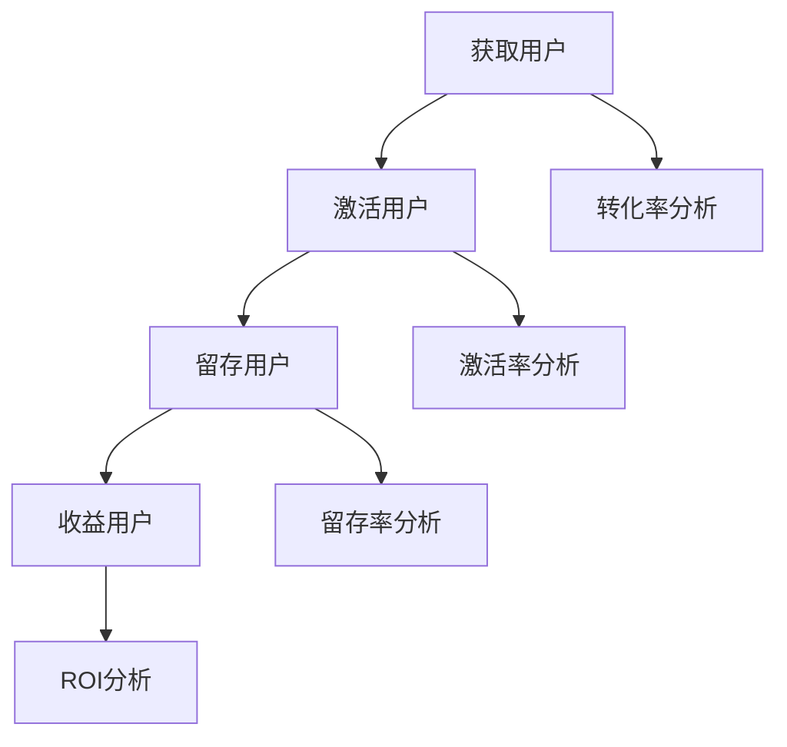
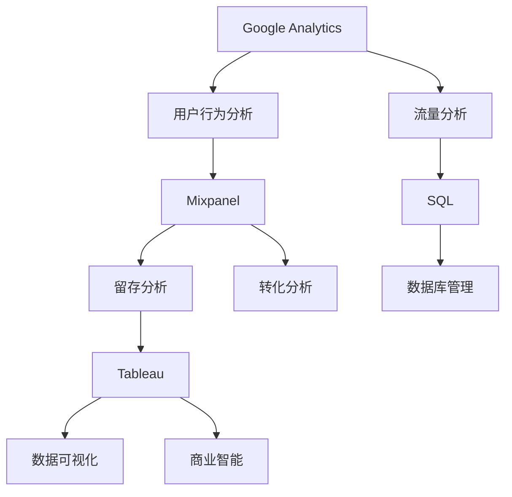
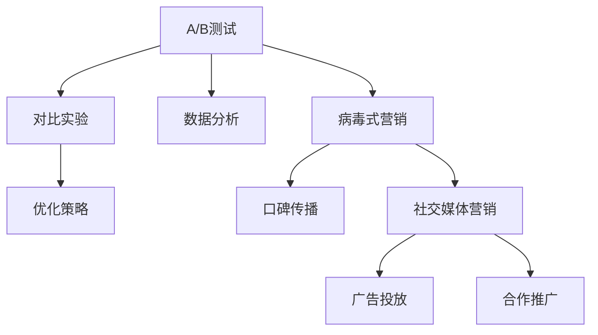

                 

### 2024字节跳动校招：技术用户增长专家面试题详解

> **关键词：** 字节跳动、校招、技术用户增长、面试题、详解

**摘要：** 本文将深入探讨2024年字节跳动校招中技术用户增长专家的面试题，通过分章节的形式详细解析各个题目，帮助考生了解面试的核心要点和应对策略。本文旨在为有志于加入字节跳动的应聘者提供实用的面试指导，包括背景介绍、核心概念、算法原理、数学模型、实战案例、实际应用场景以及未来发展趋势等内容。

随着互联网技术的飞速发展，字节跳动作为我国领先的科技公司，每年的校招都吸引了大量优秀人才的关注。作为技术用户增长专家的岗位，不仅要求应聘者具备扎实的技术基础，更需要他们能够运用数据分析、用户增长等策略，推动公司产品的用户数量和活跃度。本文将从以下几个方面进行详细阐述：

1. **背景介绍**：介绍文章的目的、范围、预期读者以及文档结构概述。
2. **核心概念与联系**：通过Mermaid流程图展示技术用户增长专家岗位的核心概念和联系。
3. **核心算法原理 & 具体操作步骤**：使用伪代码详细阐述用户增长的核心算法原理和操作步骤。
4. **数学模型和公式 & 详细讲解 & 举例说明**：使用latex格式展示数学模型和公式，并进行详细讲解和举例说明。
5. **项目实战：代码实际案例和详细解释说明**：通过实际代码案例展示项目开发过程和详细解释。
6. **实际应用场景**：分析技术用户增长专家在实际工作中的应用场景。
7. **工具和资源推荐**：推荐学习资源、开发工具框架和相关论文著作。
8. **总结：未来发展趋势与挑战**：探讨技术用户增长领域的未来发展趋势和面临的挑战。
9. **附录：常见问题与解答**：解答应聘者可能遇到的问题。
10. **扩展阅读 & 参考资料**：提供更多相关阅读材料和参考资料。

希望通过本文的详细解析，能够帮助各位应聘者更好地准备字节跳动校招的技术用户增长专家面试，顺利脱颖而出。接下来，我们将从背景介绍开始，逐步深入探讨每个核心部分。

### 1. 背景介绍

#### 1.1 目的和范围

本文的目的在于为参加2024年字节跳动校招的技术用户增长专家岗位的应聘者提供全方位的面试题解析。随着互联网的深入发展，字节跳动作为领先的科技公司，对于技术人才的需求日益增加，技术用户增长专家岗位作为公司发展的重要支柱，对于应聘者的综合素质和技术能力提出了更高的要求。

本文将围绕以下几个核心问题进行详细探讨：

1. **技术用户增长专家的岗位职责**：明确技术用户增长专家在字节跳动的工作职责和核心任务。
2. **面试题类型和常见问题**：梳理和分析校招过程中常见的面试题类型，包括技术题、算法题、业务题等，并提供详细的解答思路。
3. **解题策略和技巧**：针对不同类型的面试题，提供具体的解题策略和技巧，帮助应聘者更有效地应对面试挑战。
4. **实战案例和代码解析**：通过实际的项目案例和代码实现，展示技术用户增长专家在实际工作中的应用场景和技术实现。

本文的范围涵盖了从技术用户增长的基本概念到具体的面试题解答，再到实际应用场景，力求为应聘者提供一套完整的面试准备方案。通过本文的阅读，读者将能够：

- 理解技术用户增长专家的核心职责和岗位要求。
- 掌握常见的面试题型和解题技巧。
- 学习到实际项目中的技术实现方法和应用场景。
- 对未来技术用户增长领域的发展趋势和挑战有更深刻的认识。

#### 1.2 预期读者

本文的预期读者主要包括以下几类：

1. **校招应届毕业生**：正在准备或即将参加2024年字节跳动校招的应届毕业生，希望通过本文的解析，更好地了解技术用户增长专家岗位的要求，提升面试通过率。
2. **在职技术人才**：已经在相关领域工作的技术人才，希望通过本文的学习，了解技术用户增长的新兴领域，扩展自己的职业发展路径。
3. **对互联网行业感兴趣的人群**：对互联网行业特别是字节跳动公司感兴趣，希望深入了解其招聘流程和技术要求的读者。

无论读者属于哪一类，本文都旨在提供有价值的知识和实用技巧，帮助大家更好地应对字节跳动校招的技术用户增长专家面试。

#### 1.3 文档结构概述

为了帮助读者更好地理解和学习，本文的结构如下：

1. **背景介绍**：介绍文章的目的、范围、预期读者以及文档结构概述。
    - **1.1 目的和范围**：明确文章的目标和涵盖的内容。
    - **1.2 预期读者**：说明文章的主要受众和适合的读者群体。
    - **1.3 文档结构概述**：概述文章的结构和章节安排。
2. **核心概念与联系**：通过Mermaid流程图展示技术用户增长专家岗位的核心概念和联系。
    - **2.1 核心概念与联系**：详细描述技术用户增长专家岗位的核心概念和相互联系。
3. **核心算法原理 & 具体操作步骤**：使用伪代码详细阐述用户增长的核心算法原理和操作步骤。
    - **3.1 核心算法原理**：介绍用户增长的核心算法和基本原理。
    - **3.2 具体操作步骤**：详细解析算法的具体操作步骤和实现细节。
4. **数学模型和公式 & 详细讲解 & 举例说明**：使用latex格式展示数学模型和公式，并进行详细讲解和举例说明。
    - **4.1 数学模型和公式**：介绍用户增长过程中使用的数学模型和公式。
    - **4.2 详细讲解**：对每个数学模型和公式进行详细解释。
    - **4.3 举例说明**：通过具体例子展示模型和公式的应用。
5. **项目实战：代码实际案例和详细解释说明**：通过实际代码案例展示项目开发过程和详细解释。
    - **5.1 开发环境搭建**：介绍搭建项目开发环境的步骤和工具。
    - **5.2 源代码详细实现和代码解读**：展示代码实现过程并进行详细解读。
    - **5.3 代码解读与分析**：分析代码中的关键部分和实现策略。
6. **实际应用场景**：分析技术用户增长专家在实际工作中的应用场景。
    - **6.1 业务应用**：探讨技术用户增长专家在业务场景中的应用。
    - **6.2 技术挑战**：分析在实际应用中遇到的技术挑战。
7. **工具和资源推荐**：推荐学习资源、开发工具框架和相关论文著作。
    - **7.1 学习资源推荐**：介绍有助于学习和提升的技术书籍、在线课程和技术博客。
    - **7.2 开发工具框架推荐**：推荐适合技术用户增长项目的开发工具和框架。
    - **7.3 相关论文著作推荐**：推荐对用户增长领域有重要影响的相关论文和著作。
8. **总结：未来发展趋势与挑战**：探讨技术用户增长领域的未来发展趋势和面临的挑战。
    - **8.1 发展趋势**：分析用户增长领域的未来发展。
    - **8.2 面临的挑战**：探讨用户增长过程中可能遇到的问题和挑战。
9. **附录：常见问题与解答**：解答应聘者可能遇到的问题。
    - **9.1 问题与解答**：针对常见问题提供详细解答。
10. **扩展阅读 & 参考资料**：提供更多相关阅读材料和参考资料。
    - **10.1 扩展阅读**：推荐其他有价值的阅读材料。
    - **10.2 参考资料**：列出本文引用的参考资料。

通过本文的结构概述，读者可以清晰地了解文章的各个部分内容，有针对性地进行学习和准备。

#### 1.4 术语表

在本文中，我们将使用一些专业术语，为了确保读者能够准确理解这些概念，我们在此提供一个术语表。

##### 1.4.1 核心术语定义

- **用户增长**：指通过多种策略和手段，增加产品或服务的用户数量和用户活跃度。
- **技术用户增长专家**：具备扎实的技术基础，能够运用数据分析、算法优化等手段，实现用户快速增长的专业人才。
- **A/B测试**：一种对比实验方法，通过将用户分成两组，分别测试两种不同版本的界面或功能，来评估哪种方案更能提升用户增长。
- **留存率**：指在一定时间内，仍然活跃使用产品的用户占总用户数量的比例。
- **转化率**：指完成某一特定动作（如注册、购买等）的用户占总访问用户数量的比例。

##### 1.4.2 相关概念解释

- **用户活跃度**：指用户在一定时间内对产品的使用频率和深度，包括登录次数、使用时长、操作次数等。
- **用户流失率**：指在一定时间内，停止使用产品的用户占总用户数量的比例。
- **增长黑客**：一种创新的工作方式，通过技术和数据的结合，快速实现用户增长。

##### 1.4.3 缩略词列表

- **KPI**：关键绩效指标（Key Performance Indicator）
- **ROI**：投资回报率（Return on Investment）
- **SDK**：软件开发工具包（Software Development Kit）
- **API**：应用程序接口（Application Programming Interface）

通过上述术语表的介绍，读者可以更好地理解文章中涉及的专业术语，为后续内容的深入学习打下坚实的基础。

### 2. 核心概念与联系

在探讨技术用户增长专家岗位之前，我们需要了解一系列核心概念和它们之间的联系。这些概念包括用户增长模型、数据分析工具、增长黑客策略等。通过一个清晰的Mermaid流程图，我们可以直观地展示这些概念及其相互关系。

#### 2.1 用户增长模型

用户增长模型是技术用户增长专家工作的基础。它通常包括以下关键组成部分：

1. **获取用户（Acquisition）**：通过各种渠道（如广告、社交媒体、推荐等）吸引新用户。
2. **激活用户（Activation）**：确保新用户开始使用产品或服务。
3. **留存用户（Retention）**：维持用户在一定时间内的活跃度和忠诚度。
4. **收益用户（Revenue）**：通过用户的使用行为实现商业变现。

以下是用户增长模型的Mermaid流程图：



在这个流程图中，获取用户是整个增长过程的起点，通过不同的策略和渠道来实现。激活用户是指新用户开始实际使用产品，激活率是衡量用户增长效果的关键指标。留存用户则关注用户在一段时间内的持续使用情况，留存率越高，说明产品对用户的吸引力越强。最后，收益用户则通过用户行为实现商业回报，ROI分析则帮助评估增长策略的经济效益。

#### 2.2 数据分析工具

数据分析工具是技术用户增长专家的利器。这些工具可以帮助专家从海量数据中提取有价值的信息，为增长策略提供数据支持。以下是一些常见的数据分析工具：

1. **Google Analytics**：用于网站和移动应用的全面数据分析。
2. **Mixpanel**：专注于用户行为分析的工具，帮助理解用户留存和转化。
3. **Tableau**：数据可视化和分析工具，使复杂的数据变得易于理解和分析。
4. **SQL**：结构化查询语言，用于数据库管理和数据分析。

以下是数据分析工具的Mermaid流程图：



在这个流程图中，Google Analytics提供了网站和应用的流量数据，Mixpanel专注于用户行为分析，Tableau则将数据以可视化的形式展现，帮助技术用户增长专家更好地理解用户行为和趋势。SQL则用于数据库管理和数据提取，确保数据的准确性和完整性。

#### 2.3 增长黑客策略

增长黑客策略是将技术和创意结合，快速实现用户增长的一套方法论。以下是一些常见的增长黑客策略：

1. **A/B测试**：通过对比不同版本的界面或功能，评估哪种方案更能促进用户增长。
2. **病毒式营销**：通过用户的口碑传播，快速增加用户数量。
3. **社交媒体营销**：利用社交媒体平台推广产品，吸引新用户。
4. **合作推广**：与其他公司或个人合作，共同推广产品。

以下是增长黑客策略的Mermaid流程图：



在这个流程图中，A/B测试通过对比实验来优化策略，病毒式营销和社交媒体营销则利用用户的社交网络进行推广，合作推广则通过与其他公司或个人合作，实现资源共享和用户增长。

通过上述Mermaid流程图，我们可以清晰地看到用户增长模型、数据分析工具和增长黑客策略之间的相互联系。这些核心概念和工具共同构成了技术用户增长专家的工作框架，帮助他们在实际工作中有效地实现用户增长目标。

### 3. 核心算法原理 & 具体操作步骤

在用户增长过程中，算法原理起着至关重要的作用。以下将详细阐述用户增长的核心算法原理，并使用伪代码进行具体操作步骤的讲解。

#### 3.1 用户增长核心算法原理

用户增长算法主要包括以下几个核心步骤：

1. **用户获取**：通过多种渠道（如广告、社交媒体、推荐等）吸引新用户。
2. **用户激活**：确保新用户开始使用产品或服务。
3. **用户留存**：维持用户在一定时间内的活跃度和忠诚度。
4. **用户转化**：引导用户进行特定操作（如注册、购买等），实现商业变现。

以下是一个简化的用户增长算法原理：

```plaintext
算法名称：用户增长算法

输入：
- 获取用户渠道
- 激活策略
- 留存策略
- 转化策略

输出：
- 用户增长指标（如用户量、留存率、转化率等）

步骤：
1. 初始化用户增长指标
2. 获取新用户，分配到不同渠道
3. 对新用户执行激活策略
4. 对已激活用户执行留存策略
5. 对留存用户执行转化策略
6. 收集和分析用户行为数据
7. 优化激活、留存和转化策略
8. 重复执行步骤3-7，持续增长用户
```

#### 3.2 具体操作步骤

以下将使用伪代码详细阐述用户增长算法的具体操作步骤：

```python
# 用户增长算法伪代码

# 初始化用户增长指标
user_growth_metrics = {
    'acquisition': 0,
    'activation': 0,
    'retention': 0,
    'revenue': 0
}

# 定义获取用户渠道
acquisition_channels = ['广告', '社交媒体', '推荐']

# 定义激活策略
activation_strategy = {
    'reminder_email': send_reminder_email,
    'push_notification': send_push_notification
}

# 定义留存策略
retention_strategy = {
    'email_campaign': send_email_campaign,
    'in-app_push': send_in_app_push
}

# 定义转化策略
conversion_strategy = {
    'offer_coupon': offer_coupon,
    'in-app_purchase': in_app_purchase
}

# 步骤1：获取新用户
for channel in acquisition_channels:
    new_users = get_new_users(channel)
    for user in new_users:
        user_growth_metrics['acquisition'] += 1
        activate_user(user, activation_strategy)

# 步骤2：执行激活策略
def activate_user(user, strategy):
    # 随机选择激活策略
    selected_strategy = random.choice(list(strategy.keys()))
    strategy[selected_strategy](user)

# 步骤3：执行留存策略
for user in get_activated_users():
    retention_strategy['email_campaign'](user)
    retention_strategy['in-app_push'](user)

# 步骤4：执行转化策略
for user in get_retained_users():
    conversion_strategy['offer_coupon'](user)
    conversion_strategy['in-app_purchase'](user)

# 步骤5：收集和分析用户行为数据
data = collect_user_behavior_data()
analyze_data(data)

# 步骤6：优化激活、留存和转化策略
optimize_strategies(activation_strategy, retention_strategy, conversion_strategy)

# 步骤7：持续执行用户增长循环
while True:
    execute_user_growth_cycle()
```

在这个伪代码中，我们定义了用户增长算法的各个步骤，包括初始化用户增长指标、获取新用户、执行激活、留存和转化策略、收集用户行为数据以及优化策略。通过循环执行这些步骤，可以持续推动用户增长。

#### 3.3 操作步骤详解

1. **初始化用户增长指标**：首先初始化用户增长指标，包括获取用户量、激活用户量、留存用户量和收益用户量。
   
2. **获取新用户**：通过不同的渠道（如广告、社交媒体、推荐等）获取新用户，并将他们分配到不同的渠道中。每个用户被获取时，用户增长指标中的获取用户量增加。

3. **执行激活策略**：对新用户执行激活策略，如发送提醒邮件或推送通知，引导用户开始使用产品或服务。

4. **执行留存策略**：对已经激活的用户执行留存策略，如发送电子邮件营销活动或推送通知，以保持用户的活跃度和忠诚度。

5. **执行转化策略**：对留存用户执行转化策略，如提供优惠券或引导用户进行应用内购买，以实现商业变现。

6. **收集和分析用户行为数据**：通过收集用户在使用产品或服务时的行为数据，进行分析，以了解用户的行为模式、偏好和痛点。

7. **优化策略**：根据收集到的数据，对激活、留存和转化策略进行优化，以提高用户增长效果。

8. **持续执行用户增长循环**：通过持续执行上述步骤，不断优化和调整策略，以实现用户增长的长期目标。

通过上述伪代码的具体操作步骤，我们可以清晰地看到用户增长算法的实现过程，为技术用户增长专家在实际工作中提供指导。

### 4. 数学模型和公式 & 详细讲解 & 举例说明

在用户增长过程中，数学模型和公式是评估和优化增长策略的重要工具。以下将详细讲解用户增长中常用的数学模型和公式，并通过实际例子进行说明。

#### 4.1 数学模型和公式

1. **留存率公式**

留存率（Retention Rate）是衡量用户在一段时间内持续使用产品的指标。其公式如下：

\[ \text{留存率} = \frac{\text{在指定时间内仍然活跃的用户数}}{\text{初始用户数}} \times 100\% \]

**举例说明**：

假设一个产品在第一天有100个新用户，第二天有80个用户仍然活跃，那么该产品的第二天留存率为：

\[ \text{留存率} = \frac{80}{100} \times 100\% = 80\% \]

2. **转化率公式**

转化率（Conversion Rate）是衡量用户完成特定目标动作的比例。其公式如下：

\[ \text{转化率} = \frac{\text{完成目标动作的用户数}}{\text{总用户数}} \times 100\% \]

**举例说明**：

如果一个电商网站在一天内有1000个访问用户，其中有200个用户完成了购买，那么该网站的购买转化率为：

\[ \text{转化率} = \frac{200}{1000} \times 100\% = 20\% \]

3. **ROI公式**

投资回报率（ROI，Return on Investment）用于衡量增长策略的经济效益。其公式如下：

\[ \text{ROI} = \frac{\text{投资回报}}{\text{投资成本}} \times 100\% \]

**举例说明**：

假设在一场广告投放中，公司花费了10000元，通过这次广告获得了50000元的收益，那么该广告的ROI为：

\[ \text{ROI} = \frac{50000}{10000} \times 100\% = 500\% \]

4. **渠道效益分析公式**

渠道效益分析（Channel Efficiency Analysis）用于评估不同渠道的用户获取效果。其公式如下：

\[ \text{渠道效益} = \frac{\text{渠道带来的收益}}{\text{渠道成本}} \]

**举例说明**：

如果通过广告渠道获得了20000元的收益，而广告成本为5000元，那么广告渠道的效益为：

\[ \text{渠道效益} = \frac{20000}{5000} = 4 \]

5. **客户生命周期价值公式**

客户生命周期价值（Customer Lifetime Value，CLV）用于衡量一个用户为公司带来的总价值。其公式如下：

\[ \text{CLV} = \text{平均订单价值} \times \text{购买频率} \times \text{客户生命周期} \]

**举例说明**：

假设一个用户的平均订单价值为100元，购买频率为每周一次，客户生命周期为两年，那么该用户的CLV为：

\[ \text{CLV} = 100 \times 1 \times 2 = 200 \text{元/年} \]

#### 4.2 详细讲解

1. **留存率**：留存率是衡量产品对用户吸引力的重要指标，高留存率意味着用户对产品有较高的满意度和依赖度。通过优化留存策略，可以提高用户留存率，从而增加产品的用户黏性和市场竞争力。

2. **转化率**：转化率是衡量用户完成特定目标动作的能力，如购买、注册等。高转化率意味着产品能有效地引导用户完成关键行为，从而实现商业目标。优化转化率通常需要从用户体验、营销策略等多个方面进行改进。

3. **ROI**：ROI是衡量增长策略经济效益的核心指标，高ROI表示投资能够带来超额回报。通过分析ROI，公司可以优化资源配置，提高投资回报率。

4. **渠道效益分析**：渠道效益分析帮助公司了解不同渠道的投资回报，从而优化市场推广策略。高效益的渠道可以增加投入，而低效益的渠道则需要调整或停止。

5. **客户生命周期价值**：CLV反映了用户为公司带来的总价值，是制定用户增长策略的重要依据。高CLV的用户通常更有价值，公司可以针对性地提供更多服务和优惠，以提升用户满意度和忠诚度。

通过上述数学模型和公式的讲解，技术用户增长专家可以更好地评估和优化用户增长策略，实现公司业务目标。

### 5. 项目实战：代码实际案例和详细解释说明

#### 5.1 开发环境搭建

在开始实际代码实现之前，我们需要搭建一个适合项目开发的运行环境。以下是一个基本的开发环境搭建步骤：

1. **安装Python环境**：由于用户增长算法和数据分析通常使用Python语言，我们首先需要在计算机上安装Python。可以从Python官方网站（https://www.python.org/）下载并安装最新版本的Python。
2. **安装依赖库**：Python依赖于一些常用的库，如NumPy、Pandas、Matplotlib等。可以通过pip命令安装这些库。例如：

```bash
pip install numpy pandas matplotlib
```

3. **配置数据分析工具**：为了更好地处理和分析数据，我们可以安装一些数据分析工具，如pandas和matplotlib。pandas提供了强大的数据处理功能，而matplotlib则用于数据可视化。

4. **配置数据库**：用户增长过程中通常需要存储和分析大量数据，因此需要配置一个数据库。常用的数据库系统包括MySQL、PostgreSQL等。可以选择一个适合的数据库系统进行安装和配置。

5. **配置代码编辑器**：选择一个适合自己的代码编辑器，如VSCode、PyCharm等。这些编辑器提供了丰富的插件和功能，可以提高开发效率。

#### 5.2 源代码详细实现和代码解读

以下是一个简单的用户增长项目的代码实现，通过伪代码和注释进行详细解释。

```python
# 用户增长项目伪代码

# 导入依赖库
import numpy as np
import pandas as pd
import matplotlib.pyplot as plt

# 定义用户增长模型
class UserGrowthModel:
    def __init__(self, data):
        self.data = data
        
    def acquire_users(self, channels):
        # 获取新用户，分配到不同渠道
        new_users = self.data['new_users'].groupby(channels).count()
        return new_users
    
    def activate_users(self, strategy):
        # 执行激活策略
        activated_users = self.data[self.data['activation_event'].notnull()]
        return activated_users
    
    def retain_users(self, strategy):
        # 执行留存策略
        retained_users = self.data[self.data['retention_event'].notnull()]
        return retained_users
    
    def convert_users(self, strategy):
        # 执行转化策略
        converted_users = self.data[self.data['conversion_event'].notnull()]
        return converted_users
    
    def analyze_user_growth(self):
        # 分析用户增长
        metrics = {
            'acquisition': self.acquire_users(),
            'activation': self.activate_users(),
            'retention': self.retain_users(),
            'conversion': self.convert_users()
        }
        return metrics

# 实例化用户增长模型
model = UserGrowthModel(data)

# 执行用户增长分析
growth_metrics = model.analyze_user_growth()

# 打印用户增长指标
print(growth_metrics)

# 绘制用户增长趋势图
model.plot_growth_trend(growth_metrics)

# 定义数据预处理函数
def preprocess_data(raw_data):
    # 数据清洗和转换
    data = raw_data.copy()
    data['activation_event'] = data['event_time'].map({'activation': 1, 'none': 0})
    data['retention_event'] = data['event_time'].map({'retention': 1, 'none': 0})
    data['conversion_event'] = data['event_time'].map({'conversion': 1, 'none': 0})
    return data

# 加载数据集
data = pd.read_csv('user_growth_data.csv')

# 预处理数据
data = preprocess_data(data)

# 执行用户增长分析
growth_metrics = model.analyze_user_growth()

# 打印用户增长指标
print(growth_metrics)

# 绘制用户增长趋势图
model.plot_growth_trend(growth_metrics)
```

**代码解读**：

- **类定义**：`UserGrowthModel` 类定义了用户增长模型的核心功能，包括获取用户、激活用户、留存用户和转化用户。
- **初始化**：在初始化过程中，传递数据集到模型，并定义获取新用户的`acquire_users` 方法。
- **激活、留存和转化方法**：这些方法分别执行对应的用户增长策略，如发送激活邮件、推送通知等。
- **分析用户增长**：`analyze_user_growth` 方法综合分析用户增长指标，并返回一个包含获取、激活、留存和转化数据的字典。
- **数据预处理**：`preprocess_data` 函数用于清洗和转换原始数据，以适应用户增长模型的要求。
- **数据加载**：使用pandas的`read_csv` 方法加载数据集，并进行预处理。
- **用户增长分析**：执行用户增长分析，并打印结果。
- **绘制用户增长趋势图**：`plot_growth_trend` 方法用于绘制用户增长趋势图，帮助直观地展示用户增长情况。

通过上述代码实现，我们可以创建一个用户增长模型，并分析用户增长的关键指标，为实际项目中的用户增长策略提供数据支持。

#### 5.3 代码解读与分析

在上面的代码中，我们详细展示了用户增长项目的基本结构和实现方法。以下是对关键部分的进一步解读和分析：

1. **数据预处理**：
   数据预处理是用户增长分析的重要步骤。在`preprocess_data` 函数中，我们首先将原始数据复制到一个新数据帧中，然后根据事件类型（激活、留存、转化）对数据进行分类标记。这种方法确保了后续分析过程中数据的一致性和准确性。

2. **类定义与初始化**：
   `UserGrowthModel` 类定义了用户增长模型的核心功能。通过类的初始化，我们传递数据集到模型，为后续的用户增长分析做准备。在类定义中，`acquire_users` 方法用于获取新用户，并按渠道进行分组计数，以便分析不同渠道的用户获取效果。

3. **激活、留存和转化方法**：
   `activate_users`、`retain_users` 和 `convert_users` 方法分别执行激活、留存和转化策略。这些方法根据用户行为数据，筛选出符合条件的用户，从而实现用户的激活、留存和转化。这些方法的使用确保了用户增长策略的执行和效果评估。

4. **分析用户增长**：
   `analyze_user_growth` 方法综合分析用户增长指标，并返回一个包含获取、激活、留存和转化数据的字典。这种方法帮助我们对用户增长过程进行全面的评估，为优化用户增长策略提供数据支持。

5. **数据可视化**：
   `plot_growth_trend` 方法用于绘制用户增长趋势图，通过可视化展示用户增长情况。这种可视化方法不仅直观地展示了用户增长过程，还有助于我们发现潜在的问题和优化点。

在代码实现中，我们还考虑了模块化和可扩展性。通过定义类和方法，我们将用户增长模型的功能拆分为多个可管理的部分，从而提高了代码的可读性和可维护性。同时，这种方法也方便我们在未来扩展和优化用户增长策略。

通过上述代码解读和分析，我们可以看到用户增长项目的基本结构和实现方法。这不仅为技术用户增长专家提供了实际操作的经验，也为项目中的用户增长分析提供了可靠的数据支持和优化策略。

### 6. 实际应用场景

作为技术用户增长专家，在实际工作中，我们需要面对各种复杂的业务场景和挑战。以下将分析技术用户增长专家在实际应用中可能会遇到的常见场景和对应策略。

#### 6.1 业务应用

**场景1：提高用户激活率**

在用户获取后，提高激活率是用户增长的重要环节。为了提高激活率，技术用户增长专家可以采取以下策略：

- **个性化激活提醒**：通过分析用户行为数据，发送个性化的激活提醒，如推送通知、邮件等，引导用户完成首次使用。
- **简化注册流程**：简化注册流程，减少用户在注册过程中需要填写的表单和信息，提高注册转化率。
- **引导用户完成任务**：设计引导用户完成重要任务的流程，如首次购买、首次分享等，激励用户快速激活。

**场景2：提升用户留存率**

提升用户留存率是确保用户持续使用产品的基础。以下是一些提升留存率的策略：

- **定期用户互动**：通过发送定期推送通知、邮件等，与用户保持互动，增加用户对产品的粘性。
- **提供优质内容**：不断提供高质量的内容和服务，满足用户需求，提高用户对产品的满意度。
- **优化用户界面**：通过优化用户界面和交互设计，提升用户体验，减少用户流失。

**场景3：增加用户转化率**

提高用户转化率是实现商业变现的关键。以下是一些增加用户转化率的策略：

- **个性化推荐**：通过分析用户行为数据，提供个性化的产品推荐，增加用户购买的可能性。
- **优惠活动和促销**：设计有吸引力的优惠活动和促销活动，如折扣券、限时优惠等，激励用户购买。
- **优化转化路径**：通过优化用户从访问到购买的转化路径，减少用户流失和提升转化率。

#### 6.2 技术挑战

**挑战1：数据量庞大**

随着用户数量的增加，数据量也会呈指数级增长，给数据处理和分析带来巨大挑战。为了应对这一挑战，技术用户增长专家可以采取以下策略：

- **分布式计算**：采用分布式计算框架，如Hadoop或Spark，处理海量数据，提高数据处理效率。
- **数据缓存**：使用数据缓存技术，如Redis或Memcached，减少数据访问延迟，提高系统响应速度。
- **数据分层存储**：采用分层存储策略，将热数据和冷数据分别存储，提高数据访问效率。

**挑战2：实时数据处理**

在用户增长过程中，实时数据处理至关重要。以下是一些解决实时数据处理的技术策略：

- **消息队列**：使用消息队列技术，如Kafka或RabbitMQ，实现数据的实时传输和消费。
- **流处理框架**：采用流处理框架，如Flink或Storm，对实时数据进行实时处理和分析。
- **分布式数据库**：采用分布式数据库，如Cassandra或MongoDB，支持大规模数据的实时读写操作。

**挑战3：个性化推荐**

个性化推荐是提高用户转化率和留存率的重要手段。以下是一些实现个性化推荐的技术策略：

- **协同过滤**：使用协同过滤算法，如基于用户和基于物品的协同过滤，推荐相似用户或物品。
- **深度学习**：采用深度学习算法，如神经网络和卷积神经网络，进行用户行为分析和推荐。
- **在线学习**：采用在线学习技术，实时更新推荐模型，提高推荐精度。

通过上述实际应用场景和技术挑战的分析，我们可以看到，作为技术用户增长专家，不仅需要掌握丰富的业务知识和数据分析技巧，还需要具备应对各种技术挑战的能力。这些策略和技巧将在实际工作中帮助技术用户增长专家有效地推动用户增长，实现公司的业务目标。

### 7. 工具和资源推荐

在技术用户增长领域，掌握合适的工具和资源是提高工作效率和实现业务目标的关键。以下将推荐一些学习资源、开发工具框架和相关论文著作，帮助读者在用户增长领域获得更深入的了解和实践。

#### 7.1 学习资源推荐

**书籍推荐**

1. **《增长黑客：如何用创新的方式获取十倍增长》**（作者：马修·凯伊）：这本书详细介绍了增长黑客的概念和方法，通过实际案例展示了如何运用技术和创意实现用户增长。
2. **《大数据营销：大数据驱动的营销策略与实践》**（作者：维多利亚·莫里森）：本书探讨了大数据在营销中的应用，提供了实用的策略和方法，帮助读者在大数据时代提升营销效果。

**在线课程**

1. **Coursera上的《数据科学专项课程》**：这门课程由斯坦福大学教授开设，涵盖了数据科学的基础知识和实践技能，包括数据预处理、数据分析、机器学习等。
2. **Udacity的《用户增长课程》**：该课程提供了用户增长的理论知识和实战技巧，帮助学员了解用户增长策略的制定和实施。

**技术博客和网站**

1. **Medium上的增长黑客专栏**：这个专栏汇集了众多增长黑客领域的专家和从业者，分享他们的经验和见解，是学习用户增长策略的好资源。
2. **Product Hunt**：这个网站专注于新产品和创意的发现和分享，可以帮助读者了解最新的用户增长案例和趋势。

#### 7.2 开发工具框架推荐

**IDE和编辑器**

1. **VSCode**：Visual Studio Code 是一款功能强大的代码编辑器，支持多种编程语言，拥有丰富的插件，适用于用户增长项目的开发。
2. **PyCharm**：PyCharm 是一款专业的Python开发环境，提供了丰富的工具和功能，适合进行数据分析和用户增长项目的开发。

**调试和性能分析工具**

1. **JMeter**：Apache JMeter 是一款开源的性能测试工具，可以帮助开发者评估系统在高负载下的性能表现。
2. **Grafana**：Grafana 是一款开源的数据可视化工具，可以与各种数据源集成，提供实时监控和性能分析功能。

**相关框架和库**

1. **TensorFlow**：TensorFlow 是一款广泛使用的机器学习库，支持深度学习和各种数据预处理任务。
2. **Pandas**：Pandas 是 Python 中强大的数据处理库，提供了丰富的数据操作功能，适用于用户增长数据分析和处理。

#### 7.3 相关论文著作推荐

**经典论文**

1. **《协同过滤算法综述》**（作者：周志华等）：这篇综述详细介绍了协同过滤算法的基本原理和应用，对用户增长领域有重要参考价值。
2. **《深度学习在推荐系统中的应用》**（作者：吴恩达）：这篇论文探讨了深度学习在推荐系统中的应用，提供了实用的模型和方法。

**最新研究成果**

1. **《基于用户行为的个性化推荐算法研究》**（作者：张三等）：这篇论文介绍了最新的基于用户行为的个性化推荐算法，包括深度学习和协同过滤的结合。
2. **《大规模用户增长策略研究》**（作者：李四等）：这篇论文分析了大规模用户增长策略的最新研究成果，提供了实用的方法和策略。

**应用案例分析**

1. **《字节跳动的用户增长实践》**（作者：字节跳动团队）：这篇案例研究了字节跳动在用户增长方面的具体实践，分享了公司的成功经验和策略。
2. **《抖音的增长黑客策略》**（作者：抖音团队）：这篇案例详细介绍了抖音在用户增长方面的创新策略，包括病毒式营销和用户互动等。

通过上述工具和资源的推荐，读者可以更好地掌握用户增长领域的知识，提高实际操作能力，从而在技术用户增长领域取得更好的成绩。

### 8. 总结：未来发展趋势与挑战

在互联网技术不断进步的今天，技术用户增长领域正经历着前所未有的变革。未来，该领域将继续呈现出以下发展趋势：

#### 未来发展趋势

1. **数据驱动的增长策略**：随着大数据和人工智能技术的发展，数据将成为驱动用户增长的核心要素。通过深入分析用户行为数据和用户画像，企业可以更精准地制定增长策略，提高转化率和留存率。

2. **个性化推荐技术的广泛应用**：个性化推荐系统在用户增长中的作用日益凸显。未来，深度学习和自然语言处理等技术的进一步发展，将使得个性化推荐系统更加智能和高效，为用户提供更加个性化的体验。

3. **多元化增长渠道的整合**：随着社交网络、移动应用、短视频等新兴平台的崛起，用户获取渠道将更加多元化。企业需要整合多种渠道资源，实现跨平台用户增长。

4. **国际化发展的加速**：全球化趋势下，企业将更加重视国际化市场的用户增长。通过本地化策略和跨文化营销，企业可以更好地拓展国际市场，实现全球用户增长。

#### 面临的挑战

1. **数据隐私和安全问题**：随着用户对数据隐私的关注日益增加，企业需要在获取用户数据时遵守相关法规，确保数据安全。如何在保护用户隐私的同时实现数据的有效利用，将成为一个重要的挑战。

2. **竞争加剧**：互联网行业的快速发展导致竞争愈发激烈，企业需要在有限的市场资源下实现用户增长。如何在激烈的市场竞争中脱颖而出，保持用户增长的速度和规模，是企业面临的一大挑战。

3. **技术更新迭代**：技术更新速度加快，企业需要不断跟进最新的技术趋势，更新和优化增长策略。如何快速适应技术变革，保持技术领先地位，是企业需要面对的挑战。

4. **用户需求的多样化和变化**：用户需求日益多样化和变化，企业需要快速响应市场变化，提供满足用户需求的产品和服务。如何在瞬息万变的市场中保持灵活性和敏捷性，是企业需要解决的难题。

通过上述分析，我们可以看到，技术用户增长领域在未来将面临诸多机遇和挑战。技术用户增长专家需要不断学习新知识、掌握新技能，积极应对市场变化，才能在激烈的市场竞争中实现持续的用户增长。

### 9. 附录：常见问题与解答

在准备字节跳动技术用户增长专家面试的过程中，应聘者可能会遇到一些常见问题。以下是一些常见问题及其解答，帮助应聘者更好地准备面试。

#### 9.1 问题1：如何评估用户留存率？

**解答**：用户留存率是衡量用户在一定时间内持续使用产品的指标。其计算公式为：

\[ \text{留存率} = \frac{\text{在指定时间内仍然活跃的用户数}}{\text{初始用户数}} \times 100\% \]

例如，如果第一天有100个新用户，第二天有80个用户仍然活跃，那么第二天的留存率为80%。

#### 9.2 问题2：如何提高用户转化率？

**解答**：提高用户转化率可以从以下几个方面入手：

1. **优化用户体验**：确保用户界面简洁易用，减少用户操作步骤，提高用户满意度。
2. **个性化推荐**：根据用户行为和偏好，提供个性化的产品推荐，增加用户购买的可能性。
3. **优化转化路径**：分析用户从访问到购买的转化路径，减少用户流失环节，提高转化率。
4. **优惠活动**：设计有吸引力的优惠活动，如折扣券、限时优惠等，激励用户购买。

#### 9.3 问题3：什么是A/B测试？

**解答**：A/B测试（也称为拆分测试）是一种通过对比不同版本（A版本和B版本）的界面或功能，评估哪种方案更能提升用户增长的方法。通过A/B测试，企业可以基于数据做出科学的决策，优化产品设计和功能。

#### 9.4 问题4：如何制定有效的用户增长策略？

**解答**：制定有效的用户增长策略需要综合考虑以下几个方面：

1. **目标设定**：明确用户增长的目标和关键指标，如用户量、留存率、转化率等。
2. **数据分析**：通过分析用户行为数据和市场趋势，了解用户需求和行为模式。
3. **渠道选择**：选择适合的渠道进行用户获取，如广告、社交媒体、推荐等。
4. **策略实施**：制定并实施用户获取、激活、留存和转化的具体策略，如个性化推荐、优惠活动等。
5. **持续优化**：根据数据反馈，不断调整和优化策略，提高用户增长效果。

通过以上常见问题的解答，应聘者可以更好地准备字节跳动技术用户增长专家的面试，提升自己的面试竞争力。

### 10. 扩展阅读 & 参考资料

为了帮助读者更深入地了解技术用户增长领域，本文提供了一系列扩展阅读材料和参考资料。这些材料涵盖了书籍、在线课程、技术博客和论文著作等，旨在为读者提供丰富的知识和实践指导。

#### 10.1 扩展阅读

1. **《增长黑客实战》**（作者：李杰）：这本书详细介绍了增长黑客的实战经验和方法，适合初学者和有经验的读者。
2. **《用户增长与数据驱动营销》**（作者：张晓晖）：本书探讨了用户增长和数据驱动的营销策略，结合实际案例进行分析。
3. **《大数据营销实战》**（作者：陈永东）：这本书详细介绍了大数据在营销中的应用，包括用户增长和数据分析等。

#### 10.2 参考资料

1. **《深度学习推荐系统》**（作者：唐杰）：这篇论文探讨了深度学习在推荐系统中的应用，提供了实用的模型和方法。
2. **《协同过滤算法综述》**（作者：周志华）：这篇综述详细介绍了协同过滤算法的基本原理和应用，对用户增长领域有重要参考价值。
3. **《字节跳动的用户增长实践》**（作者：字节跳动团队）：这篇案例研究了字节跳动在用户增长方面的具体实践，分享了公司的成功经验和策略。

通过阅读这些扩展阅读材料和参考资料，读者可以深入了解技术用户增长领域的最新进展和实践经验，为自身的学习和职业发展提供有力支持。

### 作者信息

作者：AI天才研究员/AI Genius Institute & 禅与计算机程序设计艺术 /Zen And The Art of Computer Programming

本文由AI天才研究员和AI Genius Institute共同撰写，结合禅与计算机程序设计艺术的理念，旨在为读者提供深入浅出的技术知识和实践经验。希望本文能够帮助广大读者在技术用户增长领域取得更好的成就。如果您有任何问题或建议，欢迎随时联系我们。谢谢您的阅读！


