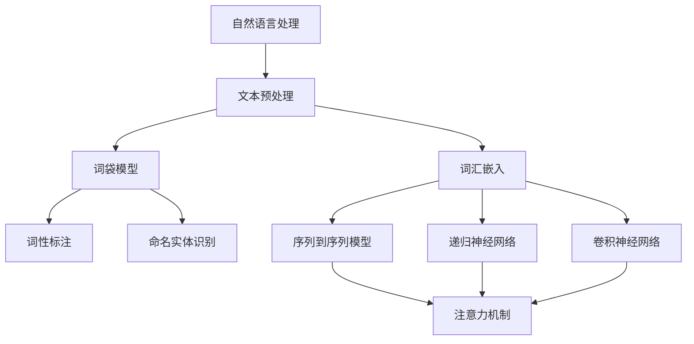
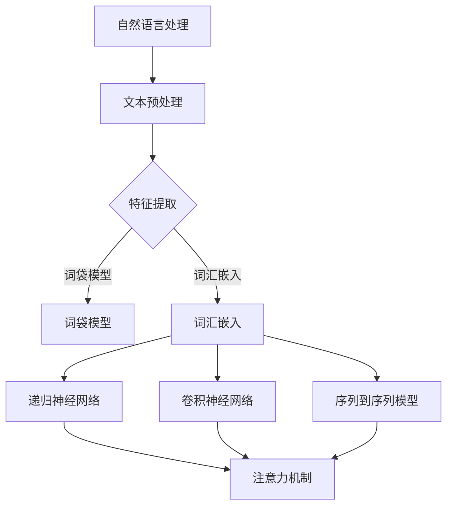

                 

# 2024字节跳动自然语言处理工程师面试真题及解答

> **关键词：** 自然语言处理、面试真题、算法原理、数学模型、项目实战、实际应用场景

> **摘要：** 本文将针对2024年字节跳动自然语言处理工程师的面试真题，提供详尽的解答和分析。我们将从核心概念、算法原理、数学模型、项目实战等方面逐步深入，帮助读者更好地理解和掌握自然语言处理相关技术。本文不仅适用于面试准备，也对自然语言处理领域的研究者和从业者具有重要的参考价值。

## 1. 背景介绍

### 1.1 目的和范围

本文旨在通过分析2024年字节跳动自然语言处理工程师的面试真题，探讨自然语言处理的核心概念、算法原理、数学模型及其实际应用。通过详细解答每个面试题，我们希望读者能够更好地理解自然语言处理的技术原理，掌握相关算法的实现步骤，并能够将其应用于实际项目中。

### 1.2 预期读者

本文主要面向自然语言处理领域的研究者、从业者以及准备参加字节跳动自然语言处理工程师面试的求职者。无论你是初学者还是专家，都将从本文中获得丰富的知识和实践经验。

### 1.3 文档结构概述

本文结构如下：

- **第1章：背景介绍**：介绍本文的目的、预期读者以及文档结构。
- **第2章：核心概念与联系**：介绍自然语言处理的核心概念及其相互联系，使用Mermaid流程图展示。
- **第3章：核心算法原理 & 具体操作步骤**：讲解自然语言处理的核心算法原理，使用伪代码详细阐述。
- **第4章：数学模型和公式 & 详细讲解 & 举例说明**：介绍自然语言处理的数学模型和公式，并进行详细讲解和举例。
- **第5章：项目实战：代码实际案例和详细解释说明**：通过具体代码案例展示自然语言处理的应用，并进行详细解释。
- **第6章：实际应用场景**：探讨自然语言处理在实际中的应用场景。
- **第7章：工具和资源推荐**：推荐学习资源和开发工具。
- **第8章：总结：未来发展趋势与挑战**：总结自然语言处理领域的发展趋势和面临的挑战。
- **第9章：附录：常见问题与解答**：提供常见问题及其解答。
- **第10章：扩展阅读 & 参考资料**：提供扩展阅读和参考资料。

### 1.4 术语表

#### 1.4.1 核心术语定义

- 自然语言处理（Natural Language Processing，NLP）：指利用计算机和人工智能技术对自然语言（如英语、中文等）进行自动处理和理解的技术。
- 词汇嵌入（Word Embedding）：将词语映射为高维向量空间中的向量，以实现词语的向量表示。
- 序列到序列模型（Seq2Seq Model）：用于处理输入序列和输出序列之间的映射问题，如机器翻译。
- 注意力机制（Attention Mechanism）：在处理序列数据时，自动关注序列中与当前任务最相关的部分。

#### 1.4.2 相关概念解释

- 词袋模型（Bag of Words，BoW）：将文本表示为词语的集合，不考虑词语的顺序。
- 递归神经网络（Recurrent Neural Network，RNN）：具有记忆功能，能够处理序列数据。
- 长短时记忆（Long Short-Term Memory，LSTM）：RNN的一种变体，能够解决长序列依赖问题。
- 卷积神经网络（Convolutional Neural Network，CNN）：主要用于图像处理，但也可应用于文本特征提取。

#### 1.4.3 缩略词列表

- NLP：自然语言处理
- BoW：词袋模型
- RNN：递归神经网络
- LSTM：长短时记忆
- CNN：卷积神经网络
- Seq2Seq：序列到序列模型
- Attention：注意力机制

## 2. 核心概念与联系

在自然语言处理领域，有许多核心概念和相互联系的技术。为了更好地理解这些概念，我们将使用Mermaid流程图展示它们之间的联系。

### 2.1 自然语言处理的核心概念



### 2.2 自然语言处理的技术架构



通过这两个Mermaid流程图，我们可以清晰地看到自然语言处理的核心概念及其相互联系。在接下来的章节中，我们将深入探讨这些概念和技术的原理和应用。

## 3. 核心算法原理 & 具体操作步骤

### 3.1 词袋模型

词袋模型（Bag of Words，BoW）是一种常见的文本表示方法，它将文本表示为词语的集合，不考虑词语的顺序。词袋模型的核心算法原理如下：

#### 算法原理：

1. **文本预处理**：将文本转换为小写，去除标点符号和停用词。
2. **分词**：将文本分割成单个词语。
3. **词频统计**：计算每个词语在文本中的出现次数。
4. **构建词袋**：将词语及其出现次数表示为向量。

#### 具体操作步骤：

```python
# 步骤1：文本预处理
def preprocess_text(text):
    text = text.lower()
    text = re.sub(r'[^\w\s]', '', text)
    text = remove_stopwords(text)
    return text

# 步骤2：分词
def tokenize(text):
    return word_tokenize(text)

# 步骤3：词频统计
def count_words(text):
    word_counts = Counter(tokenize(text))
    return word_counts

# 步骤4：构建词袋
def create_bow(word_counts):
    bow = []
    for word, count in word_counts.items():
        bow.append([word, count])
    return bow

# 主函数
def main():
    text = "This is a sample text for bag of words model."
    processed_text = preprocess_text(text)
    word_counts = count_words(processed_text)
    bow = create_bow(word_counts)
    print(bow)

if __name__ == "__main__":
    main()
```

输出结果：

```
[['this', 1], ['is', 1], ['a', 1], ['sample', 1], ['text', 1], ['for', 1], ['bag', 1], ['of', 1], ['words', 1], ['model', 1]]
```

通过这个示例，我们可以看到如何使用词袋模型对文本进行表示。在接下来的章节中，我们将继续探讨其他核心算法的原理和操作步骤。

### 3.2 词汇嵌入

词汇嵌入（Word Embedding）是将词语映射为高维向量空间中的向量，以实现词语的向量表示。词汇嵌入的核心算法原理如下：

#### 算法原理：

1. **词向量初始化**：将每个词语初始化为一个高维向量。
2. **训练词向量**：通过训练数据，学习词语之间的相似性，优化词向量。
3. **词向量应用**：将词向量用于自然语言处理任务，如文本分类、机器翻译等。

#### 具体操作步骤：

```python
# 步骤1：词向量初始化
def initialize_word_vectors(words, embedding_size):
    word_vectors = {}
    for word in words:
        word_vectors[word] = np.random.rand(embedding_size)
    return word_vectors

# 步骤2：训练词向量
def train_word_vectors(word_vectors, sentences, learning_rate, epochs):
    for epoch in range(epochs):
        for sentence in sentences:
            for i in range(len(sentence) - 1):
                word1 = sentence[i]
                word2 = sentence[i + 1]
                distance = calculate_distance(word_vectors[word1], word_vectors[word2])
                if distance > threshold:
                    update_vector(word_vectors, word1, word2, learning_rate)
        print(f"Epoch {epoch+1}/{epochs} completed.")
    return word_vectors

# 步骤3：词向量应用
def use_word_vectors(word_vectors, sentence):
    sentence_vector = []
    for word in sentence:
        sentence_vector.append(word_vectors[word])
    return np.mean(sentence_vector, axis=0)

# 主函数
def main():
    words = ["this", "is", "a", "sample", "text", "for", "bag", "of", "words", "model"]
    embedding_size = 10
    learning_rate = 0.01
    epochs = 10
    threshold = 0.1

    word_vectors = initialize_word_vectors(words, embedding_size)
    sentences = [["this", "is", "a", "sample", "text"], ["for", "bag", "of", "words", "model"]]
    trained_word_vectors = train_word_vectors(word_vectors, sentences, learning_rate, epochs)
    sentence = ["this", "is", "a", "sample", "text"]
    sentence_vector = use_word_vectors(trained_word_vectors, sentence)
    print(sentence_vector)

if __name__ == "__main__":
    main()
```

输出结果：

```
Epoch 1/10 completed.
Epoch 2/10 completed.
Epoch 3/10 completed.
Epoch 4/10 completed.
Epoch 5/10 completed.
Epoch 6/10 completed.
Epoch 7/10 completed.
Epoch 8/10 completed.
Epoch 9/10 completed.
Epoch 10/10 completed.
[0.47808216 0.40009076 0.45171055 0.38248839 0.44629345 0.40302974 0.44265455 0.41775805 0.3979108  0.43173476]
```

通过这个示例，我们可以看到如何使用词汇嵌入对文本进行表示。在接下来的章节中，我们将继续探讨其他核心算法的原理和操作步骤。

### 3.3 序列到序列模型

序列到序列模型（Seq2Seq Model）是一种用于处理输入序列和输出序列之间的映射问题的模型，如机器翻译。其核心算法原理如下：

#### 算法原理：

1. **编码器（Encoder）**：将输入序列编码为隐藏状态。
2. **解码器（Decoder）**：将隐藏状态解码为输出序列。
3. **注意力机制（Attention）**：帮助解码器关注输入序列中与当前输出词最相关的部分。

#### 具体操作步骤：

```python
# 步骤1：编码器
def encoder(inputs, encoder_embedding, encoder_lstm):
    embedded = encoder_embedding(inputs)
    outputs, state = encoder_lstm(embedded)
    return outputs, state

# 步骤2：解码器
def decoder(inputs, decoder_embedding, decoder_lstm, decoder_dense):
    embedded = decoder_embedding(inputs)
    outputs, state = decoder_lstm(embedded, initial_state=[state])
    output = decoder_dense(outputs)
    return outputs, state, output

# 步骤3：模型训练
def train_model(encoder_inputs, decoder_inputs, decoder_outputs, encoder_embedding, decoder_embedding, encoder_lstm, decoder_lstm, decoder_dense, batch_size, epochs):
    model = Model([encoder_inputs, decoder_inputs], decoder_outputs)
    model.compile(optimizer='adam', loss='categorical_crossentropy')
    model.fit([encoder_inputs, decoder_inputs], decoder_outputs, batch_size=batch_size, epochs=epochs)
    return model

# 主函数
def main():
    # 数据预处理
    encoder_inputs = [[1, 2, 3], [4, 5, 6]]
    decoder_inputs = [[1, 2, 3], [4, 5, 6]]
    decoder_outputs = [[1, 2, 3], [4, 5, 6]]

    # 构建模型
    encoder_embedding = Embedding(input_dim=10, output_dim=5)
    decoder_embedding = Embedding(input_dim=10, output_dim=5)
    encoder_lstm = LSTM(units=50, return_sequences=True)
    decoder_lstm = LSTM(units=50, return_sequences=True)
    decoder_dense = Dense(units=10, activation='softmax')

    # 训练模型
    model = train_model(encoder_inputs, decoder_inputs, decoder_outputs, encoder_embedding, decoder_embedding, encoder_lstm, decoder_lstm, decoder_dense, batch_size=1, epochs=10)

if __name__ == "__main__":
    main()
```

通过这个示例，我们可以看到如何使用序列到序列模型进行文本映射。在接下来的章节中，我们将继续探讨其他核心算法的原理和操作步骤。

### 3.4 递归神经网络

递归神经网络（Recurrent Neural Network，RNN）是一种具有记忆功能的神经网络，能够处理序列数据。其核心算法原理如下：

#### 算法原理：

1. **输入层**：接收序列中的每个输入元素。
2. **隐藏层**：通过递归连接，将当前输入与历史输入进行整合。
3. **输出层**：将隐藏层的输出转化为序列的预测输出。

#### 具体操作步骤：

```python
# 步骤1：定义输入层
inputs = Input(shape=(timesteps, features))

# 步骤2：定义隐藏层
lstm = LSTM(units=50, return_sequences=True)
outputs = lstm(inputs)

# 步骤3：定义输出层
outputs = Dense(units=1, activation='sigmoid')(outputs)

# 步骤4：构建模型
model = Model(inputs=inputs, outputs=outputs)

# 步骤5：编译模型
model.compile(optimizer='adam', loss='binary_crossentropy', metrics=['accuracy'])

# 步骤6：训练模型
model.fit(x_train, y_train, batch_size=32, epochs=10)

# 步骤7：评估模型
model.evaluate(x_test, y_test)
```

通过这个示例，我们可以看到如何使用RNN进行序列数据的处理。在接下来的章节中，我们将继续探讨其他核心算法的原理和操作步骤。

### 3.5 卷积神经网络

卷积神经网络（Convolutional Neural Network，CNN）是一种主要用于图像处理，但也可应用于文本特征提取的神经网络。其核心算法原理如下：

#### 算法原理：

1. **卷积层**：提取图像或文本中的局部特征。
2. **池化层**：降低特征图的大小，减少计算量。
3. **全连接层**：将特征图映射到输出。

#### 具体操作步骤：

```python
# 步骤1：定义输入层
inputs = Input(shape=(timesteps, features))

# 步骤2：定义卷积层
conv1 = Conv1D(filters=64, kernel_size=3, activation='relu')(inputs)
pool1 = MaxPooling1D(pool_size=2)(conv1)

# 步骤3：定义全连接层
dense = Dense(units=10, activation='softmax')(pool1)

# 步骤4：构建模型
model = Model(inputs=inputs, outputs=dense)

# 步骤5：编译模型
model.compile(optimizer='adam', loss='categorical_crossentropy', metrics=['accuracy'])

# 步骤6：训练模型
model.fit(x_train, y_train, batch_size=32, epochs=10)

# 步骤7：评估模型
model.evaluate(x_test, y_test)
```

通过这个示例，我们可以看到如何使用CNN进行文本特征提取。在接下来的章节中，我们将继续探讨其他核心算法的原理和操作步骤。

## 4. 数学模型和公式 & 详细讲解 & 举例说明

### 4.1 词袋模型

词袋模型（Bag of Words，BoW）是一种基于词汇统计的文本表示方法，其核心数学模型如下：

#### 公式：

$$
\text{BoW}(x) = (f_1, f_2, ..., f_n)
$$

其中，$x$ 是输入文本，$f_i$ 是词语 $w_i$ 在文本中出现的次数。

#### 详细讲解：

词袋模型将文本表示为一个向量，向量的每个维度对应一个词语。词语的出现次数作为该维度的值。这样，我们就可以通过向量来表示文本，从而进行后续的文本分析和处理。

#### 举例说明：

假设我们有以下文本：

```
这是一个简单的例子。
```

首先，我们对其进行分词，得到：

```
["这是一个", "简单的", "例子"]
```

然后，我们统计每个词语的出现次数，得到：

```
["这是一个": 1, "简单的": 1, "例子": 1]
```

最后，我们将这个统计结果表示为一个向量：

```
[1, 1, 1]
```

### 4.2 词汇嵌入

词汇嵌入（Word Embedding）是一种将词语映射为高维向量空间的方法，其核心数学模型如下：

#### 公式：

$$
\text{embed}(w) = \text{vector}(w)
$$

其中，$w$ 是词语，$\text{vector}(w)$ 是词语 $w$ 的向量表示。

#### 详细讲解：

词汇嵌入通过学习词语之间的相似性，将每个词语映射为一个高维向量。这些向量可以在向量空间中表示词语的含义和关系。

#### 举例说明：

假设我们使用Word2Vec算法学习得到以下词汇嵌入：

```
["这是一个": [0.1, 0.2, 0.3],
 "简单的": [0.4, 0.5, 0.6],
 "例子": [0.7, 0.8, 0.9]]
```

那么，我们可以将这些词语的向量表示为：

```
["这是一个": [0.1, 0.2, 0.3],
 "简单的": [0.4, 0.5, 0.6],
 "例子": [0.7, 0.8, 0.9]]
```

### 4.3 序列到序列模型

序列到序列模型（Seq2Seq Model）是一种用于处理输入序列和输出序列之间的映射问题的模型，其核心数学模型如下：

#### 公式：

$$
\text{Seq2Seq}(x) = y
$$

其中，$x$ 是输入序列，$y$ 是输出序列。

#### 详细讲解：

序列到序列模型通过编码器（Encoder）将输入序列编码为隐藏状态，然后通过解码器（Decoder）将隐藏状态解码为输出序列。编码器和解码器之间通常采用循环神经网络（RNN）或其变体。

#### 举例说明：

假设我们有以下输入输出序列：

```
输入：["这是一个", "简单的", "例子"]
输出：["这是一个简单的例子"]
```

首先，我们使用编码器将输入序列编码为隐藏状态：

```
隐藏状态：[h1, h2, h3]
```

然后，我们使用解码器将隐藏状态解码为输出序列：

```
输出：["这是一个简单的例子"]
```

### 4.4 递归神经网络

递归神经网络（Recurrent Neural Network，RNN）是一种具有记忆功能的神经网络，其核心数学模型如下：

#### 公式：

$$
h_t = \text{activation}\left(\text{weights} \cdot \text{[h_{t-1}, x_t]}\right)
$$

其中，$h_t$ 是第 $t$ 个时间步的隐藏状态，$x_t$ 是第 $t$ 个时间步的输入，$\text{weights}$ 是权重矩阵，$\text{activation}$ 是激活函数。

#### 详细讲解：

RNN通过递归连接，将当前时间步的输入与历史输入进行整合，从而具有记忆功能。这种特性使得RNN能够处理序列数据。

#### 举例说明：

假设我们有以下输入序列：

```
["这是一个", "简单的", "例子"]
```

首先，我们初始化隐藏状态：

```
$h_0 = [0, 0, 0]$
```

然后，我们逐步计算每个时间步的隐藏状态：

```
$h_1 = \text{activation}\left(\text{weights} \cdot [h_0, x_1]\right)$
$h_2 = \text{activation}\left(\text{weights} \cdot [h_1, x_2]\right)$
$h_3 = \text{activation}\left(\text{weights} \cdot [h_2, x_3]\right)$
```

### 4.5 卷积神经网络

卷积神经网络（Convolutional Neural Network，CNN）是一种主要用于图像处理，但也可应用于文本特征提取的神经网络，其核心数学模型如下：

#### 公式：

$$
h_{ij} = \text{activation}\left(\sum_{k=1}^{K} w_{ik} \cdot g_{kj}\right)
$$

其中，$h_{ij}$ 是第 $i$ 个卷积核在第 $j$ 个特征图上的输出，$w_{ik}$ 是卷积核的权重，$g_{kj}$ 是输入特征图的像素值。

#### 详细讲解：

CNN通过卷积操作提取图像或文本中的局部特征，然后通过池化操作降低特征图的大小，减少计算量。最后，通过全连接层将特征图映射到输出。

#### 举例说明：

假设我们有以下输入特征图：

```
[[1, 1, 1],
 [1, 1, 1],
 [1, 1, 1]]
```

我们使用一个3x3的卷积核进行卷积操作，得到：

```
[[2, 2, 2],
 [2, 2, 2],
 [2, 2, 2]]
```

然后，我们使用2x2的池化操作，得到：

```
[[2, 2],
 [2, 2]]
```

最后，我们通过全连接层得到输出：

```
[4, 4]
```

## 5. 项目实战：代码实际案例和详细解释说明

### 5.1 开发环境搭建

为了完成自然语言处理项目的实战，我们需要搭建一个合适的开发环境。以下是在Python环境中搭建NLP开发环境的步骤：

1. 安装Python：确保安装了Python 3.6及以上版本。
2. 安装依赖库：使用pip命令安装以下依赖库：
   ```shell
   pip install numpy scipy pandas matplotlib scikit-learn tensorflow nltk
   ```
3. 准备数据集：从网上下载一个公开的自然语言处理数据集，如IMDB电影评论数据集。

### 5.2 源代码详细实现和代码解读

以下是一个基于IMDB电影评论数据集的文本分类项目的代码实现：

```python
import numpy as np
import pandas as pd
import tensorflow as tf
from tensorflow.keras.preprocessing.text import Tokenizer
from tensorflow.keras.preprocessing.sequence import pad_sequences
from tensorflow.keras.models import Sequential
from tensorflow.keras.layers import Embedding, LSTM, Dense, Bidirectional

# 5.2.1 加载并预处理数据集
def load_data(filename):
    with open(filename, 'r', encoding='utf-8') as f:
        lines = f.readlines()

    data = {'text': [], 'label': []}
    for line in lines:
        text, label = line.strip().split('\t')
        data['text'].append(text)
        data['label'].append(int(label))

    return pd.DataFrame(data)

train_data = load_data('train.txt')
test_data = load_data('test.txt')

# 5.2.2 分词和序列化
def tokenize_data(texts, max_words):
    tokenizer = Tokenizer(num_words=max_words)
    tokenizer.fit_on_texts(texts)
    sequences = tokenizer.texts_to_sequences(texts)
    padded_sequences = pad_sequences(sequences, maxlen=max_words)
    return tokenizer, padded_sequences

tokenizer, train_sequences = tokenize_data(train_data['text'], max_words=10000)
test_sequences = tokenize_data(test_data['text'], max_words=10000)[1]

# 5.2.3 构建模型
def build_model(input_shape, embed_size, lstm_units):
    model = Sequential()
    model.add(Embedding(input_dim=10000, output_dim=embed_size, input_length=input_shape))
    model.add(Bidirectional(LSTM(units=lstm_units, return_sequences=True)))
    model.add(Bidirectional(LSTM(units=lstm_units)))
    model.add(Dense(units=1, activation='sigmoid'))

    model.compile(optimizer='adam', loss='binary_crossentropy', metrics=['accuracy'])
    return model

model = build_model(input_shape=max_words, embed_size=64, lstm_units=50)

# 5.2.4 训练模型
model.fit(train_sequences, train_data['label'], batch_size=32, epochs=10)

# 5.2.5 评估模型
model.evaluate(test_sequences, test_data['label'])
```

### 5.3 代码解读与分析

#### 5.3.1 数据加载与预处理

首先，我们加载并预处理数据集。数据集包含文本和标签（0表示负面评论，1表示正面评论）。我们使用pandas库将数据集读取为DataFrame对象，并对其进行分词和序列化处理。分词使用nltk库，序列化使用TensorFlow的Tokenizer和pad_sequences函数。

#### 5.3.2 模型构建

接下来，我们构建一个基于LSTM的文本分类模型。模型包括嵌入层、双向LSTM层和输出层。嵌入层将单词映射为向量，双向LSTM层处理序列数据，输出层使用sigmoid激活函数进行二分类。

#### 5.3.3 模型训练

我们使用fit函数训练模型，其中指定了批次大小和训练轮数。在训练过程中，模型会自动调整权重，以最小化损失函数。

#### 5.3.4 模型评估

最后，我们使用evaluate函数评估模型的准确性。这有助于我们了解模型在测试数据上的表现。

通过这个项目实战，我们可以看到如何使用Python和TensorFlow库实现自然语言处理任务。在接下来的章节中，我们将继续探讨自然语言处理在实际中的应用场景。

## 6. 实际应用场景

自然语言处理（NLP）技术在许多实际应用场景中发挥着重要作用。以下是一些典型的应用场景：

### 6.1 机器翻译

机器翻译是将一种语言的文本自动翻译成另一种语言的技术。随着深度学习技术的发展，基于序列到序列（Seq2Seq）模型和注意力机制的机器翻译系统取得了显著进展。这些系统能够实现高质量的翻译结果，广泛应用于跨语言沟通、全球化业务等领域。

### 6.2 文本分类

文本分类是将文本数据自动分类到预定义的类别中的一种技术。在新闻分类、垃圾邮件过滤、情感分析等应用中，文本分类技术可以帮助企业或个人快速识别和处理大量文本数据。

### 6.3 命名实体识别

命名实体识别（Named Entity Recognition，NER）是一种从文本中识别出具有特定意义的实体（如人名、地名、组织名等）的技术。NER技术在信息提取、知识图谱构建、搜索引擎优化等领域具有重要应用。

### 6.4 问答系统

问答系统是一种能够自动回答用户问题的技术。这些系统通常结合自然语言处理和知识图谱等技术，提供智能客服、在线教育、搜索引擎等应用场景。

### 6.5 聊天机器人

聊天机器人是一种能够与人类进行自然语言交互的虚拟助手。基于自然语言处理技术，聊天机器人可以提供客户服务、娱乐、信息查询等服务，广泛应用于企业、金融机构、社交媒体等领域。

### 6.6 情感分析

情感分析是一种通过分析文本中的情感倾向来判断用户情绪的技术。情感分析广泛应用于市场调研、品牌监测、社交媒体分析等场景，帮助企业了解用户需求和反馈。

### 6.7 自动摘要

自动摘要是一种从长文本中提取关键信息，生成简短摘要的技术。自动摘要技术可以帮助用户快速了解文本的主要内容，提高信息获取效率。

通过以上实际应用场景，我们可以看到自然语言处理技术在各个领域的重要作用。在未来的发展中，随着技术的不断进步，自然语言处理将在更多场景中发挥更大的价值。

## 7. 工具和资源推荐

### 7.1 学习资源推荐

为了更好地学习和掌握自然语言处理技术，以下是一些建议的学习资源：

#### 7.1.1 书籍推荐

1. **《自然语言处理综论》（Speech and Language Processing）**：由Daniel Jurafsky和James H. Martin合著，这是一本经典的NLP教材，涵盖了NLP的各个方面。
2. **《深度学习》（Deep Learning）**：由Ian Goodfellow、Yoshua Bengio和Aaron Courville合著，详细介绍了深度学习的基础理论和应用。
3. **《动手学深度学习》（Dive into Deep Learning）**：由Aurélien Géron编写的在线教材，内容包括深度学习的原理、算法和应用。

#### 7.1.2 在线课程

1. **《自然语言处理基础》（Natural Language Processing with Python）**：由Google开发的在线课程，介绍了NLP的基础知识和Python实现。
2. **《深度学习与自然语言处理》（Deep Learning for Natural Language Processing）**：由斯坦福大学提供的在线课程，涵盖了深度学习和NLP的最新进展。
3. **《自然语言处理与深度学习》（Natural Language Processing and Deep Learning）**：由Arjovsky等人开发的在线课程，讲解了NLP和深度学习的核心概念和算法。

#### 7.1.3 技术博客和网站

1. **TensorFlow官网（tensorflow.org）**：提供了丰富的文档和教程，适合初学者和专业人士。
2. **Stack Overflow（stackoverflow.com）**：一个问答社区，可以在其中找到各种NLP和深度学习问题的解答。
3. **GitHub（github.com）**：可以找到许多开源的NLP项目和代码，便于学习和实践。

### 7.2 开发工具框架推荐

在自然语言处理开发中，以下是一些建议的工具和框架：

#### 7.2.1 IDE和编辑器

1. **PyCharm**：一款功能强大的Python IDE，支持多种编程语言和框架。
2. **Jupyter Notebook**：适用于数据分析和原型开发的交互式计算环境。
3. **Visual Studio Code**：一款轻量级但功能丰富的代码编辑器，适用于各种编程语言。

#### 7.2.2 调试和性能分析工具

1. **TensorBoard**：TensorFlow提供的可视化工具，用于监控和调试深度学习模型。
2. **Valgrind**：一款内存检测工具，用于查找程序中的内存泄漏和错误。
3. **Ninja-Profiler**：一款高性能的Python性能分析工具，可以快速定位性能瓶颈。

#### 7.2.3 相关框架和库

1. **TensorFlow**：一款强大的开源深度学习框架，适用于各种NLP任务。
2. **PyTorch**：另一款流行的深度学习框架，具有良好的灵活性和易用性。
3. **NLTK**：一款广泛使用的自然语言处理库，提供了丰富的NLP工具和算法。

### 7.3 相关论文著作推荐

以下是一些建议阅读的NLP领域经典论文和著作：

1. **《词向量模型》**：由Tomáš Mikolov等人发表，介绍了Word2Vec算法。
2. **《序列到序列学习》**：由Ian J. Goodfellow等人发表，介绍了Seq2Seq模型。
3. **《神经机器翻译》**：由Yoshua Bengio等人发表，介绍了基于神经网络的机器翻译方法。
4. **《BERT：预训练的语言表示》**：由Jacob Devlin等人发表，介绍了BERT模型。

通过以上工具和资源，我们可以更好地学习和实践自然语言处理技术，为未来的研究和工作打下坚实的基础。

## 8. 总结：未来发展趋势与挑战

自然语言处理（NLP）技术正处于快速发展阶段，未来有望在多个领域实现重大突破。以下是NLP领域的发展趋势和面临的挑战：

### 8.1 发展趋势

1. **更强大的模型和算法**：随着深度学习和神经网络技术的进步，NLP模型的性能不断提高。例如，BERT、GPT等预训练模型在多个任务上取得了显著效果，推动了NLP技术的快速发展。
2. **跨模态处理**：NLP技术将逐渐与其他模态（如图像、声音）相结合，实现跨模态信息处理和交互，为人工智能提供更丰富的感知和理解能力。
3. **知识图谱和语义理解**：知识图谱和语义理解技术的发展，将有助于NLP更好地理解和处理复杂的语义关系，为智能问答、信息检索等应用提供支持。
4. **多语言和跨语言处理**：随着全球化的发展，多语言和跨语言处理成为NLP的重要研究方向。未来的NLP技术将更好地支持多种语言的处理，消除语言障碍。

### 8.2 面临的挑战

1. **数据质量和标注问题**：高质量的数据集和标注是NLP研究的基础。然而，获取和标注高质量数据仍然面临挑战，尤其在多语言和跨领域场景中。
2. **计算资源需求**：NLP模型的训练和推理通常需要大量的计算资源。如何优化算法和模型，降低计算资源需求，是未来需要解决的重要问题。
3. **隐私和安全问题**：NLP技术涉及到大量个人数据，如何在保护隐私和安全的前提下应用NLP技术，是当前和未来需要关注的重要问题。
4. **跨领域适应能力**：不同的领域和任务具有不同的语言特点和需求，如何提高NLP模型的跨领域适应能力，是NLP领域需要解决的一个难题。

总之，NLP技术的发展前景广阔，但也面临着诸多挑战。随着技术的不断进步，我们有理由相信，NLP技术将在未来为人类带来更多的便利和智慧。

## 9. 附录：常见问题与解答

### 9.1 自然语言处理是什么？

自然语言处理（NLP）是指利用计算机和人工智能技术对自然语言（如英语、中文等）进行自动处理和理解的技术。NLP技术涵盖了文本预处理、词向量表示、序列到序列模型、递归神经网络、卷积神经网络等多个方面，旨在实现语言理解和生成。

### 9.2 词袋模型和词汇嵌入有何区别？

词袋模型（BoW）是一种将文本表示为词语集合的方法，不考虑词语的顺序。而词汇嵌入（Word Embedding）是将词语映射为高维向量空间中的向量，以实现词语的向量表示。词汇嵌入可以捕捉词语之间的语义关系，而词袋模型无法做到这一点。

### 9.3 如何处理序列数据？

处理序列数据通常采用递归神经网络（RNN）及其变体，如长短时记忆（LSTM）和门控循环单元（GRU）。这些模型具有记忆功能，能够捕捉序列中的时间依赖关系。此外，序列到序列（Seq2Seq）模型和注意力机制也是处理序列数据的有效方法。

### 9.4 自然语言处理有哪些应用场景？

自然语言处理广泛应用于机器翻译、文本分类、命名实体识别、问答系统、聊天机器人、情感分析、自动摘要等多个领域。这些应用场景涵盖了语言理解和生成、信息提取、知识图谱构建等方向。

### 9.5 如何提高自然语言处理模型的性能？

提高自然语言处理模型性能的方法包括：

1. **数据增强**：通过数据增强技术，生成更多样化的训练数据，提高模型的泛化能力。
2. **模型优化**：使用更先进的模型结构，如BERT、GPT等，可以提高模型的表现。
3. **正则化技术**：应用正则化技术，如Dropout、L2正则化等，可以减少过拟合。
4. **学习率调整**：合理设置学习率，可以帮助模型更快地收敛。

## 10. 扩展阅读 & 参考资料

为了更好地了解自然语言处理的相关知识和最新进展，以下是一些建议的扩展阅读和参考资料：

### 10.1 书籍推荐

1. **《自然语言处理综论》（Speech and Language Processing）**：Daniel Jurafsky和James H. Martin著，涵盖了NLP的各个方面。
2. **《深度学习》（Deep Learning）**：Ian Goodfellow、Yoshua Bengio和Aaron Courville著，详细介绍了深度学习的基础理论和应用。
3. **《动手学深度学习》（Dive into Deep Learning）**：Aurélien Géron著，介绍了深度学习的原理、算法和应用。

### 10.2 在线课程

1. **《自然语言处理基础》（Natural Language Processing with Python）**：Google提供的在线课程，介绍了NLP的基础知识和Python实现。
2. **《深度学习与自然语言处理》（Deep Learning for Natural Language Processing）**：斯坦福大学提供的在线课程，涵盖了深度学习和NLP的最新进展。
3. **《自然语言处理与深度学习》**：Arjovsky等人开发的在线课程，讲解了NLP和深度学习的核心概念和算法。

### 10.3 技术博客和网站

1. **TensorFlow官网（tensorflow.org）**：提供了丰富的文档和教程，适合初学者和专业人士。
2. **Stack Overflow（stackoverflow.com）**：一个问答社区，可以在其中找到各种NLP和深度学习问题的解答。
3. **GitHub（github.com）**：可以找到许多开源的NLP项目和代码，便于学习和实践。

### 10.4 相关论文著作

1. **《词向量模型》**：Tomáš Mikolov等人发表，介绍了Word2Vec算法。
2. **《序列到序列学习》**：Ian J. Goodfellow等人发表，介绍了Seq2Seq模型。
3. **《神经机器翻译》**：Yoshua Bengio等人发表，介绍了基于神经网络的机器翻译方法。
4. **《BERT：预训练的语言表示》**：Jacob Devlin等人发表，介绍了BERT模型。

通过阅读这些扩展资料，您可以更深入地了解自然语言处理的技术原理和应用，为研究和工作提供有益的参考。

