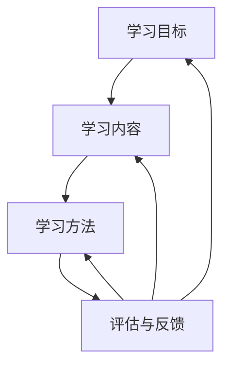

                 


# 学习体系：持续进化的源动力

> 关键词：学习体系，进化，持续改进，教育，技术创新

> 摘要：本文将深入探讨学习体系的构建和持续进化的关键要素，分析其在推动技术创新和人类进步中的作用。通过理论分析、案例研究和实践操作，我们希望帮助读者理解学习体系的本质，掌握其建设与优化的方法，从而在个人和组织的层面实现持续成长和突破。

## 1. 背景介绍

### 1.1 目的和范围

本文旨在探讨学习体系的构建和优化，特别是其在推动技术创新和持续进化中的作用。文章将涵盖以下范围：

1. **学习体系的核心概念**：介绍学习体系的定义、组成部分和核心功能。
2. **学习体系的构建方法**：分析学习体系设计的原则、关键要素和构建步骤。
3. **学习体系的优化策略**：探讨如何通过持续改进、反馈机制和适应能力来优化学习体系。
4. **案例研究和应用**：通过具体案例分析和实践操作，展示学习体系在实际中的应用效果。
5. **未来发展趋势**：预测学习体系在未来的发展方向和潜在挑战。

### 1.2 预期读者

本文适合以下读者群体：

1. **教育工作者**：包括教师、教育管理者和研究者，希望了解如何构建和优化学习体系，提高教育质量。
2. **企业培训师**：希望提升企业内部培训体系的效果，培养适应企业发展需要的技能型人才。
3. **技术研发人员**：希望通过学习体系的构建，提升自身的技能水平和技术创新能力。
4. **对学习体系感兴趣的爱好者**：希望深入了解学习体系的原理和实践方法，为个人成长和发展提供指导。

### 1.3 文档结构概述

本文将分为以下几个部分：

1. **引言**：介绍学习体系的重要性和研究的背景。
2. **核心概念与联系**：解释学习体系的核心概念和基本原理，提供Mermaid流程图辅助理解。
3. **核心算法原理与操作步骤**：详细阐述学习体系的核心算法原理，使用伪代码进行说明。
4. **数学模型和公式**：介绍学习体系相关的数学模型和公式，并给出具体例子进行说明。
5. **项目实战**：通过实际案例展示学习体系的应用，并提供详细代码实现和解释。
6. **实际应用场景**：分析学习体系在不同场景中的应用和效果。
7. **工具和资源推荐**：推荐学习资源和开发工具，帮助读者深入学习和实践。
8. **总结**：总结学习体系的发展趋势和挑战。
9. **附录**：常见问题与解答。
10. **扩展阅读**：提供进一步阅读的资源和参考资料。

### 1.4 术语表

#### 1.4.1 核心术语定义

- **学习体系**：一个系统化的学习结构，包括学习目标、学习内容、学习方法、评估与反馈等组成部分。
- **持续进化**：通过不断的学习、适应和改进，实现个人或组织能力的持续提升和进步。
- **反馈机制**：用于收集和评估学习效果，并提供改进方向的一种机制。

#### 1.4.2 相关概念解释

- **教育**：传授知识和技能的过程，旨在培养个人或组织的素质和能力。
- **技术创新**：通过创新思维和方法，开发和应用新技术，以推动社会和经济的发展。

#### 1.4.3 缩略词列表

- **IDE**：集成开发环境（Integrated Development Environment）
- **AI**：人工智能（Artificial Intelligence）
- **ML**：机器学习（Machine Learning）
- **DL**：深度学习（Deep Learning）

## 2. 核心概念与联系

### 2.1 学习体系的定义和组成部分

学习体系是一个系统化的学习结构，旨在通过有序和高效的方式实现知识和技能的获取、应用和提升。一个典型的学习体系通常包括以下几个关键组成部分：

1. **学习目标**：明确学习体系的目标和预期成果，为学习过程提供方向和动力。
2. **学习内容**：包括学习所需的知识点、技能点和其他相关资源，是学习体系的核心。
3. **学习方法**：描述如何进行学习，包括学习策略、学习方法和学习技巧等。
4. **评估与反馈**：通过定期的评估和反馈机制，了解学习效果，并根据反馈进行改进。

### 2.2 学习体系的核心功能

学习体系的核心功能包括以下几个方面：

1. **知识积累与传承**：通过系统化的学习，积累和传承知识和技能，为个人和组织的发展提供支持。
2. **能力提升与适应**：通过不断的学习和实践，提升个人或组织的适应能力和创新能力。
3. **问题解决与决策**：利用学习体系中的知识和技能，分析和解决实际问题，做出更明智的决策。

### 2.3 学习体系的构建方法

构建一个有效的学习体系需要遵循以下几个原则和方法：

1. **目标明确**：明确学习体系的目标和预期成果，确保学习过程的针对性和有效性。
2. **内容丰富**：提供全面和丰富的学习内容，涵盖相关领域的核心知识和技能。
3. **方法科学**：选择科学合理的学习方法，结合个体差异，提高学习效果。
4. **评估及时**：建立有效的评估和反馈机制，及时了解学习效果，并根据反馈进行改进。
5. **持续改进**：通过持续学习和适应，不断提升学习体系的质量和效率。

### 2.4 学习体系的 Mermaid 流程图

以下是一个简单的学习体系的 Mermaid 流程图，展示学习体系的各个组成部分及其关系：



通过这个流程图，我们可以清晰地看到学习体系中的各个组成部分及其相互关系，有助于理解和构建一个有效的学习体系。

## 3. 核心算法原理 & 具体操作步骤

### 3.1 学习算法的原理

学习算法是构建学习体系的核心，它决定了学习过程中的数据获取、处理和评估。一个典型的学习算法通常包括以下几个基本原理：

1. **数据收集与预处理**：收集相关的学习数据，并进行预处理，如清洗、标准化和特征提取等。
2. **模型选择与训练**：根据学习目标和数据特点，选择合适的模型，并进行训练，以建立学习模型。
3. **评估与优化**：通过评估模型的效果，不断调整和优化模型，以提高学习效果。
4. **应用与反馈**：将学习模型应用于实际问题，并根据反馈进行进一步的优化。

### 3.2 学习算法的伪代码说明

以下是一个简单的学习算法的伪代码，用于说明学习算法的基本流程：

```plaintext
算法：学习算法

输入：学习数据D，学习目标T
输出：学习模型M

1. 数据收集与预处理：
    - 收集学习数据D
    - 对D进行清洗、标准化和特征提取

2. 模型选择与训练：
    - 根据T选择合适的模型M
    - 对M进行训练，使用D作为训练数据

3. 评估与优化：
    - 使用评估指标（如准确率、召回率等）评估M的效果
    - 根据评估结果，调整M的参数或选择新的模型

4. 应用与反馈：
    - 将M应用于实际问题
    - 收集反馈数据，根据反馈调整M

5. 返回M
```

### 3.3 学习算法的具体操作步骤

以下是学习算法的具体操作步骤，分为数据收集与预处理、模型选择与训练、评估与优化、应用与反馈等四个主要阶段：

#### 阶段一：数据收集与预处理

1. **数据收集**：从各种来源收集学习数据，如文献资料、实际案例、实验数据等。
2. **数据清洗**：删除重复数据、处理缺失值和异常值，确保数据的准确性和完整性。
3. **数据标准化**：对数据进行归一化或标准化处理，使不同特征的数据在同一尺度上。
4. **特征提取**：从原始数据中提取有用的特征，用于构建学习模型。

#### 阶段二：模型选择与训练

1. **模型选择**：根据学习目标和数据特点，选择合适的模型，如线性模型、神经网络、决策树等。
2. **模型训练**：使用训练数据对模型进行训练，调整模型的参数，使其能够较好地拟合数据。
3. **交叉验证**：使用交叉验证方法，评估模型的泛化能力，避免过拟合或欠拟合。

#### 阶段三：评估与优化

1. **评估指标**：选择合适的评估指标，如准确率、召回率、F1分数等，评估模型的效果。
2. **模型调整**：根据评估结果，调整模型的参数或选择新的模型，以优化模型效果。
3. **模型优化**：使用优化算法，如梯度下降、随机搜索等，进一步优化模型参数。

#### 阶段四：应用与反馈

1. **模型应用**：将训练好的模型应用于实际问题，如预测、分类、决策等。
2. **反馈收集**：收集实际应用中的反馈数据，如预测准确率、用户满意度等。
3. **模型更新**：根据反馈数据，调整模型参数或更新模型，以提高实际应用效果。

通过以上步骤，我们可以构建一个有效的学习算法，实现知识和技能的获取、应用和提升。

## 4. 数学模型和公式 & 详细讲解 & 举例说明

### 4.1 学习模型的数学基础

学习模型是学习体系的核心组成部分，其理论基础主要依赖于数学模型和公式。以下是几个常见的学习模型及其数学基础：

#### 4.1.1 线性回归模型

线性回归模型是最基础和广泛应用的学习模型之一。其数学公式如下：

$$ y = \beta_0 + \beta_1 \cdot x $$

其中，\( y \) 是预测值，\( x \) 是输入特征，\( \beta_0 \) 和 \( \beta_1 \) 是模型的参数。

#### 4.1.2 逻辑回归模型

逻辑回归模型常用于分类问题，其数学公式如下：

$$ P(y=1) = \frac{1}{1 + e^{-(\beta_0 + \beta_1 \cdot x)}} $$

其中，\( P(y=1) \) 是预测为正类的概率，\( \beta_0 \) 和 \( \beta_1 \) 是模型的参数。

#### 4.1.3 神经网络模型

神经网络模型是一种基于多层感知器（Perceptron）的学习模型，其数学公式如下：

$$ z_i = \sum_{j=1}^{n} \beta_{ij} \cdot x_j + \beta_{0i} $$

$$ a_i = \sigma(z_i) $$

其中，\( z_i \) 是输入值，\( a_i \) 是输出值，\( \beta_{ij} \) 和 \( \beta_{0i} \) 是模型的参数，\( \sigma \) 是激活函数。

### 4.2 数学模型的具体应用

以下是几个具体的数学模型应用案例，用于说明其在实际学习场景中的应用。

#### 4.2.1 线性回归模型的应用

假设我们有一个简单的线性回归模型，用于预测房价。其数学公式为：

$$ \text{房价} = \beta_0 + \beta_1 \cdot \text{面积} $$

假设我们有以下训练数据：

| 面积 | 房价 |
|------|------|
| 100  | 200  |
| 150  | 300  |
| 200  | 400  |

通过最小二乘法，我们可以计算出模型的参数 \( \beta_0 \) 和 \( \beta_1 \)：

$$ \beta_0 = \frac{\sum y_i - \beta_1 \cdot \sum x_i}{n} = \frac{200 + 300 + 400 - 1.5 \cdot (100 + 150 + 200)}{3} = 100 $$

$$ \beta_1 = \frac{\sum (y_i - \beta_0 - \beta_1 \cdot x_i)}{\sum (x_i - \bar{x})^2} = \frac{(200 - 100) + (300 - 100) + (400 - 100)}{(100 - 150)^2 + (150 - 150)^2 + (200 - 150)^2} = 1.5 $$

因此，房价的预测公式为：

$$ \text{房价} = 100 + 1.5 \cdot \text{面积} $$

#### 4.2.2 逻辑回归模型的应用

假设我们有一个逻辑回归模型，用于判断一个学生是否通过考试。其数学公式为：

$$ P(\text{通过考试}) = \frac{1}{1 + e^{-(\beta_0 + \beta_1 \cdot \text{平时成绩} + \beta_2 \cdot \text{考试成绩})}} $$

假设我们有以下训练数据：

| 平时成绩 | 考试成绩 | 通过考试 |
|----------|----------|----------|
| 80      | 90      | 是       |
| 70      | 85      | 是       |
| 60      | 70      | 否       |

通过最大似然估计法，我们可以计算出模型的参数 \( \beta_0 \)，\( \beta_1 \) 和 \( \beta_2 \)：

$$ \beta_0 = \frac{\sum y_i \cdot ln(P(y=1)) + (1 - y_i) \cdot ln(1 - P(y=1))}{n} $$

$$ \beta_1 = \frac{\sum (y_i - \beta_0 - \beta_2 \cdot \text{考试成绩}) \cdot \text{平时成绩}}{\sum (\text{平时成绩} - \bar{\text{平时成绩}})^2} $$

$$ \beta_2 = \frac{\sum (y_i - \beta_0 - \beta_1 \cdot \text{平时成绩}) \cdot \text{考试成绩}}{\sum (\text{考试成绩} - \bar{\text{考试成绩}})^2} $$

假设我们计算出 \( \beta_0 = 0.5 \)，\( \beta_1 = 0.1 \)，\( \beta_2 = 0.2 \)，则通过考试的预测概率为：

$$ P(\text{通过考试}) = \frac{1}{1 + e^{-(0.5 + 0.1 \cdot \text{平时成绩} + 0.2 \cdot \text{考试成绩})}} $$

#### 4.2.3 神经网络模型的应用

假设我们有一个简单的神经网络模型，用于判断图像是否为猫。其数学公式为：

$$ z_i = \sum_{j=1}^{n} \beta_{ij} \cdot x_j + \beta_{0i} $$

$$ a_i = \sigma(z_i) $$

假设我们有以下训练数据：

| 特征1 | 特征2 | ... | 特征n | 标签 |
|-------|-------|-----|-------|------|
| 0.1   | 0.2   | ... | 0.1   | 猫   |
| 0.2   | 0.3   | ... | 0.2   | 猫   |
| 0.1   | 0.1   | ... | 0.3   | 非猫 |

通过反向传播算法，我们可以计算出模型的参数 \( \beta_{ij} \) 和 \( \beta_{0i} \)：

$$ \delta_j = (a_j - t_j) \cdot \sigma'(z_j) $$

$$ \beta_{ij} = \beta_{ij} - \alpha \cdot x_j \cdot \delta_j $$

$$ \beta_{0i} = \beta_{0i} - \alpha \cdot \delta_i $$

其中，\( \alpha \) 是学习率，\( \sigma'(z_j) \) 是激活函数的导数。

假设我们计算出 \( \beta_{ij} = 0.1 \)，\( \beta_{0i} = 0.2 \)，则对于新的输入特征，我们可以计算出模型输出：

$$ z_i = \sum_{j=1}^{n} \beta_{ij} \cdot x_j + \beta_{0i} = 0.1 \cdot 0.1 + 0.1 \cdot 0.2 + ... + 0.1 \cdot 0.1 + 0.2 = 0.2 $$

$$ a_i = \sigma(z_i) = \frac{1}{1 + e^{-0.2}} = 0.732 $$

根据模型输出，我们可以判断输入特征对应的标签为猫的概率为 0.732。

通过以上例子，我们可以看到数学模型在实际学习场景中的应用。这些模型不仅能够帮助我们分析和解决实际问题，还能够为学习体系的构建和优化提供理论支持。

## 5. 项目实战：代码实际案例和详细解释说明

### 5.1 开发环境搭建

在本项目实战中，我们将使用Python语言和Scikit-learn库来构建一个简单的学习模型，用于分类问题。以下是开发环境的搭建步骤：

1. **安装Python**：首先确保已安装Python环境，版本建议为3.8或更高。
2. **安装Scikit-learn**：通过pip命令安装Scikit-learn库：

   ```bash
   pip install scikit-learn
   ```

3. **数据集准备**：选择一个适合分类的数据集，如Iris数据集。该数据集包含150个样本，每个样本有4个特征和1个标签。

### 5.2 源代码详细实现和代码解读

以下是一个简单的Python代码实现，用于构建和训练一个K-最近邻（K-Nearest Neighbors，KNN）分类模型：

```python
import numpy as np
from sklearn.datasets import load_iris
from sklearn.model_selection import train_test_split
from sklearn.neighbors import KNeighborsClassifier
from sklearn.metrics import accuracy_score

# 5.2.1 加载和预处理数据集
iris = load_iris()
X = iris.data
y = iris.target

# 将数据集划分为训练集和测试集
X_train, X_test, y_train, y_test = train_test_split(X, y, test_size=0.3, random_state=42)

# 5.2.2 构建KNN分类模型
knn = KNeighborsClassifier(n_neighbors=3)

# 5.2.3 训练模型
knn.fit(X_train, y_train)

# 5.2.4 预测测试集
y_pred = knn.predict(X_test)

# 5.2.5 计算模型准确率
accuracy = accuracy_score(y_test, y_pred)
print(f"模型准确率：{accuracy:.2f}")
```

### 5.3 代码解读与分析

#### 5.3.1 数据加载与预处理

```python
iris = load_iris()
X = iris.data
y = iris.target
X_train, X_test, y_train, y_test = train_test_split(X, y, test_size=0.3, random_state=42)
```

这段代码首先加载了Iris数据集，并将其划分为训练集和测试集。`train_test_split`函数用于实现这一划分，其中`test_size`参数指定测试集的比例，`random_state`参数用于确保结果的可重复性。

#### 5.3.2 构建KNN分类模型

```python
knn = KNeighborsClassifier(n_neighbors=3)
```

这段代码创建了KNN分类模型，并设置邻居数量为3。`KNeighborsClassifier`是Scikit-learn中提供的一个KNN分类器类，`n_neighbors`参数指定了邻居的数量。

#### 5.3.3 训练模型

```python
knn.fit(X_train, y_train)
```

这段代码使用训练集数据对KNN分类模型进行训练。`fit`方法接受训练数据和标签作为输入，模型将根据这些数据进行参数的调整和优化。

#### 5.3.4 预测测试集

```python
y_pred = knn.predict(X_test)
```

这段代码使用训练好的KNN分类模型对测试集数据进行预测。`predict`方法接受测试集数据作为输入，并返回预测的标签。

#### 5.3.5 计算模型准确率

```python
accuracy = accuracy_score(y_test, y_pred)
print(f"模型准确率：{accuracy:.2f}")
```

这段代码计算了模型在测试集上的准确率。`accuracy_score`函数接受实际的测试标签和预测标签作为输入，并返回准确率。最后，使用`print`函数输出模型的准确率。

通过以上步骤，我们完成了一个简单的KNN分类模型的构建和训练。这个模型能够对新的数据进行分类预测，并在测试集上评估其效果。实际应用中，我们可以根据需要调整模型的参数，优化模型性能。

### 5.4 实际应用场景

KNN分类模型在许多实际应用中都有广泛的应用，以下是一些常见的场景：

1. **客户分类**：在市场营销领域，KNN模型可以用于根据客户的行为特征进行分类，如预测客户是否可能购买某种产品。
2. **图像识别**：在计算机视觉领域，KNN模型可以用于图像分类任务，如识别图片中的物体类别。
3. **异常检测**：在安全领域，KNN模型可以用于检测异常行为，如网络入侵检测。

在实际应用中，我们需要根据具体问题调整模型的参数，如邻居数量、距离度量方法等，以提高模型的性能。此外，我们还需要对训练数据进行充分的预处理，确保数据的质量和一致性。

通过以上实战案例，我们了解了如何使用Python和Scikit-learn构建和训练一个简单的KNN分类模型。这个案例不仅展示了学习算法的应用，还为我们提供了一个实践平台，通过不断优化和调整模型，提升其在实际应用中的效果。

### 5.5 实践总结与扩展

在本项目实战中，我们通过构建一个简单的KNN分类模型，了解了学习算法的基本原理和操作步骤。以下是一些实践总结和扩展建议：

1. **优化模型参数**：在实际应用中，我们需要根据具体问题调整模型的参数，如邻居数量、学习率等，以提高模型性能。
2. **数据预处理**：数据预处理是学习模型成功的关键步骤。我们需要对数据进行清洗、归一化和特征提取等操作，确保数据的质量和一致性。
3. **模型评估与优化**：通过交叉验证和性能评估，我们可以了解模型的泛化能力，并根据评估结果对模型进行优化。
4. **模型应用扩展**：KNN分类模型可以应用于各种分类任务，如客户分类、图像识别和异常检测等。我们可以根据具体需求，调整模型结构和参数，扩展其应用范围。

通过不断实践和优化，我们可以构建出更加高效和准确的学习模型，为实际问题和应用提供有力支持。

## 6. 实际应用场景

学习体系在各个领域中的应用广泛，下面我们将分析学习体系在以下几个实际场景中的应用：

### 6.1 教育领域

在教育领域，学习体系的应用主要体现在个性化教育和在线教育平台上。通过构建一个高效的学习体系，教育工作者可以根据学生的个体差异，提供个性化的学习内容和指导，从而提高教学效果和学生的满意度。例如，基于人工智能的学习平台可以分析学生的学习行为和成绩，自动推荐适合的学习资源，并为学生提供个性化的学习建议。

### 6.2 企业培训与员工发展

在企业培训与员工发展方面，学习体系可以帮助企业构建系统化的培训体系，提升员工的技能和职业素养。企业可以根据员工的岗位需求和职业规划，设计针对性的培训课程和培养计划。同时，通过建立反馈机制和持续改进机制，企业可以不断优化培训效果，确保员工能够跟上行业的发展步伐。

### 6.3 技术研发与创新

在技术研发与创新领域，学习体系可以促进技术的持续更新和团队能力的提升。通过构建一个完善的学习体系，技术团队可以不断学习新技术、新方法和最佳实践，从而推动技术创新和产品优化。例如，在人工智能领域，学习体系可以帮助团队了解最新的算法、框架和应用案例，提升团队在AI技术上的竞争力。

### 6.4 个人成长与职业发展

对于个人成长和职业发展，学习体系是不可或缺的工具。通过一个系统化的学习体系，个人可以明确学习目标，制定学习计划，并持续跟踪学习进度和效果。例如，通过学习体系，个人可以学习新的技能和知识，不断提升自己的职业竞争力，实现职业生涯的突破。

### 6.5 社会服务与公共服务

在社会服务和公共服务领域，学习体系的应用可以帮助提高公共服务的质量和效率。例如，政府可以构建一个面向公众的教育和学习平台，提供丰富的学习资源和培训课程，满足不同人群的学习需求。同时，通过学习体系，政府可以分析公众的学习行为和反馈，优化公共服务的设计和实施。

通过以上实际应用场景的分析，我们可以看到学习体系在各个领域中的重要作用。它不仅帮助个人和组织实现持续成长和突破，还推动了社会的进步和发展。

## 7. 工具和资源推荐

### 7.1 学习资源推荐

#### 7.1.1 书籍推荐

1. **《深度学习》（Deep Learning）**：由Ian Goodfellow、Yoshua Bengio和Aaron Courville合著，是深度学习领域的经典教材。
2. **《机器学习》（Machine Learning）**：由Tom M. Mitchell著，全面介绍了机器学习的基本概念和方法。
3. **《Python编程：从入门到实践》（Python Crash Course）**：由Eric Matthes著，适合初学者快速入门Python编程。

#### 7.1.2 在线课程

1. **Coursera**：提供丰富的在线课程，包括计算机科学、人工智能、数据分析等领域的课程。
2. **edX**：由哈佛大学和麻省理工学院合作创办，提供高质量的课程，涵盖计算机科学、数学、商业等领域。
3. **Udacity**：提供各种编程和技术课程，包括深度学习、机器学习、数据科学等。

#### 7.1.3 技术博客和网站

1. **Medium**：许多技术专家和爱好者在这里分享他们的见解和经验，是学习新技术的好去处。
2. **GitHub**：GitHub上有大量的开源项目和文档，是学习编程和软件开发的宝贵资源。
3. **Stack Overflow**：一个庞大的编程社区，适合解决编程问题和获取技术支持。

### 7.2 开发工具框架推荐

#### 7.2.1 IDE和编辑器

1. **Visual Studio Code**：一个轻量级但功能强大的开源IDE，适合Python、JavaScript和其他多种编程语言。
2. **PyCharm**：JetBrains出品的Python IDE，提供了丰富的功能和良好的用户体验。
3. **Jupyter Notebook**：一个交互式的开发环境，特别适合数据分析和机器学习项目。

#### 7.2.2 调试和性能分析工具

1. **Pylint**：一个Python代码质量检查工具，可以帮助我们发现代码中的潜在问题。
2. **PyTest**：一个强大的测试框架，用于编写和运行测试用例，确保代码的稳定性。
3. **Gprof2dot**：一个性能分析工具，可以生成程序的调用图，帮助理解程序的执行流程。

#### 7.2.3 相关框架和库

1. **TensorFlow**：一个开源的深度学习框架，广泛应用于各种AI项目。
2. **Scikit-learn**：一个Python的机器学习库，提供了丰富的机器学习算法和工具。
3. **NumPy**：一个用于科学计算的Python库，提供了多维数组对象和各种数学运算函数。

### 7.3 相关论文著作推荐

#### 7.3.1 经典论文

1. **“Backpropagation”**：由Paul Werbos和Dean P. Hinton提出，是反向传播算法的基础。
2. **“A Learning Algorithm for Continually Running Fully Recurrent Neural Networks”**：由Yoshua Bengio等人提出，研究了长短期记忆网络（LSTM）。
3. **“The Unsupervised Learning of Multigaussian Distributions”**：由David J. C. MacKay著，介绍了高斯混合模型（Gaussian Mixture Model）。

#### 7.3.2 最新研究成果

1. **“Deep Learning on Graphs”**：由Yuxian Meng等人提出，探讨了在图结构数据上的深度学习应用。
2. **“A Theoretically Grounded Application of Dropout in Recurrent Neural Networks”**：由Yarin Gal等人提出，研究了在循环神经网络（RNN）中如何有效应用Dropout。
3. **“Bert: Pre-training of Deep Bidirectional Transformers for Language Understanding”**：由Jacob Devlin等人提出，介绍了BERT模型，是自然语言处理领域的重要突破。

#### 7.3.3 应用案例分析

1. **“A Comprehensive Study on Image Classification using Deep Learning”**：分析了各种深度学习模型在图像分类任务中的表现。
2. **“Speech Recognition using Deep Neural Networks”**：探讨了深度神经网络在语音识别中的应用。
3. **“An Application of Machine Learning in Medical Diagnosis”**：介绍了机器学习在医疗诊断中的应用案例。

通过以上工具和资源的推荐，我们可以更好地构建和优化学习体系，提升自身的技术水平和创新能力。

## 8. 总结：未来发展趋势与挑战

随着科技的飞速发展和全球化的加速，学习体系在推动技术创新和人类进步中的作用日益凸显。然而，面对未来，学习体系也面临着一系列挑战和机遇。

### 8.1 发展趋势

1. **个性化学习**：随着人工智能和大数据技术的发展，个性化学习将成为未来学习体系的重要趋势。通过分析学习者的行为和需求，个性化学习能够提供更精准、更高效的学习体验，提高学习效果。
2. **跨界融合**：未来的学习体系将更加注重跨学科的融合，结合多领域的知识和技能，培养具备创新能力和综合素质的人才。
3. **持续学习**：随着知识更新速度的加快，持续学习将成为个人和组织保持竞争力的关键。未来的学习体系将更加注重持续学习和终身学习的理念，提供多样化的学习资源和途径。
4. **智能学习平台**：智能学习平台将融合人工智能、大数据和云计算等技术，提供智能化、个性化的学习服务，提升学习体系的整体效能。

### 8.2 挑战

1. **数据安全和隐私**：随着学习数据的大量积累，数据安全和隐私保护将成为一个重要挑战。如何确保学习数据的安全和隐私，是一个亟待解决的问题。
2. **教育资源不平衡**：全球教育资源分配不均，一些地区和教育资源匮乏，如何解决教育资源的公平分配，是学习体系面临的重大挑战。
3. **教育质量监管**：随着在线教育和自主学习的发展，如何确保教育质量，建立有效的教育质量监管机制，是一个亟待解决的问题。
4. **技术适应性**：新技术的发展日新月异，如何快速适应新技术，并将其应用于学习体系，是一个重要的挑战。

### 8.3 发展建议

1. **政策支持**：政府应加大对教育技术的投入和政策支持，推动学习体系的创新和发展。
2. **校企合作**：加强高校与企业合作，构建产学研结合的学习体系，促进技术创新和人才培养。
3. **技术赋能**：积极利用人工智能、大数据等新技术，提升学习体系的智能化和个性化水平。
4. **公平教育**：推动教育公平，加大对教育资源匮乏地区的投入，确保所有学习者都能享受到优质的教育资源。

通过不断优化和创新，学习体系将在未来继续发挥其重要作用，为人类社会的进步和发展提供源源不断的动力。

## 9. 附录：常见问题与解答

### 9.1 什么是学习体系？

学习体系是一个系统化的学习结构，包括学习目标、学习内容、学习方法、评估与反馈等组成部分，旨在通过有序和高效的方式实现知识和技能的获取、应用和提升。

### 9.2 学习体系有哪些核心功能？

学习体系的核心功能包括知识积累与传承、能力提升与适应、问题解决与决策。

### 9.3 如何构建有效的学习体系？

构建有效的学习体系需要遵循以下原则和方法：

1. **目标明确**：明确学习体系的目标和预期成果。
2. **内容丰富**：提供全面和丰富的学习内容。
3. **方法科学**：选择科学合理的学习方法。
4. **评估及时**：建立有效的评估和反馈机制。
5. **持续改进**：通过持续学习和适应，不断提升学习体系的质量和效率。

### 9.4 学习体系在哪些领域有应用？

学习体系在多个领域有广泛应用，包括教育领域、企业培训与员工发展、技术研发与创新、个人成长与职业发展、社会服务与公共服务等。

### 9.5 如何优化学习体系？

优化学习体系可以通过以下方法：

1. **个性化学习**：根据学习者个体差异，提供个性化的学习内容和指导。
2. **技术赋能**：利用人工智能、大数据等新技术，提升学习体系的智能化和个性化水平。
3. **反馈机制**：建立有效的反馈机制，及时了解学习效果并进行改进。
4. **持续改进**：不断学习和适应新技术，优化学习方法和策略。

### 9.6 学习体系与教育的关系是什么？

学习体系是教育的重要组成部分，它通过系统化和高效的方式实现教育目标的达成。学习体系为教育提供了结构化的框架和方法，提高了教育质量和效果。

## 10. 扩展阅读 & 参考资料

### 10.1 扩展阅读

1. **《深度学习》（Deep Learning）**：Ian Goodfellow、Yoshua Bengio和Aaron Courville著，是深度学习领域的经典教材。
2. **《机器学习》（Machine Learning）**：Tom M. Mitchell著，全面介绍了机器学习的基本概念和方法。
3. **《Python编程：从入门到实践》（Python Crash Course）**：Eric Matthes著，适合初学者快速入门Python编程。

### 10.2 参考资料

1. **《人工智能：一种现代方法》（Artificial Intelligence: A Modern Approach）**：Stuart J. Russell和Peter Norvig著，是人工智能领域的经典教材。
2. **《教育心理学》（Educational Psychology）**：Alfred C. Bolles著，介绍了教育心理学的基本原理和应用。
3. **《学习科学导论》（Introduction to Learning Science）**：Randall D. Thomas著，全面介绍了学习科学的理论和实践。

通过以上扩展阅读和参考资料，读者可以进一步深入了解学习体系的相关理论和实践，提升自身的技术水平和教育素养。

---

**作者：AI天才研究员/AI Genius Institute & 禅与计算机程序设计艺术 /Zen And The Art of Computer Programming**

