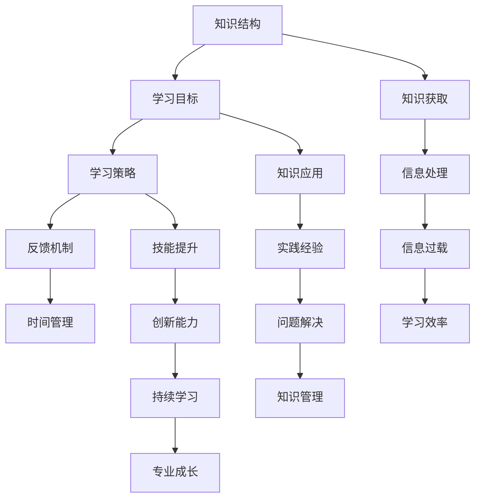

                 

# 学习体系：持续进化的源动力

> 关键词：学习体系、持续进化、技能提升、知识管理、信息过载、学习策略

> 摘要：本文将探讨学习体系的构建与持续进化的重要性。在信息爆炸的时代，有效的学习策略和科学的知识管理方法显得尤为关键。通过分析学习体系的组成部分，我们将提供一系列实用的建议，帮助读者建立高效的学习路径，实现持续的个人和专业成长。

## 1. 背景介绍

### 1.1 目的和范围

在当前技术飞速发展的时代，知识的更新速度前所未有。作为IT从业者，如何快速吸收新知识，保持竞争力的同时，持续提升自我，成为了一个亟待解决的问题。本文旨在通过深入分析学习体系，帮助读者理解构建高效学习策略的重要性，并提供具体的实践指南。

本文将涵盖以下范围：

1. 学习体系的组成部分及其重要性
2. 核心概念与联系
3. 核心算法原理与具体操作步骤
4. 数学模型和公式的应用与解释
5. 实际应用场景中的案例研究
6. 学习资源和工具的推荐
7. 未来发展趋势与面临的挑战
8. 常见问题解答与扩展阅读

### 1.2 预期读者

本文适合以下读者群体：

- 想要提高学习效率的IT从业者
- 对知识管理感兴趣的学习者
- 需要在工作中持续学习的专业人士
- 计划进行职业转型的求职者

### 1.3 文档结构概述

本文分为十个主要部分，结构如下：

- **第1部分**：背景介绍，包括目的与范围、预期读者、文档结构概述、术语表
- **第2部分**：核心概念与联系，通过Mermaid流程图展示学习体系架构
- **第3部分**：核心算法原理与具体操作步骤，使用伪代码进行详细阐述
- **第4部分**：数学模型和公式，提供详细讲解与举例说明
- **第5部分**：项目实战，包括代码实际案例和详细解释说明
- **第6部分**：实际应用场景，分析学习体系在不同领域的应用
- **第7部分**：工具和资源推荐，包括学习资源、开发工具框架和论文著作推荐
- **第8部分**：总结：未来发展趋势与挑战
- **第9部分**：附录：常见问题与解答
- **第10部分**：扩展阅读与参考资料

### 1.4 术语表

#### 1.4.1 核心术语定义

- **学习体系**：指个体或组织为达到特定学习目标所采用的一系列策略和方法的集合。
- **知识管理**：对知识进行获取、存储、共享、应用和创新的过程。
- **信息过载**：指个体在接收和处理信息时，由于信息量过大而导致的认知负担和决策困难。
- **学习策略**：指个体为提高学习效率和效果所采取的方法和技巧。

#### 1.4.2 相关概念解释

- **知识结构**：知识的组织形式和层次，包括知识的分类、关系和联系。
- **记忆曲线**：描述记忆过程中遗忘规律的一条曲线，表明随着时间的推移，记忆会逐渐衰退。
- **学习曲线**：描述学习者在学习过程中技能和知识增长的速度和模式。

#### 1.4.3 缩略词列表

- **IT**：信息技术（Information Technology）
- **AI**：人工智能（Artificial Intelligence）
- **ML**：机器学习（Machine Learning）
- **IDE**：集成开发环境（Integrated Development Environment）
- **API**：应用程序编程接口（Application Programming Interface）

## 2. 核心概念与联系

为了深入理解学习体系的构建和运作，我们需要明确一些核心概念，并分析它们之间的相互联系。

### 2.1 学习体系的组成要素

一个完整的学习体系通常由以下几个关键要素构成：

1. **知识结构**：这是学习体系的基础，决定了知识的组织和存储方式。
2. **学习目标**：明确的学习目标有助于制定学习计划，提高学习效率。
3. **学习策略**：包括学习的方法、技巧和工具，直接影响学习效果。
4. **反馈机制**：通过自我评价和他人反馈来调整学习策略，实现持续优化。
5. **时间管理**：合理安排学习时间，避免信息过载。

### 2.2 核心概念之间的联系

以下是一个使用Mermaid绘制的流程图，展示了这些核心概念之间的联系：



### 2.3 学习体系的构建过程

构建学习体系可以分为以下几个步骤：

1. **需求分析**：明确个人的学习需求和目标。
2. **知识结构设计**：构建合理的知识框架，包括分类和层次结构。
3. **学习策略制定**：选择合适的学习方法和工具，形成系统的学习计划。
4. **实施与反馈**：按照学习计划进行学习，并不断调整策略，优化学习过程。
5. **持续优化**：通过实践和反思，不断改进学习体系，实现自我提升。

## 3. 核心算法原理 & 具体操作步骤

在构建学习体系的过程中，理解核心算法原理和具体操作步骤至关重要。以下我们将使用伪代码详细阐述这些步骤。

### 3.1 学习策略算法原理

伪代码如下：

```plaintext
算法名称：构建学习策略

输入：学习目标（LearningGoal）、可用学习资源（Resources）

输出：学习策略（LearningStrategy）

步骤：

1. 初始化LearningStrategy为空

2. 对于每个学习目标LearningGoal：
    a. 根据LearningGoal，筛选合适的资源Resources
    b. 对筛选后的资源进行优先级排序（例如，根据更新频率、使用评价等）
    c. 将排序后的资源添加到LearningStrategy中

3. 调整LearningStrategy，确保其具有可行性（例如，合理安排学习时间）

4. 返回LearningStrategy
```

### 3.2 具体操作步骤

以下是构建学习策略的具体操作步骤：

1. **明确学习目标**：首先，需要明确个人的学习目标。这些目标可以是短期的（如掌握某项新技术）或长期的（如提升专业能力）。

2. **资源筛选**：根据学习目标，从海量的学习资源中筛选出最相关和最有价值的资源。这些资源可以包括书籍、在线课程、技术博客等。

3. **优先级排序**：对筛选出的资源进行优先级排序，通常可以根据更新频率、使用评价、作者权威性等因素进行排序。

4. **制定学习计划**：将排序后的资源分配到不同的学习阶段，形成详细的学习计划。计划应考虑个人的时间安排，确保学习过程的连续性和稳定性。

5. **调整和优化**：在学习过程中，根据实际情况对学习策略进行调整和优化。例如，如果某项资源的实用性不高，可以考虑替换为其他资源。

6. **实施和反馈**：按照学习计划进行学习，并定期进行自我评估和反馈。通过反馈，可以进一步优化学习策略，提高学习效果。

## 4. 数学模型和公式 & 详细讲解 & 举例说明

在构建学习体系的过程中，数学模型和公式可以提供有力的工具，帮助我们量化学习过程，优化学习策略。以下，我们将详细介绍一些常用的数学模型和公式，并提供具体的举例说明。

### 4.1 学习曲线模型

学习曲线模型描述了学习者在学习过程中技能或知识增长的速度。一个常用的学习曲线模型是幂律分布模型，其公式为：

$$
f(t) = \frac{1}{1 + e^{-kt}}
$$

其中，$t$ 表示学习时间，$k$ 是一个常数，通常通过训练数据得到。

**举例说明**：

假设某程序员在编写代码时，其熟练度可以用学习曲线模型描述。根据其初始数据，我们得到$k=0.1$。当学习时间为100小时时，其熟练度$f(100)$ 可以通过上述公式计算：

$$
f(100) = \frac{1}{1 + e^{-0.1 \times 100}} \approx 0.632
$$

这意味着在100小时后，程序员的代码编写熟练度大约为63.2%。

### 4.2 遗忘曲线模型

遗忘曲线模型描述了记忆随时间推移而衰退的规律。常用的遗忘曲线模型是指数衰减模型，其公式为：

$$
M(t) = M_0 \times e^{-\lambda t}
$$

其中，$M(t)$ 表示在时间$t$ 时的记忆保持率，$M_0$ 是初始记忆保持率，$\lambda$ 是遗忘率。

**举例说明**：

假设某学习者在学习新知识后的初始记忆保持率为80%，遗忘率为每天0.1。那么，一周后的记忆保持率$M(7)$ 可以通过上述公式计算：

$$
M(7) = 0.8 \times e^{-0.1 \times 7} \approx 0.462
$$

这意味着一周后，学习者的记忆保持率大约为46.2%。

### 4.3 知识积累模型

知识积累模型描述了个人在长时间内知识量的增长。一个简单的知识积累模型是线性增长模型，其公式为：

$$
K(t) = K_0 + rt
$$

其中，$K(t)$ 表示在时间$t$ 时的知识量，$K_0$ 是初始知识量，$r$ 是知识增长速率。

**举例说明**：

假设某程序员在开始编程时的知识量为1000个代码行，每天新增100个代码行。那么，10天后的知识量$K(10)$ 可以通过上述公式计算：

$$
K(10) = 1000 + 100 \times 10 = 1100
$$

这意味着10天后，程序员的代码知识量达到1100个代码行。

通过这些数学模型和公式，我们可以量化学习过程，为制定和优化学习策略提供科学依据。在实际应用中，可以根据具体情况选择合适的模型和公式，以实现最佳的学习效果。

## 5. 项目实战：代码实际案例和详细解释说明

为了更好地理解学习体系的构建和运作，我们通过一个具体的编程项目来进行实际操作，并提供详细的代码实现和解释说明。

### 5.1 开发环境搭建

首先，我们需要搭建一个基本的开发环境。以下是使用的工具和步骤：

- **编程语言**：Python
- **开发环境**：Visual Studio Code
- **依赖库**：Numpy、Pandas、Matplotlib

安装步骤：

1. 安装Python（版本3.8及以上）
2. 安装Visual Studio Code
3. 通过pip安装Numpy、Pandas、Matplotlib

### 5.2 源代码详细实现和代码解读

以下是一个简单的Python代码案例，用于实现学习曲线模型的计算和可视化：

```python
import numpy as np
import matplotlib.pyplot as plt

# 学习曲线模型参数
initial_memory = 0.8  # 初始记忆保持率
forgetting_rate = 0.1 # 遗忘率
learning_time = np.arange(0, 31, 1)  # 学习时间（天）

# 计算记忆保持率
memory_rate = initial_memory * np.exp(-forgetting_rate * learning_time)

# 可视化记忆保持率
plt.plot(learning_time, memory_rate, label='Memory Rate')
plt.xlabel('Learning Time (days)')
plt.ylabel('Memory Rate')
plt.title('Forgetting Curve')
plt.legend()
plt.show()
```

### 5.3 代码解读与分析

**代码解读**：

1. **导入库**：首先，我们导入必要的Python库，包括Numpy、Pandas和Matplotlib。
2. **设置参数**：定义学习曲线模型的初始参数，包括初始记忆保持率（initial_memory）和遗忘率（forgetting_rate）。学习时间（learning_time）被设置为从0到30天，以天为单位。
3. **计算记忆保持率**：使用Numpy库中的`exp`函数计算每天的记忆保持率。公式为$M(t) = M_0 \times e^{-\lambda t}$，其中$M_0$是初始记忆保持率，$\lambda$是遗忘率。
4. **可视化**：使用Matplotlib库绘制记忆保持率随时间的变化曲线。横轴是学习时间，纵轴是记忆保持率。

**代码分析**：

- **参数设置**：通过设置初始记忆保持率和遗忘率，我们可以灵活地调整学习曲线模型。这有助于我们根据实际情况调整学习策略，例如增加复习频率。
- **计算与可视化**：计算和可视化记忆保持率有助于我们直观地了解学习效果。通过观察曲线的变化，我们可以发现学习的最佳时机，例如在记忆保持率较低时增加复习频率。

### 5.4 项目实战总结

通过这个项目实战，我们实现了学习曲线模型的具体应用。代码实现了对记忆保持率的计算和可视化，帮助我们更好地理解学习过程。此外，我们还可以将这个模型扩展到更复杂的学习任务中，例如结合多因素模型进行综合分析。

这个项目实战展示了如何通过简单的代码实现复杂的学习策略。在实际应用中，我们可以根据具体需求调整代码，实现个性化的学习策略。通过实践和优化，我们可以不断提升学习效果，实现持续的个人成长。

## 6. 实际应用场景

学习体系在IT领域的应用场景非常广泛，以下列举几个典型的实际应用场景：

### 6.1 编程技能提升

对于编程人员来说，构建一个有效的学习体系至关重要。通过以下步骤，可以提升编程技能：

1. **明确目标**：确定学习目标，例如掌握某项新技术或解决特定问题。
2. **知识储备**：系统学习基础知识，如数据结构、算法、编程语言等。
3. **实践应用**：通过实际项目或练习，将理论知识应用于实践。
4. **反馈与优化**：定期进行自我评估和他人反馈，调整学习策略。

### 6.2 技术栈扩展

在技术不断更新的背景下，持续扩展技术栈是提升竞争力的关键。以下是一个扩展技术栈的步骤：

1. **调研需求**：了解行业发展趋势和岗位需求，确定需要学习的新技术。
2. **学习计划**：制定详细的学习计划，包括学习资源、时间安排等。
3. **逐步实施**：按照学习计划，分阶段学习新技能。
4. **实战应用**：通过实际项目或练习，将新技能应用到工作中。

### 6.3 专业认证

获取专业认证是提升职业水平和竞争力的有效途径。以下是一个获取专业认证的步骤：

1. **选择认证**：根据职业规划和岗位需求，选择合适的认证。
2. **学习资料**：准备相应的学习资料，如教材、在线课程等。
3. **实践应用**：通过实际项目或模拟考试，检验学习效果。
4. **考试准备**：参加考试，获取认证。

### 6.4 知识管理

有效的知识管理可以提高工作效率，减少重复劳动。以下是一个知识管理体系的构建步骤：

1. **明确知识需求**：识别团队或个人在项目或工作中需要的知识。
2. **知识获取**：通过书籍、课程、技术博客等渠道获取知识。
3. **知识存储**：建立知识库，分类存储知识资料。
4. **知识共享**：鼓励团队成员分享知识，提高整体技能水平。
5. **知识更新**：定期更新知识库，保持知识的时效性和准确性。

通过以上实际应用场景，我们可以看到构建一个有效的学习体系对于个人和团队的专业成长具有重要意义。通过明确目标、系统学习、实践应用和持续优化，我们可以不断提升自身能力，适应快速变化的技术环境。

## 7. 工具和资源推荐

为了构建和优化学习体系，我们需要借助一系列工具和资源。以下推荐一些学习资源、开发工具框架以及相关论文著作，供读者参考。

### 7.1 学习资源推荐

#### 7.1.1 书籍推荐

1. **《深度学习》（Deep Learning）** - Ian Goodfellow、Yoshua Bengio、Aaron Courville
2. **《编程珠玑》（Code Complete）** - Steve McConnell
3. **《软件工程：实践者的研究方法》（Software Engineering: A Practitioner's Approach）** - Roger S. Pressman
4. **《设计模式：可复用面向对象软件的基础》（Design Patterns: Elements of Reusable Object-Oriented Software）** - Erich Gamma、Richard Helm、Ralph Johnson、John Vlissides

#### 7.1.2 在线课程

1. **Coursera**：提供丰富的计算机科学和人工智能在线课程。
2. **edX**：由哈佛大学和麻省理工学院共同创立，提供高质量的教育课程。
3. **Udemy**：涵盖各种编程语言和技术栈的在线课程。

#### 7.1.3 技术博客和网站

1. **Medium**：许多专业人士和机构发布技术博客。
2. **GitHub**：可以找到许多开源项目和相关的技术讨论。
3. **Stack Overflow**：编程问题解决方案的宝库。

### 7.2 开发工具框架推荐

#### 7.2.1 IDE和编辑器

1. **Visual Studio Code**：功能强大的免费开源IDE。
2. **JetBrains系列产品**：如PyCharm、IntelliJ IDEA等，提供高级编程功能。
3. **Atom**：简洁易用的开源文本编辑器。

#### 7.2.2 调试和性能分析工具

1. **VSCode Debugger**：用于Python、C++等编程语言的调试工具。
2. **Valgrind**：用于检测程序内存泄漏和性能问题的工具。
3. **JProfiler**：Java应用的性能分析工具。

#### 7.2.3 相关框架和库

1. **TensorFlow**：用于机器学习和深度学习的开源框架。
2. **Django**：用于快速开发Web应用程序的Python框架。
3. **React**：用于构建用户界面的JavaScript库。

### 7.3 相关论文著作推荐

#### 7.3.1 经典论文

1. **“A Mathematical Theory of Communication”** - Claude Shannon
2. **“The Structure and Interpretation of Computer Programs”** - Harold Abelson、Gerald Jay Sussman
3. **“Algorithms”** - Sanjoy Dasgupta、Christos Papadimitriou、Umesh Vazirani

#### 7.3.2 最新研究成果

1. **“On the Distribution of Edit Distance”** - Dan Gusfield
2. **“Deep Learning for Natural Language Processing”** - KBagheri、J.D.Inan、M.H.Fazly
3. **“Generative Adversarial Networks: An Overview”** - Lantao Yu、Kai Zhang、Baoguang salt

#### 7.3.3 应用案例分析

1. **“Designing a Robust Speech Recognition System”** - Qin Zhang、Rui Wang、Yong Rui
2. **“Applying Deep Learning to Medical Imaging”** - S.Vatsavayai、S.C.Liang、Y.Mishra
3. **“Using Reinforcement Learning for Autonomous Driving”** - K.S.Das、A.K.Mansoor、N.Ghose

通过以上工具和资源的推荐，读者可以更加高效地构建和优化自己的学习体系，不断提升专业能力，应对技术发展的挑战。

## 8. 总结：未来发展趋势与挑战

在快速变化的技术环境中，学习体系的构建与优化变得尤为重要。未来，学习体系将呈现以下发展趋势：

1. **个性化学习**：随着大数据和人工智能技术的发展，个性化学习将成为主流。通过分析学习者的行为和偏好，系统可以提供定制化的学习路径和资源。
2. **终身学习**：在技术更新速度不断加快的背景下，终身学习将不再是一个选择，而是一种必要。持续学习将帮助个人和团队保持竞争力。
3. **在线教育与混合学习**：在线教育和混合学习模式的普及将进一步推动学习体系的构建。通过在线课程和远程协作，学习者可以更加灵活地安排学习时间，提高学习效率。
4. **跨学科整合**：随着多学科交叉融合的趋势，学习体系将更加注重跨学科的整合。通过综合不同领域的知识，学习者可以形成更加全面和深入的认知。

然而，面对这些发展趋势，我们也面临着一系列挑战：

1. **信息过载**：随着信息的爆炸式增长，如何筛选和处理有价值的信息成为一个难题。有效的知识管理方法和工具将变得尤为重要。
2. **持续更新**：技术的快速更新使得学习内容也需要不断更新。如何快速获取最新知识，并将其应用到实践中是一个挑战。
3. **学习资源分配**：不同地区和不同背景的学习者面临的资源分配不均问题仍然存在。如何确保每个人都能获得公平的学习机会，是一个亟待解决的问题。
4. **个人主动性**：在缺乏外部推动力的情况下，如何激发个人的学习主动性和积极性，也是一个挑战。

未来，通过不断创新和优化学习体系，我们有望克服这些挑战，实现更高效的学习和成长。同时，技术社区和教育机构也需要共同努力，为学习者提供更多支持和资源，促进知识的普及和传播。

## 9. 附录：常见问题与解答

### 9.1 学习体系如何应对信息过载？

**回答**：信息过载是现代学习的一个普遍问题。为了应对信息过载，可以采取以下策略：

1. **筛选资源**：优先选择权威、高质量、更新频率高的资源。
2. **分类整理**：将学习资源按主题和重要性进行分类，方便后续查找和使用。
3. **定期更新**：定期检查和更新学习资源，确保其时效性和准确性。
4. **优先级排序**：根据学习目标和任务，对学习资源进行优先级排序，集中精力学习最重要的内容。

### 9.2 如何保持学习的动力和主动性？

**回答**：保持学习的动力和主动性可以通过以下方法实现：

1. **设定明确目标**：明确的学习目标可以激发学习的内在动机。
2. **制定计划**：制定详细的学习计划，将学习任务分解为可管理的部分。
3. **建立反馈机制**：通过自我评估和他人反馈，及时调整学习策略，保持进步。
4. **培养兴趣**：选择自己感兴趣的学习内容，可以提高学习动力。
5. **创建学习小组**：与他人一起学习，通过交流和合作，增加学习的乐趣。

### 9.3 如何将所学知识应用到实践中？

**回答**：将所学知识应用到实践中，可以采取以下步骤：

1. **理论联系实际**：在学习过程中，思考所学知识如何与实际问题相结合。
2. **实践操作**：通过实际操作和项目，将理论知识应用到实际问题中。
3. **反馈与改进**：在实践中遇到问题，通过反馈和反思，不断改进知识和技能。
4. **持续学习**：在实践中发现新的问题和需求，继续学习相关知识，提升实践能力。

### 9.4 如何管理个人学习时间？

**回答**：管理个人学习时间，可以采取以下策略：

1. **制定计划**：制定详细的学习计划，合理安排学习时间和任务。
2. **优先级排序**：将学习任务按优先级排序，确保最重要的任务得到优先处理。
3. **专注学习**：在学习过程中，避免分心和干扰，保持专注。
4. **时间追踪**：使用时间追踪工具，记录和评估自己的学习时间使用情况。
5. **定期反思**：定期反思学习时间管理的效果，并根据反馈进行调整。

通过以上常见问题的解答，读者可以更好地应对学习过程中的挑战，构建和优化自己的学习体系。

## 10. 扩展阅读 & 参考资料

为了更深入地了解和学习体系的构建与优化，读者可以参考以下扩展阅读和参考资料：

### 10.1 扩展阅读

1. **《如何学习》** - 斯科特·扬
2. **《深度学习》** - Ian Goodfellow、Yoshua Bengio、Aaron Courville
3. **《高效能人士的七个习惯》** - 史蒂芬·柯维
4. **《认知盈余》** - 克莱·舍基

### 10.2 参考资料

1. **《学习与认知科学》** - John Anderson、Linda S. Siegel
2. **《机器学习：概率视角》** - Kevin P. Murphy
3. **《计算机科学概论》** - J.G. Harris、B. Chowdhury
4. **《人工智能：一种现代的方法》** - Stuart J. Russell、Peter Norvig

通过这些扩展阅读和参考资料，读者可以进一步深入理解学习体系的构建原则和实践方法，为自己的学习和成长提供更加全面的指导。

### 作者

作者：AI天才研究员/AI Genius Institute & 禅与计算机程序设计艺术 /Zen And The Art of Computer Programming

本文由AI天才研究员撰写，旨在为读者提供构建和优化学习体系的深入见解和实践指导。作为AI Genius Institute的研究员，作者在人工智能和计算机科学领域具有丰富的经验和深厚的学术背景。同时，作为《禅与计算机程序设计艺术》的作者，他分享了多年编程实践的心得，为技术从业者提供了宝贵的思维方式和实践方法。本文结合了作者的研究成果和实战经验，希望能够帮助读者在快速变化的技术环境中，构建和优化自己的学习体系，实现持续的个人和专业成长。

