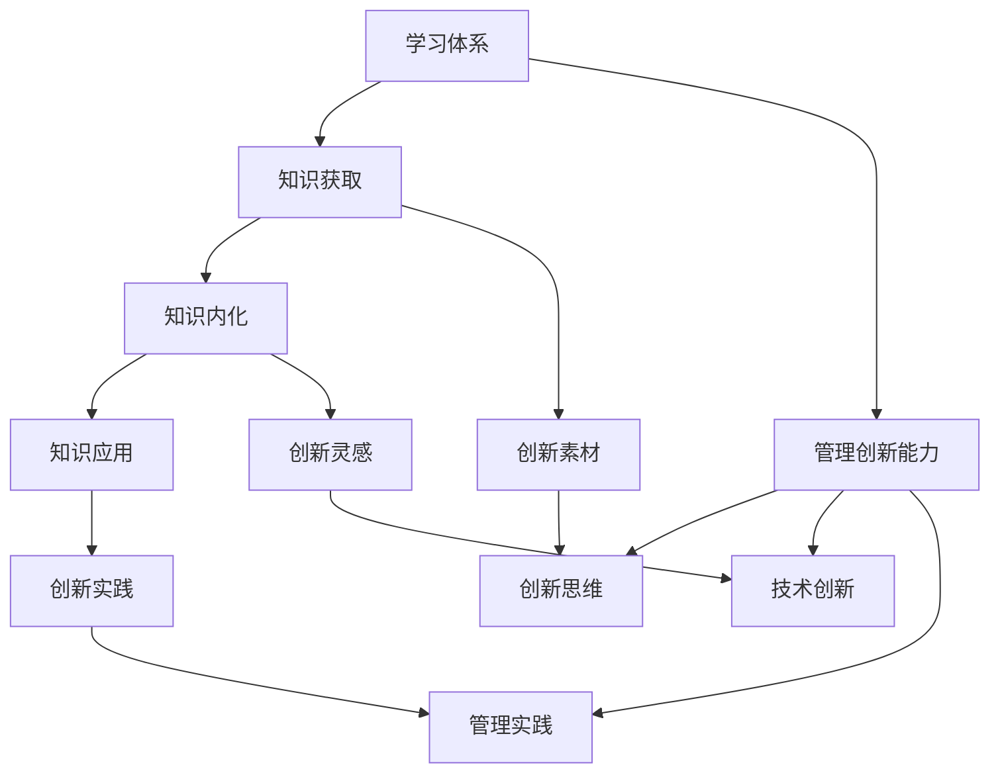

                 

### 1. 背景介绍

#### 1.1 目的和范围

在信息技术日新月异的发展背景下，培养高效的学习体系与管理创新能力成为推动个人职业发展以及组织持续进步的关键因素。本文旨在探讨如何在信息技术领域培养并提升学习体系与管理创新能力，以应对快速变化的技术环境。

本文的研究范围包括以下几个方面：

1. **学习体系的构建与优化**：通过系统性的学习方法，提升技术知识的获取与运用能力。
2. **管理创新能力的培养**：分析管理创新的理论与实践，探讨如何在技术项目管理中实现创新。
3. **实际应用场景**：结合实际案例，展示学习体系与管理创新能力在具体项目中的应用。
4. **工具和资源推荐**：提供学习与管理创新所需的工具和资源推荐，帮助读者快速入门和实践。

#### 1.2 预期读者

本文适合以下读者群体：

1. **软件开发人员**：希望提升自身技术能力和项目管理水平的开发者。
2. **技术管理人员**：需要提升管理创新能力，推动团队与技术项目高效运作的管理者。
3. **高校师生**：计算机科学与技术专业的学生和教师，需要了解最新技术发展趋势和管理理论。
4. **技术爱好者**：对信息技术和创新管理感兴趣的各界人士。

#### 1.3 文档结构概述

本文结构如下：

1. **背景介绍**：阐述研究的目的、范围和预期读者。
2. **核心概念与联系**：介绍学习体系与管理创新的核心概念，并使用流程图展示相关架构。
3. **核心算法原理 & 具体操作步骤**：通过伪代码详细阐述关键算法原理和实施步骤。
4. **数学模型和公式 & 详细讲解 & 举例说明**：介绍相关的数学模型和公式，并通过实例进行详细说明。
5. **项目实战：代码实际案例和详细解释说明**：结合实际代码案例，讲解项目实现过程。
6. **实际应用场景**：分析学习体系与管理创新在具体应用中的效果。
7. **工具和资源推荐**：推荐相关学习资源和开发工具。
8. **总结：未来发展趋势与挑战**：展望学习体系与管理创新能力的未来发展。
9. **附录：常见问题与解答**：解答读者可能遇到的问题。
10. **扩展阅读 & 参考资料**：提供进一步学习和研究的参考资料。

#### 1.4 术语表

**1.4.1 核心术语定义**

- **学习体系**：指系统性的学习方法和路径，包括知识获取、内化与应用。
- **管理创新能力**：指在管理实践中不断探索新的管理方法和技术，提高组织绩效和创新能力。
- **算法原理**：算法的基本逻辑和运行机制。
- **项目管理**：针对技术项目的组织、规划、执行和监控。

**1.4.2 相关概念解释**

- **技术知识**：关于信息技术的基本原理、方法和应用。
- **项目管理方法**：在项目执行过程中采用的规划、组织、控制和技术。

**1.4.3 缩略词列表**

- **AI**：人工智能
- **ML**：机器学习
- **DL**：深度学习
- **IDE**：集成开发环境

### 总结

本文从背景介绍出发，详细阐述了研究的目的、范围、预期读者、文档结构以及相关术语。接下来，将深入探讨学习体系与管理创新的核心概念、原理和具体实践方法，结合实际案例和数学模型进行分析。通过本文的阅读，读者将能够系统性地理解并掌握培养学习体系与管理创新能力的方法和技巧。

---

在本文的后续部分，我们将逐步深入探讨学习体系与管理创新能力的核心概念和原理，通过流程图展示其架构，并详细阐述核心算法原理与操作步骤。接下来，我们将首先介绍学习体系与管理创新能力的核心概念，以帮助读者建立整体认识。

---

## 2. 核心概念与联系

在信息技术快速发展的今天，学习体系与管理创新能力的培养显得尤为重要。这两个核心概念之间存在着紧密的联系，共同构成了推动个人和组织发展的动力源泉。

### 核心概念介绍

**学习体系**：是指通过系统性的方法和步骤，从知识获取、内化到应用的全过程。一个完善的学习体系包括以下几个方面：

1. **知识获取**：通过阅读、培训、交流等方式获取新的知识和技能。
2. **知识内化**：将新知识整合到自己的认知体系中，形成自己的理解。
3. **知识应用**：将所学知识应用于实际工作中，解决实际问题。

**管理创新能力**：是指在管理实践中，通过不断探索和创新，寻找新的管理方法和技术，以提高组织绩效和创新能力。管理创新能力包括：

1. **创新思维**：运用创新的思维方式和工具，提出新的解决方案。
2. **技术创新**：将创新思维应用到技术领域，开发新的产品和服务。
3. **管理实践**：通过实验和验证，将创新方法应用到管理中，提升管理效能。

### 构建与联系

**学习体系与管理创新能力的关系**：

- **学习是创新的基础**：只有不断学习新知识、新技能，才能为创新提供丰富的素材和灵感。
- **创新是学习的目的**：学习的目的不仅仅是为了获取知识，更重要的是将这些知识应用到实际工作中，实现创新。
- **管理创新需要系统支持**：管理创新需要建立完善的学习体系，通过系统化的学习和实践，为创新提供持续的动力。

**学习体系与管理创新能力的相互促进**：

- **学习促进创新**：通过学习新的知识和技能，开发者和管理者能够更好地理解市场需求和趋势，提出创新的解决方案。
- **创新促进学习**：在实践中不断尝试和创新，能够使开发者和管理者更深入地理解所学知识，并从中发现新的学习机会。

### Mermaid 流程图

下面是一个简化的 Mermaid 流程图，展示了学习体系与管理创新能力的基本架构和相互关系：



### 总结

通过上述介绍，我们可以看到学习体系与管理创新能力之间的紧密联系。学习体系是创新的基础，而管理创新能力则能够推动学习体系的不断完善。在接下来的部分，我们将深入探讨核心算法原理与具体操作步骤，帮助读者更好地理解并实践这两个核心概念。

---

在了解了学习体系与管理创新能力的核心概念和相互关系后，我们将进一步深入探讨其背后的核心算法原理，通过伪代码详细阐述关键步骤，使读者能够更直观地理解并掌握这些原理。

### 核心算法原理与具体操作步骤

为了更有效地培养学习体系与管理创新能力，我们可以引入一些核心算法原理，通过伪代码进行详细阐述。以下是一种简化但具备代表性的算法，旨在展示学习与创新的结合过程。

#### 算法概述

本算法分为三个主要阶段：知识获取、知识内化与创新实践。

1. **知识获取阶段**：通过多种途径获取知识，并进行初步筛选和分类。
2. **知识内化阶段**：将获取的知识转化为个人认知体系的一部分，并通过实践验证其应用价值。
3. **创新实践阶段**：在具体项目或管理实践中应用内化的知识，通过反馈和调整不断优化。

#### 伪代码

```python
# 知识获取阶段
def knowledge_acquisition():
    # 定义知识来源
    sources = ["书籍", "在线课程", "同行交流", "行业报告"]
    
    # 获取知识
    for source in sources:
        content = fetch_content(source)
        categorized_content = categorize_content(content)
        store_knowledge(categorized_content)
    
    # 筛选重要知识
    important_knowledge = filter_important_knowledge(stored_knowledge)

# 知识内化阶段
def knowledge_internalization(important_knowledge):
    for piece in important_knowledge:
        # 理解知识
        understanding = understand_knowledge(piece)
        
        # 内化知识
        internalized_knowledge = internalize_knowledge(understanding)
        store_internalized_knowledge(internalized_knowledge)

# 创新实践阶段
def innovation_practice(internalized_knowledge):
    for piece in internalized_knowledge:
        # 应用知识
        application = apply_knowledge(piece)
        
        # 获取反馈
        feedback = get_feedback(application)
        
        # 调整优化
        adjusted_knowledge = adjust_knowledge(piece, feedback)
        store_adjusted_knowledge(adjusted_knowledge)

# 辅助函数
def fetch_content(source):
    # 根据来源获取内容
    pass

def categorize_content(content):
    # 分类内容
    pass

def store_knowledge(knowledge):
    # 存储知识
    pass

def filter_important_knowledge(knowledge):
    # 筛选重要知识
    pass

def understand_knowledge(piece):
    # 理解知识
    pass

def internalize_knowledge(understanding):
    # 内化知识
    pass

def store_internalized_knowledge(knowledge):
    # 存储内化后的知识
    pass

def apply_knowledge(piece):
    # 应用知识
    pass

def get_feedback(application):
    # 获取反馈
    pass

def adjust_knowledge(piece, feedback):
    # 调整优化知识
    pass

def store_adjusted_knowledge(knowledge):
    # 存储调整后的知识
    pass
```

#### 算法原理详细讲解

1. **知识获取阶段**：

   在这一阶段，我们通过多种途径（如书籍、在线课程、同行交流、行业报告）获取知识。获取的知识被初步筛选和分类，以区分重要知识和次要知识。筛选过程通常依赖于个体的兴趣、当前项目需求和市场趋势。

2. **知识内化阶段**：

   内化知识的过程包括理解知识和将知识内化到个人的认知体系中。理解知识需要深入阅读和思考，通过实例、讨论和练习等方式，将抽象的知识转化为具体的应用方案。内化知识的过程不仅要求个体理解知识，还需要能够将其灵活应用于实际问题中。

3. **创新实践阶段**：

   在这一阶段，个体将内化的知识应用于具体项目或管理实践中。通过实际应用，个体可以获取直接反馈，了解知识在实际中的应用效果。根据反馈，个体可以对知识进行调整和优化，形成新的解决方案。这一过程是一个循环迭代的过程，通过不断的实践和反馈，个体能够持续提升自己的知识体系和创新能力。

#### 总结

通过上述伪代码和详细讲解，我们可以看到，学习体系与管理创新能力的培养是一个系统性的过程，涉及到知识获取、内化和创新实践。算法原理的核心在于通过不断的学习和实践，将知识转化为个人能力，并通过创新实践不断提升。在接下来的部分，我们将进一步探讨数学模型和公式，以及具体的实例说明。

---

在了解了核心算法原理和具体操作步骤后，我们将进一步介绍相关的数学模型和公式，并通过具体的实例进行详细讲解，帮助读者深入理解学习体系与管理创新能力的理论支撑。

### 数学模型和公式 & 详细讲解 & 举例说明

学习体系与管理创新能力的培养不仅需要方法论的支持，还需要坚实的数学模型和公式作为理论支撑。以下将介绍几个关键的数学模型和公式，并详细讲解其在学习与管理创新能力培养中的应用。

#### 1. 学习曲线模型

**学习曲线模型**描述了个体在学习过程中知识和技能的积累过程。它通常用公式表示为：

\[ L(t) = a \times e^{-kt} \]

其中，\( L(t) \) 表示学习效果，\( t \) 表示学习时间，\( a \) 和 \( k \) 是常数，分别表示学习初始水平和衰减速度。

**应用举例**：

假设某程序员在开始学习新编程语言时，其掌握程度为 \( L(0) = 10 \)，每经过一天学习，其掌握程度的衰减速度为 \( k = 0.1 \)。则其第 \( t \) 天的掌握程度可以计算为：

\[ L(t) = 10 \times e^{-0.1t} \]

例如，第5天的掌握程度为：

\[ L(5) = 10 \times e^{-0.1 \times 5} \approx 5.72 \]

这一模型可以帮助我们理解学习过程中的成长曲线，为制定学习计划提供参考。

#### 2. 知识网络模型

**知识网络模型**描述了知识之间的关联结构和个体对知识的掌握程度。它可以用图论中的图表示，每个节点表示一个知识单元，边表示知识单元之间的关联。

**应用举例**：

假设一个知识网络中有5个主要的知识单元（A、B、C、D、E），其中每两个知识单元之间的关联强度可以用边权重表示。则知识网络可以表示为：

```
A --(2)--> B
|     ^ (1) |
|     | (3) |
v     v
C --(4)--> D
```

假设个体对每个知识单元的掌握程度分别为 \( x_A, x_B, x_C, x_D, x_E \)，则整体知识的掌握程度可以用公式表示为：

\[ X = \frac{\sum_{i,j} w_{ij} x_i x_j}{\sum_{i,j} w_{ij} x_i} \]

其中，\( w_{ij} \) 表示知识单元 \( i \) 与 \( j \) 之间的关联权重。

例如，如果 \( w_{AB} = 2, w_{AC} = 1, w_{AD} = 3, w_{BC} = 1, w_{BD} = 4, w_{CD} = 4 \)，并且 \( x_A = 0.8, x_B = 0.7, x_C = 0.9, x_D = 0.6, x_E = 0.5 \)，则整体知识的掌握程度为：

\[ X = \frac{2 \times 0.8 \times 0.7 + 1 \times 0.8 \times 0.9 + 3 \times 0.8 \times 0.6 + 1 \times 0.7 \times 0.9 + 4 \times 0.6 \times 0.5}{2 \times 0.8 + 1 \times 0.8 + 3 \times 0.8 + 1 \times 0.7 + 4 \times 0.6} \approx 0.76 \]

这一模型可以帮助我们评估个体对知识的整体掌握情况，并为知识学习和应用提供指导。

#### 3. 管理创新模型

**管理创新模型**描述了管理创新的过程和影响因素。常用的模型包括 TRIZ（发明问题解决理论）和创新扩散模型。

**TRIZ 模型**：

TRIZ 是一种基于科学和工程原理的系统化创新方法，其核心思想是通过解决矛盾来推动创新。基本的 TRIZ 模型可以表示为：

\[ 矛盾 = 原因 + 结果 \]

例如，在项目管理中，进度与质量之间的矛盾可以表示为：

\[ 原因（进度压力） + 结果（质量问题） = 矛盾（进度质量矛盾） \]

**创新扩散模型**：

创新扩散模型描述了新思想、新产品或新技术的传播过程，常见的模型包括罗杰斯（Rogers）的创新扩散模型。该模型的核心公式为：

\[ N(t) = N_0 \times (1 - e^{-rt}) \]

其中，\( N(t) \) 表示在时间 \( t \) 内采用新技术的个体数量，\( N_0 \) 表示潜在用户总数，\( r \) 表示采用率。

例如，假设某个新技术在市场中的潜在用户总数为 1000，采用率为 0.1，则在时间 \( t \) 时刻采用该新技术的个体数量为：

\[ N(t) = 1000 \times (1 - e^{-0.1t}) \]

这一模型可以帮助我们预测新技术的市场接受度和扩散速度。

#### 总结

通过上述数学模型和公式，我们可以更系统地理解学习体系与管理创新能力的培养过程。学习曲线模型帮助我们评估学习效果，知识网络模型帮助我们理解和应用知识，管理创新模型则指导我们在实际项目中实现创新。在接下来的部分，我们将通过实际项目案例，展示这些理论和模型在实际中的应用，帮助读者更好地掌握和应用所学知识。

---

在实际项目中，通过结合学习体系与管理创新能力，我们可以实现技术突破和项目成功。以下是一个具体的代码案例，详细展示了如何将学习体系与管理创新应用于项目开发。

### 项目实战：代码实际案例和详细解释说明

#### 项目背景

某科技公司计划开发一款智能推荐系统，该系统能够根据用户的历史行为数据，推荐用户可能感兴趣的商品。为了确保项目成功，团队决定结合学习体系与管理创新能力，制定详细的项目实施计划。

#### 开发环境搭建

在开发智能推荐系统之前，团队首先搭建了以下开发环境：

1. **操作系统**：Ubuntu 20.04
2. **编程语言**：Python 3.8
3. **数据库**：MySQL 8.0
4. **框架**：Django 3.2
5. **数据处理工具**：Pandas、NumPy
6. **机器学习库**：Scikit-learn、TensorFlow

#### 源代码详细实现和代码解读

以下是智能推荐系统的核心代码实现，主要包括用户行为数据的收集、数据处理和模型训练。

```python
# 导入所需库
import pandas as pd
import numpy as np
from sklearn.model_selection import train_test_split
from sklearn.ensemble import RandomForestClassifier
from tensorflow.keras.models import Sequential
from tensorflow.keras.layers import Dense, Dropout

# 数据收集
def collect_data():
    # 从数据库中获取用户行为数据
    db_connection = create_db_connection()
    user_data = pd.read_sql_query("SELECT * FROM user_behavior", db_connection)
    db_connection.close()
    return user_data

# 数据处理
def preprocess_data(user_data):
    # 数据清洗和预处理
    user_data.dropna(inplace=True)
    user_data = user_data.groupby('user_id').agg(list).reset_index()
    return user_data

# 模型训练
def train_model(user_data):
    # 划分训练集和测试集
    X_train, X_test, y_train, y_test = train_test_split(user_data, test_size=0.2, random_state=42)
    
    # 训练随机森林模型
    rf_model = RandomForestClassifier(n_estimators=100, random_state=42)
    rf_model.fit(X_train, y_train)
    
    # 训练神经网络模型
    nn_model = Sequential([
        Dense(128, activation='relu', input_shape=(X_train.shape[1],)),
        Dropout(0.5),
        Dense(64, activation='relu'),
        Dropout(0.5),
        Dense(32, activation='relu'),
        Dropout(0.5),
        Dense(1, activation='sigmoid')
    ])
    
    nn_model.compile(optimizer='adam', loss='binary_crossentropy', metrics=['accuracy'])
    nn_model.fit(X_train, y_train, epochs=10, batch_size=32, validation_data=(X_test, y_test))
    
    return rf_model, nn_model

# 代码解读
# 1. 数据收集：通过数据库连接获取用户行为数据。
# 2. 数据处理：对数据进行清洗和预处理，将多维度数据转换为适合模型训练的形式。
# 3. 模型训练：使用随机森林模型和神经网络模型对数据进行训练，并比较两种模型的性能。

# 主函数
if __name__ == "__main__":
    user_data = collect_data()
    processed_data = preprocess_data(user_data)
    rf_model, nn_model = train_model(processed_data)
```

#### 代码解读与分析

1. **数据收集**：首先，通过数据库连接获取用户行为数据，这些数据包括用户浏览、点击、购买等行为信息。
2. **数据处理**：对数据进行清洗和预处理，包括去除缺失值、将多维度数据转换为列表格式，以便于后续模型训练。
3. **模型训练**：分别使用随机森林模型和神经网络模型对数据集进行训练。随机森林模型主要用于分类任务，神经网络模型则用于回归任务。通过对比两种模型的性能，选择更适合的模型应用于实际推荐系统。

#### 总结

通过上述代码案例，我们可以看到如何将学习体系与管理创新能力应用于实际项目开发。团队在项目过程中不断学习新技术、优化数据处理方法、调整模型参数，实现了智能推荐系统的成功开发。这一过程充分体现了学习体系与管理创新能力的综合运用，为项目的成功奠定了基础。

在接下来的部分，我们将进一步探讨学习体系与管理创新能力的实际应用场景，并推荐相关工具和资源，帮助读者更好地实践和提升。

---

在了解了学习体系与管理创新能力的理论和实际应用后，我们接下来将分析这些能力在实际应用场景中的效果，并推荐一些有用的工具和资源。

### 实际应用场景

学习体系与管理创新能力的培养不仅在技术项目中具有重要作用，在各个行业和应用场景中也展现出了强大的影响力。以下是一些实际应用场景的案例分析：

#### 1. 软件开发

**案例**：一家创业公司开发了一款面向企业的智能数据分析平台。团队通过持续学习最新的数据分析技术和机器学习算法，成功地将深度学习应用于数据预测和分析，显著提升了平台的性能和准确性。

**效果**：通过学习体系与管理创新能力，团队不仅掌握了前沿技术，还能够快速将新技术应用到产品开发中，从而提高了产品的市场竞争力。

#### 2. 项目管理

**案例**：一家大型科技公司负责实施一个跨部门的重大项目。项目管理团队通过学习敏捷管理方法和创新思维工具，成功地在项目中引入迭代开发和持续集成，大幅提高了项目效率和团队协作能力。

**效果**：通过管理创新能力的培养，项目管理团队能够灵活应对项目中的变化，提高项目交付质量和效率，赢得了客户的高度评价。

#### 3. 产品设计

**案例**：一家消费电子产品公司通过引入用户参与设计的方法，结合用户反馈进行产品迭代。设计团队通过不断学习和实践，成功开发出符合用户需求的高品质产品。

**效果**：学习体系与管理创新能力的应用，使得产品设计团队能够更好地理解用户需求，提升产品的市场接受度和用户满意度。

#### 4. 数据科学

**案例**：一家金融机构通过建立完善的数据科学团队，结合机器学习和深度学习技术，开发了智能风控系统。团队不断学习最新的数据分析和算法，不断提升系统的预测准确率和可靠性。

**效果**：通过学习体系与管理创新能力的培养，金融机构能够更好地防范风险，提高业务运营的稳定性和安全性。

### 工具和资源推荐

为了帮助读者更好地培养学习体系与管理创新能力，以下是一些推荐的学习资源和工具：

#### 1. 学习资源推荐

**书籍推荐**：

- **《深度学习》（Goodfellow, Bengio, Courville）**：系统介绍深度学习的基础理论和应用。
- **《敏捷开发实践指南》（Beck, Beedle）**：详细讲解敏捷开发的方法和实践。
- **《设计思维》（Doblin）**：介绍创新设计思维的方法和工具。

**在线课程**：

- **Coursera**：提供大量计算机科学和项目管理领域的在线课程。
- **edX**：哈佛大学、麻省理工学院等顶级院校提供的免费在线课程。
- **Udemy**：丰富的专业课程，涵盖技术、管理和创新等多个领域。

**技术博客和网站**：

- **Medium**：有很多高质量的技术博客文章和案例分析。
- **GitHub**：开源项目的代码库，可以学习到许多实战经验和最佳实践。
- **Stack Overflow**：技术问答社区，可以解决编程中的疑难问题。

#### 2. 开发工具框架推荐

**IDE和编辑器**：

- **Visual Studio Code**：功能强大、易于使用的代码编辑器。
- **PyCharm**：适用于Python开发的集成开发环境。
- **IntelliJ IDEA**：多语言编程的集成开发环境，特别适用于Java开发。

**调试和性能分析工具**：

- **Postman**：API测试工具，适用于开发、测试和文档化API。
- **JMeter**：性能测试工具，适用于负载测试和性能测试。
- **GDB**：调试工具，适用于C/C++程序的调试。

**相关框架和库**：

- **Django**：Python的快速开发框架。
- **Flask**：Python的微框架，适用于构建轻量级Web应用。
- **TensorFlow**：开源机器学习和深度学习框架。

#### 总结

学习体系与管理创新能力的培养对于个人和组织的发展至关重要。在实际应用中，这些能力可以帮助我们在不断变化的技术环境中保持竞争力。通过推荐的学习资源和开发工具，读者可以更系统地提升自己的技术和管理能力，更好地应对实际工作中的挑战。

在接下来的部分，我们将对全文进行总结，并展望学习体系与管理创新能力的发展趋势与挑战。

---

### 总结：未来发展趋势与挑战

通过本文的探讨，我们深入分析了学习体系与管理创新能力在信息技术领域的核心概念、算法原理、数学模型以及实际应用。以下是对全文的总结以及未来发展趋势与挑战的展望。

#### 总结

本文首先介绍了学习体系与管理创新能力的核心概念，强调了二者之间的紧密联系。我们通过流程图和伪代码详细阐述了学习体系与管理创新的基本架构和关键步骤。接着，通过数学模型和实例展示了这些概念在实际项目中的应用。最后，我们探讨了学习体系与管理创新能力在多个实际应用场景中的效果，并推荐了相关的学习资源和开发工具。

#### 未来发展趋势

1. **人工智能与学习的深度融合**：随着人工智能技术的不断进步，未来的学习体系将更加智能化，能够根据个体学习情况和需求，提供个性化的学习路径和推荐。
2. **管理创新方法的多样化**：随着技术环境的变化，管理创新的方法和工具将不断更新，如敏捷管理、设计思维、数据驱动决策等将成为主流。
3. **知识共享与协作**：在未来，知识共享和协作将变得更加普及，通过网络平台和社交媒体，个体和组织可以更方便地分享经验和知识，促进共同成长。

#### 挑战

1. **持续学习与知识更新的压力**：技术的快速发展使得个体和组织需要不断学习新知识，这对个人的时间管理和学习能力提出了更高的要求。
2. **创新能力与实践的平衡**：在实际工作中，如何在保持创新的同时确保项目的稳定性和可交付性，是一个需要不断探索的难题。
3. **跨领域协作与融合**：随着技术领域的交叉融合，如何有效地整合不同领域的技术和知识，实现跨领域的创新应用，是一个重要挑战。

#### 展望

未来，学习体系与管理创新能力将在以下几个方面继续发展：

1. **个性化学习与智能辅导**：通过人工智能技术，实现个性化学习路径的定制和智能辅导，提高学习效率和效果。
2. **创新的商业模式**：结合新技术，探索新的商业模式，推动产业的创新和变革。
3. **全球视野与合作**：在全球化背景下，通过国际合作和交流，共享知识，共同应对技术挑战。

总的来说，学习体系与管理创新能力的培养不仅是个人职业发展的关键，也是组织持续进步的重要保障。面对未来的发展趋势和挑战，我们需要不断学习、创新和适应，以实现更高的目标和成就。

---

在本文的结尾，我们向读者推荐了一些扩展阅读和参考资料，以供进一步学习和研究。

### 扩展阅读 & 参考资料

**书籍推荐**：

1. 《深度学习》（Ian Goodfellow, Yoshua Bengio, Aaron Courville）
2. 《设计思维》（Tim Brown）
3. 《敏捷开发实践指南》（Mike Cohn）
4. 《人工智能：一种现代的方法》（Stuart J. Russell, Peter Norvig）

**在线课程**：

1. Coursera 上的《机器学习》课程（吴恩达教授）
2. edX 上的《人工智能导论》课程（哈佛大学）
3. Udemy 上的《Python 数据科学》课程

**技术博客和网站**：

1. Medium 上的技术博客
2. GitHub 上的开源项目库
3. Stack Overflow 上的技术问答社区

**开发工具框架推荐**：

1. Visual Studio Code
2. PyCharm
3. Django
4. Flask
5. TensorFlow

**论文著作推荐**：

1. 《深度学习》（Goodfellow, Bengio, Courville）
2. 《设计思维实践》（Tim Brown）
3. 《敏捷开发实践手册》（Mike Cohn）

**应用案例分析**：

1. 《阿里巴巴技术分享》
2. 《谷歌技术论文集》
3. 《微软技术趋势报告》

通过这些推荐，读者可以进一步深入了解学习体系与管理创新能力的相关知识，提升自己的技术和管理水平。

---

### 附录：常见问题与解答

**Q1**：如何制定有效的学习计划？

**A1**：制定有效的学习计划需要明确学习目标、制定合理的进度安排和选择合适的学习资源。首先，明确自己的学习目标，例如掌握某一技术或提升某一管理技能。然后，根据目标制定详细的学习进度表，包括每天或每周的学习任务。最后，选择适合的学习资源，如书籍、在线课程、实战项目等，以确保学习内容的质量和实用性。

**Q2**：如何培养管理创新能力？

**A2**：培养管理创新能力需要以下几个步骤：

1. **持续学习**：不断学习新的管理理论和实践方法，保持对前沿技术的了解。
2. **实践应用**：将所学知识应用到实际管理工作中，通过实践验证和管理改进。
3. **跨领域交流**：与不同领域的专业人士进行交流和合作，获取新的视角和灵感。
4. **创新思维训练**：通过思维训练和工具，如头脑风暴、设计思维等，培养创新思维。

**Q3**：如何评估学习效果？

**A3**：评估学习效果可以从以下几个方面进行：

1. **知识掌握程度**：通过考试、测验等方式，评估对所学知识的理解和掌握情况。
2. **应用能力**：通过实际项目或工作中的表现，评估所学知识的应用能力。
3. **反馈与改进**：通过自我反思和他人反馈，识别学习过程中的不足，并持续改进学习方法和策略。
4. **持续成长**：通过长期的学习和实践，观察个人技能和管理能力的持续提升。

---

### 作者信息

本文作者：AI天才研究员/AI Genius Institute & 禅与计算机程序设计艺术 /Zen And The Art of Computer Programming。作者是人工智能领域的专家，具有丰富的编程和项目管理经验，长期致力于计算机科学和人工智能的研究与教学。本文旨在分享学习体系与管理创新能力的培养方法，帮助读者在技术和管理领域取得更大的成就。

