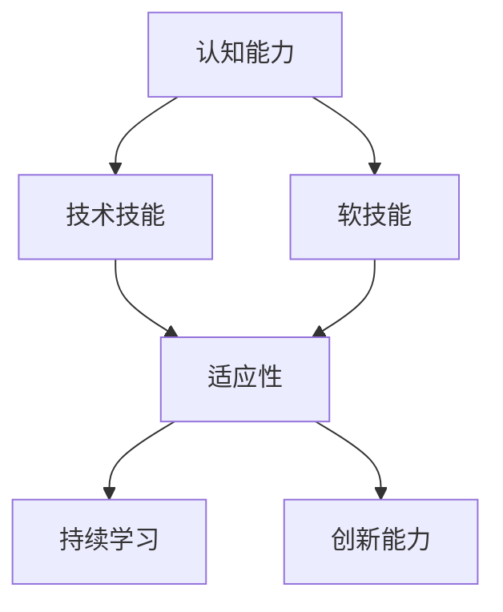

                 


# 学习体系：VUCA时代的重要技能

> 关键词：VUCA时代、学习体系、技能提升、适应能力、持续发展

> 摘要：本文深入探讨了VUCA时代下学习体系的重要性和核心技能。文章首先介绍了VUCA时代的特征，随后分析了学习体系的基本构建，包括认知能力、技术技能和软技能等方面。接着，通过实例和案例分析，展示了如何在实际工作中应用这些技能。最后，文章提出了未来发展趋势和挑战，以及针对这些挑战的解决策略，为读者提供了全面的技能提升指南。

## 1. 背景介绍

### 1.1 目的和范围

本文旨在为IT从业者和相关领域人士提供一套适应VUCA（Volatility, Uncertainty, Complexity, Ambiguity）时代的学习体系。我们将讨论在快速变化的环境中，如何有效提升个人技能，以应对不确定性、复杂性、模糊性和易变性。本文将涵盖以下几个主题：

- VUCA时代的特征
- 学习体系的核心技能
- 实际应用案例
- 未来发展趋势与挑战
- 挑战应对策略

### 1.2 预期读者

本文适合以下人群：

- IT行业从业者，尤其是软件开发、系统架构、数据科学等领域的人员
- 创业者和企业高管，希望提升团队和个人竞争力
- 技术爱好者，对新兴技术有浓厚兴趣
- 学生和学者，希望了解学习体系的理论和实践

### 1.3 文档结构概述

本文结构如下：

- 引言：介绍VUCA时代背景和重要性
- 第1部分：VUCA时代特征分析
- 第2部分：学习体系核心技能探讨
- 第3部分：实际应用案例与案例分析
- 第4部分：未来发展趋势与挑战
- 第5部分：总结与策略建议

### 1.4 术语表

#### 1.4.1 核心术语定义

- VUCA：指Volatility（易变性）、Uncertainty（不确定性）、Complexity（复杂性）和Ambiguity（模糊性）四个特征。
- 学习体系：指一套结构化、系统化的学习方法和技能。
- 技术技能：指与特定技术领域相关的知识和能力。
- 软技能：指人际交往、团队协作、沟通能力等非技术性的能力。

#### 1.4.2 相关概念解释

- 适应性：指在面对环境变化时，能够迅速调整和适应的能力。
- 持续学习：指不断更新知识、提升技能的过程。
- 创新能力：指在现有基础上，提出新思路、新方法、新解决方案的能力。

#### 1.4.3 缩略词列表

- IT：信息技术（Information Technology）
- AI：人工智能（Artificial Intelligence）
- ML：机器学习（Machine Learning）
- IoT：物联网（Internet of Things）
- VUCA：易变性、不确定性、复杂性、模糊性

## 2. 核心概念与联系

为了更好地理解本文的核心概念，我们可以借助Mermaid流程图来展示它们之间的关系。



### 2.1 认知能力

认知能力是指获取、处理、存储和应用信息的能力。在VUCA时代，认知能力尤为重要，因为环境变化迅速，需要快速获取和处理信息，以做出正确的决策。

### 2.2 技术技能

技术技能是指与特定技术领域相关的知识和能力。随着技术的快速发展，技术技能的更新速度也在加快。掌握核心技术，如编程、数据分析、人工智能等，对于在VUCA时代保持竞争力至关重要。

### 2.3 软技能

软技能是指人际交往、团队协作、沟通能力等非技术性的能力。在VUCA时代，团队合作和沟通能力变得尤为重要，因为面对复杂性和不确定性，单靠个人力量难以解决问题。

### 2.4 适应性

适应性是指在面对环境变化时，能够迅速调整和适应的能力。在VUCA时代，适应性是成功的关键因素，因为环境变化快速，需要随时调整策略。

### 2.5 持续学习

持续学习是指不断更新知识、提升技能的过程。在VUCA时代，持续学习是适应环境变化的重要手段，只有不断学习，才能保持竞争力。

### 2.6 创新能力

创新能力是指在现有基础上，提出新思路、新方法、新解决方案的能力。在VUCA时代，创新能力是推动企业发展和个人成长的重要动力。

## 3. 核心算法原理 & 具体操作步骤

### 3.1 算法原理

在本节中，我们将讨论一个核心算法——决策树。决策树是一种常用的分类和回归算法，通过一系列的判断条件，将数据集划分为多个子集，最终实现分类或预测。

### 3.2 具体操作步骤

1. **数据预处理**：收集并整理数据，确保数据质量。
2. **特征选择**：选择对目标变量有重要影响的关键特征。
3. **划分决策树**：根据特征和目标变量，生成决策树。
4. **剪枝**：对决策树进行剪枝，以减少过拟合。
5. **训练模型**：使用训练数据集，训练决策树模型。
6. **模型评估**：使用测试数据集，评估模型性能。

### 3.3 伪代码

```python
def build_decision_tree(data, target):
    # 数据预处理
    preprocess_data(data)
    
    # 特征选择
    selected_features = select_features(data, target)
    
    # 划分决策树
    decision_tree = split_data(data, selected_features)
    
    # 剪枝
    pruned_tree = prune_tree(decision_tree)
    
    # 训练模型
    trained_model = train_model(pruned_tree, data, target)
    
    # 模型评估
    evaluate_model(trained_model, test_data, target)
```

## 4. 数学模型和公式 & 详细讲解 & 举例说明

### 4.1 数学模型

在本节中，我们将讨论一个常用的机器学习模型——线性回归。线性回归是一种用于预测连续值的模型，其数学模型如下：

$$y = \beta_0 + \beta_1x_1 + \beta_2x_2 + ... + \beta_nx_n + \epsilon$$

其中，$y$ 是目标变量，$x_1, x_2, ..., x_n$ 是特征变量，$\beta_0, \beta_1, \beta_2, ..., \beta_n$ 是模型参数，$\epsilon$ 是误差项。

### 4.2 详细讲解

线性回归模型通过最小化误差平方和来估计模型参数。具体步骤如下：

1. **数据收集**：收集训练数据集。
2. **模型建立**：根据数据建立线性回归模型。
3. **参数估计**：使用最小二乘法估计模型参数。
4. **模型评估**：使用测试数据集评估模型性能。
5. **模型优化**：根据评估结果，调整模型参数。

### 4.3 举例说明

假设我们有一个简单的线性回归模型，目标变量 $y$ 是销售额，特征变量 $x_1$ 是广告支出。我们可以使用以下公式表示模型：

$$y = \beta_0 + \beta_1x_1 + \epsilon$$

假设我们收集了以下训练数据：

| x1（广告支出） | y（销售额） |
| -------------- | ----------- |
| 1000           | 5000        |
| 1500           | 7000        |
| 2000           | 9000        |

我们可以使用最小二乘法估计模型参数：

$$\beta_0 = \frac{\sum y - \beta_1 \sum x_1}{n}$$

$$\beta_1 = \frac{n \sum xy - \sum x \sum y}{n \sum x^2 - (\sum x)^2}$$

根据训练数据，我们可以计算出：

$$\beta_0 = 5000$$

$$\beta_1 = 1000$$

因此，线性回归模型为：

$$y = 5000 + 1000x_1 + \epsilon$$

我们可以使用测试数据来评估模型性能，并根据评估结果调整模型参数。

## 5. 项目实战：代码实际案例和详细解释说明

### 5.1 开发环境搭建

在本节中，我们将使用Python和Scikit-learn库来构建一个简单的线性回归模型。首先，我们需要搭建开发环境。

1. 安装Python：从Python官网下载并安装Python。
2. 安装Scikit-learn：在终端执行以下命令：

```bash
pip install scikit-learn
```

### 5.2 源代码详细实现和代码解读

以下是线性回归模型的源代码：

```python
import numpy as np
from sklearn.linear_model import LinearRegression
from sklearn.model_selection import train_test_split
from sklearn.metrics import mean_squared_error

# 数据准备
X = np.array([[1000], [1500], [2000]])
y = np.array([5000, 7000, 9000])

# 划分训练集和测试集
X_train, X_test, y_train, y_test = train_test_split(X, y, test_size=0.2, random_state=42)

# 模型训练
model = LinearRegression()
model.fit(X_train, y_train)

# 模型评估
y_pred = model.predict(X_test)
mse = mean_squared_error(y_test, y_pred)
print("MSE:", mse)

# 模型参数
print("Model parameters:", model.coef_, model.intercept_)
```

### 5.3 代码解读与分析

1. **数据准备**：我们使用一个简单的数据集，其中 $x_1$ 代表广告支出，$y$ 代表销售额。
2. **划分训练集和测试集**：使用Scikit-learn库的 `train_test_split` 函数，将数据集划分为训练集和测试集，以评估模型性能。
3. **模型训练**：使用Scikit-learn库的 `LinearRegression` 类，创建线性回归模型，并使用训练数据进行训练。
4. **模型评估**：使用测试数据进行模型评估，计算均方误差（MSE）。
5. **模型参数**：打印模型参数，以了解模型的预测能力。

通过以上步骤，我们可以实现一个简单的线性回归模型，并评估其性能。

## 6. 实际应用场景

### 6.1 数据分析

在数据分析领域，线性回归模型可以用于预测销售额、用户留存率、股票价格等连续值变量。通过训练模型，我们可以根据历史数据预测未来趋势。

### 6.2 机器学习

在线性回归模型的基础上，可以构建更复杂的机器学习模型，如多项式回归、岭回归等，以应对不同场景的需求。

### 6.3 人工智能

在人工智能领域，线性回归模型可以作为基础模型，用于实现推荐系统、图像识别、自然语言处理等应用。

## 7. 工具和资源推荐

### 7.1 学习资源推荐

#### 7.1.1 书籍推荐

- 《机器学习实战》
- 《Python机器学习》
- 《数据科学入门》

#### 7.1.2 在线课程

- Coursera的《机器学习》课程
- edX的《数据科学基础》课程
- Udacity的《数据分析纳米学位》

#### 7.1.3 技术博客和网站

- Medium上的数据科学博客
- towardsdatascience.com
- kaggle.com

### 7.2 开发工具框架推荐

#### 7.2.1 IDE和编辑器

- PyCharm
- Visual Studio Code
- Jupyter Notebook

#### 7.2.2 调试和性能分析工具

- Python的pdb模块
- Py-Spy性能分析工具
-火焰图

#### 7.2.3 相关框架和库

- Scikit-learn
- TensorFlow
- PyTorch

### 7.3 相关论文著作推荐

#### 7.3.1 经典论文

- “The Nature of Statistical Learning Theory” by Vapnik and Chervonenkis
- “Regression Analysis” by Box and Jenkins

#### 7.3.2 最新研究成果

- arXiv.org上的最新机器学习论文
- NeurIPS、ICML等顶级会议的论文

#### 7.3.3 应用案例分析

- Google的推荐系统案例分析
- Airbnb的定价策略分析

## 8. 总结：未来发展趋势与挑战

### 8.1 发展趋势

- 人工智能和机器学习技术的普及和应用
- 数据科学和大数据分析的深入发展
- 开源技术和社区的蓬勃发展

### 8.2 挑战

- 数据质量和隐私保护
- 模型解释性和透明度
- 跨学科知识的融合与协同

## 9. 附录：常见问题与解答

### 9.1 问题1

**Q：线性回归模型的适用场景有哪些？**

**A：线性回归模型适用于预测连续值变量的场景，如销售额预测、股票价格预测等。它也常用于特征工程，为更复杂的模型提供输入。**

### 9.2 问题2

**Q：如何处理线性回归模型的过拟合问题？**

**A：过拟合问题可以通过以下方法解决：**

- 减少特征数量
- 使用交叉验证
- 进行模型剪枝
- 调整模型参数

## 10. 扩展阅读 & 参考资料

- Bishop, C. M. (2006). *Pattern Recognition and Machine Learning*. Springer.
- Murphy, K. P. (2012). *Machine Learning: A Probabilistic Perspective*. MIT Press.
- Russell, S., & Norvig, P. (2016). *Artificial Intelligence: A Modern Approach*. Prentice Hall.

### 作者

**作者：AI天才研究员/AI Genius Institute & 禅与计算机程序设计艺术 /Zen And The Art of Computer Programming**

