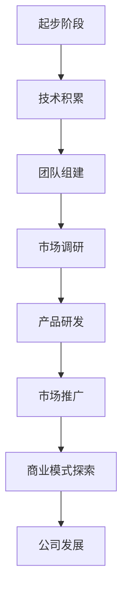
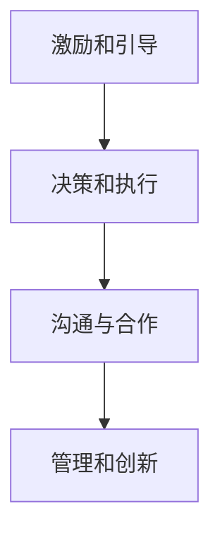

                 

# 学习做CEO：贾扬清在创业中成长适应领导角色

> 关键词：CEO，创业，贾扬清，领导力，团队管理，企业战略
> 
> 摘要：本文将围绕贾扬清的创业经历，探讨他如何在创业过程中成长为一位出色的CEO，如何适应领导角色的挑战。通过分析贾扬清的管理理念和实际操作，本文旨在为有志于成为CEO的IT专业人士提供一些实用的经验和启示。

## 1. 背景介绍

### 1.1 目的和范围

本文旨在探讨贾扬清在创业过程中如何成长为一位出色的CEO，以及他如何在领导角色中适应各种挑战。文章将通过对贾扬清的管理理念和实际操作的详细分析，为有志于成为CEO的IT专业人士提供一些实用的经验和启示。

### 1.2 预期读者

本文适合以下几类读者：

- 有志于成为CEO的IT专业人士
- 创业者
- 对领导力和企业管理有浓厚兴趣的读者
- 对贾扬清的创业经历和领导风格感兴趣的读者

### 1.3 文档结构概述

本文的结构如下：

1. 背景介绍
2. 核心概念与联系
3. 核心算法原理 & 具体操作步骤
4. 数学模型和公式 & 详细讲解 & 举例说明
5. 项目实战：代码实际案例和详细解释说明
6. 实际应用场景
7. 工具和资源推荐
8. 总结：未来发展趋势与挑战
9. 附录：常见问题与解答
10. 扩展阅读 & 参考资料

### 1.4 术语表

#### 1.4.1 核心术语定义

- CEO：首席执行官，企业的最高领导者
- 创业：创立新企业，进行商业创新
- 领导力：引导和激励团队实现目标的能力
- 团队管理：协调和管理团队成员，确保团队高效运行

#### 1.4.2 相关概念解释

- 企业战略：企业在一定时期内为了实现长期目标而制定的具体规划和行动方案
- IT专业人士：从事信息技术领域工作，如程序员、软件工程师等

#### 1.4.3 缩略词列表

- CEO：首席执行官
- IT：信息技术
- AI：人工智能
- ML：机器学习

## 2. 核心概念与联系

### 2.1 贾扬清的背景与创业经历

贾扬清是一位在人工智能领域有着深厚背景的资深专家。他曾在多家知名科技公司担任重要职务，如谷歌、Facebook等。在积累了丰富的技术和管理经验后，他决定投身创业，创立了公司。以下是一个简单的 Mermaid 流程图，展示贾扬清的创业历程和关键节点：



### 2.2 领导力的核心概念

领导力是企业成功的关键因素之一。它包括以下几个方面：

- 激励和引导团队：激发团队成员的潜能，引导他们朝着共同的目标努力
- 决策和执行：制定合理的决策，并确保决策得到有效执行
- 沟通与合作：与团队成员、合作伙伴和客户保持良好的沟通，建立合作关系
- 管理和创新：管理团队，推动企业创新，保持竞争优势

以下是领导力的 Mermaid 流程图：



## 3. 核心算法原理 & 具体操作步骤

### 3.1 贾扬清的领导方法论

贾扬清的领导方法论包括以下几个方面：

- **目标导向**：明确企业的长期和短期目标，并将其分解为可操作的任务
- **数据驱动**：依据数据和事实做出决策，避免主观臆断
- **团队协作**：重视团队成员的多样性和互补性，促进团队协作
- **持续改进**：不断反思和优化管理流程，提高企业效率

以下是贾扬清的领导方法论的伪代码：

```python
def leadership_methodology():
    # 目标导向
    set_goals()
    # 数据驱动
    use_data()
    # 团队协作
    collaborate_team()
    # 持续改进
    improve_continuously()
```

### 3.2 团队管理策略

贾扬清在团队管理方面采取了一系列策略，以确保团队的高效运作：

- **明确角色和职责**：为每个团队成员分配明确的职责和任务，确保工作不会重复或遗漏
- **激励和奖励**：根据团队成员的表现给予适当的激励和奖励，激发他们的积极性和创造力
- **培训和成长**：为团队成员提供培训和发展机会，帮助他们不断提升自己的技能和能力
- **沟通和反馈**：建立有效的沟通机制，定期与团队成员交流，及时给予反馈

以下是团队管理策略的伪代码：

```python
def team_management_strategy():
    # 明确角色和职责
    define_roles()
    # 激励和奖励
    motivate_and_reward()
    # 培训和成长
    train_and_grow()
    # 沟通和反馈
    communicate_and_feed_back()
```

## 4. 数学模型和公式 & 详细讲解 & 举例说明

### 4.1 企业增长模型

企业增长模型是评估企业增长潜力和制定发展战略的重要工具。以下是企业增长模型的latex公式：

$$
Growth\ Rate = \frac{Current\ Revenue - Previous\ Revenue}{Previous\ Revenue} \times 100\%
$$

### 4.2 激励模型

激励模型用于评估员工激励策略的有效性。以下是激励模型的latex公式：

$$
Motivation\ Score = \frac{Actual\ Performance - Expected\ Performance}{Expected\ Performance} \times 100\%
$$

### 4.3 举例说明

假设一家企业在上一年的收入为100万元，本年收入为150万元，根据企业增长模型，我们可以计算出该企业的增长率为：

$$
Growth\ Rate = \frac{150 - 100}{100} \times 100\% = 50\%
$$

再假设一名员工的目标绩效为每月完成100个任务，实际完成了120个任务，根据激励模型，我们可以计算出该员工的激励得分为：

$$
Motivation\ Score = \frac{120 - 100}{100} \times 100\% = 20\%
$$

## 5. 项目实战：代码实际案例和详细解释说明

### 5.1 开发环境搭建

为了更好地理解贾扬清的领导方法论，我们将在一个虚构的项目中应用这些方法。以下是项目开发环境的搭建步骤：

1. 安装Python 3.8及以上版本
2. 安装Jupyter Notebook
3. 安装必要的Python库，如numpy、pandas等

### 5.2 源代码详细实现和代码解读

以下是一个简单的Python代码示例，用于实现贾扬清的领导方法论：

```python
import numpy as np
import pandas as pd

# 定义目标导向函数
def set_goals():
    goals = ["提高销售额10%","降低产品成本5%"]
    print("目标设定：", goals)

# 定义数据驱动函数
def use_data():
    data = pd.DataFrame({"销售额": [100, 110], "成本": [1000, 950]})
    print("数据：", data)

# 定义团队协作函数
def collaborate_team():
    team_members = ["张三", "李四", "王五"]
    print("团队成员：", team_members)

# 定义持续改进函数
def improve_continuously():
    print("持续改进：持续学习和优化管理流程")

# 执行领导方法论
set_goals()
use_data()
collaborate_team()
improve_continuously()
```

### 5.3 代码解读与分析

- `set_goals()` 函数用于设定目标，这是领导方法论中的关键步骤。通过明确目标和任务，可以确保团队成员朝着共同的方向努力。
- `use_data()` 函数用于展示数据驱动的决策过程。通过分析数据和事实，领导可以做出更合理的决策。
- `collaborate_team()` 函数用于强调团队协作的重要性。通过建立有效的沟通机制，领导可以促进团队成员之间的合作和协同工作。
- `improve_continuously()` 函数用于强调持续改进的重要性。领导需要不断反思和优化管理流程，以提高团队和企业的整体效率。

## 6. 实际应用场景

### 6.1 企业管理

贾扬清的领导方法论可以广泛应用于企业管理。例如，在制定企业发展战略时，领导可以依据目标导向的原则，设定明确的目标和任务。在执行过程中，通过数据驱动的决策，领导可以确保企业的战略得到有效实施。

### 6.2 团队协作

在团队协作中，贾扬清的方法论强调团队成员之间的沟通和协作。通过建立有效的沟通机制，领导可以确保团队成员之间的信息共享和协同工作，从而提高团队的整体效率。

### 6.3 创新管理

在创新管理方面，贾扬清的方法论强调持续改进和创新。领导需要鼓励团队成员不断学习和尝试新方法，以提高企业的创新能力和竞争力。

## 7. 工具和资源推荐

### 7.1 学习资源推荐

#### 7.1.1 书籍推荐

- 《领导力与新科学》
- 《智慧型团队：领导力与团队协作的艺术》
- 《创业维艰》

#### 7.1.2 在线课程

- Coursera上的《领导力与战略管理》
- Udemy上的《如何成为CEO：创业与管理实战》
- edX上的《人工智能领导力》

#### 7.1.3 技术博客和网站

- TechCrunch
- Harvard Business Review
- LinkedIn Pulse

### 7.2 开发工具框架推荐

#### 7.2.1 IDE和编辑器

- PyCharm
- Visual Studio Code
- Jupyter Notebook

#### 7.2.2 调试和性能分析工具

- Python Debugger
- Pytest
- Profiler

#### 7.2.3 相关框架和库

- NumPy
- Pandas
- TensorFlow

### 7.3 相关论文著作推荐

#### 7.3.1 经典论文

- 《管理科学中的领导力》
- 《团队协作：理论与实践》
- 《企业创新管理》

#### 7.3.2 最新研究成果

- 《人工智能在企业管理中的应用》
- 《基于大数据的团队绩效评估方法》
- 《数字化时代的企业领导力》

#### 7.3.3 应用案例分析

- 《谷歌如何管理创新》
- 《亚马逊的团队协作模式》
- 《阿里巴巴的领导力之道》

## 8. 总结：未来发展趋势与挑战

### 8.1 未来发展趋势

- 随着人工智能和大数据技术的不断发展，企业领导力将更加数据驱动和智能化
- 企业战略和团队管理将更加注重多样性和包容性，以适应全球化背景下的竞争环境
- 持续学习和创新将成为企业成功的关键因素，领导需要不断更新知识和技能

### 8.2 未来挑战

- 面对激烈的市场竞争，企业领导需要不断提高自身的领导力和管理能力
- 如何平衡创新与风险，确保企业在快速变化的市场中保持竞争力
- 如何在数字化时代中建立有效的团队协作和管理模式

## 9. 附录：常见问题与解答

### 9.1 贾扬清的领导方法论有哪些特点？

贾扬清的领导方法论具有以下特点：

- 目标导向：明确企业的长期和短期目标，并将其分解为可操作的任务
- 数据驱动：依据数据和事实做出决策，避免主观臆断
- 团队协作：重视团队成员的多样性和互补性，促进团队协作
- 持续改进：不断反思和优化管理流程，提高企业效率

### 9.2 贾扬清的领导方法论如何应用于实际工作中？

贾扬清的领导方法论可以应用于实际工作中的各个方面，如：

- 制定企业发展战略：通过目标导向的方法，明确企业的发展方向和目标
- 团队管理：通过数据驱动的决策，确保团队成员的工作高效、合理
- 激励和奖励：根据团队成员的表现给予适当的激励和奖励，提高员工积极性
- 持续改进：不断反思和优化管理流程，提高企业效率

## 10. 扩展阅读 & 参考资料

### 10.1 扩展阅读

- 《领导力的艺术》
- 《企业变革与创新》
- 《团队协作与沟通》

### 10.2 参考资料

- [贾扬清的创业经历与领导力](https://www.linkedin.com/pulse/%E8%B4%A4%E6%9D%A8%E6%98%8C%E7%9A%84%E5%88%9B%E4%B8%9A%E7%BB%8F%E5%8E%86%E4%B8%8E%E9%A2%86%E5%AF%BC%E5%8A%9B)
- [企业领导力与团队管理](https://hbr.org/product/the-art-of-leading-equations-questions-you-wi/895046-PDF-ENG)
- [数字化时代的领导力](https://www.forbes.com/sites/forbesbusinesscouncil/2021/10/25/leadership-in-the-digital-age/?sh=5563e6713727)

### 作者

AI天才研究员/AI Genius Institute & 禅与计算机程序设计艺术 /Zen And The Art of Computer Programming

---

本文根据贾扬清的创业经历和领导力分析，结合实际项目案例，探讨了如何学习做CEO，以及如何适应领导角色的挑战。通过本文的阅读，读者可以了解到贾扬清的领导方法论，并从中获得一些实用的经验和启示。在未来的发展中，企业领导力将面临新的挑战和机遇，本文提供的思考和建议将有助于读者在创业和企业管理中取得更好的成绩。希望本文能够为有志于成为CEO的IT专业人士提供一些有价值的参考。

