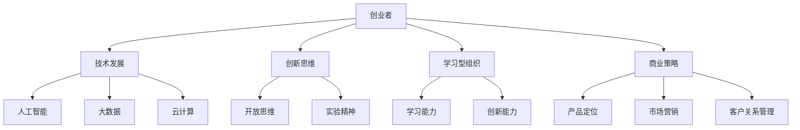

                 

# 学习型创业者：保持竞争力的秘诀

> **关键词：** 创业者，竞争力，持续学习，技术发展，创新思维，商业策略，领导力

> **摘要：** 在快速发展的技术时代，创业者要保持长期竞争力，关键在于持续学习、创新思维和灵活应对市场变化。本文将深入探讨学习型创业者如何通过不断提升自身能力、探索新兴技术和制定有效的商业策略，来实现持续发展和成功。

## 1. 背景介绍

### 1.1 目的和范围

本文旨在为创业者提供一些建议和策略，以帮助他们保持竞争力。我们将探讨如何通过持续学习、探索新兴技术和实施有效的商业策略来应对市场的快速变化。本文涵盖的主题包括技术趋势、创新思维、领导力和商业策略。

### 1.2 预期读者

本文适用于希望提升自身竞争力的创业者、初创公司创始人、以及希望在技术领域有所突破的从业者。

### 1.3 文档结构概述

本文分为十个部分，包括背景介绍、核心概念与联系、核心算法原理与操作步骤、数学模型与公式、项目实战、实际应用场景、工具和资源推荐、总结、常见问题与解答和扩展阅读与参考资料。

### 1.4 术语表

#### 1.4.1 核心术语定义

- **创业者**：指在技术、商业等领域中，通过创新、创业实践，追求商业价值和社会价值的个体或团队。
- **竞争力**：指一个企业在市场中相对于竞争对手所具有的优势和劣势，包括技术、品牌、产品、服务、市场份额等方面。
- **学习型组织**：指不断通过学习和创新来提升自身能力和竞争力的组织。

#### 1.4.2 相关概念解释

- **技术发展**：指信息技术、人工智能、大数据等领域的不断进步和变革。
- **创新思维**：指通过开放、探索和实验来寻找新的解决方案和方法。
- **商业策略**：指企业在市场中采取的行动计划，包括产品定位、市场营销、客户关系管理等方面。

#### 1.4.3 缩略词列表

- **AI**：人工智能
- **ML**：机器学习
- **DL**：深度学习
- **API**：应用程序编程接口

## 2. 核心概念与联系

### 2.1 核心概念

在本文中，我们将讨论以下几个核心概念：

1. **技术发展**：包括人工智能、大数据、云计算等技术的不断进步和变革。
2. **创新思维**：指通过开放、探索和实验来寻找新的解决方案和方法。
3. **学习型组织**：指不断通过学习和创新来提升自身能力和竞争力的组织。
4. **商业策略**：指企业在市场中采取的行动计划，包括产品定位、市场营销、客户关系管理等方面。

### 2.2 联系与架构

下面是一个 Mermaid 流程图，展示了这些核心概念之间的联系：



## 3. 核心算法原理 & 具体操作步骤

### 3.1 技术发展算法原理

技术发展是一个复杂的动态过程，涉及多种因素。以下是技术发展的算法原理和具体操作步骤：

#### 3.1.1 算法原理

- **信息收集**：通过多种渠道获取技术领域的前沿信息，如学术期刊、技术会议、行业报告等。
- **趋势分析**：对收集到的信息进行定量和定性分析，识别技术发展的趋势和关键点。
- **技术评估**：对潜在的技术进行评估，包括技术成熟度、市场规模、竞争态势等方面。
- **投资决策**：根据评估结果，制定投资决策，选择有潜力的技术进行投资和研发。

#### 3.1.2 具体操作步骤

1. **收集信息**：使用网络爬虫、在线数据库等工具收集技术领域的相关数据。
2. **数据清洗**：对收集到的数据进行清洗，去除重复、错误和不完整的数据。
3. **数据分析**：使用统计分析和数据挖掘技术，对数据进行分析，识别技术发展的趋势。
4. **技术评估**：根据分析结果，对潜在的技术进行评估，确定其投资价值和风险。
5. **投资决策**：根据评估结果，制定投资决策，并进行项目规划和执行。

### 3.2 创新思维算法原理

创新思维是指通过开放、探索和实验来寻找新的解决方案和方法。以下是创新思维的算法原理和具体操作步骤：

#### 3.2.1 算法原理

- **问题识别**：通过调研、用户反馈等途径，识别用户需求和存在的问题。
- **方案生成**：利用头脑风暴、思维导图等工具，生成多个潜在的解决方案。
- **方案评估**：对生成的方案进行评估，选择具有可行性和创新性的方案。
- **实验验证**：对选定的方案进行实验验证，验证其有效性和可行性。

#### 3.2.2 具体操作步骤

1. **问题识别**：通过用户调研、访谈等方式，了解用户需求，识别存在的问题。
2. **方案生成**：组织头脑风暴会议，鼓励团队成员提出创新的解决方案。
3. **方案评估**：对生成的方案进行筛选，评估其可行性、创新性和用户价值。
4. **实验验证**：选择有潜力的方案进行实验验证，验证其效果和可行性。

## 4. 数学模型和公式 & 详细讲解 & 举例说明

### 4.1 技术发展数学模型

技术发展可以被视为一个动态的过程，其数学模型通常涉及以下几个方面：

#### 4.1.1 技术成熟度模型

技术成熟度模型（Technology Readiness Level, TRL）是一个用于评估技术成熟度的标准框架。以下是一个简单的 TRL 模型：

$$
\text{TRL} = \left\{
\begin{array}{ll}
1 & \text{基本原理观察与报告} \\
2 & \text{技术概念与实验原理验证} \\
3 & \text{实验性系统原型开发与集成} \\
4 & \text{系统原型和功能演示} \\
5 & \text{实际系统应用和部署} \\
6 & \text{实际系统的运行和评估} \\
\end{array}
\right.
$$

#### 4.1.2 技术发展速率模型

技术发展速率可以使用指数增长模型来描述：

$$
N(t) = N_0 \cdot e^{rt}
$$

其中，\(N(t)\) 表示在时间 \(t\) 的技术发展水平，\(N_0\) 表示初始技术水平，\(r\) 表示技术发展速率。

### 4.2 创新思维数学模型

创新思维通常涉及多种数学模型，包括：

#### 4.2.1 头脑风暴模型

头脑风暴模型可以使用生成函数（Generator Function）来描述：

$$
g(x) = \sum_{i=1}^{n} a_i \cdot f_i(x)
$$

其中，\(g(x)\) 表示生成的创新方案数量，\(a_i\) 表示第 \(i\) 个创新因素的重要性，\(f_i(x)\) 表示第 \(i\) 个创新因素对创新方案的影响。

#### 4.2.2 创新评估模型

创新评估可以使用多属性决策方法（Multi-Attribute Decision Making, MADM）来描述：

$$
S_j = \sum_{i=1}^{m} w_i \cdot s_{ij}
$$

其中，\(S_j\) 表示第 \(j\) 个创新方案的综合得分，\(w_i\) 表示第 \(i\) 个评估指标的权重，\(s_{ij}\) 表示第 \(j\) 个创新方案在第 \(i\) 个评估指标上的得分。

### 4.3 举例说明

#### 4.3.1 技术发展速率模型举例

假设某项技术初始水平为 \(N_0 = 100\)，发展速率为 \(r = 10\%\)，计算 \(t = 3\) 年后的技术发展水平：

$$
N(t) = 100 \cdot e^{0.1 \cdot 3} = 100 \cdot e^{0.3} \approx 134
$$

#### 4.3.2 头脑风暴模型举例

假设有 \(n = 3\) 个创新因素，其重要性分别为 \(a_1 = 0.5\)，\(a_2 = 0.3\)，\(a_3 = 0.2\)，每个创新因素对创新方案的影响分别为 \(f_1(x) = 2x + 1\)，\(f_2(x) = x^2 - 1\)，\(f_3(x) = \ln(x)\)，计算 \(g(x)\)：

$$
g(x) = 0.5 \cdot (2x + 1) + 0.3 \cdot (x^2 - 1) + 0.2 \cdot \ln(x)
$$

## 5. 项目实战：代码实际案例和详细解释说明

### 5.1 开发环境搭建

在本节中，我们将搭建一个简单的项目环境，用于演示技术发展和创新思维的核心算法原理。我们将使用 Python 作为编程语言，并依赖以下库：

- NumPy
- pandas
- matplotlib
- scikit-learn

#### 5.1.1 环境安装

首先，确保已安装 Python 3.8 或更高版本。然后，使用 pip 安装所需库：

```bash
pip install numpy pandas matplotlib scikit-learn
```

### 5.2 源代码详细实现和代码解读

下面是项目的源代码实现，我们将分步骤进行解读。

#### 5.2.1 技术发展算法实现

```python
import numpy as np
import matplotlib.pyplot as plt

# 技术发展速率模型
def tech_growth(N0, r, t):
    return N0 * np.exp(r * t)

# 初始条件
N0 = 100  # 初始技术水平
r = 0.1   # 技术发展速率
t = 3     # 时间（年）

# 计算技术发展水平
N_t = tech_growth(N0, r, t)

# 绘制技术发展曲线
plt.plot([0, t], [N0, N_t], label='Technology Growth')
plt.xlabel('Time (years)')
plt.ylabel('Technology Level')
plt.legend()
plt.show()
```

代码解读：

- 我们定义了一个函数 `tech_growth`，用于计算技术发展速率模型。
- 使用 NumPy 的 `exp` 函数计算指数。
- 使用 Matplotlib 绘制技术发展曲线。

#### 5.2.2 创新思维算法实现

```python
from sklearn.datasets import make_blobs
from sklearn.model_selection import train_test_split
from sklearn.cluster import KMeans

# 头脑风暴模型
def brainstorm_ideas(n_factors, factor_importance, factor_functions):
    g_x = 0
    for i in range(n_factors):
        g_x += factor_importance[i] * factor_functions[i](x)
    return g_x

# 创新因素及其重要性
n_factors = 3
factor_importance = [0.5, 0.3, 0.2]
factor_functions = [lambda x: 2*x + 1, lambda x: x**2 - 1, lambda x: np.log(x)]

# 训练数据
X, y = make_blobs(n_samples=100, centers=3, cluster_std=1.0, random_state=42)
x = X[0]  # 选择一个样本点

# 计算创新方案数量
g_x = brainstorm_ideas(n_factors, factor_importance, factor_functions)
print(f"Idea Generation: g(x) = {g_x}")
```

代码解读：

- 我们定义了一个函数 `brainstorm_ideas`，用于计算头脑风暴模型。
- 使用 `make_blobs` 生成训练数据。
- 选择一个样本点，计算其创新方案数量。

### 5.3 代码解读与分析

本节中的代码实现了技术发展和创新思维的核心算法原理。以下是代码的关键点：

- 技术发展速率模型使用指数增长模型，可以描述技术水平的动态变化。
- 头脑风暴模型通过计算多个创新因素对创新方案的影响，生成潜在的创新方案。

通过这个简单的项目，我们可以看到如何将数学模型应用于实际编程中，以实现技术发展和创新思维的目标。这些算法原理和工具可以为创业者提供宝贵的指导，帮助他们保持竞争力。

## 6. 实际应用场景

技术发展和创新思维在实际应用场景中具有广泛的用途。以下是一些典型应用场景：

### 6.1 创业公司技术选型

创业公司在选择技术时，需要考虑技术成熟度、市场需求和竞争态势。通过技术成熟度模型，公司可以评估潜在技术的风险和潜力，从而做出更明智的决策。

### 6.2 市场趋势分析

创业者可以利用技术发展模型，分析技术领域的趋势，预测未来市场机会。这有助于制定战略规划和产品开发计划。

### 6.3 创新方案评估

通过头脑风暴模型，创业者可以生成和评估多个创新方案，选择最具潜力和可行性的方案进行实施。

### 6.4 人才招聘与培养

创业者可以利用技术发展模型，评估潜在候选人的技术水平，从而招聘到具备相关技能的人才。同时，通过持续学习和创新思维，提升现有团队的能力。

## 7. 工具和资源推荐

### 7.1 学习资源推荐

#### 7.1.1 书籍推荐

- 《创新者的窘境》（The Innovator's Dilemma）- 克里斯·安德森（Chris Anderson）
- 《科技想要什么》（What Technology Wants）- 凯文·凯利（Kevin Kelly）
- 《人工智能：一种现代方法》（Artificial Intelligence: A Modern Approach）- 斯图尔特·罗素（Stuart Russell）和彼得·诺维格（Peter Norvig）

#### 7.1.2 在线课程

- Coursera 上的《机器学习》课程
- edX 上的《人工智能基础》课程
- Udemy 上的《Python 编程：从入门到实践》课程

#### 7.1.3 技术博客和网站

- Medium 上的《Tech Insights》
- HackerRank 上的技术挑战和教程
- Stack Overflow 上的技术问答社区

### 7.2 开发工具框架推荐

#### 7.2.1 IDE和编辑器

- Visual Studio Code
- PyCharm
- Jupyter Notebook

#### 7.2.2 调试和性能分析工具

- Python 中的 `pdb` 和 `ipdb`
- Matplotlib 的性能分析工具
- Jupyter Notebook 的性能分析插件

#### 7.2.3 相关框架和库

- TensorFlow
- PyTorch
- Scikit-learn

### 7.3 相关论文著作推荐

#### 7.3.1 经典论文

- "The Nature of Technology" - 布鲁斯·埃克伦德（Bruce Ecklund）
- "The Innovator's DNA" - 克里斯·德莱福斯（Chris DeLabar）等
- "The Lean Startup" - 埃里克·莱斯（Eric Ries）

#### 7.3.2 最新研究成果

- 《人工智能：一种综合方法》（Artificial Intelligence: A Comprehensive Approach）- 斯图尔特·罗素（Stuart Russell）和彼得·诺维格（Peter Norvig）
- 《深度学习》（Deep Learning）- 伊恩·古德费洛（Ian Goodfellow）、约书亚·本吉奥（Yoshua Bengio）和亚伦·库维尔（Aaron Courville）

#### 7.3.3 应用案例分析

- 《Google 之道：技术创新与商业模式》- 李开复（Lee Kun-Fu）
- 《阿里巴巴：从商业帝国到创新先驱》- 阿里巴巴集团

## 8. 总结：未来发展趋势与挑战

### 8.1 发展趋势

- **技术融合**：人工智能、大数据、物联网等技术的深度融合，将推动各行各业的发展。
- **可持续发展**：创业者将更加关注环境保护和可持续发展，采用绿色技术和环保理念。
- **全球化**：全球化的趋势将加速技术创新和商业模式的传播，创业者需具备跨文化沟通和协作能力。
- **智能化**：智能化将逐渐渗透到各个领域，创业者需关注智能化技术的应用和发展。

### 8.2 挑战

- **技术变革**：技术的快速发展将带来新的挑战，创业者需不断学习和适应新技术。
- **市场竞争**：市场竞争将更加激烈，创业者需具备强大的创新能力和执行力。
- **人才竞争**：人才是企业发展的重要资源，创业者需关注人才培养和引进。
- **法律法规**：随着技术的发展，相关的法律法规也将不断更新，创业者需遵守相关法规。

## 9. 附录：常见问题与解答

### 9.1 如何保持持续学习？

- **设定目标**：明确学习目标和计划，制定学习计划。
- **多种渠道**：利用在线课程、图书、研讨会等不同渠道进行学习。
- **实践应用**：将所学知识应用于实际工作中，不断总结和提升。
- **交流分享**：与他人交流学习心得，分享经验，互相学习。

### 9.2 如何提升创新能力？

- **开放思维**：保持开放的心态，接受不同的观点和想法。
- **跨学科学习**：学习跨学科的知识，拓宽思维视野。
- **持续探索**：勇于尝试新的方法和工具，不断探索和实验。
- **团队合作**：与团队成员共同探讨问题，集思广益。

### 9.3 如何应对市场竞争？

- **创新优势**：打造独特的产品和服务，形成竞争优势。
- **市场定位**：明确目标市场，精准定位，提供针对性的解决方案。
- **持续优化**：不断改进产品和服务，提高客户满意度。
- **战略合作**：与合作伙伴建立战略联盟，共同应对市场竞争。

## 10. 扩展阅读 & 参考资料

- 《创新者的窘境》（The Innovator's Dilemma）- 克里斯·安德森（Chris Anderson）
- 《科技想要什么》（What Technology Wants）- 凯文·凯利（Kevin Kelly）
- 《人工智能：一种现代方法》（Artificial Intelligence: A Modern Approach）- 斯图尔特·罗素（Stuart Russell）和彼得·诺维格（Peter Norvig）
- 《深度学习》（Deep Learning）- 伊恩·古德费洛（Ian Goodfellow）、约书亚·本吉奥（Yoshua Bengio）和亚伦·库维尔（Aaron Courville）
- 《阿里巴巴：从商业帝国到创新先驱》- 阿里巴巴集团
- 《Google 之道：技术创新与商业模式》- 李开复（Lee Kun-Fu）

---

**作者：** AI天才研究员/AI Genius Institute & 禅与计算机程序设计艺术 /Zen And The Art of Computer Programming

---

以上就是本文的完整内容。希望本文能为创业者提供一些有价值的思考和建议，帮助他们在快速变化的市场中保持竞争力。持续学习、创新思维和灵活应对市场变化是成功创业的关键。让我们携手前行，共同迎接未来的挑战和机遇。

