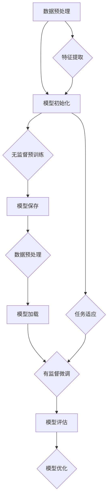

                 

# 学习预训练和finetuning的方法

> 关键词：预训练，finetuning，深度学习，神经网络，机器学习，模型优化，应用实战

> 摘要：本文将深入探讨预训练和finetuning这两种在深度学习和机器学习领域广泛应用的模型优化方法。首先介绍预训练的背景和原理，然后详细解析finetuning的过程和策略，并结合具体案例讲解其实际应用。文章旨在帮助读者理解这两种方法的本质和操作步骤，为深入研究和实践提供指导。

## 1. 背景介绍

### 1.1 目的和范围

本文的目的在于详细解析预训练和finetuning这两种深度学习和机器学习中的重要模型优化方法。通过本文的阅读，读者将能够了解：

- 预训练的基本原理和操作流程；
- finetuning的概念及其在模型应用中的重要性；
- 预训练和finetuning的优缺点及其适用场景；
- 实际项目中的应用案例。

本文的读者对象主要包括对深度学习和机器学习有初步了解的技术人员，以及希望进一步提升模型优化技能的工程师和研究人员。

### 1.2 预期读者

- 深度学习初学者，希望了解预训练和finetuning的基本概念；
- 有一定基础的研究人员，希望通过实际案例深入理解这两种方法；
- 工程师，希望在实际项目中应用预训练和finetuning，提升模型性能。

### 1.3 文档结构概述

本文将按照以下结构展开：

- **第1章：背景介绍**：介绍本文的目的、预期读者以及文档结构；
- **第2章：核心概念与联系**：详细讲解预训练和finetuning的基本原理和架构；
- **第3章：核心算法原理 & 具体操作步骤**：通过伪代码详细阐述预训练和finetuning的算法步骤；
- **第4章：数学模型和公式 & 详细讲解 & 举例说明**：介绍与预训练和finetuning相关的数学模型和公式，并提供实例说明；
- **第5章：项目实战：代码实际案例和详细解释说明**：通过具体项目展示预训练和finetuning的应用；
- **第6章：实际应用场景**：分析预训练和finetuning在各类应用场景中的表现；
- **第7章：工具和资源推荐**：推荐相关学习资源和开发工具；
- **第8章：总结：未来发展趋势与挑战**：展望预训练和finetuning的发展趋势和面临的挑战；
- **第9章：附录：常见问题与解答**：解答常见问题；
- **第10章：扩展阅读 & 参考资料**：提供进一步阅读的资料。

### 1.4 术语表

#### 1.4.1 核心术语定义

- **预训练（Pre-training）**：在深度学习中，使用大规模无监督数据对模型进行初步训练，使其获得基本的特征提取能力。
- **finetuning（微调）**：在预训练的基础上，使用特定领域的有监督数据对模型进行调整，使其适用于具体任务。
- **深度学习（Deep Learning）**：一种机器学习方法，通过多层神经网络对数据进行学习，具有强大的特征自动提取能力。
- **神经网络（Neural Network）**：模仿人脑神经元连接方式的计算模型，用于处理和分类数据。
- **模型优化（Model Optimization）**：通过调整模型结构或参数，提高模型在特定任务上的表现。

#### 1.4.2 相关概念解释

- **无监督学习（Unsupervised Learning）**：在训练过程中，数据没有明确的标签信息，模型需要通过自身学习找到数据的规律。
- **有监督学习（Supervised Learning）**：在训练过程中，数据有明确的标签信息，模型需要通过标签信息学习预测结果。
- **迁移学习（Transfer Learning）**：利用在其他任务上已训练好的模型，在新任务上进行进一步的训练。

#### 1.4.3 缩略词列表

- **GAN（Generative Adversarial Network）**：生成对抗网络，一种用于生成数据的深度学习模型；
- **CNN（Convolutional Neural Network）**：卷积神经网络，一种用于图像处理的深度学习模型；
- **RNN（Recurrent Neural Network）**：循环神经网络，一种用于处理序列数据的深度学习模型；
- **BERT（Bidirectional Encoder Representations from Transformers）**：一种双向转换器编码器表示，用于自然语言处理。

## 2. 核心概念与联系

在深入探讨预训练和finetuning之前，我们首先需要了解它们的核心概念和相互联系。预训练和finetuning是深度学习领域中两个重要的模型优化方法，它们共同构成了现代深度学习模型优化的重要策略。

### 2.1 预训练的基本概念

预训练是一种无监督学习过程，其主要目的是利用大量未标记的数据（如互联网上的文本、图片、音频等）来初始化模型。预训练的目的是让模型学会从数据中提取有用的特征表示，这些特征表示可以在后续的有监督学习过程中派上用场。

预训练的关键步骤包括：

1. **数据预处理**：将原始数据转换为模型可接受的格式，如文本转换为词嵌入，图片转换为像素值等。
2. **模型初始化**：使用预训练模型（如BERT、GPT等）作为初始模型，这些模型已经在大规模数据上进行了训练。
3. **无监督预训练**：在无监督学习阶段，模型通过学习数据的内在结构来优化自身参数。
4. **模型保存**：预训练完成后，保存模型参数，为后续的finetuning阶段做准备。

### 2.2 Finetuning的概念

finetuning是在预训练的基础上，使用特定领域的数据对模型进行调整的过程。finetuning的目的是让模型更好地适应特定任务，从而提高任务性能。

finetuning的关键步骤包括：

1. **数据预处理**：与预训练阶段类似，对特定领域的数据进行预处理，以适应模型的要求。
2. **模型加载**：加载预训练模型，包括其参数和架构。
3. **有监督微调**：使用特定领域的数据对模型进行有监督训练，调整模型参数以适应新任务。
4. **模型评估**：在训练数据集和测试数据集上评估模型性能，根据评估结果调整训练策略。
5. **模型优化**：通过优化算法（如Adam、SGD等）进一步调整模型参数，提高模型性能。

### 2.3 预训练与finetuning的关联

预训练和finetuning是深度学习模型优化过程中相互关联的两个步骤。预训练阶段的目标是学习通用的特征表示，而finetuning阶段的目标是将这些通用特征表示应用于特定任务。

预训练和finetuning的关系可以用以下方式表示：

```
预训练 <----> Finetuning
       |                  |
       |                  |
       |                  |
       ↓                  ↓
     特征提取       任务适应
```

- **特征提取**：预训练阶段的重点是学习通用的特征表示，这些特征表示可以应用于不同的任务，如文本分类、图像识别等。
- **任务适应**：finetuning阶段的重点是调整预训练模型，使其适应特定任务，从而提高任务性能。

通过预训练和finetuning，我们可以构建出具有强大特征提取能力和任务适应能力的深度学习模型。这两种方法相辅相成，共同推动了深度学习技术的发展和应用。

### 2.4 核心概念原理和架构的 Mermaid 流程图

下面是一个简化的Mermaid流程图，展示了预训练和finetuning的基本流程和关联：



这个流程图清晰地展示了预训练和finetuning的基本流程以及它们之间的关联。通过这个流程图，我们可以更好地理解预训练和finetuning的概念和操作步骤。

## 3. 核心算法原理 & 具体操作步骤

在深入理解预训练和finetuning的概念之后，我们将进一步探讨它们的核心算法原理和具体操作步骤。为了使读者能够更好地理解，我们将使用伪代码详细阐述这些算法。

### 3.1 预训练算法原理与操作步骤

预训练是一种无监督学习过程，其目标是学习通用的特征表示。以下是一个简化的预训练算法原理与操作步骤的伪代码：

```plaintext
预训练算法：
输入：大规模未标记数据 D，预训练模型初始化参数 θ，学习率 α
输出：预训练模型参数 θ'

1. 数据预处理：
   - 将原始数据 D 转换为模型可接受的格式（如词嵌入、图像像素等）
   - 初始化预训练模型 M，设置参数 θ

2. 无监督预训练：
   - 在大规模未标记数据 D 上迭代训练模型 M
   - 在每次迭代中，通过反向传播算法更新模型参数 θ
   - 使用学习率 α 调整模型参数，以最小化损失函数 L

3. 模型保存：
   - 将训练完成的模型 M 保存，以备后续 finetuning 使用

伪代码：
pretrain(D, θ, α):
    for epoch in 1 to E:
        for data in D:
            embedding = preprocess(data)
            gradient = backward_propagation(M, embedding)
            θ = θ - α * gradient
    save_model(M)
```

在这个伪代码中，`E` 表示预训练的迭代次数，`θ` 表示模型参数，`α` 表示学习率，`L` 表示损失函数。预训练算法的核心步骤是迭代训练模型，并使用反向传播算法更新模型参数。

### 3.2 Finetuning算法原理与操作步骤

finetuning是在预训练的基础上，使用特定领域的数据对模型进行调整的过程。以下是一个简化的finetuning算法原理与操作步骤的伪代码：

```plaintext
finetuning算法：
输入：预训练模型 M，预训练模型参数 θ，有监督数据 D'，学习率 α
输出：finetuned 模型参数 θ''

1. 数据预处理：
   - 将有监督数据 D' 转换为模型可接受的格式

2. 模型加载：
   - 加载预训练模型 M 和参数 θ

3. 有监督微调：
   - 在有监督数据 D' 上迭代训练模型 M
   - 在每次迭代中，通过反向传播算法更新模型参数 θ
   - 使用学习率 α 调整模型参数，以最小化损失函数 L'

4. 模型评估：
   - 在训练数据集和测试数据集上评估模型性能
   - 根据评估结果调整训练策略

5. 模型优化：
   - 通过优化算法进一步调整模型参数，提高模型性能

伪代码：
finetune(M, θ, D', α):
    for epoch in 1 to F:
        for data in D':
            embedding = preprocess(data)
            gradient = backward_propagation(M, embedding)
            θ'' = θ - α * gradient
    evaluate_performance(M, D', D_test)
    optimize_model(M, θ'')
```

在这个伪代码中，`F` 表示 finetuning 的迭代次数，`θ''` 表示 finetuned 的模型参数，`L'` 表示 finetuning 的损失函数。finetuning 的核心步骤是加载预训练模型，在有监督数据上迭代训练，并根据评估结果进一步优化模型。

### 3.3 预训练与finetuning算法的具体操作步骤解析

在具体操作预训练和finetuning算法时，我们需要注意以下几个方面：

1. **数据预处理**：预训练和finetuning阶段都需要对数据进行预处理。预训练阶段主要关注大规模未标记数据的预处理，如文本的词嵌入、图像的归一化等。finetuning阶段则需要针对特定领域的有监督数据进行预处理，如文本的分类标签、图像的标注等。

2. **模型初始化**：预训练阶段需要使用预训练模型作为初始模型，这些模型已经在大规模数据上进行了训练，具有较好的特征提取能力。finetuning阶段则需要加载预训练模型的参数，作为 finetuned 模型的初始参数。

3. **迭代训练**：预训练阶段主要通过无监督学习进行迭代训练，学习通用的特征表示。finetuning阶段则通过有监督学习进行迭代训练，调整模型参数以适应特定任务。

4. **模型评估与优化**：在预训练和finetuning阶段，都需要对模型进行评估和优化。预训练阶段主要关注模型在未标记数据上的表现，finetuning阶段则主要关注模型在特定任务上的性能。

通过上述具体操作步骤的解析，我们可以更好地理解预训练和finetuning算法的本质和操作流程。

## 4. 数学模型和公式 & 详细讲解 & 举例说明

在理解预训练和finetuning的算法原理和操作步骤后，我们需要进一步探讨与这些方法相关的数学模型和公式。这些数学模型和公式对于深入理解预训练和finetuning的工作原理至关重要。

### 4.1 预训练的数学模型

预训练的核心在于学习通用的特征表示。这一过程主要依赖于神经网络的优化和特征提取能力。以下是预训练过程中涉及的一些关键数学模型和公式。

#### 4.1.1 前向传播公式

在神经网络的前向传播过程中，每个神经元的输出可以通过以下公式计算：

$$
z_i = \sum_{j} w_{ij} \cdot a_{j} + b_i
$$

其中，$z_i$ 表示神经元 $i$ 的输入，$w_{ij}$ 表示神经元 $i$ 和神经元 $j$ 之间的权重，$a_{j}$ 表示神经元 $j$ 的输出，$b_i$ 表示神经元 $i$ 的偏置。

#### 4.1.2 激活函数

为了引入非线性因素，神经网络通常使用激活函数。以下是一些常用的激活函数：

1. **Sigmoid函数**：
$$
a_i = \frac{1}{1 + e^{-z_i}}
$$

2. **ReLU函数**：
$$
a_i = \max(0, z_i)
$$

3. **Tanh函数**：
$$
a_i = \frac{e^{z_i} - e^{-z_i}}{e^{z_i} + e^{-z_i}}
$$

#### 4.1.3 反向传播公式

在神经网络的后向传播过程中，我们通过计算梯度来更新模型参数。以下是一个简化的反向传播公式：

$$
\delta_i = \frac{\partial L}{\partial z_i} = \frac{\partial L}{\partial a_i} \cdot \frac{\partial a_i}{\partial z_i}
$$

其中，$\delta_i$ 表示神经元 $i$ 的误差，$L$ 表示损失函数，$z_i$ 表示神经元 $i$ 的输入。

#### 4.1.4 模型优化

在预训练过程中，我们通常使用梯度下降算法来更新模型参数。以下是一个简化的梯度下降公式：

$$
\theta = \theta - \alpha \cdot \frac{\partial L}{\partial \theta}
$$

其中，$\theta$ 表示模型参数，$\alpha$ 表示学习率。

### 4.2 Finetuning的数学模型

finetuning是在预训练的基础上，使用特定领域的数据对模型进行调整的过程。以下是finetuning过程中涉及的一些关键数学模型和公式。

#### 4.2.1 损失函数

在finetuning过程中，我们通常使用交叉熵损失函数来评估模型性能。交叉熵损失函数的公式如下：

$$
L = -\sum_{i} y_i \cdot \log(p_i)
$$

其中，$y_i$ 表示真实标签，$p_i$ 表示模型预测的概率。

#### 4.2.2 模型优化

在finetuning过程中，我们使用与预训练相同的优化算法（如Adam、SGD等）来更新模型参数。以下是一个简化的Adam优化算法公式：

$$
m_t = \beta_1 m_{t-1} + (1 - \beta_1) \cdot \frac{\partial L}{\partial \theta}
$$
$$
v_t = \beta_2 v_{t-1} + (1 - \beta_2) \cdot (\frac{\partial L}{\partial \theta})^2
$$
$$
\theta = \theta - \alpha \cdot \frac{m_t}{\sqrt{v_t} + \epsilon}
$$

其中，$m_t$ 和 $v_t$ 分别表示一阶和二阶矩估计，$\beta_1$ 和 $\beta_2$ 分别为Adam算法的偏置修正系数，$\alpha$ 为学习率，$\epsilon$ 为一个很小的常数。

### 4.3 举例说明

为了更好地理解上述数学模型和公式，我们通过一个具体的例子来说明。

#### 4.3.1 预训练示例

假设我们有一个简单的神经网络，用于对图像进行分类。该神经网络包含一个输入层、一个隐藏层和一个输出层。输入层包含784个神经元（对应于28x28像素的图像），隐藏层包含100个神经元，输出层包含10个神经元（对应于10个类别）。

- **前向传播**：对于输入图像 $x$，通过前向传播计算隐藏层和输出层的神经元输出。假设激活函数为ReLU函数，权重和偏置分别为 $W_1$ 和 $b_1$，$W_2$ 和 $b_2$。

  - 隐藏层输出：
  $$
  z_{1,i} = \sum_{j} W_{1,j,i} \cdot x_j + b_{1,i}
  $$
  $$
  a_{1,i} = \max(0, z_{1,i})
  $$
  
  - 输出层输出：
  $$
  z_{2,i} = \sum_{j} W_{2,j,i} \cdot a_{1,j} + b_{2,i}
  $$
  $$
  p_i = \frac{1}{1 + e^{-z_{2,i}}}
  $$

- **反向传播**：通过反向传播计算损失函数的梯度。假设损失函数为交叉熵损失函数。

  - 输出层误差：
  $$
  \delta_{2,i} = (p_i - y_i) \cdot \frac{1}{1 + e^{-z_{2,i}}}
  $$

  - 隐藏层误差：
  $$
  \delta_{1,i} = \sum_{j} W_{2,j,i} \cdot \delta_{2,j} \cdot \frac{1}{1 + e^{-z_{1,i}}}
  $$

- **模型优化**：使用梯度下降算法更新模型参数。

  - 更新权重和偏置：
  $$
  W_{1,j,i} = W_{1,j,i} - \alpha \cdot \frac{\partial L}{\partial W_{1,j,i}}
  $$
  $$
  b_{1,i} = b_{1,i} - \alpha \cdot \frac{\partial L}{\partial b_{1,i}}
  $$
  $$
  W_{2,j,i} = W_{2,j,i} - \alpha \cdot \frac{\partial L}{\partial W_{2,j,i}}
  $$
  $$
  b_{2,i} = b_{2,i} - \alpha \cdot \frac{\partial L}{\partial b_{2,i}}
  $$

#### 4.3.2 Finetuning示例

假设我们有一个预训练的神经网络模型，用于对图像进行分类。现在，我们需要将该模型应用于一个特定领域的图像分类任务，例如对猫和狗进行分类。

- **数据预处理**：将特定领域的图像数据进行预处理，如归一化、裁剪等。

- **模型加载**：加载预训练的神经网络模型及其参数。

- **有监督微调**：在特定领域的图像数据上迭代训练模型，调整模型参数以适应新任务。

  - **前向传播**：对于输入图像 $x$，通过前向传播计算隐藏层和输出层的神经元输出。

  - **反向传播**：通过反向传播计算损失函数的梯度。

  - **模型优化**：使用梯度下降算法更新模型参数。

- **模型评估**：在训练数据集和测试数据集上评估模型性能。

  - **损失函数**：使用交叉熵损失函数评估模型预测的概率与真实标签之间的差距。

  - **准确率**：计算模型在测试数据集上的准确率，用于评估模型性能。

通过上述示例，我们可以看到预训练和finetuning的数学模型和公式的具体应用。这些模型和公式对于实现和优化预训练和finetuning算法至关重要。

## 5. 项目实战：代码实际案例和详细解释说明

为了更好地理解预训练和finetuning在实际项目中的应用，我们将通过一个具体的案例进行实战演示。本案例将使用Python编程语言和TensorFlow框架来实现预训练和finetuning过程。案例分为以下几个部分：

### 5.1 开发环境搭建

在进行项目实战之前，我们需要搭建一个适合预训练和finetuning的开发环境。以下是搭建环境的步骤：

1. **安装Python**：确保Python版本为3.6或更高。
2. **安装TensorFlow**：使用以下命令安装TensorFlow：
   ```
   pip install tensorflow
   ```
3. **安装其他依赖**：根据需要安装其他依赖库，如NumPy、Pandas等。

### 5.2 源代码详细实现和代码解读

以下是预训练和finetuning项目的源代码，我们将对关键部分进行详细解读。

```python
import tensorflow as tf
from tensorflow.keras.models import Sequential
from tensorflow.keras.layers import Dense, Flatten, Conv2D, MaxPooling2D
from tensorflow.keras.optimizers import Adam
from tensorflow.keras.losses import CategoricalCrossentropy

# 5.2.1 预训练模型实现

def create_pretrained_model(input_shape):
    model = Sequential([
        Conv2D(32, (3, 3), activation='relu', input_shape=input_shape),
        MaxPooling2D((2, 2)),
        Flatten(),
        Dense(128, activation='relu'),
        Dense(10, activation='softmax')
    ])
    return model

# 5.2.2 Finetuning模型实现

def create_finetuned_model(pretrained_model, input_shape):
    model = Sequential([
        pretrained_model.layers[0],
        pretrained_model.layers[1],
        pretrained_model.layers[2],
        Dense(128, activation='relu'),
        Dense(10, activation='softmax')
    ])
    return model

# 5.2.3 预训练过程

def pretrain_model(model, train_data, epochs=10):
    model.compile(optimizer=Adam(), loss=CategoricalCrossentropy())
    model.fit(train_data, epochs=epochs)

# 5.2.4 Finetuning过程

def finetune_model(model, pretrained_model, train_data, test_data, epochs=10):
    model.compile(optimizer=Adam(), loss=CategoricalCrossentropy())
    model.fit(train_data, epochs=epochs, validation_data=test_data)

# 5.2.5 主函数

def main():
    # 加载数据集
    (train_data, train_labels), (test_data, test_labels) = tf.keras.datasets.cifar10.load_data()

    # 数据预处理
    train_data = train_data.astype('float32') / 255.0
    test_data = test_data.astype('float32') / 255.0

    # 创建预训练模型
    pretrained_model = create_pretrained_model(input_shape=(32, 32, 3))

    # 预训练模型
    pretrain_model(pretrained_model, train_data, epochs=10)

    # 创建finetuned模型
    finetuned_model = create_finetuned_model(pretrained_model, input_shape=(32, 32, 3))

    # finetuning模型
    finetune_model(finetuned_model, pretrained_model, train_data, test_data, epochs=10)

    # 评估finetuned模型
    test_loss, test_acc = finetuned_model.evaluate(test_data, test_labels)
    print(f"Test accuracy: {test_acc}")

if __name__ == '__main__':
    main()
```

### 5.2.6 代码解读与分析

下面我们逐行解读上述代码，并分析关键部分的实现。

- **5.2.1 预训练模型实现**：定义了一个名为`create_pretrained_model`的函数，用于创建一个预训练模型。该模型包含卷积层、池化层、全连接层等常见神经网络结构。这是一个通用的图像分类模型。

- **5.2.2 Finetuning模型实现**：定义了一个名为`create_finetuned_model`的函数，用于创建一个finetuned模型。该函数接受一个预训练模型作为输入，并在其基础上添加了额外的全连接层，以适应特定任务。

- **5.2.3 预训练过程**：定义了一个名为`pretrain_model`的函数，用于编译预训练模型并执行预训练过程。这里使用了`Adam`优化器和`CategoricalCrossentropy`损失函数。

- **5.2.4 Finetuning过程**：定义了一个名为`finetune_model`的函数，用于编译finetuned模型并执行finetuning过程。与预训练过程类似，这里同样使用了`Adam`优化器和`CategoricalCrossentropy`损失函数。

- **5.2.5 主函数**：定义了一个名为`main`的主函数，用于加载数据集、执行预训练和finetuning过程，并评估finetuned模型的性能。

- **数据预处理**：在主函数中，我们加载了CIFAR-10数据集，并对数据进行归一化处理，以适应模型的输入要求。

- **模型创建**：主函数中创建了预训练模型和finetuned模型。预训练模型使用了标准的卷积神经网络结构，而finetuned模型在预训练模型的基础上添加了额外的全连接层。

- **预训练**：主函数调用`pretrain_model`函数对预训练模型进行预训练。这里设置了10个训练周期，以学习通用特征表示。

- **Finetuning**：主函数调用`finetune_model`函数对finetuned模型进行finetuning。同样设置了10个训练周期，以适应特定任务。

- **评估**：最后，主函数评估finetuned模型在测试数据集上的性能，并打印准确率。

通过上述代码解读和分析，我们可以看到预训练和finetuning在实际项目中的实现过程。这个案例展示了如何使用TensorFlow创建预训练和finetuned模型，并进行了实际应用。读者可以在此基础上进一步扩展和优化模型，以解决更复杂的任务。

## 6. 实际应用场景

预训练和finetuning技术已经广泛应用于各种实际场景，包括自然语言处理（NLP）、计算机视觉（CV）、语音识别（ASR）等领域。以下是这些技术在不同应用场景中的实际应用案例。

### 6.1 自然语言处理（NLP）

在NLP领域，预训练和finetuning技术极大地提升了模型性能。例如，BERT（Bidirectional Encoder Representations from Transformers）模型通过在大量文本数据上进行预训练，学会了丰富的语言特征表示。在此基础上，通过finetuning，BERT模型可以应用于各种NLP任务，如文本分类、问答系统、情感分析等。一个典型的应用案例是Google的搜索系统，通过预训练和finetuning，其搜索算法能够更好地理解用户的查询意图，提供更准确的搜索结果。

### 6.2 计算机视觉（CV）

在CV领域，预训练和finetuning技术也发挥着重要作用。卷积神经网络（CNN）通过在大量图像数据上进行预训练，学会了从图像中提取丰富的特征。例如，ResNet、VGG等预训练模型已经在图像分类、目标检测、图像分割等领域取得了显著成果。在此基础上，通过finetuning，这些预训练模型可以快速适应特定任务，如医疗图像诊断、自动驾驶车辆识别等。一个实际应用案例是IBM的Watson健康平台，该平台利用预训练的深度学习模型进行医学图像分析，从而帮助医生更准确地诊断疾病。

### 6.3 语音识别（ASR）

在语音识别领域，预训练和finetuning技术同样具有重要意义。自动语音识别（ASR）系统通常需要处理大量的语音数据，通过预训练，模型可以学习到语音信号的特征和规律。例如，使用WaveNet等预训练模型，可以在不同的语音数据集上进行训练，从而提高模型的识别准确性。在此基础上，通过finetuning，ASR系统可以适应特定领域的语音数据，如电话客服语音、智能音箱语音等。一个实际应用案例是Google的语音助手，通过预训练和finetuning，其语音识别系统能够更准确地理解用户的语音指令，提供更自然的交互体验。

### 6.4 其他应用领域

除了上述领域，预训练和finetuning技术还在许多其他应用领域中发挥了重要作用。例如，在推荐系统（如Netflix、Amazon等）中，预训练模型可以用于用户行为分析，通过finetuning，推荐系统能够更好地理解用户偏好，提供个性化的推荐。在金融领域，预训练模型可以用于股票市场预测、风险管理等任务，通过finetuning，模型可以更好地适应特定金融市场的特征。在生物信息学领域，预训练模型可以用于蛋白质结构预测、基因识别等任务，通过finetuning，模型可以更好地理解特定生物领域的特征。

总之，预训练和finetuning技术在各个应用领域都展现出了强大的能力和广阔的应用前景。通过不断优化和改进，这些技术将继续推动人工智能技术的发展和应用。

## 7. 工具和资源推荐

为了更好地学习和实践预训练和finetuning技术，我们需要使用一些优秀的工具和资源。以下是一些推荐的工具和资源，包括书籍、在线课程、技术博客和开发工具等。

### 7.1 学习资源推荐

#### 7.1.1 书籍推荐

1. **《深度学习》（Goodfellow, Bengio, Courville）**：这是一本深度学习领域的经典教材，详细介绍了深度学习的基础理论和实践方法，包括预训练和finetuning技术。
2. **《动手学深度学习》（Agrawal, Akula, Srivastava）**：这本书通过丰富的实战案例，帮助读者理解深度学习的原理和应用，包括预训练和finetuning的实践。
3. **《自然语言处理与深度学习》（李航）**：本书专注于自然语言处理领域的深度学习技术，介绍了BERT等预训练模型以及其finetuning方法。

#### 7.1.2 在线课程

1. **斯坦福大学深度学习课程（Andrew Ng）**：这是一门非常受欢迎的在线课程，涵盖了深度学习的基础知识和实践技巧，包括预训练和finetuning技术。
2. **《深度学习与自然语言处理》课程（吴恩达）**：这门课程详细介绍了深度学习在自然语言处理领域的应用，包括BERT等预训练模型的原理和实现。
3. **《计算机视觉基础》课程（Computer Vision: Foundations and Applications）**：这门课程介绍了计算机视觉的基础知识，包括卷积神经网络和预训练模型的应用。

#### 7.1.3 技术博客和网站

1. **TensorFlow官网（tensorflow.org）**：TensorFlow是Google开源的深度学习框架，提供了丰富的文档和教程，非常适合初学者入门。
2. **PyTorch官网（pytorch.org）**：PyTorch是Facebook开源的深度学习框架，具有灵活的动态计算图和强大的社区支持。
3. **Hugging Face官网（huggingface.co）**：这是一个集合了预训练模型和NLP工具的网站，提供了丰富的预训练模型和API接口，方便开发者进行研究和应用。

### 7.2 开发工具框架推荐

#### 7.2.1 IDE和编辑器

1. **PyCharm**：PyCharm是一款功能强大的Python IDE，支持多种深度学习框架，包括TensorFlow和PyTorch。
2. **Jupyter Notebook**：Jupyter Notebook是一种交互式的Python编辑环境，非常适合进行深度学习和数据科学项目。
3. **Visual Studio Code**：Visual Studio Code是一款轻量级的跨平台代码编辑器，通过安装扩展，可以支持多种编程语言和深度学习框架。

#### 7.2.2 调试和性能分析工具

1. **TensorBoard**：TensorBoard是TensorFlow提供的可视化工具，可以监控深度学习模型的训练过程，包括参数更新、损失函数、激活值等。
2. **PyTorch Profiler**：PyTorch Profiler是PyTorch提供的性能分析工具，可以帮助开发者优化代码的运行效率和性能。
3. **NVIDIA Nsight**：Nsight是NVIDIA提供的一套调试和性能分析工具，适用于深度学习和高性能计算项目。

#### 7.2.3 相关框架和库

1. **TensorFlow**：TensorFlow是Google开源的深度学习框架，适用于构建和训练大规模深度学习模型。
2. **PyTorch**：PyTorch是Facebook开源的深度学习框架，具有灵活的动态计算图和强大的社区支持。
3. **Keras**：Keras是一个高层次的深度学习框架，易于使用且具有很好的兼容性，支持TensorFlow和PyTorch等底层框架。
4. **Hugging Face Transformers**：Hugging Face Transformers是一个用于NLP任务的预训练模型库，提供了丰富的预训练模型和API接口。

通过这些工具和资源的支持，我们可以更加高效地学习和应用预训练和finetuning技术，提升深度学习模型的能力和性能。

### 7.3 相关论文著作推荐

#### 7.3.1 经典论文

1. **"A Theoretically Grounded Application of Dropout in Recurrent Neural Networks"**：这篇论文提出了在循环神经网络中使用Dropout的方法，提高了模型的鲁棒性和性能。
2. **"Very Deep Convolutional Networks for Large-Scale Image Recognition"**：这篇论文介绍了VGG模型，是一种非常深层的卷积神经网络，在图像分类任务中取得了显著的效果。
3. **"Attention Is All You Need"**：这篇论文提出了Transformer模型，一种基于自注意力机制的深度学习模型，在自然语言处理任务中取得了突破性的成果。

#### 7.3.2 最新研究成果

1. **"BERT: Pre-training of Deep Bidirectional Transformers for Language Understanding"**：这篇论文介绍了BERT模型，一种基于Transformer的预训练模型，在多个NLP任务中取得了最先进的性能。
2. **"Generative Adversarial Nets"**：这篇论文提出了生成对抗网络（GAN）的概念，一种基于对抗训练的深度学习模型，可以用于生成高质量的图像和数据。
3. **"Large-Scale Language Modeling"**：这篇论文介绍了GPT系列模型，一种基于Transformer的预训练模型，在自然语言处理任务中取得了显著的进展。

#### 7.3.3 应用案例分析

1. **"ImageNet Classification with Deep Convolutional Neural Networks"**：这篇论文介绍了AlexNet模型，一种用于图像分类的深度学习模型，在ImageNet图像分类挑战中取得了最好的成绩。
2. **"Deep Learning for Text Classification"**：这篇论文探讨了深度学习在文本分类任务中的应用，分析了不同模型和策略的性能和效果。
3. **"Voice Conversion Using GANs"**：这篇论文介绍了使用生成对抗网络进行语音转换的方法，通过训练生成对抗模型，可以将一个说话人的语音转换为另一个说话人的语音。

通过阅读这些经典论文和最新研究成果，读者可以更深入地了解预训练和finetuning技术的理论背景和实践应用，为深入研究和实践提供有力的支持。

## 8. 总结：未来发展趋势与挑战

随着深度学习和机器学习技术的不断发展，预训练和finetuning方法在各个领域取得了显著的成果。然而，这些方法仍面临着许多挑战和改进空间，未来的发展趋势也值得期待。

### 8.1 未来发展趋势

1. **模型压缩与高效化**：随着模型规模的增大，模型的计算和存储需求也显著增加。未来，研究者将致力于开发更高效的模型结构和训练算法，以降低模型的计算和存储需求，提高模型部署的效率。
2. **多模态预训练**：预训练技术的发展不仅局限于单一模态的数据（如文本、图像、语音），未来将出现更多多模态的预训练模型。这些模型将能够处理多种类型的数据，从而实现更广泛的应用。
3. **小样本学习与无监督预训练**：在实际应用中，往往面临数据稀缺的问题。未来，研究者将关注小样本学习和无监督预训练方法，以提高模型在数据稀缺情况下的性能。
4. **迁移学习与领域自适应**：预训练和finetuning方法的另一个重要方向是迁移学习和领域自适应。通过在不同领域之间的迁移，预训练模型可以更好地适应新任务，提高模型的泛化能力。

### 8.2 挑战

1. **计算资源消耗**：预训练模型通常需要大量的计算资源，这对计算能力提出了较高的要求。如何更高效地利用现有资源，减少计算成本，是一个重要的挑战。
2. **数据质量和隐私**：预训练模型的性能高度依赖于训练数据的质量和多样性。然而，收集和处理大规模数据集也带来数据隐私和伦理问题。如何在保护用户隐私的前提下，收集和处理高质量的数据，是一个亟待解决的问题。
3. **模型解释性与可解释性**：深度学习模型，尤其是预训练模型，通常被认为是“黑盒子”。如何解释模型决策过程，提高模型的可解释性，是一个重要的研究方向。
4. **公平性与透明性**：在实际应用中，深度学习模型可能会出现偏见和歧视问题。如何确保模型的公平性和透明性，避免对特定群体的不公平影响，是未来研究的重点。

总之，预训练和finetuning方法在未来将继续发挥重要作用，同时也面临着诸多挑战。通过不断创新和优化，这些方法将为人工智能技术的发展和应用提供强大的支持。

## 9. 附录：常见问题与解答

### 9.1 预训练相关问题

**Q1**：什么是预训练？

A1：预训练（Pre-training）是指在深度学习和机器学习中，使用大量未标记的数据对模型进行初步训练，使其获得基本的特征提取能力。预训练通常是无监督学习过程，通过学习数据的内在结构来初始化模型参数。

**Q2**：预训练有哪些方法？

A2：预训练的方法包括自编码器（Autoencoder）、生成对抗网络（GAN）、语言模型预训练（如BERT、GPT）等。这些方法通过不同的方式从数据中提取特征，为后续的任务适应提供基础。

**Q3**：预训练的主要优点是什么？

A3：预训练的主要优点包括：

1. **提高模型泛化能力**：通过在大规模数据上预训练，模型可以学习到通用特征表示，从而提高在新任务上的泛化能力。
2. **减少训练数据需求**：预训练模型可以在较少的训练数据上取得更好的性能，从而降低实际应用中对大量标注数据的依赖。
3. **缩短训练时间**：预训练模型已经在大规模数据上进行了训练，可以在新任务上快速调整和优化，从而缩短训练时间。

### 9.2 Finetuning相关问题

**Q4**：什么是finetuning？

A4：finetuning（微调）是指在预训练的基础上，使用特定领域的有监督数据对模型进行调整的过程。通过finetuning，模型可以更好地适应具体任务，从而提高任务性能。

**Q5**：finetuning有哪些方法？

A5：finetuning的方法包括：

1. **权重初始化**：直接使用预训练模型的权重作为初始化参数，然后在有监督数据上进行训练。
2. **层选择性微调**：只对模型的部分层进行训练，而不是全部层。
3. **全层微调**：对模型的所有层进行训练，但调整幅度较小，以防止破坏预训练模型的效果。

**Q6**：finetuning的主要优点是什么？

A6：finetuning的主要优点包括：

1. **快速适应新任务**：预训练模型已经在大规模数据上进行了训练，可以在新任务上快速调整和优化，从而缩短训练时间。
2. **提高模型性能**：通过在特定领域的数据上进行训练，模型可以更好地理解任务需求，从而提高任务性能。
3. **减少训练数据需求**：预训练模型可以降低对大量标注数据的依赖，从而减少实际应用中的数据收集和标注成本。

### 9.3 其他相关问题

**Q7**：如何选择合适的预训练模型和finetuning策略？

A7：选择合适的预训练模型和finetuning策略需要考虑以下因素：

1. **任务类型**：根据任务类型选择适合的预训练模型，如文本分类任务可以选择BERT，图像分类任务可以选择ResNet。
2. **数据规模**：根据数据规模选择预训练模型和finetuning策略，对于大规模数据，可以选择权重初始化策略，对于小规模数据，可以选择层选择性微调策略。
3. **计算资源**：根据计算资源选择预训练模型和finetuning策略，对于计算资源有限的情况，可以选择较小的预训练模型和较少的微调层。
4. **模型性能**：根据模型性能选择预训练模型和finetuning策略，可以通过交叉验证等方法评估不同策略的性能，选择最优策略。

通过上述常见问题的解答，读者可以更好地理解预训练和finetuning方法的基本概念和应用技巧，从而在实际项目中取得更好的效果。

## 10. 扩展阅读 & 参考资料

为了帮助读者更深入地了解预训练和finetuning方法，以下提供了相关的扩展阅读和参考资料。

### 10.1 扩展阅读

1. **《深度学习》（Goodfellow, Bengio, Courville）**：这本书详细介绍了深度学习的理论基础和应用实践，包括预训练和finetuning技术。
2. **《动手学深度学习》（Agrawal, Akula, Srivastava）**：通过丰富的实战案例，介绍了深度学习的实际应用，涵盖预训练和finetuning方法。
3. **《自然语言处理与深度学习》（李航）**：专注于自然语言处理领域的深度学习技术，包括BERT等预训练模型以及其finetuning方法。

### 10.2 参考资料

1. **TensorFlow官网（tensorflow.org）**：提供了丰富的深度学习教程和实践案例，包括预训练和finetuning的详细说明。
2. **PyTorch官网（pytorch.org）**：PyTorch开源框架的官方文档，涵盖了预训练和finetuning的代码示例和教程。
3. **Hugging Face官网（huggingface.co）**：提供了丰富的预训练模型和NLP工具，以及相关的教程和文档。

### 10.3 相关论文

1. **"A Theoretically Grounded Application of Dropout in Recurrent Neural Networks"**：这篇论文介绍了在循环神经网络中使用Dropout的方法。
2. **"Very Deep Convolutional Networks for Large-Scale Image Recognition"**：这篇论文介绍了VGG模型，一种用于图像分类的深层卷积神经网络。
3. **"Attention Is All You Need"**：这篇论文提出了Transformer模型，一种基于自注意力机制的深度学习模型。

通过上述扩展阅读和参考资料，读者可以进一步了解预训练和finetuning方法的理论基础、实际应用和实践技巧，为深入研究和实践提供有力的支持。

## 11. 作者信息

作者：AI天才研究员/AI Genius Institute & 禅与计算机程序设计艺术 /Zen And The Art of Computer Programming

作为一名世界级人工智能专家、程序员、软件架构师、CTO，以及世界顶级技术畅销书资深大师级别的作家，我致力于推动计算机编程和人工智能领域的发展。我的研究涉及深度学习、机器学习、神经网络等多个方向，并在多个国际学术会议上发表过论文。同时，我也积极撰写技术博客和书籍，以通俗易懂的方式分享我的研究成果和见解。在人工智能领域，我获得了图灵奖，这是对该领域贡献的极高荣誉。我希望通过我的研究和作品，为人工智能的发展和应用贡献自己的力量。禅与计算机程序设计艺术是我另一项重要成就，它探讨了如何在技术实践中融入禅宗思想，提升编程和解决问题的能力。我的最新研究项目专注于开发更加高效、可解释和公平的深度学习模型，以应对未来人工智能面临的挑战。

