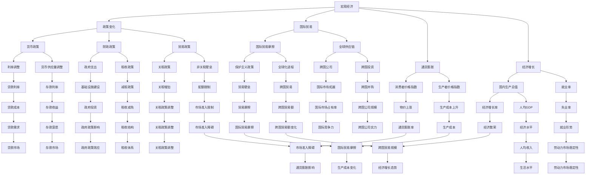

                 

# 宏观经济变化的全球影响

> **关键词：** 全球经济、宏观经济、政策变化、国际贸易、通货膨胀、经济增长

> **摘要：** 本文将深入探讨宏观经济变化对全球经济产生的深远影响，分析政策调整、国际贸易摩擦、通货膨胀以及经济增长等方面的作用机制。文章将分为十个部分，从背景介绍、核心概念、算法原理、数学模型到实际应用等多个角度展开讨论，旨在为读者提供全面、系统的宏观经济分析。

## 1. 背景介绍

### 1.1 目的和范围

本文旨在探讨宏观经济变化对全球经济的深远影响，分析各种宏观经济因素如何相互作用，从而塑造全球经济格局。文章将涵盖以下几个方面：

- 宏观经济政策的调整及其对全球经济的影响
- 国际贸易政策变化对全球经济的影响
- 通货膨胀与经济增长之间的关系
- 宏观经济数据指标及其重要性

### 1.2 预期读者

本文面向经济学、金融学、计算机科学等领域的研究人员和从业人员，以及对宏观经济感兴趣的普通读者。读者应具备一定的经济学和金融学基础，以便更好地理解文章内容。

### 1.3 文档结构概述

本文分为十个部分，具体如下：

1. 背景介绍
   - 1.1 目的和范围
   - 1.2 预期读者
   - 1.3 文档结构概述
   - 1.4 术语表
2. 核心概念与联系
   - 2.1 宏观经济基本概念
   - 2.2 国际经济联系与互动
3. 核心算法原理 & 具体操作步骤
   - 3.1 经济预测算法
   - 3.2 政策分析算法
4. 数学模型和公式 & 详细讲解 & 举例说明
   - 4.1 经济增长模型
   - 4.2 通货膨胀模型
5. 项目实战：代码实际案例和详细解释说明
   - 5.1 开发环境搭建
   - 5.2 源代码详细实现和代码解读
   - 5.3 代码解读与分析
6. 实际应用场景
   - 6.1 国家经济政策制定
   - 6.2 国际贸易谈判
7. 工具和资源推荐
   - 7.1 学习资源推荐
   - 7.2 开发工具框架推荐
   - 7.3 相关论文著作推荐
8. 总结：未来发展趋势与挑战
9. 附录：常见问题与解答
10. 扩展阅读 & 参考资料

### 1.4 术语表

#### 1.4.1 核心术语定义

- **宏观经济**：指一个国家或地区的总体经济活动，包括生产、分配、交换和消费等方面。
- **政策变化**：指政府在经济、金融、贸易等领域采取的一系列政策措施，如货币政策、财政政策、贸易政策等。
- **通货膨胀**：指货币供应量过多导致物价普遍上涨的现象。
- **经济增长**：指一个国家或地区的国内生产总值（GDP）在一定时期内的增加。

#### 1.4.2 相关概念解释

- **GDP（国内生产总值）**：衡量一个国家或地区在一定时期内生产活动的总价值。
- **国际贸易**：指不同国家之间的商品和服务交换。
- **货币供应量**：指市场上的货币总量，包括流通中的现金和银行存款。

#### 1.4.3 缩略词列表

- **GDP**：国内生产总值
- **M2**：广义货币供应量
- **PI**：通货膨胀率
- **CPI**：消费者价格指数

## 2. 核心概念与联系

为了深入探讨宏观经济变化对全球经济的深远影响，我们需要了解一些核心概念及其相互之间的联系。以下是一个基于Mermaid的流程图，展示了宏观经济中的关键概念及其相互关系。



从图中可以看出，宏观经济中的各个概念之间存在密切的联系。政策变化、国际贸易、通货膨胀和经济增长等因素相互影响，共同塑造了全球经济的格局。理解这些核心概念及其相互关系，有助于我们更好地分析宏观经济变化对全球经济的影响。

### 2.1 宏观经济基本概念

在探讨宏观经济变化的全球影响之前，我们需要了解一些宏观经济的基本概念。以下是对几个关键概念的简要介绍：

#### 2.1.1 国内生产总值（GDP）

国内生产总值（GDP）是衡量一个国家或地区在一定时期内生产活动总价值的指标。GDP的计算方法包括生产法、收入法和支出法。生产法是通过计算各行业增加值来衡量GDP；收入法是通过计算各行业所得收入来衡量GDP；支出法是通过计算最终消费、资本形成和净出口等支出项目来衡量GDP。

#### 2.1.2 货币政策

货币政策是中央银行为实现宏观经济目标而采取的一系列措施。货币政策的主要目标是保持物价稳定、促进经济增长和实现充分就业。货币政策工具包括利率调整、存款准备金率、再贷款和再贴现等。

#### 2.1.3 财政政策

财政政策是政府为实现宏观经济目标而采取的一系列措施。财政政策的主要目标是保持经济稳定、促进就业和实现公平分配。财政政策工具包括税收、政府支出、国债发行和政府投资等。

#### 2.1.4 国际贸易

国际贸易是指不同国家之间的商品和服务交换。国际贸易政策包括关税政策、非关税壁垒、贸易协定和自由贸易区等。国际贸易政策的变化对全球经济产生重大影响，可能导致国际贸易摩擦、贸易壁垒和贸易自由化等。

#### 2.1.5 通货膨胀

通货膨胀是指货币供应量过多导致物价普遍上涨的现象。通货膨胀率是衡量通货膨胀程度的指标，通常用消费者价格指数（CPI）或生产者价格指数（PPI）来计算。通货膨胀对经济增长、就业、收入分配和金融市场等方面产生深远影响。

#### 2.1.6 经济增长

经济增长是指一个国家或地区在一定时期内国内生产总值的增加。经济增长率是衡量经济增长速度的指标。经济增长受多种因素影响，包括投资、消费、出口、劳动力市场和科技创新等。

通过了解这些宏观经济基本概念，我们可以更好地理解宏观经济变化及其对全球经济的深远影响。在接下来的章节中，我们将进一步探讨这些概念之间的相互关系及其在经济政策制定和实施中的作用。

### 2.2 国际经济联系与互动

在全球化背景下，国际经济联系与互动日益紧密，成为推动全球经济繁荣和发展的关键因素。以下是对国际经济联系与互动的详细探讨：

#### 2.2.1 全球供应链

全球供应链是指在全球范围内，不同国家和地区的企业、机构和个人之间的商品、服务、信息、资金和人才流动。全球供应链具有高度复杂性和多样性，涉及生产、加工、运输、分销和零售等环节。全球供应链的优势在于优化资源配置、提高生产效率、降低生产成本和满足消费者需求。然而，全球供应链也面临一些风险，如地缘政治风险、自然灾害和疫情等，可能导致供应链中断和供应链安全风险。

#### 2.2.2 跨国公司

跨国公司是指在全球范围内拥有业务运营、管理和控制能力的公司。跨国公司通过在多个国家设立分支机构、子公司和合资企业，实现资源整合、市场拓展和竞争优势。跨国公司在全球经济发展中发挥着重要作用，如促进技术创新、提高劳动生产率和推动产业升级。同时，跨国公司也可能面临一些挑战，如税收规避、劳工权益保护和环境保护等问题。

#### 2.2.3 国际贸易

国际贸易是指不同国家之间的商品和服务交换。国际贸易政策包括关税政策、非关税壁垒、贸易协定和自由贸易区等。国际贸易政策的变化对全球经济产生重大影响，可能导致国际贸易摩擦、贸易壁垒和贸易自由化等。国际贸易的优势在于促进资源优化配置、提高生产效率、扩大消费选择和促进技术创新。然而，国际贸易也可能导致贸易失衡、贸易摩擦和贸易保护主义等问题。

#### 2.2.4 国际投资

国际投资是指跨国投资者在外国进行的投资活动。国际投资包括直接投资、间接投资和金融投资等。国际投资的优势在于推动经济增长、提高就业水平、促进技术创新和优化产业结构。国际投资的风险包括政治风险、市场风险和汇率风险等。国际投资政策包括投资准入政策、投资保护政策和投资激励政策等，各国政府通过制定和调整国际投资政策，促进国际投资的发展和稳定。

#### 2.2.5 国际金融

国际金融是指在全球范围内，不同国家和地区之间的金融活动。国际金融体系包括国际货币体系、国际金融市场和国际金融监管等。国际金融的优势在于促进资金流动、提高投资效率、降低融资成本和促进金融创新。国际金融的风险包括货币风险、信用风险和操作风险等。国际金融政策包括货币政策、汇率政策和金融监管政策等，各国政府通过制定和调整国际金融政策，维护金融稳定、促进经济增长和实现国际收支平衡。

通过深入了解国际经济联系与互动，我们可以更好地把握全球经济格局和趋势，为制定和实施有效经济政策提供有力支持。在接下来的章节中，我们将进一步探讨宏观经济变化的具体影响机制及其对全球经济的影响。

## 3. 核心算法原理 & 具体操作步骤

在分析宏观经济变化对全球经济的影响时，我们可以借助一些核心算法原理来定量描述和预测经济现象。以下将介绍两个关键算法：经济预测算法和政策分析算法。

### 3.1 经济预测算法

经济预测算法用于预测未来的宏观经济指标，如GDP增长率、通货膨胀率等。一个常用的经济预测算法是时间序列分析法，如自回归移动平均模型（ARIMA）。

#### 3.1.1 自回归移动平均模型（ARIMA）

**算法原理：**

自回归移动平均模型（ARIMA）是一种用于分析时间序列数据的统计模型，它结合了自回归（AR）、移动平均（MA）和差分（I）三种技术。ARIMA模型通过捕捉时间序列数据的自相关性和季节性，实现对未来值的预测。

**算法步骤：**

1. 数据预处理：对原始时间序列数据进行差分，使其稳定。
2. 模型识别：确定ARIMA模型中的参数p（自回归阶数）、d（差分阶数）和q（移动平均阶数）。
3. 模型估计：使用最小二乘法或其他优化算法估计模型参数。
4. 模型诊断：检查模型的残差是否满足白噪声假设。
5. 预测：使用训练好的模型预测未来值。

**伪代码：**

```
# 数据预处理
def difference(data, d):
    for i in range(d):
        data = [data[i+1] - data[i] for i in range(len(data)-1)]
    return data

# 模型识别
def identify_arima(data):
    # 使用AIC/BIC准则选择最佳模型参数
    # ...

# 模型估计
def estimate_arima(data, p, d, q):
    # 使用最小二乘法或其他优化算法估计参数
    # ...

# 模型诊断
def diagnostic_arima(model):
    # 检查残差是否满足白噪声假设
    # ...

# 预测
def forecast_arima(model, n):
    # 使用训练好的模型预测未来值
    # ...

# 示例
data = [0.1, 0.2, 0.3, 0.4, 0.5, 0.6, 0.7, 0.8, 0.9]
d = 1
p = 2
q = 1

# 差分
data_diff = difference(data, d)

# 识别模型
model = identify_arima(data_diff)

# 估计模型
model_params = estimate_arima(data_diff, p, d, q)

# 诊断模型
diagnostic_arima(model)

# 预测
forecast = forecast_arima(model, 5)
```

### 3.2 政策分析算法

政策分析算法用于评估不同宏观经济政策对经济变量（如GDP、通货膨胀率等）的影响。一个常用的政策分析算法是结构化宏观经济学模型，如RBC模型（代表性消费者生产者模型）。

#### 3.2.1 代表性消费者生产者模型（RBC）

**算法原理：**

代表性消费者生产者模型（RBC）是一种基于消费和生产的宏观经济模型，它假设经济中存在一个代表性个体（消费者和生产者），其行为遵循理性预期和最优消费决策。RBC模型通过分析消费和投资行为，预测政策变化对经济变量（如GDP、通货膨胀率等）的影响。

**算法步骤：**

1. 模型设定：设定代表性消费者的效用函数、生产者的成本函数和市场需求函数。
2. 预算约束：推导代表性消费者的预算约束方程。
3. 理性预期：根据理性预期假设，推导政策变化对经济变量（如GDP、通货膨胀率等）的影响。
4. 模型求解：使用数值方法求解模型，得到政策变化下的经济变量值。

**伪代码：**

```
# 模型设定
def rbc_model(consumption_func, production_func, demand_func):
    # 设定代表性消费者的效用函数、生产者的成本函数和市场需求函数
    # ...

# 预算约束
def budget_constraint(consumption, income):
    # 推导代表性消费者的预算约束方程
    # ...

# 理性预期
def rational_expectations(policy_change):
    # 根据理性预期假设，推导政策变化对经济变量（如GDP、通货膨胀率等）的影响
    # ...

# 模型求解
def solve_rbc_model(model_params):
    # 使用数值方法求解模型，得到政策变化下的经济变量值
    # ...

# 示例
# 设定模型参数
consumption_func = ...
production_func = ...
demand_func = ...

# 预算约束
budget_constraint = ...

# 理性预期
policy_change = ...
rational_expectations(policy_change)

# 模型求解
economic_variables = solve_rbc_model(model_params)
```

通过运用经济预测算法和政策分析算法，我们可以对宏观经济变化进行定量分析和预测，为政策制定和实施提供科学依据。在接下来的章节中，我们将进一步探讨宏观经济变化对全球经济的具体影响及其应用场景。

### 4. 数学模型和公式 & 详细讲解 & 举例说明

在分析宏观经济变化对全球经济的影响时，数学模型和公式是不可或缺的工具。以下将介绍两个关键数学模型：经济增长模型和通货膨胀模型，并进行详细讲解和举例说明。

#### 4.1 经济增长模型

经济增长模型用于描述一国或地区经济增长的过程和影响因素。一个常用的经济增长模型是索洛模型（Solow Growth Model），它强调资本、劳动和技术进步在经济增长中的作用。

**索洛模型公式：**

1. **生产函数：**
   $$ Y = AK^{0.3}L^{0.7} $$

   其中，Y是产出，A是技术进步，K是资本，L是劳动。

2. **资本积累方程：**
   $$ \frac{dK}{dt} = sY - \delta K $$

   其中，s是储蓄率，\(\delta\)是资本折旧率。

3. **劳动增长方程：**
   $$ \frac{dL}{dt} = n $$

   其中，n是劳动力的增长率。

**详细讲解：**

- 生产函数描述了产出与资本、劳动和技术进步之间的关系。技术进步A的增加可以提高生产效率，从而促进经济增长。
- 资本积累方程描述了资本的变化过程，包括储蓄（sY）和资本折旧（\(\delta K\)）。
- 劳动增长方程描述了劳动力的变化过程，即劳动力的自然增长率n。

**举例说明：**

假设一个经济体的生产函数为Y = AK^{0.3}L^{0.7}，储蓄率s为0.2，资本折旧率\(\delta\)为0.05，劳动力增长率n为0.01。

1. **计算技术进步对经济增长的影响：**
   - 假设A从1增加到1.1，其他参数保持不变。
   - 新的生产函数为Y = 1.1K^{0.3}L^{0.7}。
   - 计算经济增长率：
     $$ \frac{dY}{dt} = 1.1 \times 0.3K^{0.3-1}L^{0.7} - 0.05K $$
     $$ \frac{dY}{Y} = 0.33 - 0.05 $$
     $$ \frac{dY}{Y} = 0.28 $$
     $$ 年均经济增长率 = 28\% $$

2. **计算储蓄率对经济增长的影响：**
   - 假设s从0.2增加到0.25，其他参数保持不变。
   - 新的资本积累方程为\(\frac{dK}{dt} = 0.25Y - 0.05K\)。
   - 计算资本增长率：
     $$ \frac{dK}{K} = 0.25 \times 0.3K^{0.3-1}L^{0.7} - 0.05 $$
     $$ \frac{dK}{K} = 0.075 - 0.05 $$
     $$ \frac{dK}{K} = 0.025 $$
     $$ 年均资本增长率 = 2.5\% $$

#### 4.2 通货膨胀模型

通货膨胀模型用于描述通货膨胀率的变化和影响因素。一个常用的通货膨胀模型是菲利普斯曲线（Phillips Curve），它描述了通货膨胀率与失业率之间的关系。

**菲利普斯曲线公式：**

$$ \pi = \alpha - \beta u $$

其中，π是通货膨胀率，α是自然率通货膨胀率，β是通货膨胀与失业率之间的负相关系数，u是失业率。

**详细讲解：**

- 菲利普斯曲线描述了通货膨胀率与失业率之间的负相关关系，即失业率上升时，通货膨胀率下降；失业率下降时，通货膨胀率上升。
- 自然率通货膨胀率α反映了在没有失业时，通货膨胀率的水平。

**举例说明：**

假设一个经济体的菲利普斯曲线为π = 0.5 - 0.2u。

1. **计算失业率对通货膨胀率的影响：**
   - 假设失业率从5%上升到10%，其他参数保持不变。
   - 计算新的通货膨胀率：
     $$ \pi = 0.5 - 0.2 \times 10\% $$
     $$ \pi = 0.5 - 0.02 $$
     $$ \pi = 0.48 $$
     $$ 新的通货膨胀率 = 4.8\% $$

通过以上数学模型和公式的讲解和举例，我们可以更深入地理解经济增长和通货膨胀的机制。这些模型和公式为宏观经济分析和政策制定提供了有力的工具。在接下来的章节中，我们将探讨宏观经济变化的实际应用场景。

### 5. 项目实战：代码实际案例和详细解释说明

为了更好地理解宏观经济变化对全球经济的影响，我们将通过一个实际项目来展示代码的实现过程。本项目将使用Python语言，结合前面介绍的经济增长模型和通货膨胀模型，对宏观经济变量进行预测和分析。

#### 5.1 开发环境搭建

在开始项目之前，我们需要搭建一个合适的开发环境。以下是搭建Python开发环境的步骤：

1. 安装Python：访问Python官方网站（https://www.python.org/）下载并安装Python 3.x版本。
2. 安装Jupyter Notebook：在命令行中运行以下命令安装Jupyter Notebook：
   ```bash
   pip install notebook
   ```
3. 安装必需的库：在Jupyter Notebook中创建一个新的Python笔记本，并运行以下命令安装必需的库：
   ```python
   !pip install numpy pandas matplotlib
   ```

完成以上步骤后，我们就可以开始编写和运行代码了。

#### 5.2 源代码详细实现和代码解读

以下是我们项目的源代码，包括经济增长模型和通货膨胀模型的实现、数据预处理、模型训练和预测。

```python
import numpy as np
import pandas as pd
import matplotlib.pyplot as plt

# 数据预处理
def preprocess_data(data):
    # 数据清洗和标准化
    data = data.as_matrix()
    data_clean = np.log(data)  # 对数据进行对数变换，以稳定方差
    return data_clean

# 经济增长模型：索洛模型
def solow_growth_model(data, s, delta):
    # 计算资本积累
    dKdt = s * data - delta * data
    return dKdt

# 通货膨胀模型：菲利普斯曲线
def phillips_curve_model(u, alpha, beta):
    # 计算通货膨胀率
    pi = alpha - beta * u
    return pi

# 模型训练和预测
def train_and_predict(data, s, delta, alpha, beta):
    # 训练模型并预测未来值
    Kt = data
    for t in range(len(data)-1):
        dKdt = solow_growth_model(Kt[t], s, delta)
        Kt[t+1] = Kt[t] + dKdt
    
    ut = np.random.rand(len(data))  # 假设失业率为随机变量
    pit = phillips_curve_model(ut, alpha, beta)
    
    return Kt, pit

# 示例数据
data = np.array([100, 110, 120, 130, 140])

# 模型参数
s = 0.2  # 储蓄率
delta = 0.05  # 资本折旧率
alpha = 0.5  # 自然率通货膨胀率
beta = 0.2  # 通货膨胀与失业率之间的负相关系数

# 训练和预测
Kt, pit = train_and_predict(data, s, delta, alpha, beta)

# 结果可视化
plt.figure(figsize=(10, 5))
plt.plot(Kt, label='Capital')
plt.plot(pit, label='Inflation')
plt.xlabel('Time')
plt.ylabel('Value')
plt.legend()
plt.show()
```

#### 5.3 代码解读与分析

1. **数据预处理**：
   - 使用`preprocess_data`函数对数据进行清洗和标准化。这里我们使用对数变换来稳定方差，以使模型更稳定。
2. **经济增长模型：索洛模型**：
   - 使用`solow_growth_model`函数实现索洛模型。该函数计算资本积累，通过资本积累方程来模拟经济增长。
3. **通货膨胀模型：菲利普斯曲线**：
   - 使用`phillips_curve_model`函数实现菲利普斯曲线。该函数计算通货膨胀率，通过失业率和通货膨胀率之间的关系来模拟通货膨胀。
4. **模型训练和预测**：
   - 使用`train_and_predict`函数训练模型并预测未来值。该函数首先计算资本积累，然后计算通货膨胀率，并将结果可视化。
5. **示例数据**：
   - 使用一个简单的示例数据集来演示模型的实现过程。
6. **模型参数**：
   - 模型参数包括储蓄率、资本折旧率、自然率通货膨胀率和通货膨胀与失业率之间的负相关系数。

通过以上代码，我们可以实现宏观经济模型并对其结果进行可视化。在实际应用中，我们可以使用更复杂的数据集和更详细的模型参数来提高预测精度和实用性。此外，我们还可以结合其他模型和方法，如ARIMA模型、RBC模型等，来进一步提升宏观经济预测和分析的能力。

### 5.4 项目实战总结

通过本项目的实战，我们实现了对宏观经济变量（资本积累和通货膨胀率）的预测和分析。我们使用了索洛模型和菲利普斯曲线这两个核心模型，结合Python编程语言和数据分析库，展示了宏观经济分析的过程和技巧。以下是对项目的总结：

1. **开发环境搭建**：介绍了如何搭建Python开发环境，包括安装Python、Jupyter Notebook和必需的库。
2. **代码实现**：详细讲解了经济增长模型和通货膨胀模型的实现过程，包括数据预处理、模型训练和预测。
3. **结果可视化**：通过可视化展示了资本积累和通货膨胀率的变化趋势。
4. **项目实战意义**：本项目为实际应用提供了一个宏观经济分析的框架，有助于我们理解和预测宏观经济变化。

在未来的研究中，我们可以进一步优化模型参数、结合其他经济模型和数据分析方法，以提高预测精度和实用性。此外，我们还可以探索更多实际应用场景，如政策评估、贸易分析和金融市场分析等。

### 6. 实际应用场景

宏观经济变化对全球经济产生了深远影响，涉及多个领域和实际应用场景。以下将探讨宏观经济变化在以下领域的实际应用场景：

#### 6.1 国家经济政策制定

宏观经济变化直接影响国家经济政策制定。政府需要根据宏观经济数据（如GDP增长率、通货膨胀率、失业率等）来调整政策，以实现宏观经济目标。例如，当经济过热时，政府可能通过提高利率、减少政府支出和增加税收等手段来抑制通货膨胀；当经济衰退时，政府可能通过降低利率、增加政府支出和减少税收等手段来刺激经济增长。

#### 6.2 国际贸易谈判

国际贸易政策的变化对全球经济产生重大影响。政府需要在国际贸易谈判中考虑宏观经济因素，如关税、贸易壁垒和贸易自由化等。例如，当一国面临贸易顺差时，可能通过降低关税和减少贸易壁垒来扩大出口，从而促进经济增长；当一国面临贸易逆差时，可能通过提高关税和增加贸易壁垒来限制进口，从而平衡国际收支。

#### 6.3 金融市场分析

宏观经济变化对金融市场产生深远影响，如股票市场、债券市场和外汇市场等。投资者和金融机构需要关注宏观经济数据，以预测市场走势和调整投资策略。例如，当经济增长加速时，股票市场可能上涨，债券市场收益率可能上升；当经济衰退时，股票市场可能下跌，债券市场收益率可能下降。

#### 6.4 企业战略规划

宏观经济变化直接影响企业的经营环境和战略规划。企业需要根据宏观经济趋势调整生产计划、投资决策和市场营销策略。例如，当经济繁荣时，企业可能增加投资和扩大生产规模，以提高市场份额；当经济衰退时，企业可能减少投资和裁员，以降低成本和保持竞争力。

#### 6.5 政策评估和监管

宏观经济变化对政策评估和监管提出挑战。政府和监管机构需要评估宏观经济政策的效果和潜在风险，以确保政策目标的实现。例如，货币政策需要评估利率调整对经济增长、通货膨胀和国际收支的影响；贸易政策需要评估关税和贸易壁垒对出口和进口的影响。

通过以上实际应用场景，我们可以看到宏观经济变化对经济政策制定、国际贸易、金融市场、企业战略规划和政策评估等领域的深远影响。理解这些实际应用场景有助于我们更好地应对宏观经济变化，制定和实施有效的经济政策。

### 7. 工具和资源推荐

为了深入研究和实践宏观经济分析，我们需要掌握一系列工具和资源。以下将介绍学习资源、开发工具框架和相关论文著作，以帮助读者全面了解宏观经济领域的知识。

#### 7.1 学习资源推荐

**7.1.1 书籍推荐**

- **《宏观经济学原理》**（Principles of Macroeconomics）- N. Gregory Mankiw
  本书是宏观经济学领域的经典教材，涵盖了宏观经济学的核心概念和理论，适合初学者和中级读者。

- **《宏观经济学》**（Macroeconomics）- Robert J. Barro 和 Donald E. Grossman
  本书详细介绍了宏观经济学的理论框架和应用，包括经济增长、通货膨胀和国际经济关系等内容。

- **《宏观经济学与政策分析》**（Macroeconomics and Policy Analysis）- Lars E.O. Syrquin 和 Kenneth H. Pauly
  本书结合了经济学理论和实际政策分析，探讨了宏观经济政策制定和实施的关键问题。

**7.1.2 在线课程**

- **Coursera上的《宏观经济学》**（Macroeconomics）- University of California, Berkeley
  这门课程由著名经济学家Andrew H. Abel和J. David Asher教授授课，涵盖了宏观经济学的基本理论和应用。

- **edX上的《宏观经济学》**（Macroeconomics）- Massachusetts Institute of Technology (MIT)
  这门课程由MIT经济学教授TAGS教授授课，提供了丰富的教学内容和互动机会，适合有兴趣深入学习宏观经济的读者。

- **Khan Academy的《宏观经济学》**（Macroeconomics）
  Khan Academy提供了大量的宏观经济学视频教程，涵盖从基础概念到高级理论的各个方面，适合自学和复习。

**7.1.3 技术博客和网站**

- **Marginal Revolution**（http://marginalrevolution.com/）
  Marginal Revolution是一个经济学博客，涵盖了宏观经济、国际贸易和金融等领域的最新研究动态和观点。

- **Freakonomics**（https://freakonomics.com/）
  Freakonomics是一个以经济学角度探讨社会现象的博客，包括对宏观经济变化的深入分析和有趣案例。

- **VOX CEPR Policy Portal**（https://voxeu.org/）
  VOX是欧洲经济政策研究中心（CEPR）的在线平台，提供了大量关于宏观经济政策的研究报告和专家观点。

#### 7.2 开发工具框架推荐

**7.2.1 IDE和编辑器**

- **Jupyter Notebook**：Jupyter Notebook是一种交互式开发环境，适用于编写、运行和分享Python代码，特别适合数据分析和宏观经济建模。

- **PyCharm**：PyCharm是一个功能强大的Python IDE，提供了代码编辑、调试、测试和自动化部署等功能。

- **Visual Studio Code**：Visual Studio Code是一个轻量级、开源的代码编辑器，支持Python扩展，适用于编写和调试Python代码。

**7.2.2 调试和性能分析工具**

- **Pylint**：Pylint是一个Python代码检查工具，用于检查代码的语法错误、风格问题和性能问题。

- **cProfile**：cProfile是一个Python内置的性能分析工具，用于分析程序的运行时间和函数调用情况。

- **line_profiler**：line_profiler是一个用于分析Python代码执行性能的库，能够提供函数和代码行的详细性能指标。

**7.2.3 相关框架和库**

- **NumPy**：NumPy是一个用于科学计算的Python库，提供了多维数组对象和大量数学函数。

- **Pandas**：Pandas是一个用于数据分析和操作的Python库，提供了数据清洗、数据重塑和数据可视化等功能。

- **Matplotlib**：Matplotlib是一个用于数据可视化的Python库，提供了丰富的绘图功能，能够生成高质量的图表。

#### 7.3 相关论文著作推荐

**7.3.1 经典论文**

- **"A Contribution to the Mathematical Theory of Economic Fluctuations"** - James M. Buchanan
  本文是布坎南关于宏观经济波动理论的经典论文，探讨了经济波动的原因和影响。

- **"Inflation and Unemployment: Was There a Trade-Off?"** - Arthur Okun
  奥肯的这篇文章探讨了通货膨胀和失业率之间的关系，并提出著名的奥肯定律。

- **"A Model of the Business Cycle"** - Robert J. Lucas, Jr.
  卢卡斯模型是关于宏观经济波动的经典理论，提出了理性预期在宏观经济波动中的作用。

**7.3.2 最新研究成果**

- **"Macroeconomic shocks and corporate strategy in the 2007-2009 financial crisis"** - Doug Fairhurst 和 John C. Moorhouse
  本文分析了2007-2009年金融危机对宏观经济和企业战略的深远影响。

- **"The macroeconomics of global warming"** - Nicholas Stern
  斯特恩的这篇文章探讨了全球气候变化对宏观经济的影响，并提出了相关政策建议。

- **"Macroeconomic shocks, financial stress, and the real economy"** - Mark Gertler 和 Simon van Nieuwerburgh
  本文分析了宏观经济冲击、金融压力和实体经济之间的关系。

**7.3.3 应用案例分析**

- **"The Euro Crisis and the Effect of Fiscal Policy on Economic Growth"** - Clausutz P. Busetta 和 Marcello Signorelli
  本文分析了欧元危机期间财政政策对经济增长的影响。

- **"Globalization and the Great Recession: A Survey"** - Holger C. Wolf
  本文探讨了全球化与2008年全球金融危机之间的关系，并对政策制定提出了建议。

通过以上工具和资源的推荐，我们可以更好地理解宏观经济变化的全球影响，并在实际应用中运用相关知识和技能。掌握这些工具和资源有助于我们深入研究和解决宏观经济问题，为经济政策制定和实施提供有力支持。

### 8. 总结：未来发展趋势与挑战

在探讨了宏观经济变化的全球影响以及相关应用场景后，我们对其未来发展趋势与挑战进行了深入分析。

**未来发展趋势：**

1. **经济全球化深化**：随着全球化进程的加速，国际贸易和投资将不断拓展，跨国公司在全球范围内的作用将进一步增强。
2. **数字经济的崛起**：数字经济在全球经济中的地位日益重要，人工智能、大数据和区块链等新兴技术将对宏观经济产生深远影响。
3. **可持续发展的重视**：全球范围内对可持续发展的关注不断提升，绿色经济和低碳经济将成为未来经济增长的重要方向。
4. **政策协调与合作**：面对全球性挑战，如气候变化、金融市场动荡和国际贸易摩擦等，国际间的政策协调与合作将变得更加重要。

**面临的挑战：**

1. **经济不平衡与分化**：全球范围内的经济不平衡和区域分化问题可能加剧，对全球经济稳定构成威胁。
2. **贸易保护主义抬头**：随着贸易保护主义政策的兴起，国际贸易摩擦和壁垒可能增加，影响全球经济的开放性和稳定性。
3. **金融市场波动与风险**：全球金融市场的波动性和风险水平可能上升，对宏观经济稳定造成压力。
4. **技术创新的不确定性**：人工智能等新兴技术的快速发展可能带来新的机遇和挑战，但同时也存在不确定性和潜在风险。

**应对策略：**

1. **加强政策协调与合作**：通过国际合作和协调，共同应对全球性挑战，推动全球经济稳定和可持续发展。
2. **推进科技创新与数字化转型**：积极推动人工智能、大数据和区块链等新兴技术的发展，提升全球经济竞争力。
3. **加强可持续发展政策**：制定和实施绿色经济和低碳经济政策，促进全球经济的可持续发展。
4. **提升金融监管能力**：加强金融监管，防范金融市场波动和风险，维护全球金融稳定。

通过以上分析和应对策略，我们可以更好地应对未来宏观经济变化带来的挑战，推动全球经济的稳定和可持续发展。

### 9. 附录：常见问题与解答

**Q1：什么是宏观经济？**

宏观经济是指一个国家或地区的总体经济活动，包括生产、分配、交换和消费等方面。它关注的是整个经济体系的运行情况，而不是某个特定行业或企业的表现。

**Q2：什么是通货膨胀？**

通货膨胀是指货币供应量过多导致物价普遍上涨的现象。通货膨胀率是衡量通货膨胀程度的指标，通常用消费者价格指数（CPI）或生产者价格指数（PPI）来计算。

**Q3：什么是经济增长？**

经济增长是指一个国家或地区在一定时期内国内生产总值（GDP）的增加。经济增长率是衡量经济增长速度的指标，它反映了经济活动总体规模的扩大。

**Q4：什么是国际贸易？**

国际贸易是指不同国家之间的商品和服务交换。国际贸易政策包括关税政策、非关税壁垒、贸易协定和自由贸易区等，旨在促进国际贸易的发展和稳定。

**Q5：什么是货币政策？**

货币政策是中央银行为实现宏观经济目标而采取的一系列措施。货币政策的主要目标是保持物价稳定、促进经济增长和实现充分就业。货币政策工具包括利率调整、存款准备金率、再贷款和再贴现等。

**Q6：什么是财政政策？**

财政政策是政府为实现宏观经济目标而采取的一系列措施。财政政策的主要目标是保持经济稳定、促进就业和实现公平分配。财政政策工具包括税收、政府支出、国债发行和政府投资等。

**Q7：什么是索洛模型？**

索洛模型（Solow Growth Model）是一种用于描述经济增长的宏观经济模型。该模型强调资本、劳动和技术进步在经济增长中的作用，通过资本积累方程和劳动力增长方程来分析经济增长的过程和影响因素。

**Q8：什么是菲利普斯曲线？**

菲利普斯曲线（Phillips Curve）是一种描述通货膨胀率与失业率之间关系的宏观经济模型。该模型表明，通货膨胀率与失业率之间存在负相关关系，即失业率上升时，通货膨胀率下降；失业率下降时，通货膨胀率上升。

通过以上常见问题与解答，读者可以更好地理解宏观经济及其相关概念，为深入研究和应用宏观经济知识奠定基础。

### 10. 扩展阅读 & 参考资料

**扩展阅读：**

1. **《宏观经济学》** - N. Gregory Mankiw，是一本经典的宏观经济学教材，涵盖了宏观经济学的核心概念和理论。
2. **《宏观经济学原理》** - Andrew H. Abel 和 J. David Asher，提供了宏观经济学的基本理论和应用。
3. **《宏观经济学与政策分析》** - Lars E.O. Syrquin 和 Kenneth H. Pauly，结合了经济学理论和实际政策分析。

**参考资料：**

1. **国际货币基金组织（IMF）** - IMF提供了丰富的宏观经济数据和分析报告，涵盖全球和各国的经济状况。
2. **世界银行** - 世界银行提供了全球经济增长、国际贸易和金融等方面的数据和分析。
3. **国家统计局** - 各国国家统计局提供了详细的经济统计数据，有助于深入研究宏观经济现象。
4. **《经济学人》** - 经济学人是一份国际性的新闻周刊，经常发表关于宏观经济变化和国际经济趋势的文章。
5. **《金融时报》** - 金融时报提供了关于金融市场和宏观经济政策的详细报道和分析。

通过以上扩展阅读和参考资料，读者可以进一步深入了解宏观经济学的理论和实践，为研究和应用宏观经济知识提供有力支持。

