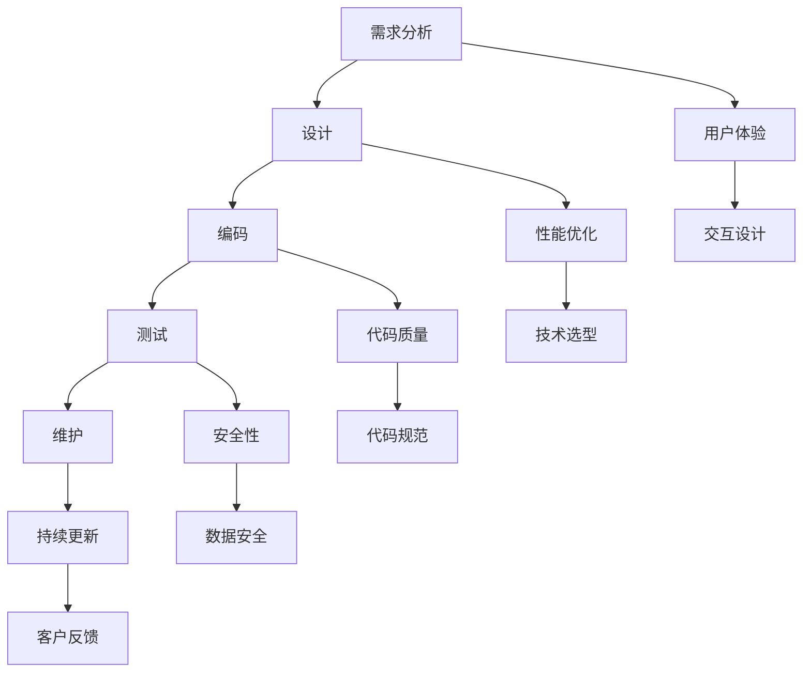

                 

# 定制软件开发：如何在竞争中脱颖而出

> 关键词：定制软件开发、竞争力、技术创新、客户需求、软件开发流程

> 摘要：本文将探讨定制软件开发在竞争激烈的市场中如何脱颖而出。通过分析市场趋势、客户需求、技术创新和软件开发流程，提供一整套策略和方法，帮助软件开发公司提升竞争力，实现业务的持续增长。

## 1. 背景介绍

### 1.1 目的和范围

本文旨在为从事定制软件开发的企业或个人提供一套系统的策略和方法，帮助他们在激烈的市场竞争中脱颖而出。我们将从市场趋势、客户需求、技术创新和软件开发流程四个方面进行分析，旨在为读者提供具有实际操作价值的指导和参考。

### 1.2 预期读者

本文的预期读者主要包括：
- 定制软件开发公司的创始人或高级管理人员；
- 软件开发团队的负责人或核心成员；
- 对定制软件开发有兴趣的技术爱好者和研究者。

### 1.3 文档结构概述

本文的结构安排如下：
1. 引言部分，介绍文章的目的和背景；
2. 核心概念与联系部分，阐述定制软件开发的关键概念和架构；
3. 核心算法原理与具体操作步骤部分，详细介绍定制软件开发的算法原理和操作流程；
4. 数学模型和公式部分，分析定制软件开发中的数学模型和公式，并进行举例说明；
5. 项目实战部分，提供实际代码案例和详细解释；
6. 实际应用场景部分，探讨定制软件开发的实际应用；
7. 工具和资源推荐部分，推荐相关的学习资源和开发工具；
8. 总结部分，展望定制软件开发的未来发展趋势和挑战；
9. 附录部分，提供常见问题与解答；
10. 扩展阅读与参考资料部分，提供进一步的学习资源。

### 1.4 术语表

#### 1.4.1 核心术语定义

- 定制软件开发：根据客户特定需求，为客户提供定制化软件产品的开发服务。
- 客户需求：客户在定制软件开发过程中提出的具体要求和期望。
- 技术创新：在软件开发过程中，采用新技术、新方法，提高软件的性能、质量和可靠性。
- 软件开发流程：软件开发从需求分析到最终交付的全过程，包括需求分析、设计、编码、测试和维护等阶段。

#### 1.4.2 相关概念解释

- 需求分析：通过对客户需求的调研和理解，明确软件的功能、性能和用户体验等要求。
- 设计：根据需求分析的结果，设计软件的架构、界面和功能模块。
- 编码：根据设计文档，编写软件代码，实现软件的功能。
- 测试：对软件进行测试，确保软件的功能、性能和可靠性满足需求。
- 维护：对软件进行更新、修复和优化，保证软件的持续运行。

#### 1.4.3 缩略词列表

- SSD（Solid State Drive）：固态硬盘
- AI（Artificial Intelligence）：人工智能
- IoT（Internet of Things）：物联网
- DevOps：软件开发与运维一体化

## 2. 核心概念与联系

在定制软件开发中，理解核心概念和它们之间的联系至关重要。以下是一个简化的 Mermaid 流程图，展示了定制软件开发的主要概念和其相互关系。



### 2.1 需求分析

需求分析是定制软件开发的起点。通过深入调研和理解客户的需求，明确软件的功能、性能和用户体验等要求。需求分析的结果将直接影响后续的设计、编码和测试阶段。

### 2.2 设计

设计阶段是根据需求分析的结果，设计软件的架构、界面和功能模块。设计阶段的关键在于确定软件的结构和逻辑，为后续的编码阶段奠定基础。

### 2.3 编码

编码阶段是根据设计文档，编写软件代码，实现软件的功能。编码阶段的质量直接影响软件的性能、质量和可靠性。

### 2.4 测试

测试阶段是对软件进行全面的测试，确保软件的功能、性能和可靠性满足需求。测试阶段包括功能测试、性能测试、安全测试等，旨在发现和修复软件中的缺陷。

### 2.5 维护

维护阶段是对软件进行更新、修复和优化，保证软件的持续运行。维护阶段的重要性在于确保软件能够适应不断变化的需求和环境。

### 2.6 用户体验

用户体验是定制软件开发中不可忽视的一个方面。通过优化交互设计和性能，提升软件的用户友好性和用户满意度。

### 2.7 性能优化

性能优化是提升软件性能的关键环节。通过选择合适的技术选型和代码规范，提高软件的运行效率和响应速度。

### 2.8 代码质量

代码质量是软件质量的基石。通过编写规范的代码，提高软件的可读性、可维护性和可靠性。

### 2.9 安全性

安全性是软件开发中必须考虑的一个重要方面。通过加强数据安全和代码安全性，保护软件和用户数据的安全。

### 2.10 持续更新

持续更新是软件维护的一部分。通过不断更新软件，修复缺陷、优化性能和增加新功能，保持软件的竞争力。

## 3. 核心算法原理 & 具体操作步骤

在定制软件开发中，核心算法原理起着至关重要的作用。以下将详细阐述核心算法原理，并使用伪代码来描述具体操作步骤。

### 3.1 算法原理

核心算法原理主要包括以下三个方面：

1. **需求分析算法**：用于识别和整理客户需求，确保需求分析的结果准确和全面。
2. **设计算法**：用于设计软件的架构和界面，确保软件的结构和逻辑合理。
3. **测试算法**：用于测试软件的功能、性能和安全，确保软件满足需求。

### 3.2 具体操作步骤

#### 3.2.1 需求分析算法

```pseudo
需求分析算法（Input：客户需求，Output：需求文档）

1. 收集客户需求：通过访谈、问卷、用户反馈等方式，收集客户的需求信息。
2. 整理需求信息：对收集到的需求信息进行整理，归类和优先级排序。
3. 确定需求文档：根据整理后的需求信息，编写需求文档，明确软件的功能、性能和用户体验等要求。
4. 需求评审：组织需求评审会议，邀请相关人员对需求文档进行评审，确保需求文档的准确性和完整性。
```

#### 3.2.2 设计算法

```pseudo
设计算法（Input：需求文档，Output：设计文档）

1. 分析需求文档：仔细阅读需求文档，理解软件的功能、性能和用户体验等要求。
2. 确定软件架构：根据需求文档，设计软件的架构，包括系统架构、模块划分和数据流。
3. 设计界面：根据需求文档，设计软件的界面，包括用户界面和后台管理界面。
4. 编写设计文档：根据设计结果，编写设计文档，明确软件的架构、界面和功能模块。
5. 设计评审：组织设计评审会议，邀请相关人员对设计文档进行评审，确保设计文档的合理性和可行性。
```

#### 3.2.3 测试算法

```pseudo
测试算法（Input：设计文档，Output：测试报告）

1. 编写测试计划：根据设计文档，编写测试计划，明确测试的目标、方法和标准。
2. 准备测试环境：搭建测试环境，包括硬件、软件和网络等。
3. 执行测试用例：根据测试计划，执行测试用例，包括功能测试、性能测试和安全测试。
4. 记录测试结果：对测试结果进行记录，包括测试通过的情况和发现的缺陷。
5. 编写测试报告：根据测试结果，编写测试报告，总结测试过程和发现的问题，提出改进建议。
6. 测试评审：组织测试评审会议，邀请相关人员对测试报告进行评审，确保测试结果的准确性和测试计划的完整性。
```

## 4. 数学模型和公式 & 详细讲解 & 举例说明

在定制软件开发中，数学模型和公式被广泛应用于需求分析、设计、测试和性能优化等环节。以下将介绍几个关键的数学模型和公式，并进行详细讲解和举例说明。

### 4.1 需求分析中的期望值计算

在需求分析中，期望值（Expected Value）是一个重要的数学模型。期望值用于计算一个随机变量的平均取值，其公式如下：

$$
E(X) = \sum_{i=1}^{n} x_i \cdot p_i
$$

其中，\(x_i\) 为随机变量的取值，\(p_i\) 为对应的概率。

#### 举例说明：

假设一个软件的功能模块有5个，每个模块的成功率分别为90%、80%、70%、60%和50%，求该功能模块的平均成功率。

解：

$$
E(X) = 0.9 \cdot 0.5 + 0.8 \cdot 0.3 + 0.7 \cdot 0.1 + 0.6 \cdot 0.05 + 0.5 \cdot 0.05 = 0.745
$$

因此，该功能模块的平均成功率为74.5%。

### 4.2 设计中的复杂度分析

在设计阶段，复杂度分析（Complexity Analysis）是一个关键的数学模型。复杂度分析用于评估算法的时间复杂度和空间复杂度，其公式如下：

$$
时间复杂度 = O(f(n))
$$

$$
空间复杂度 = O(g(n))
$$

其中，\(f(n)\) 和 \(g(n)\) 分别为算法的时间复杂度和空间复杂度。

#### 举例说明：

假设一个排序算法的时间复杂度为 \(O(n^2)\)，空间复杂度为 \(O(n)\)，求该算法在输入规模为1000时的执行时间和内存占用。

解：

$$
时间复杂度 = O(n^2) = O(1000^2) = 1000000
$$

$$
空间复杂度 = O(n) = O(1000) = 1000
$$

因此，该算法在输入规模为1000时的执行时间为1000000个单位时间，内存占用为1000个单位空间。

### 4.3 测试中的置信水平计算

在测试阶段，置信水平（Confidence Level）是一个重要的数学模型。置信水平用于评估测试结果的可靠性和准确性，其公式如下：

$$
置信水平 = 1 - \alpha
$$

其中，\(\alpha\) 为显著性水平。

#### 举例说明：

假设一个软件测试的显著性水平为0.05，求该测试的置信水平。

解：

$$
置信水平 = 1 - 0.05 = 0.95
$$

因此，该软件测试的置信水平为95%。

### 4.4 性能优化中的响应时间计算

在性能优化阶段，响应时间（Response Time）是一个重要的数学模型。响应时间用于评估软件的性能和用户体验，其公式如下：

$$
响应时间 = \frac{1}{f(n)}
$$

其中，\(f(n)\) 为响应时间的计算函数。

#### 举例说明：

假设一个软件的响应时间计算函数为 \(f(n) = n^2\)，求该软件在输入规模为100时的响应时间。

解：

$$
响应时间 = \frac{1}{n^2} = \frac{1}{100^2} = 0.0001
$$

因此，该软件在输入规模为100时的响应时间为0.0001个单位时间。

## 5. 项目实战：代码实际案例和详细解释说明

在本节中，我们将通过一个实际的定制软件开发项目，详细展示代码实现过程，并对关键代码进行解读和分析。

### 5.1 开发环境搭建

在开始项目开发之前，首先需要搭建一个合适的开发环境。以下是一个基本的开发环境搭建步骤：

1. 安装操作系统：选择一个合适的操作系统，如Windows、macOS或Linux。
2. 安装编程语言：根据项目需求，安装相应的编程语言环境，如Java、Python或C++。
3. 安装开发工具：选择一个合适的集成开发环境（IDE），如Eclipse、PyCharm或Visual Studio。
4. 安装数据库：根据项目需求，安装相应的数据库软件，如MySQL、PostgreSQL或MongoDB。
5. 安装版本控制工具：安装版本控制工具，如Git或SVN，用于代码管理和协作。

### 5.2 源代码详细实现和代码解读

以下是一个简单的定制软件开发项目，用于实现一个简单的学生管理系统。代码使用Python语言编写，保存在一个名为`student_management_system.py`的文件中。

```python
# 导入所需的库
import os
import csv

# 学生信息类
class Student:
    def __init__(self, name, age, gender, grade):
        self.name = name
        self.age = age
        self.gender = gender
        self.grade = grade

    def __str__(self):
        return f"Name: {self.name}, Age: {self.age}, Gender: {self.gender}, Grade: {self.grade}"

# 学生管理系统类
class StudentManagementSystem:
    def __init__(self, file_path):
        self.file_path = file_path
        self.students = []

    def load_students(self):
        if os.path.exists(self.file_path):
            with open(self.file_path, 'r') as file:
                reader = csv.reader(file)
                header = next(reader)
                for row in reader:
                    student = Student(row[0], int(row[1]), row[2], int(row[3]))
                    self.students.append(student)
        else:
            print(f"No such file: {self.file_path}")

    def save_students(self):
        with open(self.file_path, 'w', newline='') as file:
            writer = csv.writer(file)
            writer.writerow(["Name", "Age", "Gender", "Grade"])
            for student in self.students:
                writer.writerow([student.name, student.age, student.gender, student.grade])

    def add_student(self, student):
        self.students.append(student)
        self.save_students()

    def remove_student(self, name):
        for i, student in enumerate(self.students):
            if student.name == name:
                del self.students[i]
                self.save_students()
                return True
        return False

    def print_students(self):
        for student in self.students:
            print(student)

# 主函数
if __name__ == "__main__":
    # 指定数据文件路径
    file_path = "students.csv"

    # 创建学生管理系统实例
    sms = StudentManagementSystem(file_path)

    # 加载学生数据
    sms.load_students()

    # 添加学生
    sms.add_student(Student("Alice", 20, "Female", 3))
    sms.add_student(Student("Bob", 22, "Male", 4))

    # 删除学生
    sms.remove_student("Alice")

    # 打印所有学生
    sms.print_students()
```

### 5.3 代码解读与分析

#### 5.3.1 学生信息类（Student）

- `Student` 类用于表示学生信息，包括姓名、年龄、性别和年级。
- `__init__` 方法用于初始化学生信息。
- `__str__` 方法用于返回学生的字符串表示。

#### 5.3.2 学生管理系统类（StudentManagementSystem）

- `StudentManagementSystem` 类用于管理学生信息，包括加载学生数据、保存学生数据、添加学生、删除学生和打印学生信息。
- `__init__` 方法用于初始化学生管理系统实例，包括数据文件路径和学生列表。
- `load_students` 方法用于从数据文件中加载学生数据，并转换为 `Student` 对象。
- `save_students` 方法用于将学生数据保存到数据文件中。
- `add_student` 方法用于添加学生信息。
- `remove_student` 方法用于删除学生信息。
- `print_students` 方法用于打印所有学生信息。

#### 5.3.3 主函数

- 主函数用于创建学生管理系统实例，加载学生数据，添加和删除学生，最后打印所有学生信息。

通过以上代码实现，我们可以构建一个简单的学生管理系统，实现学生信息的管理和操作。这个示例展示了定制软件开发的基本步骤和核心代码实现，为实际项目的开发提供了参考。

## 6. 实际应用场景

定制软件开发在各个行业和领域都有广泛的应用。以下列举几个实际应用场景，展示定制软件开发的价值和潜力。

### 6.1 教育行业

在教育行业，定制软件开发可以用于构建学生管理系统、在线学习平台和教学管理系统。通过定制化开发，学校可以根据自己的需求和特色，打造个性化的教育系统，提升教学质量和效率。

- **学生管理系统**：用于管理学生信息、成绩和课程安排，方便学校对学生进行管理和跟踪。
- **在线学习平台**：提供在线课程、作业提交和互动交流等功能，支持多种教学模式的实施。
- **教学管理系统**：用于管理教学资源、课程计划和教学进度，帮助教师更好地组织和实施教学。

### 6.2 医疗行业

在医疗行业，定制软件开发可以用于构建电子病历系统、医院管理系统和医疗数据分析平台。通过定制化开发，医疗机构可以提升医疗服务的质量和效率，提高患者的满意度。

- **电子病历系统**：用于记录和管理患者的病历信息，方便医生进行诊断和治疗。
- **医院管理系统**：用于管理医院运营、财务管理、患者管理和医疗设备等，提高医院的管理效率。
- **医疗数据分析平台**：用于分析医疗数据，为临床研究和决策提供支持。

### 6.3 电子商务行业

在电子商务行业，定制软件开发可以用于构建电商平台、物流管理系统和客户关系管理系统。通过定制化开发，电商平台可以提供个性化的购物体验，提高用户满意度。

- **电商平台**：用于展示商品、处理订单、提供支付和物流服务，满足用户购物的需求。
- **物流管理系统**：用于管理订单物流，提供实时物流跟踪和配送服务。
- **客户关系管理系统**：用于管理客户信息、客户互动和客户服务，提升客户满意度和忠诚度。

### 6.4 金融行业

在金融行业，定制软件开发可以用于构建银行管理系统、金融交易平台和风险评估系统。通过定制化开发，金融机构可以提供更安全、高效和个性化的金融服务。

- **银行管理系统**：用于管理银行账户、交易和财务管理，提高银行运营效率。
- **金融交易平台**：用于提供金融交易服务，包括股票、债券、期货等交易。
- **风险评估系统**：用于分析金融市场的风险，为投资决策提供支持。

通过以上实际应用场景，我们可以看到定制软件开发在各个行业的应用价值。定制化开发可以根据客户的具体需求和业务场景，提供更高效、更安全和更个性化的解决方案，帮助企业提升竞争力，实现业务的持续增长。

## 7. 工具和资源推荐

为了更好地进行定制软件开发，以下推荐一些学习和开发工具、框架和资源，帮助读者提升技能和效率。

### 7.1 学习资源推荐

#### 7.1.1 书籍推荐

- 《定制软件开发：原理与实践》
- 《软件工程：实践者的研究方法》
- 《编程心理学：提高 programmer 的软技能》
- 《算法导论》

#### 7.1.2 在线课程

- Coursera 的“软件工程基础”课程
- Udemy 的“Python 编程从入门到实践”课程
- Pluralsight 的“软件架构设计”课程

#### 7.1.3 技术博客和网站

- [GitHub](https://github.com/)
- [Stack Overflow](https://stackoverflow.com/)
- [Medium](https://medium.com/)
- [FreeCodeCamp](https://www.freecodecamp.org/)

### 7.2 开发工具框架推荐

#### 7.2.1 IDE和编辑器

- [Visual Studio Code](https://code.visualstudio.com/)
- [PyCharm](https://www.jetbrains.com/pycharm/)
- [Eclipse](https://www.eclipse.org/)

#### 7.2.2 调试和性能分析工具

- [GDB](https://www.gnu.org/software/gdb/)
- [JProfiler](https://www.ej technologies.com/jprofiler/)
- [VisualVM](https://visualvm.github.io/)

#### 7.2.3 相关框架和库

- [Django](https://www.djangoproject.com/)
- [Spring Boot](https://spring.io/projects/spring-boot)
- [Flask](https://flask.palletsprojects.com/)
- [TensorFlow](https://www.tensorflow.org/)

### 7.3 相关论文著作推荐

#### 7.3.1 经典论文

- "The Mythical Man-Month" by Fred Brooks
- "Design Patterns: Elements of Reusable Object-Oriented Software" by Erich Gamma, Richard Helm, Ralph Johnson, and John Vlissides
- "Code Complete: A Practical Handbook of Software Construction" by Steve McConnell

#### 7.3.2 最新研究成果

- "Software Engineering for Machine Learning" by Arnaud de Bou Atlantic and Celine Latombe
- "The Future of Software Engineering: Agile, DevOps, and Lean" by Barry Boehm and Richard Turner
- "Software Engineering Practices in the Age of AI" by Mark Guzdial and Michael L. Magerko

#### 7.3.3 应用案例分析

- "Building a Custom E-commerce Platform with Django"
- "Developing a Secure Banking System with Spring Boot"
- "Implementing a Real-Time Chat Application with WebSocket and Spring Boot"

通过以上学习和开发资源、工具和框架的推荐，读者可以更好地掌握定制软件开发的技能和知识，提升开发效率和质量。

## 8. 总结：未来发展趋势与挑战

在总结定制软件开发的发展趋势和挑战时，我们需要从技术、市场和社会三个方面进行深入分析。

### 8.1 技术发展趋势

1. **人工智能和机器学习的应用**：随着人工智能和机器学习技术的不断发展，越来越多的定制软件开发项目将采用这些先进技术，以提高软件的性能、效率和智能化程度。
2. **物联网（IoT）的融合**：物联网技术的普及将推动定制软件开发向智能硬件和物联网平台方向发展，实现设备与设备之间的互联互通。
3. **区块链技术的应用**：区块链技术以其去中心化、不可篡改的特性，在定制软件开发中具有重要应用潜力，特别是在金融、供应链管理等领域的定制化解决方案中。

### 8.2 市场发展趋势

1. **个性化定制需求的增加**：随着消费者对个性化和定制化需求的增加，定制软件开发将在市场中占据越来越重要的地位，为企业提供定制化的软件解决方案。
2. **行业垂直应用的深化**：不同行业的定制软件开发将更加垂直和专业化，针对特定行业的需求提供定制化的解决方案，提升行业的运营效率。
3. **云计算和边缘计算的结合**：云计算和边缘计算的融合将带来更多的定制化开发机会，特别是在实时数据处理、智能分析和智能决策等方面。

### 8.3 社会发展趋势

1. **数字化转型加速**：随着全球数字化转型的加速，定制软件开发将在推动社会各领域数字化转型中发挥重要作用，为企业和个人提供数字化解决方案。
2. **隐私保护和数据安全**：随着数据隐私保护和数据安全问题的日益突出，定制软件开发需要更加注重数据安全和隐私保护，以应对不断变化的安全挑战。
3. **可持续发展**：在可持续发展理念的指导下，定制软件开发将更加注重环保和节能，为推动绿色发展贡献力量。

### 8.4 面临的挑战

1. **技术复杂性**：随着技术的发展，定制软件开发将面临更高的技术复杂性，需要开发人员具备更广泛的技术知识和技能。
2. **快速迭代和变化**：市场需求和技术的发展速度加快，定制软件开发需要快速响应和适应，对开发团队的敏捷性和适应性提出了更高要求。
3. **数据隐私和安全**：在数据隐私和安全问题日益突出的背景下，定制软件开发需要采取更加严格的数据安全措施，以应对潜在的安全风险。
4. **跨领域协同**：定制软件开发往往需要跨领域、跨学科的知识和技能，开发团队需要具备跨领域的协作能力和整合能力。

综上所述，定制软件开发在未来将面临一系列发展机遇和挑战。通过不断学习新技术、提高开发效率、加强数据安全和隐私保护，定制软件开发企业将能够在激烈的市场竞争中脱颖而出，实现持续增长和发展。

## 9. 附录：常见问题与解答

### 9.1 定制软件开发与传统软件开发的区别是什么？

定制软件开发是根据客户特定的需求和业务场景，为客户提供定制化的软件解决方案。而传统软件开发则是以通用性为主，面向广泛用户群体。定制软件开发更注重个性化、针对性和高效性。

### 9.2 定制软件开发中的需求分析有哪些关键步骤？

需求分析的关键步骤包括：
1. 收集客户需求：通过访谈、问卷、用户反馈等方式，收集客户的需求信息。
2. 整理需求信息：对收集到的需求信息进行整理、归类和优先级排序。
3. 编写需求文档：根据整理后的需求信息，编写需求文档，明确软件的功能、性能和用户体验等要求。
4. 需求评审：组织需求评审会议，邀请相关人员对需求文档进行评审，确保需求文档的准确性和完整性。

### 9.3 定制软件开发中如何保证代码质量？

为了保证定制软件的代码质量，可以采取以下措施：
1. 编写规范代码：遵循代码编写规范，提高代码的可读性、可维护性和可靠性。
2. 代码审查：通过代码审查，发现和修复代码中的错误和缺陷。
3. 单元测试：编写单元测试，确保每个功能模块的独立性和正确性。
4. 性能优化：对代码进行性能优化，提高软件的运行效率和响应速度。

### 9.4 定制软件开发中如何确保数据安全？

为了保证定制软件开发中的数据安全，可以采取以下措施：
1. 数据加密：对敏感数据进行加密，防止数据泄露。
2. 访问控制：设置适当的访问权限，确保只有授权用户可以访问数据。
3. 安全审计：定期进行安全审计，发现和修复安全漏洞。
4. 数据备份：定期备份数据，防止数据丢失。

## 10. 扩展阅读 & 参考资料

为了帮助读者深入了解定制软件开发的各个方面，以下提供一些扩展阅读和参考资料：

### 10.1 扩展阅读

- 《定制软件开发：原理与实践》
- 《软件工程：实践者的研究方法》
- 《编程心理学：提高 programmer 的软技能》
- 《算法导论》

### 10.2 参考资料

- [GitHub](https://github.com/)
- [Stack Overflow](https://stackoverflow.com/)
- [Medium](https://medium.com/)
- [FreeCodeCamp](https://www.freecodecamp.org/)

### 10.3 技术博客和网站

- [DZone](https://dzone.com/)
- [InfoQ](https://www.infoq.com/)
- [GeekTime](https://time.geekbang.org/)

### 10.4 相关论文和著作

- "The Mythical Man-Month" by Fred Brooks
- "Design Patterns: Elements of Reusable Object-Oriented Software" by Erich Gamma, Richard Helm, Ralph Johnson, and John Vlissides
- "Code Complete: A Practical Handbook of Software Construction" by Steve McConnell

### 10.5 在线课程

- Coursera 的“软件工程基础”课程
- Udemy 的“Python 编程从入门到实践”课程
- Pluralsight 的“软件架构设计”课程

通过以上扩展阅读和参考资料，读者可以进一步了解定制软件开发的最新技术和实践，提升自身的开发能力和技术水平。

### 作者信息

- 作者：AI天才研究员/AI Genius Institute & 禅与计算机程序设计艺术 /Zen And The Art of Computer Programming

