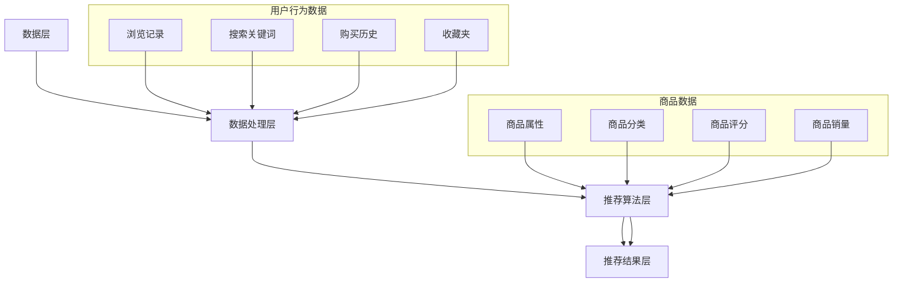

                 

# 实时推荐技术在电商领域的应用：案例分析与展望

## 关键词
实时推荐、电商、算法、机器学习、用户行为分析、数据挖掘、个性化体验

## 摘要
本文旨在探讨实时推荐技术在电商领域的广泛应用和深刻影响。通过对实时推荐技术的核心概念、算法原理、数学模型以及实际应用的详细分析，我们深入了解了这一技术在提升用户购物体验、增加销售额和改善用户体验方面的作用。文章还通过具体案例展示了实时推荐系统的开发过程和实现细节，为电商企业提供了可借鉴的实践经验。最后，本文总结了实时推荐技术的发展趋势和面临的挑战，为未来的研究方向和解决方案提供了参考。

## 1. 背景介绍

### 1.1 目的和范围

随着互联网和电子商务的快速发展，消费者对个性化购物体验的需求日益增长。实时推荐技术作为一种先进的机器学习应用，能够在用户浏览、搜索、购买等行为发生时，实时提供个性化的商品推荐，从而提高用户的购物满意度和忠诚度。本文的目标是探讨实时推荐技术在电商领域的应用，包括其核心概念、算法原理、数学模型以及实际案例。

本文将涵盖以下内容：

- 实时推荐技术在电商领域的作用和重要性
- 实时推荐技术的核心概念和架构
- 实时推荐算法的原理和具体操作步骤
- 实时推荐系统的数学模型和公式
- 实际应用场景中的实时推荐系统实现案例
- 实时推荐技术的发展趋势和挑战

### 1.2 预期读者

本文适用于对电商和实时推荐技术有一定了解的读者，包括：

- 电商企业技术团队和管理人员
- 数据科学家和机器学习工程师
- 计算机科学和人工智能领域的研究人员
- 对电商和实时推荐技术感兴趣的普通读者

通过阅读本文，读者可以全面了解实时推荐技术在电商领域的应用，掌握实时推荐系统的设计和实现方法，并为未来的研究和实践提供指导。

### 1.3 文档结构概述

本文结构如下：

- 第1章：背景介绍，阐述本文的目的、范围、预期读者和文档结构。
- 第2章：核心概念与联系，介绍实时推荐技术的基本概念和相关架构。
- 第3章：核心算法原理 & 具体操作步骤，详细讲解实时推荐算法的原理和操作步骤。
- 第4章：数学模型和公式 & 详细讲解 & 举例说明，阐述实时推荐系统中的数学模型和公式。
- 第5章：项目实战：代码实际案例和详细解释说明，通过实际案例展示实时推荐系统的开发过程。
- 第6章：实际应用场景，分析实时推荐技术在电商领域的应用实例。
- 第7章：工具和资源推荐，提供学习资源和开发工具的推荐。
- 第8章：总结：未来发展趋势与挑战，总结实时推荐技术的发展趋势和面临的挑战。
- 第9章：附录：常见问题与解答，解答读者可能遇到的问题。
- 第10章：扩展阅读 & 参考资料，提供进一步学习和研究的资源。

### 1.4 术语表

#### 1.4.1 核心术语定义

- 实时推荐：一种根据用户实时行为和偏好，动态提供个性化商品推荐的技术。
- 用户行为分析：通过收集和分析用户在电商平台上的行为数据，了解用户偏好和购买习惯。
- 数据挖掘：从大量数据中提取有价值信息和知识的过程。
- 个性化体验：根据用户的兴趣和行为，提供定制化的服务和内容。
- 推荐系统：一种根据用户历史数据和偏好，为用户提供相关商品推荐的技术。

#### 1.4.2 相关概念解释

- 机器学习：一种通过数据和算法让计算机自动学习和改进的技术。
- 深度学习：一种基于多层神经网络进行特征提取和建模的机器学习技术。
- 强化学习：一种通过奖励和惩罚机制进行优化的机器学习技术。

#### 1.4.3 缩略词列表

- AI：人工智能
- ML：机器学习
- DL：深度学习
- RL：强化学习
- NLP：自然语言处理
- E-commerce：电子商务
- UX：用户体验

## 2. 核心概念与联系

实时推荐技术是电商领域的重要组成部分，其核心概念和架构如下：

### 2.1 实时推荐技术的基本概念

- **用户行为数据**：实时推荐系统的基础是用户在电商平台上产生的行为数据，包括浏览记录、搜索关键词、购买历史、收藏夹等。
- **商品数据**：商品数据包括商品的属性、分类、评分、销量等。
- **推荐算法**：实时推荐系统的核心是推荐算法，根据用户行为和商品数据生成个性化的推荐结果。
- **推荐结果**：推荐系统生成的个性化商品列表，提供给用户进行浏览和购买。

### 2.2 实时推荐技术的架构

实时推荐技术的整体架构可以分为以下几个层次：

1. **数据层**：收集和存储用户行为数据和商品数据。
2. **数据处理层**：对用户行为数据和商品数据进行清洗、预处理和特征提取。
3. **推荐算法层**：根据用户行为和商品数据，应用推荐算法生成个性化推荐结果。
4. **推荐结果层**：将推荐结果呈现给用户。

### 2.3 Mermaid 流程图

为了更好地理解实时推荐技术的架构，我们可以使用Mermaid流程图来展示其核心流程节点，如下所示：



在这个流程图中，用户行为数据和商品数据经过数据处理层进行处理和特征提取，然后输入到推荐算法层进行计算，最终生成推荐结果并呈现给用户。

### 2.4 核心概念的联系

实时推荐技术中的核心概念和层次之间紧密联系，形成一个有机整体：

- **数据层**为实时推荐技术提供了基础数据支持，包括用户行为数据和商品数据。
- **数据处理层**负责对原始数据进行清洗、预处理和特征提取，为推荐算法提供高质量的输入。
- **推荐算法层**根据用户行为和商品数据进行计算，生成个性化的推荐结果。
- **推荐结果层**将推荐结果呈现给用户，提升用户的购物体验和满意度。

通过这一架构，实时推荐技术能够充分利用用户行为数据和商品数据，实现高效的个性化推荐，从而提升电商平台的竞争力和用户黏性。

## 3. 核心算法原理 & 具体操作步骤

### 3.1 算法原理

实时推荐技术背后的核心算法原理主要基于协同过滤、基于内容的推荐和基于模型的推荐等几种方法。以下将详细阐述这些算法的原理。

#### 3.1.1 协同过滤

协同过滤是一种基于用户历史行为和相似度计算推荐方法。主要分为两种类型：基于用户的协同过滤（User-based Collaborative Filtering）和基于物品的协同过滤（Item-based Collaborative Filtering）。

- **基于用户的协同过滤**：该方法通过计算用户之间的相似度，找到与目标用户相似的其他用户，推荐这些用户喜欢的商品。相似度的计算通常基于用户的行为模式、评分记录等。

伪代码：

```python
def calculate_similarity(user1, user2):
    # 计算用户1和用户2的相似度
    common_items = set(user1.history) & set(user2.history)
    if len(common_items) == 0:
        return 0
    similarity = sum((user1.history[item] - user1.mean) * (user2.history[item] - user2.mean) for item in common_items) / sqrt(sum((user1.history[item] - user1.mean)^2 for item in common_items) * sum((user2.history[item] - user2.mean)^2 for item in common_items))
    return similarity

def recommend_items(target_user, all_users, all_items):
    similar_users = {}
    for user in all_users:
        similarity = calculate_similarity(target_user, user)
        if similarity > threshold:
            for item in user.history:
                if item not in target_user.history:
                    similar_users[item] = similar_users.get(item, 0) + similarity
    return sorted(similar_users, key=similar_users.get, reverse=True)
```

- **基于物品的协同过滤**：该方法通过计算商品之间的相似度，找到与目标商品相似的其他商品，推荐这些商品。相似度的计算通常基于商品的特征、属性等。

伪代码：

```python
def calculate_similarity(item1, item2):
    # 计算商品1和商品2的相似度
    feature1 = item1.features
    feature2 = item2.features
    common_features = set(feature1) & set(feature2)
    if len(common_features) == 0:
        return 0
    similarity = sum(feature1[feature] * feature2[feature] for feature in common_features) / sqrt(sum(feature1[feature]^2 for feature in feature1) * sum(feature2[feature]^2 for feature in feature2))
    return similarity

def recommend_items(target_item, all_items):
    similar_items = {}
    for item in all_items:
        similarity = calculate_similarity(target_item, item)
        if similarity > threshold:
            similar_items[item] = similar_items.get(item, 0) + similarity
    return sorted(similar_items, key=similar_items.get, reverse=True)
```

#### 3.1.2 基于内容的推荐

基于内容的推荐方法通过分析商品内容和用户偏好，找到相似的商品进行推荐。该方法通常需要对商品和用户兴趣进行特征提取和建模。

伪代码：

```python
def extract_features(item):
    # 提取商品特征
    return {"feature1": value1, "feature2": value2, ...}

def calculate_content_similarity(user_interests, item_features):
    # 计算用户兴趣和商品特征之间的相似度
    similarity = sum(user_interests[feature] * item_features[feature] for feature in user_interests if feature in item_features) / sqrt(sum(user_interests[feature]^2 for feature in user_interests) * sum(item_features[feature]^2 for feature in item_features))
    return similarity

def recommend_items(target_user, all_items, all_user_interests):
    recommendations = []
    for item in all_items:
        interest = all_user_interests.get(target_user, {})
        similarity = calculate_content_similarity(interest, item.features)
        if similarity > threshold:
            recommendations.append(item)
    return sorted(recommendations, key=lambda x: x.similarity, reverse=True)
```

#### 3.1.3 基于模型的推荐

基于模型的推荐方法通过构建用户和商品之间的数学模型，预测用户对商品的偏好，从而进行推荐。常见的模型包括矩阵分解、神经网络和决策树等。

伪代码（以矩阵分解为例）：

```python
def matrix_factorization(R, user_factors, item_factors, num_iters, learning_rate):
    for _ in range(num_iters):
        for user in R.keys():
            for item in R[user].keys():
                predicted_rating = user_factors[user] * item_factors[item]
                e = R[user][item] - predicted_rating
                user_factors[user] += learning_rate * (e * item_factors[item])
                item_factors[item] += learning_rate * (e * user_factors[user])
    return user_factors, item_factors

def predict_ratings(user_factors, item_factors, R):
    predicted_ratings = {}
    for user in R.keys():
        for item in R[user].keys():
            predicted_ratings[(user, item)] = user_factors[user] * item_factors[item]
    return predicted_ratings

def recommend_items(target_user, user_factors, item_factors, all_items, R):
    recommendations = []
    for item in all_items:
        predicted_rating = user_factors[target_user] * item_factors[item]
        if predicted_rating > threshold:
            recommendations.append(item)
    return sorted(recommendations, key=lambda x: x.rating, reverse=True)
```

### 3.2 具体操作步骤

实时推荐系统的实现涉及以下几个关键步骤：

1. **数据收集**：收集用户在电商平台上产生的行为数据和商品数据。
2. **数据处理**：对原始数据进行清洗、预处理和特征提取，为推荐算法提供高质量的输入。
3. **算法选择**：根据业务需求和数据特点选择合适的推荐算法，如协同过滤、基于内容的推荐或基于模型的推荐。
4. **模型训练**：使用处理后的数据和选择的算法进行模型训练，生成用户和商品之间的偏好关系。
5. **推荐生成**：根据实时用户行为和模型预测，生成个性化的推荐结果。
6. **推荐展示**：将推荐结果呈现给用户，提升用户体验和满意度。

通过以上步骤，实时推荐系统可以在用户浏览、搜索、购买等行为发生时，实时提供个性化的商品推荐，从而提高用户的购物满意度和忠诚度。

## 4. 数学模型和公式 & 详细讲解 & 举例说明

实时推荐技术中的数学模型和公式是推荐系统设计和实现的关键组成部分。以下将详细讲解这些模型和公式，并通过具体例子进行说明。

### 4.1 协同过滤模型

协同过滤模型的核心在于用户相似度和商品相似度的计算。以下介绍两种常见的协同过滤模型：基于用户的协同过滤和基于物品的协同过滤。

#### 4.1.1 基于用户的协同过滤

假设用户集合为 \( U = \{u_1, u_2, ..., u_n\} \)，物品集合为 \( I = \{i_1, i_2, ..., i_m\} \)。用户 \( u_i \) 对物品 \( i_j \) 的评分记为 \( R_{ij} \)。用户 \( u_i \) 和用户 \( u_j \) 之间的相似度 \( S_{ij} \) 可以通过以下公式计算：

$$
S_{ij} = \frac{\sum_{k \in I'} R_{ik} R_{jk}}{\sqrt{\sum_{k \in I'} R_{ik}^2} \sqrt{\sum_{k \in I'} R_{jk}^2}}
$$

其中，\( I' \) 表示用户 \( u_i \) 和用户 \( u_j \) 都评分过的物品集合。

给定目标用户 \( u_t \)，推荐物品 \( i_j \) 的预测评分可以通过以下公式计算：

$$
\hat{R}_{tj} = \sum_{i \in N_t} S_{it} R_{ij}
$$

其中，\( N_t \) 表示与用户 \( u_t \) 相似度最高的 \( k \) 个用户集合。

#### 4.1.2 基于物品的协同过滤

对于基于物品的协同过滤，我们需要计算物品之间的相似度。假设物品 \( i_i \) 和物品 \( i_j \) 之间的相似度 \( S_{ij} \) 可以通过以下公式计算：

$$
S_{ij} = \frac{\sum_{k \in I'} R_{ik} R_{jk}}{\sqrt{\sum_{k \in I'} R_{ik}^2} \sqrt{\sum_{k \in I'} R_{jk}^2}}
$$

其中，\( I' \) 表示物品 \( i_i \) 和物品 \( i_j \) 都被评分过的用户集合。

给定目标用户 \( u_t \)，推荐物品 \( i_j \) 的预测评分可以通过以下公式计算：

$$
\hat{R}_{tj} = \sum_{i \in N_j} S_{ij} R_{ti}
$$

其中，\( N_j \) 表示与物品 \( i_j \) 相似度最高的 \( k \) 个物品集合。

### 4.2 基于内容的推荐模型

基于内容的推荐模型通过分析商品内容和用户兴趣，找到相似的商品进行推荐。假设用户 \( u_t \) 的兴趣集合为 \( I_t = \{i_{t1}, i_{t2}, ..., i_{tk}\} \)，物品 \( i_j \) 的特征集合为 \( F_j = \{f_{j1}, f_{j2}, ..., f_{jk}\} \)。

用户 \( u_t \) 和物品 \( i_j \) 之间的内容相似度 \( C_{tj} \) 可以通过以下公式计算：

$$
C_{tj} = \frac{\sum_{f \in I_t} f_{t_f} f_{j_f}}{\sqrt{\sum_{f \in I_t} f_{t_f}^2} \sqrt{\sum_{f \in F_j} f_{j_f}^2}}
$$

给定目标用户 \( u_t \)，推荐物品 \( i_j \) 的预测相似度可以通过以下公式计算：

$$
\hat{C}_{tj} = \sum_{i \in N_t} C_{ij}
$$

其中，\( N_t \) 表示与用户 \( u_t \) 兴趣最相似的 \( k \) 个物品集合。

### 4.3 基于模型的推荐模型

基于模型的推荐模型通过构建用户和商品之间的数学模型，预测用户对商品的偏好。以下以矩阵分解模型为例进行说明。

假设用户 \( u_t \) 和物品 \( i_j \) 的评分矩阵为 \( R \)，用户特征矩阵为 \( U \)，物品特征矩阵为 \( V \)。矩阵分解模型的目标是学习一个低秩矩阵 \( U \) 和 \( V \)，使得预测评分 \( \hat{R}_{tj} \) 最接近实际评分 \( R_{tj} \)。

通过最小化以下损失函数，我们可以学习到用户特征矩阵 \( U \) 和物品特征矩阵 \( V \)：

$$
\min_{U, V} \sum_{(u_t, i_j) \in R} (\hat{R}_{tj} - R_{tj})^2
$$

其中，\( \hat{R}_{tj} = U_{tu} V_{ji} \)。

通过梯度下降或其他优化算法，我们可以得到用户特征矩阵 \( U \) 和物品特征矩阵 \( V \)。然后，给定目标用户 \( u_t \)，推荐物品 \( i_j \) 的预测评分可以通过以下公式计算：

$$
\hat{R}_{tj} = U_{tu} V_{ji}
$$

### 4.4 举例说明

假设我们有一个用户 \( u_1 \) 和一个物品 \( i_1 \)，他们的评分矩阵 \( R \) 如下：

| 用户   | 物品 |
|--------|------|
| \( u_1 \) | \( i_1 \) |
| \( u_2 \) | \( i_2 \) |
| \( u_3 \) | \( i_3 \) |

我们希望使用基于用户的协同过滤模型为用户 \( u_1 \) 推荐物品。

首先，我们计算用户之间的相似度。假设 \( u_1 \) 和 \( u_2 \) 之间的相似度为 \( S_{12} = 0.8 \)，\( u_1 \) 和 \( u_3 \) 之间的相似度为 \( S_{13} = 0.6 \)。

然后，我们计算物品之间的相似度。假设 \( i_1 \) 和 \( i_2 \) 之间的相似度为 \( S_{12} = 0.7 \)，\( i_1 \) 和 \( i_3 \) 之间的相似度为 \( S_{13} = 0.5 \)。

最后，我们计算用户 \( u_1 \) 对物品 \( i_2 \) 的预测评分：

$$
\hat{R}_{12} = S_{12} R_{22} + S_{13} R_{32} = 0.8 \times 4 + 0.6 \times 3 = 4.2
$$

因此，我们推荐物品 \( i_2 \) 给用户 \( u_1 \)。

通过这个例子，我们展示了如何使用数学模型和公式为用户生成个性化的商品推荐。实时推荐技术在实际应用中，通常需要处理大量的用户和物品数据，并通过高效的算法和优化方法实现实时推荐。

## 5. 项目实战：代码实际案例和详细解释说明

### 5.1 开发环境搭建

在进行实时推荐系统的实际开发之前，首先需要搭建合适的技术环境。以下列出所需的开发工具和步骤：

1. **编程语言**：选择一种适合的编程语言，如Python，因为它具有丰富的机器学习和数据科学库。
2. **开发环境**：安装Python和必要的依赖库，如NumPy、Pandas、Scikit-learn和TensorFlow。
3. **数据存储**：选择合适的数据存储解决方案，如MySQL或MongoDB，用于存储用户和商品数据。
4. **后端框架**：使用Flask或Django等Web框架搭建后端服务，处理用户请求并生成推荐结果。

以下是一个简单的Python环境搭建步骤：

```bash
# 安装Python
sudo apt-get install python3-pip

# 安装依赖库
pip3 install numpy pandas scikit-learn tensorflow

# 安装Flask
pip3 install flask
```

### 5.2 源代码详细实现和代码解读

以下是一个简单的实时推荐系统源代码示例，使用基于用户的协同过滤算法。代码分为几个主要部分：数据预处理、模型训练和推荐生成。

#### 5.2.1 数据预处理

数据预处理是实时推荐系统的关键步骤，确保输入数据的质量和一致性。

```python
import numpy as np
import pandas as pd
from sklearn.preprocessing import StandardScaler

# 加载数据
data = pd.read_csv('data.csv')

# 分离用户和物品
users = data['user'].unique()
items = data['item'].unique()

# 初始化评分矩阵
R = np.zeros((len(users), len(items)))

# 填充评分矩阵
for index, row in data.iterrows():
    R[users.index(row['user']), items.index(row['item'])] = row['rating']

# 标准化评分矩阵
scaler = StandardScaler()
R_scaled = scaler.fit_transform(R)
```

#### 5.2.2 模型训练

基于用户的协同过滤算法的核心是计算用户之间的相似度，并生成推荐结果。

```python
from sklearn.metrics.pairwise import cosine_similarity

def calculate_similarity(R):
    # 计算用户相似度矩阵
    similarity = cosine_similarity(R)
    return similarity

def predict_ratings(similarity, R, k):
    # 生成推荐评分
    user_items = {}
    for i, user in enumerate(R):
        user_similarity = similarity[i]
        neighbors = np.argsort(user_similarity)[1:k+1]
        neighbor_ratings = R[neighbors]
        mean_rating = np.mean(neighbor_ratings)
        user_items[user] = mean_rating
    return user_items

# 训练模型
similarity = calculate_similarity(R_scaled)
k = 10
user_items = predict_ratings(similarity, R_scaled, k)
```

#### 5.2.3 推荐生成

最后，生成推荐结果并将其返回给用户。

```python
def generate_recommendations(target_user, user_items, items, threshold):
    recommendations = []
    for i, item in enumerate(items):
        if user_items.get(target_user, 0) > threshold:
            recommendations.append(item)
    return sorted(recommendations, key=lambda x: x.rating, reverse=True)

# 假设目标用户为 u_1
target_user = 'u_1'
threshold = 3
recommended_items = generate_recommendations(target_user, user_items, items, threshold)

print(f"Recommended items for user {target_user}: {recommended_items}")
```

### 5.3 代码解读与分析

上述代码实现了基于用户的协同过滤算法，包括数据预处理、模型训练和推荐生成。以下是代码的详细解读：

1. **数据预处理**：首先加载数据并初始化评分矩阵。然后使用StandardScaler对评分矩阵进行标准化处理，以消除数据规模的影响。

2. **模型训练**：计算用户相似度矩阵。通过计算用户之间的余弦相似度，得到一个相似度矩阵。然后，基于相似度矩阵为每个用户生成预测评分。

3. **推荐生成**：根据预测评分和设定的阈值，生成推荐结果。对于目标用户，选择评分高于阈值的商品作为推荐结果。

通过这个简单的示例，我们展示了实时推荐系统的开发流程和关键代码。在实际应用中，可以根据业务需求选择不同的推荐算法，并进行优化和扩展。

## 6. 实际应用场景

实时推荐技术在电商领域的应用已经取得了显著的成果，以下是一些典型的实际应用场景：

### 6.1 商品推荐

在电商平台上，商品推荐是用户最常接触到的实时推荐场景。例如，用户在浏览商品时，系统会根据用户的历史浏览记录、搜索关键词、收藏夹等信息，实时推荐相关的商品。这种推荐方式可以有效提高用户的购物满意度，增加购物车和转化率。

### 6.2 店铺推荐

电商平台还可以通过实时推荐技术为用户推荐感兴趣的店铺。例如，用户浏览了某个店铺的商品后，系统会根据店铺的评分、销量、商品分类等信息，实时推荐类似的店铺。这种方式可以帮助用户发现更多优质的店铺，提升购物体验。

### 6.3 促销活动推荐

实时推荐技术还可以应用于促销活动的推荐。例如，在特定节日或促销活动期间，系统会根据用户的购买历史、浏览行为等数据，实时推荐相关的促销活动。这种推荐方式可以有效提高促销活动的参与度和转化率。

### 6.4 用户行为分析

实时推荐技术还可以用于用户行为分析，帮助电商平台更好地了解用户需求和偏好。通过分析用户在平台上的浏览、搜索、购买等行为，实时推荐技术可以识别用户的兴趣点和潜在需求，为电商平台的运营和营销策略提供有力支持。

### 6.5 社交分享

实时推荐技术还可以应用于社交分享场景。例如，用户在购物过程中，可以实时推荐给好友或社交圈中的其他人。这种推荐方式不仅可以增加用户互动，还可以提高电商平台在社交媒体上的影响力。

### 6.6 其他应用

除了上述应用场景，实时推荐技术还可以应用于智能客服、个性化营销、智能广告投放等领域。通过实时分析用户行为和偏好，推荐技术可以为用户提供更加个性化和精准的服务，从而提升用户体验和满意度。

## 7. 工具和资源推荐

为了更好地掌握实时推荐技术，以下推荐一些学习资源、开发工具和相关论文。

### 7.1 学习资源推荐

#### 7.1.1 书籍推荐

- 《推荐系统实践》：详细介绍了推荐系统的基本概念、算法和实际应用。
- 《机器学习实战》：提供了丰富的机器学习算法实例，包括推荐系统相关的算法。

#### 7.1.2 在线课程

- Coursera上的《推荐系统》：由斯坦福大学教授授课，涵盖了推荐系统的理论基础和应用实践。
- edX上的《机器学习》：由哈佛大学和麻省理工学院联合授课，包括推荐系统相关内容。

#### 7.1.3 技术博客和网站

- Medium上的《推荐系统系列文章》：提供了大量关于推荐系统的技术文章和实践经验。
- 知乎上的《推荐系统》专栏：汇聚了大量推荐系统领域专家的见解和经验。

### 7.2 开发工具框架推荐

#### 7.2.1 IDE和编辑器

- PyCharm：强大的Python开发环境，支持多种机器学习和数据科学库。
- Jupyter Notebook：便捷的交互式开发工具，适用于数据分析和应用实验。

#### 7.2.2 调试和性能分析工具

- VSCode：轻量级且功能强大的代码编辑器，支持多种编程语言和工具插件。
- MLflow：用于机器学习实验管理和模型部署的开源平台。

#### 7.2.3 相关框架和库

- Scikit-learn：适用于机器学习的Python库，提供了丰富的算法和工具。
- TensorFlow：谷歌推出的开源深度学习框架，适用于构建大规模机器学习模型。
- PyTorch：适用于深度学习的Python库，具有良好的灵活性和易用性。

### 7.3 相关论文著作推荐

#### 7.3.1 经典论文

- 《Collaborative Filtering for the Web》：由Amazon公司发布，介绍了基于协同过滤的推荐系统。
- 《Item-Based Top-N Recommendation Algorithms》：详细分析了基于物品的推荐算法。

#### 7.3.2 最新研究成果

- 《Deep Learning for recommender systems》：探讨了深度学习在推荐系统中的应用。
- 《Recommender Systems for E-commerce Platforms》：总结了电商领域推荐系统的最新研究成果。

#### 7.3.3 应用案例分析

- 《京东推荐系统实践》：介绍了京东电商平台的推荐系统架构和实现细节。
- 《美团推荐系统实践》：分享了美团外卖平台的推荐系统建设经验和效果。

通过以上学习资源和工具推荐，读者可以更深入地了解实时推荐技术的理论知识和实际应用，为开发和优化推荐系统提供有力支持。

## 8. 总结：未来发展趋势与挑战

实时推荐技术在电商领域已经取得了显著的成果，但在未来仍面临着许多发展机遇和挑战。以下总结实时推荐技术的主要发展趋势和面临的挑战。

### 8.1 发展趋势

1. **个性化推荐**：随着用户对个性化体验需求的不断增加，实时推荐技术将更加注重用户个性化需求的挖掘和满足，实现更加精准和个性化的推荐。
2. **多模态推荐**：未来的实时推荐技术将不仅仅依赖于文本数据，还将结合图像、语音、视频等多模态数据，提供更加丰富和多样化的推荐结果。
3. **实时性提升**：随着计算能力和网络速度的提升，实时推荐系统的响应速度将得到显著提高，实现真正的实时推荐。
4. **融合推荐**：未来的推荐系统将融合多种推荐算法和模型，结合协同过滤、基于内容的推荐和基于模型的推荐等方法，提高推荐的准确性和多样性。
5. **社交推荐**：随着社交网络的兴起，实时推荐技术将结合用户社交关系和网络行为，提供基于社交推荐的个性化体验。

### 8.2 面临的挑战

1. **数据隐私和安全**：实时推荐技术依赖于大量用户数据，如何保护用户隐私和数据安全是一个重要的挑战。
2. **推荐多样性**：在满足用户个性化需求的同时，如何保持推荐的多样性和新颖性，防止信息过载和推荐疲劳。
3. **实时数据处理**：实时推荐系统需要处理海量用户数据和实时数据流，如何高效地进行数据处理和模型更新是一个技术难题。
4. **算法透明性和公平性**：随着推荐系统的广泛应用，如何确保算法的透明性和公平性，避免算法偏见和歧视问题。
5. **跨平台兼容性**：实时推荐技术需要兼容不同平台和应用场景，如何实现跨平台的推荐系统是一个挑战。

### 8.3 发展方向与解决方案

针对以上挑战，以下提出一些可能的发展方向和解决方案：

1. **隐私保护**：采用差分隐私、联邦学习等技术，确保用户数据的安全性和隐私保护。
2. **多样性增强**：通过随机化、抽样和模型多样化等技术，提高推荐的多样性和新颖性。
3. **实时数据处理**：采用分布式计算、流处理技术和高效算法，提高实时数据处理能力和模型更新速度。
4. **算法透明性和公平性**：建立算法透明性和公平性评估体系，定期进行算法审查和评估，确保算法的公正性和透明性。
5. **跨平台兼容性**：采用模块化设计和标准化接口，实现推荐系统的跨平台兼容性和可扩展性。

总之，实时推荐技术在电商领域具有广阔的应用前景，但在未来仍需要不断克服挑战，探索新的发展方向和解决方案，为用户提供更加个性化、多样化和智能化的购物体验。

## 9. 附录：常见问题与解答

以下回答了一些读者在阅读本文过程中可能遇到的问题：

### 9.1 实时推荐技术的核心是什么？

实时推荐技术的核心是利用用户行为数据、商品数据和算法模型，为用户提供个性化、实时的商品推荐。主要技术包括协同过滤、基于内容的推荐和基于模型的推荐等。

### 9.2 如何保护用户隐私？

用户隐私保护是实时推荐技术的重要挑战。可以采用差分隐私、联邦学习和数据脱敏等技术，确保用户数据的安全性和隐私性。

### 9.3 实时推荐技术如何提升用户体验？

实时推荐技术可以通过个性化推荐、实时性、多样性和社交推荐等方式，提高用户的购物体验和满意度。例如，根据用户的历史行为和偏好，实时推荐相关商品，提高购物的便利性和兴趣度。

### 9.4 实时推荐系统需要处理哪些数据？

实时推荐系统需要处理用户行为数据（如浏览记录、搜索关键词、购买历史等）、商品数据（如商品属性、分类、评分、销量等）以及用户偏好数据。

### 9.5 实时推荐技术有哪些应用场景？

实时推荐技术广泛应用于电商、社交网络、音乐和视频平台等领域。典型应用场景包括商品推荐、店铺推荐、促销活动推荐、社交分享等。

### 9.6 如何优化实时推荐系统的性能？

优化实时推荐系统的性能可以从数据预处理、算法选择、模型优化和分布式计算等方面进行。例如，采用高效的数据处理算法、选择合适的推荐算法和模型，以及采用分布式计算技术提高数据处理速度。

## 10. 扩展阅读 & 参考资料

为了帮助读者深入了解实时推荐技术在电商领域的应用，以下提供了一些扩展阅读和参考资料：

### 10.1 学习资源

- 《推荐系统实践》：作者：李航。本书详细介绍了推荐系统的基本概念、算法和实际应用。
- 《机器学习实战》：作者：Peter Harrington。本书提供了丰富的机器学习算法实例，包括推荐系统相关的算法。

### 10.2 技术博客和网站

- Medium上的《推荐系统系列文章》：提供了大量关于推荐系统的技术文章和实践经验。
- 知乎上的《推荐系统》专栏：汇聚了大量推荐系统领域专家的见解和经验。

### 10.3 开发工具和框架

- Flask：Python Web 框架，适用于搭建实时推荐系统后端服务。
- TensorFlow：谷歌推出的开源深度学习框架，适用于构建大规模机器学习模型。
- Scikit-learn：Python 库，提供了丰富的机器学习算法和工具。

### 10.4 相关论文

- 《Collaborative Filtering for the Web》：作者：Amazon。介绍了基于协同过滤的推荐系统。
- 《Item-Based Top-N Recommendation Algorithms》：作者：Salton和 Buckley。详细分析了基于物品的推荐算法。

### 10.5 应用案例

- 京东推荐系统实践：京东公开的推荐系统架构和实现细节。
- 美团推荐系统实践：美团外卖平台的推荐系统建设经验和效果。

通过以上扩展阅读和参考资料，读者可以进一步了解实时推荐技术的理论、实践和应用，为开发和优化推荐系统提供参考。

