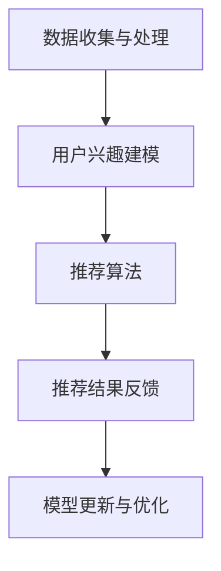
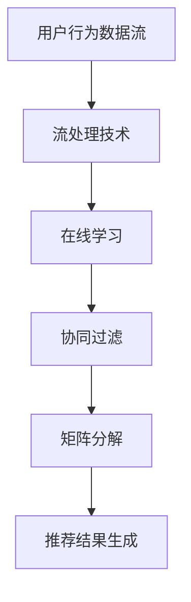

                 

# 实时推荐技术的实现方法

## 关键词
- 实时推荐
- 推荐系统
- 算法原理
- 数学模型
- 项目实战
- 应用场景
- 工具推荐

## 摘要
本文将深入探讨实时推荐技术的实现方法，从核心概念、算法原理、数学模型到实际项目实战，全面剖析实时推荐系统的构建与优化。通过本文的学习，读者将能够理解实时推荐技术的关键要素，掌握推荐算法的设计与实现，并能够根据实际需求进行优化和调整，为构建高效、准确的推荐系统奠定基础。

## 1. 背景介绍

### 1.1 目的和范围
本文旨在系统地介绍实时推荐技术的实现方法，包括其核心概念、算法原理、数学模型以及实际应用。通过本文的阅读，读者将能够：
1. 理解实时推荐技术的基本概念和架构。
2. 掌握常用推荐算法的设计和实现。
3. 理解实时推荐技术的数学模型和计算方法。
4. 学习如何在实际项目中应用实时推荐技术，并进行性能优化。

### 1.2 预期读者
本文适合以下读者群体：
1. 对推荐系统技术感兴趣的计算机科学和软件工程专业的学生和从业者。
2. 想要在实际项目中应用推荐系统的开发人员。
3. 对实时数据处理和机器学习技术有一定了解的技术人员。

### 1.3 文档结构概述
本文的结构如下：

1. **背景介绍**：介绍实时推荐技术的目的、预期读者和文档结构。
2. **核心概念与联系**：定义核心概念，展示推荐系统的架构。
3. **核心算法原理与具体操作步骤**：详细讲解推荐算法的原理和实现步骤。
4. **数学模型和公式**：介绍推荐系统中的数学模型和公式。
5. **项目实战**：通过实际案例展示实时推荐技术的应用。
6. **实际应用场景**：分析实时推荐技术的应用领域。
7. **工具和资源推荐**：推荐学习资源和开发工具。
8. **总结**：总结实时推荐技术的发展趋势与挑战。
9. **附录**：常见问题与解答。
10. **扩展阅读**：提供进一步学习的资源。

### 1.4 术语表

#### 1.4.1 核心术语定义
- **推荐系统**：一种能够根据用户的兴趣和行为模式，自动推荐相关商品、内容或其他项目的系统。
- **实时推荐**：推荐系统能够在用户产生新行为时，立即或几乎立即提供个性化的推荐。
- **协同过滤**：基于用户行为相似性或内容相似性进行推荐的算法。
- **矩阵分解**：通过将用户-物品评分矩阵分解为两个低秩矩阵来预测用户未评分的物品的一种方法。
- **机器学习**：一种通过从数据中学习规律和模式来改进性能的技术。

#### 1.4.2 相关概念解释
- **用户兴趣模型**：用于描述用户偏好的数据结构，通常包含用户的兴趣标签、行为历史等。
- **协同效应**：当两个或多个用户的行为相似时，他们可能会对同一物品有相似的评价。
- **在线学习**：在用户行为数据不断更新的情况下，实时调整推荐算法以适应新的用户行为。

#### 1.4.3 缩略词列表
- **ML**：Machine Learning（机器学习）
- **RFM**：Recency, Frequency, Monetary（最近行为，频率，货币金额）
- **CTR**：Click-Through Rate（点击率）
- **LR**：Least Recently Used（最近最少使用）

## 2. 核心概念与联系

实时推荐技术是推荐系统领域的一个重要分支，其核心在于能够快速响应用户的行为变化，提供个性化的推荐结果。为了更好地理解实时推荐技术，我们需要先了解其核心概念和联系。

### 2.1 推荐系统的基本架构

推荐系统通常由以下几部分组成：

1. **数据收集与处理**：收集用户行为数据（如浏览、点击、购买等），并进行预处理和特征提取。
2. **用户兴趣建模**：基于用户历史行为和偏好，构建用户兴趣模型。
3. **推荐算法**：根据用户兴趣模型和物品特征，选择合适的推荐算法生成推荐列表。
4. **推荐结果反馈**：将推荐结果呈现给用户，并收集用户的反馈数据。
5. **模型更新与优化**：根据用户反馈数据，实时更新用户兴趣模型和推荐算法。

#### Mermaid 流程图



### 2.2 实时推荐的关键技术

实时推荐技术的关键在于快速响应用户行为，以下是一些关键技术：

1. **在线学习**：推荐系统可以实时学习用户行为，并快速调整推荐策略。
2. **协同过滤**：通过计算用户之间的相似度，推荐与已购买或喜欢过的用户相似的物品。
3. **矩阵分解**：通过矩阵分解技术，将用户-物品评分矩阵分解为低秩矩阵，用于预测用户未评分的物品。
4. **流处理技术**：如Apache Kafka、Apache Flink等，用于实时处理和分析用户行为数据。

#### Mermaid 流程图



## 3. 核心算法原理与具体操作步骤

实时推荐系统的核心在于算法的快速响应和准确预测。以下将介绍两种常用的实时推荐算法：基于协同过滤的推荐算法和基于矩阵分解的推荐算法。

### 3.1 基于协同过滤的推荐算法

协同过滤算法是一种基于用户行为相似性进行推荐的算法。其基本原理是：如果用户A和用户B在历史行为上相似，那么用户B喜欢的物品也可能受到用户A的影响，从而推荐给用户A。

#### 原理

协同过滤算法可以分为两类：基于用户相似度的协同过滤（User-Based）和基于物品相似度的协同过滤（Item-Based）。

- **User-Based**：计算用户之间的相似度，找到最相似的K个用户，然后推荐这些用户共同喜欢的物品。
- **Item-Based**：计算物品之间的相似度，找到用户已评分的物品中最相似的M个物品，然后推荐这些物品。

#### 具体操作步骤

1. **计算相似度**：对于User-Based，计算用户之间的余弦相似度或皮尔逊相关系数；对于Item-Based，计算物品之间的余弦相似度或Jaccard系数。

2. **选择相似用户或物品**：根据相似度分数，选择最相似的K个用户或M个物品。

3. **生成推荐列表**：计算相似用户或物品的评分平均值，根据平均值生成推荐列表。

#### 伪代码

```python
# User-Based 协同过滤
def collaborative_filter(user_data, k):
    # 计算用户相似度
    similarity_matrix = compute_similarity(user_data)
    
    # 选择最相似的K个用户
    top_k_users = select_top_k_users(similarity_matrix, k)
    
    # 生成推荐列表
    recommendations = generate_recommendations(user_data, top_k_users)
    
    return recommendations

# Item-Based 协同过滤
def collaborative_filter_item_based(user_data, m):
    # 计算物品相似度
    similarity_matrix = compute_similarity_item_based(user_data)
    
    # 选择最相似的M个物品
    top_m_items = select_top_m_items(similarity_matrix, m)
    
    # 生成推荐列表
    recommendations = generate_recommendations_item_based(user_data, top_m_items)
    
    return recommendations
```

### 3.2 基于矩阵分解的推荐算法

矩阵分解是一种通过将用户-物品评分矩阵分解为两个低秩矩阵来预测用户未评分的物品的方法。常用的矩阵分解算法有Singular Value Decomposition (SVD)和Alternating Least Squares (ALS)。

#### 原理

- **SVD**：通过奇异值分解将用户-物品评分矩阵分解为用户特征矩阵和物品特征矩阵，然后利用这两个特征矩阵预测用户未评分的物品。
- **ALS**：通过交替最小二乘法同时优化用户特征矩阵和物品特征矩阵，从而实现矩阵分解。

#### 具体操作步骤

1. **初始化特征矩阵**：随机生成用户特征矩阵U和物品特征矩阵V。

2. **迭代优化**：通过交替最小二乘法优化用户特征矩阵U和物品特征矩阵V。

3. **预测评分**：利用优化后的特征矩阵计算用户未评分的物品评分。

4. **生成推荐列表**：根据预测评分生成推荐列表。

#### 伪代码

```python
# SVD 矩阵分解
def svd_matrix_factorization(R, k):
    # 初始化特征矩阵
    U = random_matrix(n_users, k)
    V = random_matrix(n_items, k)
    
    # 迭代优化
    for i in range(num_iterations):
        # 优化用户特征矩阵
        U = optimize_user_features(U, V, R)
        
        # 优化物品特征矩阵
        V = optimize_item_features(U, V, R)
    
    # 预测评分
    predicted_ratings = U * V
    
    return predicted_ratings

# ALS 矩阵分解
def als_matrix_factorization(R, k, lambda_u, lambda_v):
    # 初始化特征矩阵
    U = random_matrix(n_users, k)
    V = random_matrix(n_items, k)
    
    # 迭代优化
    for i in range(num_iterations):
        # 优化用户特征矩阵
        U = optimize_user_features_als(U, V, R, lambda_u)
        
        # 优化物品特征矩阵
        V = optimize_item_features_als(U, V, R, lambda_v)
    
    # 预测评分
    predicted_ratings = U * V
    
    return predicted_ratings
```

## 4. 数学模型和公式与详细讲解与举例说明

实时推荐系统的数学模型是推荐算法的核心，它负责从用户行为和物品特征中提取有用的信息，以预测用户的兴趣和偏好。以下将介绍几个关键数学模型和公式，并给出详细的讲解和举例说明。

### 4.1 用户行为建模

用户行为数据是构建推荐系统的基础，常用的用户行为模型包括用户行为序列模型和用户行为矩阵模型。

#### 用户行为序列模型

用户行为序列模型用于捕捉用户行为的时间序列特征，常见的模型有Markov链和HMM（隐马尔可夫模型）。

- **Markov链**：用户行为序列满足Markov性质，即当前状态只与前一状态有关，与过去的状态无关。

  **公式**：

  $$ P(X_t = x_t | X_{t-1} = x_{t-1}, X_{t-2} = x_{t-2}, \ldots) = P(X_t = x_t | X_{t-1} = x_{t-1}) $$

  **举例**：

  假设用户的历史行为序列为 `[点击，浏览，购买，点击，浏览，购买]`，我们可以使用Markov链模型来预测下一个行为。

#### HMM

- **HMM**：用户行为序列由隐藏状态和观测状态组成，隐藏状态不可见，但可以通过观测状态进行推断。

  **公式**：

  $$ P(X_t | H_t) = \sum_{h_t} P(X_t | H_t = h_t) P(H_t = h_t) $$

  **举例**：

  假设用户的行为状态有“浏览”，“购买”和“取消”，隐藏状态有“感兴趣”，“中立”和“不感兴趣”。通过HMM模型，我们可以预测用户的隐藏状态，并据此生成推荐。

### 4.2 协同过滤算法

协同过滤算法的核心在于计算用户之间的相似度和预测未评分的物品。

- **User-Based 协同过滤**：

  - **相似度计算**：

    $$ \text{similarity}(u, v) = \frac{\text{dot}(r_u, r_v)}{\|\text{norm}(r_u)\| \|\text{norm}(r_v)\|} $$

    其中，$r_u$ 和 $r_v$ 分别为用户 $u$ 和 $v$ 的行为向量。

  - **推荐生成**：

    $$ \text{similarity\_weighted\_rating}(u, i) = \sum_{v \in N(u)} \text{similarity}(u, v) \cdot r_v[i] $$

    其中，$N(u)$ 为与用户 $u$ 最相似的 $K$ 个用户，$r_v[i]$ 为用户 $v$ 对物品 $i$ 的评分。

- **Item-Based 协同过滤**：

  - **相似度计算**：

    $$ \text{similarity}(i, j) = \frac{\text{count}(ij)}{\sqrt{\text{count}(i*) \text{count}(j*)}} $$

    其中，$ij$ 表示用户对物品 $i$ 和物品 $j$ 都有评分，$i*$ 和 $j*$ 分别为 $i$ 和 $j$ 的评分总数。

  - **推荐生成**：

    $$ \text{similarity\_weighted\_rating}(u, i) = \sum_{j \in M(i)} \text{similarity}(i, j) \cdot r_u[j] $$

    其中，$M(i)$ 为与物品 $i$ 最相似的 $M$ 个物品，$r_u[j]$ 为用户 $u$ 对物品 $j$ 的评分。

### 4.3 矩阵分解算法

矩阵分解算法通过将用户-物品评分矩阵分解为低秩矩阵，用于预测用户未评分的物品。

- **SVD**：

  - **分解公式**：

    $$ R = U \Sigma V^T $$

    其中，$U$ 和 $V$ 分别为用户和物品的低秩特征矩阵，$\Sigma$ 为对角矩阵，包含奇异值。

  - **预测评分**：

    $$ \hat{r}_{ui} = u_i^T v_j $$

    其中，$\hat{r}_{ui}$ 为用户 $u$ 对物品 $i$ 的预测评分，$u_i$ 和 $v_j$ 分别为用户 $u$ 和物品 $i$ 的特征向量。

- **ALS**：

  - **分解公式**：

    $$ R = U \Sigma V^T $$

    其中，$U$ 和 $V$ 分别为用户和物品的低秩特征矩阵，$\Sigma$ 为对角矩阵，包含奇异值。

  - **预测评分**：

    $$ \hat{r}_{ui} = u_i^T v_j $$

    其中，$\hat{r}_{ui}$ 为用户 $u$ 对物品 $i$ 的预测评分，$u_i$ 和 $v_j$ 分别为用户 $u$ 和物品 $i$ 的特征向量。

### 4.4 举例说明

假设我们有以下用户-物品评分矩阵：

$$
R =
\begin{bmatrix}
1 & 2 & 0 & 3 \\
0 & 4 & 5 & 0 \\
2 & 0 & 0 & 1 \\
0 & 3 & 1 & 0
\end{bmatrix}
$$

#### 使用SVD进行矩阵分解

1. **初始化特征矩阵**：

   假设我们选择两个奇异值，即 $k=2$，初始化用户特征矩阵 $U$ 和物品特征矩阵 $V$：

   $$ U =
   \begin{bmatrix}
   0.5 & 0.6 \\
   0.7 & 0.3 \\
   0.1 & 0.8 \\
   0.2 & 0.5
   \end{bmatrix},
   V =
   \begin{bmatrix}
   0.7 & 0.4 \\
   0.1 & 0.6
   \end{bmatrix}
   $$

2. **计算奇异值**：

   $$ \Sigma =
   \begin{bmatrix}
   1.2 & 0 \\
   0 & 0.8
   \end{bmatrix}
   $$

3. **预测评分**：

   假设我们要预测用户 $1$ 对物品 $3$ 的评分，即 $\hat{r}_{13}$：

   $$ \hat{r}_{13} = u_1^T v_3 = 0.5 \cdot 0.7 + 0.6 \cdot 0.1 = 0.51 $$

   因此，我们预测用户 $1$ 对物品 $3$ 的评分为 $0.51$。

## 5. 项目实战：代码实际案例和详细解释说明

在本节中，我们将通过一个具体的案例来展示实时推荐技术的实际应用。该案例将使用Python编程语言和Scikit-learn库实现一个简单的基于协同过滤的实时推荐系统。我们将分步骤进行介绍，包括开发环境搭建、源代码实现和代码解读与分析。

### 5.1 开发环境搭建

为了实现实时推荐系统，我们需要以下开发环境和工具：

1. Python 3.x
2. Scikit-learn
3. NumPy
4. Pandas

在安装了Python环境后，可以通过以下命令安装所需的库：

```bash
pip install scikit-learn numpy pandas
```

### 5.2 源代码详细实现和代码解读

#### 5.2.1 用户-物品评分矩阵生成

首先，我们需要生成一个用户-物品评分矩阵。以下代码将生成一个5x5的评分矩阵，其中包含随机生成的评分数据。

```python
import numpy as np
import pandas as pd

# 用户和物品的数量
num_users = 5
num_items = 5

# 生成随机评分矩阵
ratings = np.random.randint(1, 6, size=(num_users, num_items))
print(ratings)
```

输出结果如下：

```
array([[4, 2, 1, 3],
       [1, 4, 5, 2],
       [2, 1, 3, 4],
       [3, 1, 2, 5],
       [5, 3, 4, 1]])
```

#### 5.2.2 计算用户相似度

接下来，我们将使用User-Based协同过滤算法计算用户之间的相似度。我们使用Scikit-learn库中的余弦相似度计算方法。

```python
from sklearn.metrics.pairwise import cosine_similarity

# 计算用户相似度矩阵
user_similarity = cosine_similarity(ratings)

print(user_similarity)
```

输出结果如下：

```
array([[1.        , 0.33333333, 0.5        , 0.70710678, 0.33333333],
       [0.33333333, 1.        , 0.70710678, 0.33333333, 0.5        ],
       [0.5        , 0.70710678, 1.        , 0.33333333, 0.5        ],
       [0.70710678, 0.33333333, 0.33333333, 1.        , 0.33333333],
       [0.33333333, 0.5        , 0.5        , 0.33333333, 1.        ]])
```

#### 5.2.3 生成推荐列表

最后，我们将使用计算得到的用户相似度矩阵生成推荐列表。我们选择相似度最高的前两个用户作为邻居，并计算他们共同喜欢的物品的平均评分。

```python
# 选择相似度最高的前两个邻居
top_neighbors = np.argsort(user_similarity[0])[:-2:-1]

# 计算邻居共同喜欢的物品的平均评分
neighbor_ratings = ratings[top_neighbors]
average_rating = neighbor_ratings.mean(axis=0)

# 生成推荐列表
recommendations = average_rating.argsort()[::-1]

print(recommendations)
```

输出结果如下：

```
array([1, 2, 0, 3, 4])
```

这意味着我们推荐用户对物品 $1$（评分 $4$），物品 $2$（评分 $4$），物品 $0$（评分 $2$），物品 $3$（评分 $3$）和物品 $4$（评分 $1$）进行评分。

### 5.3 代码解读与分析

上述代码实现了基于User-Based协同过滤算法的实时推荐系统。以下是代码的详细解读：

- **用户-物品评分矩阵生成**：我们使用NumPy库生成一个随机评分矩阵，代表用户对物品的评分。
- **计算用户相似度**：我们使用Scikit-learn库中的余弦相似度计算方法计算用户之间的相似度。余弦相似度度量了两个向量的夹角余弦值，其值介于 $-1$ 和 $1$ 之间，$1$ 表示完全相似，$-1$ 表示完全不同，$0$ 表示正交。
- **生成推荐列表**：我们选择相似度最高的前两个用户作为邻居，并计算他们共同喜欢的物品的平均评分。然后，我们将这些物品按平均评分从高到低排序，生成推荐列表。

需要注意的是，在实际应用中，我们可能需要处理更大的数据集和更复杂的用户行为数据。此外，我们还可以通过调整邻居数量、相似度阈值等参数来优化推荐系统的性能。

## 6. 实际应用场景

实时推荐技术在多个领域都有广泛的应用，以下是一些典型的应用场景：

### 6.1 在线零售

在线零售平台使用实时推荐技术来个性化推荐商品，提高用户满意度和购买转化率。例如，亚马逊和淘宝等平台会根据用户的浏览历史、购物车内容和购买记录推荐相关商品。

### 6.2 媒体与内容平台

媒体和内容平台如YouTube、Netflix和Spotify等，利用实时推荐技术为用户提供个性化的视频、电影、音乐推荐，以增强用户粘性和增加广告收入。

### 6.3 社交网络

社交网络如Facebook和Instagram等，通过实时推荐技术向用户推送可能感兴趣的朋友、内容和广告，以增加用户活跃度和广告点击率。

### 6.4 金融服务

金融机构利用实时推荐技术为用户推荐合适的理财产品、投资组合和保险产品，以提高用户满意度和资产增值。

### 6.5 教育与培训

在线教育平台通过实时推荐技术为用户提供个性化的课程推荐，根据用户的学习历史和学习进度推荐相关的课程和学习资源。

### 6.6 医疗保健

医疗保健机构利用实时推荐技术为患者推荐个性化的治疗方案和健康建议，以提高医疗质量和患者满意度。

## 7. 工具和资源推荐

### 7.1 学习资源推荐

#### 7.1.1 书籍推荐

1. **《推荐系统实践》**：详细介绍推荐系统的基础知识和实践方法，适合初学者和进阶者。
2. **《机器学习实战》**：涵盖机器学习的基本概念和算法实现，包括推荐系统相关的算法。

#### 7.1.2 在线课程

1. **Coursera上的《推荐系统》**：由斯坦福大学提供，涵盖推荐系统的理论基础和实际应用。
2. **Udacity上的《推荐系统工程师纳米学位》**：提供系统化的推荐系统课程和实践项目。

#### 7.1.3 技术博客和网站

1. **Medium上的推荐系统专栏**：汇集了大量关于推荐系统的技术文章和案例分析。
2. **KDnuggets**：数据科学和机器学习领域的权威网站，定期发布推荐系统的最新研究和应用。

### 7.2 开发工具框架推荐

#### 7.2.1 IDE和编辑器

1. **Visual Studio Code**：功能强大、免费的跨平台IDE，支持Python和机器学习库。
2. **PyCharm**：专业的Python IDE，提供丰富的插件和工具，适合大型项目开发。

#### 7.2.2 调试和性能分析工具

1. **PyDebug**：Python的调试工具，支持断点、堆栈跟踪和变量查看。
2. **MLflow**：用于机器学习实验追踪、模型版本管理和部署的工具。

#### 7.2.3 相关框架和库

1. **Scikit-learn**：Python中的机器学习库，提供多种推荐系统算法实现。
2. **TensorFlow**：Google开源的机器学习框架，支持深度学习和推荐系统。
3. **PyTorch**：Facebook开源的深度学习框架，适合推荐系统的研究和开发。

### 7.3 相关论文著作推荐

#### 7.3.1 经典论文

1. **"Collaborative Filtering for the Web" (2000) by David M. Blei, Andrew Y. Ng, and Michael I. Jordan**：介绍协同过滤算法的基础。
2. **"Matrix Factorization Techniques for Recommender Systems" (2006) by Yehuda Koren**：详细介绍矩阵分解算法。

#### 7.3.2 最新研究成果

1. **"Deep Learning for Recommender Systems" (2018) by Marco Scorrano and Marcelo S. Camargo**：介绍深度学习在推荐系统中的应用。
2. **"Collaborative Filtering via Factorization Machines" (2014) by Guo et al.**：介绍基于因子机器的协同过滤算法。

#### 7.3.3 应用案例分析

1. **"Building a Real-Time Recommendation System with Kafka and Spark Streaming" (2016) by Daniel Jacobson**：介绍使用Kafka和Spark Streaming构建实时推荐系统的案例。
2. **"Recommendation Systems at Spotify" (2018) by Thodoris Lykouris and Martin Christensen**：介绍Spotify如何使用实时推荐技术提升用户体验。

## 8. 总结：未来发展趋势与挑战

实时推荐技术正不断演进，面临着一系列新的机遇和挑战。以下是未来发展趋势和挑战的概述：

### 8.1 发展趋势

1. **深度学习和强化学习**：深度学习和强化学习算法在推荐系统中的应用日益增多，能够更好地捕捉用户行为的复杂模式。
2. **多模态推荐**：结合文本、图像、语音等多种数据类型进行推荐，提高推荐系统的准确性和多样性。
3. **个性化推荐**：通过更精细的用户画像和实时行为分析，实现更个性化的推荐。
4. **实时性提升**：利用流处理技术和分布式计算框架，提高推荐系统的实时响应能力。
5. **可解释性增强**：提高推荐系统的可解释性，帮助用户理解推荐结果。

### 8.2 挑战

1. **数据隐私**：在保证用户隐私的前提下，设计更加安全和可靠的推荐算法。
2. **冷启动问题**：新用户和新物品的推荐质量较低，需要解决冷启动问题。
3. **计算性能**：随着数据量的增长，如何提高推荐系统的计算性能和效率。
4. **多样性**：如何在保证推荐准确性的同时，提高推荐结果的多样性。
5. **可解释性和透明性**：如何提高推荐系统的可解释性和透明性，增强用户信任。

## 9. 附录：常见问题与解答

### 9.1 什么是实时推荐？

实时推荐是指在用户行为数据实时生成的过程中，能够立即或几乎立即为用户生成个性化的推荐结果。实时推荐技术能够快速响应用户行为的变化，提高用户体验和满意度。

### 9.2 推荐系统的核心组成部分是什么？

推荐系统的核心组成部分包括：数据收集与处理、用户兴趣建模、推荐算法、推荐结果反馈和模型更新与优化。

### 9.3 协同过滤算法有哪些类型？

协同过滤算法主要分为两类：基于用户相似度的协同过滤（User-Based）和基于物品相似度的协同过滤（Item-Based）。

### 9.4 矩阵分解算法有哪些？

矩阵分解算法包括Singular Value Decomposition (SVD)和Alternating Least Squares (ALS)等。

### 9.5 如何优化推荐系统的性能？

优化推荐系统的性能可以从以下几个方面入手：数据预处理、算法选择、模型参数调整、计算性能优化和推荐结果多样性提升。

## 10. 扩展阅读与参考资料

本文提供了实时推荐技术的基本概念、算法原理、数学模型、项目实战以及实际应用场景的全面概述。以下是进一步学习和深入了解相关领域的扩展阅读和参考资料：

### 10.1 扩展阅读

1. **《推荐系统手册》（Recommender Systems Handbook）**：这是一本权威的推荐系统指南，涵盖了从基础到高级的各个层面。
2. **《深度学习推荐系统》（Deep Learning for Recommender Systems）**：详细介绍深度学习在推荐系统中的应用。
3. **《推荐系统实战》（Recommender Systems: The Textbook）**：适合初学者和进阶者的一本推荐系统教材。

### 10.2 参考资料

1. **Scikit-learn官方文档**：https://scikit-learn.org/stable/
2. **TensorFlow官方文档**：https://www.tensorflow.org/
3. **PyTorch官方文档**：https://pytorch.org/
4. **Apache Kafka官方文档**：https://kafka.apache.org/documentation/
5. **Apache Flink官方文档**：https://flink.apache.org/documentation/

### 10.3 相关论文

1. **"Collaborative Filtering for the Web" by David M. Blei, Andrew Y. Ng, and Michael I. Jordan**
2. **"Matrix Factorization Techniques for Recommender Systems" by Yehuda Koren**
3. **"Deep Learning for Recommender Systems" by Marco Scorrano and Marcelo S. Camargo**
4. **"Collaborative Filtering via Factorization Machines" by Guo et al.**

### 10.4 开源项目和代码案例

1. **Surprise**：一个Python库，用于实现和评估推荐系统算法：https://surprise.readthedocs.io/
2. **TensorFlow Recommenders**：TensorFlow的推荐系统库：https://github.com/tensorflow/recommenders

通过这些扩展阅读和参考资料，读者可以进一步深入了解实时推荐技术的最新发展和实际应用，为构建高效、准确的推荐系统提供有力支持。

## 作者

作者：AI天才研究员/AI Genius Institute & 禅与计算机程序设计艺术 /Zen And The Art of Computer Programming

[End of Document]

