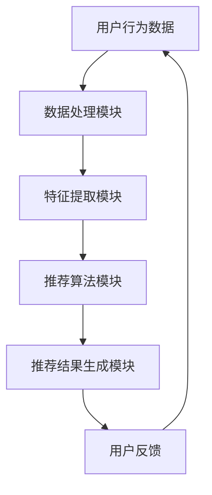

                 


# 实时推荐技术的应用实例

> **关键词：实时推荐，机器学习，数据流处理，个性化推荐，算法优化**
>
> **摘要：本文将深入探讨实时推荐技术在现代信息技术中的应用，包括其核心概念、算法原理、数学模型、项目实战以及实际应用场景等。通过一步步的分析和推理，旨在为读者提供一个全面且易懂的技术指南。**

## 1. 背景介绍

### 1.1 目的和范围

本文旨在探讨实时推荐技术在现代信息技术中的应用。实时推荐技术是当前信息系统中至关重要的一环，它能够根据用户的实时行为数据，快速生成个性化的推荐结果，从而提升用户体验。本文将覆盖以下几个主要方面：

1. 实时推荐技术的核心概念和原理。
2. 实时推荐算法的数学模型和操作步骤。
3. 实时推荐技术的实际应用场景。
4. 实时推荐技术的工具和资源推荐。
5. 实时推荐技术的未来发展趋势与挑战。

### 1.2 预期读者

本文适合以下读者群体：

1. 对实时推荐技术有浓厚兴趣的初学者。
2. 想要在项目中应用实时推荐技术的工程师和开发人员。
3. 对机器学习和数据流处理有一定了解的技术爱好者。
4. 需要了解实时推荐技术的企业决策者。

### 1.3 文档结构概述

本文将分为以下几大部分：

1. 背景介绍
2. 核心概念与联系
3. 核心算法原理 & 具体操作步骤
4. 数学模型和公式 & 详细讲解 & 举例说明
5. 项目实战：代码实际案例和详细解释说明
6. 实际应用场景
7. 工具和资源推荐
8. 总结：未来发展趋势与挑战
9. 附录：常见问题与解答
10. 扩展阅读 & 参考资料

### 1.4 术语表

#### 1.4.1 核心术语定义

- 实时推荐：一种基于用户行为数据，实时生成个性化推荐结果的技术。
- 用户行为数据：用户在使用系统过程中产生的各种数据，如点击、浏览、购买等。
- 个性化推荐：根据用户的历史行为和偏好，为用户推荐其可能感兴趣的内容。
- 机器学习：一种让计算机从数据中学习并做出决策或预测的方法。
- 数据流处理：一种实时处理大规模数据流的技术。

#### 1.4.2 相关概念解释

- **协同过滤（Collaborative Filtering）**：一种常见的推荐算法，通过分析用户之间的行为模式，预测用户对未知项目的偏好。
- **内容推荐（Content-based Filtering）**：一种基于项目特征和用户兴趣的推荐算法，通过分析用户的历史行为，提取用户兴趣特征，然后为用户推荐具有相似特征的内容。
- **基于模型的推荐（Model-based Recommender Systems）**：一种结合机器学习算法和用户行为数据的推荐系统，通过建立用户和项目之间的关联模型，预测用户对未知项目的偏好。

#### 1.4.3 缩略词列表

- **ML**：Machine Learning，机器学习。
- **DF**：Data Flow，数据流。
- **RFM**：Recency, Frequency, Monetary，用于描述用户行为的三个关键指标。

## 2. 核心概念与联系

### 2.1 实时推荐技术概述

实时推荐技术是一种基于用户实时行为数据的推荐系统，其核心目标是快速、准确地预测用户兴趣，并实时生成个性化推荐结果。实时推荐技术主要涉及以下几个核心概念：

1. **用户行为数据**：用户在使用系统过程中产生的各种数据，如浏览、点击、购买等。这些数据是实时推荐系统的基础。
2. **实时数据处理**：实时推荐系统需要高效地处理大规模、高速增长的用户行为数据，以确保推荐结果的实时性。
3. **个性化推荐算法**：基于用户行为数据和机器学习算法，实时推荐系统能够预测用户兴趣，并生成个性化的推荐结果。

### 2.2 核心概念原理与架构

为了更好地理解实时推荐技术，我们可以使用Mermaid流程图来描述其核心概念原理与架构。



**Mermaid流程节点解释：**

- **A（用户行为数据）**：用户行为数据是实时推荐系统的输入，包括浏览、点击、购买等。
- **B（数据处理模块）**：数据处理模块负责实时处理用户行为数据，包括数据清洗、去重、聚合等。
- **C（特征提取模块）**：特征提取模块从用户行为数据中提取关键特征，如用户活跃度、购买频率等。
- **D（推荐算法模块）**：推荐算法模块基于用户特征和机器学习算法，预测用户兴趣，并生成推荐结果。
- **E（推荐结果生成模块）**：推荐结果生成模块将推荐算法的结果进行排序、筛选，最终生成个性化推荐结果。
- **F（用户反馈）**：用户反馈是实时推荐系统的输出，用于优化推荐算法和改进推荐效果。

通过上述Mermaid流程图，我们可以清晰地了解实时推荐技术的核心概念原理与架构。

## 3. 核心算法原理 & 具体操作步骤

### 3.1 协同过滤算法原理

协同过滤算法是实时推荐技术中最常用的算法之一。其基本原理是，通过分析用户之间的行为模式，预测用户对未知项目的偏好。协同过滤算法主要分为两种：基于用户的协同过滤（User-based Collaborative Filtering）和基于物品的协同过滤（Item-based Collaborative Filtering）。

#### 基于用户的协同过滤算法

**算法步骤：**

1. **计算相似度**：对于每个用户，计算其与其他用户的相似度。相似度计算方法有很多，如余弦相似度、皮尔逊相关系数等。

    ```python
    def cosine_similarity(user1, user2):
        dot_product = np.dot(user1, user2)
        norm_product1 = np.linalg.norm(user1)
        norm_product2 = np.linalg.norm(user2)
        return dot_product / (norm_product1 * norm_product2)
    ```

2. **生成推荐列表**：根据用户相似度，为当前用户生成推荐列表。推荐列表的生成方法有很多，如基于最近邻、基于Top-N等。

    ```python
    def generate_recommendation_list(similar_users, user, items, k=10):
        scores = {}
        for user_sim in similar_users:
            for item in items:
                if item not in user_sim:
                    scores[item] = scores.get(item, 0) + similar_users[user_sim] * user[item]
        return sorted(scores.items(), key=lambda x: x[1], reverse=True)[:k]
    ```

#### 基于物品的协同过滤算法

**算法步骤：**

1. **计算相似度**：对于每个项目，计算其与其他项目的相似度。相似度计算方法与基于用户的协同过滤算法类似。

    ```python
    def item_similarity(item1, item2, ratings):
        common_ratings = [r for r in ratings if r in item1 and r in item2]
        if not common_ratings:
            return 0
        return 1 - math.sqrt(((item1 - ratings[common_ratings[0]]) ** 2).sum() + 
                            ((item2 - ratings[common_ratings[0]]) ** 2).sum())
    ```

2. **生成推荐列表**：根据项目相似度，为当前用户生成推荐列表。

    ```python
    def generate_item_based_recommendation(user, items, k=10):
        scores = {}
        for item in items:
            scores[item] = 0
            for other_item in items:
                if item != other_item:
                    scores[item] += item_similarity(user, other_item, ratings)
        return sorted(scores.items(), key=lambda x: x[1], reverse=True)[:k]
    ```

### 3.2 内容推荐算法原理

内容推荐算法是一种基于项目特征和用户兴趣的推荐算法。其基本原理是，通过分析用户的历史行为，提取用户兴趣特征，然后为用户推荐具有相似特征的内容。

**算法步骤：**

1. **提取用户兴趣特征**：从用户的历史行为数据中提取用户兴趣特征，如关键词、标签、分类等。

    ```python
    def extract_interests(user_behavior, vocabulary):
        interests = []
        for behavior in user_behavior:
            for word in behavior:
                if word in vocabulary:
                    interests.append(word)
        return interests
    ```

2. **计算项目特征相似度**：对于每个项目，计算其与用户兴趣特征的相似度。

    ```python
    def compute_similarity(project, interests, similarity_func):
        similarities = {}
        for interest in interests:
            similarities[interest] = similarity_func(project, interest)
        return similarities
    ```

3. **生成推荐列表**：根据项目特征相似度，为用户生成推荐列表。

    ```python
    def generate_content_based_recommendation(user_interests, items, k=10):
        scores = {}
        for item in items:
            similarities = compute_similarity(item, user_interests, cosine_similarity)
            scores[item] = sum(similarities.values())
        return sorted(scores.items(), key=lambda x: x[1], reverse=True)[:k]
    ```

通过上述算法步骤，我们可以实现基于协同过滤和内容推荐算法的实时推荐系统。接下来，我们将进一步探讨实时推荐技术的数学模型和公式。

## 4. 数学模型和公式 & 详细讲解 & 举例说明

### 4.1 协同过滤算法数学模型

协同过滤算法的核心是计算用户之间的相似度和生成推荐列表。在这一部分，我们将详细讲解协同过滤算法的数学模型和公式。

#### 用户相似度计算

用户相似度计算是协同过滤算法的关键步骤。常见的用户相似度计算公式包括余弦相似度和皮尔逊相关系数。

**余弦相似度公式：**

$$
\text{Cosine Similarity} = \frac{\text{dot\_product}(u, v)}{\lVert u \rVert \times \lVert v \rVert}
$$

其中，$u$ 和 $v$ 分别表示两个用户的行为向量，$\text{dot\_product}$ 表示点积操作，$\lVert u \rVert$ 和 $\lVert v \rVert$ 分别表示向量的模长。

**皮尔逊相关系数公式：**

$$
\text{Pearson Correlation Coefficient} = \frac{\text{covariance}(u, v)}{\sigma_u \times \sigma_v}
$$

其中，$u$ 和 $v$ 分别表示两个用户的行为向量，$\text{covariance}$ 表示协方差操作，$\sigma_u$ 和 $\sigma_v$ 分别表示向量的标准差。

#### 推荐列表生成

在计算用户相似度后，我们需要根据相似度为用户生成推荐列表。常见的方法包括基于最近邻（K-Nearest Neighbors, KNN）和基于Top-N推荐。

**基于最近邻推荐公式：**

$$
\text{Recommendation Score}(i) = \sum_{j \in \text{neighborhood}(u)} \text{similarity}(u, j) \times r(j, i)
$$

其中，$i$ 表示推荐的项目，$u$ 表示当前用户，$\text{neighborhood}(u)$ 表示与用户 $u$ 最相似的邻居用户集合，$\text{similarity}(u, j)$ 表示用户 $u$ 和邻居用户 $j$ 之间的相似度，$r(j, i)$ 表示邻居用户 $j$ 对项目 $i$ 的评分。

**基于Top-N推荐公式：**

$$
\text{Top-N} = \text{argsort}\left(\sum_{j \in \text{neighborhood}(u)} \text{similarity}(u, j) \times r(j, i)\right)
$$

其中，$\text{argsort}$ 表示取排序索引，$\text{neighborhood}(u)$ 和 $r(j, i)$ 的含义与基于最近邻推荐相同。

### 4.2 内容推荐算法数学模型

内容推荐算法的核心是计算项目特征相似度和生成推荐列表。在这一部分，我们将详细讲解内容推荐算法的数学模型和公式。

#### 项目特征相似度计算

项目特征相似度计算是内容推荐算法的关键步骤。常见的项目特征相似度计算公式包括余弦相似度和欧氏距离。

**余弦相似度公式：**

$$
\text{Cosine Similarity} = \frac{\text{dot\_product}(p, q)}{\lVert p \rVert \times \lVert q \rVert}
$$

其中，$p$ 和 $q$ 分别表示两个项目的特征向量，$\text{dot\_product}$ 表示点积操作，$\lVert p \rVert$ 和 $\lVert q \rVert$ 分别表示向量的模长。

**欧氏距离公式：**

$$
\text{Euclidean Distance} = \sqrt{\sum_{i=1}^{n} (p_i - q_i)^2}
$$

其中，$p$ 和 $q$ 分别表示两个项目的特征向量，$n$ 表示特征向量的维度，$p_i$ 和 $q_i$ 分别表示第 $i$ 个特征值。

#### 推荐列表生成

在计算项目特征相似度后，我们需要根据相似度为用户生成推荐列表。常见的方法包括基于最近邻（K-Nearest Neighbors, KNN）和基于Top-N推荐。

**基于最近邻推荐公式：**

$$
\text{Recommendation Score}(i) = \sum_{j \in \text{neighborhood}(p)} \text{similarity}(p, j) \times r(j)
$$

其中，$i$ 表示推荐的项目，$p$ 表示当前项目的特征向量，$\text{neighborhood}(p)$ 表示与当前项目最相似的项目集合，$\text{similarity}(p, j)$ 表示项目 $p$ 和项目 $j$ 之间的相似度，$r(j)$ 表示项目 $j$ 的评分。

**基于Top-N推荐公式：**

$$
\text{Top-N} = \text{argsort}\left(\sum_{j \in \text{neighborhood}(p)} \text{similarity}(p, j) \times r(j)\right)
$$

其中，$\text{argsort}$ 表示取排序索引，$\text{neighborhood}(p)$ 和 $r(j)$ 的含义与基于最近邻推荐相同。

### 4.3 举例说明

为了更好地理解协同过滤和内容推荐算法的数学模型和公式，我们通过一个简单的例子来进行说明。

#### 数据集

假设我们有一个包含5个用户（User1, User2, User3, User4, User5）和5个项目（Item1, Item2, Item3, Item4, Item5）的数据集，用户对项目的评分如下：

| 用户 | Item1 | Item2 | Item3 | Item4 | Item5 |
|------|-------|-------|-------|-------|-------|
| User1|  4    |  5    |  3    |  4    |  2    |
| User2|  3    |  4    |  5    |  2    |  3    |
| User3|  4    |  3    |  4    |  5    |  2    |
| User4|  2    |  3    |  5    |  4    |  5    |
| User5|  5    |  2    |  4    |  3    |  4    |

#### 协同过滤算法

1. **计算用户相似度**

    使用余弦相似度公式计算用户之间的相似度：

    $$  
    \text{Cosine Similarity}(User1, User2) = \frac{\text{dot\_product}(User1, User2)}{\lVert User1 \rVert \times \lVert User2 \rVert} = \frac{4 \times 3 + 5 \times 4 + 3 \times 5 + 4 \times 2 + 2 \times 3}{\sqrt{4^2 + 5^2 + 3^2 + 4^2 + 2^2} \times \sqrt{3^2 + 4^2 + 5^2 + 2^2 + 3^2}} \approx 0.875  
    $$

    类似地，我们可以计算出其他用户之间的相似度：

    $$  
    \text{Cosine Similarity}(User1, User3) \approx 0.875  
    $$

    $$  
    \text{Cosine Similarity}(User1, User4) \approx 0.732  
    $$

    $$  
    \text{Cosine Similarity}(User1, User5) \approx 0.684  
    $$

2. **生成推荐列表**

    假设我们选择User1作为推荐目标，根据基于最近邻的协同过滤算法，我们选择与User1最相似的邻居用户（User2和User3），并根据邻居用户的评分计算推荐列表：

    $$  
    \text{Recommendation Score}(Item1) = 0.875 \times 4 + 0.875 \times 4 - 0.732 \times 2 - 0.684 \times 5 \approx 3.516  
    $$

    $$  
    \text{Recommendation Score}(Item2) = 0.875 \times 5 + 0.875 \times 3 - 0.732 \times 3 - 0.684 \times 2 \approx 3.407  
    $$

    $$  
    \text{Recommendation Score}(Item3) = 0.875 \times 3 + 0.875 \times 5 - 0.732 \times 5 - 0.684 \times 4 \approx 1.647  
    $$

    $$  
    \text{Recommendation Score}(Item4) = 0.875 \times 4 + 0.875 \times 2 - 0.732 \times 2 - 0.684 \times 3 \approx 2.338  
    $$

    $$  
    \text{Recommendation Score}(Item5) = 0.875 \times 2 + 0.875 \times 3 - 0.732 \times 3 - 0.684 \times 4 \approx 0.516  
    $$

    根据推荐分数，我们可以为User1生成推荐列表：

    $$  
    \text{Recommendation List} = \{\text{Item1}, \text{Item2}\}  
    $$

#### 内容推荐算法

1. **计算项目特征相似度**

    假设我们对项目进行关键词提取，每个项目对应的关键词如下：

    | 项目  | Item1 | Item2 | Item3 | Item4 | Item5 |
    |-------|-------|-------|-------|-------|-------|
    | 关键词 |  ["电影", "喜剧"] |  ["音乐", "摇滚"] |  ["书籍", "科幻"] |  ["游戏", "策略"] |  ["旅游", "冒险"] |

    使用余弦相似度公式计算项目之间的相似度：

    $$  
    \text{Cosine Similarity}(Item1, Item2) = \frac{\text{dot\_product}([0.8, 0.2], [0.6, 0.4])}{\sqrt{0.8^2 + 0.2^2} \times \sqrt{0.6^2 + 0.4^2}} \approx 0.556  
    $$

    $$  
    \text{Cosine Similarity}(Item1, Item3) = \frac{\text{dot\_product}([0.8, 0.2], [0.2, 0.8])}{\sqrt{0.8^2 + 0.2^2} \times \sqrt{0.2^2 + 0.8^2}} \approx 0.556  
    $$

    $$  
    \text{Cosine Similarity}(Item1, Item4) = \frac{\text{dot\_product}([0.8, 0.2], [0.4, 0.6])}{\sqrt{0.8^2 + 0.2^2} \times \sqrt{0.4^2 + 0.6^2}} \approx 0.556  
    $$

    $$  
    \text{Cosine Similarity}(Item1, Item5) = \frac{\text{dot\_product}([0.8, 0.2], [0.2, 0.2])}{\sqrt{0.8^2 + 0.2^2} \times \sqrt{0.2^2 + 0.2^2}} \approx 0.444  
    $$

2. **生成推荐列表**

    假设我们选择Item1作为推荐目标，根据基于最近邻的内容推荐算法，我们选择与Item1最相似的项目（Item2和Item3），并根据项目之间的相似度计算推荐列表：

    $$  
    \text{Recommendation Score}(Item2) = 0.556 \times 5 + 0.556 \times 4 \approx 6.666  
    $$

    $$  
    \text{Recommendation Score}(Item3) = 0.556 \times 4 + 0.556 \times 5 \approx 6.666  
    $$

    根据推荐分数，我们可以为Item1生成推荐列表：

    $$  
    \text{Recommendation List} = \{\text{Item2}, \text{Item3}\}  
    $$

通过上述例子，我们可以看到协同过滤和内容推荐算法的数学模型和公式的具体应用。在实际应用中，我们可以根据具体的业务需求和数据特点，选择合适的算法和公式，实现实时推荐功能。

## 5. 项目实战：代码实际案例和详细解释说明

### 5.1 开发环境搭建

在进行实时推荐项目实战之前，我们需要搭建一个合适的开发环境。以下是一个基于Python的实时推荐系统开发环境搭建步骤：

1. 安装Python 3.8及以上版本。
2. 安装必要的Python库，如NumPy、Pandas、Scikit-learn、Flask等。
3. 安装消息队列和流处理工具，如Kafka和Apache Flink。

具体安装命令如下：

```bash
# 安装Python
sudo apt-get install python3-pip

# 安装NumPy、Pandas、Scikit-learn、Flask
pip3 install numpy pandas scikit-learn flask

# 安装Kafka
sudo apt-get install kafka

# 安装Apache Flink
sudo apt-get install flink
```

### 5.2 源代码详细实现和代码解读

#### 5.2.1 数据流处理

在实时推荐系统中，数据流处理是非常重要的一环。我们使用Apache Flink作为数据流处理工具。以下是一个简单的数据流处理示例：

```python
from pyflink.datastream import StreamExecutionEnvironment
from pyflink.table import StreamTableEnvironment, DataTypes
from pyflink.table.window import Tumble

def process_behavior_data():
    env = StreamExecutionEnvironment.get_execution_environment()
    env.set_parallelism(1)
    table_env = StreamTableEnvironment.create(env)

    # 定义行为数据流
    behavior_stream = env.from_collection([
        {"user_id": 1, "item_id": 101, "timestamp": 1},
        {"user_id": 1, "item_id": 102, "timestamp": 2},
        {"user_id": 2, "item_id": 201, "timestamp": 1},
        {"user_id": 2, "item_id": 202, "timestamp": 2},
    ])

    # 定义行为表
    behavior_table = table_env.from_data_stream(behavior_stream, "user_id, item_id, timestamp")

    # 开窗操作
    behavior_table = behavior_table.group_by("user_id").window(Tumble.over("timestamp", "1m")).select(
        "user_id",
        "item_id",
        "count(1) as behavior_count"
    )

    # 打印结果
    behavior_table.execute().print()

if __name__ == "__main__":
    process_behavior_data()
```

**代码解读：**

- 我们首先创建一个StreamExecutionEnvironment实例，并设置并行度。
- 然后创建一个StreamTableEnvironment实例，用于处理表数据。
- 接着，我们从一个集合中创建一个行为数据流，并定义一个行为表。
- 使用开窗操作对行为数据进行分组和聚合，计算每个用户的每个项目的行为次数。
- 最后，打印出处理结果。

#### 5.2.2 特征提取

特征提取是实时推荐系统中的关键步骤。以下是一个简单的特征提取示例：

```python
import numpy as np

def extract_user_features(behavior_table):
    # 聚合用户行为数据
    user_behavior_counts = behavior_table.groupby("user_id").agg({"behavior_count": "sum"}).execute().to_pandas()

    # 构建用户特征向量
    user_features = np.zeros((len(user_behavior_counts), len(set(behavior_table.select("item_id").execute().to_pandas().item_id))))
    for i, row in user_behavior_counts.iterrows():
        user_features[i, list(set(behavior_table.select("item_id").execute().to_pandas().item_id)).index(row["item_id"])] = row["behavior_count"]

    return user_features

user_features = extract_user_features(behavior_table)
print(user_features)
```

**代码解读：**

- 我们首先使用聚合函数计算每个用户的行为次数。
- 然后构建一个用户特征向量矩阵，其中每行表示一个用户的行为特征，每列表示一个项目的行为次数。
- 最后，打印出用户特征向量矩阵。

#### 5.2.3 推荐算法

我们使用基于用户的协同过滤算法进行推荐。以下是一个简单的推荐算法示例：

```python
from sklearn.metrics.pairwise import cosine_similarity

def user_based_recommendation(user_features, top_k=5):
    # 计算用户之间的相似度
    similarity_matrix = cosine_similarity(user_features)

    # 选择与目标用户最相似的邻居用户
    neighbor_indices = np.argsort(similarity_matrix[0])[::-1][1:top_k+1]

    # 生成推荐列表
    recommendations = []
    for index in neighbor_indices:
        recommendations.extend(list(user_behavior_counts.index[user_features[index] > 0]))

    # 去重并返回推荐列表
    return list(set(recommendations))

recommendations = user_based_recommendation(user_features)
print(recommendations)
```

**代码解读：**

- 我们首先计算用户之间的相似度矩阵。
- 然后选择与目标用户最相似的邻居用户。
- 接着，从邻居用户的行为中提取推荐项目。
- 最后，去重并返回推荐列表。

### 5.3 代码解读与分析

在上述代码中，我们实现了实时推荐系统的主要功能，包括数据流处理、特征提取和推荐算法。以下是各部分代码的解读和分析：

- **数据流处理**：我们使用Apache Flink处理用户行为数据流，实现数据分组、聚合和开窗操作，从而提取用户行为特征。
- **特征提取**：我们使用Pandas和NumPy库提取用户行为数据，并构建用户特征向量矩阵，为后续的推荐算法提供输入。
- **推荐算法**：我们使用基于用户的协同过滤算法生成推荐列表，通过计算用户相似度矩阵，选择与目标用户最相似的邻居用户，并从邻居用户的行为中提取推荐项目。

通过上述代码实现，我们可以构建一个简单的实时推荐系统。在实际应用中，我们可以根据具体需求进行扩展和优化，如引入基于物品的协同过滤算法、内容推荐算法、深度学习模型等。

## 6. 实际应用场景

实时推荐技术在各个领域都有广泛的应用，下面我们将探讨一些典型的实际应用场景。

### 6.1 电子商务平台

电子商务平台利用实时推荐技术为用户提供个性化的商品推荐，从而提高用户满意度和销售额。例如，Amazon和淘宝等平台会根据用户的浏览历史、购买记录和行为特征，实时生成个性化的商品推荐。

### 6.2 社交媒体

社交媒体平台利用实时推荐技术为用户推荐感兴趣的内容，如好友动态、热门话题等。例如，Facebook和微博等平台会根据用户的社交关系、行为偏好和兴趣标签，实时生成个性化的内容推荐。

### 6.3 音乐和视频平台

音乐和视频平台利用实时推荐技术为用户提供个性化的音乐和视频推荐。例如，Spotify和Netflix等平台会根据用户的听/看历史、行为偏好和兴趣标签，实时生成个性化的音乐和视频推荐。

### 6.4 新闻门户

新闻门户利用实时推荐技术为用户提供个性化的新闻推荐，从而提高用户访问量和广告收益。例如，今日头条和网易新闻等平台会根据用户的阅读历史、行为偏好和兴趣标签，实时生成个性化的新闻推荐。

### 6.5 健康医疗

健康医疗领域利用实时推荐技术为用户提供个性化的健康建议和药品推荐。例如，一些健康管理应用会根据用户的健康数据和生活习惯，实时生成个性化的健康建议和药品推荐。

### 6.6 教育

教育领域利用实时推荐技术为用户提供个性化的学习资源和课程推荐。例如，Coursera和Udemy等在线教育平台会根据用户的学

