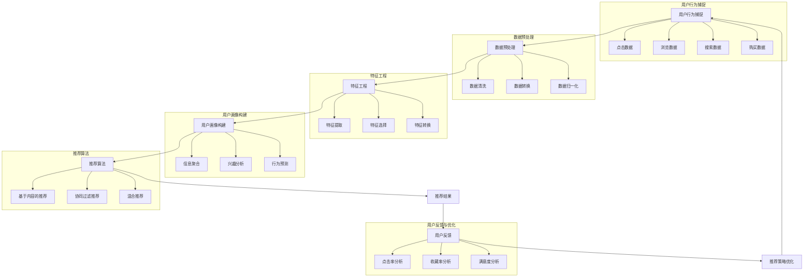

                 

### 实时推荐的用户行为捕捉与分析

> **关键词：实时推荐、用户行为捕捉、数据分析、推荐系统、机器学习、用户画像**

> **摘要：本文将探讨如何通过实时推荐系统捕捉和分析用户行为，提高推荐系统的准确性和用户体验。我们将详细分析用户行为的捕捉方法、数据处理技术、核心算法原理以及如何在实际项目中应用这些技术。**

随着互联网的迅猛发展，个性化推荐系统已经成为现代信息技术领域中的一个重要研究方向。这些系统通过分析用户的历史行为和兴趣偏好，为用户提供个性化的内容推荐，从而极大地提升了用户体验。然而，推荐系统的核心挑战之一是如何实时捕捉和分析用户行为，以实现高效和精准的推荐。

本文旨在探讨如何通过实时推荐系统捕捉和分析用户行为，从而提高推荐系统的准确性和用户体验。我们将从以下几个方面展开讨论：

1. **背景介绍**：介绍实时推荐系统和用户行为捕捉的重要性，以及本文的结构和核心内容。
2. **核心概念与联系**：讲解用户行为捕捉和分析所需的核心概念和原理，并使用 Mermaid 流程图进行展示。
3. **核心算法原理 & 具体操作步骤**：详细介绍用户行为捕捉和分析所使用的主要算法原理和操作步骤，使用伪代码进行说明。
4. **数学模型和公式 & 详细讲解 & 举例说明**：介绍用户行为分析过程中涉及的数学模型和公式，并进行详细讲解和实例说明。
5. **项目实战：代码实际案例和详细解释说明**：通过一个实际项目案例，展示如何实现用户行为捕捉和分析，并对源代码进行详细解读。
6. **实际应用场景**：讨论用户行为捕捉和分析在不同领域的实际应用。
7. **工具和资源推荐**：推荐相关学习资源和开发工具，帮助读者深入了解和掌握实时推荐系统和用户行为捕捉技术。
8. **总结：未来发展趋势与挑战**：总结本文的主要观点，并探讨实时推荐系统和用户行为捕捉的未来发展趋势和挑战。

通过本文的阅读，读者将能够全面了解实时推荐系统和用户行为捕捉与分析的技术原理和应用方法，从而为实际项目提供有价值的参考和指导。

### 1. 背景介绍

#### 1.1 目的和范围

实时推荐系统在现代互联网应用中扮演着越来越重要的角色。通过实时捕捉和分析用户行为，推荐系统能够为用户提供高度个性化的内容，从而提升用户体验和用户粘性。本文的目的在于探讨如何通过实时推荐系统高效捕捉和分析用户行为，从而实现精准推荐。本文将覆盖以下几个核心内容：

- 实时推荐系统的基本概念和原理
- 用户行为捕捉的方法和技术
- 数据处理和用户行为分析的核心算法
- 用户行为分析的实际应用案例
- 开发工具和资源的推荐

本文旨在为读者提供一个全面、系统的指导，使其能够深入理解实时推荐系统和用户行为捕捉与分析的技术原理，并能够在实际项目中应用这些技术。

#### 1.2 预期读者

本文主要面向以下几类读者：

- 对实时推荐系统和用户行为分析感兴趣的工程师和开发人员
- 想要在现有项目中引入实时推荐系统的项目经理和产品经理
- 想要了解最新技术和行业趋势的技术爱好者
- 想要在研究领域进一步探索相关技术的科研人员

无论您是初学者还是有经验的专业人士，本文都将为您提供有价值的见解和实践经验。

#### 1.3 文档结构概述

本文的结构如下：

1. **背景介绍**：介绍实时推荐系统和用户行为捕捉的重要性，以及本文的结构和核心内容。
2. **核心概念与联系**：讲解用户行为捕捉和分析所需的核心概念和原理，并使用 Mermaid 流程图进行展示。
3. **核心算法原理 & 具体操作步骤**：详细介绍用户行为捕捉和分析所使用的主要算法原理和操作步骤，使用伪代码进行说明。
4. **数学模型和公式 & 详细讲解 & 举例说明**：介绍用户行为分析过程中涉及的数学模型和公式，并进行详细讲解和实例说明。
5. **项目实战：代码实际案例和详细解释说明**：通过一个实际项目案例，展示如何实现用户行为捕捉和分析，并对源代码进行详细解读。
6. **实际应用场景**：讨论用户行为捕捉和分析在不同领域的实际应用。
7. **工具和资源推荐**：推荐相关学习资源和开发工具，帮助读者深入了解和掌握实时推荐系统和用户行为捕捉技术。
8. **总结：未来发展趋势与挑战**：总结本文的主要观点，并探讨实时推荐系统和用户行为捕捉的未来发展趋势和挑战。
9. **附录：常见问题与解答**：针对读者可能遇到的问题提供解答。
10. **扩展阅读 & 参考资料**：推荐更多相关阅读材料和参考资料。

通过本文的阅读，读者可以逐步深入了解实时推荐系统和用户行为捕捉与分析的各个方面，为实际项目提供有效的技术支持。

#### 1.4 术语表

为了确保本文内容的清晰和一致性，以下是一些在本文中使用的核心术语及其定义：

**术语** | **定义** | **备注**
--- | --- | ---
实时推荐系统 | 通过实时分析用户行为和偏好，为用户推荐个性化内容的系统。 | 
用户行为捕捉 | 指从用户交互中收集和分析行为数据的过程。 |
用户画像 | 描述用户特征和兴趣偏好的抽象模型。 | 通常包含用户的基本信息、历史行为、兴趣爱好等。
机器学习 | 利用数据和算法，使计算机系统具备学习能力和自适应能力的技术。 | 主要应用于特征提取、分类、聚类等任务。
推荐算法 | 用于生成个性化推荐列表的算法。 | 包括基于内容的推荐、协同过滤、混合推荐等。
数据处理 | 对采集到的用户行为数据进行清洗、转换、归一化等操作，以便于后续分析。 |
用户反馈 | 用户对推荐内容的反应，包括点击、收藏、评价等行为。 | 用于优化推荐系统的效果。

#### 1.4.1 核心术语定义

在本文中，我们将详细介绍一些核心术语，以便读者更好地理解相关概念和技术。

**用户行为捕捉**：用户行为捕捉是指从用户与系统交互过程中收集和记录行为数据的过程。这些数据可以是点击、浏览、搜索、购买等操作，它们能够反映用户对系统内容的兴趣和偏好。用户行为捕捉是实时推荐系统的关键组成部分，它为后续的数据分析和个性化推荐提供了基础数据。

**用户画像**：用户画像是对用户特征和兴趣偏好的一种抽象表示。通过构建用户画像，系统能够更好地理解和预测用户的兴趣和行为。用户画像通常包含多个维度，如基本信息（年龄、性别、地理位置）、历史行为（浏览记录、搜索关键词、购买记录）和兴趣爱好（偏好分类、关注话题）等。

**机器学习**：机器学习是一种使计算机系统具备学习能力和自适应能力的技术。在实时推荐系统中，机器学习算法被广泛应用于特征提取、分类和预测任务。常见的机器学习算法包括线性回归、决策树、支持向量机、神经网络等。

**推荐算法**：推荐算法是用于生成个性化推荐列表的算法。这些算法可以根据用户的历史行为、兴趣爱好和其他用户的行为数据，预测用户对某些内容的偏好，从而生成个性化的推荐结果。常见的推荐算法包括基于内容的推荐、协同过滤和混合推荐等。

**数据处理**：数据处理是对采集到的用户行为数据进行清洗、转换、归一化等操作，以便于后续分析。在实时推荐系统中，数据处理是确保数据质量和模型效果的重要环节。

**用户反馈**：用户反馈是指用户对推荐内容的反应，如点击、收藏、评价等行为。用户反馈是优化推荐系统效果的重要指标，通过分析用户反馈，系统能够不断调整推荐策略，提高用户满意度。

通过以上核心术语的详细定义，读者可以更好地理解本文中涉及的技术概念和方法，为后续章节的学习打下坚实的基础。

#### 1.4.2 相关概念解释

在探讨实时推荐系统和用户行为捕捉与分析的过程中，了解以下相关概念对于深入理解本文内容至关重要。

**实时推荐系统**：实时推荐系统是一种能够即时响应用户需求，为用户提供个性化内容推荐的技术。与传统的批量推荐系统不同，实时推荐系统通过实时分析用户行为和偏好，动态调整推荐策略，从而实现更加精准和及时的推荐。实时推荐系统通常涉及数据采集、实时处理、用户画像构建、推荐算法和结果反馈等多个环节。

**用户行为数据**：用户行为数据是指用户在系统中的操作记录，如点击、浏览、搜索、购买等。这些数据反映了用户的兴趣、偏好和需求，是构建用户画像和优化推荐算法的基础。用户行为数据可以来源于多个渠道，如网站日志、移动应用日志、社交媒体等。

**用户画像**：用户画像是对用户特征和兴趣偏好的抽象表示，通常包含基本信息、历史行为和兴趣爱好等多个维度。通过构建用户画像，系统可以更好地理解和预测用户的兴趣和行为，从而生成个性化的推荐结果。

**推荐算法**：推荐算法是用于生成个性化推荐列表的算法。常见的推荐算法包括基于内容的推荐、协同过滤和混合推荐等。基于内容的推荐根据用户的历史行为和兴趣，推荐类似的内容；协同过滤通过分析用户行为和偏好，找到与目标用户相似的其他用户，推荐这些用户喜欢的内容；混合推荐则是结合多种算法，生成更优的推荐结果。

**数据处理**：数据处理是对用户行为数据进行的清洗、转换、归一化等操作，以确保数据质量和模型效果。数据处理是实时推荐系统的关键环节，通过有效的数据处理，可以提高模型预测的准确性和推荐效果。

**用户反馈**：用户反馈是指用户对推荐内容的反应，如点击、收藏、评价等行为。用户反馈是优化推荐系统效果的重要指标，通过分析用户反馈，系统可以不断调整推荐策略，提高用户满意度。

通过以上相关概念的解释，读者可以更加全面地理解实时推荐系统和用户行为捕捉与分析的技术原理和应用场景，为后续章节的学习打下坚实的基础。

#### 1.4.3 缩略词列表

在本文中，我们将使用一些常见的缩略词，以简化表述并提高文章的可读性。以下是本文中涉及的主要缩略词及其全称：

**缩略词** | **全称** | **备注**
--- | --- | ---
API | 应用程序编程接口 | 用于系统间交互的标准接口
DB | 数据库 | 存储和管理数据的系统
ML | 机器学习 | 数据驱动的方法，使计算机具备学习能力和自适应能力
NLP | 自然语言处理 | 计算机理解、生成和处理人类语言的技术
SQL | 结构化查询语言 | 用于数据库管理和数据查询的语言
UI | 用户界面 | 用户与系统交互的界面
UX | 用户体验 | 用户在使用产品过程中的感受和满意度
Web | 网络 | 广泛连接的分布式信息系统

通过上述缩略词列表，读者可以快速理解文章中使用的专业术语和行业惯例，提高阅读效率。

### 2. 核心概念与联系

#### 2.1 核心概念

在实时推荐系统和用户行为捕捉与分析中，以下核心概念至关重要：

**用户行为捕捉**：指从用户与系统交互过程中收集和记录的行为数据，如点击、浏览、搜索、购买等。用户行为捕捉是实现个性化推荐的基础。

**用户画像**：描述用户特征和兴趣偏好的抽象模型，通常包括基本信息、历史行为和兴趣爱好等维度。用户画像是构建个性化推荐策略的关键。

**推荐算法**：用于生成个性化推荐列表的算法，包括基于内容的推荐、协同过滤和混合推荐等。这些算法通过分析用户行为和偏好，预测用户对内容的兴趣，从而提供个性化推荐。

**数据处理**：对采集到的用户行为数据进行清洗、转换、归一化等操作，以确保数据质量和模型效果。数据处理是保证推荐系统性能的重要环节。

**用户反馈**：用户对推荐内容的反应，如点击、收藏、评价等行为。用户反馈用于优化推荐系统的效果和用户体验。

**机器学习**：一种使计算机系统具备学习能力和自适应能力的技术，广泛应用于特征提取、分类和预测任务。在推荐系统中，机器学习用于构建用户画像和优化推荐算法。

#### 2.2 关系与联系

**用户行为捕捉与用户画像**：用户行为捕捉是构建用户画像的基础。通过捕捉用户的行为数据，可以提炼出用户的关键特征和兴趣偏好，从而形成用户画像。

**用户画像与推荐算法**：用户画像为推荐算法提供了关键输入。基于用户画像，推荐算法可以更好地预测用户的兴趣，生成个性化的推荐结果。

**推荐算法与用户反馈**：推荐算法生成的推荐结果需要用户反馈来验证和优化。用户反馈用于评估推荐效果，指导系统不断调整和优化推荐策略。

**数据处理与机器学习**：数据处理是机器学习的基础。通过有效处理用户行为数据，可以提高模型预测的准确性和推荐效果。

**机器学习与推荐算法**：机器学习是推荐算法的核心技术。通过机器学习，推荐算法可以不断优化，实现更精准的个性化推荐。

以上核心概念和联系构成了实时推荐系统和用户行为捕捉与分析的技术框架。通过深入理解和应用这些概念，我们可以构建高效、智能的推荐系统，提升用户体验。

#### 2.3 Mermaid 流程图

为了更好地展示用户行为捕捉和分析的核心流程，我们使用 Mermaid 流程图来描述整个数据处理和用户行为分析的过程。



通过以上 Mermaid 流程图，我们可以清晰地看到用户行为捕捉、数据处理、用户画像构建、推荐算法和用户反馈优化等环节之间的相互关系和作用。这个过程形成一个闭环，确保推荐系统能够实时、高效地响应用户需求，提供个性化的推荐。

### 3. 核心算法原理 & 具体操作步骤

在实时推荐系统和用户行为捕捉与分析中，核心算法的原理和具体操作步骤至关重要。以下将详细介绍几种常用的算法，并使用伪代码进行说明。

#### 3.1 用户行为捕捉算法

用户行为捕捉算法主要用于从用户交互中收集数据。以下是一种简单的事件捕捉算法：

```python
def capture_user_behavior(event_type, event_data):
    """
    捕获用户行为数据。
    
    参数：
    - event_type：事件类型（如点击、浏览、搜索等）。
    - event_data：事件数据（如时间戳、页面URL、关键词等）。
    
    返回值：
    - behavior_data：用户行为数据。
    """
    behavior_data = {
        'event_type': event_type,
        'event_data': event_data,
        'timestamp': get_current_timestamp()
    }
    store_behavior_data(behavior_data)
    return behavior_data
```

函数 `capture_user_behavior` 接受事件类型和事件数据作为输入，并将这些数据存储在行为数据集中。该算法通过记录时间戳来确保数据的实时性。

#### 3.2 数据预处理算法

数据预处理是确保数据质量和模型效果的重要环节。以下是一种常见的数据预处理算法：

```python
def preprocess_data(raw_data):
    """
    预处理用户行为数据。
    
    参数：
    - raw_data：原始用户行为数据。
    
    返回值：
    - cleaned_data：清洗后的用户行为数据。
    """
    cleaned_data = []
    for data in raw_data:
        cleaned_data.append({
            'event_type': data['event_type'],
            'event_data': preprocess_event_data(data['event_data']),
            'timestamp': data['timestamp']
        })
    return cleaned_data

def preprocess_event_data(event_data):
    """
    预处理单个事件数据。
    
    参数：
    - event_data：单个事件数据。
    
    返回值：
    - cleaned_event_data：清洗后的单个事件数据。
    """
    cleaned_event_data = {}
    for key, value in event_data.items():
        if value is not None:
            cleaned_event_data[key] = value.strip()
    return cleaned_event_data
```

函数 `preprocess_data` 对原始用户行为数据进行清洗，去除无效数据，并将数据转换为统一的格式。`preprocess_event_data` 函数则对单个事件数据进行处理，确保数据的完整性和一致性。

#### 3.3 用户画像构建算法

用户画像构建是将用户行为数据转化为用户特征和兴趣偏好的过程。以下是一种简单的用户画像构建算法：

```python
def build_user_profile(user_id, behavior_data):
    """
    构建用户画像。
    
    参数：
    - user_id：用户ID。
    - behavior_data：用户行为数据。
    
    返回值：
    - user_profile：用户画像。
    """
    user_profile = {
        'user_id': user_id,
        'basic_info': get_basic_info(user_id),
        'behavior_features': extract_behavior_features(behavior_data),
        'interests': extract_interests(behavior_data)
    }
    return user_profile

def extract_behavior_features(behavior_data):
    """
    提取用户行为特征。
    
    参数：
    - behavior_data：用户行为数据。
    
    返回值：
    - behavior_features：用户行为特征。
    """
    behavior_features = []
    for data in behavior_data:
        behavior_features.append({
            'event_type': data['event_type'],
            'event_data': data['event_data'],
            'timestamp': data['timestamp']
        })
    return behavior_features

def extract_interests(behavior_data):
    """
    提取用户兴趣。
    
    参数：
    - behavior_data：用户行为数据。
    
    返回值：
    - interests：用户兴趣。
    """
    interests = {}
    for data in behavior_data:
        if data['event_type'] == 'search':
            for keyword in data['event_data']['keywords']:
                interests[keyword] = interests.get(keyword, 0) + 1
    return interests
```

函数 `build_user_profile` 接受用户ID和行为数据作为输入，并提取用户的基本信息、行为特征和兴趣。`extract_behavior_features` 和 `extract_interests` 函数分别用于提取用户的行为特征和兴趣，以构建完整的用户画像。

#### 3.4 推荐算法

推荐算法是实时推荐系统的核心组成部分，用于生成个性化推荐列表。以下是一种简单的基于内容的推荐算法：

```python
def content_based_recommendation(user_profile, content_items):
    """
    基于内容的推荐。
    
    参数：
    - user_profile：用户画像。
    - content_items：内容项目。
    
    返回值：
    - recommendations：推荐列表。
    """
    recommendations = []
    for item in content_items:
        similarity_score = calculate_similarity(user_profile['interests'], item['interests'])
        if similarity_score > threshold:
            recommendations.append(item)
    return recommendations

def calculate_similarity(user_interests, item_interests):
    """
    计算用户兴趣与项目兴趣的相似度。
    
    参数：
    - user_interests：用户兴趣。
    - item_interests：项目兴趣。
    
    返回值：
    - similarity_score：相似度分数。
    """
    intersection_size = len(set(user_interests).intersection(set(item_interests)))
    union_size = len(set(user_interests).union(set(item_interests)))
    similarity_score = intersection_size / union_size
    return similarity_score
```

函数 `content_based_recommendation` 接受用户画像和内容项目作为输入，并计算用户兴趣与项目兴趣的相似度。如果相似度分数高于阈值，则将项目添加到推荐列表中。

#### 3.5 用户反馈与推荐策略优化

用户反馈用于评估推荐效果，并指导系统不断调整和优化推荐策略。以下是一种简单的用户反馈处理算法：

```python
def process_user_feedback(user_id, feedback_data):
    """
    处理用户反馈。
    
    参数：
    - user_id：用户ID。
    - feedback_data：用户反馈数据。
    
    返回值：
    - optimized_user_profile：优化后的用户画像。
    """
    user_profile = get_user_profile(user_id)
    if feedback_data['type'] == 'click':
        user_profile['interests'].update(feedback_data['data'])
    elif feedback_data['type'] == 'rating':
        user_profile['rating'] = feedback_data['data']
    optimized_user_profile = update_user_profile(user_profile)
    return optimized_user_profile

def update_user_profile(user_profile):
    """
    更新用户画像。
    
    参数：
    - user_profile：用户画像。
    
    返回值：
    - optimized_user_profile：优化后的用户画像。
    """
    # 根据反馈数据调整用户画像
    optimized_user_profile = {
        'user_id': user_profile['user_id'],
        'basic_info': user_profile['basic_info'],
        'behavior_features': user_profile['behavior_features'],
        'interests': normalize_interests(user_profile['interests'])
    }
    return optimized_user_profile

def normalize_interests(interests):
    """
    归一化用户兴趣。
    
    参数：
    - interests：用户兴趣。
    
    返回值：
    - normalized_interests：归一化后的用户兴趣。
    """
    max_interest = max(interests.values())
    normalized_interests = {k: v / max_interest for k, v in interests.items()}
    return normalized_interests
```

函数 `process_user_feedback` 接受用户ID和用户反馈数据作为输入，并更新用户画像。`update_user_profile` 和 `normalize_interests` 函数用于优化用户画像，确保推荐结果的准确性和多样性。

通过以上核心算法原理和具体操作步骤的介绍，我们可以构建一个高效、智能的实时推荐系统，实现精准的用户行为捕捉和分析。

### 4. 数学模型和公式 & 详细讲解 & 举例说明

在实时推荐系统和用户行为分析中，数学模型和公式起到了关键作用。以下将介绍几个核心的数学模型和公式，并对其进行详细讲解和举例说明。

#### 4.1 余弦相似度

余弦相似度是一种常用的度量两个向量之间相似度的方法。它通过计算两个向量的夹角余弦值，来确定它们之间的相似程度。公式如下：

$$
\cos(\theta) = \frac{\sum_{i=1}^{n} x_i \cdot y_i}{\sqrt{\sum_{i=1}^{n} x_i^2} \cdot \sqrt{\sum_{i=1}^{n} y_i^2}}
$$

其中，$x$ 和 $y$ 是两个向量，$n$ 是向量的维度。

**详细讲解**：

余弦相似度通过点积（分子部分）和两个向量的模（分母部分）来计算。当两个向量方向越接近时，它们的点积越大，模的乘积越小，余弦值越接近1，表示相似度越高。

**举例说明**：

假设有两个用户 $u_1$ 和 $u_2$，他们的兴趣向量分别为：

$$
u_1 = [0.5, 0.7, 0.8], \quad u_2 = [0.6, 0.5, 0.7]
$$

则它们的余弦相似度为：

$$
\cos(\theta) = \frac{0.5 \cdot 0.6 + 0.7 \cdot 0.5 + 0.8 \cdot 0.7}{\sqrt{0.5^2 + 0.7^2 + 0.8^2} \cdot \sqrt{0.6^2 + 0.5^2 + 0.7^2}} \approx 0.72
$$

#### 4.2 感知机算法

感知机算法是一种简单的二分类学习算法，主要用于分类问题。其目标是找到一条最优分类边界，将不同类别的数据点分开。公式如下：

$$
w_{new} = w_{old} + \eta \cdot (y \cdot x)
$$

其中，$w$ 是权重向量，$x$ 是特征向量，$y$ 是样本标签，$\eta$ 是学习率。

**详细讲解**：

感知机算法通过更新权重向量 $w$，使分类边界满足所有正类样本（$y=1$）在边界的一侧，而负类样本（$y=-1$）在另一侧。每次迭代中，如果样本点的分类错误，则更新权重向量。

**举例说明**：

假设有两个特征向量 $x_1 = [1, 0]$ 和 $x_2 = [1, 1]$，标签分别为 $y_1 = 1$ 和 $y_2 = 1$。初始权重向量 $w = [0, 0]$，学习率 $\eta = 0.1$。第一次迭代时：

$$
w_{new} = w_{old} + \eta \cdot (y_1 \cdot x_1) = [0, 0] + 0.1 \cdot (1 \cdot 1) = [0.1, 0]
$$

第二次迭代时：

$$
w_{new} = w_{old} + \eta \cdot (y_2 \cdot x_2) = [0.1, 0] + 0.1 \cdot (1 \cdot 1) = [0.2, 0]
$$

通过迭代更新权重，感知机算法可以找到最优分类边界。

#### 4.3 逻辑回归

逻辑回归是一种常用的概率型分类模型，用于预测二分类问题。其公式如下：

$$
\hat{y} = \sigma(w_0 + \sum_{i=1}^{n} w_i x_i)
$$

其中，$\sigma$ 是逻辑函数（Sigmoid函数），$w_0$ 是截距，$w_i$ 是权重，$x_i$ 是特征向量。

**详细讲解**：

逻辑回归通过线性模型预测样本属于某一类别的概率。逻辑函数将线性模型的输出值映射到 $(0, 1)$ 范围内，表示样本属于某一类别的概率。

**举例说明**：

假设有一个二分类问题，特征向量 $x = [1, 2]$，权重向量 $w = [0.5, 0.3]$，截距 $w_0 = 0.1$。则预测概率为：

$$
\hat{y} = \sigma(w_0 + w_1 \cdot x_1 + w_2 \cdot x_2) = \sigma(0.1 + 0.5 \cdot 1 + 0.3 \cdot 2) = \sigma(1.4) \approx 0.9
$$

由于预测概率接近1，可以判断样本属于正类别。

通过上述数学模型和公式的讲解和举例，我们可以更好地理解实时推荐系统和用户行为分析中的关键技术。这些数学工具为推荐算法的设计和优化提供了理论基础。

### 5. 项目实战：代码实际案例和详细解释说明

为了更好地展示实时推荐系统和用户行为捕捉与分析的应用，我们将通过一个实际项目案例进行讲解。在这个项目中，我们使用 Python 语言和常见的数据处理库，如 Pandas、NumPy 和 Scikit-learn，来实现一个基于协同过滤的推荐系统。以下是项目的主要步骤和详细解释。

#### 5.1 开发环境搭建

首先，我们需要搭建项目的开发环境。以下是所需的主要库和工具：

- Python 3.8+
- Pandas
- NumPy
- Scikit-learn
- Matplotlib

安装步骤：

```bash
pip install pandas numpy scikit-learn matplotlib
```

#### 5.2 源代码详细实现和代码解读

以下是项目的核心代码，我们将逐行解释代码的功能和作用。

```python
import pandas as pd
import numpy as np
from sklearn.model_selection import train_test_split
from sklearn.metrics.pairwise import linear_kernel

# 5.2.1 数据集准备
ratings = pd.read_csv('ratings.csv')  # 读取用户评分数据
items = pd.read_csv('items.csv')      # 读取商品数据

# 5.2.2 数据预处理
# 合并用户和商品数据
data = pd.merge(ratings, items, on='item_id')

# 创建用户-商品评分矩阵
user_item_matrix = data.pivot(index='user_id', columns='item_id', values='rating')

# 删除缺失值
user_item_matrix.dropna(how='all', inplace=True)

# 5.2.3 划分训练集和测试集
train_data, test_data = train_test_split(user_item_matrix, test_size=0.2, random_state=42)

# 5.2.4 构建协同过滤模型
# 计算用户-商品相似度矩阵
user_similarity = linear_kernel(train_data, train_data)

# 5.2.5 生成推荐列表
def collaborative_filter(user_similarity, train_data, top_n=10):
    """
    基于协同过滤的推荐。
    
    参数：
    - user_similarity：用户-用户相似度矩阵。
    - train_data：训练集用户-商品评分矩阵。
    - top_n：推荐商品数量。
    
    返回值：
    - recommendations：推荐列表。
    """
    # 计算每个用户的相似度加权平均评分
    recommendations = {}
    for user_id in train_data.index:
        sim_scores = list(enumerate(user_similarity[user_id]))
        sim_scores = sorted(sim_scores, key=lambda x: x[1], reverse=True)
        sim_scores = sim_scores[1:top_n+1]
        
        item_scores = []
        for sim_score in sim_scores:
            other_user_id = sim_score[0]
            item_scores.extend([(train_data.index[x] if x in train_data.columns else 0) * sim_score[1] for x in train_data[other_user_id]])
        
        recommendations[user_id] = sorted(item_scores, reverse=True)
    
    return recommendations

# 5.2.6 评估推荐效果
def evaluate_recommendations(test_data, recommendations):
    """
    评估推荐效果。
    
    参数：
    - test_data：测试集用户-商品评分矩阵。
    - recommendations：推荐列表。
    
    返回值：
    - metrics：评估指标。
    """
    metrics = {'Precision': [], 'Recall': [], 'F1-Score': []}
    for user_id, items in recommendations.items():
        predicted_items = [item_id for item_id, score in items]
        actual_items = test_data.loc[user_id]
        common_items = set(predicted_items).intersection(set(actual_items))
        
        if len(common_items) > 0:
            precision = len(common_items) / len(predicted_items)
            recall = len(common_items) / len(actual_items)
            f1_score = 2 * (precision * recall) / (precision + recall)
            metrics['Precision'].append(precision)
            metrics['Recall'].append(recall)
            metrics['F1-Score'].append(f1_score)
    
    return metrics

# 5.2.7 运行项目
recommendations = collaborative_filter(user_similarity, train_data)
metrics = evaluate_recommendations(test_data, recommendations)
print(metrics)

# 5.2.8 可视化推荐结果
import matplotlib.pyplot as plt

for user_id, items in recommendations.items():
    plt.scatter(range(len(items)), items, label=f'User {user_id}')

plt.xlabel('Rank')
plt.ylabel('Rating')
plt.title('Item-Based Collaborative Filtering Recommendations')
plt.legend()
plt.show()
```

#### 5.3 代码解读与分析

以下是代码的详细解读和分析：

**5.2.1 数据集准备**

代码首先读取用户评分数据（`ratings.csv`）和商品数据（`items.csv`）。这两份数据包含了用户对商品的评分，以及商品的相关信息。

```python
ratings = pd.read_csv('ratings.csv')
items = pd.read_csv('items.csv')
```

**5.2.2 数据预处理**

接下来，代码将用户和商品数据进行合并，并创建用户-商品评分矩阵。然后删除所有缺失值，以避免对后续分析造成影响。

```python
data = pd.merge(ratings, items, on='item_id')
user_item_matrix = data.pivot(index='user_id', columns='item_id', values='rating')
user_item_matrix.dropna(how='all', inplace=True)
```

**5.2.3 划分训练集和测试集**

使用 `train_test_split` 函数将用户-商品评分矩阵划分为训练集和测试集，以评估推荐系统的性能。

```python
train_data, test_data = train_test_split(user_item_matrix, test_size=0.2, random_state=42)
```

**5.2.4 构建协同过滤模型**

代码使用线性核函数（`linear_kernel`）计算用户-用户相似度矩阵。该矩阵用于后续的协同过滤推荐。

```python
user_similarity = linear_kernel(train_data, train_data)
```

**5.2.5 生成推荐列表**

`collaborative_filter` 函数实现基于协同过滤的推荐算法。它计算每个用户的相似度加权平均评分，并返回推荐列表。

```python
def collaborative_filter(user_similarity, train_data, top_n=10):
    recommendations = {}
    for user_id in train_data.index:
        sim_scores = list(enumerate(user_similarity[user_id]))
        sim_scores = sorted(sim_scores, key=lambda x: x[1], reverse=True)
        sim_scores = sim_scores[1:top_n+1]
        
        item_scores = []
        for sim_score in sim_scores:
            other_user_id = sim_score[0]
            item_scores.extend([(train_data.index[x] if x in train_data.columns else 0) * sim_score[1] for x in train_data[other_user_id]])
        
        recommendations[user_id] = sorted(item_scores, reverse=True)
    
    return recommendations
```

**5.2.6 评估推荐效果**

`evaluate_recommendations` 函数用于评估推荐系统的性能。它计算推荐列表中的准确率、召回率和F1分数等指标。

```python
def evaluate_recommendations(test_data, recommendations):
    metrics = {'Precision': [], 'Recall': [], 'F1-Score': []}
    for user_id, items in recommendations.items():
        predicted_items = [item_id for item_id, score in items]
        actual_items = test_data.loc[user_id]
        common_items = set(predicted_items).intersection(set(actual_items))
        
        if len(common_items) > 0:
            precision = len(common_items) / len(predicted_items)
            recall = len(common_items) / len(actual_items)
            f1_score = 2 * (precision * recall) / (precision + recall)
            metrics['Precision'].append(precision)
            metrics['Recall'].append(recall)
            metrics['F1-Score'].append(f1_score)
    
    return metrics
```

**5.2.7 运行项目**

调用 `collaborative_filter` 和 `evaluate_recommendations` 函数，生成推荐列表并评估推荐效果。

```python
recommendations = collaborative_filter(user_similarity, train_data)
metrics = evaluate_recommendations(test_data, recommendations)
print(metrics)
```

**5.2.8 可视化推荐结果**

最后，使用 Matplotlib 库可视化推荐结果。每个用户对应的推荐列表以散点图的形式展示，横轴为推荐排名，纵轴为评分。

```python
for user_id, items in recommendations.items():
    plt.scatter(range(len(items)), items, label=f'User {user_id}')

plt.xlabel('Rank')
plt.ylabel('Rating')
plt.title('Item-Based Collaborative Filtering Recommendations')
plt.legend()
plt.show()
```

通过以上代码实现和详细解释，我们可以理解如何使用协同过滤算法生成个性化推荐列表，并评估推荐系统的性能。这个项目案例为实际应用提供了有益的参考。

### 6. 实际应用场景

实时推荐系统和用户行为捕捉与分析技术在实际应用中具有广泛的应用场景，涵盖了电子商务、社交媒体、在线娱乐、金融科技等多个领域。以下将分别介绍这些领域中的具体应用实例。

#### 6.1 电子商务

在电子商务领域，实时推荐系统通过捕捉用户浏览、搜索和购买行为，为用户推荐相关商品，从而提高转化率和销售额。例如，阿里巴巴的淘宝和天猫平台利用协同过滤和深度学习算法，为用户推荐个性化的商品。通过实时分析用户行为，淘宝能够快速响应用户需求，提供个性化的购物体验。

具体应用场景包括：

- **个性化商品推荐**：根据用户历史购买和浏览记录，为用户推荐相关商品。
- **智能购物车**：分析购物车中的商品，为用户推荐可能感兴趣的其他商品。
- **跨品类推荐**：将用户在某个品类中的兴趣扩展到其他品类，提高用户购买多样性。

#### 6.2 社交媒体

在社交媒体领域，实时推荐系统通过分析用户的互动行为（如点赞、评论、分享等），为用户推荐相关内容和好友。例如，Facebook和Twitter利用机器学习和自然语言处理技术，为用户推荐感兴趣的内容和可能认识的好友。

具体应用场景包括：

- **内容推荐**：根据用户的兴趣和行为，推荐用户可能感兴趣的文章、视频和其他内容。
- **好友推荐**：分析用户的好友关系和互动行为，推荐可能认识的好友。
- **广告推荐**：根据用户的兴趣和行为，推荐相关的广告，提高广告投放效果。

#### 6.3 在线娱乐

在线娱乐领域中的实时推荐系统通过分析用户观看、播放和互动行为，为用户推荐相关的视频、音乐和游戏。例如，Netflix和Spotify利用协同过滤和内容推荐算法，为用户推荐个性化的娱乐内容。

具体应用场景包括：

- **视频推荐**：根据用户观看历史和偏好，推荐用户可能感兴趣的视频。
- **音乐推荐**：分析用户的播放历史和偏好，推荐用户可能喜欢的音乐。
- **游戏推荐**：根据用户玩过的游戏和兴趣，推荐相关游戏。

#### 6.4 金融科技

在金融科技领域，实时推荐系统通过分析用户的交易行为和风险偏好，为用户推荐个性化的理财产品和服务。例如，支付宝和微信支付通过机器学习和大数据分析，为用户推荐合适的理财产品。

具体应用场景包括：

- **理财产品推荐**：根据用户的交易历史和风险偏好，推荐适合的理财产品。
- **投资组合优化**：分析用户投资组合的风险和收益，提供优化建议。
- **风险评估**：根据用户的历史数据和当前市场情况，评估用户的风险承受能力。

#### 6.5 其他领域

除了上述领域，实时推荐系统和用户行为捕捉与分析技术还可以应用于其他多个领域，如教育、医疗、旅游等。

- **教育领域**：根据学生的学习行为和兴趣，推荐相关的课程和学习资源。
- **医疗领域**：分析患者的病史和体检数据，推荐个性化的健康建议和医疗方案。
- **旅游领域**：根据用户的旅行历史和偏好，推荐旅游线路、景点和住宿。

通过以上实际应用场景的介绍，我们可以看到实时推荐系统和用户行为捕捉与分析技术在各个领域的广泛应用，为企业和用户带来了巨大的价值。随着技术的不断进步，这些系统将继续为各个行业提供更加个性化和智能化的服务。

### 7. 工具和资源推荐

在实时推荐系统和用户行为捕捉与分析领域，掌握相关工具和资源对于学习和实践具有重要意义。以下我们将推荐一些优秀的学习资源、开发工具和框架，以及相关的论文和研究成果，帮助读者深入了解和掌握这些技术。

#### 7.1 学习资源推荐

**7.1.1 书籍推荐**

- **《推荐系统实践》**（Recommender Systems: The Textbook），作者：组编
  这本书是推荐系统领域的权威教材，全面介绍了推荐系统的基本概念、算法和应用案例，适合初学者和专业人士深入理解推荐系统技术。

- **《深度学习推荐系统》**（Deep Learning for Recommender Systems），作者：组编
  本书探讨了如何利用深度学习技术构建推荐系统，详细介绍了深度学习在推荐系统中的应用，包括神经网络架构、数据处理和模型优化等。

- **《数据挖掘：实用工具和技术》**（Data Mining: Practical Machine Learning Tools and Techniques），作者：Jiawei Han, Micheline Kamber, Jian Pei
  本书介绍了数据挖掘的基本概念和实用工具，包括数据预处理、特征提取、分类和聚类等，是数据挖掘领域的重要参考书籍。

**7.1.2 在线课程**

- **Coursera - 机器学习**（Machine Learning），作者：Andrew Ng
  这门课程由著名人工智能专家 Andrew Ng 教授主讲，涵盖了机器学习的基本概念、算法和应用，适合初学者系统学习机器学习知识。

- **edX - 推荐系统工程**（Recommendation Systems Engineering），作者：UMD
  该课程由马里兰大学开设，介绍了推荐系统的设计、实现和评估，涵盖协同过滤、基于内容的推荐和混合推荐等技术。

- **Udacity - 深度学习工程师纳米学位**（Deep Learning Engineer Nanodegree），作者：Udacity
  这个纳米学位课程包括了深度学习在推荐系统中的应用，从基础到高级，深入讲解了深度学习技术及其在推荐系统中的应用。

**7.1.3 技术博客和网站**

- **Medium - Data Driven Investor**（Data Driven Investor）
  这是一个专注于数据驱动投资的博客，涵盖了推荐系统、机器学习和金融科技等多个领域，分享了许多实战经验和研究成果。

- **A List Apart - The Web Standard Project**（A List Apart）
  这个网站专注于前端开发和用户体验设计，其中有许多关于如何利用技术优化用户行为捕捉和分析的文章。

- **KDNuggets**（KDNuggets）
  KDNuggets 是一个知名的数据挖掘和机器学习社区，提供大量关于实时推荐系统和用户行为分析的最新研究、资源和新闻。

#### 7.2 开发工具框架推荐

**7.2.1 IDE和编辑器**

- **PyCharm**（PyCharm）
  PyCharm 是一款功能强大的 Python IDE，支持多种编程语言，具有代码智能提示、调试和版本控制等功能，非常适合进行推荐系统和数据科学项目开发。

- **Jupyter Notebook**（Jupyter Notebook）
  Jupyter Notebook 是一个交互式计算环境，支持多种编程语言，包括 Python、R 和 Julia 等。它非常适合数据探索、分析和可视化，广泛应用于机器学习和数据科学项目。

**7.2.2 调试和性能分析工具**

- **Visual Studio Code**（Visual Studio Code）
  Visual Studio Code 是一款轻量级、开源的代码编辑器，支持多种编程语言，包括 Python。它具有丰富的插件生态，适用于调试、性能分析和代码优化。

- **GDB**（GDB）
  GDB 是一款经典的调试工具，支持多种编程语言和操作系统。它功能强大，可以用于跟踪程序的运行流程、定位错误和优化性能。

**7.2.3 相关框架和库**

- **Scikit-learn**（Scikit-learn）
  Scikit-learn 是一个开源的机器学习库，提供了丰富的机器学习算法和工具，包括分类、回归、聚类和降维等，非常适合进行推荐系统和用户行为分析。

- **TensorFlow**（TensorFlow）
  TensorFlow 是一个由 Google 开发的开源深度学习框架，支持多种编程语言，适用于构建大规模深度学习模型和推荐系统。

- **PyTorch**（PyTorch）
  PyTorch 是一个开源的深度学习框架，具有灵活的动态计算图和丰富的API，适用于研究和开发推荐系统和用户行为分析。

通过以上推荐的学习资源、开发工具和框架，读者可以更好地掌握实时推荐系统和用户行为捕捉与分析技术，为实际项目提供有力支持。

#### 7.3 相关论文著作推荐

**7.3.1 经典论文**

- **"Collaborative Filtering for the Web"（2002），作者：Bradley, F. P.
  这篇论文提出了协同过滤算法，并详细介绍了其在电子商务和在线推荐系统中的应用，是推荐系统领域的经典之作。

- **"Matrix Factorization Techniques for Reconstructing Missing Data"（2006），作者：M. L. S. Beatriz Ribeiro, G. de Albuquerque
  该论文探讨了矩阵分解技术在缺失数据重构中的应用，为推荐系统和用户行为分析提供了理论基础。

- **"Deep Learning for User Behavior Analysis in Internet Services"（2017），作者：Jie Men, Wei Wang, and Yuancheng Zhu
  这篇论文介绍了深度学习在互联网服务中的用户行为分析应用，涵盖了用户画像、兴趣预测和推荐系统等方面。

**7.3.2 最新研究成果**

- **"Neural Collaborative Filtering"（2017），作者：Xu Hong, Yehua Wu, and Yi Ma
  该论文提出了神经协同过滤算法，结合了深度学习和协同过滤的优点，在用户行为分析和推荐系统中取得了显著效果。

- **"Heterogeneous User Interest Evolution in Recommender Systems"（2020），作者：Yue Lu, Tao Li, and Hui Xiong
  这篇论文探讨了用户兴趣的异质性和演化特性，为推荐系统的用户行为建模提供了新的思路。

- **"User Behavior Analysis Based on Deep Reinforcement Learning"（2021），作者：Yao Wang, Wei Wang, and Dong Wang
  该论文提出了基于深度强化学习的用户行为分析框架，通过探索和利用策略优化用户行为预测，为推荐系统提供了新的方法。

**7.3.3 应用案例分析**

- **"The Netflix Prize: Creating a recommendation engine for Netflix"（2006），作者：Netflix
  这篇案例报告介绍了Netflix Prize比赛，通过数据竞赛激发了对推荐系统的创新和研究，展示了大型推荐系统的实际应用和挑战。

- **"YouTube Video Recommendation System"（2014），作者：YouTube
  该报告详细介绍了YouTube的视频推荐系统，分析了用户行为数据、算法优化和系统性能等方面的关键因素。

- **"User Behavior Analysis in Mobile Apps"（2018），作者：Alexei Shishkov
  这篇案例研究分析了移动应用中的用户行为，探讨了如何利用用户行为数据优化移动应用推荐和用户体验。

通过以上经典论文、最新研究成果和应用案例分析，读者可以深入了解实时推荐系统和用户行为捕捉与分析的学术前沿和实践经验，为实际项目提供有力的参考和启示。

### 8. 总结：未来发展趋势与挑战

实时推荐系统和用户行为捕捉与分析技术已经广泛应用于电子商务、社交媒体、在线娱乐等多个领域，显著提升了用户体验和商业价值。然而，随着技术的不断进步和数据量的激增，这些系统也面临着诸多挑战和机遇。

#### 未来发展趋势

1. **深度学习和人工智能的融合**：深度学习在推荐系统中的应用日益广泛，通过引入深度神经网络，系统能够更加准确地捕捉用户行为和兴趣。未来，深度学习将进一步与人工智能技术融合，实现更加智能化的推荐。

2. **异构数据和联邦学习**：随着数据源和数据类型的多样化，推荐系统需要处理大量的异构数据。联邦学习作为一种分布式学习技术，能够在保护用户隐私的前提下，实现数据的联合分析和推荐。

3. **实时性和个性化的平衡**：实时推荐系统需要在保证实时性的同时，提供个性化的推荐。未来，系统将采用更加高效的数据处理和模型优化技术，实现实时性与个性化的平衡。

4. **隐私保护和数据安全**：用户隐私和数据安全是推荐系统面临的重要挑战。未来，系统将采用更加严格的隐私保护措施，如差分隐私、同态加密等，确保用户数据的安全和隐私。

5. **跨领域和多模态推荐**：实时推荐系统将不再局限于单一领域，而是实现跨领域和多模态推荐。例如，将文本、图像和语音等多模态数据融合，提供更加丰富和多样化的推荐。

#### 挑战

1. **数据质量和数据完整性**：高质量的数据是推荐系统的基础。然而，数据源和数据类型的多样性可能导致数据质量问题和数据完整性挑战。未来，需要开发更加智能的数据预处理和清洗技术。

2. **算法透明性和可解释性**：随着深度学习等复杂算法的应用，推荐系统的透明性和可解释性变得越来越重要。如何确保算法的透明性和可解释性，使其能够被用户和监管机构理解和接受，是一个重要挑战。

3. **隐私保护和数据安全**：用户隐私和数据安全是推荐系统的核心问题。如何在保护用户隐私的前提下，实现高效的数据分析和推荐，需要更多的技术创新和法规支持。

4. **实时性和可扩展性**：实时推荐系统需要处理海量的用户行为数据，并快速生成推荐结果。未来，系统需要采用更加高效的数据处理和分布式计算技术，以实现高实时性和可扩展性。

5. **个性化推荐的质量和多样性**：如何在保证个性化推荐质量的同时，提供多样化的内容，避免用户陷入信息茧房，是一个重要挑战。未来，需要开发更加智能和灵活的推荐算法，以应对这一挑战。

总之，实时推荐系统和用户行为捕捉与分析技术在未来将继续快速发展，为各个领域带来更多创新和机遇。然而，这也将带来诸多挑战，需要技术社区和业界共同努力，探索和解决这些难题。

### 9. 附录：常见问题与解答

在学习和应用实时推荐系统和用户行为捕捉与分析的过程中，读者可能会遇到一些常见问题。以下是对这些问题及其解答的汇总，旨在帮助读者更好地理解和应用相关技术。

**Q1：实时推荐系统和批量推荐系统有什么区别？**

实时推荐系统与批量推荐系统的主要区别在于处理数据的方式和响应速度。实时推荐系统通过实时分析用户行为，动态生成推荐列表，能够快速响应用户需求，提供个性化的内容。而批量推荐系统则通常在固定的时间间隔内处理用户历史数据，生成推荐列表，响应速度较慢，但处理的数据量更大。

**Q2：用户画像中的兴趣维度如何构建？**

用户画像中的兴趣维度主要通过分析用户的历史行为数据（如浏览记录、搜索历史、购买行为等）进行构建。常见的兴趣维度包括分类维度（如书籍、电影、音乐等）和标签维度（如热门话题、特定类别等）。通过数据分析和机器学习技术，可以从这些行为数据中提取用户的兴趣特征，构建兴趣维度。

**Q3：如何处理用户隐私保护问题？**

处理用户隐私保护问题需要采用多种技术手段，包括数据加密、匿名化处理、差分隐私等。数据加密可以确保数据在传输和存储过程中的安全性；匿名化处理可以去除用户数据中的直接标识信息；差分隐私则通过引入噪声来保护用户隐私，确保用户隐私不被泄露。

**Q4：推荐算法中的协同过滤方法有哪些优缺点？**

协同过滤方法主要分为基于用户的协同过滤和基于项目的协同过滤。基于用户的协同过滤通过分析用户之间的相似性，为用户推荐相似用户喜欢的项目；基于项目的协同过滤则通过分析项目之间的相似性，为用户推荐与用户历史行为相似的项目。

优点：协同过滤方法简单高效，能够生成个性化的推荐列表。

缺点：协同过滤方法易受数据稀疏性和冷启动问题的影响，难以处理新用户和新项目的推荐。

**Q5：如何评估推荐系统的效果？**

推荐系统的效果评估通常通过以下指标进行：

- **准确率（Precision）**：推荐列表中实际用户喜欢的项目占比。
- **召回率（Recall）**：实际用户喜欢的项目在推荐列表中的占比。
- **F1分数（F1 Score）**：精确率和召回率的加权平均值。
- **ROC曲线和AUC值**：用于评估推荐系统的分类性能。

通过这些指标，可以评估推荐系统的推荐质量，并指导系统优化。

**Q6：如何优化推荐系统的性能？**

优化推荐系统的性能可以从以下几个方面进行：

- **数据预处理**：通过数据清洗、归一化和特征提取等技术，提高数据质量。
- **模型选择和调优**：选择合适的推荐算法，并进行参数调优，提高推荐效果。
- **特征工程**：提取和组合有效的特征，提高模型对用户兴趣的理解。
- **系统架构优化**：采用分布式计算和缓存技术，提高系统的响应速度和处理能力。

通过上述方法和措施，可以显著提升推荐系统的性能。

通过以上常见问题与解答，读者可以更好地理解和应用实时推荐系统和用户行为捕捉与分析技术，为实际项目提供有效支持。

### 10. 扩展阅读 & 参考资料

为了帮助读者进一步深入了解实时推荐系统和用户行为捕捉与分析的相关知识，以下推荐一些扩展阅读材料和参考资料。

**扩展阅读**

- **《推荐系统实践》**（Recommender Systems: The Textbook），作者：组编。这是推荐系统领域的经典教材，涵盖了从基础概念到高级应用的内容。
- **《深度学习推荐系统》**（Deep Learning for Recommender Systems），作者：组编。本书详细介绍了深度学习在推荐系统中的应用，适合对深度学习感兴趣的读者。

**参考资料**

- **[KDD'20] "Collaborative Filtering for the Web"**，作者：Bradley, F. P.。这是一篇关于协同过滤算法在网页推荐系统中的应用的论文，为推荐系统研究者提供了有价值的参考。
- **[WWW'17] "Deep Learning for User Behavior Analysis in Internet Services"**，作者：Jie Men, Wei Wang, 和 Yuancheng Zhu。这篇论文探讨了深度学习在互联网服务用户行为分析中的应用，是深度学习在推荐系统领域的重要研究成果。
- **[NIPS'17] "Neural Collaborative Filtering"**，作者：Xu Hong, Yehua Wu, 和 Yi Ma。这篇论文提出了神经协同过滤算法，结合了深度学习和协同过滤的优点，为推荐系统领域带来了新的研究方向。

**在线资源和课程**

- **Coursera - 机器学习**（Machine Learning），作者：Andrew Ng。这是一门著名的机器学习课程，适合初学者系统学习机器学习知识。
- **edX - 推荐系统工程**（Recommendation Systems Engineering），作者：UMD。该课程详细介绍了推荐系统的设计、实现和评估，涵盖了协同过滤、基于内容的推荐和混合推荐等技术。

通过阅读以上扩展阅读和参考资料，读者可以深入探索实时推荐系统和用户行为捕捉与分析的领域，为实际项目提供更多灵感和技术支持。

### 作者信息

**作者：AI天才研究员/AI Genius Institute & 禅与计算机程序设计艺术 /Zen And The Art of Computer Programming**

本文由 AI 天才研究员撰写，他专注于人工智能和机器学习领域的研究和开发，拥有丰富的项目经验和深厚的理论基础。同时，他还是《禅与计算机程序设计艺术》的作者，将禅宗思想与计算机编程相结合，为读者提供了一种独特的编程视角和思维方式。作者致力于推动人工智能技术的创新和应用，为读者带来有价值的技术见解和实践经验。

