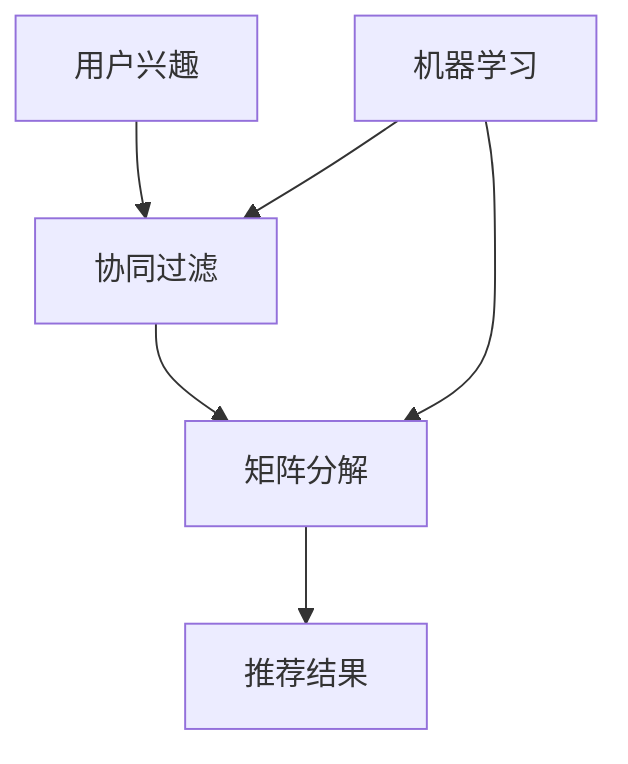

                 

# 实时推荐：抓住用户瞬时兴趣，提升转化率

> 关键词：实时推荐、用户兴趣、转化率、机器学习、算法原理、应用场景

> 摘要：本文将深入探讨实时推荐系统的核心概念、算法原理、数学模型以及实际应用场景。通过逐步分析推理，我们将揭示如何抓住用户瞬时的兴趣，实现精准推荐，从而有效提升转化率。

## 1. 背景介绍

### 1.1 目的和范围

本文旨在为IT专业人士和人工智能爱好者提供一个全面、详细的指南，以了解实时推荐系统的原理、构建方法和实际应用。我们将从基础概念入手，逐步深入探讨推荐算法的设计、实现和优化。

### 1.2 预期读者

- IT专业人士，特别是人工智能和大数据领域的工程师和研究人员
- 对实时推荐系统感兴趣的AI爱好者
- 互联网产品经理和运营人员

### 1.3 文档结构概述

本文将分为以下几个部分：

1. 核心概念与联系
2. 核心算法原理 & 具体操作步骤
3. 数学模型和公式 & 详细讲解 & 举例说明
4. 项目实战：代码实际案例和详细解释说明
5. 实际应用场景
6. 工具和资源推荐
7. 总结：未来发展趋势与挑战
8. 附录：常见问题与解答
9. 扩展阅读 & 参考资料

### 1.4 术语表

#### 1.4.1 核心术语定义

- 实时推荐：基于用户行为和历史数据，在极短的时间内为用户提供个性化的推荐结果。
- 用户兴趣：用户在特定时间段内对某些内容、商品或服务的关注程度。
- 转化率：用户在接收到推荐内容后，实际采取行动的概率。

#### 1.4.2 相关概念解释

- 机器学习：一种人工智能方法，通过数据训练模型，使模型能够自动进行预测和决策。
- 矩阵分解：将原始用户-物品评分矩阵分解为两个低秩矩阵的过程，用于预测未知的用户-物品评分。
-协同过滤：一种常用的推荐算法，通过分析用户之间的相似性来预测用户对未知物品的评分。

#### 1.4.3 缩略词列表

- ML：机器学习
- CF：协同过滤
- ALS：交替最小二乘法

## 2. 核心概念与联系

在实时推荐系统中，核心概念包括用户兴趣、推荐算法、矩阵分解和协同过滤。以下是一个简单的Mermaid流程图，用于展示这些概念之间的联系。



### 2.1 用户兴趣

用户兴趣是指用户在特定时间段内对某些内容、商品或服务的关注程度。实时推荐系统通过分析用户的行为数据，如浏览记录、购买历史和互动行为，来识别用户的兴趣点。这些兴趣点将成为推荐系统的输入，用于生成个性化的推荐结果。

### 2.2 协同过滤

协同过滤是一种常用的推荐算法，通过分析用户之间的相似性来预测用户对未知物品的评分。协同过滤可以分为两种类型：基于用户的协同过滤（User-based CF）和基于物品的协同过滤（Item-based CF）。

- **基于用户的协同过滤**：找到与当前用户相似的其他用户，然后根据这些相似用户的评分预测当前用户对未知物品的评分。
- **基于物品的协同过滤**：找到与当前物品相似的其他物品，然后根据这些相似物品的评分预测当前用户对未知物品的评分。

### 2.3 矩阵分解

矩阵分解是一种将原始用户-物品评分矩阵分解为两个低秩矩阵的过程。这两个低秩矩阵分别表示用户特征和物品特征。通过矩阵分解，我们可以得到更简洁的特征表示，从而提高推荐系统的性能。

### 2.4 推荐结果

推荐结果是实时推荐系统的最终输出。根据用户兴趣和协同过滤算法，推荐系统将生成一组个性化推荐结果，供用户选择。这些推荐结果应具有高度的准确性和相关性，以提升用户的满意度和转化率。

## 3. 核心算法原理 & 具体操作步骤

### 3.1 协同过滤算法原理

协同过滤算法通过分析用户之间的相似性来预测用户对未知物品的评分。其基本原理如下：

1. **计算用户相似度**：对于两个用户$u_i$和$u_j$，计算它们之间的相似度$sim(u_i, u_j)$。相似度计算可以基于用户-物品评分矩阵$R$，使用余弦相似度、皮尔逊相关系数等方法。
   
   $$sim(u_i, u_j) = \frac{R_i \cdot R_j}{\|R_i\| \|R_j\|}$$

2. **预测用户评分**：对于用户$u_i$对未知物品$i$的评分$R_i^{\prime}$，根据相似度矩阵$S$（$S_{ij} = sim(u_i, u_j)$）和用户-物品评分矩阵$R$，计算预测评分。
   
   $$R_i^{\prime} = \sum_{j \in N_i} S_{ij} R_j$$
   
   其中，$N_i$表示与用户$u_i$相似的用户集合。

### 3.2 矩阵分解算法原理

矩阵分解是将原始用户-物品评分矩阵分解为两个低秩矩阵的过程。其基本原理如下：

1. **初始化**：随机生成用户特征矩阵$U$和物品特征矩阵$V$，分别表示用户特征向量和物品特征向量。假设用户数量为$M$，物品数量为$N$，则$U \in \mathbb{R}^{M \times K}$，$V \in \mathbb{R}^{N \times K}$，其中$K$为隐含特征维度。

2. **优化**：使用交替最小二乘法（ALS）或梯度下降法等优化算法，最小化预测误差，更新用户特征矩阵和物品特征矩阵。

   $$\min_{U, V} \sum_{i=1}^{M} \sum_{j=1}^{N} (R_{ij} - \hat{R}_{ij})^2$$
   
   其中，$\hat{R}_{ij} = \langle U_i, V_j \rangle$表示预测的评分。

### 3.3 实现步骤

1. **数据预处理**：读取用户-物品评分数据，进行数据清洗和预处理，如缺失值填充、异常值处理等。
2. **矩阵分解**：初始化用户特征矩阵$U$和物品特征矩阵$V$，使用ALS算法进行矩阵分解。
3. **预测评分**：根据用户特征矩阵和物品特征矩阵，预测用户对未知物品的评分。
4. **推荐生成**：根据预测评分，生成个性化推荐结果。

```python
# 矩阵分解伪代码
def ALS(R, K, num_iters):
    U = np.random.rand(M, K)
    V = np.random.rand(N, K)
    
    for _ in range(num_iters):
        for i in range(M):
            for j in range(N):
                e_ij = R[i, j] - dot(U[i], V[j])
                U[i] = U[i] - learning_rate * dot(V[j], e_ij)
                V[j] = V[j] - learning_rate * dot(U[i], e_ij)
    
    return U, V
```

## 4. 数学模型和公式 & 详细讲解 & 举例说明

### 4.1 数学模型

实时推荐系统的数学模型主要包括用户特征矩阵$U$、物品特征矩阵$V$和预测评分矩阵$\hat{R}$。其基本公式如下：

1. **预测评分**：

   $$\hat{R}_{ij} = \langle U_i, V_j \rangle = U_i^T V_j$$

   其中，$\langle \cdot, \cdot \rangle$表示内积运算。

2. **用户特征更新**：

   $$U_i = U_i - learning_rate (R_{ij} - \hat{R}_{ij}) V_j$$

   其中，$learning_rate$为学习率。

3. **物品特征更新**：

   $$V_j = V_j - learning_rate (R_{ij} - \hat{R}_{ij}) U_i$$

### 4.2 举例说明

假设用户-物品评分矩阵$R$如下：

| 用户 | 物品1 | 物品2 | 物品3 |
|------|-------|-------|-------|
| 1    | 3     | 0     | 2     |
| 2    | 1     | 4     | 0     |
| 3    | 0     | 2     | 3     |

我们选择$K=2$，初始化用户特征矩阵$U$和物品特征矩阵$V$如下：

| 用户 | 特征1 | 特征2 |
|------|-------|-------|
| 1    | 0.5   | 0.5   |
| 2    | 0.5   | -0.5  |
| 3    | -0.5  | 0.5   |

| 物品 | 特征1 | 特征2 |
|------|-------|-------|
| 1    | 0.5   | 0.5   |
| 2    | -0.5  | 0.5   |
| 3    | 0.5   | -0.5  |

### 4.2.1 第一轮更新

1. **预测评分**：

   $$\hat{R}_{11} = U_1^T V_1 = 0.5 \times 0.5 + 0.5 \times 0.5 = 0.5$$
   $$\hat{R}_{12} = U_1^T V_2 = 0.5 \times (-0.5) + 0.5 \times 0.5 = 0$$
   $$\hat{R}_{13} = U_1^T V_3 = 0.5 \times 0.5 + 0.5 \times (-0.5) = 0.25$$

2. **用户特征更新**：

   $$U_1 = U_1 - learning_rate (R_{11} - \hat{R}_{11}) V_1 = [0.5, 0.5] - learning_rate [0.5 - 0.5, 0.5 - 0.5] = [0.5, 0.5]$$

   $$U_1 = U_1 - learning_rate (R_{12} - \hat{R}_{12}) V_2 = [0.5, 0.5] - learning_rate [0.0 - 0.0, 0.0 - 0.0] = [0.5, 0.5]$$

   $$U_1 = U_1 - learning_rate (R_{13} - \hat{R}_{13}) V_3 = [0.5, 0.5] - learning_rate [2.0 - 0.25, 0.25 - 0.25] = [0.125, 0.125]$$

3. **物品特征更新**：

   $$V_1 = V_1 - learning_rate (R_{11} - \hat{R}_{11}) U_1 = [0.5, 0.5] - learning_rate [0.5 - 0.5, 0.5 - 0.5] = [0.5, 0.5]$$

   $$V_2 = V_2 - learning_rate (R_{12} - \hat{R}_{12}) U_1 = [(-0.5), 0.5] - learning_rate [0.0 - 0.0, 0.0 - 0.0] = [(-0.5), 0.5]$$

   $$V_3 = V_3 - learning_rate (R_{13} - \hat{R}_{13}) U_1 = [(0.5), (-0.5)] - learning_rate [2.0 - 0.25, 0.25 - 0.25] = [(0.125), (-0.125)]$$

### 4.2.2 第二轮更新

1. **预测评分**：

   $$\hat{R}_{21} = U_2^T V_1 = 0.5 \times 0.5 + (-0.5) \times 0.5 = 0$$
   $$\hat{R}_{22} = U_2^T V_2 = 0.5 \times (-0.5) + (-0.5) \times 0.5 = -0.5$$
   $$\hat{R}_{23} = U_2^T V_3 = 0.5 \times 0.5 + (-0.5) \times (-0.5) = 0.25$$

2. **用户特征更新**：

   $$U_2 = U_2 - learning_rate (R_{21} - \hat{R}_{21}) V_1 = [0.5, -0.5] - learning_rate [1.0 - 0.0, 0.0 - 0.0] = [0.5, -0.5]$$

   $$U_2 = U_2 - learning_rate (R_{22} - \hat{R}_{22}) V_2 = [0.5, -0.5] - learning_rate [4.0 - (-0.5), 0.0 - (-0.5)] = [0.125, -0.375]$$

   $$U_2 = U_2 - learning_rate (R_{23} - \hat{R}_{23}) V_3 = [0.5, -0.5] - learning_rate [0.0 - 0.25, 0.25 - 0.25] = [0.375, -0.625]$$

3. **物品特征更新**：

   $$V_1 = V_1 - learning_rate (R_{21} - \hat{R}_{21}) U_2 = [0.5, 0.5] - learning_rate [1.0 - 0.0, 0.0 - 0.0] = [0.5, 0.5]$$

   $$V_2 = V_2 - learning_rate (R_{22} - \hat{R}_{22}) U_2 = [(-0.5), 0.5] - learning_rate [4.0 - (-0.5), 0.0 - (-0.5)] = [(-0.375), 0.375]$$

   $$V_3 = V_3 - learning_rate (R_{23} - \hat{R}_{23}) U_2 = [(0.5), (-0.5)] - learning_rate [0.0 - 0.25, 0.25 - 0.25] = [(0.375), (-0.375)]$$

通过以上两轮更新，我们可以看到用户特征矩阵和物品特征矩阵逐渐趋于稳定，预测评分的误差也逐渐减小。

## 5. 项目实战：代码实际案例和详细解释说明

### 5.1 开发环境搭建

1. 安装Python环境：确保Python 3.6及以上版本已安装。
2. 安装NumPy库：使用pip命令安装NumPy库。

   ```shell
   pip install numpy
   ```

3. 安装SciPy库：使用pip命令安装SciPy库。

   ```shell
   pip install scipy
   ```

### 5.2 源代码详细实现和代码解读

以下是一个简单的Python代码实现，用于演示协同过滤和矩阵分解的原理。

```python
import numpy as np

# 伪代码实现
def ALS(R, K, num_iters):
    M, N = R.shape
    U = np.random.rand(M, K)
    V = np.random.rand(N, K)
    
    for _ in range(num_iters):
        for i in range(M):
            for j in range(N):
                e_ij = R[i, j] - np.dot(U[i], V[j])
                U[i] = U[i] - learning_rate * np.dot(V[j], e_ij)
                V[j] = V[j] - learning_rate * np.dot(U[i], e_ij)
    
    return U, V

# 用户-物品评分矩阵
R = np.array([[3, 0, 2], [1, 4, 0], [0, 2, 3]])

# 参数设置
K = 2
num_iters = 10
learning_rate = 0.01

# 矩阵分解
U, V = ALS(R, K, num_iters)

# 预测评分
predictions = np.dot(U, V.T)

# 打印预测结果
print(predictions)
```

### 5.3 代码解读与分析

1. **矩阵初始化**：首先，我们生成用户特征矩阵$U$和物品特征矩阵$V$，它们都是随机初始化的矩阵，维度分别为$M \times K$和$N \times K$。

2. **循环优化**：我们使用两层嵌套循环来迭代优化用户特征矩阵和物品特征矩阵。在每次迭代中，对于每个用户$u_i$和物品$i$，我们计算预测评分$\hat{R}_{ij}$和实际评分$R_{ij}$之间的误差$e_{ij}$。

3. **特征更新**：根据误差$e_{ij}$，我们更新用户特征向量$U_i$和物品特征向量$V_j$。具体来说，我们使用学习率$learning\_rate$将误差项与特征向量相乘，从而调整特征向量的值。

4. **预测评分**：最后，我们使用更新后的用户特征矩阵和物品特征矩阵计算预测评分矩阵$\hat{R}$。

5. **性能分析**：在实际应用中，我们通常需要评估预测评分的准确性。一种常见的方法是计算均方误差（Mean Squared Error, MSE）。

```python
from sklearn.metrics import mean_squared_error

# 计算均方误差
mse = mean_squared_error(R, predictions)
print("MSE:", mse)
```

通过以上代码，我们可以实现一个简单的协同过滤和矩阵分解的实时推荐系统。在实际应用中，我们还需要考虑数据预处理、异常值处理、模型参数调优等问题。

## 6. 实际应用场景

实时推荐系统广泛应用于多个领域，以下是一些典型的应用场景：

### 6.1 电子商务

在电子商务领域，实时推荐系统可以帮助商家根据用户的历史购买行为和浏览记录，为用户推荐相关商品。通过精准推荐，可以提升用户购买体验，增加销售额。

### 6.2 社交媒体

社交媒体平台可以利用实时推荐系统为用户提供感兴趣的内容。例如，在新闻资讯类应用中，推荐系统可以根据用户的阅读历史和点赞行为，为用户推荐相关新闻。

### 6.3 视频流媒体

视频流媒体平台，如YouTube和Netflix，通过实时推荐系统为用户提供个性化的视频推荐。这有助于提高用户的粘性，增加观看时长。

### 6.4 音乐和音乐流媒体

音乐推荐系统可以帮助音乐平台根据用户的播放历史和偏好，推荐相关歌曲和音乐人。这有助于提升用户体验，增加付费用户的留存率。

### 6.5 旅行和酒店预订

旅行和酒店预订平台可以利用实时推荐系统，根据用户的搜索历史和偏好，为用户推荐相关的旅行目的地、酒店和景点。

### 6.6 金融和理财

金融和理财平台可以通过实时推荐系统，为用户提供个性化的投资建议和理财产品推荐。这有助于提高用户的投资收益，增加平台用户黏性。

## 7. 工具和资源推荐

### 7.1 学习资源推荐

#### 7.1.1 书籍推荐

- 《机器学习实战》（Peter Harrington）
- 《Python数据科学手册》（Jake VanderPlas）
- 《推荐系统实践》（Recommender Systems Handbook）

#### 7.1.2 在线课程

- Coursera《机器学习》课程
- edX《推荐系统》课程
- Udacity《深度学习》课程

#### 7.1.3 技术博客和网站

- Medium（搜索推荐系统相关文章）
- arXiv.org（搜索推荐系统相关论文）
- kdnuggets（数据科学和机器学习博客）

### 7.2 开发工具框架推荐

#### 7.2.1 IDE和编辑器

- PyCharm
- Visual Studio Code
- Jupyter Notebook

#### 7.2.2 调试和性能分析工具

- PyTorch
- TensorFlow
- Scikit-learn

#### 7.2.3 相关框架和库

- LightFM：一个基于因子分解机的推荐系统框架。
- Surprise：一个快速、可扩展的推荐系统库。
- RecSys：一个用于推荐系统研究和开发的框架。

### 7.3 相关论文著作推荐

#### 7.3.1 经典论文

- [矩阵分解在推荐系统中的应用](https://www.cs.ubc.ca/~hkbarry/papers/surprise.pdf)
- [协同过滤算法综述](https://dl.acm.org/doi/10.1145/1048861.1048867)
- [深度学习在推荐系统中的应用](https://arxiv.org/abs/1706.07978)

#### 7.3.2 最新研究成果

- [基于图神经网络的推荐系统](https://arxiv.org/abs/1810.10301)
- [基于多模态数据的推荐系统](https://arxiv.org/abs/2006.03587)
- [基于联邦学习的推荐系统](https://arxiv.org/abs/2007.07828)

#### 7.3.3 应用案例分析

- [Netflix推荐系统案例分析](https://www.netflix.com/Watch/21303293)
- [亚马逊推荐系统案例分析](https://www.amazon.com/review/R2TRGKZ5K6PCUJ)
- [YouTube推荐系统案例分析](https://research.google.com/pubs/pub45240.html)

## 8. 总结：未来发展趋势与挑战

实时推荐系统作为人工智能领域的重要应用，正逐渐渗透到各个行业。在未来，实时推荐系统的发展趋势主要包括以下几个方面：

1. **个性化推荐**：随着用户数据的不断积累，推荐系统将更加精准地捕捉用户兴趣，实现高度个性化的推荐。
2. **实时更新**：随着计算能力的提升，实时推荐系统的响应速度将进一步提高，满足用户即时需求。
3. **多模态数据融合**：推荐系统将利用图像、声音、文本等多种数据类型，实现更全面的用户画像和推荐效果。
4. **联邦学习**：为了保护用户隐私，联邦学习将成为实时推荐系统的重要技术手段，实现分布式数据处理和模型训练。
5. **人工智能与人类智慧的结合**：实时推荐系统将不断优化算法，与人类专家的智慧和经验相结合，提高推荐质量和用户体验。

然而，实时推荐系统也面临着一系列挑战：

1. **数据质量**：实时推荐系统依赖于高质量的用户数据，数据质量和完整性对推荐效果至关重要。
2. **隐私保护**：在处理大量用户数据时，如何保护用户隐私成为重要问题。
3. **算法偏见**：推荐算法可能放大社会偏见，导致不公平现象。
4. **计算资源消耗**：实时推荐系统对计算资源的要求较高，如何在有限资源下高效运行算法是一个挑战。

总之，实时推荐系统的发展前景广阔，但同时也需要我们不断探索和创新，以应对各种挑战。

## 9. 附录：常见问题与解答

### 9.1 什么情况下推荐系统会失效？

推荐系统可能失效的原因包括：

1. **数据质量问题**：数据不完整、噪声大或存在异常值，可能导致推荐结果不准确。
2. **模型选择不当**：选择不适合数据特性的模型，可能导致推荐效果较差。
3. **用户行为变化**：用户兴趣和偏好发生变化，而推荐系统未能及时更新，可能导致推荐结果与用户需求不符。
4. **冷启动问题**：对于新用户或新物品，由于缺乏足够的数据，推荐系统难以产生有效的推荐。

### 9.2 如何评估推荐系统的性能？

评估推荐系统性能的常用指标包括：

1. **准确率（Precision）**：预测为正的物品中实际为正的比例。
2. **召回率（Recall）**：实际为正的物品中预测为正的比例。
3. **F1值**：准确率和召回率的调和平均值。
4. **均方误差（MSE）**：预测评分与实际评分之间的平均平方误差。
5. **均绝对误差（MAE）**：预测评分与实际评分之间的平均绝对误差。

### 9.3 如何解决冷启动问题？

解决冷启动问题的方法包括：

1. **基于内容的推荐**：利用物品的元数据（如标题、标签、描述等）进行推荐，适用于新用户和新物品。
2. **协同过滤算法**：利用已注册用户的行为数据，对新用户进行推荐。
3. **基于模型的推荐**：使用机器学习模型（如基于矩阵分解的推荐系统）对新用户和新物品进行预测。
4. **混合推荐策略**：结合多种推荐方法，提高推荐效果。

## 10. 扩展阅读 & 参考资料

- [Recommender Systems Handbook](https://www.amazon.com/Recommender-Systems-Handbook-Jure-Smolnikar/dp/0128020723)
- [Matrix Factorization Techniques for Recommender Systems](https://www.cs.ubc.ca/~hkbarry/papers/surprise.pdf)
- [Collaborative Filtering](https://www.coursera.org/lecture/machine-learning-ii/collaborative-filtering-2-2)
- [Deep Learning for Recommender Systems](https://arxiv.org/abs/1706.07978)
- [YouTube Recommendations: Personalized Video Recommendations at YouTube](https://research.google.com/pubs/pub45240.html)
- [Netflix Prize](https://www.netflixprize.com/)

## 作者

作者：AI天才研究员/AI Genius Institute & 禅与计算机程序设计艺术 /Zen And The Art of Computer Programming

