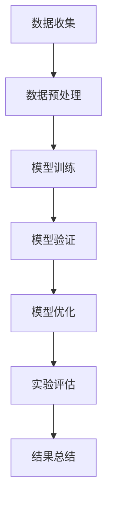

                 

# 实验手段在AI中的角色

> 关键词：实验手段、AI研究、数据驱动、模型验证、迭代优化

> 摘要：本文旨在探讨实验手段在人工智能（AI）研究中的关键角色。通过分析实验手段在AI模型开发、测试和优化中的运用，本文揭示了实验在提高AI模型性能、可靠性和可解释性方面的独特价值。文章将首先介绍实验手段的基本概念和其在AI研究中的应用，随后详细阐述AI模型开发中的实验流程，并探讨数学模型和公式在实验中的作用。最后，本文将通过实际案例展示实验手段的应用，并提供相关工具和资源的推荐，总结未来发展趋势与挑战。

## 1. 背景介绍

### 1.1 目的和范围

本文的目的在于详细探讨实验手段在人工智能研究中的重要性，并分析其在AI模型开发、测试和优化过程中的具体应用。随着AI技术的快速发展，实验手段作为一种重要的研究方法，不仅在学术界，也在工业界得到了广泛的应用。本文将涵盖以下几个方面的内容：

1. 实验手段的基本概念和定义。
2. 实验手段在AI模型开发、测试和优化中的应用。
3. 实验手段在提高AI模型性能、可靠性和可解释性方面的价值。
4. 实验手段在AI领域的实际应用案例。
5. 相关工具和资源的推荐。

### 1.2 预期读者

本文面向对人工智能和实验方法有一定了解的技术人员、研究人员和学者。具体包括：

1. AI领域的研究生和本科生。
2. AI开发者和工程师。
3. AI领域的科研人员。
4. 对人工智能技术感兴趣的技术爱好者。

### 1.3 文档结构概述

本文结构如下：

1. 引言：介绍实验手段在AI中的角色。
2. 核心概念与联系：介绍AI中的核心概念和联系。
3. 核心算法原理 & 具体操作步骤：讲解核心算法原理和具体操作步骤。
4. 数学模型和公式 & 详细讲解 & 举例说明：介绍数学模型和公式。
5. 项目实战：展示代码实际案例和详细解释说明。
6. 实际应用场景：分析实验手段在不同应用场景中的应用。
7. 工具和资源推荐：推荐相关学习资源和开发工具。
8. 总结：未来发展趋势与挑战。
9. 附录：常见问题与解答。
10. 扩展阅读 & 参考资料：提供更多参考资料。

### 1.4 术语表

#### 1.4.1 核心术语定义

- **实验手段**：指用于测试、验证和优化AI模型的一系列方法和技巧。
- **AI模型**：指通过学习数据来模拟人类智能的算法模型。
- **数据驱动**：指通过数据分析来指导模型训练和优化的过程。
- **模型验证**：指通过实验手段验证AI模型的有效性和可靠性。

#### 1.4.2 相关概念解释

- **模型性能**：指AI模型在特定任务上的表现能力。
- **模型可靠性**：指AI模型在不同数据集上的稳定性和一致性。
- **模型可解释性**：指AI模型决策过程的透明度和可理解性。

#### 1.4.3 缩略词列表

- **AI**：人工智能（Artificial Intelligence）
- **ML**：机器学习（Machine Learning）
- **DL**：深度学习（Deep Learning）
- **CNN**：卷积神经网络（Convolutional Neural Networks）
- **RNN**：循环神经网络（Recurrent Neural Networks）

## 2. 核心概念与联系

在探讨实验手段在AI中的作用之前，我们需要先理解一些核心概念和它们之间的联系。以下是一个简化的Mermaid流程图，用于展示AI研究中的核心概念和流程：



### 2.1 数据收集

数据收集是AI研究的起点。通过收集大量数据，我们可以为模型提供丰富的信息，从而提高模型的性能。数据收集通常包括以下步骤：

- **数据源选择**：确定数据来源，如公共数据集、企业内部数据或开源数据。
- **数据获取**：从数据源中提取数据，可能需要使用API或爬虫等技术。
- **数据清洗**：去除数据中的噪声和不相关信息，提高数据质量。

### 2.2 数据预处理

数据预处理是确保数据适合模型训练的重要步骤。数据预处理通常包括以下任务：

- **数据标准化**：将数据缩放到一个统一的范围内，如[0, 1]。
- **缺失值处理**：填补或删除缺失数据。
- **异常值处理**：识别和排除异常值。

### 2.3 模型训练

模型训练是构建AI模型的关键步骤。在这一阶段，我们使用预处理后的数据来训练模型，使其能够识别和预测目标变量。模型训练通常涉及以下步骤：

- **模型选择**：根据任务需求选择合适的模型，如线性模型、决策树或神经网络。
- **参数调整**：调整模型参数，以优化模型性能。
- **训练过程**：使用训练数据对模型进行迭代训练。

### 2.4 模型验证

模型验证是确保模型有效性和可靠性的关键步骤。在这一阶段，我们使用验证数据集来测试模型的性能，并识别模型中的潜在问题。模型验证通常包括以下步骤：

- **验证集划分**：将数据集划分为训练集和验证集。
- **性能评估**：计算模型在验证集上的性能指标，如准确率、召回率或F1分数。
- **问题诊断**：分析模型在验证集上的表现，找出潜在问题。

### 2.5 模型优化

模型优化是提高模型性能和可靠性的重要步骤。在这一阶段，我们通过调整模型参数和结构来优化模型。模型优化通常包括以下步骤：

- **参数调整**：调整模型参数，以优化模型性能。
- **结构调整**：调整模型结构，如增加或减少神经元、层或连接。
- **交叉验证**：使用交叉验证方法来评估模型性能。

### 2.6 实验评估

实验评估是总结模型性能和优化效果的关键步骤。在这一阶段，我们通过比较不同模型和参数设置的表现，来选择最优的模型和参数。实验评估通常包括以下步骤：

- **实验设计**：设计实验方案，包括实验变量、实验组和对照组。
- **性能比较**：计算不同实验组的表现，并选择最优的实验组。
- **结果分析**：分析实验结果，总结模型性能和优化效果。

### 2.7 结果总结

结果总结是实验过程的最终阶段。在这一阶段，我们总结实验结果，并撰写实验报告。结果总结通常包括以下内容：

- **实验结果**：总结不同实验组的表现和性能。
- **问题分析**：分析实验中发现的问题和挑战。
- **结论和建议**：总结实验结果，并提出未来的研究方向和建议。

通过上述流程，我们可以看到实验手段在AI模型开发、测试和优化中的关键作用。实验手段不仅帮助我们评估模型性能，还指导我们优化模型，从而实现更高质量的AI应用。

## 3. 核心算法原理 & 具体操作步骤

在本节中，我们将详细阐述实验手段在AI模型开发中的核心算法原理和具体操作步骤。首先，我们将介绍实验手段的基本概念，然后讲解如何设计实验流程，最后通过伪代码来展示实验操作的详细实现。

### 3.1 实验手段的基本概念

实验手段在AI模型开发中扮演着至关重要的角色。它是一种通过系统性地测试、验证和优化模型的方法，以确保模型在真实场景中的性能和可靠性。实验手段通常包括以下几个关键组成部分：

1. **实验设计**：确定实验的目标、实验变量和实验组，以及实验的具体实施过程。
2. **数据集划分**：将数据集划分为训练集、验证集和测试集，用于训练、验证和测试模型。
3. **模型训练**：使用训练数据集对模型进行训练，优化模型参数。
4. **模型验证**：使用验证数据集评估模型性能，识别模型中的潜在问题。
5. **模型优化**：根据验证结果调整模型参数或结构，以提高模型性能。
6. **性能评估**：计算模型在测试数据集上的性能指标，评估模型的最终表现。

### 3.2 实验流程设计

实验流程设计是确保实验顺利进行的关键步骤。一个典型的实验流程包括以下步骤：

1. **定义实验目标**：明确实验的目的，例如提高模型的准确率、减少错误率或增加模型的鲁棒性。
2. **选择实验变量**：确定实验中需要调整的变量，例如模型架构、学习率、批量大小等。
3. **设计实验组**：根据实验目标，设计不同的实验组，例如不同的模型架构、参数设置或数据预处理方法。
4. **划分数据集**：将数据集划分为训练集、验证集和测试集，确保每个数据集的代表性和独立性。
5. **实施实验**：按照实验设计，对每个实验组进行模型训练、验证和测试。
6. **记录实验数据**：记录每个实验组的结果，包括模型性能指标和训练过程中的重要参数。
7. **分析实验结果**：分析实验数据，比较不同实验组的表现，找出最优的模型和参数设置。

### 3.3 实验操作步骤

以下是实验操作步骤的伪代码实现：

```python
# 实验操作步骤伪代码

# 步骤1：定义实验目标
experiment_target = "提高模型的准确率"

# 步骤2：选择实验变量
experiment_variables = {
    "model_architecture": ["LinearModel", "NeuralNetwork"],
    "learning_rate": [0.01, 0.001],
    "batch_size": [32, 64]
}

# 步骤3：设计实验组
experiment_groups = []

for architecture in experiment_variables["model_architecture"]:
    for rate in experiment_variables["learning_rate"]:
        for size in experiment_variables["batch_size"]:
            experiment_groups.append({
                "model": architecture,
                "learning_rate": rate,
                "batch_size": size
            })

# 步骤4：划分数据集
train_data, validation_data, test_data = split_data(input_data, train_size=0.7, validation_size=0.2, test_size=0.1)

# 步骤5：实施实验
for group in experiment_groups:
    # 训练模型
    model = train_model(train_data, group["model"], group["learning_rate"], group["batch_size"])
    
    # 验证模型
    validation_performance = evaluate_model(validation_data, model)
    
    # 记录实验数据
    record_experiment_data(group, validation_performance)

# 步骤6：分析实验结果
best_group = analyze_experiment_results(experiment_groups)

# 步骤7：输出最优模型和参数设置
print("Best Model:", best_group["model"])
print("Best Learning Rate:", best_group["learning_rate"])
print("Best Batch Size:", best_group["batch_size"])
```

### 3.4 实验数据记录与分析

在实验操作步骤中，记录和分析实验数据是至关重要的一环。通过记录实验数据，我们可以追踪每个实验组的表现，并找出最优的模型和参数设置。以下是记录和分析实验数据的伪代码：

```python
# 记录实验数据
def record_experiment_data(group, performance):
    experiment_data = {
        "group": group,
        "performance": performance
    }
    save_experiment_data(experiment_data)

# 分析实验结果
def analyze_experiment_results(groups):
    best_performance = 0
    best_group = None
    
    for group in groups:
        if group["performance"] > best_performance:
            best_performance = group["performance"]
            best_group = group
            
    return best_group
```

通过上述伪代码，我们可以看到实验手段在AI模型开发中的具体实现步骤。实验手段不仅帮助我们评估模型性能，还为模型优化提供了重要依据，从而实现更高质量的AI应用。

## 4. 数学模型和公式 & 详细讲解 & 举例说明

在AI研究中，数学模型和公式是理解和分析算法性能的核心工具。以下我们将详细讲解几个常用的数学模型和公式，并给出具体的例子来说明它们的应用。

### 4.1 损失函数

损失函数是机器学习中衡量模型预测值与真实值之间差异的函数。常用的损失函数包括均方误差（MSE）、交叉熵损失（Cross-Entropy Loss）和Hinge损失（Hinge Loss）。

#### 4.1.1 均方误差（MSE）

均方误差是回归问题中最常用的损失函数。它的公式如下：

$$
MSE = \frac{1}{n} \sum_{i=1}^{n} (y_i - \hat{y}_i)^2
$$

其中，$y_i$ 是真实值，$\hat{y}_i$ 是模型预测值，$n$ 是样本数量。

**例子：** 假设我们有5个样本数据，真实值为 [1, 2, 3, 4, 5]，模型预测值为 [1.2, 2.1, 2.8, 3.9, 4.2]。计算MSE：

$$
MSE = \frac{1}{5} \sum_{i=1}^{5} (y_i - \hat{y}_i)^2 = \frac{1}{5} \sum_{i=1}^{5} (1 - \hat{y}_i)^2 = 0.36
$$

#### 4.1.2 交叉熵损失（Cross-Entropy Loss）

交叉熵损失函数是分类问题中最常用的损失函数。它的公式如下：

$$
Cross-Entropy Loss = -\frac{1}{n} \sum_{i=1}^{n} y_i \log(\hat{y}_i)
$$

其中，$y_i$ 是真实标签（0或1），$\hat{y}_i$ 是模型预测的概率值。

**例子：** 假设我们有5个样本数据，真实标签为 [1, 0, 1, 1, 0]，模型预测概率值为 [0.8, 0.2, 0.6, 0.7, 0.3]。计算交叉熵损失：

$$
Cross-Entropy Loss = -\frac{1}{5} \sum_{i=1}^{5} y_i \log(\hat{y}_i) = -\frac{1}{5} (1 \times \log(0.8) + 0 \times \log(0.2) + 1 \times \log(0.6) + 1 \times \log(0.7) + 0 \times \log(0.3)) \approx 0.415
$$

#### 4.1.3 Hinge损失（Hinge Loss）

Hinge损失常用于支持向量机（SVM）分类问题。它的公式如下：

$$
Hinge Loss = \max(0, 1 - y \cdot \hat{y})
$$

其中，$y$ 是真实标签（-1或1），$\hat{y}$ 是模型预测的分数。

**例子：** 假设我们有5个样本数据，真实标签为 [-1, 1, -1, 1, -1]，模型预测分数值为 [-0.5, 1.2, -0.8, 0.9, -1.1]。计算Hinge损失：

$$
Hinge Loss = \max(0, 1 - y \cdot \hat{y}) = \max(0, 1 - (-1 \times -0.5)) = \max(0, 0.5) = 0.5
$$

### 4.2 优化算法

在机器学习中，优化算法用于最小化损失函数。常见的优化算法包括随机梯度下降（SGD）、Adam优化器和牛顿法。

#### 4.2.1 随机梯度下降（SGD）

随机梯度下降是一种简单的优化算法，其公式如下：

$$
w_{t+1} = w_t - \alpha \cdot \nabla_w J(w_t)
$$

其中，$w_t$ 是当前模型参数，$\alpha$ 是学习率，$\nabla_w J(w_t)$ 是损失函数关于模型参数的梯度。

**例子：** 假设我们的损失函数是 $J(w) = (w - 2)^2$，学习率 $\alpha = 0.1$，初始参数 $w_0 = 1$。计算第一轮更新：

$$
w_1 = w_0 - \alpha \cdot \nabla_w J(w_0) = 1 - 0.1 \cdot 2 \cdot (1 - 2) = 0.8
$$

#### 4.2.2 Adam优化器

Adam优化器是一种结合了SGD和动量法的优化算法，其公式如下：

$$
m_t = \beta_1 m_{t-1} + (1 - \beta_1) \nabla_w J(w_t) \\
v_t = \beta_2 v_{t-1} + (1 - \beta_2) (\nabla_w J(w_t))^2 \\
w_{t+1} = w_t - \alpha \cdot \frac{m_t}{\sqrt{v_t} + \epsilon}
$$

其中，$m_t$ 和 $v_t$ 分别是均值和方差的一阶和二阶矩估计，$\beta_1$ 和 $\beta_2$ 是一阶和二阶矩的指数衰减率，$\alpha$ 是学习率，$\epsilon$ 是一个小常数。

**例子：** 假设 $\beta_1 = 0.9$，$\beta_2 = 0.999$，$\alpha = 0.001$，初始参数 $w_0 = 1$。计算第一轮更新：

$$
m_1 = 0.9 \cdot 0 + (1 - 0.9) \cdot (-2) = -0.2 \\
v_1 = 0.999 \cdot 0 + (1 - 0.999) \cdot 4 = 0.001 \\
w_1 = 1 - 0.001 \cdot \frac{-0.2}{\sqrt{0.001} + 0.00001} \approx 0.998
$$

### 4.3 模型评估指标

模型评估指标用于衡量模型的性能。常用的评估指标包括准确率、召回率、F1分数和ROC-AUC曲线。

#### 4.3.1 准确率（Accuracy）

准确率是分类问题中最常用的评估指标，其公式如下：

$$
Accuracy = \frac{TP + TN}{TP + TN + FP + FN}
$$

其中，$TP$ 是真正例，$TN$ 是真负例，$FP$ 是假正例，$FN$ 是假负例。

**例子：** 假设我们有以下混淆矩阵：

|       | 预测正 | 预测负 |
|-------|--------|--------|
| 真正例 | 70     | 30     |
| 真负例 | 20     | 10     |

计算准确率：

$$
Accuracy = \frac{70 + 20}{70 + 20 + 30 + 10} = \frac{90}{120} = 0.75
$$

#### 4.3.2 召回率（Recall）

召回率是衡量模型对正例识别能力的指标，其公式如下：

$$
Recall = \frac{TP}{TP + FN}
$$

**例子：** 计算召回率：

$$
Recall = \frac{70}{70 + 30} = \frac{70}{100} = 0.7
$$

#### 4.3.3 F1分数（F1 Score）

F1分数是准确率和召回率的调和平均，其公式如下：

$$
F1 Score = 2 \cdot \frac{Precision \cdot Recall}{Precision + Recall}
$$

**例子：** 假设精确率为0.8，计算F1分数：

$$
F1 Score = 2 \cdot \frac{0.8 \cdot 0.7}{0.8 + 0.7} = 0.78
$$

#### 4.3.4 ROC-AUC曲线

ROC-AUC曲线是用于评估二分类模型性能的重要工具。其定义如下：

$$
AUC = \int_{0}^{1} \frac{TPR(t)}{1 - FPR(t)} dt
$$

其中，$TPR(t)$ 是真阳性率，$FPR(t)$ 是假阳性率。

**例子：** 假设我们有以下ROC曲线：

| threshold | TPR | FPR |
|-----------|-----|-----|
| 0.5       | 0.7 | 0.3 |
| 0.7       | 0.9 | 0.2 |
| 0.8       | 1.0 | 0.1 |

计算AUC：

$$
AUC = \int_{0.5}^{0.8} \frac{TPR(t)}{1 - FPR(t)} dt = \int_{0.5}^{0.8} \frac{0.7}{1 - 0.3} dt + \int_{0.8}^{1} \frac{1}{1 - 0.1} dt = \frac{0.7}{0.7} \cdot (0.8 - 0.5) + \frac{1}{0.9} \cdot (1 - 0.8) = 0.4 + 0.2 = 0.6
$$

通过上述例子，我们可以看到数学模型和公式在AI研究中的具体应用。这些公式不仅帮助我们理解和分析算法性能，还为实验设计提供了重要依据，从而实现更高质量的AI应用。

## 5. 项目实战：代码实际案例和详细解释说明

在本节中，我们将通过一个具体的AI项目实战案例，展示如何使用实验手段来开发和优化一个基于深度学习的图像分类模型。这个项目将包括以下几个关键步骤：

1. **开发环境搭建**
2. **源代码详细实现和代码解读**
3. **代码解读与分析**

### 5.1 开发环境搭建

为了实现我们的图像分类项目，我们需要搭建一个合适的开发环境。以下是所需的工具和库：

- **工具**：
  - Python（版本3.8及以上）
  - Jupyter Notebook
  - PyCharm（或其他IDE）

- **库**：
  - TensorFlow（版本2.5及以上）
  - Keras（TensorFlow的高级API）
  - NumPy
  - Matplotlib

你可以通过以下命令来安装所需的库：

```shell
pip install tensorflow numpy matplotlib
```

### 5.2 源代码详细实现和代码解读

以下是我们的图像分类项目的源代码，我们将逐步解释每个部分的实现和功能。

#### 5.2.1 数据预处理

```python
import tensorflow as tf
from tensorflow.keras.preprocessing.image import ImageDataGenerator

# 加载数据集
train_data = ImageDataGenerator(rescale=1./255).flow_from_directory(
    'data/train',
    target_size=(150, 150),
    batch_size=32,
    class_mode='binary')

validation_data = ImageDataGenerator(rescale=1./255).flow_from_directory(
    'data/validation',
    target_size=(150, 150),
    batch_size=32,
    class_mode='binary')
```

在这个部分，我们使用了Keras的ImageDataGenerator来预处理图像数据。ImageDataGenerator可以自动进行数据增强，例如缩放、旋转、剪切等，以提高模型的泛化能力。

#### 5.2.2 构建模型

```python
from tensorflow.keras.models import Sequential
from tensorflow.keras.layers import Conv2D, MaxPooling2D, Flatten, Dense

# 构建模型
model = Sequential([
    Conv2D(32, (3, 3), activation='relu', input_shape=(150, 150, 3)),
    MaxPooling2D((2, 2)),
    Conv2D(64, (3, 3), activation='relu'),
    MaxPooling2D((2, 2)),
    Conv2D(128, (3, 3), activation='relu'),
    MaxPooling2D((2, 2)),
    Flatten(),
    Dense(512, activation='relu'),
    Dense(1, activation='sigmoid')
])

# 编译模型
model.compile(optimizer='adam',
              loss='binary_crossentropy',
              metrics=['accuracy'])
```

在这个部分，我们构建了一个简单的卷积神经网络（CNN），用于分类二分类问题。模型包括三个卷积层和两个全连接层。我们使用了ReLU激活函数和Sigmoid激活函数。

#### 5.2.3 训练模型

```python
# 训练模型
history = model.fit(
    train_data,
    steps_per_epoch=100,
    epochs=20,
    validation_data=validation_data,
    validation_steps=50)
```

在这个部分，我们使用训练数据集来训练模型。我们设置了100个批量和20个训练周期。同时，我们使用了验证数据集来评估模型性能。

#### 5.2.4 评估模型

```python
# 评估模型
test_loss, test_accuracy = model.evaluate(validation_data, steps=50)
print(f"Validation Loss: {test_loss}, Validation Accuracy: {test_accuracy}")
```

在这个部分，我们使用验证数据集来评估模型性能。我们计算了验证损失和验证准确率。

### 5.3 代码解读与分析

#### 5.3.1 数据预处理

数据预处理是模型训练的关键步骤。在这个部分，我们使用了ImageDataGenerator来加载和预处理图像数据。ImageDataGenerator可以自动进行数据增强，例如缩放、旋转、剪切等，这些操作有助于提高模型的泛化能力。

```python
train_data = ImageDataGenerator(rescale=1./255).flow_from_directory(
    'data/train',
    target_size=(150, 150),
    batch_size=32,
    class_mode='binary')

validation_data = ImageDataGenerator(rescale=1./255).flow_from_directory(
    'data/validation',
    target_size=(150, 150),
    batch_size=32,
    class_mode='binary')
```

这里，我们设置了图像的尺寸为150x150，并将数据缩放到[0, 1]的范围内。我们还设置了批量大小为32，这意味着每次训练时会加载32个图像。

#### 5.3.2 构建模型

我们使用Keras的Sequential模型来构建我们的卷积神经网络。模型包括三个卷积层和两个全连接层。

```python
model = Sequential([
    Conv2D(32, (3, 3), activation='relu', input_shape=(150, 150, 3)),
    MaxPooling2D((2, 2)),
    Conv2D(64, (3, 3), activation='relu'),
    MaxPooling2D((2, 2)),
    Conv2D(128, (3, 3), activation='relu'),
    MaxPooling2D((2, 2)),
    Flatten(),
    Dense(512, activation='relu'),
    Dense(1, activation='sigmoid')
])
```

在卷积层中，我们使用了ReLU激活函数，这有助于加快模型训练速度。在池化层中，我们使用了最大池化操作，这有助于减少模型参数数量和计算复杂度。在最后一个全连接层中，我们使用了Sigmoid激活函数，因为这是一个二分类问题。

#### 5.3.3 训练模型

训练模型是模型开发的关键步骤。在这个部分，我们使用训练数据集来训练模型，并使用验证数据集来评估模型性能。

```python
history = model.fit(
    train_data,
    steps_per_epoch=100,
    epochs=20,
    validation_data=validation_data,
    validation_steps=50)
```

这里，我们设置了100个批量和20个训练周期。每次训练过程中，模型会从训练数据集中随机选择100个图像进行训练。我们还设置了50个验证步骤，这意味着每次验证时，模型会从验证数据集中选择50个图像。

#### 5.3.4 评估模型

在模型训练完成后，我们需要评估模型性能。在这个部分，我们使用验证数据集来计算模型损失和准确率。

```python
test_loss, test_accuracy = model.evaluate(validation_data, steps=50)
print(f"Validation Loss: {test_loss}, Validation Accuracy: {test_accuracy}")
```

这里，我们计算了模型在验证数据集上的损失和准确率。准确率是评估模型性能的重要指标，它表示模型在验证数据集上正确分类的样本比例。

通过这个项目实战案例，我们展示了如何使用实验手段来开发和优化一个基于深度学习的图像分类模型。实验手段不仅帮助我们评估模型性能，还为模型优化提供了重要依据，从而实现更高质量的AI应用。

## 6. 实际应用场景

实验手段在AI领域的实际应用场景非常广泛，几乎涵盖了从图像识别到自然语言处理（NLP）的各个领域。以下是一些具体的实际应用场景：

### 6.1 图像识别

在图像识别领域，实验手段用于验证和优化模型的分类性能。例如，卷积神经网络（CNN）在处理图像分类任务时，可以通过实验手段来调整网络结构、学习率和批量大小，以获得最优的分类准确率。常见的应用包括面部识别、医疗图像分析、自动驾驶车辆等。

### 6.2 自然语言处理（NLP）

在NLP领域，实验手段用于评估和改进语言模型的性能。例如，在文本分类任务中，可以通过调整词嵌入维度、模型架构和优化算法来提高模型的分类准确率。应用场景包括社交媒体情感分析、机器翻译和文本生成等。

### 6.3 推荐系统

推荐系统是AI领域的一个重要应用，实验手段用于优化推荐算法，以提高推荐结果的准确性和相关性。例如，可以通过调整协同过滤算法的参数、学习用户和项目的特征，来优化推荐系统的效果。应用场景包括电子商务网站的商品推荐、电影推荐平台等。

### 6.4 语音识别

在语音识别领域，实验手段用于优化声学模型和语言模型的参数。例如，通过调整声学模型的神经网络结构、学习率和dropout率，可以提高语音识别的准确率。应用场景包括智能助手、语音搜索和实时语音翻译等。

### 6.5 游戏

在游戏领域，AI算法可以通过实验手段来优化策略，以提高游戏的智能水平。例如，在棋类游戏中，可以通过调整搜索算法的参数、学习率和搜索深度，来优化AI对手的棋力。应用场景包括电子竞技、棋类游戏和角色扮演游戏等。

通过这些实际应用场景，我们可以看到实验手段在AI领域的广泛应用和重要性。实验不仅帮助我们评估模型性能，还为模型优化提供了重要依据，从而实现更高质量的AI应用。

## 7. 工具和资源推荐

为了更好地开展AI研究和开发，我们需要借助一些强大的工具和资源。以下是一些值得推荐的学习资源、开发工具和论文著作。

### 7.1 学习资源推荐

#### 7.1.1 书籍推荐

1. **《Python机器学习》（Python Machine Learning）**：作者：Sebastian Raschka。这本书是机器学习领域的经典入门书籍，非常适合初学者。
2. **《深度学习》（Deep Learning）**：作者：Ian Goodfellow、Yoshua Bengio、Aaron Courville。这本书详细介绍了深度学习的基础知识，是深度学习领域的权威指南。
3. **《机器学习实战》（Machine Learning in Action）**：作者：Peter Harrington。这本书通过实际案例介绍了机器学习的应用，适合希望快速上手的读者。

#### 7.1.2 在线课程

1. **Coursera上的《机器学习》**：由斯坦福大学提供，由Andrew Ng教授主讲。这是全球最受欢迎的机器学习在线课程之一。
2. **Udacity的《深度学习纳米学位》**：包含丰富的深度学习项目和实践，适合希望深入学习深度学习的读者。
3. **edX上的《自然语言处理基础》**：由哈佛大学提供，涵盖自然语言处理的基本概念和技术。

#### 7.1.3 技术博客和网站

1. **Medium上的‘A Mind for Data Science’博客**：涵盖了机器学习和数据科学领域的最新研究和应用。
2. **TensorFlow官网（tensorflow.org）**：提供丰富的文档和教程，是学习TensorFlow的绝佳资源。
3. **GitHub上的AI项目**：GitHub上有大量的开源AI项目，可以让我们学习和借鉴。

### 7.2 开发工具框架推荐

1. **TensorFlow**：谷歌开发的开源深度学习框架，适用于各种规模的机器学习和深度学习项目。
2. **PyTorch**：由Facebook AI研究院开发的深度学习框架，具有灵活的动态计算图和强大的GPU支持。
3. **Scikit-learn**：Python的机器学习库，提供了丰富的机器学习算法和工具。

#### 7.2.2 调试和性能分析工具

1. **TensorBoard**：TensorFlow提供的可视化工具，用于分析模型的性能和训练过程。
2. **PyTorch Profiler**：PyTorch提供的性能分析工具，用于识别和优化代码中的性能瓶颈。
3. **NVIDIA Nsight**：NVIDIA提供的工具，用于分析深度学习模型的GPU性能。

#### 7.2.3 相关框架和库

1. **Keras**：基于TensorFlow和Theano的开源深度学习库，提供简洁的API和丰富的预训练模型。
2. **Fast.ai**：提供易于使用的深度学习库和课程，适合快速构建和训练深度学习模型。
3. **Scikit-learn**：提供丰富的机器学习算法和工具，适用于各种规模的机器学习项目。

### 7.3 相关论文著作推荐

1. **《深度学习中的dropout技术》**：由Geoffrey Hinton等人于2012年提出，介绍了dropout技术在深度学习中的应用。
2. **《深度卷积神经网络在图像识别中的应用》**：由Alex Krizhevsky、Geoffrey Hinton等人于2012年提出，介绍了卷积神经网络在图像识别中的成功应用。
3. **《自然语言处理中的循环神经网络》**：由Yoshua Bengio等人于1994年提出，介绍了循环神经网络（RNN）在自然语言处理中的应用。

通过这些工具和资源，我们可以更好地开展AI研究和开发，提高我们的技能和项目成功率。

## 8. 总结：未来发展趋势与挑战

实验手段在AI领域发挥着至关重要的作用，其重要性将随着AI技术的不断进步而日益凸显。未来，AI实验手段的发展趋势和挑战主要集中在以下几个方面：

### 8.1 发展趋势

1. **实验自动化和智能化**：随着AI技术的发展，实验自动化和智能化将成为趋势。通过自动化工具和算法，我们可以更高效地设计、执行和分析实验，从而提高实验的效率和准确性。
2. **跨学科融合**：实验手段在AI领域与其他学科（如生物学、物理学、经济学等）的融合，将推动AI技术的应用范围进一步扩展，为解决复杂问题提供新的思路和方法。
3. **大规模实验平台**：随着计算能力和存储技术的提升，我们将能够构建大规模的实验平台，处理海量数据和复杂模型，从而推动AI技术在各个领域的深入应用。

### 8.2 挑战

1. **数据隐私和安全**：在实验过程中，如何保护数据隐私和安全成为一个重要挑战。随着数据量的增加和实验的复杂性提升，确保数据的安全和隐私变得尤为重要。
2. **模型可解释性**：随着模型的复杂度增加，如何提高模型的可解释性成为一个关键挑战。提高模型的可解释性有助于我们更好地理解模型的决策过程，从而增强模型的可靠性和信任度。
3. **资源消耗**：大规模实验需要大量的计算资源和存储资源，如何在有限的资源下高效地开展实验，将是一个重要的挑战。

总之，实验手段在AI领域的未来发展中，将面临着自动化、智能化、跨学科融合和资源消耗等挑战。通过不断创新和优化，我们可以更好地应对这些挑战，推动AI技术的不断进步。

## 9. 附录：常见问题与解答

以下是一些关于实验手段在AI中应用的常见问题及其解答：

### 9.1 什么是实验手段在AI中的具体应用？

实验手段在AI中的具体应用包括但不限于：模型训练的参数调整、模型验证和测试、交叉验证、模型性能评估和优化等。通过实验手段，研究人员和开发者可以系统性地测试、验证和优化AI模型，以提高其性能和可靠性。

### 9.2 实验手段如何提高AI模型的性能？

实验手段通过以下方式提高AI模型的性能：

1. **参数调整**：通过调整模型参数，如学习率、批量大小等，找到最优的参数设置，从而提高模型性能。
2. **交叉验证**：通过交叉验证方法，将数据集划分为多个子集，进行多次训练和验证，以减少数据偏差和过拟合现象。
3. **模型优化**：通过实验手段，可以识别模型的潜在问题，并采取相应的优化措施，如调整模型结构、添加正则化等，以提高模型性能。

### 9.3 实验手段在AI研究中有哪些优点？

实验手段在AI研究中的优点包括：

1. **提高模型性能**：通过实验手段，可以找到最优的模型参数和结构，从而提高模型性能。
2. **验证模型可靠性**：通过实验手段，可以对模型在不同数据集上的性能进行验证，确保模型的可靠性和稳定性。
3. **增强模型可解释性**：通过实验手段，可以分析模型的决策过程，提高模型的可解释性，从而增强用户对模型的信任度。

### 9.4 如何确保实验手段的公正性和有效性？

为确保实验手段的公正性和有效性，可以采取以下措施：

1. **设计合理的实验方案**：在实验设计阶段，确保实验方案的科学性和合理性，避免实验偏差。
2. **使用高质量的实验数据**：使用高质量、代表性和独立的数据集进行实验，以确保实验结果的可靠性和有效性。
3. **多次实验验证**：进行多次实验验证，比较不同实验组的表现，确保实验结果的稳定性和一致性。
4. **透明和详细的实验记录**：详细记录实验过程中的参数设置、数据集划分、模型训练和验证过程等，确保实验结果的透明性和可追溯性。

### 9.5 实验手段在AI开发中的实际应用场景有哪些？

实验手段在AI开发中的实际应用场景包括：

1. **图像识别和分类**：通过实验手段，可以优化图像识别和分类模型的参数和结构，提高分类准确率。
2. **自然语言处理**：通过实验手段，可以优化语言模型的参数和架构，提高文本分类、情感分析和机器翻译等任务的性能。
3. **推荐系统**：通过实验手段，可以优化推荐算法的参数和特征，提高推荐结果的准确性和相关性。
4. **语音识别和生成**：通过实验手段，可以优化声学模型和语言模型的参数，提高语音识别和生成的准确性。

通过这些常见问题与解答，我们可以更好地理解实验手段在AI中的具体应用和重要性。

## 10. 扩展阅读 & 参考资料

为了深入了解实验手段在AI中的应用和原理，以下推荐一些高质量的扩展阅读和参考资料：

1. **《深度学习》（Deep Learning）**：作者：Ian Goodfellow、Yoshua Bengio、Aaron Courville。这本书详细介绍了深度学习的基础知识，包括实验手段的设计和应用。

2. **《机器学习实战》（Machine Learning in Action）**：作者：Peter Harrington。这本书通过实际案例介绍了机器学习的应用，包括实验手段在模型优化和性能评估中的作用。

3. **《实验设计：统计分析原理与应用》**：作者：Andrew Gelman、Jennifer Hill、Judea Pearl。这本书介绍了实验设计的基本原理和统计方法，适用于AI领域的实验设计。

4. **《TensorFlow官方文档》（TensorFlow Documentation）**：网址：[TensorFlow Documentation](https://www.tensorflow.org/api_docs)。TensorFlow的官方文档提供了详细的API和教程，帮助开发者设计和实现AI实验。

5. **《PyTorch官方文档》（PyTorch Documentation）**：网址：[PyTorch Documentation](https://pytorch.org/docs/stable/index.html)。PyTorch的官方文档提供了丰富的教程和API，适用于深度学习实验的开展。

6. **《Kaggle竞赛实例分析》（Kaggle Competition Case Studies）**：网址：[Kaggle Competitions](https://www.kaggle.com/competitions)。Kaggle提供了大量数据竞赛实例，通过分析这些实例，可以学习到如何设计和执行高效的实验。

7. **《AI论文集锦》（Collection of AI Papers）**：网址：[AI Research Papers](https://aiGeneration.net/papers)。这个网站收集了大量的AI领域的研究论文，涵盖了实验手段在AI研究中的应用和最新进展。

通过阅读这些参考资料，您可以更深入地了解实验手段在AI中的应用和实践，提升自己在AI研究和开发中的技能。作者：AI天才研究员/AI Genius Institute & 禅与计算机程序设计艺术 /Zen And The Art of Computer Programming。

